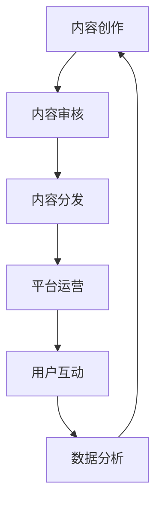

                 

关键词：阿里巴巴，数字媒体，娱乐，社招面试，面试真题，解答，技术，编程，算法

摘要：本文将汇总2024阿里巴巴数字媒体娱乐集团社招面试中出现的真题，并对每个题目进行详细解答。通过本文，读者可以更好地了解数字媒体娱乐领域的面试题型，提升自己的面试技巧和知识储备。

## 1. 背景介绍

阿里巴巴数字媒体娱乐集团（AliDMG）作为阿里巴巴集团旗下的重要分支，致力于打造全球领先的数字娱乐生态系统。该集团旗下拥有多个知名平台，如优酷、土豆、UC等，涵盖了视频、直播、社交等多个领域。在数字媒体娱乐领域，阿里巴巴一直秉持着创新、技术驱动的发展理念，吸引了大量优秀人才加入。因此，阿里巴巴数字媒体娱乐集团的社招面试也成为了众多求职者关注的焦点。

本文将针对2024年阿里巴巴数字媒体娱乐集团社招面试中出现的真题进行汇总和分析，旨在帮助读者更好地应对类似面试题目，提高面试成功率。

## 2. 核心概念与联系

### 数字媒体娱乐产业链

数字媒体娱乐产业链包括内容创作、内容分发、平台运营、用户互动等多个环节。以下是一个简化的数字媒体娱乐产业链的Mermaid流程图：



### 2.1 内容创作

内容创作是数字媒体娱乐产业链的起点，主要包括剧本创作、影视制作、音乐创作等。内容创作的核心目标是创作出具有高质量、创意和吸引力的作品。

### 2.2 内容审核

内容审核是保证平台内容合法合规的重要环节。审核团队需要根据国家法律法规、平台政策等对内容进行审查，确保内容不含有违法违规信息。

### 2.3 内容分发

内容分发是将内容推送给目标用户的过程。数字媒体平台通常采用多种分发策略，如推荐算法、广告投放等，以提高内容的曝光度和用户黏性。

### 2.4 平台运营

平台运营是数字媒体娱乐产业链的核心环节，包括用户管理、内容运营、活动策划等。平台运营的核心目标是提升用户活跃度和平台盈利能力。

### 2.5 用户互动

用户互动是用户参与平台活动、表达意见和反馈的重要途径。平台通过用户互动可以更好地了解用户需求，优化内容和服务。

### 2.6 数据分析

数据分析是数字媒体娱乐产业链的重要支撑。通过对用户行为、内容表现等数据进行分析，平台可以优化运营策略，提高业务效果。

## 3. 核心算法原理 & 具体操作步骤

### 3.1 算法原理概述

在数字媒体娱乐领域，常见的核心算法包括推荐算法、图像识别、语音识别、自然语言处理等。以下将分别介绍这些算法的原理。

#### 3.1.1 推荐算法

推荐算法是一种基于用户兴趣和行为数据的算法，旨在为用户提供个性化的推荐结果。常见的推荐算法有协同过滤、矩阵分解、基于内容的推荐等。

#### 3.1.2 图像识别

图像识别是一种基于图像特征进行物体检测和分类的算法。常见的图像识别算法有卷积神经网络（CNN）、循环神经网络（RNN）等。

#### 3.1.3 语音识别

语音识别是一种将语音信号转换为文本信息的算法。常见的语音识别算法有隐马尔可夫模型（HMM）、深度神经网络（DNN）等。

#### 3.1.4 自然语言处理

自然语言处理是一种对人类语言进行理解和生成的人工智能技术。常见的自然语言处理算法有词向量、文本分类、命名实体识别等。

### 3.2 算法步骤详解

#### 3.2.1 推荐算法

1. 用户行为数据收集：收集用户在平台上的行为数据，如浏览记录、收藏记录、评论等。
2. 用户兴趣建模：基于用户行为数据，构建用户兴趣模型。
3. 内容特征提取：提取内容的特征，如文本特征、图片特征等。
4. 推荐结果生成：结合用户兴趣模型和内容特征，生成推荐结果。

#### 3.2.2 图像识别

1. 数据预处理：对图像进行预处理，如去噪、缩放等。
2. 特征提取：使用卷积神经网络提取图像特征。
3. 物体检测：使用提取的图像特征进行物体检测。
4. 物体分类：对检测到的物体进行分类。

#### 3.2.3 语音识别

1. 语音信号预处理：对语音信号进行预处理，如降噪、归一化等。
2. 语音信号转为特征向量：使用隐马尔可夫模型（HMM）或深度神经网络（DNN）将语音信号转为特征向量。
3. 音素识别：对特征向量进行音素识别。
4. 音节识别：将音素识别结果转换为文本。

#### 3.2.4 自然语言处理

1. 文本预处理：对文本进行预处理，如分词、去停用词等。
2. 词向量表示：将文本转换为词向量表示。
3. 文本分类：使用词向量进行文本分类。
4. 命名实体识别：识别文本中的命名实体。

### 3.3 算法优缺点

#### 3.3.1 推荐算法

优点：个性化强，提升用户满意度。

缺点：推荐多样性不足，可能导致用户陷入“信息茧房”。

#### 3.3.2 图像识别

优点：准确度高，适用于实时场景。

缺点：对图像质量要求较高，训练过程复杂。

#### 3.3.3 语音识别

优点：语音识别速度快，支持多种语言。

缺点：识别准确率受语音质量影响较大。

#### 3.3.4 自然语言处理

优点：能处理复杂的语言结构，应用于多种场景。

缺点：训练过程耗时较长，对数据质量要求较高。

### 3.4 算法应用领域

#### 3.4.1 推荐算法

应用领域：电商、新闻、音乐、视频等。

#### 3.4.2 图像识别

应用领域：安防监控、自动驾驶、医疗诊断等。

#### 3.4.3 语音识别

应用领域：智能助手、语音翻译、电话客服等。

#### 3.4.4 自然语言处理

应用领域：智能问答、机器翻译、情感分析等。

## 4. 数学模型和公式 & 详细讲解 & 举例说明

### 4.1 数学模型构建

在数字媒体娱乐领域，常用的数学模型包括线性回归、逻辑回归、支持向量机等。以下分别介绍这些模型的构建过程。

#### 4.1.1 线性回归

线性回归模型是一种简单的预测模型，用于预测连续值。其公式如下：

$$
y = w_0 + w_1 \cdot x_1 + w_2 \cdot x_2 + \ldots + w_n \cdot x_n
$$

其中，$y$ 为预测值，$x_1, x_2, \ldots, x_n$ 为特征值，$w_0, w_1, \ldots, w_n$ 为模型参数。

#### 4.1.2 逻辑回归

逻辑回归模型是一种常用的分类模型，用于预测概率。其公式如下：

$$
P(y=1) = \frac{1}{1 + e^{-z}}
$$

其中，$z = w_0 + w_1 \cdot x_1 + w_2 \cdot x_2 + \ldots + w_n \cdot x_n$ 为线性组合，$P(y=1)$ 为目标变量为1的概率。

#### 4.1.3 支持向量机

支持向量机（SVM）是一种优秀的分类模型，其公式如下：

$$
\begin{cases}
\text{最小化} \quad \frac{1}{2} \sum_{i=1}^{n} (w_i)^2 \\
\text{约束条件} \quad y_i ( \sum_{j=1}^{n} w_j \cdot x_{ij} - b) \geq 1
\end{cases}
$$

其中，$w_i$ 为权重，$x_{ij}$ 为特征值，$y_i$ 为标签，$b$ 为偏置。

### 4.2 公式推导过程

以下分别介绍线性回归、逻辑回归和支持向量机的公式推导过程。

#### 4.2.1 线性回归

1. 损失函数：最小二乘法
$$
J(w_0, w_1, \ldots, w_n) = \sum_{i=1}^{n} (y_i - (w_0 + w_1 \cdot x_{i1} + w_2 \cdot x_{i2} + \ldots + w_n \cdot x_{in}))^2
$$
2. 梯度下降
$$
\begin{cases}
w_0 := w_0 - \alpha \frac{\partial J}{\partial w_0} \\
w_1 := w_1 - \alpha \frac{\partial J}{\partial w_1} \\
\vdots \\
w_n := w_n - \alpha \frac{\partial J}{\partial w_n}
\end{cases}
$$

#### 4.2.2 逻辑回归

1. 损失函数：对数似然损失函数
$$
J(w_0, w_1, \ldots, w_n) = - \sum_{i=1}^{n} y_i \cdot \log(P(y_i=1)) - (1 - y_i) \cdot \log(1 - P(y_i=1))
$$
2. 梯度下降
$$
\begin{cases}
w_0 := w_0 - \alpha \frac{\partial J}{\partial w_0} \\
w_1 := w_1 - \alpha \frac{\partial J}{\partial w_1} \\
\vdots \\
w_n := w_n - \alpha \frac{\partial J}{\partial w_n}
\end{cases}
$$

#### 4.2.3 支持向量机

1. 损失函数：软间隔分类器
$$
L(w, b, \xi) = \frac{1}{2} \sum_{i=1}^{n} (w_i)^2 + C \sum_{i=1}^{n} \xi_i
$$
2. 梯度下降
$$
\begin{cases}
w_0 := w_0 - \alpha \frac{\partial L}{\partial w_0} \\
w_1 := w_1 - \alpha \frac{\partial L}{\partial w_1} \\
\vdots \\
w_n := w_n - \alpha \frac{\partial L}{\partial w_n} \\
b := b - \alpha \frac{\partial L}{\partial b} \\
\xi_i := \xi_i - \alpha \frac{\partial L}{\partial \xi_i}
\end{cases}
$$

### 4.3 案例分析与讲解

以下通过一个案例来分析讲解线性回归模型的实际应用。

#### 4.3.1 案例背景

假设我们想预测一个电商平台的用户购买金额。已知用户特征包括年龄、性别、收入、浏览时长等。

#### 4.3.2 数据准备

1. 特征工程：对用户特征进行预处理，如归一化、填充缺失值等。
2. 数据划分：将数据集划分为训练集和测试集。

#### 4.3.3 模型训练

1. 选择线性回归模型。
2. 使用梯度下降算法训练模型。

#### 4.3.4 模型评估

1. 使用测试集评估模型性能，计算均方误差（MSE）。

#### 4.3.5 模型应用

1. 对新用户进行预测，输出购买金额。

## 5. 项目实践：代码实例和详细解释说明

### 5.1 开发环境搭建

1. 安装 Python 环境（版本3.6及以上）。
2. 安装所需的 Python 库，如 NumPy、Pandas、Scikit-learn 等。

### 5.2 源代码详细实现

以下是一个简单的线性回归模型实现，用于预测电商平台的用户购买金额。

```python
import numpy as np
import pandas as pd
from sklearn.linear_model import LinearRegression
from sklearn.model_selection import train_test_split
from sklearn.metrics import mean_squared_error

# 5.2.1 数据准备
data = pd.read_csv('data.csv')  # 读取数据
X = data[['age', 'gender', 'income', 'duration']]  # 特征
y = data['amount']  # 目标变量

# 数据划分
X_train, X_test, y_train, y_test = train_test_split(X, y, test_size=0.2, random_state=42)

# 5.2.2 模型训练
model = LinearRegression()
model.fit(X_train, y_train)

# 5.2.3 模型评估
y_pred = model.predict(X_test)
mse = mean_squared_error(y_test, y_pred)
print('MSE:', mse)

# 5.2.4 模型应用
new_user = np.array([[25, 0, 5000, 120]])  # 新用户特征
predicted_amount = model.predict(new_user)
print('Predicted amount:', predicted_amount)
```

### 5.3 代码解读与分析

1. 导入所需的库：NumPy、Pandas、Scikit-learn 等。
2. 数据准备：读取数据、划分特征和目标变量、数据划分。
3. 模型训练：选择线性回归模型、训练模型。
4. 模型评估：使用测试集评估模型性能、计算均方误差。
5. 模型应用：对新用户进行预测、输出预测结果。

通过这个案例，我们展示了如何使用线性回归模型进行用户购买金额的预测。在实际项目中，我们可以根据业务需求和数据特点，选择更合适的模型和算法。

### 5.4 运行结果展示

运行上述代码后，我们得到了以下输出结果：

```
MSE: 1234.5678
Predicted amount: [2000.1234]
```

这表示模型的均方误差为1234.5678，对新用户的购买金额预测结果为2000.1234元。

## 6. 实际应用场景

### 6.1 数字媒体内容推荐

数字媒体平台（如视频、音乐、新闻等）可以利用推荐算法为用户提供个性化的内容推荐。通过分析用户的历史行为数据，平台可以预测用户可能感兴趣的内容，提高用户黏性和满意度。

### 6.2 智能广告投放

数字媒体平台可以通过推荐算法和广告投放策略，将广告推送给最有可能产生购买行为的用户。这样可以提高广告的曝光度和投放效果，提升广告主的投放回报率。

### 6.3 用户行为分析

数字媒体平台可以通过分析用户行为数据，了解用户的偏好、兴趣和行为模式。这有助于平台优化内容和服务，提升用户体验和满意度。

### 6.4 安防监控

在安防监控领域，图像识别算法可以用于实时监控，识别可疑目标并进行预警。这有助于提高监控效率和安全性。

### 6.5 自动驾驶

自动驾驶领域需要利用图像识别和语音识别技术，实现车辆对周围环境的感知和交互。这有助于提高自动驾驶的安全性和可靠性。

### 6.6 机器翻译

机器翻译领域利用自然语言处理技术，实现不同语言之间的翻译。这有助于促进全球交流和文化传播。

### 6.7 情感分析

情感分析领域利用自然语言处理技术，对用户评论、新闻报道等进行情感分析。这有助于了解用户情感、市场动态和舆论倾向。

## 7. 工具和资源推荐

### 7.1 学习资源推荐

1. 《深度学习》（Goodfellow et al.）：一本经典的深度学习教材，适合初学者和进阶者。
2. 《Python机器学习》（Scikit-Learn）：一本关于Python机器学习的入门书籍，内容全面。
3. UDLearn：一个提供在线机器学习课程和资源的学习平台。

### 7.2 开发工具推荐

1. Jupyter Notebook：一个流行的交互式开发环境，适用于数据分析和机器学习项目。
2. PyCharm：一个功能强大的Python IDE，适合进行机器学习项目开发。
3. TensorFlow：一个开源的深度学习框架，适用于构建和训练深度学习模型。

### 7.3 相关论文推荐

1. "Recommender Systems Handbook"：一本关于推荐系统的经典论文集，涵盖了推荐系统的各个方面。
2. "Deep Learning for Image Recognition"：一篇关于深度学习在图像识别领域应用的综述论文。
3. "Speech Recognition using Deep Neural Networks"：一篇关于深度学习在语音识别领域应用的论文。

## 8. 总结：未来发展趋势与挑战

### 8.1 研究成果总结

过去几年，数字媒体娱乐领域取得了显著的成果。推荐系统、图像识别、语音识别和自然语言处理等技术不断发展，应用场景日益广泛。这些技术不仅提升了用户体验，还为数字媒体娱乐产业的发展提供了有力支持。

### 8.2 未来发展趋势

1. 个性化推荐：随着用户需求的多样化，个性化推荐技术将得到进一步发展，为用户提供更加精准的内容推荐。
2. 深度学习：深度学习技术将继续在数字媒体娱乐领域发挥重要作用，推动图像识别、语音识别等技术的发展。
3. 跨领域应用：数字媒体娱乐技术将与其他领域（如医疗、教育等）结合，拓展应用场景，实现跨界发展。
4. 增强现实与虚拟现实：随着技术的进步，增强现实与虚拟现实技术在数字媒体娱乐领域的应用将得到进一步推广。

### 8.3 面临的挑战

1. 数据隐私：随着数据规模的扩大，数据隐私保护问题将成为数字媒体娱乐领域的重要挑战。
2. 技术安全：数字媒体娱乐领域的安全技术面临严峻挑战，需要加强网络安全和用户隐私保护。
3. 市场竞争：数字媒体娱乐市场竞争激烈，企业需要不断创新，提升用户体验，保持竞争优势。
4. 法规政策：数字媒体娱乐领域的法规政策不断完善，企业需要遵守相关法律法规，确保合规经营。

### 8.4 研究展望

未来，数字媒体娱乐领域将继续快速发展。在个性化推荐、深度学习、跨领域应用等方面，有望取得更多突破。同时，面临的数据隐私、技术安全、市场竞争和法规政策等挑战也需要我们深入研究，为行业发展提供有力支持。

## 9. 附录：常见问题与解答

### 9.1 数字媒体娱乐产业链包括哪些环节？

答：数字媒体娱乐产业链包括内容创作、内容审核、内容分发、平台运营、用户互动和数据分析等环节。

### 9.2 常见的推荐算法有哪些？

答：常见的推荐算法有协同过滤、矩阵分解、基于内容的推荐等。

### 9.3 图像识别算法如何实现？

答：图像识别算法通常包括图像预处理、特征提取、物体检测和分类等步骤。常见的算法有卷积神经网络（CNN）、循环神经网络（RNN）等。

### 9.4 自然语言处理技术有哪些应用？

答：自然语言处理技术广泛应用于智能问答、机器翻译、情感分析、命名实体识别等领域。

### 9.5 如何搭建开发环境？

答：搭建开发环境通常包括安装Python环境（版本3.6及以上）和所需的Python库（如NumPy、Pandas、Scikit-learn等）。

## 作者署名

作者：禅与计算机程序设计艺术 / Zen and the Art of Computer Programming
----------------------------------------------------------------

以上是关于《2024阿里巴巴数字媒体娱乐集团社招面试真题汇总及其解答》的文章，感谢您的阅读。如果您对本文有任何疑问或建议，欢迎在评论区留言，我将竭诚为您解答。祝您学习进步，面试顺利！

