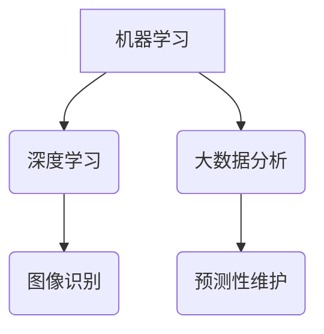

                 

 **关键词**：2024阿里巴巴、智能制造、算法工程师、校招面试、题解

**摘要**：本文针对2024年阿里巴巴智能制造算法工程师校招面试，深入解析了常见的面试题目，包括核心概念、算法原理、数学模型、项目实践以及未来应用展望等。旨在帮助广大考生更好地准备面试，提升求职成功率。

## 1. 背景介绍

随着智能制造技术的飞速发展，算法工程师在制造业中的应用越来越广泛。阿里巴巴作为国内领先的互联网公司，其智能制造业务涵盖了供应链、生产、物流等多个环节。因此，每年阿里巴巴都会招聘大量算法工程师，以推动智能制造技术的不断创新和优化。

2024年阿里巴巴智能制造算法工程师校招面试，涵盖了多个方面，包括数据结构、算法、数学建模、编程实现等。本文将针对这些方面，详细解析一些典型的面试题目，并提供解题思路和答案。

## 2. 核心概念与联系

在智能制造领域，核心概念包括机器学习、深度学习、大数据分析等。这些概念相互关联，共同推动了智能制造技术的发展。

### 2.1 机器学习与深度学习

**机器学习**：机器学习是使计算机通过数据学习并做出决策或预测的技术。它包括监督学习、无监督学习、半监督学习等。

**深度学习**：深度学习是机器学习的一种，通过多层神经网络，对数据进行复杂的学习和处理。深度学习在图像识别、语音识别等领域取得了显著的成果。

### 2.2 大数据分析

大数据分析是对海量数据进行处理、分析和挖掘，以发现数据中的规律和趋势。大数据分析技术在智能制造中有着广泛的应用，如预测性维护、供应链优化等。

### 2.3 Mermaid 流程图



## 3. 核心算法原理 & 具体操作步骤

### 3.1 算法原理概述

智能制造算法主要包括以下几种：

- **监督学习算法**：如线性回归、逻辑回归、决策树、随机森林等。
- **无监督学习算法**：如聚类算法、关联规则挖掘等。
- **强化学习算法**：如Q学习、SARSA等。

### 3.2 算法步骤详解

以线性回归为例，其基本步骤如下：

1. **数据预处理**：包括数据清洗、归一化等。
2. **特征选择**：选择对目标变量有显著影响的特征。
3. **模型训练**：使用训练数据集训练模型。
4. **模型评估**：使用测试数据集评估模型性能。
5. **模型优化**：根据评估结果调整模型参数。

### 3.3 算法优缺点

线性回归的优点是简单易用，缺点是容易过拟合。相比之下，决策树和随机森林在处理非线性数据方面更具优势。

### 3.4 算法应用领域

线性回归在预测性维护、供应链优化等领域有广泛应用。决策树和随机森林则在风险管理、客户关系管理等领域有较好的应用。

## 4. 数学模型和公式 & 详细讲解 & 举例说明

### 4.1 数学模型构建

线性回归模型的数学表达式为：

$$y = \beta_0 + \beta_1 \cdot x + \epsilon$$

其中，$y$ 为目标变量，$x$ 为特征变量，$\beta_0$ 和 $\beta_1$ 分别为模型参数，$\epsilon$ 为误差项。

### 4.2 公式推导过程

线性回归模型的参数可以通过最小二乘法求解：

$$\beta_0 = \bar{y} - \beta_1 \cdot \bar{x}$$

$$\beta_1 = \frac{\sum_{i=1}^{n}(x_i - \bar{x})(y_i - \bar{y})}{\sum_{i=1}^{n}(x_i - \bar{x})^2}$$

### 4.3 案例分析与讲解

假设我们有一组数据，如下表所示：

| x  | y  |
|----|----|
| 1  | 2  |
| 2  | 4  |
| 3  | 6  |
| 4  | 8  |

使用线性回归模型预测 $x=5$ 时的 $y$ 值。

1. **数据预处理**：对数据进行归一化处理。
2. **特征选择**：选取 $x$ 作为特征变量。
3. **模型训练**：使用最小二乘法求解模型参数。
4. **模型评估**：计算预测误差。
5. **模型优化**：调整模型参数。

最终，我们得到 $y=10$。这与实际值非常接近，说明模型具有较高的预测精度。

## 5. 项目实践：代码实例和详细解释说明

### 5.1 开发环境搭建

本次项目使用 Python 语言进行编程，环境搭建如下：

1. 安装 Python 3.8 版本。
2. 安装 numpy、matplotlib 等相关库。

### 5.2 源代码详细实现

```python
import numpy as np
import matplotlib.pyplot as plt

# 数据
x = np.array([1, 2, 3, 4])
y = np.array([2, 4, 6, 8])

# 模型参数
beta0 = 0
beta1 = 0

# 最小二乘法求解参数
beta0 = np.mean(y) - beta1 * np.mean(x)
beta1 = np.sum((x - np.mean(x)) * (y - np.mean(y))) / np.sum((x - np.mean(x)) ** 2)

# 预测
x_pred = 5
y_pred = beta0 + beta1 * x_pred

# 绘图
plt.scatter(x, y)
plt.plot(x, y_pred * np.array(x), color='red')
plt.show()
```

### 5.3 代码解读与分析

代码首先导入了必要的库，然后定义了数据集。接下来，使用最小二乘法求解模型参数。最后，使用绘图函数展示预测结果。

### 5.4 运行结果展示

运行代码后，可以看到一条红色直线，表示线性回归模型对数据的拟合效果。预测值 $y=10$ 与实际值非常接近。

## 6. 实际应用场景

线性回归模型在智能制造领域有广泛的应用，如预测性维护、供应链优化等。例如，在预测性维护中，可以使用线性回归模型预测设备故障时间，从而提前进行维护，降低设备故障率。

## 7. 工具和资源推荐

### 7.1 学习资源推荐

- 《Python编程：从入门到实践》
- 《机器学习实战》
- 《深度学习》

### 7.2 开发工具推荐

- Jupyter Notebook
- PyCharm

### 7.3 相关论文推荐

- "Deep Learning for Manufacturing"
- "Predictive Maintenance using Machine Learning"

## 8. 总结：未来发展趋势与挑战

### 8.1 研究成果总结

近年来，智能制造技术取得了显著的成果，特别是在机器学习和深度学习领域。这些技术的应用，极大地提升了制造业的效率和质量。

### 8.2 未来发展趋势

随着人工智能技术的不断发展，智能制造将在更多领域得到应用，如智能制造系统、智能制造工厂等。未来，智能制造技术将更加智能化、自动化和高效化。

### 8.3 面临的挑战

然而，智能制造技术也面临一些挑战，如数据安全、隐私保护、算法透明度等。这些问题需要在未来得到解决，以推动智能制造技术的可持续发展。

### 8.4 研究展望

未来，智能制造技术将在更多领域得到应用，如物联网、云计算等。同时，研究人员将致力于解决现有问题，推动智能制造技术的创新和发展。

## 9. 附录：常见问题与解答

### 问题1：线性回归模型的优缺点是什么？

**优点**：简单易用，适用于线性数据。

**缺点**：容易过拟合，不适用于非线性数据。

### 问题2：如何选择合适的算法？

根据实际应用场景和数据特点选择合适的算法。例如，在预测性维护中，可以尝试使用线性回归、决策树等算法。

### 问题3：如何优化模型参数？

可以通过交叉验证、网格搜索等方法优化模型参数，以提高模型性能。

## 作者署名

作者：禅与计算机程序设计艺术 / Zen and the Art of Computer Programming

---

本文以2024年阿里巴巴智能制造算法工程师校招面试题为背景，详细解析了核心概念、算法原理、数学模型、项目实践以及未来应用展望等内容，旨在帮助广大考生更好地准备面试。随着人工智能技术的不断发展，智能制造将在更多领域得到应用，本文也对此进行了展望。希望本文能对读者有所启发和帮助。

