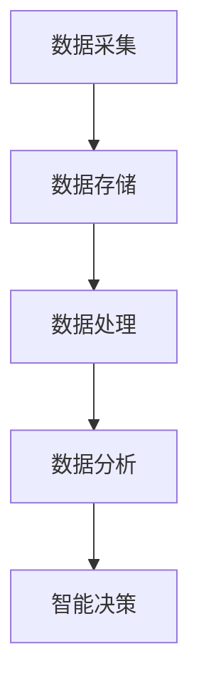

                 

关键词：阿里巴巴、智能客户洞察、面试真题、汇总、解答、AI、数据分析

## 摘要

本文旨在汇总和解析2024年阿里巴巴智能客户洞察社招的面试真题，通过对这些题目的深入探讨，为准备面试的求职者提供有益的参考和策略。文章将分为多个部分，涵盖背景介绍、核心概念、算法原理、数学模型、项目实践、实际应用场景、工具资源推荐以及未来展望等内容。通过这篇全面的技术博客，希望能够帮助读者更好地理解面试内容，提升面试成功率。

## 1. 背景介绍

阿里巴巴集团作为中国最大的电子商务公司之一，一直以其强大的技术能力和创新思维引领行业。智能客户洞察作为其核心竞争力之一，旨在通过大数据分析和人工智能技术，帮助企业更好地理解客户需求，提升用户体验和商业价值。2024年，阿里巴巴进行了多次社会招聘，针对智能客户洞察岗位推出了多项面试真题，这些题目不仅考察了求职者的技术能力，还测试了他们对实际问题的分析和解决能力。

## 2. 核心概念与联系

### 2.1 智能客户洞察的基本概念

智能客户洞察涉及多个技术领域，包括数据挖掘、机器学习、自然语言处理和推荐系统等。核心概念包括：

- **客户行为分析**：通过收集和分析客户在网站、应用等平台上的行为数据，了解用户喜好和需求。
- **数据挖掘**：从大量数据中提取有价值的信息和模式。
- **机器学习**：利用算法自动发现数据中的规律，进行预测和决策。
- **推荐系统**：根据用户的历史行为和偏好，为用户推荐相关商品或服务。

### 2.2 架构原理

智能客户洞察的架构通常包括数据采集、数据存储、数据处理和数据分析四个主要模块。以下是一个简化的Mermaid流程图，展示各模块之间的关系：



### 2.3 技术联系

各个模块之间通过数据流紧密连接。数据采集模块负责收集各种来源的数据，如用户行为数据、交易数据和社交媒体数据。数据存储模块将这些数据进行存储和管理。数据处理模块对数据进行清洗、转换和集成，使其适合分析和建模。数据分析模块利用机器学习和数据挖掘技术，提取有价值的信息，并通过推荐系统和智能决策模块将结果应用到实际业务中。

## 3. 核心算法原理 & 具体操作步骤

### 3.1 算法原理概述

智能客户洞察的核心算法包括聚类算法、分类算法和协同过滤算法等。每种算法都有其独特的原理和应用场景。

- **聚类算法**：如K-means算法，通过将数据点分为K个簇，使得同一簇内的数据点之间距离最小，不同簇之间的距离最大。
- **分类算法**：如决策树、随机森林和支持向量机等，通过对特征进行组合，将数据点分类到不同的类别中。
- **协同过滤算法**：如基于用户和基于物品的协同过滤，通过分析用户或物品之间的相似度，进行推荐。

### 3.2 算法步骤详解

以K-means算法为例，其具体操作步骤如下：

1. **初始化**：随机选择K个数据点作为初始中心点。
2. **分配数据点**：计算每个数据点到各个中心点的距离，将数据点分配到最近的中心点所在的簇中。
3. **更新中心点**：计算每个簇的中心点，即将簇内所有数据点的平均值作为新的中心点。
4. **迭代**：重复步骤2和3，直到中心点不再发生显著变化或达到预设的迭代次数。

### 3.3 算法优缺点

- **K-means算法**：
  - **优点**：简单、易于实现，对初始条件不敏感。
  - **缺点**：对噪声敏感，可能陷入局部最优，不适合处理大型数据集。

### 3.4 算法应用领域

聚类算法广泛应用于市场细分、文本分类和图像分割等领域。分类算法在金融风控、医疗诊断和文本分类等领域有广泛应用。协同过滤算法在推荐系统领域发挥着重要作用，如电子商务平台和社交媒体。

## 4. 数学模型和公式 & 详细讲解 & 举例说明

### 4.1 数学模型构建

智能客户洞察中的数学模型通常包括以下方面：

- **特征工程**：选择和构造与目标相关的特征，如用户行为特征、交易特征和人口统计学特征等。
- **模型训练**：使用监督学习或无监督学习算法，将数据映射到目标函数，并优化模型参数。
- **模型评估**：使用准确率、召回率、F1分数等指标评估模型性能。

### 4.2 公式推导过程

以线性回归模型为例，其基本公式为：

\[ y = \beta_0 + \beta_1 x + \epsilon \]

其中，\( y \) 为目标变量，\( x \) 为自变量，\( \beta_0 \) 和 \( \beta_1 \) 为模型参数，\( \epsilon \) 为误差项。

### 4.3 案例分析与讲解

假设我们使用线性回归模型预测某电商平台的用户购买概率，数据集包含用户的年龄、收入和浏览时长等特征。我们可以通过以下步骤进行模型训练和预测：

1. **数据预处理**：对数据进行标准化处理，使得特征之间的尺度一致。
2. **特征选择**：选择与目标变量相关性较高的特征，如年龄和收入。
3. **模型训练**：使用最小二乘法训练线性回归模型，得到模型参数。
4. **模型评估**：使用测试集评估模型性能，如计算均方误差（MSE）。
5. **预测**：使用训练好的模型对新数据进行预测，输出购买概率。

## 5. 项目实践：代码实例和详细解释说明

### 5.1 开发环境搭建

为了实现智能客户洞察，我们选择Python作为主要编程语言，并使用以下工具和库：

- Python 3.8及以上版本
- Scikit-learn库：用于机器学习算法的实现
- Pandas库：用于数据处理和分析
- Matplotlib库：用于数据可视化

### 5.2 源代码详细实现

以下是一个简单的K-means聚类算法的实现示例：

```python
from sklearn.cluster import KMeans
import pandas as pd

# 读取数据
data = pd.read_csv('data.csv')

# 特征选择
X = data[['age', 'income', ' browsing_time']]

# K-means聚类
kmeans = KMeans(n_clusters=3, random_state=0)
clusters = kmeans.fit_predict(X)

# 输出聚类结果
print(clusters)
```

### 5.3 代码解读与分析

在这个示例中，我们首先读取数据集，选择与目标变量相关的特征。然后，使用Scikit-learn库中的KMeans类实现K-means聚类算法，并将其应用到数据集上。最后，输出聚类结果，得到每个数据点的簇分配。

### 5.4 运行结果展示

在运行上述代码后，我们可以得到每个数据点的簇分配结果。通过可视化工具，如Matplotlib，我们可以将数据点按照簇进行绘制，直观地展示聚类结果。

```python
import matplotlib.pyplot as plt

# 可视化聚类结果
plt.scatter(X['age'], X['income'], c=clusters, cmap='viridis')
plt.xlabel('Age')
plt.ylabel('Income')
plt.title('K-means Clustering')
plt.show()
```

通过可视化，我们可以看到数据点被分为三个簇，每个簇具有不同的颜色。这有助于我们进一步分析不同簇的特点和客户群体。

## 6. 实际应用场景

智能客户洞察在多个实际应用场景中发挥着重要作用，以下是一些典型例子：

- **电商推荐系统**：通过分析用户行为和偏好，为用户推荐相关商品或服务，提升用户满意度和购买转化率。
- **金融风控**：通过分析客户交易数据，识别潜在的风险客户，预防欺诈行为，降低坏账率。
- **医疗诊断**：通过分析患者病历数据，辅助医生进行疾病诊断和治疗决策，提高医疗水平和服务质量。
- **市场营销**：通过分析市场数据和用户反馈，优化营销策略，提升品牌知名度和市场占有率。

## 6.4 未来应用展望

随着人工智能和数据科学技术的不断发展，智能客户洞察的应用前景将更加广阔。未来，我们有望看到：

- **更精细的客户细分**：通过更深入的数据分析和建模，实现更精细的客户细分，为不同客户群体提供个性化服务。
- **自动化决策**：利用机器学习和深度学习技术，实现自动化决策，提高业务效率和准确性。
- **跨界融合**：智能客户洞察与其他领域的深度融合，如物联网、区块链等，为用户提供更全面、更智能的服务。

## 7. 工具和资源推荐

### 7.1 学习资源推荐

- **《Python机器学习》（作者：塞巴斯蒂安·拉赛克）》
- **《深度学习》（作者：伊恩·古德费洛等）》
- **《数据科学入门》（作者：杰瑞·亨德里克斯）》

### 7.2 开发工具推荐

- **Scikit-learn**：用于机器学习算法的实现和评估
- **Pandas**：用于数据处理和分析
- **Matplotlib**：用于数据可视化

### 7.3 相关论文推荐

- **“Recommender Systems Handbook”**
- **“Deep Learning for Recommender Systems”**
- **“Customer Segmentation using Clustering Techniques”**

## 8. 总结：未来发展趋势与挑战

智能客户洞察作为人工智能和数据科学领域的重要组成部分，其发展趋势和挑战包括：

- **数据质量和多样性**：高质量和多样化的数据是智能客户洞察成功的关键，未来需要更加注重数据质量管理和技术创新。
- **算法优化与效率**：随着数据规模的不断扩大，算法的优化和效率将成为重要的研究方向，以支持实时分析和决策。
- **隐私保护**：在利用客户数据的同时，保护用户隐私将成为重要的挑战，需要制定严格的隐私政策和安全技术。

未来，智能客户洞察将继续在各个行业发挥重要作用，为企业和个人带来更大的价值。我们期待看到更多创新技术的涌现，推动这一领域的持续发展。

## 9. 附录：常见问题与解答

### Q1. 什么是智能客户洞察？

A1. 智能客户洞察是指通过大数据分析和人工智能技术，深入分析客户行为和需求，为企业提供更准确的客户画像，从而优化客户服务和市场营销策略。

### Q2. 智能客户洞察的核心算法有哪些？

A2. 智能客户洞察涉及多种算法，包括聚类算法（如K-means）、分类算法（如决策树、支持向量机）和协同过滤算法等。这些算法有助于从大量数据中提取有价值的信息，为决策提供支持。

### Q3. 智能客户洞察在实际应用中面临哪些挑战？

A3. 智能客户洞察在实际应用中面临数据质量、算法效率、隐私保护和跨领域融合等方面的挑战。需要不断创新技术和优化策略，以应对这些挑战。

### Q4. 如何提升智能客户洞察的效果？

A4. 提升智能客户洞察效果的方法包括：提高数据质量，选择合适的算法，进行特征工程，优化模型参数，以及定期更新和调整模型。

## 作者署名

作者：禅与计算机程序设计艺术 / Zen and the Art of Computer Programming

以上是本文的完整内容，希望对各位读者在面试和技术研究上有所助益。如果您有任何疑问或建议，欢迎在评论区留言讨论。让我们一起探索智能客户洞察的无限可能！

