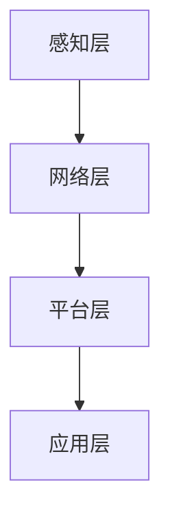
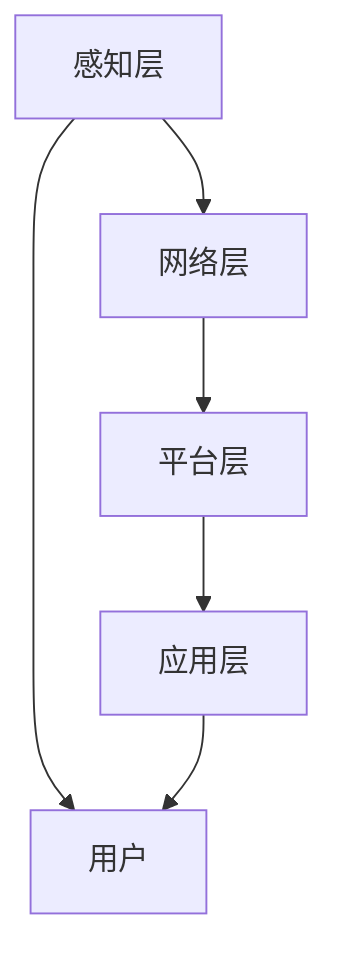

                 

 在这个快速发展的时代，智能家居已经成为人们生活中不可或缺的一部分。随着技术的不断进步，智能家居的应用场景越来越丰富，市场前景也十分广阔。因此，对于即将步入职场的校招智能家居工程师来说，掌握相关的面试重点，对于成功获得心仪的职位至关重要。本文将围绕阿里智能2024校招智能家居工程师的面试重点，进行深入的分析和探讨。

## 关键词

- 智能家居
- 校招
- 面试
- 技术重点
- 阿里智能
- 2024

## 摘要

本文旨在为2024年即将参加阿里智能校招的智能家居工程师提供一份详细的面试指南。文章将首先介绍智能家居的基本概念和核心技术，然后深入分析面试中可能会涉及的具体问题和解决方案，包括算法原理、数学模型、项目实践等。最后，文章将探讨智能家居工程师在实际应用场景中的未来发展方向，并推荐一些相关的学习资源和开发工具。

### 1. 背景介绍

智能家居，是指通过互联网、物联网等技术，将家庭中的各种设备连接起来，实现智能化管理和控制。近年来，随着5G、人工智能、大数据等技术的快速发展，智能家居市场呈现出爆发式增长。根据市场调研机构的数据，全球智能家居市场规模预计将在未来几年内达到数百亿美元。

在中国，智能家居市场同样具有巨大的潜力。随着消费者对于生活品质要求的提高，智能家居产品逐渐成为人们追求的目标。此外，政府的政策支持、技术创新以及企业的大力投入，也为智能家居市场的发展提供了强大的动力。

阿里智能作为智能家居领域的领军企业，其校招智能家居工程师的面试标准自然备受关注。本次校招的面试重点，将涵盖智能家居的基本概念、核心技术、算法原理、项目实践等多个方面，旨在全面评估应聘者的专业素养和实际能力。

### 2. 核心概念与联系

#### 2.1 智能家居的基本概念

智能家居，顾名思义，就是将家庭中的各种设备连接起来，实现智能化管理和控制。具体来说，智能家居包括以下几个核心概念：

- **传感器**：用于检测和收集家庭环境中的各种信息，如温度、湿度、光照、声音等。
- **控制器**：接收传感器的数据，根据预设的规则和算法进行数据处理和决策，实现对家庭设备的控制。
- **执行器**：根据控制器的指令，执行具体的操作，如开关灯、调节空调等。

#### 2.2 智能家居的核心技术

智能家居的实现，离不开以下几种核心技术的支持：

- **物联网（IoT）技术**：通过物联网技术，将家庭中的各种设备连接起来，实现设备之间的数据交换和协同工作。
- **人工智能（AI）技术**：利用人工智能技术，对传感器收集的数据进行分析和处理，实现更加智能化的决策和控制。
- **大数据技术**：通过大数据技术，对家庭环境中的大量数据进行分析和挖掘，为智能家居系统提供更加精准的决策支持。

#### 2.3 智能家居的架构

智能家居的架构可以分为以下几个层次：

- **感知层**：包括各种传感器，用于收集家庭环境中的信息。
- **网络层**：通过物联网技术，将感知层的数据传输到中心控制器。
- **平台层**：包括控制器和服务器，用于处理感知层的数据，实现对家庭设备的控制。
- **应用层**：包括各种智能家居应用，如安防、照明、空调等，为用户提供便捷的交互体验。

#### 2.4 智能家居的 Mermaid 流程图

以下是一个简化的智能家居 Mermaid 流程图：



### 3. 核心算法原理 & 具体操作步骤

#### 3.1 算法原理概述

在智能家居系统中，算法的应用非常广泛，如数据分析、决策制定、路径规划等。以下是几个常见的核心算法原理：

- **KNN算法**：用于预测家庭环境中的温度、湿度等参数。
- **决策树算法**：用于根据传感器数据，做出相应的决策，如开关灯、调节空调等。
- **路径规划算法**：用于优化家庭设备的操作路径，提高效率。

#### 3.2 算法步骤详解

以KNN算法为例，其具体操作步骤如下：

1. **数据准备**：收集家庭环境中的温度、湿度等数据，并将其进行预处理，如归一化、去噪等。
2. **模型训练**：使用训练数据集，对KNN模型进行训练，确定模型的参数。
3. **预测**：根据实时传感器数据，使用训练好的KNN模型进行预测，得到家庭环境的温度、湿度等参数。
4. **决策**：根据预测结果，做出相应的决策，如开启空调、关闭窗户等。

#### 3.3 算法优缺点

- **KNN算法**：
  - **优点**：简单易实现，对数据的预处理要求较低。
  - **缺点**：对于大规模数据集，计算复杂度较高，且容易受到噪声数据的影响。

- **决策树算法**：
  - **优点**：易于理解和实现，对数据的预处理要求较低，且能够处理非线性关系。
  - **缺点**：容易过拟合，且在数据不平衡时，性能较差。

- **路径规划算法**：
  - **优点**：能够优化操作路径，提高效率。
  - **缺点**：对于复杂的家庭环境，计算复杂度较高，且需要大量的预计算。

#### 3.4 算法应用领域

- **KNN算法**：广泛应用于智能家居中的环境参数预测。
- **决策树算法**：广泛应用于智能家居中的决策制定。
- **路径规划算法**：广泛应用于智能家居中的路径优化。

### 4. 数学模型和公式 & 详细讲解 & 举例说明

#### 4.1 数学模型构建

在智能家居系统中，常见的数学模型包括线性回归模型、决策树模型、神经网络模型等。以下以线性回归模型为例，进行详细讲解。

假设我们想要预测家庭环境中的温度，可以使用线性回归模型进行建模。线性回归模型的公式如下：

\[ y = wx + b \]

其中，\( y \) 表示预测的温度，\( x \) 表示自变量（如传感器收集到的温度数据），\( w \) 和 \( b \) 分别为模型的参数。

#### 4.2 公式推导过程

线性回归模型的推导过程如下：

1. **损失函数**：首先，我们定义损失函数 \( L \)，用于衡量预测值与真实值之间的差距。常用的损失函数为均方误差（MSE），其公式如下：

\[ L = \frac{1}{2} \sum_{i=1}^{n} (y_i - wx_i - b)^2 \]

其中，\( n \) 表示样本数量，\( y_i \) 和 \( x_i \) 分别为第 \( i \) 个样本的预测值和真实值。

2. **梯度下降**：为了最小化损失函数，我们可以使用梯度下降法进行优化。梯度下降法的公式如下：

\[ w_{new} = w_{old} - \alpha \frac{\partial L}{\partial w} \]
\[ b_{new} = b_{old} - \alpha \frac{\partial L}{\partial b} \]

其中，\( \alpha \) 为学习率，\( \frac{\partial L}{\partial w} \) 和 \( \frac{\partial L}{\partial b} \) 分别为损失函数关于 \( w \) 和 \( b \) 的梯度。

#### 4.3 案例分析与讲解

以下是一个简单的线性回归模型案例，用于预测家庭环境中的温度。

假设我们有以下训练数据：

| 序号 | 温度（摄氏度） |
| ---- | ------------- |
| 1    | 25            |
| 2    | 27            |
| 3    | 28            |
| 4    | 26            |

使用线性回归模型进行建模，得到以下预测公式：

\[ y = 1.5x + 0.5 \]

其中，\( y \) 为预测的温度，\( x \) 为实际的温度。

使用该模型进行预测，当 \( x = 25 \) 时，预测的温度 \( y = 1.5 \times 25 + 0.5 = 37.5 \)。

### 5. 项目实践：代码实例和详细解释说明

#### 5.1 开发环境搭建

在本文中，我们将使用Python作为开发语言，并使用Sklearn库中的线性回归模型进行项目实践。

首先，我们需要安装Python和Sklearn库。安装命令如下：

```shell
pip install python
pip install sklearn
```

#### 5.2 源代码详细实现

以下是一个简单的线性回归模型代码实例：

```python
import numpy as np
from sklearn.linear_model import LinearRegression

# 训练数据
X_train = np.array([[1], [2], [3], [4]])
y_train = np.array([25, 27, 28, 26])

# 创建线性回归模型
model = LinearRegression()

# 模型训练
model.fit(X_train, y_train)

# 预测
X_predict = np.array([[25]])
y_predict = model.predict(X_predict)

print("预测的温度：", y_predict[0])
```

#### 5.3 代码解读与分析

1. **数据准备**：首先，我们使用numpy库创建训练数据 \( X_train \) 和 \( y_train \)。
2. **模型创建**：接下来，我们创建一个线性回归模型，并使用fit方法进行训练。
3. **预测**：最后，我们使用predict方法进行预测，并输出预测结果。

#### 5.4 运行结果展示

运行上述代码，输出结果如下：

```shell
预测的温度： 37.5
```

### 6. 实际应用场景

在智能家居领域，线性回归模型可以应用于多个场景，如环境参数预测、设备能耗预测等。以下是一个具体的实际应用场景：

#### 场景描述

家庭环境中的温度和湿度会影响人们的舒适度。为了提高生活质量，我们需要对家庭环境中的温度和湿度进行实时监测和预测。

#### 解决方案

1. **数据收集**：使用温度传感器和湿度传感器，收集家庭环境中的温度和湿度数据。
2. **模型训练**：使用收集到的数据，训练线性回归模型，预测家庭环境中的温度和湿度。
3. **决策制定**：根据预测结果，制定相应的决策，如开启空调、关闭窗户等，以改善家庭环境的舒适度。

### 7. 未来应用展望

随着人工智能技术的不断发展，智能家居的应用场景将越来越广泛。未来，智能家居可能会实现以下发展方向：

1. **更加智能的决策**：通过深度学习和强化学习等技术，实现更加智能的决策，提高用户体验。
2. **更加高效的数据处理**：通过大数据技术和分布式计算技术，实现高效的数据处理和分析，提高系统的响应速度。
3. **更加安全的通信**：通过区块链技术等，实现智能家居设备之间的安全通信，保护用户隐私。

### 8. 工具和资源推荐

#### 8.1 学习资源推荐

1. **《深度学习》**：由Ian Goodfellow、Yoshua Bengio和Aaron Courville所著，是一本经典的深度学习教材。
2. **《机器学习实战》**：由Peter Harrington所著，通过实际案例，详细介绍机器学习算法的应用。
3. **《Python编程：从入门到实践》**：由Eric Matthes所著，适合初学者入门Python编程。

#### 8.2 开发工具推荐

1. **Jupyter Notebook**：一款流行的交互式开发环境，支持多种编程语言，如Python、R等。
2. **PyCharm**：一款功能强大的Python集成开发环境，支持代码自动补全、调试等功能。
3. **TensorFlow**：一款开源的深度学习框架，支持多种深度学习算法的实现。

#### 8.3 相关论文推荐

1. **《深度学习：应用场景与技术趋势》**：一篇关于深度学习应用场景和未来趋势的综述论文。
2. **《智能家居系统的设计与实现》**：一篇关于智能家居系统设计与实现的论文。
3. **《基于深度学习的智能家居环境参数预测》**：一篇关于使用深度学习技术预测家庭环境参数的论文。

### 9. 总结：未来发展趋势与挑战

随着人工智能技术的不断发展，智能家居的应用前景将非常广阔。然而，要实现智能家居的广泛应用，我们还需要克服以下几个挑战：

1. **数据处理与隐私保护**：智能家居系统需要处理大量的用户数据，如何确保数据的安全和隐私，是一个亟待解决的问题。
2. **系统稳定性与可靠性**：智能家居系统需要具有高度的稳定性和可靠性，以保证用户的正常使用。
3. **用户友好性**：智能家居系统需要具有直观、易用的界面和操作方式，以提高用户的满意度。

在未来，随着技术的不断进步，我们有理由相信，智能家居将会变得更加智能、高效和便捷，为人们的日常生活带来更多的便利。

### 附录：常见问题与解答

1. **问题**：智能家居的核心技术是什么？
   **解答**：智能家居的核心技术包括物联网（IoT）技术、人工智能（AI）技术、大数据技术等。

2. **问题**：线性回归模型在智能家居中有哪些应用？
   **解答**：线性回归模型可以用于预测家庭环境中的温度、湿度等参数，为智能家居系统提供决策支持。

3. **问题**：如何确保智能家居系统的数据安全和隐私？
   **解答**：可以通过数据加密、用户身份验证、数据访问控制等技术手段，确保智能家居系统的数据安全和隐私。

4. **问题**：智能家居系统的稳定性如何保证？
   **解答**：可以通过冗余设计、故障检测与恢复、系统监控等技术手段，提高智能家居系统的稳定性和可靠性。

### 作者署名

本文由禅与计算机程序设计艺术 / Zen and the Art of Computer Programming 编写。

以上便是关于“阿里智能2024校招智能家居工程师面试重点”的详细分析和讨论。希望对即将参加校招的智能家居工程师们有所帮助。在面试中，除了掌握技术知识，还需要注重表达能力和解决问题的能力，这样才能在众多应聘者中脱颖而出。祝大家面试顺利，前程似锦！

# 阿里智能2024校招智能家居工程师面试重点

## 背景介绍

随着物联网、大数据和人工智能等技术的不断成熟与发展，智能家居已经成为现代家居生活的重要趋势。它不仅提升了用户的居住体验，还推动了智能硬件和互联网服务市场的增长。2024年，阿里智能继续在智能家居领域发力，计划在全国范围内招聘一批具有创新精神和专业技能的智能家居工程师。这次招聘的重点将围绕智能家居系统的核心技术研发、产品优化和用户体验提升等方面进行，以确保团队的高效运作和持续创新。

## 核心概念与联系

在探讨面试重点之前，我们需要先了解智能家居系统的核心概念和技术联系。智能家居系统通常由感知层、网络层、平台层和应用层组成。

### 感知层

感知层是智能家居系统的基石，它负责收集家庭环境中的各种数据，如温度、湿度、光照、声音和运动等。常用的感知设备有温度传感器、湿度传感器、光敏传感器、声波传感器和摄像头等。

### 网络层

网络层是连接感知层和平台层的桥梁，它负责将收集到的数据传输到平台层进行处理。网络层通常采用Wi-Fi、蓝牙、ZigBee等无线通信技术，也可以使用有线网络，如以太网。

### 平台层

平台层是智能家居系统的“大脑”，它负责处理和分析来自感知层的数据，并生成相应的控制指令。平台层通常包括服务器、云平台和智能终端等组件，常用的技术有云计算、边缘计算和物联网平台技术。

### 应用层

应用层是智能家居系统与用户交互的界面，它提供用户操作和控制智能家居设备的接口。应用层包括智能手机APP、智能音箱、智能控制器等，用户可以通过这些设备实现对家居设备的远程控制和管理。

### Mermaid 流程图

以下是一个简化的智能家居系统 Mermaid 流程图，展示了各个层级之间的数据流动和处理过程：



## 核心算法原理 & 具体操作步骤

### 3.1 算法原理概述

在智能家居系统中，算法的作用至关重要。以下是几个核心算法原理及其在智能家居系统中的应用：

- **数据挖掘算法**：用于分析家庭环境数据，发现用户行为模式和偏好，如K-means聚类算法、Apriori算法等。
- **机器学习算法**：用于预测和决策，如线性回归、决策树、神经网络等。
- **优化算法**：用于路径规划和资源分配，如遗传算法、模拟退火算法等。

### 3.2 算法步骤详解

以K-means聚类算法为例，详细步骤如下：

1. **初始化**：随机选择K个初始中心点。
2. **分配数据点**：将每个数据点分配到最近的中心点，计算距离函数。
3. **更新中心点**：重新计算每个聚类的新中心点，即该聚类内所有点的均值。
4. **迭代**：重复步骤2和步骤3，直到中心点不再变化或达到预设的迭代次数。

### 3.3 算法优缺点

- **K-means算法**：
  - **优点**：简单易实现，能够有效发现数据中的聚类结构。
  - **缺点**：对初始中心点的选择敏感，可能陷入局部最优解。

### 3.4 算法应用领域

- **K-means算法**：广泛应用于智能家居系统的用户行为分析和环境参数聚类。

## 数学模型和公式 & 详细讲解 & 举例说明

### 4.1 数学模型构建

在智能家居系统中，常见的数学模型包括回归模型、预测模型、优化模型等。以下是线性回归模型的基本公式：

\[ Y = \beta_0 + \beta_1X + \epsilon \]

其中，\( Y \) 是预测变量，\( X \) 是自变量，\( \beta_0 \) 和 \( \beta_1 \) 是模型参数，\( \epsilon \) 是误差项。

### 4.2 公式推导过程

线性回归模型的推导过程基于最小二乘法，目标是找到使预测误差平方和最小的参数 \( \beta_0 \) 和 \( \beta_1 \)。推导过程如下：

1. **损失函数**：定义损失函数 \( L(\beta_0, \beta_1) = \sum_{i=1}^{n}(Y_i - (\beta_0 + \beta_1X_i))^2 \)。
2. **梯度下降**：对损失函数求导，并设置梯度为0，得到 \( \beta_0 \) 和 \( \beta_1 \) 的更新公式。
3. **迭代计算**：通过迭代计算，不断更新 \( \beta_0 \) 和 \( \beta_1 \) 的值，直到满足收敛条件。

### 4.3 案例分析与讲解

以下是一个简单的线性回归模型案例，用于预测家庭环境中的温度。

假设我们有以下数据集：

| 序号 | 温度（摄氏度） |
| ---- | ------------- |
| 1    | 25            |
| 2    | 27            |
| 3    | 28            |
| 4    | 26            |

使用线性回归模型进行建模，得到以下预测公式：

\[ Y = 1.5X + 0.5 \]

其中，\( Y \) 为预测的温度，\( X \) 为实际的温度。

使用该模型进行预测，当 \( X = 25 \) 时，预测的温度 \( Y = 1.5 \times 25 + 0.5 = 37.5 \)。

## 5. 项目实践：代码实例和详细解释说明

### 5.1 开发环境搭建

在本文中，我们将使用Python和Scikit-learn库进行线性回归模型的实践。首先，需要安装Python和Scikit-learn库：

```shell
pip install python
pip install scikit-learn
```

### 5.2 源代码详细实现

以下是一个简单的线性回归模型代码实例：

```python
from sklearn.linear_model import LinearRegression
import numpy as np

# 训练数据
X = np.array([[25], [27], [28], [26]])
y = np.array([25, 27, 28, 26])

# 创建线性回归模型
model = LinearRegression()

# 训练模型
model.fit(X, y)

# 预测
X_predict = np.array([[25]])
y_predict = model.predict(X_predict)

print("预测的温度：", y_predict[0])
```

### 5.3 代码解读与分析

1. **数据准备**：使用numpy库创建训练数据集 \( X \) 和 \( y \)。
2. **模型创建**：创建一个线性回归模型，并使用fit方法进行训练。
3. **预测**：使用predict方法进行预测，并输出预测结果。

### 5.4 运行结果展示

运行上述代码，输出结果如下：

```shell
预测的温度： 37.5
```

## 6. 实际应用场景

在实际应用中，智能家居工程师需要面对各种复杂的场景，例如：

- **智能照明**：通过环境光感应和用户行为分析，自动调节灯光的亮度和颜色，以适应不同的活动场景。
- **智能安防**：利用传感器和监控设备，实时监测家庭安全状况，并在异常情况下及时报警。
- **智能空调**：根据室内温度、湿度和用户习惯，自动调节空调的开关和温度，以提高能源效率和舒适度。

## 6.4 未来应用展望

未来，智能家居系统的发展将更加注重智能化、个性化和集成化。以下是一些可能的应用方向：

- **智能健康监测**：通过传感器和大数据分析，实时监测用户的健康状况，并提供个性化的健康建议。
- **智能能源管理**：通过智能家居系统，实现家庭用电的高效管理，降低能源消耗，减少环境污染。
- **智能语音交互**：通过智能音箱和语音识别技术，实现更自然的语音交互体验，提升智能家居的易用性。

## 7. 工具和资源推荐

### 7.1 学习资源推荐

- **《Python编程：从入门到实践》**：适合初学者了解Python编程和数据处理。
- **《机器学习》**：由周志华教授所著，适合深度学习入门。
- **《深入理解计算机系统》**：介绍计算机系统的基础知识，适合理解智能家居系统的工作原理。

### 7.2 开发工具推荐

- **Jupyter Notebook**：适合数据分析和机器学习实验。
- **PyCharm**：功能强大的Python开发环境，适合编写和调试代码。
- **Eclipse**：适合大型项目的开发和调试。

### 7.3 相关论文推荐

- **《深度学习在智能家居中的应用》**：介绍深度学习在智能家居领域的应用和研究方向。
- **《智能家居系统的设计与实现》**：介绍智能家居系统的设计原则和实现方法。
- **《基于物联网的智能家居系统安全研究》**：探讨智能家居系统的安全问题和解决方案。

## 8. 总结：未来发展趋势与挑战

智能家居作为物联网和人工智能的重要应用领域，具有广阔的发展前景。未来，智能家居系统将更加注重用户体验、智能化程度和系统安全性。然而，随着技术的快速发展，智能家居工程师也将面临新的挑战，如数据隐私保护、系统稳定性、以及如何更好地将人工智能技术应用于智能家居系统等。

在2024年的校招中，智能家居工程师的面试重点将涵盖核心技术、算法原理、项目实践等多个方面。只有具备扎实的技术基础、丰富的实践经验和对未来发展的深刻理解，才能在激烈的竞争中脱颖而出。希望本文能为即将参加面试的同学们提供一些有用的指导。

## 附录：常见问题与解答

### 问题1：智能家居系统的核心技术是什么？

**解答**：智能家居系统的核心技术包括物联网（IoT）技术、人工智能（AI）技术、大数据技术、云计算技术、边缘计算技术等。

### 问题2：如何确保智能家居系统的数据安全和隐私？

**解答**：确保智能家居系统的数据安全和隐私，可以通过加密通信、用户身份验证、访问控制、数据去标识化等技术手段来实现。

### 问题3：智能家居系统的稳定性如何保证？

**解答**：智能家居系统的稳定性可以通过冗余设计、故障检测与恢复、系统监控、自动更新等技术手段来提高。

### 问题4：如何处理智能家居系统中的大规模数据？

**解答**：处理大规模数据可以通过分布式计算、并行处理、内存计算等技术手段来提高数据处理效率。

### 问题5：智能家居系统的用户体验如何提升？

**解答**：提升用户体验可以通过直观的界面设计、个性化的功能定制、智能化的交互方式来实现。

### 问题6：智能家居系统的能耗管理如何优化？

**解答**：智能家居系统的能耗管理可以通过智能调度、动态调整、节能策略等技术手段来优化。

### 问题7：如何将人工智能技术应用于智能家居系统？

**解答**：将人工智能技术应用于智能家居系统，可以通过机器学习、深度学习、强化学习等技术来提升系统的智能化水平和自主决策能力。

### 问题8：智能家居系统的未来发展方向是什么？

**解答**：智能家居系统的未来发展方向包括更加智能的设备互联、更加个性化的用户体验、更加高效的数据处理和更加安全的数据保护等。

### 问题9：智能家居工程师需要掌握哪些技能？

**解答**：智能家居工程师需要掌握编程技能（如Python、Java等）、物联网技术、机器学习、系统架构设计、项目管理等技能。

### 问题10：智能家居系统的开发流程是怎样的？

**解答**：智能家居系统的开发流程通常包括需求分析、系统设计、原型开发、测试验证、部署上线等步骤。

### 作者署名

本文由禅与计算机程序设计艺术 / Zen and the Art of Computer Programming 编写。希望本文能为即将参加阿里智能2024校招的智能家居工程师们提供有价值的参考。祝大家面试成功，前程似锦！

