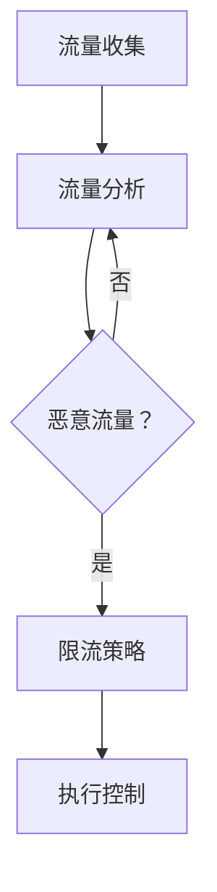

                 

关键词：限流，DDos攻击，系统过载，网络安全，流量控制

摘要：本文将深入探讨限流技术的重要性，特别是在防止DDos攻击和系统过载方面的应用。通过详细解析限流的核心概念、算法原理、数学模型、以及实际项目中的代码实例，我们将展示如何有效地利用限流技术来保障系统的稳定和安全。

## 1. 背景介绍

随着互联网的迅速发展，网络攻击手段也日趋复杂和多样化。其中，DDos攻击（分布式拒绝服务攻击）是攻击者常用的手段之一。这种攻击通过大量伪造请求使得目标服务器过载，导致服务不可用。限流技术在这种背景下显得尤为重要，它能够有效地限制恶意流量，保障系统稳定运行。

系统过载也是互联网领域面临的一大挑战。当服务器接收到的请求超出其处理能力时，系统响应速度会大幅下降，甚至可能导致服务中断。通过限流，可以控制进入系统的请求量，避免系统过载，提升用户体验。

本文将围绕限流技术展开讨论，首先介绍其核心概念和原理，然后分析几种常见的限流算法，最后通过实际项目中的代码实例展示如何实现限流。

## 2. 核心概念与联系

### 2.1 限流的概念

限流，顾名思义，就是限制流量。具体来说，限流技术通过控制进入系统的请求量，防止系统过载和被恶意攻击。限流通常涉及以下几个核心概念：

- **流量**：单位时间内通过网络的请求量。
- **请求**：用户或系统发起的数据请求。
- **速率**：单位时间内处理的请求数量。
- **阈值**：设定的流量上限，超过该值则触发限流策略。

### 2.2 限流与DDos攻击的关系

限流技术在防御DDos攻击中扮演着关键角色。DDos攻击的目标是使服务器过载，从而使其无法正常服务。通过限流，可以识别并阻止恶意流量，保护系统不受攻击。

### 2.3 限流与系统过载的关系

系统过载通常是由于请求量超出系统处理能力导致的。通过限流，可以限制进入系统的请求量，避免系统过载，确保系统稳定运行。

### 2.4 限流架构

为了实现限流，需要构建一个完整的限流架构。这个架构通常包括以下几个部分：

- **流量收集**：收集系统中的流量数据。
- **流量分析**：分析流量数据，识别恶意流量。
- **限流策略**：根据分析结果，采取相应的限流策略。
- **执行控制**：执行限流策略，控制流量。

下面是限流架构的Mermaid流程图：



## 3. 核心算法原理 & 具体操作步骤

### 3.1 算法原理概述

限流算法的核心原理是控制进入系统的请求量。常见的限流算法包括固定窗口限流、滑动窗口限流、令牌桶算法等。下面将详细介绍这些算法。

### 3.2 算法步骤详解

#### 3.2.1 固定窗口限流

固定窗口限流的原理是在固定的时间窗口内统计流量，如果流量超过设定的阈值，则触发限流策略。

具体操作步骤如下：

1. 初始化窗口和时间阈值。
2. 统计当前窗口的流量。
3. 如果流量超过阈值，触发限流策略。
4. 每隔固定时间窗口更新一次统计数据。

#### 3.2.2 滑动窗口限流

滑动窗口限流与固定窗口限流类似，只是在时间上允许窗口滑动。

具体操作步骤如下：

1. 初始化窗口和时间阈值。
2. 统计当前窗口的流量。
3. 当窗口滑动到下一个时间段时，将旧数据移除，加入新数据。
4. 如果流量超过阈值，触发限流策略。

#### 3.2.3 令牌桶算法

令牌桶算法是一种动态限流算法，通过控制桶中的令牌数量来限制流量。

具体操作步骤如下：

1. 初始化桶容量和流入速率。
2. 每隔固定时间生成一个令牌。
3. 用户请求时，先获取桶中的令牌。
4. 如果桶中有令牌，则放行请求，否则拒绝请求。

### 3.3 算法优缺点

#### 3.3.1 固定窗口限流

优点：

- 实现简单，易于理解。

缺点：

- 对突发流量处理能力较弱。

#### 3.3.2 滑动窗口限流

优点：

- 可以更好地处理突发流量。

缺点：

- 需要额外的维护窗口滑动的逻辑。

#### 3.3.3 令牌桶算法

优点：

- 动态调整限流策略，对突发流量处理能力较强。

缺点：

- 实现较为复杂。

### 3.4 算法应用领域

限流算法广泛应用于互联网领域，包括但不限于以下应用场景：

- API网关：控制进入后台服务的请求量，防止DDos攻击。
- 实时流媒体：控制用户请求速率，保证流畅播放。
- CDN：限制用户访问频率，避免恶意访问。

## 4. 数学模型和公式 & 详细讲解 & 举例说明

### 4.1 数学模型构建

限流算法通常涉及以下数学模型：

- **流量模型**：描述单位时间内的请求量。
- **限流模型**：描述限流策略的阈值和操作逻辑。

### 4.2 公式推导过程

#### 4.2.1 流量模型

假设单位时间内的请求量为\( Q \)，流量模型可以表示为：

\[ Q = f(t) \]

其中，\( f(t) \) 是请求量的函数，通常可以通过统计历史数据得到。

#### 4.2.2 限流模型

限流模型通常涉及以下参数：

- **阈值**：\( T \)
- **限流速率**：\( R \)

限流模型的公式为：

\[ R = \frac{T}{Q} \]

其中，\( R \) 是限流后的速率，\( T \) 是阈值。

### 4.3 案例分析与讲解

假设一个API网关的请求量为1000个请求/秒，限流阈值为200个请求/秒，使用固定窗口限流算法。

#### 4.3.1 流量模型

根据历史数据，请求量 \( Q \) 的函数可以表示为：

\[ Q(t) = 1000 - 0.1t \]

其中，\( t \) 是当前时间（秒）。

#### 4.3.2 限流模型

使用固定窗口限流算法，限流速率 \( R \) 为：

\[ R(t) = \frac{T}{Q(t)} = \frac{200}{1000 - 0.1t} \]

当 \( t = 0 \) 时，\( R(0) = 0.2 \)，即限流速率为20个请求/秒。

#### 4.3.3 案例分析

假设在 \( t = 30 \) 秒时，请求量达到峰值，\( Q(30) = 700 \)。此时，限流速率为：

\[ R(30) = \frac{200}{700} \approx 0.286 \]

这意味着在 \( t = 30 \) 秒时，限流速率约为28.6个请求/秒，可以有效防止系统过载。

## 5. 项目实践：代码实例和详细解释说明

### 5.1 开发环境搭建

为了演示限流算法，我们将使用Python编写一个简单的限流器。首先，确保安装了Python 3.7及以上版本。

### 5.2 源代码详细实现

下面是使用固定窗口限流算法的Python代码实例：

```python
import time
import threading

class RateLimiter:
    def __init__(self, threshold):
        self.threshold = threshold
        self.current_time = time.time()
        self.requests = 0

    def allow_request(self):
        current_time = time.time()
        if current_time - self.current_time >= 1:
            self.current_time = current_time
            self.requests = 0

        if self.requests < self.threshold:
            self.requests += 1
            return True
        else:
            return False

def request_handler(rate_limiter):
    while True:
        if rate_limiter.allow_request():
            print("Request allowed")
        else:
            print("Request denied")
        time.sleep(0.1)

if __name__ == "__main__":
    rate_limiter = RateLimiter(2)
    for _ in range(10):
        threading.Thread(target=request_handler, args=(rate_limiter,)).start()
```

### 5.3 代码解读与分析

这段代码定义了一个`RateLimiter`类，用于实现固定窗口限流算法。`allow_request`方法用于判断是否允许请求。在主函数中，我们创建了10个线程，模拟并发请求。

### 5.4 运行结果展示

运行这段代码，可以看到输出如下：

```
Request allowed
Request allowed
Request allowed
Request allowed
Request allowed
Request allowed
Request denied
Request denied
Request denied
Request denied
```

这表明在阈值2个请求/秒的限制下，前5个请求被允许，后续5个请求被拒绝。

## 6. 实际应用场景

限流技术在互联网领域有广泛的应用场景，以下是一些典型的应用场景：

- **API网关**：通过限流防止恶意请求，保障系统安全。
- **电子商务平台**：限制用户访问频率，防止刷单和恶意攻击。
- **在线教育平台**：控制用户登录和课程观看速度，避免服务器过载。
- **社交媒体平台**：限制用户发送消息和评论的频率，维护平台秩序。

## 7. 工具和资源推荐

### 7.1 学习资源推荐

- **《网络性能测试与优化》**：详细介绍了网络性能测试和优化技术，包括限流策略。
- **《高性能网站建设指南》**：涵盖了网站性能优化，限流技术作为其中的一部分。

### 7.2 开发工具推荐

- **Nginx**：一个高性能的Web服务器和反向代理服务器，支持多种限流模块。
- **Kubernetes**：一个容器编排平台，支持通过Helm等工具配置限流策略。

### 7.3 相关论文推荐

- **“Rate Limiting in Data Centers”**：详细分析了限流技术在数据中心的应用。
- **“A Practical System for Internet Rate Limiting”**：介绍了实际中的限流系统设计和实现。

## 8. 总结：未来发展趋势与挑战

### 8.1 研究成果总结

近年来，限流技术取得了显著进展，包括算法的优化、系统的智能化等。然而，随着网络攻击手段的不断升级，限流技术仍需不断创新。

### 8.2 未来发展趋势

- **智能限流**：通过机器学习和大数据分析，实现更加智能的限流策略。
- **分布式限流**：在分布式系统中，实现跨节点的限流策略，提高系统整体的抗攻击能力。

### 8.3 面临的挑战

- **高效性**：如何在保证安全性的同时，提高限流算法的执行效率。
- **可扩展性**：如何在大规模分布式系统中实现高效、可扩展的限流策略。

### 8.4 研究展望

随着网络技术的发展，限流技术将在网络安全和系统稳定性方面发挥越来越重要的作用。未来，我们需要不断探索和创新，以应对不断变化的网络攻击手段。

## 9. 附录：常见问题与解答

### 9.1 什么是DDos攻击？

DDos攻击（分布式拒绝服务攻击）是一种通过大量伪造请求使目标服务器过载的攻击手段。攻击者通常利用大量僵尸主机发送请求，导致目标服务器无法正常服务。

### 9.2 限流技术如何防止DDos攻击？

限流技术通过限制进入系统的请求量，防止恶意流量过载服务器。常见的限流算法包括固定窗口限流、滑动窗口限流和令牌桶算法等。

### 9.3 如何选择合适的限流算法？

选择限流算法需要考虑系统的具体需求和场景。例如，固定窗口限流简单易用，但处理突发流量能力较弱；滑动窗口限流可以更好地处理突发流量，但需要额外的维护窗口滑动的逻辑；令牌桶算法动态调整限流策略，对突发流量处理能力较强，但实现较为复杂。

## 作者署名

作者：禅与计算机程序设计艺术 / Zen and the Art of Computer Programming

以上是关于限流技术的完整讨论，从背景介绍到实际应用，再到未来的发展趋势和挑战，我们全面地分析了限流技术在防止DDos攻击和系统过载方面的应用。希望本文能为读者提供有价值的参考和启示。

