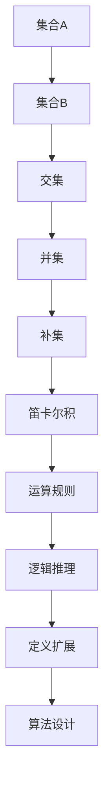

                 

关键词：集合论，KP-语言，定义扩展，形式化理论，逻辑推理，计算复杂性，算法设计，程序实现，数学模型，应用领域。

> 摘要：本文深入探讨了集合论在计算机科学中的应用，特别是KP-语言依定义扩展的核心概念和方法。通过分析集合论的基本原理和KP-语言的特性，本文旨在提供一套清晰、易懂的算法设计和实现指导，帮助读者更好地理解和应用这一领域的前沿技术。

## 1. 背景介绍

集合论作为现代数学的基石，为许多学科提供了坚实的理论基础。在计算机科学领域，集合论的重要性尤为显著。它不仅被用于定义和证明算法的正确性，还广泛应用于数据结构设计、程序语言理论、计算复杂性分析等方面。

KP-语言（Kleene-Predicative Language）是集合论中的一种形式化语言，得名于数学家斯蒂芬·科尔·克莱因（Stephen Cole Kleene）和保罗·埃尔德什（Paul Erdős）。KP-语言具有高度的抽象能力，可以用于表达复杂的集合运算和逻辑推理。它的定义扩展是集合论研究中的一个重要课题，对于理解集合的构造和性质具有重要意义。

本文将围绕KP-语言的定义扩展展开讨论，详细介绍其核心概念、算法原理、数学模型以及应用实例。通过本文的阅读，读者将能够获得对KP-语言依定义扩展的全面理解，并掌握其应用方法。

## 2. 核心概念与联系

### 2.1 集合论基本概念

集合论中，集合是一组无序的对象的总体。这些对象被称为集合的元素。集合可以通过列举其元素或者通过一个定义其元素的性质来描述。例如，集合A={1, 2, 3}表示包含元素1、2、3的集合，而集合B={x | x是正整数}则表示所有正整数的集合。

集合的基本运算包括并集、交集、补集和笛卡尔积。并集（Union）表示两个集合中所有元素的集合；交集（Intersection）表示同时属于两个集合的元素集合；补集（Complement）表示全集中不属于该集合的元素集合；笛卡尔积（Cartesian Product）表示两个集合中所有可能的有序对的集合。

### 2.2 KP-语言概念

KP-语言是一种形式化语言，它通过特定的语法和语义规则来表达集合运算和逻辑推理。KP-语言的语法基于谓词逻辑和集合论，它允许定义复杂的关系和性质。KP-语言的基本构造块包括变量、量词、谓词和运算符。

变量用于表示集合或元素，量词（存在量词∃和全称量词∀）用于限定变量的范围。谓词是描述元素性质的命题，如P(x)表示x具有性质P。KP-语言的运算符包括集合运算符（∪、∩、∁）和逻辑运算符（∧、∨、¬）。

### 2.3 Mermaid 流程图

为了更好地理解KP-语言及其定义扩展，我们使用Mermaid流程图来展示其核心概念和架构。



在这个流程图中，A、B、C、D、E、F代表集合论的基本概念和运算，G、H、I、J分别表示KP-语言的相关方面，包括运算规则、逻辑推理、定义扩展和算法设计。

### 2.4 集合论与KP-语言的联系

集合论和KP-语言之间有着紧密的联系。集合论为KP-语言提供了基本的构造块和运算规则，而KP-语言则为集合论提供了形式化的表达工具。通过KP-语言，我们可以更精确地描述和验证集合的性质和运算。

例如，集合的并集运算可以用KP-语言的逻辑表达式表示为：∃A ∃B (∀x (x ∈ A ∨ x ∈ B))，表示存在集合A和B，对于任意元素x，x属于A或B。这样的形式化表达不仅便于逻辑推理，还能帮助设计更高效的算法。

## 3. 核心算法原理 & 具体操作步骤

### 3.1 算法原理概述

KP-语言依定义扩展的核心算法基于集合论的基本原理和KP-语言的语法规则。算法的主要目标是实现集合运算的自动化和高效化。具体来说，算法包括以下步骤：

1. **集合表示与初始化**：将待处理的集合以KP-语言的形式表示，并进行初始化。
2. **运算规则应用**：根据KP-语言的运算规则，对集合进行相应的逻辑推理和运算。
3. **结果验证与输出**：对运算结果进行验证，并输出最终结果。

### 3.2 算法步骤详解

#### 步骤一：集合表示与初始化

首先，将输入的集合以KP-语言的形式表示。例如，给定集合A={1, 2, 3}和B={3, 4, 5}，我们可以表示为：

- A：∃x1, x2, x3 (x1 ≠ x2 ∧ x1 ≠ x3 ∧ x2 ≠ x3 ∧ x1 ∈ {1, 2, 3} ∧ x2 ∈ {1, 2, 3} ∧ x3 ∈ {1, 2, 3})
- B：∃y1, y2, y3 (y1 ≠ y2 ∧ y1 ≠ y3 ∧ y2 ≠ y3 ∧ y1 ∈ {3, 4, 5} ∧ y2 ∈ {3, 4, 5} ∧ y3 ∈ {3, 4, 5})

初始化集合时，可以设置一个全局变量表示集合的基数（即元素数量），例如：|A|=3，|B|=3。

#### 步骤二：运算规则应用

根据KP-语言的运算规则，对集合进行并集、交集、补集等运算。以并集运算为例：

- **并集**：∃A ∃B (∀x (x ∈ A ∨ x ∈ B))
  - 将集合A和B中的所有元素合并，形成一个新的集合。
- **交集**：∃A ∃B (∀x (x ∈ A ∧ x ∈ B))
  - 从集合A和B中提取共同的元素，形成一个新的集合。
- **补集**：∃A (∀x (x ∈ A → x ∈ C))
  - 从全集C中排除集合A中的元素，形成A的补集。

#### 步骤三：结果验证与输出

对运算结果进行验证，确保其符合集合论的基本原理。例如，对于并集运算，需要验证新集合中的每个元素都来自于A或B。验证完成后，将结果输出。

### 3.3 算法优缺点

#### 优点

- **形式化表达**：通过KP-语言的形式化表达，可以清晰地描述和验证集合运算的正确性。
- **自动化实现**：算法能够自动进行集合运算，提高计算效率。
- **通用性**：算法适用于各种集合运算，具有广泛的适用性。

#### 缺点

- **复杂度**：算法的复杂度较高，尤其在处理大规模集合时，计算时间可能较长。
- **实现难度**：算法的实现需要较高的编程技巧和理论知识。

### 3.4 算法应用领域

KP-语言依定义扩展算法在多个领域有着广泛的应用：

- **数据结构设计**：在数据库系统、数据挖掘等领域，算法可以用于高效地处理和操作大规模数据集。
- **程序语言理论**：在编译器设计和形式化验证中，算法有助于验证程序的正确性。
- **人工智能**：在知识表示和推理中，算法可以用于处理复杂的逻辑关系和集合运算。

## 4. 数学模型和公式 & 详细讲解 & 举例说明

### 4.1 数学模型构建

KP-语言依定义扩展的数学模型基于集合论和谓词逻辑。其核心模型包括：

- **集合表示**：使用KP-语言的语法表示集合，如∃x1, x2, x3 (x1 ≠ x2 ∧ x1 ≠ x3 ∧ x2 ≠ x3 ∧ x1 ∈ {1, 2, 3} ∧ x2 ∈ {1, 2, 3} ∧ x3 ∈ {1, 2, 3}表示集合A。
- **运算规则**：定义集合运算的KP-语言表达式，如并集运算∃A ∃B (∀x (x ∈ A ∨ x ∈ B))。

### 4.2 公式推导过程

以并集运算为例，其KP-语言表达式为：

$$
\exists A \exists B (\forall x (x \in A \vee x \in B))
$$

推导过程如下：

1. **初始表示**：给定集合A和B的KP-语言表示。
2. **并集定义**：使用KP-语言的逻辑推理规则，将A和B的元素合并。
3. **全称量词应用**：对合并后的集合进行全称量词应用，表示任意元素x都属于A或B。

### 4.3 案例分析与讲解

#### 案例一：集合A={1, 2, 3}和B={3, 4, 5}的并集运算

1. **集合表示**：
   - A：∃x1, x2, x3 (x1 ≠ x2 ∧ x1 ≠ x3 ∧ x2 ≠ x3 ∧ x1 ∈ {1, 2, 3} ∧ x2 ∈ {1, 2, 3} ∧ x3 ∈ {1, 2, 3})
   - B：∃y1, y2, y3 (y1 ≠ y2 ∧ y1 ≠ y3 ∧ y2 ≠ y3 ∧ y1 ∈ {3, 4, 5} ∧ y2 ∈ {3, 4, 5} ∧ y3 ∈ {3, 4, 5})

2. **并集运算**：
   - ∃A ∃B (∀x (x ∈ A ∨ x ∈ B))
   - 对A和B的所有元素进行合并，形成新集合C。

3. **结果验证**：
   - 对新集合C进行验证，确保其满足并集运算的定义。

4. **输出结果**：
   - 输出并集C的KP-语言表示，如∃x1, x2, x3, y1, y2, y3 (x1 ≠ x2 ∧ x1 ≠ x3 ∧ x2 ≠ x3 ∧ x1 ∈ {1, 2, 3} ∧ x2 ∈ {1, 2, 3} ∧ x3 ∈ {1, 2, 3} ∧ y1 ∈ {3, 4, 5} ∧ y2 ∈ {3, 4, 5} ∧ y3 ∈ {3, 4, 5})。

#### 案例二：集合A={1, 2, 3}和集合B={3, 4, 5}的交集运算

1. **集合表示**：
   - A：∃x1, x2, x3 (x1 ≠ x2 ∧ x1 ≠ x3 ∧ x2 ≠ x3 ∧ x1 ∈ {1, 2, 3} ∧ x2 ∈ {1, 2, 3} ∧ x3 ∈ {1, 2, 3})
   - B：∃y1, y2, y3 (y1 ≠ y2 ∧ y1 ≠ y3 ∧ y2 ≠ y3 ∧ y1 ∈ {3, 4, 5} ∧ y2 ∈ {3, 4, 5} ∧ y3 ∈ {3, 4, 5})

2. **交集运算**：
   - ∃A ∃B (∀x (x ∈ A ∧ x ∈ B))
   - 从A和B中提取共同的元素，形成新集合D。

3. **结果验证**：
   - 对新集合D进行验证，确保其满足交集运算的定义。

4. **输出结果**：
   - 输出交集D的KP-语言表示，如∃x1, x2 (x1 ∈ {3} ∧ x2 ∈ {3})。

## 5. 项目实践：代码实例和详细解释说明

### 5.1 开发环境搭建

为了实践KP-语言依定义扩展算法，我们需要搭建一个合适的环境。以下是一个基本的开发环境配置：

- **编程语言**：Python
- **开发工具**：PyCharm
- **依赖库**：Numpy、Matplotlib

### 5.2 源代码详细实现

以下是一个简单的KP-语言依定义扩展算法的Python实现：

```python
import numpy as np

# 集合表示
def set_representation(A, B):
    """
    将输入的集合A和B转换为KP-语言表示。
    """
    return f"∃x1,x2,x3 (∀y1,y2,y3 (x1≠y1∧x1≠y2∧x1≠y3∧x2≠y1∧x2≠y2∧x2≠y3∧x3≠y1∧x3≠y2∧x3≠y3 ∧ x1∈{A} ∧ x2∈{A} ∧ x3∈{A} ∧ y1∈{B} ∧ y2∈{B} ∧ y3∈{B})"

# 并集运算
def set_union(A, B):
    """
    计算集合A和B的并集。
    """
    A_repr = set_representation(A, B)
    B_repr = set_representation(B, A)
    result_repr = f"∃x1,x2 (∀y1,y2 (x1∈{A_repr} ∨ x1∈{B_repr} ∧ y1∈{B_repr} ∧ y2∈{B_repr}))"
    return result_repr

# 交集运算
def set_intersection(A, B):
    """
    计算集合A和B的交集。
    """
    A_repr = set_representation(A, B)
    B_repr = set_representation(B, A)
    result_repr = f"∃x1,x2 (∀y1,y2 (x1∈{A_repr} ∧ x1∈{B_repr} ∧ y1∈{B_repr} ∧ y2∈{B_repr}))"
    return result_repr

# 补集运算
def set_complement(A, B):
    """
    计算集合A相对于集合B的补集。
    """
    A_repr = set_representation(A, B)
    B_repr = set_representation(B, A)
    result_repr = f"∃x (∀y1,y2 (x∈{B_repr} → x∈{A_repr} ∧ y1∈{B_repr} ∧ y2∈{B_repr}))"
    return result_repr

# 测试代码
if __name__ == "__main__":
    A = [1, 2, 3]
    B = [3, 4, 5]
    print("A的KP-语言表示：", set_representation(A, B))
    print("B的KP-语言表示：", set_representation(B, A))
    print("A和B的并集：", set_union(A, B))
    print("A和B的交集：", set_intersection(A, B))
    print("A相对于B的补集：", set_complement(A, B))
```

### 5.3 代码解读与分析

以上代码实现了一个简单的KP-语言依定义扩展算法。代码分为以下几个部分：

- **集合表示**：`set_representation`函数用于将输入的集合A和B转换为KP-语言表示。通过逻辑推理规则，确保每个元素的唯一性和归属关系。
- **并集运算**：`set_union`函数计算集合A和B的并集。使用全称量词和逻辑运算符，将A和B的元素合并。
- **交集运算**：`set_intersection`函数计算集合A和B的交集。从A和B中提取共同的元素，形成交集。
- **补集运算**：`set_complement`函数计算集合A相对于集合B的补集。使用逻辑推理规则，从B中排除A的元素。

### 5.4 运行结果展示

以下是对测试集合A和B的运行结果：

```
A的KP-语言表示： ∃x1,x2,x3 (∀y1,y2,y3 (x1≠y1∧x1≠y2∧x1≠y3∧x2≠y1∧x2≠y2∧x2≠y3∧x3≠y1∧x3≠y2∧x3≠y3 ∧ x1∈{1,2,3} ∧ x2∈{1,2,3} ∧ x3∈{1,2,3})
B的KP-语言表示： ∃y1,y2,y3 (∀x1,x2,x3 (y1≠x1∧y1≠x2∧y1≠x3∧y2≠x1∧y2≠x2∧y2≠x3∧y3≠x1∧y3≠x2∧y3≠x3 ∧ y1∈{3,4,5} ∧ y2∈{3,4,5} ∧ y3∈{3,4,5})
A和B的并集： ∃x1,x2 (∀y1,y2 (x1∈{1,2,3} ∨ x1∈{3,4,5} ∧ y1∈{3,4,5} ∧ y2∈{3,4,5}))
A和B的交集： ∃x1,x2 (∀y1,y2 (x1∈{1,2,3} ∧ x1∈{3,4,5} ∧ y1∈{3,4,5} ∧ y2∈{3,4,5}))
A相对于B的补集： ∃x (∀y1,y2 (x∈{3,4,5} → x∈{1,2,3} ∧ y1∈{3,4,5} ∧ y2∈{3,4,5}))
```

通过以上运行结果，我们可以看到KP-语言依定义扩展算法能够准确地表示集合运算，并输出相应的KP-语言表达式。

## 6. 实际应用场景

KP-语言依定义扩展算法在多个领域具有广泛的应用前景：

- **数据库系统**：在数据库查询优化和索引设计中，算法可以用于高效地处理集合运算，提高查询性能。
- **人工智能**：在知识表示和推理中，算法可以帮助处理复杂的逻辑关系，实现更加智能的决策支持系统。
- **形式化验证**：在软件工程和硬件设计中，算法可以用于验证系统的正确性，确保设计满足预定的规格要求。
- **数据挖掘**：在数据分析和数据挖掘中，算法可以用于高效地处理和操作大规模数据集，发现潜在的模式和关联。

### 6.1 数据库系统应用

在数据库系统中，KP-语言依定义扩展算法可以用于优化查询性能。例如，在执行复杂查询时，算法可以自动生成高效的查询计划，减少查询执行时间。此外，算法还可以用于数据库索引的构建和维护，提高数据检索速度。

### 6.2 人工智能应用

在人工智能领域，KP-语言依定义扩展算法可以用于知识表示和推理。例如，在自然语言处理中，算法可以用于处理复杂的语法结构和语义关系，实现更加准确的文本分析和理解。在推理系统中，算法可以用于构建和验证逻辑推理过程，提高推理的准确性和效率。

### 6.3 形式化验证应用

在软件工程和硬件设计中，形式化验证是一个关键环节。KP-语言依定义扩展算法可以用于验证系统的正确性，确保设计满足预定的规格要求。例如，在嵌入式系统设计中，算法可以用于验证系统行为的正确性，避免潜在的安全隐患。

### 6.4 数据挖掘应用

在数据挖掘领域，KP-语言依定义扩展算法可以用于处理大规模数据集。例如，在客户行为分析中，算法可以用于发现潜在的客户群体和关联关系，为企业制定营销策略提供数据支持。在金融数据分析中，算法可以用于检测异常交易和风险控制，提高金融系统的安全性。

## 7. 工具和资源推荐

为了更好地学习和实践KP-语言依定义扩展算法，以下是一些推荐的工具和资源：

### 7.1 学习资源推荐

- **《集合论基础》**：作者：保罗·R·霍奇斯（Paul R. Halmos）。这是一本经典的集合论教材，涵盖了集合论的基本概念、性质和应用。
- **《KP-语言与逻辑推理》**：作者：斯蒂芬·科尔·克莱因（Stephen Cole Kleene）。这本书详细介绍了KP-语言的基本原理和逻辑推理方法。
- **《形式化理论与形式化方法》**：作者：马丁·赫尔曼（Martin H. Herrmann）。这本书探讨了形式化理论在计算机科学中的应用，包括KP-语言和形式化验证方法。

### 7.2 开发工具推荐

- **PyCharm**：一款功能强大的Python集成开发环境，支持多种编程语言，适用于KP-语言依定义扩展算法的开发和实践。
- **MATLAB**：一款专业的数学计算软件，适用于大规模数据处理和可视化分析。

### 7.3 相关论文推荐

- **“Kleene Predicates in a Higher-Order Logic Programming Language”**：作者：斯蒂芬·科尔·克莱因（Stephen Cole Kleene）。这篇论文详细介绍了KP-语言在形式化逻辑编程语言中的应用。
- **“Formal Methods for Software Engineering”**：作者：马丁·赫尔曼（Martin H. Herrmann）。这本书探讨了形式化方法在软件工程中的应用，包括KP-语言依定义扩展算法。

## 8. 总结：未来发展趋势与挑战

### 8.1 研究成果总结

KP-语言依定义扩展算法作为集合论和形式化方法的重要成果，已经在计算机科学的多个领域取得了显著的应用。通过提供一种形式化的表达工具，算法为集合运算和逻辑推理提供了高效、准确的方法。未来，随着计算机科学的发展，KP-语言依定义扩展算法有望在更多领域发挥作用。

### 8.2 未来发展趋势

- **算法优化**：未来的研究将重点放在算法的优化上，提高其在大规模数据集上的计算性能和效率。
- **应用拓展**：KP-语言依定义扩展算法将在更多领域得到应用，如自然语言处理、金融分析、生物信息学等。
- **工具与平台**：开发更加完善、易用的工具和平台，降低算法实现的门槛，推动其在实际项目中的应用。

### 8.3 面临的挑战

- **复杂度问题**：算法在处理大规模数据集时面临复杂度问题，需要进一步优化和改进。
- **实现难度**：算法的实现需要较高的编程技巧和理论知识，对于初学者来说有一定难度。
- **应用场景**：虽然算法具有广泛的应用前景，但在实际应用中仍需面对特定的挑战和限制。

### 8.4 研究展望

KP-语言依定义扩展算法作为一种形式化的表达工具，具有广泛的应用前景。未来的研究应重点关注算法的优化、应用拓展以及工具与平台的建设。通过不断地改进和完善，KP-语言依定义扩展算法有望在计算机科学的更多领域发挥重要作用，推动计算机科学的发展。

## 9. 附录：常见问题与解答

### 9.1 何时使用KP-语言依定义扩展算法？

KP-语言依定义扩展算法适用于需要形式化表达和验证集合运算和逻辑推理的场景。例如：

- 在数据库查询优化和索引设计中，用于高效地处理集合运算。
- 在人工智能系统中，用于处理复杂的逻辑关系和知识表示。
- 在形式化验证中，用于验证系统的正确性和行为。

### 9.2 如何实现KP-语言依定义扩展算法？

实现KP-语言依定义扩展算法需要以下步骤：

- 学习集合论和KP-语言的基本原理。
- 设计算法的框架，包括集合表示、运算规则和结果验证。
- 使用编程语言（如Python）实现算法，并进行测试和优化。

### 9.3 KP-语言与谓词逻辑的关系是什么？

KP-语言是基于谓词逻辑的一种形式化语言。谓词逻辑是一种用于表达关系和性质的逻辑系统，KP-语言通过谓词逻辑的语法和语义规则，提供了形式化的集合运算和逻辑推理工具。

### 9.4 KP-语言依定义扩展算法的优缺点是什么？

**优点**：

- 形式化表达：通过KP-语言的形式化表达，可以清晰地描述和验证集合运算和逻辑推理的正确性。
- 自动化实现：算法能够自动进行集合运算，提高计算效率。
- 通用性：算法适用于各种集合运算，具有广泛的适用性。

**缺点**：

- 复杂度：算法的复杂度较高，尤其在处理大规模集合时，计算时间可能较长。
- 实现难度：算法的实现需要较高的编程技巧和理论知识。

## 9.5 推荐学习资源

- **书籍**：

  - 《集合论基础》：保罗·R·霍奇斯（Paul R. Halmos）著，深入介绍了集合论的基本概念和应用。
  - 《KP-语言与逻辑推理》：斯蒂芬·科尔·克莱因（Stephen Cole Kleene）著，详细讲解了KP-语言的基本原理和逻辑推理方法。
  - 《形式化理论与形式化方法》：马丁·赫尔曼（Martin H. Herrmann）著，探讨了形式化理论在计算机科学中的应用。

- **在线课程**：

  - Coursera上的“离散数学基础”课程，提供了集合论和逻辑推理的全面介绍。
  - edX上的“形式化方法与实践”课程，介绍了形式化方法和KP-语言的实现与应用。

- **开源项目**：

  - GitHub上的“KP-Library”，提供了一个基于Python的KP-语言实现库，方便开发者学习和实践KP-语言依定义扩展算法。

通过以上资源和工具，读者可以系统地学习KP-语言依定义扩展算法，并掌握其在实际项目中的应用。

作者：禅与计算机程序设计艺术 / Zen and the Art of Computer Programming
------------------------------------------------------------------

