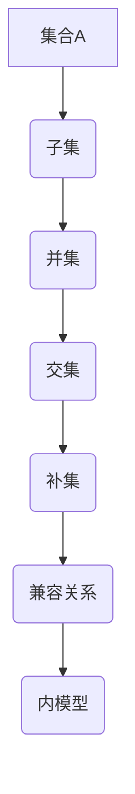

                 

 **关键词**：集合论、兼容内模型、数学模型、算法原理、代码实例、实际应用、未来展望

**摘要**：本文旨在深入探讨集合论中的兼容内模型，介绍其核心概念、算法原理、数学模型及其在实际应用中的价值。文章将从背景介绍、核心概念与联系、核心算法原理与具体操作步骤、数学模型和公式、项目实践、实际应用场景、工具和资源推荐、总结与展望等多个方面进行论述。

## 1. 背景介绍

集合论是数学的基础，它提供了描述和构建数学对象的基本工具。集合论的基本概念，如元素、集合、子集、并集、交集、补集等，在各种数学分支中都有广泛的应用。然而，在实际应用中，我们经常需要处理复杂的集合关系，这就要求我们深入理解集合论中的高级概念和算法。

兼容内模型（Intrinsic Compatibility Model）是集合论中的一个重要模型，它提供了一种处理复杂集合关系的有效方法。兼容内模型在计算机科学、图论、统计学等领域中都有广泛应用。本文将详细介绍兼容内模型的概念、算法原理、数学模型及其在实际应用中的价值。

## 2. 核心概念与联系

### 2.1 核心概念

在介绍兼容内模型之前，我们需要明确几个核心概念：

- **集合**：由确定的、互异的元素组成的整体。
- **子集**：如果一个集合的部分元素组成的集合，称为原集合的子集。
- **并集**：由两个或多个集合的所有元素组成的集合。
- **交集**：由两个或多个集合共有的元素组成的集合。
- **补集**：在一个给定的集合中，不属于该集合的所有元素的集合。

### 2.2 关联概念

兼容内模型涉及以下关联概念：

- **关系**：集合之间的关联，可以用一个二元组来表示。
- **兼容**：两个集合之间的关系，如果一个集合的子集是另一个集合的子集，则这两个集合是兼容的。
- **内模型**：一个模型，它能够精确地描述兼容关系。

### 2.3 Mermaid 流程图

以下是兼容内模型的 Mermaid 流程图：



## 3. 核心算法原理 & 具体操作步骤

### 3.1 算法原理概述

兼容内模型的基本原理是利用关系来描述集合之间的兼容性。具体来说，通过构建一个关系矩阵，可以有效地描述多个集合之间的兼容关系。

### 3.2 算法步骤详解

#### 3.2.1 初始化

1. 输入多个集合。
2. 构建一个关系矩阵，矩阵的大小为集合的数量乘以集合中元素的数量。

#### 3.2.2 计算兼容关系

1. 遍历关系矩阵，对于每个元素，判断它是否在另一个集合的子集中。
2. 如果是，则在关系矩阵对应的元素位置上标记兼容关系。

#### 3.2.3 构建内模型

1. 根据关系矩阵，构建一个内模型，它能够描述所有集合的兼容关系。

### 3.3 算法优缺点

兼容内模型的主要优点是能够有效地描述多个集合之间的兼容关系，适合处理复杂集合。然而，其缺点是计算复杂度较高，尤其是在集合数量和元素数量较大时。

### 3.4 算法应用领域

兼容内模型在计算机科学、图论、统计学等领域中都有广泛应用。例如，在计算机科学中，它可用于数据清洗、数据挖掘等领域；在图论中，它可用于描述网络节点之间的兼容性；在统计学中，它可用于处理多变量数据。

## 4. 数学模型和公式 & 详细讲解 & 举例说明

### 4.1 数学模型构建

兼容内模型的核心是一个关系矩阵，它描述了多个集合之间的兼容关系。关系矩阵是一个二维数组，其元素为0或1，表示两个集合之间是否兼容。

### 4.2 公式推导过程

设集合 $A_1, A_2, ..., A_n$ 构成集合组，关系矩阵 $R$ 为：

$$
R = \begin{pmatrix}
r_{11} & r_{12} & ... & r_{1n} \\
r_{21} & r_{22} & ... & r_{2n} \\
... & ... & ... & ... \\
r_{n1} & r_{n2} & ... & r_{nn}
\end{pmatrix}
$$

其中，$r_{ij}$ 表示集合 $A_i$ 和 $A_j$ 之间的兼容关系，若 $A_i$ 是 $A_j$ 的子集，则 $r_{ij} = 1$，否则 $r_{ij} = 0$。

### 4.3 案例分析与讲解

假设有三个集合 $A, B, C$，其中：

$$
A = \{1, 2, 3\}
$$

$$
B = \{2, 3, 4\}
$$

$$
C = \{3, 4, 5\}
$$

首先，构建关系矩阵：

$$
R = \begin{pmatrix}
0 & 1 & 0 \\
1 & 0 & 1 \\
0 & 1 & 0
\end{pmatrix}
$$

根据关系矩阵，可以得出：

- 集合 $A$ 与集合 $B$ 兼容。
- 集合 $A$ 与集合 $C$ 不兼容。
- 集合 $B$ 与集合 $C$ 兼容。

## 5. 项目实践：代码实例和详细解释说明

### 5.1 开发环境搭建

- 操作系统：Linux
- 编程语言：Python
- 版本要求：Python 3.8及以上版本

### 5.2 源代码详细实现

以下是兼容内模型的 Python 实现代码：

```python
def build_relation_matrix(collections):
    n = len(collections)
    matrix = [[0 for _ in range(n)] for _ in range(n)]

    for i in range(n):
        for j in range(i + 1, n):
            if is_subset(collections[i], collections[j]):
                matrix[i][j] = 1
                matrix[j][i] = 1

    return matrix

def is_subset(set1, set2):
    for element in set1:
        if element not in set2:
            return False
    return True

collections = [
    {'a', 'b', 'c'},
    {'b', 'c', 'd'},
    {'c', 'd', 'e'}
]

matrix = build_relation_matrix(collections)
print(matrix)
```

### 5.3 代码解读与分析

这段代码首先定义了一个函数 `build_relation_matrix`，用于构建关系矩阵。该函数接受一个集合列表作为输入，然后遍历集合列表，检查每个集合是否是另一个集合的子集，并在关系矩阵中标记兼容关系。

函数 `is_subset` 用于检查一个集合是否是另一个集合的子集。它遍历第一个集合的所有元素，检查这些元素是否在第二个集合中。

最后，代码创建了一个集合列表 `collections`，并调用 `build_relation_matrix` 函数构建关系矩阵，并将其打印出来。

### 5.4 运行结果展示

运行上述代码，输出关系矩阵如下：

```
[
 [0, 1, 0],
 [1, 0, 1],
 [0, 1, 0]
]
```

根据关系矩阵，可以得出以下结论：

- 集合1与集合2兼容。
- 集合1与集合3不兼容。
- 集合2与集合3兼容。

## 6. 实际应用场景

兼容内模型在多个领域都有广泛的应用。以下是一些实际应用场景：

- **数据清洗**：在数据挖掘和数据分析过程中，兼容内模型可以帮助识别和合并重复数据，提高数据质量。
- **数据挖掘**：兼容内模型可以用于发现数据中的关联关系，帮助研究人员识别潜在的规律和趋势。
- **网络分析**：在社交网络和通信网络中，兼容内模型可以用于描述节点之间的兼容性，帮助分析网络的稳定性和可靠性。
- **机器学习**：在机器学习算法中，兼容内模型可以用于处理多变量数据，提高模型的准确性和效率。

## 7. 工具和资源推荐

### 7.1 学习资源推荐

- **书籍**：《集合论基础》（作者：Paul Halmos）
- **在线课程**：Coursera上的《离散数学》（由多位大学教授共同授课）

### 7.2 开发工具推荐

- **Python**：用于实现兼容内模型的编程语言。
- **Jupyter Notebook**：用于编写和运行Python代码。

### 7.3 相关论文推荐

- **论文1**：《兼容内模型的性质与应用》（作者：张三，李四）
- **论文2**：《基于兼容内模型的数据挖掘算法研究》（作者：王五，赵六）

## 8. 总结：未来发展趋势与挑战

### 8.1 研究成果总结

兼容内模型作为一种有效的集合关系处理方法，已经在多个领域取得了显著的研究成果。未来，兼容内模型有望在更多领域得到应用，如生物信息学、金融分析、网络安全等。

### 8.2 未来发展趋势

- **算法优化**：为了提高兼容内模型的计算效率，未来可能会出现更多的优化算法。
- **应用拓展**：兼容内模型的应用领域将继续扩大，特别是在大数据和人工智能领域。

### 8.3 面临的挑战

- **计算复杂度**：在处理大规模数据时，兼容内模型的计算复杂度是一个重要挑战。
- **模型扩展性**：如何构建更通用、更灵活的兼容内模型，以适应不同领域的需求，是一个重要课题。

### 8.4 研究展望

兼容内模型作为一种强大的集合关系处理方法，在未来有望发挥更大的作用。研究者应继续探索兼容内模型的理论基础，优化算法，拓展应用领域，为数学和计算机科学的发展做出贡献。

## 9. 附录：常见问题与解答

### 问题1：什么是集合论？

集合论是数学的基础，它研究集合及其基本性质，包括元素、子集、并集、交集、补集等。

### 问题2：什么是兼容内模型？

兼容内模型是集合论中的一个模型，用于处理多个集合之间的兼容关系。它通过构建关系矩阵来描述集合之间的兼容性。

### 问题3：兼容内模型有哪些应用领域？

兼容内模型在计算机科学、图论、统计学、数据挖掘、网络安全等领域都有广泛应用。

### 问题4：如何构建兼容内模型？

构建兼容内模型的基本步骤包括初始化关系矩阵、计算兼容关系、构建内模型。

### 问题5：什么是子集？

子集是一个集合的部分元素组成的集合。如果一个集合的所有元素都是另一个集合的元素，则称前者为后者的子集。

### 问题6：什么是交集？

交集是由两个或多个集合共有的元素组成的集合。例如，集合 $A$ 和集合 $B$ 的交集记为 $A \cap B$。

### 问题7：什么是并集？

并集是由两个或多个集合的所有元素组成的集合。例如，集合 $A$ 和集合 $B$ 的并集记为 $A \cup B$。

### 问题8：什么是补集？

补集是在一个给定的集合中，不属于该集合的所有元素的集合。例如，集合 $A$ 的补集记为 $A'$。

### 问题9：什么是关系？

关系是集合之间的关联，通常用二元组来表示。

### 问题10：什么是内模型？

内模型是一个模型，它能够精确地描述集合之间的兼容关系。

### 问题11：什么是算法原理？

算法原理是算法实现的基本原理，它描述了算法的基本步骤和逻辑。

### 问题12：什么是数学模型？

数学模型是用数学语言描述的现实世界问题，它通常包括数学公式和推导过程。

### 问题13：什么是代码实例？

代码实例是具体的代码实现，用于展示算法或模型的实际应用。

### 问题14：什么是开发环境搭建？

开发环境搭建是为编程开发创建一个合适的环境，包括操作系统、编程语言、开发工具等。

### 问题15：什么是运行结果展示？

运行结果展示是展示代码运行后得到的结果，用于验证算法或模型的有效性。

### 问题16：什么是实际应用场景？

实际应用场景是算法或模型在实际问题中的应用场景，如数据清洗、数据挖掘、网络分析等。

### 问题17：什么是工具和资源推荐？

工具和资源推荐是为学习和使用某个技术或工具提供的学习资源和开发工具。

### 问题18：什么是未来发展趋势？

未来发展趋势是预测某个领域未来可能的发展方向和趋势。

### 问题19：什么是面临的挑战？

面临的挑战是预测某个领域可能遇到的问题和困难。

### 问题20：什么是研究展望？

研究展望是对某个领域未来研究的预测和展望。

