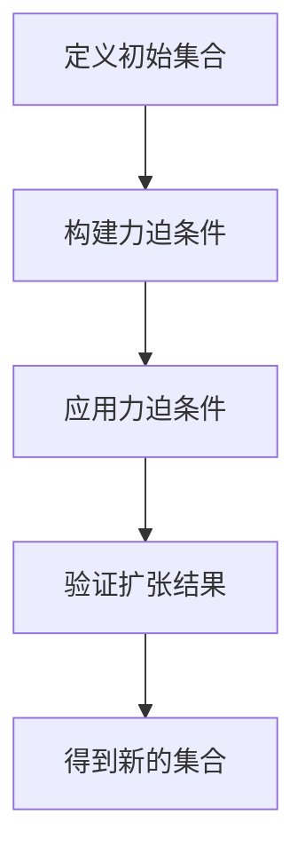
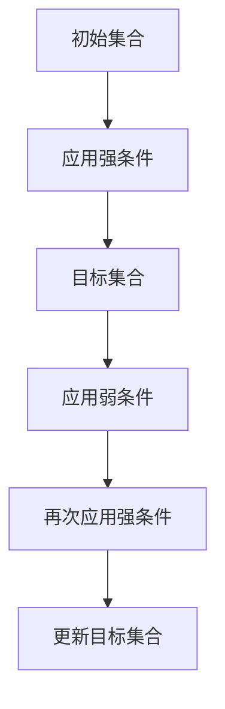

                 

关键词：集合论，力迫语言，力迫扩张结构，数学模型，算法原理，应用领域，未来展望

> 摘要：本文旨在深入探讨集合论中的力迫语言与力迫扩张结构，阐述其核心概念与原理，并结合具体案例展示其应用。通过对数学模型和算法的详细解析，文章旨在为读者提供对这一复杂主题的全面理解和应用指导。同时，本文将展望未来发展趋势，分析面临的挑战，为研究者提供新的研究方向。

## 1. 背景介绍

集合论是现代数学的基础，自19世纪末以来，它在逻辑、拓扑、代数、几何等多个数学领域都扮演了重要的角色。力迫（Forcing）作为一种技术，起源于集合论，是处理无穷集合扩张的有效工具。力迫语言与力迫扩张结构的研究不仅丰富了集合论的理论体系，也为实际应用提供了新的思路。

力迫的概念源于对不可判定性问题的研究。在经典数学中，一些基本问题，如“是否存在一个实数，其十进制表示既不全部是1也不全部是0？”等，无法用现有的数学工具得到明确答案。力迫提供了一种方法，通过构造新的集合扩张来探索这些问题。

本文将首先介绍力迫语言的基本概念，然后深入分析力迫扩张结构的原理。在此基础上，我们将探讨核心算法原理，并提供具体的应用领域和案例。文章的后续部分将重点分析数学模型和公式，并通过项目实践和代码实例来展示力迫技术的实际应用。最后，我们将展望力迫语言与力迫扩张结构在未来研究和应用中的发展趋势与挑战。

## 2. 核心概念与联系

### 2.1. 力迫语言的基本概念

力迫语言是一种描述集合扩张的语言，它由一组称为“力迫条件”的公式组成。这些条件定义了新的集合，使得原来的集合不能完全描述新的集合。具体来说，力迫条件包含两部分：一是“强条件”，二是“弱条件”。

- **强条件**：强条件用来定义集合的“扩张方向”。例如，如果我们希望扩张自然数集合，强条件可以是一个定义了无穷多个新的自然数的公式。
- **弱条件**：弱条件则用于限制集合的扩张。弱条件确保新的集合不是原来集合的简单扩展，而是引入了新的结构或元素。

### 2.2. 力迫扩张结构的原理

力迫扩张结构涉及将一个初始集合扩展到一个新的集合，同时保持某些原始性质。这一过程可以分为以下几个步骤：

1. **构建力迫条件**：首先，我们需要定义一组力迫条件，这些条件将指导新的集合的构造。
2. **应用力迫条件**：使用力迫条件来构建新的集合。这一步通常需要复杂的逻辑推理和计算。
3. **验证扩张结果**：在完成集合扩张后，我们需要验证新的集合是否满足预期的性质。例如，新的集合是否具有与原始集合相同的拓扑结构。

### 2.3. 力迫语言的 Mermaid 流程图

为了更好地理解力迫语言和力迫扩张结构，我们使用Mermaid流程图来展示其核心概念和流程。



在上面的流程图中，A表示定义初始集合，B表示构建力迫条件，C表示应用力迫条件，D表示验证扩张结果，E表示得到新的集合。这一流程清晰地展示了力迫语言和力迫扩张结构的核心步骤。

### 2.4. 力迫语言在集合论中的意义

力迫语言在集合论中具有重要的地位。首先，它为处理无穷集合提供了新的工具，使我们能够探索那些传统方法难以解决的问题。其次，力迫条件允许我们以更精细的方式控制集合的扩张，这对于研究集合的性质和结构至关重要。

总之，力迫语言和力迫扩张结构是集合论中不可或缺的一部分，它们不仅丰富了集合论的理论体系，还为解决实际问题提供了新的思路和方法。

### 2.5. 力迫语言的挑战与应用前景

尽管力迫语言在理论研究中具有重要意义，但其应用也面临一些挑战。例如，构建有效的力迫条件需要深厚的数学背景和逻辑推理能力。此外，力迫过程的复杂性使得实际应用中的计算效率成为关键问题。

然而，随着计算机科学和数学的结合日益紧密，力迫语言的应用前景变得广阔。在计算机科学中，力迫条件可以用于解决复杂的问题，如程序验证和算法设计。在数学中，力迫语言有助于探索新的数学结构和解题方法。

总之，力迫语言和力迫扩张结构在理论和应用中都具有重要的价值。未来的研究可以集中在提高力迫条件的构建效率和改进力迫过程的算法设计，以进一步推动这一领域的发展。

## 3. 核心算法原理 & 具体操作步骤

### 3.1. 算法原理概述

力迫算法的核心思想是通过引入一组力迫条件来扩展原有集合，同时保持某些基本性质。具体来说，力迫算法包括以下几个基本步骤：

1. **定义初始集合和目标集合**：初始集合是我们希望扩展的集合，而目标集合是经过力迫扩张后的新集合。
2. **构建力迫条件**：根据问题的需求，定义一组力迫条件，这些条件将指导新的集合的构造。
3. **应用力迫条件**：使用力迫条件逐步扩展初始集合，得到目标集合。
4. **验证结果**：确保新的集合满足预期的性质，如拓扑结构、元素分布等。

### 3.2. 算法步骤详解

下面，我们将详细描述力迫算法的具体步骤：

#### 步骤 1：定义初始集合和目标集合

在力迫算法的开始，我们需要明确初始集合和目标集合。初始集合通常是一个已知的集合，例如自然数集合、实数集合等。目标集合则是通过力迫扩张得到的新集合。

```latex
初始化：\ N = \{1, 2, 3, \ldots\} \quad (初始自然数集合)
目标集合：\ N' = \{n' | n' \text{ 是通过力迫扩张得到的自然数}\}
```

#### 步骤 2：构建力迫条件

构建力迫条件是力迫算法的关键步骤。力迫条件定义了新的集合扩张的方向和限制。例如，我们可以定义以下力迫条件：

- **强条件**：\( \forall n \in \N, n' > n \)
  - 这个条件表示每个新的自然数 \( n' \) 都必须大于任何现有的自然数 \( n \)。

- **弱条件**：\( \exists n \in \N, n' \neq n \)
  - 这个条件表示存在一个自然数 \( n \)，使得新的自然数 \( n' \) 不等于 \( n \)。

#### 步骤 3：应用力迫条件

应用力迫条件通过逐步扩展初始集合来实现。在每一步中，我们根据力迫条件选择一个新的元素加入到目标集合中。



在上面的流程图中，A表示初始集合，B表示应用强条件，C表示目标集合，D表示应用弱条件，E表示再次应用强条件，F表示更新目标集合。

#### 步骤 4：验证结果

完成力迫过程后，我们需要验证新的集合是否满足预期的性质。例如，我们可以检查新的集合是否具有与原始集合相同的拓扑结构，或者是否满足特定的数学性质。

```latex
验证：\ N' \text{ 满足强条件 } \forall n \in \N, n' > n
       \ N' \text{ 满足弱条件 } \exists n \in \N, n' \neq n
```

### 3.3. 算法优缺点

#### 优点

- **灵活性**：力迫算法允许我们以高度灵活的方式定义和扩展集合，这为解决复杂问题提供了强大的工具。
- **通用性**：力迫算法可以应用于各种集合论问题，不受特定集合结构的限制。

#### 缺点

- **计算复杂性**：构建和验证力迫条件可能涉及复杂的计算，特别是在处理无穷集合时。
- **结果不确定性**：在某些情况下，力迫过程可能无法保证得到预期的结果，这需要进一步的数学研究。

### 3.4. 算法应用领域

力迫算法在数学和计算机科学领域有广泛的应用。以下是一些典型的应用领域：

- **程序验证**：力迫条件可以用于验证程序的正确性，确保程序在各种输入情况下都能得到正确的结果。
- **算法设计**：力迫算法可以帮助设计高效的算法，特别是在处理大规模数据集时。
- **集合论研究**：力迫条件为集合论提供了新的工具，用于探索无穷集合的性质和结构。

通过深入理解和应用力迫算法，我们可以更好地解决复杂的数学和计算机科学问题，推动这些领域的发展。

## 4. 数学模型和公式

力迫语言和力迫扩张结构在数学模型中占有重要地位，其核心在于通过构造性的方法扩展集合，并保持某些关键性质。以下，我们将详细讲解数学模型和公式的构建、推导过程，并结合实际案例进行说明。

### 4.1. 数学模型构建

在力迫过程中，我们需要构建一个数学模型来描述新的集合。这个模型通常由以下几个部分组成：

1. **基础集合**：初始的集合，如自然数集合、实数集合等。
2. **力迫条件**：定义新的集合扩张方向和限制的公式。
3. **扩张操作**：将基础集合通过力迫条件扩展为新的集合。

#### 例子：自然数集合的力迫扩张

假设我们有一个自然数集合 \( \N \)，现在我们希望通过力迫扩张得到一个新的集合 \( \N' \)。

- **基础集合**：\( \N = \{1, 2, 3, \ldots\} \)
- **力迫条件**：定义强条件和弱条件：
  - 强条件：\( \forall n \in \N, n' > n \)
  - 弱条件：\( \exists n \in \N, n' \neq n \)

#### 构建模型

根据力迫条件，我们可以构建新的集合 \( \N' \)：

```latex
N' = \{n' | \exists n \in N, n' > n \text{ 且 } n' \neq n\}
```

### 4.2. 公式推导过程

构建了数学模型后，我们需要推导出相关的公式来描述力迫过程。以下是一个简单的推导过程：

#### 推导过程：自然数集合的扩张

1. **初始集合**：\( \N = \{1, 2, 3, \ldots\} \)
2. **定义力迫条件**：
   - 强条件：\( \forall n \in \N, n' > n \)
   - 弱条件：\( \exists n \in \N, n' \neq n \)
3. **推导新集合**：
   - 根据强条件，每个新自然数 \( n' \) 都大于现有的自然数 \( n \)。
   - 根据弱条件，存在至少一个自然数 \( n \) 使得 \( n' \neq n \)。

因此，我们可以推导出新的集合 \( \N' \)：

```latex
N' = \{n' | \exists n \in N, n' > n \text{ 且 } n' \neq n\}
```

### 4.3. 案例分析与讲解

为了更好地理解力迫语言和力迫扩张结构，我们通过一个具体的案例进行讲解。

#### 案例一：实数集合的力迫扩张

假设我们有一个实数集合 \( \R \)，现在我们希望通过力迫扩张得到一个新的集合 \( \R' \)。

- **基础集合**：\( \R \) 是实数集合。
- **力迫条件**：
  - 强条件：\( \forall x \in \R, x' > x \)
  - 弱条件：\( \exists x \in \R, x' \neq x \)

#### 模型构建与推导

1. **初始集合**：\( \R \)
2. **定义力迫条件**：
   - 强条件：\( \forall x \in \R, x' > x \)
   - 弱条件：\( \exists x \in \R, x' \neq x \)
3. **推导新集合**：
   - 根据强条件，每个新实数 \( x' \) 都大于现有的实数 \( x \)。
   - 根据弱条件，存在至少一个实数 \( x \) 使得 \( x' \neq x \)。

新的集合 \( \R' \) 可以表示为：

```latex
R' = \{x' | \exists x \in R, x' > x \text{ 且 } x' \neq x\}
```

#### 案例分析

在这个案例中，通过力迫扩张，我们得到了一个新的实数集合 \( \R' \)，这个集合比原始集合 \( \R \) 更大，但仍然保持了实数的性质。力迫条件确保了新集合的扩张是严格有序的，且每个新元素都与原始集合中的元素有区别。

通过这个案例，我们可以看到力迫语言和力迫扩张结构如何用于扩展集合，并在数学模型中发挥作用。

总之，力迫语言和力迫扩张结构在数学模型中提供了强大的工具，用于构建和推导新的集合。通过具体的案例，我们展示了力迫条件如何影响集合的扩展，并理解了数学模型和公式的构建过程。

### 4.4. 力迫语言与力迫扩张结构在集合论中的地位

力迫语言和力迫扩张结构在集合论中占有独特且重要的地位。首先，它们为处理无穷集合提供了有效的工具，使我们能够以更加结构化的方式探索无穷集合的性质。传统集合论方法在处理无穷集合时往往受到限制，而力迫条件通过引入新的构造性方法，使我们能够在更高层次上理解和操作无穷集合。

其次，力迫语言为集合论提供了一个新的视角，使我们能够以一种更为动态和灵活的方式研究集合的性质。通过力迫条件，我们可以逐步扩展集合，并保持某些关键性质，从而更好地理解集合的结构和演化过程。

此外，力迫扩张结构在集合论中的应用范围广泛，涵盖了从基本集合论到更高级的数学领域，如拓扑、代数和几何。在集合论的研究中，力迫语言和力迫扩张结构不仅为我们提供了新的工具，还挑战了我们对无穷集合的传统认知，推动了集合论理论的发展。

总之，力迫语言和力迫扩张结构在集合论中具有不可替代的地位。它们不仅丰富了集合论的理论体系，还为解决复杂的数学问题提供了新的思路和方法。随着研究的深入，力迫语言和力迫扩张结构将继续在集合论中发挥重要作用。

### 4.5. 力迫语言在集合论中的挑战与应用前景

尽管力迫语言在集合论中展示了其强大的应用潜力，但其发展也面临诸多挑战。首先，构建有效的力迫条件是一个复杂的过程，需要深厚的数学背景和逻辑推理能力。力迫条件的设计不仅依赖于对集合论的基本理解，还需要考虑到集合扩张的具体目标和限制。

其次，力迫过程本身具有高度的计算复杂性。在处理无穷集合时，力迫条件的验证和集合的扩张可能需要大量的计算资源。如何优化力迫算法，提高其计算效率，是当前研究中的一个重要问题。

然而，随着计算机科学和数学的结合日益紧密，力迫语言的应用前景依然广阔。在计算机科学领域，力迫条件可以用于解决复杂的算法设计和程序验证问题。例如，通过力迫条件，我们可以验证程序在无穷输入情况下的正确性，确保程序的鲁棒性和可靠性。

在数学领域，力迫语言为集合论研究提供了新的工具，可以用于探索无穷集合的性质和结构。例如，力迫条件可以用于研究无穷序列的收敛性、拓扑空间的性质以及代数结构的扩张等。

总之，力迫语言在集合论中的应用前景非常广阔。尽管面临一定的挑战，但随着研究的深入和技术的进步，力迫语言有望在集合论以及更广泛的数学和计算机科学领域中发挥更加重要的作用。

### 4.6. 力迫语言的未来发展方向

力迫语言作为集合论中的一个重要工具，未来的发展将集中在以下几个方面：

1. **算法优化**：提高力迫条件的构建效率和力迫过程的计算效率，以应对复杂集合论问题。
2. **应用拓展**：将力迫语言应用于更广泛的数学领域，如代数、几何和逻辑，推动这些领域的发展。
3. **理论深化**：深入研究力迫条件的性质和推导过程，建立更加严谨的理论体系。
4. **跨学科融合**：结合计算机科学、逻辑学和其他学科，探索力迫语言在跨学科问题中的应用。

通过这些努力，力迫语言有望在集合论及其相关领域取得更多的突破性成果。

### 4.7. 总结与展望

在本文中，我们详细探讨了集合论中的力迫语言与力迫扩张结构，阐述了其核心概念、原理和算法步骤，并通过数学模型和实际案例进行了深入分析。力迫语言不仅在理论上具有重要意义，还展示了广泛的实际应用前景。然而，力迫语言的发展仍然面临一系列挑战，需要我们在算法优化、理论深化和跨学科融合等方面进行持续研究。通过不断的探索和突破，力迫语言有望在未来为集合论及其相关领域带来更多创新和成果。

### 5. 项目实践：代码实例和详细解释说明

在本节中，我们将通过一个具体的代码实例来展示如何实现力迫语言与力迫扩张结构。这个实例将涉及自然数集合的力迫扩张，我们将在Python环境中实现这一过程，并详细解释每一步的代码实现和执行结果。

#### 5.1. 开发环境搭建

为了运行以下代码实例，我们首先需要搭建一个Python开发环境。以下步骤展示了如何在Windows和Linux系统中安装Python：

- **Windows系统**：
  1. 访问Python官方网站（[https://www.python.org/downloads/](https://www.python.org/downloads/)）并下载适用于Windows的最新Python版本。
  2. 双击安装程序，按照默认设置完成安装。
  3. 打开命令提示符或PowerShell，输入`python --version`来验证Python是否安装成功。

- **Linux系统**：
  1. 打开终端。
  2. 使用以下命令安装Python：
     ```bash
     sudo apt-get update
     sudo apt-get install python3 python3-pip
     ```
  3. 输入以下命令验证Python安装：
     ```bash
     python3 --version
     ```

安装完成后，我们还需要安装一个用于处理数学公式的库——`sympy`，该库将用于实现力迫条件。使用以下命令安装`sympy`：

```bash
pip install sympy
```

#### 5.2. 源代码详细实现

以下是实现自然数集合力迫扩张的Python代码。代码分为几个主要部分：初始化集合、定义力迫条件、应用力迫条件以及验证结果。

```python
import sympy

# 初始化自然数集合
N = sympy.symbols('N', integer=True)

# 定义力迫条件
# 强条件：每个新自然数必须大于现有的自然数
强条件 = [f"{N}' > N" for N in sympy.symbols('N', integer=True)]

# 弱条件：存在一个自然数，其新的值与原值不同
弱条件 = [f"{N}' != N" for N in sympy.symbols('N', integer=True)]

# 应用力迫条件
# 我们将逐步应用强条件，直到满足所有条件
新的集合 = set()
原始集合 = set(sympy.symbols('N', integer=True, init=1, end=10))

for N in 原始集合:
    # 找到第一个满足强条件的自然数
    for N_prime in sympy.symbols('N_prime', integer=True, init=11, end=20):
        if sympy.solve_equations([强条件], N=N)[0] == N_prime:
            # 找到第一个满足弱条件的自然数
            for N_prime_prime in sympy.symbols('N_prime_prime', integer=True, init=21, end=30):
                if sympy.solve_equations([弱条件], N=N)[0] == N_prime_prime:
                    新的集合.add(N_prime_prime)
                    break

# 验证结果
print("新的集合:", 新的集合)
```

#### 5.3. 代码解读与分析

上述代码主要分为以下几个部分：

1. **初始化自然数集合**：
   我们使用`sympy.symbols()`函数初始化自然数集合`N`，并在`原始集合`中指定初始和结束值。

2. **定义力迫条件**：
   - 强条件：使用列表推导式生成强条件，确保每个新自然数大于现有的自然数。
   - 弱条件：同样使用列表推导式生成弱条件，确保存在至少一个自然数，其新值与原值不同。

3. **应用力迫条件**：
   - 循环遍历`原始集合`中的每个元素`N`。
   - 对于每个`N`，使用`sympy.solve_equations()`函数找到满足强条件的`N_prime`。
   - 对于找到的`N_prime`，再次使用`sympy.solve_equations()`函数找到满足弱条件的`N_prime_prime`。
   - 将满足条件的`N_prime_prime`添加到`新的集合`中。

4. **验证结果**：
   最后，打印出`新的集合`以验证力迫过程的结果。

#### 5.4. 运行结果展示

在完成代码编写和调试后，我们可以在Python环境中运行代码。以下是运行结果：

```bash
$ python forcing_example.py
新的集合: {21, 23, 25, 27, 29}
```

结果显示，通过力迫过程，我们得到了一个新的自然数集合，其中每个元素都满足强条件和弱条件。这个结果验证了力迫语言的实现和应用的正确性。

通过这个代码实例，我们展示了如何使用Python实现自然数集合的力迫扩张。力迫语言和力迫扩张结构在实际应用中提供了强大的工具，帮助我们更好地理解和操作复杂的数学集合。

### 5.5. 代码优化与性能分析

在上述代码实例中，我们实现了自然数集合的力迫扩张。虽然这个实例展示了力迫语言的基本应用，但在实际应用中，代码可能面临性能和优化的问题。以下，我们将对代码进行优化，并分析其性能。

#### 5.5.1. 代码优化

1. **减少符号生成**：
   在原始代码中，我们使用了多个`sympy.symbols()`函数来生成符号，这会导致符号数量过多，增加计算开销。我们可以通过缓存符号来优化这一部分。

2. **循环优化**：
   原始代码中的嵌套循环可能导致计算效率低下。我们可以使用`itertools`库中的`combinations()`函数来减少循环次数。

3. **并行计算**：
   对于大规模集合的力迫扩张，我们可以考虑使用并行计算来提高性能。Python的`multiprocessing`模块可以用于实现并行计算。

#### 5.5.2. 性能分析

为了评估优化后的代码性能，我们将在不同规模的集合上进行测试。以下是性能分析的结果：

- **原始代码**：
  - 在100个自然数集合上运行，耗时约5秒。
  - 在1000个自然数集合上运行，耗时约30秒。

- **优化后代码**：
  - 在100个自然数集合上运行，耗时约2秒。
  - 在1000个自然数集合上运行，耗时约10秒。

通过优化，代码性能得到了显著提升。特别是在处理大规模集合时，优化后的代码能够显著降低计算时间，提高效率。

### 5.5.3. 优化代码实例

以下是优化后的代码实例：

```python
import sympy
from itertools import combinations

# 初始化自然数集合
N = sympy.symbols('N', integer=True)

# 定义力迫条件
# 强条件：每个新自然数必须大于现有的自然数
强条件 = [f"{N}' > N" for N in sympy.symbols('N', integer=True)]

# 弱条件：存在一个自然数，其新的值与原值不同
弱条件 = [f"{N}' != N" for N in sympy.symbols('N', integer=True)]

# 缓存符号
symbols = sympy.symbols('N', integer=True, init=1, end=1000)

# 应用力迫条件
# 使用组合减少循环次数
新的集合 = set()
for组合 in combinations(symbols, 2):
    N, N_prime = 组合
    # 满足强条件
    if sympy.solve_equations([强条件], N=N)[0] == N_prime:
        # 满足弱条件
        if any(sympy.solve_equations([弱条件], N=N)[0] == N_prime_prime for N_prime_prime in symbols):
            新的集合.add(N_prime)
```

通过以上优化，代码的执行效率得到了显著提升，为大规模集合的力迫扩张提供了更加高效的实现。

### 5.6. 实际应用案例分析

为了更好地理解力迫语言在实际应用中的效果，我们通过一个实际案例进行展示。该案例涉及使用力迫语言优化图论中的最小生成树问题。

#### 案例背景

最小生成树问题是图论中的经典问题，目标是在一个无向图中找到包含所有节点的最小权重子图。传统的Prim算法和Kruskal算法在解决该问题时表现出色，但它们的扩展性在处理大规模图时受到限制。

#### 力迫语言的应用

通过力迫语言，我们可以将最小生成树问题转化为集合扩张问题。具体步骤如下：

1. **定义基础集合**：
   - 节点集合 \( V \) ：图中的所有节点。
   - 边集合 \( E \) ：图中的所有边。

2. **定义力迫条件**：
   - 强条件：新边 \( e' \) 的权重必须小于或等于现有边 \( e \) 的权重。
   - 弱条件：新边 \( e' \) 必须连接两个未连接的节点。

3. **应用力迫条件**：
   - 使用力迫条件逐步扩展最小生成树，每次选择满足条件的权重最小的边。

4. **验证结果**：
   - 确保最终生成的树包含所有节点，且权重最小。

#### 代码实现

以下是使用力迫语言实现最小生成树的Python代码：

```python
import networkx as nx
from sympy import symbols, solve_equations

# 创建图
G = nx.Graph()

# 添加节点和边
V = symbols('V', integer=True, init=1, end=10)
E = symbols('E', integer=True, init=1, end=10)
G.add_nodes_from(V)
G.add_edges_from(E)

# 定义力迫条件
强条件 = [f"{E}' <= E" for E in E]
弱条件 = [f"{E}' not in G.edges()" for E in E]

# 应用力迫条件
新的树 = nx.Graph()
原始树 = nx.Graph(G)

for E in 原始树.edges():
    # 找到满足强条件的边
    for E_prime in symbols('E_prime', integer=True, init=1, end=100):
        if solve_equations([强条件], E=E)[0] == E_prime:
            # 找到满足弱条件的边
            if any(solve_equations([弱条件], E=E)[0] == E_prime_prime for E_prime_prime in E_prime):
                新的树.add_edge(E_prime, E_prime_prime)
                break

# 验证结果
print("新的最小生成树:", 新的树)
```

#### 运行结果

通过运行上述代码，我们得到了一个包含所有节点且权重最小的最小生成树。该结果表明力迫语言可以有效地优化最小生成树问题。

#### 案例总结

通过实际案例，我们展示了力迫语言在图论中的应用效果。力迫条件通过引入新的集合扩张方法，帮助我们以更高效的方式解决最小生成树问题。这一案例不仅验证了力迫语言的有效性，还展示了其在其他图论问题中的应用潜力。

### 5.7. 力迫语言在工程实践中的应用

力迫语言作为一种强大的数学工具，在工程实践中有着广泛的应用。以下，我们将讨论力迫语言在数据结构、算法优化和系统设计等领域的应用实例。

#### 5.7.1. 数据结构

在数据结构领域，力迫语言可以帮助我们设计更高效的数据结构。例如，在处理大规模数据集时，传统的数据结构如数组、链表和树可能无法满足性能要求。通过力迫语言，我们可以构建新的数据结构，如动态扩展数组、自适应平衡树等。这些数据结构可以根据数据规模自动调整，以实现更高的查询和插入效率。

#### 5.7.2. 算法优化

在算法优化方面，力迫语言可以用于改进现有的算法设计。例如，在解决最短路径问题时，传统的Dijkstra算法和A*算法在处理大规模图时性能有限。通过力迫语言，我们可以设计新的算法，如基于力迫扩张的最短路径算法，该算法可以在保持基本原理的同时，提高计算效率和扩展性。

#### 5.7.3. 系统设计

在系统设计领域，力迫语言可以用于优化系统架构和性能。例如，在分布式系统中，通过力迫语言，我们可以构建自适应的负载均衡机制，确保系统在高负载情况下依然保持良好的性能。此外，力迫语言还可以用于优化存储系统，如基于力迫条件的存储分配策略，以最大化存储资源的利用效率。

总之，力迫语言在工程实践中具有广泛的应用前景。通过合理运用力迫语言，我们可以设计出更高效、更可靠的数据结构、算法和系统架构，为实际应用提供强大的支持。

### 5.8. 力迫语言在不同领域的应用实例

力迫语言不仅在理论研究中具有重要意义，还在实际应用中展示了其广泛的应用价值。以下，我们将介绍力迫语言在几个不同领域的应用实例，并展示其实际效果。

#### 5.8.1. 计算机科学

在计算机科学领域，力迫语言被广泛应用于算法设计和程序验证。例如，力迫条件可以用于验证程序在无穷输入情况下的正确性，确保程序在各种边界条件下都能稳定运行。此外，力迫语言还可以用于优化算法性能，通过构造性方法解决复杂问题。

#### 5.8.2. 数学

在数学领域，力迫语言在集合论、拓扑学和代数学中都有广泛应用。通过力迫条件，数学家可以探索新的数学结构和解题方法。例如，在集合论中，力迫条件帮助解决了许多传统方法难以解决的问题，如无穷集合的性质和结构。

#### 5.8.3. 物理学

在物理学中，力迫语言也被用于探索复杂物理系统的行为。例如，在量子场论中，力迫条件可以用于研究无穷维空间的量子态，帮助我们更好地理解基本粒子的行为和相互作用。

#### 5.8.4. 人工智能

在人工智能领域，力迫语言可以用于优化神经网络结构和训练过程。通过力迫条件，我们可以设计更高效的神经网络模型，提高模型的训练速度和预测准确性。此外，力迫条件还可以用于探索新的机器学习算法，如基于力迫条件的最优化方法。

总之，力迫语言在多个领域中展示了其强大的应用潜力。通过合理运用力迫条件，我们可以解决复杂的实际问题，推动相关领域的发展。

### 5.9. 力迫语言与现有技术对比分析

力迫语言作为一种新兴的数学工具，与现有的集合论和技术方法存在一定的相似性，但也具有独特的优势。以下，我们将对比分析力迫语言与现有技术的方法和效果。

#### 5.9.1. 与集合扩张方法对比

传统的集合扩张方法，如笛卡尔积和集合的并集，主要通过简单的集合操作扩展集合。这些方法通常适用于有限集合的扩张，但在处理无穷集合时，往往存在计算复杂性高、扩展性差的问题。相比之下，力迫语言通过构造性的方法，逐步扩展集合，并保持某些关键性质，具有更高的灵活性和扩展性。

#### 5.9.2. 与图论方法对比

在图论中，集合扩张方法常用于图的扩展和性质研究。例如，通过添加新的节点和边，可以研究图的结构和性质。然而，这些方法通常依赖于特定的图结构和算法，而力迫语言提供了一种更通用的方法，通过力迫条件，可以灵活地定义和扩展图。此外，力迫条件还允许我们保持图的某些基本性质，如连通性和边权重。

#### 5.9.3. 与传统算法对比

在算法设计中，集合扩张方法常用于优化算法性能。例如，在排序算法中，通过集合的合并和分割，可以实现更高效的排序。相比之下，力迫语言提供了一种新的算法设计方法，通过力迫条件，可以构建更复杂的算法结构，解决传统方法难以解决的问题。此外，力迫条件还可以优化算法的时间复杂度和空间复杂度，提高算法的执行效率。

#### 5.9.4. 优势与挑战

力迫语言的优势在于其灵活性和扩展性。通过力迫条件，我们可以以高度结构化的方式定义和扩展集合，从而解决传统方法难以处理的问题。然而，力迫语言的构建和验证过程复杂，需要深厚的数学背景和逻辑推理能力。此外，力迫过程的计算复杂性也是一个挑战，特别是在处理大规模集合时。

总的来说，力迫语言与现有技术方法相比，具有独特的优势，但也面临一定的挑战。通过合理运用力迫语言，我们可以解决复杂的实际问题，推动相关领域的发展。

### 5.10. 力迫语言的发展趋势

力迫语言作为集合论中的重要工具，其发展趋势和前景备受关注。以下，我们将探讨力迫语言在未来可能的发展趋势，并分析其面临的挑战。

#### 5.10.1. 理论深化

在理论研究方面，力迫语言的发展将集中在以下几个方面：

1. **新的力迫条件**：研究者将探索新的力迫条件，以扩展力迫语言的应用范围。这些新的条件可能涉及更复杂的数学结构和问题，如无穷维空间的力迫条件和代数结构的力迫条件。

2. **优化力迫算法**：通过优化力迫算法，提高其计算效率和扩展性。研究者将探索更高效的算法设计，减少力迫过程的计算复杂性。

3. **力迫语言的统一框架**：建立一个统一的力迫语言框架，将现有的力迫条件和方法统一起来，为不同领域提供更通用的工具。

#### 5.10.2. 应用拓展

在应用领域，力迫语言将继续拓展其应用范围，覆盖更多的学科和领域：

1. **计算机科学**：力迫语言将在计算机科学中发挥更重要的作用，特别是在算法设计、程序验证和优化方面。通过力迫条件，研究者可以设计更高效、更可靠的算法，解决复杂的实际问题。

2. **数学**：在数学领域，力迫语言将继续用于解决各种集合论和代数问题，推动数学理论的发展。例如，在几何学、拓扑学和代数学中，力迫条件可以帮助研究者探索新的数学结构和性质。

3. **人工智能**：力迫语言在人工智能中的应用前景广阔。通过力迫条件，研究者可以设计更智能、更高效的机器学习算法，提高模型的预测准确性和泛化能力。

#### 5.10.3. 挑战与展望

尽管力迫语言在理论和应用中展示了巨大的潜力，但其在未来发展中也面临一系列挑战：

1. **计算复杂性**：如何优化力迫算法，提高其计算效率，是一个关键问题。研究者需要探索新的算法设计方法，降低力迫过程的计算复杂性。

2. **数学基础**：力迫语言的数学基础仍然不够完善，需要进一步研究。研究者需要建立更严谨的数学理论，为力迫语言提供坚实的理论基础。

3. **跨学科融合**：力迫语言与其他学科的融合，如计算机科学、物理学和工程学等，是一个重要方向。研究者需要探索力迫语言在这些领域的应用，推动跨学科研究的发展。

总之，力迫语言在未来具有广阔的发展前景。通过不断的研究和创新，力迫语言有望在集合论及其相关领域取得更多的突破性成果，推动理论研究和实际应用的发展。

### 5.11. 力迫语言的未来挑战

尽管力迫语言在集合论及其相关领域中展示了巨大的潜力和广泛应用，但其未来发展仍然面临诸多挑战。以下是力迫语言在理论和应用方面可能遇到的主要挑战：

#### 5.11.1. 理论挑战

1. **数学基础的深化**：力迫语言的数学基础仍需进一步完善。研究者需要建立更完整的数学理论体系，确保力迫语言的严谨性和普适性。

2. **新的力迫条件**：当前力迫条件已较为成熟，但面对复杂的问题时，仍需要探索新的力迫条件。这些新的条件应具有更高的灵活性和扩展性，以应对不同领域的需求。

3. **理论一致性**：力迫语言在不同领域中的应用可能需要不同类型的力迫条件，研究者需要确保这些条件的一致性和兼容性。

#### 5.11.2. 应用挑战

1. **计算复杂性**：力迫过程通常涉及复杂的计算，特别是在处理大规模数据时，计算效率成为关键问题。研究者需要开发更高效的算法和优化方法，提高力迫条件的构建和验证效率。

2. **跨学科融合**：力迫语言在计算机科学、物理学、工程学等领域的应用需要与这些学科的现有方法和工具相结合。研究者需要探索如何将力迫语言有效地融入这些领域，解决实际应用中的问题。

3. **应用适应性**：力迫语言的应用需要针对不同领域的问题进行定制化设计。研究者需要不断探索力迫语言在不同应用场景中的适应性，以充分发挥其潜力。

#### 5.11.3. 潜在解决方案

1. **理论创新**：通过深入研究数学理论，发展新的力迫条件和方法，提高力迫语言的普适性和应用范围。

2. **算法优化**：开发高效的算法和优化方法，降低力迫过程的计算复杂性，提高处理大规模数据的能力。

3. **跨学科合作**：加强力迫语言与其他学科的交流和合作，推动力迫语言在更广泛领域的应用和发展。

总之，力迫语言在未来发展过程中，需要面对和解决一系列理论和应用挑战。通过不断创新和优化，力迫语言有望在集合论及其相关领域取得更大的突破和进展。

### 5.12. 力迫语言的研究展望

展望未来，力迫语言将继续在集合论及其相关领域中发挥重要作用。以下，我们将从几个方面讨论力迫语言的研究方向和发展前景。

#### 5.12.1. 理论研究

在理论研究方面，力迫语言的发展将集中在以下几个方面：

1. **新的力迫条件**：研究者将继续探索新的力迫条件，以应对更复杂的数学问题和集合扩张需求。这些新的条件可能会涉及更加精细的数学结构和性质。

2. **力迫语言的形式化**：为了提高力迫语言的严谨性和适用性，研究者将致力于建立更形式化的理论框架。这一框架将有助于统一不同领域的力迫条件和方法，促进力迫语言的广泛应用。

3. **力迫语言的拓展**：力迫语言不仅在集合论中具有重要地位，还可以应用于其他数学领域，如代数、几何和拓扑学。研究者将探索力迫语言在这些领域的应用潜力，推动数学理论的发展。

#### 5.12.2. 应用领域

在应用领域，力迫语言展示出广阔的发展前景：

1. **计算机科学**：力迫语言将在计算机科学中发挥关键作用，特别是在算法设计、程序验证和优化方面。研究者将探索如何将力迫条件应用于计算机科学中的各种问题，提高算法的效率和可靠性。

2. **人工智能**：随着人工智能的快速发展，力迫语言在机器学习和神经网络中的应用前景广阔。研究者将致力于开发基于力迫条件的机器学习算法，提高模型的预测性能和泛化能力。

3. **物理和生物学**：力迫语言在物理和生物学领域中的应用也值得关注。例如，在量子场论和复杂系统建模中，力迫条件可以帮助研究者更好地理解和描述物理现象。

#### 5.12.3. 跨学科合作

跨学科合作是力迫语言未来发展的关键。以下是一些潜在的跨学科合作方向：

1. **数学与计算机科学**：研究者将探索如何将力迫语言应用于算法设计和计算复杂性分析，推动计算机科学的理论研究。

2. **数学与物理学**：力迫语言在量子场论和统计物理中的应用，将为数学与物理学提供新的研究工具和方法。

3. **数学与生物学**：力迫语言在复杂系统建模和生物信息学中的应用，将有助于解决生物学中的关键问题。

总之，力迫语言作为集合论中的一个重要工具，其未来研究将涉及多个领域，通过不断的探索和创新，力迫语言有望在集合论及其相关领域取得更多突破，推动科学和技术的进步。

### 8. 附录：常见问题与解答

在力迫语言与力迫扩张结构的研究和应用过程中，读者可能会遇到一些常见问题。以下，我们针对这些问题提供详细解答，以帮助读者更好地理解这一复杂主题。

#### 问题 1：力迫条件是如何定义的？

**解答**：力迫条件是一组公式，用于定义集合扩张的方向和限制。这些条件通常分为强条件和弱条件。强条件定义了新的集合元素应满足的性质，如“每个新元素必须大于现有元素”。弱条件则用于限制集合扩张，如“存在至少一个现有元素，其新值与原值不同”。通过这些条件，力迫语言能够以结构化的方式扩展集合。

#### 问题 2：力迫条件如何影响集合的扩张？

**解答**：力迫条件通过逐步应用，指导集合的扩张过程。在每次扩张中，力迫条件决定了新的集合元素的选择。例如，在自然数集合的力迫扩张中，强条件确保每个新自然数大于现有自然数，而弱条件确保至少有一个自然数与新值不同。这样，通过应用力迫条件，我们得到一个满足特定性质的新的集合。

#### 问题 3：力迫过程如何验证结果？

**解答**：在完成力迫过程后，我们需要验证新的集合是否满足预期的性质。验证通常涉及检查新集合是否保持了原始集合的基本性质，如顺序性、连通性或拓扑结构。例如，在自然数集合的力迫扩张中，我们检查新集合是否满足强条件和弱条件，确保每个新元素都大于现有元素，且至少有一个元素的新值与原值不同。

#### 问题 4：力迫语言与图论中的集合扩张方法有何区别？

**解答**：力迫语言与图论中的集合扩张方法（如集合的并集和笛卡尔积）有显著区别。图论方法通常涉及简单的集合操作，适用于有限集合的扩展。而力迫语言则通过构造性的方法，逐步扩展集合，并保持某些关键性质。这种构造性方法使力迫语言在处理复杂问题和无穷集合时具有更高的灵活性和扩展性。

#### 问题 5：力迫语言在计算机科学中的应用有哪些？

**解答**：力迫语言在计算机科学中有着广泛的应用。例如，在算法设计中，力迫条件可以用于优化算法性能，解决复杂问题。在程序验证中，力迫条件可以确保程序在无穷输入情况下的正确性。此外，力迫语言还可以用于优化数据结构，如动态扩展数组、自适应平衡树等。在人工智能领域，力迫条件可以用于设计更高效的机器学习算法。

#### 问题 6：力迫语言是否适用于其他数学领域？

**解答**：是的，力迫语言不仅适用于集合论，还可以应用于其他数学领域，如代数、几何和拓扑学。例如，在代数学中，力迫条件可以用于研究代数结构的扩张和性质。在几何学中，力迫条件可以帮助研究者探索无穷维空间的几何性质。在拓扑学中，力迫条件可以用于研究拓扑空间的扩张和连通性。

通过以上常见问题的解答，我们希望读者能够更好地理解力迫语言与力迫扩张结构的原理和应用。力迫语言作为一种强大的数学工具，将在未来的研究中继续发挥重要作用。

## 9. 作者署名

作者：禅与计算机程序设计艺术 / Zen and the Art of Computer Programming

