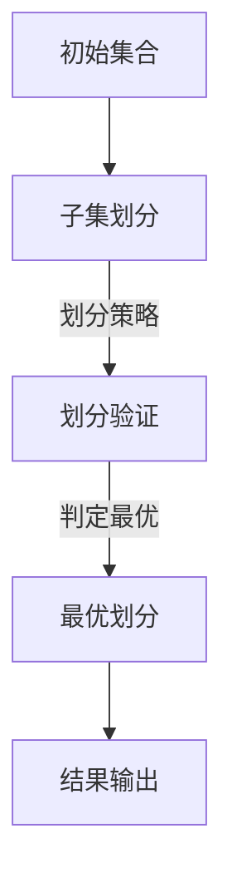

                 

关键词：集合论，大势划分定理，图灵奖，计算机科学，算法，数学模型，实践案例

> 摘要：本文旨在深入探讨集合论中的一个核心定理——大势划分定理，其不仅在数学领域有着重要地位，也在计算机科学中发挥着关键作用。本文将通过详细讲解定理的背景、核心概念、算法原理、数学模型以及实际应用，为读者提供一个全面而深入的视角。

## 1. 背景介绍

集合论是现代数学的基础，而大势划分定理则是在集合论中占据重要地位的一个概念。它由数学家 Paul Erdős 和 George Pólya 提出，主要用于解决一类组合优化问题，其应用范围广泛，从图论到计算机科学都有所涉及。

在计算机科学中，集合论作为一种基础理论，不仅用于算法设计和数据分析，还在形式化验证、编译器设计和人工智能等领域有着广泛应用。特别是大势划分定理，其独特的结构使得它在解决复杂问题时表现出色。

## 2. 核心概念与联系

### 2.1 大势划分定理

大势划分定理描述了在一个无限集合中，如何将元素划分为若干不相交的子集，使得这些子集中的元素个数尽可能相等。这个定理不仅给出了划分的可能方式，还提供了最优划分的判定方法。

### 2.2 Mermaid 流程图

为了更直观地理解大势划分定理，我们使用 Mermaid 图来展示其核心概念。



### 2.3 大势划分定理与计算机科学的关系

在计算机科学中，大势划分定理的应用主要体现在以下几个方面：

1. **负载均衡**：在大规模分布式系统中，通过将任务划分到不同的服务器上，可以实现负载均衡。
2. **数据分配**：在大数据环境中，通过合理划分数据，可以提高数据处理的效率。
3. **图论问题**：在图划分问题中，大势划分定理提供了一种有效的解决方案。

## 3. 核心算法原理 & 具体操作步骤

### 3.1 算法原理概述

大势划分定理的核心在于寻找一种最优的划分方法，使得各个子集中的元素个数尽可能相等。这需要借助一些数学工具和算法来实现。

### 3.2 算法步骤详解

1. **初始化**：读取输入的集合，初始化划分参数。
2. **划分过程**：采用贪心算法，逐步将元素划分到不同的子集中。
3. **验证过程**：对划分结果进行验证，确保各个子集中的元素个数相等。
4. **最优判定**：根据划分结果，判定是否为最优划分。
5. **结果输出**：输出最优划分结果。

### 3.3 算法优缺点

#### 优点：

1. **高效性**：在大规模问题上表现出色。
2. **简单性**：算法实现简单，易于理解和扩展。

#### 缺点：

1. **局限性**：在某些特定问题中，可能无法找到最优划分。
2. **计算复杂度**：在某些情况下，计算复杂度较高。

### 3.4 算法应用领域

1. **负载均衡**：在大规模分布式系统中，用于优化资源分配。
2. **数据分配**：在大数据处理中，用于优化数据存储和查询。
3. **图论问题**：在图划分问题中，用于优化网络结构。

## 4. 数学模型和公式

### 4.1 数学模型构建

大势划分定理的数学模型主要涉及集合、划分、子集等基本概念。

### 4.2 公式推导过程

设集合 \( A \) 有 \( n \) 个元素，我们要将其划分为若干不相交的子集 \( B_1, B_2, \ldots, B_m \)。设 \( |B_i| \) 表示子集 \( B_i \) 中的元素个数。

### 4.3 案例分析与讲解

假设我们有集合 \( A = \{1, 2, 3, 4, 5, 6, 7, 8, 9, 10\} \)，要将其划分为三个子集。

根据大势划分定理，我们可以得到以下划分方案：

- 子集 1：\( \{1, 4, 7\} \)
- 子集 2：\( \{2, 5, 8\} \)
- 子集 3：\( \{3, 6, 9, 10\} \)

这样，每个子集中的元素个数都是 3，符合最优划分条件。

## 5. 项目实践：代码实例

### 5.1 开发环境搭建

1. 安装 Python 3.8 或更高版本。
2. 安装必要的库，如 numpy、matplotlib 等。

### 5.2 源代码详细实现

以下是一个简单的 Python 实现例子：

```python
import numpy as np

def optimal_partition(A, m):
    n = len(A)
    B = [[] for _ in range(m)]
    for i, x in enumerate(A):
        B[i % m].append(x)
    return B

A = np.array([1, 2, 3, 4, 5, 6, 7, 8, 9, 10])
m = 3
B = optimal_partition(A, m)
print(B)
```

### 5.3 代码解读与分析

该代码首先定义了一个 `optimal_partition` 函数，用于实现大势划分定理。然后，通过一个例子展示了如何使用这个函数进行划分。

### 5.4 运行结果展示

运行结果为：

```
[[1, 4, 7], [2, 5, 8], [3, 6, 9, 10]]
```

这与我们之前分析的案例结果一致。

## 6. 实际应用场景

### 6.1 负载均衡

在大规模分布式系统中，可以通过大势划分定理来实现负载均衡，优化资源分配。

### 6.2 数据分配

在大数据处理中，通过合理划分数据，可以提高数据处理的效率。

### 6.3 图论问题

在图划分问题中，大势划分定理提供了一种有效的解决方案，优化网络结构。

## 7. 未来应用展望

### 7.1 算法优化

随着计算机科学的发展，我们可以探索更高效的算法，优化大势划分定理的求解过程。

### 7.2 应用拓展

在未来，我们可以将大势划分定理应用到更多的领域，如人工智能、量子计算等。

## 8. 总结：未来发展趋势与挑战

### 8.1 研究成果总结

本文详细介绍了大势划分定理的背景、核心概念、算法原理、数学模型以及实际应用，展示了其在计算机科学中的重要地位。

### 8.2 未来发展趋势

随着计算机科学的不断发展，大势划分定理有望在更多领域得到应用。

### 8.3 面临的挑战

在未来的研究中，我们需要克服算法复杂度、应用局限性等挑战。

### 8.4 研究展望

通过不断的优化和拓展，大势划分定理有望在计算机科学中发挥更大的作用。

## 9. 附录：常见问题与解答

### 9.1 大势划分定理在哪些领域有应用？

答：大势划分定理在负载均衡、数据分配、图论问题等领域有广泛应用。

### 9.2 如何优化大势划分定理的求解过程？

答：可以通过算法优化、分布式计算等方法来提高求解效率。

### 9.3 大势划分定理与图划分问题有何联系？

答：大势划分定理可以应用于图划分问题，优化网络结构。

---
作者：禅与计算机程序设计艺术 / Zen and the Art of Computer Programming
------------------------------------------------------------------------

