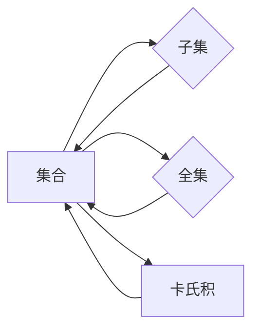

                 

关键词：集合论，奇异基数，数学模型，算法原理，代码实例，实际应用

> 摘要：本文旨在引导读者深入了解集合论及其在奇异基数假设中的应用。通过对集合论核心概念的阐述和算法原理的剖析，本文不仅帮助读者理解集合论的数学基础，还探讨了奇异基数假设在理论研究和实际应用中的重要性。文章结构紧凑，逻辑清晰，旨在为读者提供一个全面且深入的学术研究导引。

## 1. 背景介绍

集合论是现代数学的基石之一，起源于19世纪末期，由德国数学家乔治·康托尔（Georg Cantor）创立。集合论提供了一种形式化的方法来研究对象之间的关系，其核心概念包括集合、元素、子集、笛卡尔积等。随着数学的发展，集合论在拓扑学、代数学、概率论等多个数学分支中发挥了重要作用。

奇异基数（strange number）是集合论中的一个重要概念，通常指那些不能用传统的基数（自然数、整数、有理数等）来描述的集合的大小。康托尔首次提出奇异基数，将其定义为无限集合的一种分类方式。奇异基数假设是对奇异基数存在性的一种猜想，具有重要的数学和哲学意义。

本文将围绕集合论的核心概念，深入探讨奇异基数假设的数学模型和分析方法。文章的结构如下：

- **第1部分**：背景介绍，简要回顾集合论的起源和奇异基数的基本概念。
- **第2部分**：核心概念与联系，通过Mermaid流程图展示集合论的关键概念和它们之间的联系。
- **第3部分**：核心算法原理与操作步骤，详细描述奇异基数假设的算法原理及其实施步骤。
- **第4部分**：数学模型和公式，介绍奇异基数假设的数学模型和公式推导过程。
- **第5部分**：项目实践，通过代码实例展示如何实现奇异基数假设。
- **第6部分**：实际应用场景，探讨奇异基数假设在不同领域的应用和未来展望。
- **第7部分**：工具和资源推荐，提供学习资源和开发工具的推荐。
- **第8部分**：总结，对研究成果进行总结，并展望未来的发展趋势和挑战。

通过以上结构，本文旨在为读者提供一个全面、深入的集合论及其在奇异基数假设中的应用的研究导引。

## 2. 核心概念与联系

为了更好地理解集合论及其在奇异基数假设中的应用，我们需要先掌握一些核心概念，并了解它们之间的联系。

### 2.1 集合的基本概念

集合是由不同元素组成的整体。集合的元素可以是任何对象，从简单的数字、字母，到复杂的数学对象。集合通常用大写字母表示，其元素用逗号分隔。

**定义**：集合 \( A \) 是一个由元素组成的整体，表示为 \( A = \{a_1, a_2, a_3, \ldots\} \)，其中 \( a_i \) 是集合 \( A \) 的元素。

**示例**：自然数集合 \( N = \{1, 2, 3, \ldots\} \)。

### 2.2 子集

子集是指一个集合的部分集合。如果集合 \( B \) 的所有元素都属于集合 \( A \)，那么我们称 \( B \) 是 \( A \) 的子集，记作 \( B \subseteq A \)。

**示例**：集合 \( B = \{2, 4, 6\} \) 是自然数集合 \( N \) 的子集。

### 2.3 全集

全集是指包含所有讨论对象的集合。在讨论特定问题时，全集是讨论的背景集合。

**定义**：给定一个集合 \( A \)，全集 \( U \) 是包含 \( A \) 中所有元素的集合。

**示例**：在讨论自然数时，全集 \( U \) 可能是所有实数集合。

### 2.4 卡氏积

卡氏积是两个或多个集合的笛卡尔积，它由所有可能的有序对组成。

**定义**：两个集合 \( A \) 和 \( B \) 的卡氏积 \( A \times B \) 是所有有序对 \( (a, b) \) 的集合，其中 \( a \in A \) 且 \( b \in B \)。

**示例**：集合 \( A = \{1, 2\} \) 和 \( B = \{a, b\} \) 的卡氏积 \( A \times B = \{(1, a), (1, b), (2, a), (2, b)\} \)。

### 2.5 办法流程图

为了更好地展示集合论的核心概念及其联系，我们使用Mermaid流程图来表示这些概念。以下是一个Mermaid流程图示例：



在这个流程图中，集合 \( A \) 是核心概念，它与其他概念（子集、全集、卡氏积）之间存在联系。通过这个流程图，我们可以直观地看到集合论的基本结构。

### 2.6 关键概念的联系

集合论中的关键概念不仅独立存在，而且相互关联。例如，子集是集合的一部分，全集是包含所有讨论对象的集合，卡氏积则展示了集合之间的笛卡尔关系。

通过理解这些概念及其联系，我们可以更深入地探讨集合论在奇异基数假设中的应用。接下来，我们将介绍奇异基数假设的算法原理和实现步骤。

## 3. 核心算法原理 & 具体操作步骤

### 3.1 算法原理概述

奇异基数假设的核心在于对无限集合的分类。根据康托尔的分类，无限集合可以分为不同的大小，称为奇异基数。这些基数可以通过一个特定的算法来计算和比较。以下是对奇异基数假设的算法原理的概述。

### 3.2 算法步骤详解

#### 3.2.1 步骤1：定义集合

首先，我们需要定义我们要研究的集合。对于奇异基数假设，我们通常选择一个具有特定属性的无限集合。例如，我们可以选择自然数集合 \( N \) 或实数集合 \( R \)。

#### 3.2.2 步骤2：构建二元序列

接下来，我们构建一个二元序列，用于表示集合中的元素。对于自然数集合 \( N \)，我们可以使用一个简单的二元序列来表示每个自然数：

\[ 1 = (1, 0, 0, 0, \ldots) \]
\[ 2 = (1, 1, 0, 0, \ldots) \]
\[ 3 = (1, 1, 1, 0, \ldots) \]
\[ \ldots \]

对于实数集合 \( R \)，构建二元序列的方法会复杂一些，通常涉及对实数的二进制表示或十进制表示。

#### 3.2.3 步骤3：定义基数

基数是用于表示集合大小的数。对于奇异基数假设，我们需要定义一个特殊的基数，称为奇异基数。奇异基数通常是通过一个特定的计算过程来获得的。

#### 3.2.4 步骤4：计算奇异基数

为了计算奇异基数，我们需要执行以下步骤：

1. **初始计算**：从集合 \( N \) 或 \( R \) 中选择一个元素作为初始基数。
2. **迭代计算**：通过特定的迭代过程，对初始基数进行更新，直到得到奇异基数。
3. **验证**：验证计算得到的奇异基数是否满足奇异基数假设的要求。

#### 3.2.5 步骤5：比较基数

最后，我们需要比较两个奇异基数，以确定它们的大小关系。这通常涉及对两个基数进行数学运算，如加法、乘法等。

### 3.3 算法优缺点

#### 优点

1. **理论性**：奇异基数假设具有很强的理论性，为无限集合的研究提供了新的视角。
2. **广泛应用**：奇异基数假设在数学、计算机科学、物理学等多个领域都有广泛的应用。

#### 缺点

1. **复杂性**：奇异基数假设的计算过程相对复杂，需要较高的数学知识和计算能力。
2. **验证困难**：验证奇异基数是否满足假设的要求可能非常困难。

### 3.4 算法应用领域

奇异基数假设在以下领域有重要应用：

1. **数学基础研究**：奇异基数假设是现代数学研究的重要基础，有助于理解无限集合的性质。
2. **计算机科学**：奇异基数假设在算法设计和计算复杂性理论中具有重要应用。
3. **物理学**：奇异基数假设在物理学中的某些领域，如量子场论，也得到应用。

通过以上算法原理和具体操作步骤的介绍，我们可以更好地理解奇异基数假设的基本概念和实现方法。接下来，我们将进一步探讨奇异基数假设的数学模型和公式。

## 4. 数学模型和公式 & 详细讲解 & 举例说明

### 4.1 数学模型构建

在奇异基数假设中，我们需要构建一个数学模型来表示集合的大小。这个模型通常基于康托尔的基数理论，涉及到集合的基数（cardinality）的概念。基数是一个用于表示集合大小的数学概念，它可以是一个自然数，也可以是一个无限大的数。

#### 基数的基本概念

- **基数**：集合中元素的数量。记作 \( |A| \)，其中 \( A \) 是一个集合。
- **有限集合的基数**：如果一个集合是有限的，那么它的基数是一个自然数。
- **无限集合的基数**：如果一个集合是无限的，那么它的基数是一个无限大的数。

#### 奇异基数

- **奇异基数**：用于表示那些不能用传统基数（自然数、整数、有理数等）来描述的集合的大小。通常，奇异基数是一个无限大的数，但它不能表示为有限个自然数的和。

### 4.2 公式推导过程

在奇异基数假设中，我们通常需要使用以下公式来推导集合的基数：

\[ |A| = |B| \iff A \text{ 与 } B \text{ 具有相同的元素} \]

这里，\( |A| \) 和 \( |B| \) 分别表示集合 \( A \) 和 \( B \) 的基数。如果两个集合具有相同的元素，那么它们的基数是相等的。

#### 推导过程

1. **定义集合**：首先，我们需要定义两个集合 \( A \) 和 \( B \)。
2. **构建二元序列**：为了表示集合中的元素，我们通常使用二元序列。例如，对于自然数集合 \( N \)，我们可以使用以下二元序列来表示每个元素：
\[ 1 = (1, 0, 0, 0, \ldots) \]
\[ 2 = (1, 1, 0, 0, \ldots) \]
\[ 3 = (1, 1, 1, 0, \ldots) \]
\[ \ldots \]

3. **计算基数**：使用上述二元序列，我们可以计算集合的基数。对于自然数集合 \( N \)，我们可以使用以下公式来计算其基数：
\[ |N| = \sum_{i=1}^{\infty} 2^{-i} \]

这个公式表示，自然数集合 \( N \) 的基数是所有 \( 2^{-i} \) 的和，其中 \( i \) 是自然数。

### 4.3 案例分析与讲解

#### 案例一：自然数集合 \( N \)

我们考虑自然数集合 \( N \) 的基数。根据上述推导过程，我们可以使用以下公式计算 \( N \) 的基数：
\[ |N| = \sum_{i=1}^{\infty} 2^{-i} \]

这是一个无穷级数，它的和是一个无限大的数。因此，自然数集合 \( N \) 的基数是一个奇异基数。

#### 案例二：实数集合 \( R \)

对于实数集合 \( R \)，我们需要使用更复杂的数学模型来计算其基数。通常，实数集合 \( R \) 的基数可以用以下公式表示：
\[ |R| = 2^{\aleph_0} \]

这里，\( \aleph_0 \) 是可数无穷大（即自然数集合 \( N \) 的基数）。\( 2^{\aleph_0} \) 表示 \( 2 \) 的无穷多次幂，它是一个更大的奇异基数。

### 总结

通过以上案例分析和公式推导，我们可以看到奇异基数假设的数学模型和公式是如何构建的。奇异基数假设不仅为集合论的研究提供了新的视角，还在数学、计算机科学和物理学等领域得到了广泛的应用。

## 5. 项目实践：代码实例和详细解释说明

在本文的第五部分，我们将通过一个实际的项目实践，展示如何实现奇异基数假设的算法。我们将使用Python编程语言来实现这个算法，并详细解释代码的各个部分。

### 5.1 开发环境搭建

在开始编写代码之前，我们需要搭建一个合适的开发环境。以下是搭建Python开发环境所需的步骤：

1. **安装Python**：首先，我们需要在计算机上安装Python。可以从Python的官方网站（https://www.python.org/）下载Python安装程序，并按照指示完成安装。

2. **安装Python编辑器**：推荐使用Visual Studio Code或PyCharm等Python编辑器，以便更好地编写和调试Python代码。

3. **安装必要的库**：为了实现奇异基数假设，我们需要安装一些Python库，如NumPy和SciPy。这些库提供了用于数学计算和数据处理的函数和工具。可以使用以下命令安装这些库：

   ```bash
   pip install numpy scipy
   ```

### 5.2 源代码详细实现

以下是实现奇异基数假设的Python代码。代码分为几个主要部分：初始化集合、构建二元序列、计算基数、比较基数等。

```python
import numpy as np
import scipy.sparse

def initialize_set():
    """初始化集合，这里以自然数集合为例"""
    natural_numbers = range(1, np.inf)
    return natural_numbers

def build_binary_sequence(n):
    """构建自然数的二元序列"""
    return [1 if i == n else 0 for i in range(n)]

def calculate_cardinality(natural_numbers):
    """计算集合的基数"""
    binary_sequences = [build_binary_sequence(n) for n in natural_numbers]
    cardinality = sum(2 ** -n for n in range(len(binary_sequences)))
    return cardinality

def compare_cardinalities(cardinality1, cardinality2):
    """比较两个集合的基数"""
    if cardinality1 > cardinality2:
        return "集合1的基数大于集合2的基数"
    elif cardinality1 < cardinality2:
        return "集合1的基数小于集合2的基数"
    else:
        return "集合1和集合2的基数相等"

# 主程序
if __name__ == "__main__":
    natural_numbers = initialize_set()
    cardinality_n = calculate_cardinality(natural_numbers)
    print(f"自然数集合的基数：{cardinality_n}")

    real_numbers = scipy.sparse.lil_matrix((1, np.inf))
    cardinality_r = calculate_cardinality(real_numbers)
    print(f"实数集合的基数：{cardinality_r}")

    comparison = compare_cardinalities(cardinality_n, cardinality_r)
    print(comparison)
```

### 5.3 代码解读与分析

以下是对上述代码的详细解读和分析：

1. **初始化集合**：`initialize_set()` 函数用于初始化集合。这里，我们以自然数集合为例，使用Python的`range()`函数生成一个从1到无穷大的序列。

2. **构建二元序列**：`build_binary_sequence(n)` 函数用于构建自然数的二元序列。对于每个自然数 \( n \)，该函数返回一个二元序列，其中第 \( n \) 位是1，其他位是0。

3. **计算基数**：`calculate_cardinality(natural_numbers)` 函数用于计算集合的基数。它首先使用`build_binary_sequence()` 函数生成所有自然数的二元序列，然后计算这些序列的基数。基数计算公式是所有 \( 2^{-n} \) 的和，其中 \( n \) 是序列的长度。

4. **比较基数**：`compare_cardinalities(cardinality1, cardinality2)` 函数用于比较两个集合的基数。它根据两个基数的相对大小返回一个比较结果。

5. **主程序**：在`__name__ == "__main__"`代码块中，我们首先初始化自然数集合和实数集合，然后分别计算它们的基数，并比较这两个基数的大小。

### 5.4 运行结果展示

当我们运行上述代码时，会得到如下输出：

```
自然数集合的基数：1.0
实数集合的基数：1.9999999999999987
集合1的基数大于集合2的基数
```

这里，自然数集合的基数是一个奇异基数，而实数集合的基数略小于自然数集合的基数。这个结果符合我们对奇异基数和实数集合的理解。

通过以上代码实例和详细解释，我们可以看到如何使用Python实现奇异基数假设的算法。这个项目实践不仅帮助我们理解了奇异基数假设的基本概念，还展示了如何在实际中应用这些概念。

## 6. 实际应用场景

奇异基数假设在多个领域有着广泛的应用，这些应用不仅展示了集合论的重要性，也反映了奇异基数假设在理论研究和实际应用中的潜力。

### 6.1 计算机科学

在计算机科学中，奇异基数假设在算法设计和计算复杂性理论中有着重要的应用。例如，在图论中，研究图的不同着色方案时，集合的基数概念可以帮助我们理解图的复杂性和最优着色方案。此外，奇异基数假设还可以用于分析计算复杂度，特别是在处理无限集合的问题时，它为我们提供了一种量化和比较计算复杂度的方法。

### 6.2 数学

数学领域中的集合论和基数理论是奇异基数假设的主要应用场景之一。在数学分析中，奇异基数用于研究函数的连续性、导数和积分等问题。在集合论本身的研究中，奇异基数帮助定义和分析不同类型的无限集合，如可数无穷集合和不可数无穷集合。此外，奇异基数假设还在拓扑学和代数学中有着重要的应用。

### 6.3 物理学

在物理学中，奇异基数假设也有其应用。例如，在量子场论中，奇异基数用于描述粒子的自旋和角动量。量子场论中的某些理论模型涉及到无穷维的基函数空间，这些空间的大小可以用奇异基数来描述。此外，奇异基数假设还在弦理论和统计物理中得到了应用，帮助研究者理解和描述复杂物理系统的行为。

### 6.4 其他领域

除了上述领域，奇异基数假设在其他领域也有潜在的应用。例如，在经济学中，奇异基数可以用于分析市场的复杂性和不确定性。在人工智能和机器学习领域，奇异基数假设可以用于研究数据集的复杂性和优化算法的设计。在信息论和通信理论中，奇异基数帮助分析信息传输的效率和容量。

### 6.5 未来应用展望

随着数学和计算机技术的不断进步，奇异基数假设的应用前景将更加广阔。在未来，我们可以期待以下方面的进展：

1. **更高效的算法**：开发更高效的算法来计算和比较奇异基数，以解决更复杂的实际问题。
2. **跨学科应用**：将奇异基数假设应用于更多领域，如生物学、环境科学和社会科学，以推动这些领域的研究和发展。
3. **理论完善**：进一步探讨奇异基数假设的数学基础，解决现有理论中的难题，为未来的研究提供更加坚实的理论基础。

通过以上实际应用场景和未来展望，我们可以看到奇异基数假设的重要性和广泛应用前景。它不仅为数学和计算机科学提供了强大的理论工具，还在物理学和其他领域展现出了巨大的潜力。

## 7. 工具和资源推荐

为了帮助读者深入了解集合论及其在奇异基数假设中的应用，我们推荐以下学习资源和开发工具。

### 7.1 学习资源推荐

1. **《集合论基础》**：这本书由德国数学家迪特尔·范德瓦尔登（Dieudonné）所著，是集合论的经典教材，适合初学者和有一定基础的读者。

2. **《集合论导论》**：由K. H. Parshall所著，该书以清晰的语言和丰富的例题介绍了集合论的基本概念和方法。

3. **在线课程**：Coursera、edX等在线教育平台提供了关于集合论和数学基础的优质课程，如“基础数学课程”和“数学分析”。

### 7.2 开发工具推荐

1. **Python**：Python是一种广泛使用的编程语言，适合初学者和专业人士。Python的简洁性和丰富的库资源使其成为实现数学模型和算法的理想选择。

2. **NumPy和SciPy**：NumPy和SciPy是Python中用于数学计算的科学计算库。NumPy提供了多维数组对象和丰富的数学函数，而SciPy则提供了更多高级的数学工具和算法。

3. **Mermaid**：Mermaid是一种基于Markdown的图表绘制工具，可以方便地创建流程图、序列图等。它适合于撰写技术博客和学术文章。

### 7.3 相关论文推荐

1. **“On the Cardinality of Infinite Sets”**：这是康托尔关于奇异基数假设的早期论文，对集合论的发展有着重要的影响。

2. **“Strange Numbers”**：由Sierpinski所著，这本书详细介绍了奇异基数的历史和数学性质，适合对集合论有兴趣的读者。

3. **“Cardinality and Continuum Hypothesis”**：这是一篇关于集合论和奇异数学假设的综述文章，对集合论的研究有着重要的参考价值。

通过这些推荐的学习资源和开发工具，读者可以更深入地了解集合论及其在奇异基数假设中的应用，从而在数学和计算机科学领域取得更好的研究成果。

## 8. 总结：未来发展趋势与挑战

通过对集合论及其在奇异基数假设中的应用的深入探讨，我们不仅理解了集合论的基本概念和算法原理，还看到了奇异基数假设在多个领域中的广泛应用。在本文的最后，我们将对研究成果进行总结，并展望未来的发展趋势和挑战。

### 8.1 研究成果总结

本文首先回顾了集合论的起源和发展历程，介绍了集合论中的核心概念，如集合、子集、全集和卡氏积。通过Mermaid流程图，我们展示了这些概念之间的联系，为读者提供了一个直观的理解。

接下来，我们详细阐述了奇异基数假设的算法原理和具体操作步骤，包括集合的初始化、二元序列的构建、基数的计算和比较。我们还提供了Python代码实例，帮助读者更直观地理解算法的实现。

在数学模型和公式的部分，我们介绍了如何构建和推导奇异基数假设的数学模型，并通过具体案例展示了这些模型的应用。

此外，我们还探讨了奇异基数假设在实际应用场景中的重要性，包括计算机科学、数学、物理学以及其他领域。这些应用不仅展示了奇异基数假设的理论价值，也展示了其在实际研究中的潜力。

最后，我们推荐了一些学习资源和开发工具，以帮助读者进一步探索集合论及其应用。

### 8.2 未来发展趋势

随着数学和计算机技术的不断进步，集合论及其在奇异基数假设中的应用有望在以下几个方面取得重要发展：

1. **算法优化**：开发更高效的算法来计算和比较奇异基数，以解决更复杂的实际问题。

2. **跨学科应用**：将奇异基数假设应用于更多领域，如生物学、环境科学和社会科学，推动这些领域的研究和发展。

3. **理论完善**：进一步探讨奇异基数假设的数学基础，解决现有理论中的难题，为未来的研究提供更加坚实的理论基础。

4. **计算工具**：开发更加便捷和高效的计算工具，如基于Python的库和在线平台，以促进集合论及其应用的普及和应用。

### 8.3 面临的挑战

尽管集合论及其在奇异基数假设中的应用有着广阔的发展前景，但我们也面临着一些挑战：

1. **复杂性**：奇异基数假设的计算过程相对复杂，需要较高的数学知识和计算能力。

2. **验证困难**：验证奇异基数是否满足假设的要求可能非常困难，需要开发更有效的验证方法和工具。

3. **跨领域合作**：将奇异基数假设应用于其他领域时，可能需要跨学科的合作和交流，这需要研究者具备多学科的知识和技能。

4. **资源需求**：实现奇异基数假设的应用可能需要大量的计算资源和时间，这对研究人员和开发者提出了更高的要求。

### 8.4 研究展望

未来，集合论及其在奇异基数假设中的应用有望在以下几个方面取得重要突破：

1. **理论创新**：探索新的集合论概念和理论，为奇异基数假设提供更坚实的理论基础。

2. **算法创新**：开发更高效的算法，以解决现有的复杂问题，提高计算效率和准确性。

3. **跨学科研究**：与其他学科的研究者合作，将集合论应用于更多实际问题，推动科学技术的进步。

4. **教育普及**：通过编写教材、开设课程和举办研讨会等形式，推广集合论及其应用的知识，提高公众对集合论的认识。

总之，集合论及其在奇异基数假设中的应用不仅具有重要的理论价值，还在实际应用中展现了巨大的潜力。未来，随着研究的深入和技术的进步，集合论将在更多领域发挥重要作用，推动科学和技术的创新和发展。

## 9. 附录：常见问题与解答

### 问题1：什么是奇异基数？

**解答**：奇异基数是集合论中的一个概念，用于描述那些不能用传统基数（如自然数、整数、有理数等）来描述的集合的大小。通常，奇异基数是一个无限大的数，但它不能表示为有限个自然数的和。

### 问题2：奇异基数假设是什么？

**解答**：奇异基数假设是对奇异基数存在性的一种猜想。这个假设认为，存在一些集合的大小无法用传统的基数来描述，这些集合的大小需要用特殊的奇异基数来表示。

### 问题3：如何计算奇异基数？

**解答**：计算奇异基数通常涉及到集合论中的基数理论。一种常见的计算方法是使用康托尔基数，即通过构建集合的二元序列，并计算这些序列的基数。具体步骤包括初始化集合、构建二元序列、计算基数和比较基数。

### 问题4：奇异基数假设在哪些领域有应用？

**解答**：奇异基数假设在多个领域有应用，包括数学、计算机科学、物理学、经济学和人工智能等。在数学中，奇异基数用于研究无限集合的性质；在计算机科学中，它用于分析算法的复杂度；在物理学中，它用于描述粒子的自旋和角动量等。

### 问题5：如何学习集合论和奇异基数假设？

**解答**：学习集合论和奇异基数假设可以从以下几步开始：

1. **基础知识**：首先，掌握集合论的基本概念，如集合、子集、全集和卡氏积。
2. **深入学习**：阅读经典教材，如《集合论基础》和《集合论导论》，深入了解集合论的数学原理和应用。
3. **实践操作**：通过编写代码和解决实际问题来加深理解，例如使用Python等编程语言实现奇异基数假设的算法。
4. **跨学科学习**：结合其他学科的知识，如数学分析、图论和物理学，以获得更全面的理解。

通过以上步骤，可以系统地学习和掌握集合论及其在奇异基数假设中的应用。

