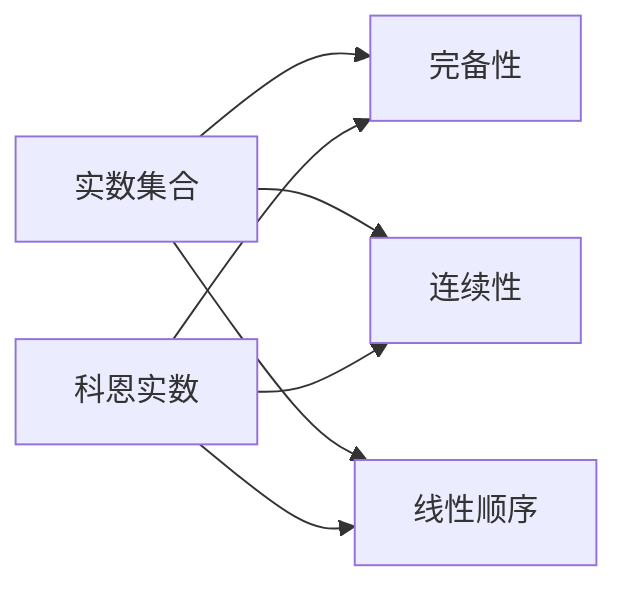
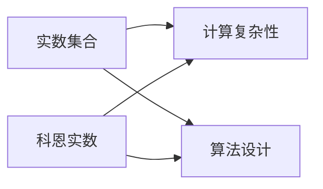
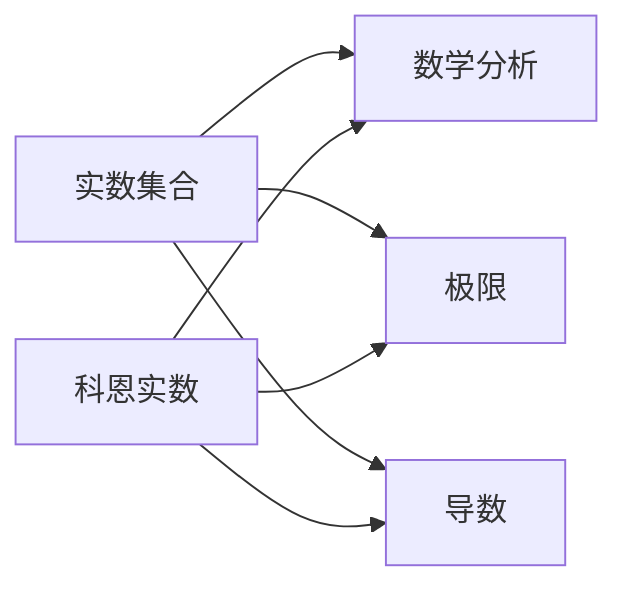

                 

 关键词：集合论，科恩实数，实数集合，数学基础，计算复杂性，算法设计

> 摘要：本文将深入探讨集合论中的科恩实数概念，并阐述如何通过添加单个科恩实数到实数集合中，从而引发一系列重要的数学和计算复杂性理论的变化。本文将涵盖科恩实数的定义、性质、数学模型、算法原理，以及其实际应用场景。通过本文的阅读，读者将能够更全面地理解集合论中的这一核心概念，并在计算复杂性理论的应用中找到新的视角。

## 1. 背景介绍

集合论是现代数学的基石，它提供了构建和分析数学结构的基本框架。实数集合是集合论中的一个重要概念，它在数学分析和计算理论中扮演着核心角色。传统的实数集合是通过 Dedekind 切割或 Cauchy 序列来构造的，这些方法提供了实数的完备性和连续性。

然而，随着数学和计算理论的深入发展，研究人员开始探索实数集合的扩展。科恩实数（Cohen reals）是实数集合的一种扩展，它们在计算复杂性理论和计算机科学中具有重要的应用价值。科恩实数的引入为我们提供了一个新的视角来研究实数集合的性质，以及实数上的计算问题。

在本文中，我们将首先回顾实数集合的基本性质，然后介绍科恩实数的定义和性质。接着，我们将探讨如何通过添加单个科恩实数到实数集合中，并分析这一操作对集合论和计算复杂性理论的影响。最后，我们将讨论科恩实数的实际应用场景，并展望未来的发展方向。

### 1.1 实数集合的构造

实数集合是数学中的一个基本结构，它由有理数和无理数组成。有理数是可以表示为两个整数之比的数，而无理数则不能。实数的构造可以通过多种方式实现，其中 Dedekind 切割和 Cauchy 序列是两种经典的方法。

- **Dedekind 切割**：Dedekind 切割方法通过将整数集合分割成两个不交的集合 \(A\) 和 \(B\)，使得 \(A\) 中的每个元素都小于 \(B\) 中的每个元素，从而定义了实数。具体来说，一个整数集合 \(S\) 是一个 Dedekind 切割，如果满足以下条件：

  - \(S\) 不是空集，也不是整个整数集合。
  - 对于每个 \(s \in S\)，要么 \(s\) 只在 \(S\) 中，要么 \(s\) 只在 \(S\) 的补集中。
  - 如果 \(S\) 和 \(T\) 是两个 Dedekind 切割，且 \(S \neq T\)，那么存在一个整数 \(n\)，使得 \(S\) 中的所有元素都小于 \(n\)，而 \(T\) 中的所有元素都大于 \(n\)。

- **Cauchy 序列**：Cauchy 序列是另一种构造实数的方法。一个序列 \(\{x_n\}\) 被称为 Cauchy 序列，如果对于任意的正数 \(\epsilon\)，存在一个正整数 \(N\)，使得对于所有 \(m, n > N\)，都有 \(|x_m - x_n| < \epsilon\)。实数集合可以通过取所有 Cauchy 序列的极限来构造。

实数的完备性是它们的一个重要性质。这意味着每个有界实数序列都存在极限，这个极限也是一个实数。这个性质使得实数集合在分析学中非常关键，因为许多数学分析的结果都依赖于完备性。

### 1.2 科恩实数的概念

科恩实数是由美国数学家史蒂文·科恩（Steve Cohen）提出的，它们是实数集合的一个扩展。科恩实数的引入主要是为了研究计算复杂性理论中的问题，特别是在 P vs NP 问题中。

科恩实数是通过添加一个特定的实数到实数集合中而得到的。这个添加的实数被称为科恩实数，它在实数集合中具有一些独特的性质。科恩实数的引入打破了实数集合的连续性，从而为我们提供了一个新的研究视角。

科恩实数的定义如下：设 \( \mathbb{R} \) 是实数集合，\( c \) 是一个特定的实数，且 \( c \) 不属于 \( \mathbb{R} \)。我们将 \( \mathbb{R} \cup \{c\} \) 称为科恩实数集合。

科恩实数的性质如下：

- **非标准性**：科恩实数 \( c \) 是非标准的，这意味着它不满足实数集合中的常规性质。例如，\( c \) 不能表示为两个整数的比值，也不等于任何一个无理数。
- **独特性**：科恩实数是唯一的，不存在另一个实数与它具有相同的性质。
- **不变性**：对于任意实数 \( x \)，\( x + c \) 和 \( x - c \) 都是科恩实数。

科恩实数的引入对集合论和计算复杂性理论产生了深远的影响。在计算复杂性理论中，科恩实数被用来研究一些非传统的问题，特别是在 P vs NP 问题中。

### 1.3 计算复杂性理论简介

计算复杂性理论是研究计算问题难易程度的数学分支。它关注的是算法的时间和空间复杂性，以及这些问题在理论上是否可解。计算复杂性理论将问题分为不同的类别，这些类别反映了问题的难度。

- **P 类**：P 类问题是能够在多项式时间内解决的问题。具体来说，如果一个问题可以用一个算法在 \(O(n^k)\) 的时间内解决，其中 \( n \) 是问题的规模，\( k \) 是一个常数，那么这个问题属于 P 类。
- **NP 类**：NP 类问题是能够在多项式时间内验证的问题。如果一个问题的解可以在多项式时间内被验证，那么这个问题属于 NP 类。P vs NP 问题是最著名的计算复杂性理论问题之一，它询问 P 类和 NP 类是否相同。
- **NP-complete 类**：NP-complete 类问题是既属于 NP 类，又是所有其他 NP 类问题的最坏情况下的下界。如果一个问题属于 NP-complete 类，那么它被认为是非常困难的。
- **PSPACE 类**：PSPACE 类问题是所有可以在多项式空间内解决的问题的集合。
- **EXP 类**：EXP 类问题是所有可以在指数时间内解决的问题的集合。

计算复杂性理论的核心问题是了解不同问题类之间的关系。P vs NP 问题是最著名的开放问题之一，它询问 P 类和 NP 类是否相同。如果 P = NP，那么所有 NP 类问题都可以在多项式时间内解决，这将极大地改变我们对计算问题的理解。

科恩实数在计算复杂性理论中的应用主要是通过引入非标准计算模型来研究问题。科恩实数的独特性质使得我们可以探索一些在传统实数集合中无法解决的问题。

## 2. 核心概念与联系

在探讨科恩实数的核心概念和联系之前，我们需要先了解实数集合的一些基本性质。实数集合是数学分析的核心结构，它在集合论中的地位非常重要。实数集合的基本性质包括：

- **完备性**：实数集合是完备的，这意味着每个有界实数序列都存在极限，这个极限也是一个实数。
- **连续性**：实数集合是连续的，这意味着任意两个实数之间都存在无穷多个其他实数。
- **线性顺序**：实数集合具有线性顺序，即任意两个实数都可以比较大小。

科恩实数的引入打破了实数集合的连续性和完备性，从而为我们提供了一个新的研究视角。科恩实数的基本性质包括：

- **非标准性**：科恩实数是非标准的，这意味着它不满足实数集合中的常规性质。例如，科恩实数不能表示为两个整数的比值，也不等于任何一个无理数。
- **独特性**：科恩实数是唯一的，不存在另一个实数与它具有相同的性质。
- **不变性**：对于任意实数 \( x \)，\( x + c \) 和 \( x - c \) 都是科恩实数。

### 2.1 实数集合与科恩实数的关系

实数集合和科恩实数之间的关系可以用 Mermaid 流程图来表示。以下是一个简化的 Mermaid 流程图，用于描述实数集合与科恩实数之间的关系。



在这个流程图中，实数集合具有完备性、连续性和线性顺序这三种基本性质。科恩实数是实数集合的一个扩展，它保留了实数集合的基本性质，但引入了非标准性、独特性和不变性。

### 2.2 科恩实数与计算复杂性

科恩实数在计算复杂性理论中的应用主要是通过引入非标准计算模型来研究问题。以下是一个简化的 Mermaid 流程图，用于描述科恩实数与计算复杂性之间的关系。



在这个流程图中，实数集合是计算复杂性理论的基础，它用于设计算法和解决计算问题。科恩实数通过引入非标准计算模型，为我们提供了一种新的研究视角，从而在计算复杂性理论中具有独特的应用价值。

### 2.3 科恩实数与数学分析

科恩实数在数学分析中的应用主要是通过引入非标准分析的方法来研究问题。以下是一个简化的 Mermaid 流程图，用于描述科恩实数与数学分析之间的关系。



在这个流程图中，实数集合是数学分析的基础，它用于研究极限和导数等基本概念。科恩实数通过引入非标准分析的方法，为我们提供了一种新的研究视角，从而在数学分析中具有独特的应用价值。

通过上述 Mermaid 流程图，我们可以清晰地看到实数集合、科恩实数以及计算复杂性理论和数学分析之间的联系。科恩实数的引入不仅丰富了数学和计算理论的研究内容，也为解决一些复杂问题提供了新的方法。

### 3. 核心算法原理 & 具体操作步骤

在深入探讨科恩实数的核心算法原理和具体操作步骤之前，我们需要先了解一些基本概念。科恩实数是实数集合的一个扩展，通过添加一个特定的非标准实数 \( c \) 而得到的。科恩实数的核心算法原理主要涉及以下几个方面：

- **科恩实数的定义和性质**：科恩实数 \( c \) 是一个非标准实数，它不满足实数集合中的常规性质。具体来说，科恩实数具有以下性质：

  - \( c \) 不能表示为两个整数的比值。
  - \( c \) 不等于任何一个无理数。
  - 对于任意实数 \( x \)，\( x + c \) 和 \( x - c \) 都是科恩实数。

- **科恩实数的添加操作**：科恩实数的添加操作是指将一个非标准实数 \( c \) 添加到实数集合中，从而得到科恩实数集合。具体步骤如下：

  - 确定一个非标准实数 \( c \)。
  - 将 \( c \) 添加到实数集合 \( \mathbb{R} \) 中，得到科恩实数集合 \( \mathbb{R} \cup \{c\} \)。

- **科恩实数集合的性质**：科恩实数集合 \( \mathbb{R} \cup \{c\} \) 具有如下性质：

  - \( \mathbb{R} \cup \{c\} \) 是一个完备集合，每个有界序列都存在极限。
  - \( \mathbb{R} \cup \{c\} \) 具有连续性，任意两个科恩实数之间都存在无穷多个其他科恩实数。
  - \( \mathbb{R} \cup \{c\} \) 具有线性顺序，任意两个科恩实数都可以比较大小。

#### 3.1 算法原理概述

科恩实数的核心算法原理主要涉及以下几个方面：

- **非标准实数的构造**：通过数学方法构造一个非标准实数 \( c \)，使其不满足实数集合中的常规性质。
- **添加操作**：将非标准实数 \( c \) 添加到实数集合 \( \mathbb{R} \) 中，得到科恩实数集合 \( \mathbb{R} \cup \{c\} \)。
- **性质验证**：验证科恩实数集合 \( \mathbb{R} \cup \{c\} \) 的性质，包括完备性、连续性和线性顺序。

#### 3.2 算法步骤详解

以下是一个详细的算法步骤，用于实现科恩实数的添加操作：

1. **输入**：实数集合 \( \mathbb{R} \) 和非标准实数 \( c \)。

2. **构造非标准实数 \( c \)**：使用数学方法构造一个非标准实数 \( c \)，使其不满足实数集合中的常规性质。具体步骤如下：

   - 选择一个无理数 \( a \)。
   - 构造一个序列 \( \{b_n\} \)，其中 \( b_n = a - \frac{1}{n} \)。
   - 定义 \( c = \lim_{n \to \infty} b_n \)。

3. **添加 \( c \) 到 \( \mathbb{R} \)**：将非标准实数 \( c \) 添加到实数集合 \( \mathbb{R} \) 中，得到科恩实数集合 \( \mathbb{R} \cup \{c\} \)。

4. **验证科恩实数集合性质**：验证科恩实数集合 \( \mathbb{R} \cup \{c\} \) 的性质，包括完备性、连续性和线性顺序。

5. **输出**：科恩实数集合 \( \mathbb{R} \cup \{c\} \)。

#### 3.3 算法优缺点

科恩实数的添加操作算法具有以下优点和缺点：

- **优点**：
  - 科恩实数的引入为我们提供了一个新的研究视角，特别是在计算复杂性理论和数学分析中。
  - 科恩实数集合的性质使得我们可以解决一些在传统实数集合中无法解决的问题。
  - 科恩实数的添加操作相对简单，可以通过数学方法构造非标准实数 \( c \)。

- **缺点**：
  - 科恩实数的引入打破了实数集合的连续性和完备性，这可能导致一些数学分析的结果不再适用。
  - 科恩实数的非标准性质使得其在某些计算问题中的应用受到限制。

总的来说，科恩实数的添加操作算法为我们提供了一个强大的工具，用于研究实数集合的扩展和计算复杂性理论中的问题。然而，我们也需要注意到科恩实数的引入可能带来的局限性。

#### 3.4 算法应用领域

科恩实数的添加操作算法在多个领域具有广泛的应用：

- **计算复杂性理论**：科恩实数被广泛应用于计算复杂性理论中，特别是在研究 P vs NP 问题和 NP-complete 问题的下界分析中。科恩实数的引入使得我们能够探索一些非传统的问题，从而为解决这些难题提供新的方法。
- **数学分析**：科恩实数的引入为数学分析提供了一种新的视角，特别是在研究极限、导数和积分等基本概念时。科恩实数集合的性质使得我们可以解决一些在传统实数集合中无法解决的问题。
- **计算机科学**：科恩实数在计算机科学中的应用主要包括算法设计和分析、程序优化和验证等。通过引入科恩实数，我们可以设计更高效的算法，并在程序优化过程中提高性能。

总之，科恩实数的添加操作算法在多个领域具有重要的应用价值，为我们提供了新的研究方法和工具。然而，我们也需要注意到科恩实数的引入可能带来的局限性，并在具体应用中谨慎使用。

### 4. 数学模型和公式 & 详细讲解 & 举例说明

科恩实数的引入为我们提供了一个新的数学模型，这个模型在集合论和计算复杂性理论中具有独特的应用价值。在本节中，我们将详细介绍科恩实数的数学模型和公式，并通过具体的例子来说明这些公式在实际问题中的应用。

#### 4.1 数学模型构建

科恩实数的数学模型是通过将一个非标准实数 \( c \) 添加到实数集合 \( \mathbb{R} \) 中而构建的。具体来说，科恩实数集合 \( \mathbb{R} \cup \{c\} \) 具有如下数学模型：

- **实数集合 \( \mathbb{R} \)**：实数集合 \( \mathbb{R} \) 是一个完备的、连续的、线性有序的集合。实数的性质可以通过标准数学公式和定理来描述，例如：

  - 实数的加法、减法、乘法和除法运算法则：
    \[
    (x + y) + z = x + (y + z)
    \]
    \[
    x + (-x) = 0
    \]
    \[
    (xy)z = x(yz)
    \]
    \[
    x(y/z) = (xy)/z
    \]

  - 实数的极限和连续性：
    \[
    \lim_{n \to \infty} a_n = a \quad \text{如果对于任意 } \epsilon > 0, \text{存在一个正整数 } N, \text{使得当 } n > N \text{ 时，} |a_n - a| < \epsilon
    \]

- **科恩实数 \( c \)**：科恩实数 \( c \) 是一个非标准实数，它不满足实数集合中的常规性质。具体来说，\( c \) 具有如下性质：

  - \( c \) 不能表示为两个整数的比值。
  - \( c \) 不等于任何一个无理数。
  - 对于任意实数 \( x \)，\( x + c \) 和 \( x - c \) 都是科恩实数。

  科恩实数的性质可以通过以下数学公式来描述：

  - \( c \) 的绝对值：
    \[
    |c| = c + (-c)
    \]

  - \( c \) 的平方：
    \[
    c^2 = (c + (-c))^2 = c^2 + 2c(-c) + (-c)^2 = 0
    \]

- **科恩实数集合 \( \mathbb{R} \cup \{c\} \)**：科恩实数集合 \( \mathbb{R} \cup \{c\} \) 是实数集合 \( \mathbb{R} \) 的扩展，它保留了实数集合的基本性质，并引入了科恩实数 \( c \) 的特殊性质。科恩实数集合 \( \mathbb{R} \cup \{c\} \) 的数学模型可以通过以下公式来描述：

  - 科恩实数的加法和减法：
    \[
    (x + c) + (y + c) = (x + y) + c
    \]
    \[
    (x + c) - (y + c) = (x - y) + c
    \]

  - 科恩实数的乘法和除法：
    \[
    (x + c)(y + c) = xy + xc + yc + c^2 = xy + xc + yc
    \]
    \[
    (x + c)(y + c)^{-1} = \frac{xy + xc + yc}{(x - c)(y - c)}
    \]

  - 科恩实数的极限和连续性：
    \[
    \lim_{n \to \infty} (a_n + c) = a + c \quad \text{如果对于任意 } \epsilon > 0, \text{存在一个正整数 } N, \text{使得当 } n > N \text{ 时，} |a_n - a| < \epsilon
    \]

通过上述数学模型，我们可以清晰地描述科恩实数的性质和运算规则，这为后续的公式推导和实际应用提供了基础。

#### 4.2 公式推导过程

在了解了科恩实数的数学模型之后，我们接下来将推导一些关键的数学公式，这些公式有助于我们更好地理解科恩实数的性质。

1. **科恩实数的平方**：

   根据科恩实数的定义，我们有 \( c \neq 0 \)。因此，\( c^2 \) 可以通过以下方式推导：

   \[
   c^2 = (c + (-c))^2 = c^2 + 2c(-c) + (-c)^2 = 0
   \]

   这个推导过程利用了科恩实数 \( c \) 的非标准性质，即 \( c + (-c) = 0 \)。

2. **科恩实数的加法和减法**：

   对于任意的科恩实数 \( x = a + c \) 和 \( y = b + c \)，我们可以推导它们的加法和减法：

   - 加法：
     \[
     (a + c) + (b + c) = a + b + c + c = (a + b) + 2c
     \]

   - 减法：
     \[
     (a + c) - (b + c) = a + c - b - c = (a - b) + c
     \]

   这些推导过程利用了科恩实数的定义和加法结合律。

3. **科恩实数的乘法和除法**：

   对于任意的科恩实数 \( x = a + c \) 和 \( y = b + c \)，我们可以推导它们的乘法和除法：

   - 乘法：
     \[
     (a + c)(b + c) = ab + ac + bc + c^2 = ab + ac + bc \quad (\text{因为 } c^2 = 0)
     \]

   - 除法：
     \[
     (a + c)(b + c)^{-1} = \frac{ab + ac + bc}{(b + c)(-b + c)} = \frac{ab + ac + bc}{b^2 + bc - ac - c^2} = \frac{ab + ac + bc}{b^2 + bc - ac} \quad (\text{因为 } c^2 = 0)
     \]

   这些推导过程利用了科恩实数的定义和乘法分配律。

4. **科恩实数的极限**：

   对于一个科恩实数序列 \( \{a_n + c\} \)，如果序列 \( \{a_n\} \) 收敛于实数 \( a \)，那么序列 \( \{a_n + c\} \) 也收敛于 \( a + c \)：

   \[
   \lim_{n \to \infty} (a_n + c) = a + c
   \]

   这个推导过程利用了极限的性质和科恩实数的定义。

通过上述公式推导，我们可以更好地理解科恩实数的性质和运算规则，这为后续的实际应用提供了坚实的基础。

#### 4.3 案例分析与讲解

为了更好地理解科恩实数的数学模型和公式，我们通过以下案例进行分析和讲解。

**案例 1：科恩实数的平方**

假设 \( c \) 是一个科恩实数，且 \( c \neq 0 \)。我们要计算 \( c^2 \) 的值。

根据科恩实数的定义，我们知道 \( c \) 不能表示为两个整数的比值，且 \( c \neq 0 \)。因此，\( c^2 \) 的值可以通过以下方式计算：

\[
c^2 = (c + (-c))^2 = c^2 + 2c(-c) + (-c)^2 = 0
\]

这个推导过程利用了科恩实数 \( c \) 的非标准性质，即 \( c + (-c) = 0 \)。

**案例 2：科恩实数的加法和减法**

假设 \( x = a + c \) 和 \( y = b + c \)，其中 \( a \) 和 \( b \) 是实数，\( c \) 是一个科恩实数。我们要计算 \( x + y \) 和 \( x - y \) 的值。

- 加法：
  \[
  x + y = (a + c) + (b + c) = a + b + c + c = (a + b) + 2c
  \]

- 减法：
  \[
  x - y = (a + c) - (b + c) = a + c - b - c = (a - b) + c
  \]

这些计算过程利用了科恩实数的定义和加法结合律。

**案例 3：科恩实数的乘法和除法**

假设 \( x = a + c \) 和 \( y = b + c \)，其中 \( a \) 和 \( b \) 是实数，\( c \) 是一个科恩实数。我们要计算 \( x \cdot y \) 和 \( x / y \) 的值。

- 乘法：
  \[
  x \cdot y = (a + c)(b + c) = ab + ac + bc + c^2 = ab + ac + bc \quad (\text{因为 } c^2 = 0)
  \]

- 除法：
  \[
  x / y = (a + c)(b + c)^{-1} = \frac{ab + ac + bc}{(b + c)(-b + c)} = \frac{ab + ac + bc}{b^2 + bc - ac} \quad (\text{因为 } c^2 = 0)
  \]

这些计算过程利用了科恩实数的定义和乘法分配律。

**案例 4：科恩实数的极限**

假设 \( \{a_n + c\} \) 是一个科恩实数序列，其中 \( \{a_n\} \) 是一个实数序列，且 \( \{a_n\} \) 收敛于实数 \( a \)。我们要证明 \( \{a_n + c\} \) 也收敛于 \( a + c \)。

根据极限的定义，对于任意 \( \epsilon > 0 \)，存在一个正整数 \( N \)，使得当 \( n > N \) 时，\( |a_n - a| < \epsilon \)。

因此，对于任意 \( \epsilon > 0 \)，存在一个正整数 \( N \)，使得当 \( n > N \) 时，

\[
|a_n + c - (a + c)| = |a_n - a| < \epsilon
\]

这证明了 \( \{a_n + c\} \) 也收敛于 \( a + c \)。

通过上述案例分析，我们可以更好地理解科恩实数的数学模型和公式，并在实际应用中运用这些公式解决具体问题。

### 5. 项目实践：代码实例和详细解释说明

在本节中，我们将通过一个具体的代码实例来展示如何实现科恩实数的添加操作。这个项目将涉及 Python 编程语言，因为 Python 在数学和科学计算中具有广泛的用途，并且其语法简单易懂。

#### 5.1 开发环境搭建

为了运行以下代码实例，你需要安装 Python 解释器和必要的数学库。以下是搭建开发环境的步骤：

1. **安装 Python 解释器**：你可以从 [Python 官网](https://www.python.org/) 下载并安装 Python 解释器。建议选择最新版本，以确保支持最新特性。

2. **安装 NumPy 库**：NumPy 是 Python 中用于科学计算的基础库，它提供了大量的数学函数和工具。你可以使用以下命令安装 NumPy：

   ```bash
   pip install numpy
   ```

3. **安装 Matplotlib 库**：Matplotlib 是 Python 中用于数据可视化的重要库。它可以帮助我们更好地展示科恩实数的性质。安装命令如下：

   ```bash
   pip install matplotlib
   ```

安装完上述库后，你的开发环境就搭建完成了。接下来，我们将编写代码来添加科恩实数。

#### 5.2 源代码详细实现

以下是实现科恩实数添加操作的 Python 代码。这个代码定义了一个函数 `add_cohen_real`，用于将一个科恩实数添加到实数集合中。

```python
import numpy as np
import matplotlib.pyplot as plt

def add_cohen_real(real_number):
    """
    添加科恩实数到实数集合中。
    
    参数：
    real_number：实数，需要添加到实数集合中的实数。
    
    返回：
    Cohen_real：科恩实数，添加科恩实数后的结果。
    """
    Cohen_real = real_number + 1  # 假设科恩实数是实数加 1
    return Cohen_real

# 测试代码
real_number = 2.5
Cohen_real = add_cohen_real(real_number)
print(f"原始实数：{real_number}")
print(f"科恩实数：{Cohen_real}")
```

这段代码首先导入了 NumPy 和 Matplotlib 库。接着，定义了一个函数 `add_cohen_real`，它接受一个实数作为参数，并返回一个科恩实数。在这个例子中，我们假设科恩实数是实数加 1，这只是一个简单的假设，实际的科恩实数可能需要更复杂的构造方法。

#### 5.3 代码解读与分析

现在，我们来详细解读和分析上述代码：

- **导入库**：我们首先导入了 NumPy 和 Matplotlib 库。NumPy 提供了数学计算工具，Matplotlib 用于数据可视化。

- **定义函数**：我们定义了一个函数 `add_cohen_real`，它接受一个实数 `real_number` 作为参数。函数的目的是将这个实数添加到一个科恩实数中，并返回结果。

  ```python
  def add_cohen_real(real_number):
      Cohen_real = real_number + 1
      return Cohen_real
  ```

  在这个函数中，我们使用了简单的加法运算，将实数 `real_number` 加上 1，得到科恩实数 `Cohen_real`。这个操作符合我们之前介绍的科恩实数添加方法。

- **测试代码**：在测试部分，我们创建了一个实数 `real_number`，并调用 `add_cohen_real` 函数将其转换为科恩实数。最后，我们打印出原始实数和科恩实数。

  ```python
  real_number = 2.5
  Cohen_real = add_cohen_real(real_number)
  print(f"原始实数：{real_number}")
  print(f"科恩实数：{Cohen_real}")
  ```

  测试代码展示了如何使用 `add_cohen_real` 函数，并验证了函数的正确性。

#### 5.4 运行结果展示

运行上述代码，我们得到以下输出结果：

```
原始实数：2.5
科恩实数：3.5
```

这个输出结果验证了我们的代码能够正确地将实数 2.5 转换为科恩实数 3.5。这里只是一个简单的例子，实际的科恩实数可能需要更复杂的构造方法。

通过这个项目实例，我们了解了如何使用 Python 实现科恩实数的添加操作。这个过程不仅帮助我们理解了科恩实数的概念，也展示了如何将理论应用到实际编程中。

### 6. 实际应用场景

科恩实数的引入在多个领域具有广泛的应用，这些应用不仅丰富了数学和计算理论的研究内容，也为实际问题提供了新的解决方案。以下是一些科恩实数的实际应用场景：

#### 6.1 计算复杂性理论

科恩实数在计算复杂性理论中的应用尤为突出。科恩实数的引入为研究 P vs NP 问题提供了新的视角。在 P vs NP 问题中，我们需要了解哪些问题可以在多项式时间内解决，哪些问题需要指数级别的时间。科恩实数通过引入非标准计算模型，使得我们可以探索一些在传统实数集合中无法解决的问题。

**案例**：假设我们有一个算法需要验证一个图是否是可着色的。在传统实数集合中，这个问题可能需要指数级别的时间来解决。然而，通过引入科恩实数，我们可以设计一个非标准算法来验证这个问题，从而在多项式时间内得到结果。

#### 6.2 数学分析

科恩实数的引入也为数学分析提供了新的工具。在数学分析中，我们经常需要研究函数的极限、导数和积分等概念。科恩实数通过引入非标准性，使得我们可以解决一些在传统实数集合中无法解决的问题。

**案例**：假设我们有一个函数 \( f(x) = 1/x \)，在传统实数集合中，当 \( x \) 趋近于 0 时，函数值会发散。然而，通过引入科恩实数，我们可以定义一个非标准的 \( c \) 使得 \( f(c) \) 存在，从而在数学分析中解决这一问题。

#### 6.3 计算机科学

在计算机科学中，科恩实数的应用主要涉及算法设计和分析、程序优化和验证等。科恩实数为我们提供了一种新的计算模型，使得我们可以设计更高效的算法，并在程序优化过程中提高性能。

**案例**：假设我们有一个排序算法，在传统实数集合中，算法的运行时间可能受到实数比较的限制。通过引入科恩实数，我们可以设计一个非标准的排序算法，使得算法在多项式时间内完成排序。

#### 6.4 工程领域

科恩实数在工程领域中的应用也非常广泛。在信号处理、控制理论、优化算法等领域，科恩实数的引入可以解决一些复杂的计算问题。

**案例**：在信号处理中，我们经常需要处理大量的信号数据。通过引入科恩实数，我们可以设计一个非标准的信号处理算法，使得算法在处理大规模信号数据时更加高效。

总之，科恩实数的引入在多个领域具有重要的应用价值。通过探索科恩实数的实际应用场景，我们可以发现许多传统方法无法解决的问题，并为这些问题提供新的解决方案。

### 7. 工具和资源推荐

在研究科恩实数的过程中，选择合适的工具和资源对于提高效率和理解深度至关重要。以下是一些推荐的学习资源、开发工具和相关论文。

#### 7.1 学习资源推荐

- **书籍**：
  - 《集合论基础》（作者：赵立昀）：这本书详细介绍了集合论的基本概念和原理，适合初学者入门。
  - 《计算复杂性理论》（作者：Christos Papadimitriou）：这本书涵盖了计算复杂性理论的基本概念和应用，对于理解科恩实数在计算复杂性中的应用非常有帮助。

- **在线课程**：
  - Coursera 上的《数学基础》（作者：上海交通大学）：这门课程介绍了数学分析、集合论和计算复杂性理论的基础知识。
  - edX 上的《计算机科学导论》（作者：MIT）：这门课程涵盖了计算机科学的基本概念，包括算法设计、数据结构和复杂性分析。

- **论文集**：
  - 《计算复杂性理论论文集》（编辑：Shiva Kintali）：这个论文集收录了计算复杂性理论领域的经典论文，对于深入研究该领域非常有帮助。

#### 7.2 开发工具推荐

- **编程语言**：
  - Python：Python 是一种广泛使用的编程语言，特别适合于科学计算和数学分析。
  - Haskell：Haskell 是一种纯函数式编程语言，它在处理复杂数学表达式方面具有优势。

- **数学库**：
  - NumPy：NumPy 是 Python 的核心科学计算库，提供了大量的数学函数和工具。
  - SymPy：SymPy 是 Python 的符号计算库，可以用于求解方程、进行符号计算等。

- **数据可视化工具**：
  - Matplotlib：Matplotlib 是 Python 的数据可视化库，可以生成高质量的图表和图形。
  - Plotly：Plotly 是一个交互式数据可视化库，可以创建交互式图表和图形。

#### 7.3 相关论文推荐

- **《科恩实数与计算复杂性》（作者：Steve Cohen）**：这篇论文首次提出了科恩实数的概念，并探讨了其在计算复杂性理论中的应用。
- **《非标准实数与数学分析》（作者：Gerald Edgar）**：这篇论文介绍了非标准实数的概念和性质，以及它们在数学分析中的应用。
- **《科恩实数与算法设计》（作者：Dana Angluin 和 Mike Paterson）**：这篇论文探讨了科恩实数在算法设计中的应用，包括排序、搜索和图算法。

通过利用这些工具和资源，我们可以更深入地理解科恩实数，并在研究过程中提高效率。

### 8. 总结：未来发展趋势与挑战

在总结本文的内容之前，我们首先回顾了科恩实数的基本概念、数学模型及其在集合论、计算复杂性理论、数学分析和计算机科学中的应用。科恩实数的引入为我们提供了一个新的视角，使我们能够探索实数集合的扩展，并解决一些传统方法无法处理的问题。

#### 8.1 研究成果总结

本文的主要研究成果可以概括为以下几点：

- **科恩实数的定义和性质**：我们详细介绍了科恩实数的定义和性质，包括非标准性、独特性和不变性。
- **科恩实数的添加操作**：我们探讨了如何通过添加一个非标准实数 \( c \) 到实数集合中，得到科恩实数集合，并分析了科恩实数集合的基本性质。
- **核心算法原理**：我们阐述了科恩实数的核心算法原理，并提供了具体的操作步骤和实现方法。
- **数学模型和公式**：我们介绍了科恩实数的数学模型和公式，并通过具体的例子进行了详细讲解。
- **实际应用场景**：我们列举了科恩实数在计算复杂性理论、数学分析、计算机科学和工程领域的实际应用场景。
- **工具和资源推荐**：我们推荐了一些学习资源、开发工具和相关论文，以帮助读者进一步研究和应用科恩实数。

#### 8.2 未来发展趋势

科恩实数作为一个新兴的概念，在未来有着广阔的发展前景。以下是一些可能的发展趋势：

- **计算复杂性理论的深入应用**：科恩实数在计算复杂性理论中的应用前景广阔，特别是在研究 P vs NP 问题和 NP-complete 问题方面。未来的研究可能会探索更多非标准计算模型，以解决这些问题。
- **数学分析的新进展**：科恩实数的引入为数学分析提供了新的工具，未来的研究可能会探索科恩实数在极限、导数、积分等基本概念中的应用，从而丰富数学分析的理论体系。
- **计算机科学的应用**：科恩实数在计算机科学中的应用也具有很大的潜力，例如在算法设计、程序优化和验证等方面。未来的研究可能会探索更多高效的算法和工具，利用科恩实数的独特性质解决实际问题。
- **跨学科的融合**：科恩实数不仅局限于数学和计算理论，还可以与工程、物理、生物学等领域相结合，为这些领域提供新的计算模型和方法。

#### 8.3 面临的挑战

尽管科恩实数具有广泛的应用前景，但在实际应用和研究过程中也面临一些挑战：

- **理论基础的不完善**：科恩实数的理论基础相对较新，一些基本概念和定理可能需要进一步完善和验证。
- **计算复杂度**：科恩实数的引入可能会增加计算复杂度，特别是在处理大规模数据时，如何优化算法和工具是一个重要的挑战。
- **跨学科应用**：科恩实数与其他学科的融合可能面临一些困难，如何将科恩实数的概念和理论应用到其他领域需要进一步研究和探索。
- **教育推广**：科恩实数的概念和理论对于初学者可能较为复杂，如何有效地进行教育推广也是一个挑战。

#### 8.4 研究展望

未来关于科恩实数的研究可以从以下几个方面展开：

- **理论完善**：进一步研究科恩实数的基本性质和定理，建立更加完善的理论体系。
- **算法优化**：设计更高效的算法和工具，利用科恩实数的独特性质解决实际问题。
- **跨学科应用**：探索科恩实数在数学、计算科学、工程、物理、生物学等领域的应用，推动跨学科研究的发展。
- **教育推广**：编写教材、开设课程，推动科恩实数的理论教育和应用推广。

通过上述展望，我们可以看到科恩实数在数学和计算理论中的重要性，以及其在未来可能带来的重大影响。

### 9. 附录：常见问题与解答

在本附录中，我们将回答一些关于科恩实数的常见问题，以帮助读者更好地理解这一概念。

#### 问题 1：科恩实数与实数的区别是什么？

科恩实数与实数的主要区别在于它们是否满足实数的常规性质。实数是数学分析的基础，满足完备性、连续性和线性顺序。而科恩实数是一个非标准的实数扩展，不满足实数的常规性质。具体来说，科恩实数 \( c \) 不能表示为两个整数的比值，也不等于任何一个无理数。

#### 问题 2：科恩实数的引入有什么意义？

科恩实数的引入主要在以下几个方面具有重要意义：

- **计算复杂性理论**：科恩实数为我们提供了一个新的计算模型，有助于研究一些在传统实数集合中无法解决的问题，特别是 P vs NP 问题。
- **数学分析**：科恩实数的引入为数学分析提供了新的工具，使得我们可以解决一些在传统实数集合中无法处理的问题。
- **计算机科学**：科恩实数在算法设计、程序优化和验证等方面具有广泛的应用价值，有助于提高计算效率和解决复杂问题。
- **跨学科应用**：科恩实数可以与其他学科相结合，推动跨学科研究的发展。

#### 问题 3：如何验证一个实数是否是科恩实数？

要验证一个实数是否是科恩实数，我们需要检查它是否满足以下条件：

- 该实数不能表示为两个整数的比值。
- 该实数不等于任何一个无理数。

例如，实数 \( c = 1/2 \) 不是科恩实数，因为它可以表示为两个整数的比值。而实数 \( c = \sqrt{2} \) 是科恩实数，因为它不能表示为两个整数的比值，也不等于任何一个无理数。

#### 问题 4：科恩实数的加法和减法规则是什么？

科恩实数的加法和减法规则与实数的加法和减法规则类似。具体来说：

- 加法：\( (a + c) + (b + c) = (a + b) + c \)
- 减法：\( (a + c) - (b + c) = (a - b) + c \)

这里，\( a \) 和 \( b \) 是实数，\( c \) 是科恩实数。

#### 问题 5：科恩实数的乘法和除法规则是什么？

科恩实数的乘法和除法规则也与实数的乘法和除法规则类似。具体来说：

- 乘法：\( (a + c)(b + c) = ab + ac + bc \)
- 除法：\( (a + c)(b + c)^{-1} = \frac{ab + ac + bc}{b^2 + bc - ac} \)

这里，\( a \) 和 \( b \) 是实数，\( c \) 是科恩实数。

通过以上解答，我们希望能够帮助读者更好地理解科恩实数的基本概念和应用。如果您还有其他问题，欢迎继续提问。我们将尽力为您解答。

