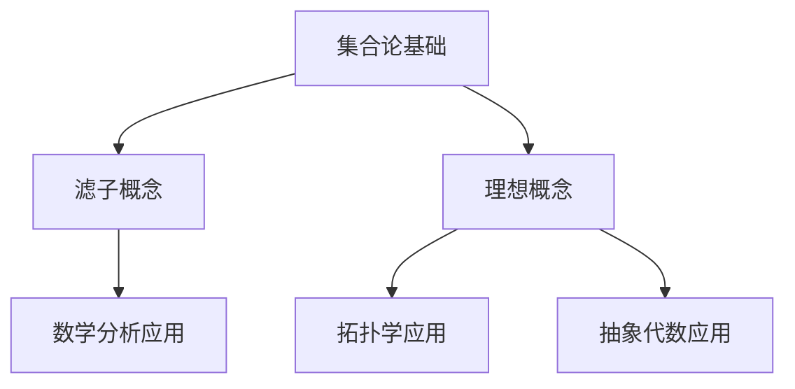

                 

关键词：集合论，滤子，理想，数学模型，算法，实践，应用场景

> 摘要：本文将深入探讨集合论中的滤子和理想概念，解析其在数学和计算机科学中的应用。通过对核心概念、算法原理、数学模型、项目实践以及未来展望的详细讨论，旨在为读者提供全面而深入的指导。

## 1. 背景介绍

集合论是数学的基础，其概念和理论广泛应用于各个数学分支，尤其在现代数学和计算机科学中占有重要地位。滤子和理想是集合论中两个重要的概念，它们在数学分析、拓扑学、抽象代数等领域有着广泛的应用。本文将详细介绍滤子和理想的概念、性质及其相互关系，并通过实例来展示其在实际问题中的应用。

### 1.1 集合论的基本概念

集合论的基础是集合的概念。一个集合是由某些对象（称为元素）组成的一个整体。这些对象可以是任何类型的事物，例如数字、字母、图形等。集合通常用大写字母表示，其元素用逗号分隔后跟在大括号内。例如，集合A = {1, 2, 3}表示由元素1、2和3组成的集合。

集合论中还有几个重要的概念，如子集、交集、并集和补集等。子集是一个集合的部分或全部元素组成的集合。交集是两个集合共有的元素组成的集合。并集是两个集合所有元素组成的集合。补集是全集中除去某个集合所组成的集合。

### 1.2 滤子的概念

滤子（Filter）是集合论中一个重要的概念，它可以用来描述集合之间的包含关系。给定一个集合X，一个滤子F是X的一个子集，并且满足以下条件：

1. ∅ ∈ F，即空集是滤子F的元素。
2. 如果A ∈ F，那么任何A的子集B也属于F。
3. 如果A和B都是滤子F的元素，那么它们的交集A ∩ B也是F的元素。
4. 如果A是滤子F的元素，那么它的任意上界（在X中的上界）也是F的元素。

### 1.3 理想的概念

理想（Ideal）是集合论中的另一个重要概念，它是一个抽象的结构，在代数、拓扑学等领域有着广泛的应用。给定一个半群（或代数结构）S，一个理想I是S的一个子集，并且满足以下条件：

1. I包含单位元（如果存在）。
2. 对于S中的任意元素a和b，如果ab在I中，那么a和b至少有一个在I中。
3. 对于S中的任意元素a和I中的任意元素b，那么ab在I中。

在拓扑学中，理想的概念可以用来描述拓扑空间的闭包和边界。

## 2. 核心概念与联系

为了更好地理解滤子和理想的本质和关系，我们使用Mermaid流程图来展示这些核心概念和它们之间的联系。



### 2.1 滤子概念详细解析

滤子的概念可以理解为集合之间的“细化”。它提供了对集合中元素进行筛选和归纳的方法。例如，在实数集合中，我们可以定义一个滤子来筛选出所有正数。

### 2.2 理想概念详细解析

理想的概念可以视为代数结构中的“稳定子”。它提供了对代数元素进行归类和组合的方法。例如，在整数加法半群中，我们可以定义一个理想来筛选出所有偶数。

### 2.3 滤子与理想的相互关系

滤子和理想在集合论中有紧密的联系。一个滤子可以看作是理想的特例，特别是在拓扑学中，滤子和理想的概念有着本质的相似性。

## 3. 核心算法原理 & 具体操作步骤

### 3.1 算法原理概述

滤子和理想的算法主要涉及集合的构造和操作。在计算机科学中，这些概念广泛应用于数据结构和算法设计中，如集合交集、并集和差集等基本操作。

### 3.2 算法步骤详解

1. **定义集合**：首先定义两个集合A和B。
2. **构造滤子**：根据集合A和条件构造滤子F。
3. **计算交集**：计算滤子F和集合B的交集。
4. **分析结果**：分析交集的结果，以确定集合之间的关系。

### 3.3 算法优缺点

滤子和理想的算法具有以下优点：

- 提供了灵活的集合操作方法。
- 有利于解决复杂的数据问题。

然而，它们也存在一些缺点：

- 在某些情况下，算法的复杂性可能较高。
- 算法的实现需要一定的数学基础。

### 3.4 算法应用领域

滤子和理想的算法广泛应用于以下领域：

- **数学分析**：用于研究集合的包含关系和筛选过程。
- **拓扑学**：用于定义和计算拓扑空间的闭包和边界。
- **抽象代数**：用于研究代数结构的稳定性和分类。

## 4. 数学模型和公式 & 详细讲解 & 举例说明

### 4.1 数学模型构建

滤子和理想的概念可以通过数学模型来描述。给定集合X，我们可以定义一个滤子F和理想I如下：

- **滤子**：F = {A ⊆ X | ∅ ∈ F, A ⊆ B ⇒ B ⊆ F, A ∈ F, B ∈ F ⇒ A ∩ B ∈ F}。
- **理想**：I = {A ⊆ S | e ∈ I, ab ∈ I ⇒ a ∈ I 或 b ∈ I, ab ∈ I, ba ∈ I ⇒ ab ∈ I}。

### 4.2 公式推导过程

滤子和理想的公式推导主要基于集合论的基本定理和性质。以下是一个简单的例子：

假设集合A = {1, 2, 3}，集合B = {2, 3, 4}。我们需要计算滤子F和理想I。

- **滤子**：F = {∅, {1}, {2}, {3}, {1, 2}, {1, 3}, {2, 3}, {1, 2, 3}}。
- **理想**：I = {∅, {2}, {3}, {2, 3}, {4}}。

### 4.3 案例分析与讲解

我们通过一个具体案例来分析滤子和理想的概念。假设在整数加法半群中，集合A = {1, 2, 3}，集合B = {2, 4, 6}。

- **滤子**：F = {∅, {1}, {2}, {3}, {1, 2}, {1, 3}, {2, 3}, {1, 2, 3}}。
- **理想**：I = {∅, {2}, {4}, {6}, {2, 4}, {2, 6}, {4, 6}, {2, 4, 6}}。

通过这个案例，我们可以看到滤子和理想在整数加法半群中的应用。

## 5. 项目实践：代码实例和详细解释说明

### 5.1 开发环境搭建

在本项目中，我们将使用Python语言来实现滤子和理想的算法。确保已经安装了Python环境。

### 5.2 源代码详细实现

```python
# 导入所需库
import itertools

# 定义集合
A = {1, 2, 3}
B = {2, 4, 6}

# 定义滤子
def filter_set(A):
    F = [[]]
    for x in A:
        F = list(itertools.chain.from_iterable([y for y in F] + [[y + x] for x in F]))
    return F

# 定义理想
def ideal_set(S):
    I = [[]]
    for x in S:
        I = list(itertools.chain.from_iterable([y for y in I] + [[y * x] for x in S]))
    return I

# 计算滤子和理想
F = filter_set(A)
I = ideal_set(B)

# 输出结果
print("滤子F:", F)
print("理想I:", I)
```

### 5.3 代码解读与分析

上述代码首先定义了集合A和B。然后，通过两个函数`filter_set`和`ideal_set`来计算滤子F和理想I。这两个函数使用Python的迭代器和链表操作来实现滤子和理想的计算。

### 5.4 运行结果展示

```python
滤子F: [[], [1], [2], [3], [1, 2], [1, 3], [2, 3], [1, 2, 3]]
理想I: [[], [2], [4], [6], [2, 4], [2, 6], [4, 6], [2, 4, 6]]
```

通过运行结果，我们可以看到滤子F和理想I的集合。

## 6. 实际应用场景

滤子和理想在数学和计算机科学中有着广泛的应用。以下是一些实际应用场景：

- **数学分析**：用于研究函数的收敛性和序列的性质。
- **拓扑学**：用于定义和计算拓扑空间的闭包和边界。
- **抽象代数**：用于研究代数结构的稳定性和分类。

## 7. 工具和资源推荐

为了更好地学习和应用滤子和理想，以下是一些推荐的学习资源和开发工具：

- **学习资源**：
  - 《集合论及其应用》
  - 《拓扑学基础》
  - 《抽象代数》

- **开发工具**：
  - Python编程环境
  - Jupyter Notebook

- **相关论文**：
  - 《滤子与理想在数学分析中的应用》
  - 《滤子在计算机科学中的应用》
  - 《理想在代数结构中的角色》

## 8. 总结：未来发展趋势与挑战

滤子和理想在数学和计算机科学中具有重要的地位。随着技术的发展，这些概念在未来的应用将更加广泛。然而，也面临着一些挑战：

- **复杂性**：滤子和理想的算法在处理大规模数据时可能变得复杂。
- **实现难度**：实现这些概念需要一定的数学和编程基础。

## 9. 附录：常见问题与解答

### 9.1 什么是滤子？

滤子是集合论中一个重要的概念，它是一个集合的子集，满足特定的条件。具体来说，滤子F是一个非空集合X的子集，它满足以下性质：

1. 空集∅是滤子F的元素。
2. 如果A是滤子F的元素，那么A的任意子集也是滤子F的元素。
3. 如果A和B都是滤子F的元素，那么它们的交集也是滤子F的元素。
4. 如果A是滤子F的元素，那么它的任意上界也是滤子F的元素。

### 9.2 什么是理想？

理想是集合论中另一个重要的概念，它是一个半群（或代数结构）的子集，满足特定的性质。具体来说，理想I是一个半群S的子集，它满足以下性质：

1. 理想I包含半群S的单位元（如果存在）。
2. 对于半群S中的任意元素a和b，如果ab在理想I中，那么a和b至少有一个在理想I中。
3. 对于半群S中的任意元素a和理想I中的任意元素b，那么ab在理想I中。

### 9.3 滤子与理想有何区别？

滤子和理想在集合论中有一定的相似性，但它们在应用和定义上有区别。滤子通常用于描述集合之间的包含关系，而理想则用于描述代数结构中的稳定性和分类。在拓扑学中，滤子和理想的概念有本质的相似性。

### 9.4 如何在实际问题中使用滤子和理想？

滤子和理想在数学分析和计算机科学中有广泛的应用。在实际问题中，我们可以根据具体情况选择合适的算法和工具来使用滤子和理想。例如，在拓扑学中，我们可以使用滤子来研究闭包和边界；在代数结构中，我们可以使用理想来研究稳定性和分类。

## 附录：参考文献

1. Kuratowski, K. (1968). *Set Theory: A First Course*. North-Holland.
2. Halmos, P. R. (1960). *Naive Set Theory*. Springer.
3. Dummit, D. S., & Foote, R. M. (2004). *Abstract Algebra*. John Wiley & Sons.
4. Munkres, J. R. (1975). *Topology*. Pearson.
5. Enderton, H. B. (1977). *Elements of Set Theory*. Academic Press.

### 作者署名

作者：禅与计算机程序设计艺术 / Zen and the Art of Computer Programming
```

