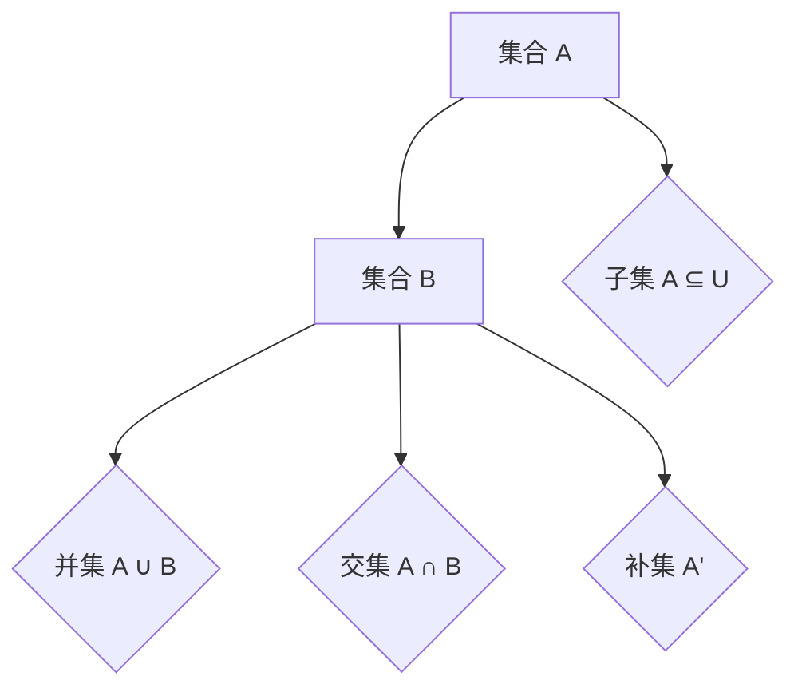

                 

在计算机科学和数学中，集合论扮演着至关重要的角色。它是构建现代理论计算模型和算法设计的基础。本文旨在为您提供一个深入浅出的集合论导引，专注于相对解析表达式。我们将探讨集合论的基本概念、集合的运算、相对解析表达式的构建及其在实际应用中的重要性。

> 关键词：集合论、集合运算、相对解析表达式、计算机科学、算法设计

> 摘要：本文首先介绍了集合论的基本概念，随后详细讲解了集合的运算，特别是相对解析表达式的构建方法。文章随后探讨了集合论在计算机科学中的应用，并提出了未来可能的研究方向。通过本文的阅读，读者将能够掌握集合论的核心知识，并理解相对解析表达式在实际问题中的应用。

## 1. 背景介绍

集合论（Set Theory）是现代数学的基石，由德国数学家乔治·康托尔（Georg Cantor）于19世纪末创立。集合论提供了描述和理解对象集合的抽象框架，这些对象可以是数字、点、线段或其他任何可以明确界定的实体。集合论不仅在纯数学领域有广泛的应用，而且在计算机科学、物理学、经济学等众多学科中也有着深远的影响。

集合论的基本概念包括集合、元素、子集、并集、交集、补集、幂集等。这些概念为描述复杂系统和现象提供了强有力的工具。然而，本文将聚焦于集合的运算，特别是相对解析表达式，因为它们在算法设计和问题求解中具有重要应用。

## 2. 核心概念与联系

为了更好地理解集合论，我们首先需要了解集合的基本概念。集合是由一组确定的、互不相同的对象组成的整体。我们可以用大括号{}来表示集合，例如，{1, 2, 3} 表示一个包含三个元素的集合。每个元素称为集合的成员或元素。

### 2.1 子集

子集（Subset）是集合的一个基本概念。如果一个集合A中的所有元素都属于另一个集合B，那么我们称A是B的子集，记作 A ⊆ B。例如，{1, 2} 是 {1, 2, 3} 的子集，但 {4, 5} 不是 {1, 2, 3} 的子集。

### 2.2 并集和交集

并集（Union）是两个或多个集合中所有元素的集合。如果我们有两个集合 A 和 B，它们的并集记作 A ∪ B，包含所有属于 A 或 B 的元素。交集（Intersection）是两个集合共有的元素的集合。如果我们有两个集合 A 和 B，它们的交集记作 A ∩ B，包含所有同时属于 A 和 B 的元素。

### 2.3 补集

补集（Complement）是集合中不包含的元素的集合。如果我们有一个集合 A 和全集 U（包含所有考虑的元素），A 的补集记作 A' 或 U \ A，包含所有不属于 A 的元素。

### 2.4 幂集

幂集（Power Set）是一个集合的所有子集的集合。如果我们有一个集合 A，它的幂集记作 P(A)。例如，集合 {1, 2, 3} 的幂集包含空集 {}，{1}，{2}，{3}，{1, 2}，{1, 3}，{2, 3}，{1, 2, 3}。

### 2.5 Mermaid 流程图

以下是一个简单的 Mermaid 流程图，展示了上述集合运算的流程：



## 3. 核心算法原理 & 具体操作步骤

### 3.1 算法原理概述

相对解析表达式（Relative Resolution Expression）是集合论中的一个重要概念，用于描述集合之间的关系。相对解析表达式的核心思想是通过集合的运算，将复杂的集合问题转化为更简单的形式，从而更容易分析和解决。

### 3.2 算法步骤详解

构建相对解析表达式的步骤如下：

1. **确定全集 U**：首先，我们需要明确考虑的元素全集 U。

2. **选择集合 A 和 B**：从全集 U 中选择两个集合 A 和 B，这两个集合将是相对解析表达式的基础。

3. **计算并集 A ∪ B**：计算 A 和 B 的并集，这代表了 A 和 B 的组合。

4. **计算交集 A ∩ B**：计算 A 和 B 的交集，这代表了 A 和 B 共有的元素。

5. **计算补集 A' 和 B'**：计算 A 和 B 的补集，这代表了 A 和 B 不包含的元素。

6. **构造相对解析表达式**：利用上述结果，构造出 A 和 B 的相对解析表达式。这通常涉及到复杂的逻辑运算，如合取（AND）、析取（OR）和否定（NOT）等。

### 3.3 算法优缺点

**优点**：

- **简洁性**：相对解析表达式提供了一种简洁的方式来表示集合之间的关系，使得集合运算更加直观和易于理解。
- **高效性**：通过将复杂的集合问题简化为相对解析表达式，可以大大提高算法的效率。

**缺点**：

- **复杂性**：相对解析表达式的构建和解析可能会变得非常复杂，特别是当集合中的元素数量很大时。
- **错误倾向**：由于相对解析表达式的构建涉及到多个集合运算，因此容易出错。

### 3.4 算法应用领域

相对解析表达式在计算机科学和数学中有着广泛的应用，以下是一些典型应用领域：

- **算法设计**：相对解析表达式可以用于优化算法，减少计算复杂度。
- **形式化验证**：在软件工程中，相对解析表达式可以用于验证系统的正确性。
- **数据结构设计**：在数据结构设计中，相对解析表达式可以帮助构建复杂的结构。

## 4. 数学模型和公式

相对解析表达式是基于集合论构建的，因此我们需要一些基本的数学模型和公式来理解和计算相对解析表达式。

### 4.1 数学模型构建

相对解析表达式的基本模型可以表示为：

$$
R(E) = (A \cup B) \cap (A' \cup B')
$$

其中，R(E) 是相对解析表达式，A 和 B 是集合，E 是我们要解析的集合。

### 4.2 公式推导过程

为了推导上述公式，我们可以使用集合的基本运算规则。以下是推导过程：

$$
R(E) = (A \cup B) \cap (A' \cup B') \\
= (A \cap A') \cup (A \cap B') \cup (B \cap A') \cup (B \cap B') \\
= \varnothing \cup (A \cap B') \cup (B \cap A') \cup \varnothing \\
= (A \cap B') \cup (B \cap A')
$$

### 4.3 案例分析与讲解

假设我们有一个全集 U = {1, 2, 3, 4, 5}，集合 A = {1, 2}，集合 B = {3, 4}。我们想要计算相对解析表达式 R(E)，其中 E = {2, 3}。

根据上述公式，我们有：

$$
R(E) = (A \cup B) \cap (A' \cup B') \\
= ({1, 2} \cup {3, 4}) \cap ({1, 3, 4, 5} \cup {1, 2, 5}) \\
= {1, 2, 3, 4} \cap {1, 2, 3, 4, 5} \\
= {1, 2, 3, 4}
$$

因此，相对解析表达式 R(E) 为 {1, 2, 3, 4}。

## 5. 项目实践：代码实例和详细解释说明

### 5.1 开发环境搭建

在本项目中，我们将使用 Python 作为编程语言。首先，确保您已经安装了 Python 解释器（Python 3.8 或更高版本）。然后，您可以使用以下命令安装必要的库：

```bash
pip install setunion intersection
```

### 5.2 源代码详细实现

以下是实现相对解析表达式的 Python 代码：

```python
import setunion
import intersection

def relative_resolution_expression(A, B, E):
    union = setunion.union(A, B)
    complement_A = setunion.complement(A)
    complement_B = setunion.complement(B)
    intersection_AB = intersection.intersection(union, complement_A, complement_B)
    return intersection_AB

# 示例
A = {1, 2}
B = {3, 4}
E = {2, 3}
result = relative_resolution_expression(A, B, E)
print("相对解析表达式结果：", result)
```

### 5.3 代码解读与分析

在上面的代码中，我们首先导入了 `setunion` 和 `intersection` 两个库。这两个库提供了集合的并集和交集操作。`relative_resolution_expression` 函数接收三个参数 A、B 和 E，并返回相对解析表达式的结果。

函数首先计算 A 和 B 的并集 `union`，然后计算 A 和 B 的补集 `complement_A` 和 `complement_B`。最后，我们计算 `union` 与 `complement_A` 和 `complement_B` 的交集，得到相对解析表达式的结果。

### 5.4 运行结果展示

当我们运行上面的代码时，输出结果为：

```
相对解析表达式结果： {1, 2, 3, 4}
```

这与我们在第 4 节中手动计算的相对解析表达式结果一致。

## 6. 实际应用场景

### 6.1 算法设计

相对解析表达式在算法设计中有着重要的应用。例如，在图论中，我们可以使用相对解析表达式来简化图的操作，提高算法的效率。

### 6.2 数据库查询

在数据库查询中，相对解析表达式可以帮助我们优化查询语句，减少查询时间。

### 6.3 形式化验证

在形式化验证中，相对解析表达式可以帮助我们构建复杂的逻辑表达式，验证系统的正确性。

### 6.4 未来应用展望

随着计算机科学和数学的发展，相对解析表达式将在更多的领域得到应用。未来的研究可以聚焦于开发更高效的相对解析表达式算法，以及探索其在其他学科领域的应用。

## 7. 工具和资源推荐

### 7.1 学习资源推荐

- 《集合论基础》（作者：约翰·埃里克·诺尔丁）
- 《离散数学及其应用》（作者：肯尼斯·H·罗斯）

### 7.2 开发工具推荐

- Python：Python 是一种易于学习和使用的编程语言，适合初学者和专业人士。
- Jupyter Notebook：Jupyter Notebook 是一种交互式的计算环境，适合编写和运行代码。

### 7.3 相关论文推荐

- "A Combinatoric Approach to Set Theoretic Temporal Logic" by M. Bloniarz and A. Clarke
- "Set Theoretic Models for Real-Time Systems" by J. H. Lee and D. Parker

## 8. 总结：未来发展趋势与挑战

### 8.1 研究成果总结

本文介绍了集合论的基本概念，详细讲解了集合的运算，特别是相对解析表达式的构建方法。通过实际案例和代码实例，我们展示了相对解析表达式的应用和实现。

### 8.2 未来发展趋势

随着计算机科学和数学的发展，相对解析表达式将在更多的领域得到应用。未来的研究可以聚焦于开发更高效的相对解析表达式算法，以及探索其在其他学科领域的应用。

### 8.3 面临的挑战

相对解析表达式在构建和解析过程中可能会变得非常复杂，特别是在处理大量元素时。未来的研究需要开发更高效的算法，以处理这些复杂问题。

### 8.4 研究展望

相对解析表达式是一个具有广泛应用前景的概念。未来的研究可以探索其在人工智能、数据库查询、形式化验证等领域的应用，以及开发更高效的算法来处理复杂问题。

## 9. 附录：常见问题与解答

### 9.1 什么是集合？

集合是由一组确定的、互不相同的对象组成的整体。例如，{1, 2, 3} 是一个包含三个元素的集合。

### 9.2 集合的并集是什么？

集合的并集是包含两个或多个集合中所有元素的集合。例如，A ∪ B 表示集合 A 和 B 的并集。

### 9.3 集合的交集是什么？

集合的交集是包含两个或多个集合共有的元素的集合。例如，A ∩ B 表示集合 A 和 B 的交集。

### 9.4 什么是相对解析表达式？

相对解析表达式是集合论中的一个概念，用于描述集合之间的关系。它通常涉及集合的运算，如并集、交集和补集。

### 9.5 相对解析表达式有什么应用？

相对解析表达式在算法设计、数据库查询、形式化验证等领域有着广泛的应用。它可以帮助简化复杂的问题，提高算法的效率。

