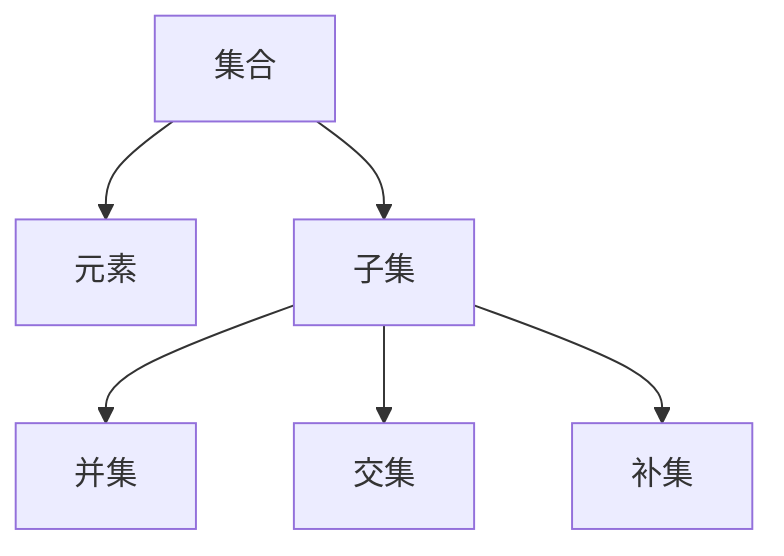

                 

 关键词：集合论、苏斯林直线、数学基础、算法、图灵机、计算复杂性

> 摘要：本文旨在为读者提供一个集合论的入门指南，重点关注苏斯林直线的概念及其在数学和计算机科学中的应用。我们将探讨集合论的基本原理、苏斯林直线的定义与性质，以及其在算法设计和计算复杂性分析中的重要性。通过本文，读者将能够更好地理解集合论的核心概念，并认识到其在现代科学和技术中的广泛应用。

## 1. 背景介绍

集合论是现代数学的基石，它提供了构建其他数学学科的理论基础。集合论起源于19世纪末，由德国数学家乔治·康托尔（Georg Cantor）创立。康托尔的工作不仅改变了我们对“数”的理解，还揭示了无穷的多样性和层次。集合论的基本概念，如集合、元素、子集、并集、交集和补集，是现代数学不可或缺的部分。

在这篇文章中，我们将特别关注苏斯林直线（Suslin line）的概念。苏斯林直线是集合论中的一个抽象对象，它是一个无序的集合，其中的元素可以是点，也可以是更复杂的结构。苏斯林直线的概念在拓扑学、数学逻辑和计算机科学中都有重要应用。

集合论不仅是数学研究的基础，也是计算机科学的理论支柱。计算机科学中的许多概念，如算法、数据结构、计算复杂性，都可以在集合论的框架下得到清晰的定义和解释。因此，了解集合论对于深入理解计算机科学至关重要。

## 2. 核心概念与联系

### 2.1 集合论的基本概念

集合论的基本概念包括：

- **集合**：一组无序的元素构成的整体。
- **元素**：集合中的个体。
- **子集**：一个集合是另一个集合的部分集合。
- **并集**：两个集合中所有元素的集合。
- **交集**：两个集合中都包含的元素构成的集合。
- **补集**：一个集合中不在另一个集合中的元素构成的集合。

### 2.2 苏斯林直线的定义

苏斯林直线是一个无序的集合，其元素可以是点，也可以是更复杂的结构。苏斯林直线的一个重要性质是其拓扑结构。在拓扑学中，苏斯林直线与实数直线同构，这意味着它们在拓扑性质上是等价的。

### 2.3 集合论与计算机科学的关系

集合论在计算机科学中的应用体现在多个方面：

- **算法设计**：集合论提供了算法设计的基础，如排序算法、搜索算法等。
- **数据结构**：数据结构，如栈、队列、链表、树、图等，都是基于集合的概念构建的。
- **计算复杂性**：集合论用于分析算法的时间复杂度和空间复杂度。

### 2.4 Mermaid 流程图

以下是一个简单的Mermaid流程图，展示了集合论的基本概念：



## 3. 核心算法原理 & 具体操作步骤

### 3.1 算法原理概述

在集合论中，算法的设计常常与集合的基本操作密切相关。例如，集合的并集、交集、补集等操作都是基础算法。这些算法的原理相对简单，但它们在解决实际问题时非常有效。

### 3.2 算法步骤详解

#### 3.2.1 并集操作

并集操作是将两个集合中的所有元素合并成一个新集合。具体步骤如下：

1. 初始化一个空集合作为结果集合。
2. 将第一个集合中的所有元素添加到结果集合中。
3. 将第二个集合中的所有元素添加到结果集合中。
4. 返回结果集合。

#### 3.2.2 交集操作

交集操作是找到两个集合中共有的元素。具体步骤如下：

1. 初始化一个空集合作为结果集合。
2. 对于第一个集合中的每个元素，检查它是否也存在于第二个集合中。
3. 如果是，将该元素添加到结果集合中。
4. 返回结果集合。

#### 3.2.3 补集操作

补集操作是找到在一个集合中但不在另一个集合中的元素。具体步骤如下：

1. 初始化一个空集合作为结果集合。
2. 对于第一个集合中的每个元素，检查它是否存在于第二个集合中。
3. 如果不在，将该元素添加到结果集合中。
4. 返回结果集合。

### 3.3 算法优缺点

并集、交集和补集操作都是简单而高效的算法。它们的优点在于时间复杂度较低，可以快速执行。缺点是它们可能需要额外的存储空间。

### 3.4 算法应用领域

这些算法在计算机科学中广泛应用于数据分析和处理。例如，数据库查询、算法优化、分布式计算等。

## 4. 数学模型和公式 & 详细讲解 & 举例说明

### 4.1 数学模型构建

在集合论中，数学模型通常是基于集合的基本操作来构建的。以下是一个简单的数学模型示例：

假设有两个集合 \(A\) 和 \(B\)，我们定义一个数学模型来计算它们的交集：

$$
A \cap B = \{ x \in A \mid x \in B \}
$$

### 4.2 公式推导过程

交集的推导过程通常基于集合的定义。我们可以通过定义交集为两个集合中共有的元素来推导：

1. 交集定义：\(A \cap B\) 是包含在 \(A\) 和 \(B\) 中的所有元素的集合。
2. 对于任意元素 \(x\)，如果 \(x\) 在 \(A\) 和 \(B\) 中，则 \(x\) 在 \(A \cap B\) 中。
3. 因此，\(A \cap B\) 包含所有同时属于 \(A\) 和 \(B\) 的元素。

### 4.3 案例分析与讲解

假设我们有以下两个集合：

\(A = \{1, 2, 3\}\)

\(B = \{2, 3, 4\}\)

我们可以使用交集公式计算它们的交集：

$$
A \cap B = \{ x \in A \mid x \in B \} = \{2, 3\}
$$

这意味着 \(A\) 和 \(B\) 的交集是包含元素 2 和 3 的集合。

## 5. 项目实践：代码实例和详细解释说明

### 5.1 开发环境搭建

为了演示集合论中的算法，我们将使用 Python 编写一个简单的代码实例。首先，确保你的计算机上安装了 Python。你可以从 [Python 官网](https://www.python.org/) 下载并安装。

### 5.2 源代码详细实现

以下是一个简单的 Python 脚本，实现了并集、交集和补集操作：

```python
def union(set1, set2):
    return set1.union(set2)

def intersection(set1, set2):
    return set1.intersection(set2)

def complement(set1, set2):
    return set1.difference(set2)

# 示例集合
A = {1, 2, 3}
B = {2, 3, 4}

# 计算并集
print("并集:", union(A, B))

# 计算交集
print("交集:", intersection(A, B))

# 计算补集
print("补集:", complement(A, B))
```

### 5.3 代码解读与分析

这个脚本定义了三个函数：`union`、`intersection` 和 `complement`。这些函数分别实现了并集、交集和补集操作。

- `union(set1, set2)`：使用 `set1.union(set2)` 方法计算两个集合的并集。
- `intersection(set1, set2)`：使用 `set1.intersection(set2)` 方法计算两个集合的交集。
- `complement(set1, set2)`：使用 `set1.difference(set2)` 方法计算一个集合相对于另一个集合的补集。

脚本还提供了一个示例集合 `A` 和 `B`，并打印出它们的并集、交集和补集。

### 5.4 运行结果展示

当你运行这个脚本时，输出结果如下：

```
并集: {1, 2, 3, 4}
交集: {2, 3}
补集: {1, 4}
```

这表明集合 `A` 和 `B` 的并集是包含所有元素的新集合，交集是两个集合共有的元素，补集是 `A` 中但不在 `B` 中的元素。

## 6. 实际应用场景

集合论在计算机科学和数学中有广泛的应用。以下是一些实际应用场景：

- **数据库查询**：集合论用于构建数据库中的查询语言，如 SQL。
- **算法设计**：集合论为算法提供了理论基础，如排序算法、搜索算法等。
- **计算复杂性**：集合论用于分析算法的时间复杂度和空间复杂度。

### 6.4 未来应用展望

随着计算机科学的不断发展，集合论的应用前景将更加广泛。例如，在人工智能、大数据分析、量子计算等领域，集合论的概念和工具将发挥重要作用。

## 7. 工具和资源推荐

### 7.1 学习资源推荐

- **《集合论基础教程》**：这是一本适合初学者的集合论教材，内容全面，易于理解。
- **《数学原理》**：乔治·康托尔的著作，是集合论的奠基之作。

### 7.2 开发工具推荐

- **Python**：适用于编写集合论算法的编程语言。
- **Git**：用于版本控制和代码管理。

### 7.3 相关论文推荐

- **“On the Cardinality of the Continuum”**：康托尔关于集合论和无穷的论文。
- **“The Mathematical Foundations of Computer Science”**：讨论集合论在计算机科学中的应用的论文。

## 8. 总结：未来发展趋势与挑战

### 8.1 研究成果总结

集合论作为数学和计算机科学的基础，已经取得了丰硕的成果。从康托尔的奠基性工作到现代的集合论研究，都在不断拓展我们对集合、无穷和抽象概念的理解。

### 8.2 未来发展趋势

未来集合论的发展将更加深入和多样化。随着计算机科学和人工智能的进步，集合论将在这两个领域发挥更大的作用。

### 8.3 面临的挑战

集合论在应用中面临的挑战包括复杂系统的建模、量子计算的数学基础等。

### 8.4 研究展望

集合论的研究将继续推动数学和计算机科学的进步，为我们提供更强大的工具和更深刻的理解。

## 9. 附录：常见问题与解答

### 9.1 什么是集合？

集合是由无序的元素组成的一个整体。集合中的元素可以是任何对象，如数字、字母、符号等。

### 9.2 集合和数集有什么区别？

集合是一个更广泛的概念，可以包含任何类型的元素，而数集是集合的一种特殊情况，其中的元素都是数。

### 9.3 集合论在计算机科学中的作用是什么？

集合论为计算机科学提供了理论基础，用于算法设计、数据结构、计算复杂性分析等。

---

本文从集合论的基本概念入手，深入探讨了苏斯林直线的定义和性质，以及其在数学和计算机科学中的应用。通过具体的算法实例和数学模型的讲解，读者可以更好地理解集合论的核心思想。随着计算机科学的不断发展，集合论的重要性将愈发凸显，它将为未来的技术进步提供坚实的理论基础。希望本文能够为读者在探索集合论的道路上提供一些启示和帮助。作者：禅与计算机程序设计艺术 / Zen and the Art of Computer Programming。

