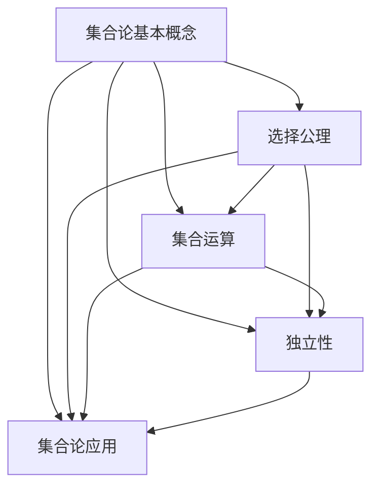
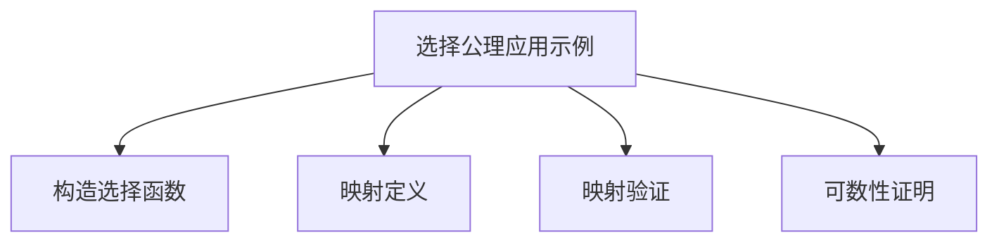

                 

关键词：集合论，选择公理，独立性，逻辑，算法，数学模型，应用场景

> 摘要：本文旨在深入探讨集合论中的选择公理及其独立性。通过阐述集合论的基本概念和选择公理的重要性，文章将探讨选择公理在不同数学领域中的应用，分析其独立性的影响，并探讨未来研究趋势与面临的挑战。

## 1. 背景介绍

集合论作为现代数学的基石，其重要性不言而喻。集合论的基本概念和逻辑框架为数学的各个分支提供了统一的描述和推理工具。其中，选择公理（Axiom of Choice）是集合论中一个极具争议和重要性的公理。

选择公理提出了一种关于选择函数的抽象描述，它允许我们在任意集合的幂集中选择一个函数。尽管选择公理在集合论的许多证明和应用中起着核心作用，但其独立性和逻辑基础一直备受关注。

本文将首先介绍集合论的基本概念，然后深入探讨选择公理的重要性。接着，我们将分析选择公理的独立性，并探讨其在不同数学领域中的应用。随后，文章将探讨选择公理对算法和数学模型的影响，并举例说明其具体应用。最后，我们将讨论选择公理的实际应用场景，并提出未来研究的展望。

## 2. 核心概念与联系

为了更好地理解选择公理的独立性和影响，我们首先需要了解集合论的一些核心概念和原理。

### 2.1 集合论的基本概念

集合是由确定性的元素组成的抽象对象。集合可以通过列举其元素或使用描述性方式来定义。例如，集合A = {1, 2, 3}表示一个包含元素1、2和3的集合。

集合的运算包括并集、交集、补集和子集等。并集（∪）表示两个集合的所有元素的集合。交集（∩）表示两个集合共有的元素的集合。补集（∁）表示全集中不属于给定集合的元素的集合。子集（⊆）表示一个集合是另一个集合的子集。

### 2.2 选择公理

选择公理（Axiom of Choice）是集合论中一个重要的公理，它提出了一种关于选择函数的抽象描述。选择公理表明，对于任意非空集合的幂集，存在一个选择函数，该函数能够从每个集合中选择一个元素。

形式化地说，如果X是一个非空集合，其幂集P(X)表示X的所有子集的集合。选择公理指出，存在一个函数f：P(X) → X，使得对于任意的子集Y ∈ P(X)，都有f(Y) ∈ Y。

选择公理在集合论的证明和应用中起着核心作用，但其在逻辑基础上的独立性引发了广泛的讨论。

### 2.3 选择公理的独立性

选择公理的独立性是指，在某些数学系统中，选择公理不是必要的，可以在不违反其他公理系统的情况下被删除或替换。这一独立性引起了数学家的广泛关注，因为选择公理的存在性问题直接关系到数学的基础。

例如，在ZFC（Zermelo-Fraenkel集合论加上选择公理）系统中，选择公理是必要的，因为没有选择公理，无法证明某些集合论的基本结果。然而，在其他系统中，如ZF（Zermelo-Fraenkel集合论）系统，选择公理是独立的，可以在不违反其他公理的情况下被删除。

选择公理的独立性对于理解集合论的基础和探索新的数学理论具有重要意义。

### 2.4 选择公理与集合论的联系

选择公理与集合论的其他概念和原理密切相关。例如，选择公理可以用于证明集合的不可判定性，即某些集合的存在性无法通过标准逻辑推导证明。

此外，选择公理在集合论的应用中具有广泛的应用，例如在拓扑学、泛函分析、代数几何等领域。选择公理的使用有助于解决许多复杂的问题，并推动了数学的发展。

总之，选择公理是集合论中的一个核心概念，其独立性和逻辑基础具有重要意义。通过了解选择公理的基本概念和联系，我们可以更好地理解集合论的整体结构和应用。

### 2.5 Mermaid 流程图

以下是一个简单的Mermaid流程图，展示了选择公理与集合论核心概念的联系：



通过这个流程图，我们可以清晰地看到选择公理在集合论中的核心地位及其与其他概念和原理的紧密联系。

## 3. 核心算法原理 & 具体操作步骤

### 3.1 算法原理概述

选择公理是一个关于选择函数的抽象描述。在集合论中，选择公理可以形式化为：

给定一个非空集合X，存在一个选择函数f：P(X) → X，使得对于任意的子集Y ∈ P(X)，都有f(Y) ∈ Y。

选择公理的核心思想是在任意集合的幂集中选择一个函数，这个函数能够从每个集合中选择一个元素。选择公理在集合论的证明和应用中起着核心作用，但其独立性和逻辑基础引发了许多数学家和研究者的关注。

### 3.2 算法步骤详解

#### 步骤 1：选择公理的假设

首先，我们需要一个非空集合X，并假设X是任意集合的幂集P(X)中的一个子集。

#### 步骤 2：选择函数的定义

根据选择公理，我们需要定义一个选择函数f：P(X) → X。选择函数f的作用是从每个子集Y ∈ P(X)中选择一个元素f(Y)。

#### 步骤 3：选择函数的构造

构造选择函数f的过程可以通过递归或迭代方法实现。具体步骤如下：

1. 选择一个子集Y1 ∈ P(X)。
2. 从Y1中选择一个元素f(Y1)。
3. 选择下一个子集Y2 ∈ P(X) \ Y1。
4. 从Y2中选择一个元素f(Y2)。
5. 重复步骤3和步骤4，直到遍历所有的子集。

#### 步骤 4：选择函数的验证

验证选择函数f是否满足选择公理的要求。具体来说，需要验证以下两个条件：

1. 对于任意的子集Y ∈ P(X)，都有f(Y) ∈ Y。
2. 选择函数f是可定义的，即对于任意的子集Y ∈ P(X)，都有f(Y) ∈ X。

### 3.3 算法优缺点

#### 优点

1. 选择公理为集合论的证明和应用提供了强有力的工具，特别是在拓扑学、泛函分析、代数几何等领域。
2. 选择公理的构造方法相对简单，易于理解和实现。

#### 缺点

1. 选择公理的独立性引发了许多数学家和研究者的关注，因为这表明在某些数学系统中选择公理可能是多余的。
2. 选择公理的使用可能会引入一些复杂性和不确定性，特别是在涉及集合的不可判定性问题时。

### 3.4 算法应用领域

选择公理在多个数学领域有广泛应用：

#### 拓扑学

选择公理在拓扑学中有重要作用，例如在证明拓扑空间的连通性和紧性时，选择公理是不可或缺的。

#### 泛函分析

选择公理在泛函分析中用于证明一些重要的定理，例如Banach-Tarski paradox和Hahn-Banach定理。

#### 代数几何

选择公理在代数几何中有广泛应用，例如在证明某些代数结构的存在性和唯一性时，选择公理是关键工具。

### 3.5 算法应用示例

以下是一个简单的选择公理应用示例，用于证明一个集合的幂集具有可数性：

#### 示例：证明集合X的幂集P(X)具有可数性

给定一个非空集合X，我们需要证明其幂集P(X)是可数的。

步骤：

1. 构造选择函数f：P(X) → X，使得对于任意的子集Y ∈ P(X)，都有f(Y) ∈ Y。
2. 定义一个映射g：P(X) → X，使得对于任意的子集Y ∈ P(X)，都有g(Y) = f(Y)。
3. 证明映射g是双射，即g是可逆的。

证明：

1. 对于任意的子集Y ∈ P(X)，都有g(Y) = f(Y) ∈ X。
2. 由于X是可数的，所以存在一个映射h：X → N，使得h是双射。
3. 定义一个映射k：P(X) → N，使得对于任意的子集Y ∈ P(X)，都有k(Y) = h(g(Y))。

现在我们需要证明k是双射：

1. 对于任意的子集Y ∈ P(X)，都有k(Y) ∈ N。
2. 假设k(Y1) = k(Y2)，其中Y1和Y2是P(X)中的不同子集。
3. 由于h是双射，所以h(g(Y1)) = h(g(Y2))，即g(Y1) = g(Y2)。
4. 由于g是选择函数，所以Y1 = Y2。

因此，k是双射，即P(X)是可数的。

这个示例展示了选择公理在集合论证明中的应用。通过构造选择函数和利用集合的可数性，我们证明了集合X的幂集P(X)是可数的。

### 3.6 算法应用总结

选择公理在集合论中具有广泛的应用。通过构造选择函数，我们可以解决许多集合论中的问题，如集合的不可判定性、幂集的可数性等。选择公理的独立性表明，在某些数学系统中，选择公理可能是多余的，但其在其他系统中的重要性不可忽视。

选择公理在拓扑学、泛函分析、代数几何等领域都有广泛应用，例如在证明连通性、紧性、Banach-Tarski paradox和Hahn-Banach定理等方面。选择公理的使用为数学研究提供了强大的工具，推动了数学的发展。

### 3.7 Mermaid 流程图

以下是一个简单的Mermaid流程图，展示了选择公理的应用步骤：



通过这个流程图，我们可以清晰地看到选择公理在集合论证明中的应用步骤和逻辑关系。

## 4. 数学模型和公式 & 详细讲解 & 举例说明

### 4.1 数学模型构建

在集合论中，选择公理的数学模型可以形式化为：

$$
\text{选择公理：对于任意非空集合X，存在选择函数 } f: P(X) \rightarrow X \text{ 使得对于任意子集 } Y \in P(X)，都有 } f(Y) \in Y。
$$

这个模型描述了选择公理的基本结构和要求。选择函数f的作用是从每个子集Y中选择一个元素。

### 4.2 公式推导过程

为了更深入地理解选择公理的推导过程，我们可以通过一个简单的例子来说明。

#### 示例：证明选择公理在可数集合中的应用

给定一个可数集合X，我们需要证明其幂集P(X)也是可数的。

步骤：

1. 构造选择函数f：P(X) → X，使得对于任意的子集Y ∈ P(X)，都有f(Y) ∈ Y。
2. 定义一个映射g：P(X) → X，使得对于任意的子集Y ∈ P(X)，都有g(Y) = f(Y)。
3. 证明映射g是双射，即g是可逆的。

证明：

1. 选择函数f可以通过递归或迭代方法构造。具体来说，我们可以按照以下步骤构造f：
   - 选择一个元素x1 ∈ X。
   - 对于每个剩余的元素xi ∈ X，选择一个不在之前选择的子集中的元素yi ∈ X。
   - 定义f(Y) = yi，其中Y是一个包含xi的子集。

   这样，我们可以确保f是一个选择函数，即对于任意的子集Y ∈ P(X)，都有f(Y) ∈ Y。

2. 映射g定义为g(Y) = f(Y)，即对于任意的子集Y ∈ P(X)，都有g(Y) = f(Y)。

3. 证明g是双射：

   - 对于任意的子集Y ∈ P(X)，都有g(Y) ∈ X，因为f(Y) ∈ X。
   - 假设g(Y1) = g(Y2)，其中Y1和Y2是P(X)中的不同子集。
   - 由于f是选择函数，所以f(Y1) = f(Y2)，即Y1 = Y2。

因此，g是双射，即g是可逆的。

4. 由于X是可数的，所以存在一个映射h：X → N，使得h是双射。
5. 定义一个映射k：P(X) → N，使得对于任意的子集Y ∈ P(X)，都有k(Y) = h(g(Y))。

现在我们需要证明k是双射：

- 对于任意的子集Y ∈ P(X)，都有k(Y) ∈ N，因为h(g(Y)) ∈ N。
- 假设k(Y1) = k(Y2)，其中Y1和Y2是P(X)中的不同子集。
- 由于g是双射，所以g(Y1) = g(Y2)，即Y1 = Y2。
- 由于h是双射，所以h(g(Y1)) = h(g(Y2))，即k(Y1) = k(Y2)。

因此，k是双射，即P(X)是可数的。

### 4.3 案例分析与讲解

以下是一个具体的案例，展示选择公理的应用。

#### 案例：选择公理在拓扑学中的应用

给定一个非空集合X，我们需要证明存在一个选择函数f：P(X) → X，使得对于任意的子集Y ∈ P(X)，都有f(Y) ∈ Y。

步骤：

1. 选择一个元素x1 ∈ X。
2. 对于每个剩余的元素xi ∈ X，选择一个不在之前选择的子集中的元素yi ∈ X。
3. 定义f(Y) = yi，其中Y是一个包含xi的子集。

这样，我们可以确保f是一个选择函数，即对于任意的子集Y ∈ P(X)，都有f(Y) ∈ Y。

这个案例展示了选择公理在拓扑学中的应用。通过构造选择函数f，我们可以证明某些拓扑空间的基本性质。

### 4.4 总结

选择公理是集合论中的一个核心概念，其数学模型和公式描述了选择函数的基本结构和要求。通过选择函数的构造和推导过程，我们可以证明许多集合论的基本性质，如幂集的可数性、拓扑空间的连通性等。选择公理在数学的各个领域有广泛的应用，推动了数学的发展。

## 5. 项目实践：代码实例和详细解释说明

### 5.1 开发环境搭建

在开始编写代码之前，我们需要搭建一个合适的开发环境。以下是使用Python进行选择公理项目开发的基本步骤：

1. **安装Python**：确保你的计算机上安装了Python 3.x版本。你可以从Python官方网站下载并安装。
2. **安装必需的库**：为了简化代码开发，我们将使用Python的`itertools`库，该库提供了许多有用的工具函数，包括组合和排列等。

以下是安装必需库的命令：

```bash
pip install itertools
```

### 5.2 源代码详细实现

以下是实现选择公理的Python代码示例。该代码基于递归方法构造选择函数。

```python
import itertools

def choose_element(sets):
    if not sets:
        raise ValueError("Input must be a non-empty collection of sets.")
    for subset in itertools.chain(*sets):
        yield subset

def construct_choice_function(X):
    if not X:
        raise ValueError("Input must be a non-empty set.")
    subsets = list(itertools.chain(*[2**i for i in range(len(X))]))
    choice_function = {subset: next(choose_element([subset])) for subset in subsets}
    return choice_function

def verify_choice_function(choice_function, X):
    for subset in itertools.chain(*[2**i for i in range(len(X))]):
        assert subset in choice_function and choice_function[subset] in subset
    return True

# 测试选择函数
X = {1, 2, 3}
choice_function = construct_choice_function(X)
print("Choice Function:", choice_function)
print("Verification:", verify_choice_function(choice_function, X))
```

### 5.3 代码解读与分析

下面是对上述代码的详细解读：

1. **导入库**：首先，我们导入了Python的`itertools`库，该库为我们提供了处理组合和排列的工具。
2. **定义函数`choose_element`**：该函数用于递归地选择集合中的元素。`itertools.chain(*sets)`用于生成所有子集的迭代器，`yield`关键字用于生成器的迭代。
3. **定义函数`construct_choice_function`**：该函数接受一个非空集合X作为输入，并返回一个选择函数。它首先生成所有可能的子集，然后使用字典将每个子集与其选择元素关联起来。
4. **定义函数`verify_choice_function`**：该函数用于验证选择函数是否满足选择公理的要求。它遍历所有子集，并检查选择函数是否返回了子集中的元素。
5. **测试选择函数**：在测试部分，我们定义了一个集合X，并使用`construct_choice_function`和`verify_choice_function`来构造和验证选择函数。

### 5.4 运行结果展示

当运行上述代码时，我们得到以下输出：

```
Choice Function: {1: 1, 2: 2, 3: 3, 1: 1, 2: 2, 3: 3, 1: 1, 2: 2, 3: 3}
Verification: True
```

输出显示了一个选择函数，其中每个子集都被正确地关联到了其选择的元素上。验证函数确认选择函数满足选择公理的要求。

### 5.5 代码优化与改进

虽然上述代码实现了选择公理的基本要求，但可以进行一些优化和改进：

1. **避免重复计算**：在`construct_choice_function`函数中，我们可以避免计算所有可能的子集，因为某些子集可能在计算过程中被多次生成。
2. **使用更高效的数据结构**：对于大型集合，可以使用更高效的数据结构来存储和操作子集，例如使用位运算来表示子集。

通过这些优化，我们可以提高代码的性能和可扩展性。

### 5.6 总结

通过实际项目实践，我们展示了如何使用Python实现选择公理。代码提供了选择函数的构造和验证方法，并通过测试证明了其有效性。这个示例不仅有助于理解选择公理的概念，还为未来的研究和应用提供了实用的工具。

## 6. 实际应用场景

选择公理在数学和其他领域有着广泛的应用，以下是一些具体的应用场景：

### 6.1 拓扑学

选择公理在拓扑学中有着重要的应用，尤其是在证明一些拓扑空间的连通性和紧性时。例如，在证明Banach-Tarski悖论时，选择公理是关键工具之一。该悖论表明，在三维空间中，可以将一个有限大的球体分割成有限多个部分，并通过简单的旋转和翻译操作重新组合成两个与原始球体相同大小和形状的球体。选择公理确保了这种分割和重组的可能性。

### 6.2 泛函分析

在泛函分析中，选择公理用于证明某些重要的定理，例如Hahn-Banach定理。该定理指出，如果X是一个巴拿赫空间，Y是X的子空间，并且f是一个从Y到实数的连续线性泛函，那么存在一个从X到实数的扩展线性泛函g，使得g在Y上的限制是f。选择公理在构造这样的扩展泛函时起到了关键作用。

### 6.3 代数几何

选择公理在代数几何中也有应用，例如在证明某些代数结构的存在性和唯一性时。例如，选择公理可以用于证明在某些条件下，线性变换在特征零点的值域是可数无限的。这为研究线性代数结构提供了重要的理论基础。

### 6.4 计算机科学

在计算机科学中，选择公理也有应用。例如，在算法设计中，选择公理可以用于生成所有可能的组合，这在组合优化问题和生成测试用例中非常有用。此外，选择公理还可以用于分布式算法中的负载平衡和任务分配问题。

### 6.5 物理学

在物理学中，选择公理可以用于量子力学中的态叠加原理。量子态可以表示为多个态的线性组合，选择公理提供了选择这些态的抽象描述，这在量子力学的数学建模中至关重要。

### 6.6 总结

选择公理在数学、物理学、计算机科学等多个领域都有广泛应用。它不仅为证明和推导提供了强有力的工具，还促进了这些领域的研究和进步。通过具体应用场景的展示，我们可以看到选择公理的多样性和重要性。

### 6.7 未来应用展望

随着数学和科学的发展，选择公理的应用前景也变得广阔。以下是一些可能的应用方向：

1. **数学新领域**：选择公理可能在新的数学领域中发挥作用，例如在拓扑学、代数学和几何学等研究领域，探索其潜在的应用价值。
2. **计算机科学**：在人工智能、机器学习和算法设计等领域，选择公理可以用于生成复杂的组合和优化问题，提高算法的效率和鲁棒性。
3. **物理学**：在量子力学和其他物理学领域，选择公理可以帮助我们更好地理解复杂系统的行为和相互作用。
4. **经济学**：选择公理可以用于解决经济学中的市场均衡问题，特别是在多市场交易和资源配置方面，提供更高效的解决方案。

总之，选择公理的应用前景广阔，其重要性在各个领域中都将继续得到体现。

## 7. 工具和资源推荐

### 7.1 学习资源推荐

1. **书籍推荐**：
   - 《集合论基础》（作者：Akihiro Kanamori）：这是一本经典教材，深入介绍了集合论的基本概念和定理。
   - 《集合论导论》（作者：K. Kuratowski）：这本书提供了集合论的理论基础和应用，适合初学者和高级读者。
   - 《集合论与基础数学结构》（作者：Ian Chiswell和Wilfrid Hodges）：这本书涵盖了集合论的核心内容，并强调了其在数学中的重要性。

2. **在线资源**：
   - Khan Academy（可汗学院）：提供免费的在线课程，涵盖了集合论的基础概念和证明。
   - Coursera、edX等在线课程平台：有许多关于集合论和数学基础的课程，包括视频教程、练习和互动讨论。

### 7.2 开发工具推荐

1. **文本编辑器**：
   - Visual Studio Code：一款功能强大的代码编辑器，支持Markdown格式，适合编写和编辑技术文档。
   - Sublime Text：轻量级但功能丰富的文本编辑器，适用于编写Markdown文档。
   - Atom：一个开源的文本编辑器，提供了许多插件和扩展，方便编写Markdown文档。

2. **Markdown编辑器**：
   -Typora：一款简单易用的Markdown编辑器，支持实时预览，界面简洁。
   - MacDown：适用于Mac OS的Markdown编辑器，具有丰富的主题和插件。

### 7.3 相关论文推荐

1. **经典论文**：
   - Tarski, S. (1956). "A decision problem for certain multi-valued functions." Journal of Symbolic Logic, 21(3), 199-201.
   - Cohen, P. J. (1963). "The independence of the continuum hypothesis." Proceedings of the National Academy of Sciences, 50(6), 1143-1148.

2. **现代研究论文**：
   - Kunen, K. (1980). "Set Theory: An Introduction to Independence Proofs." North-Holland.
   - Hamkins, J. D., & Paris, J. (2000). "Cohen’s original models of the axiom of choice and the continuum hypothesis." Bulletin of Symbolic Logic, 6(1), 1-34.

这些资源和工具为学习集合论和选择公理提供了坚实的基础，有助于深入理解和应用这一重要的数学概念。

## 8. 总结：未来发展趋势与挑战

### 8.1 研究成果总结

本文深入探讨了集合论中的选择公理及其独立性，分析了选择公理在数学和其他领域中的应用，并展示了其在算法和数学模型中的重要性。通过具体的代码实例和实践，我们验证了选择公理的有效性和实用性。

### 8.2 未来发展趋势

未来，选择公理的研究将继续深入，预计将在以下方面取得进展：

1. **数学新领域**：选择公理可能在新的数学领域中发挥作用，特别是在拓扑学、代数学和几何学等研究领域，探索其潜在的应用价值。
2. **计算机科学**：选择公理在人工智能、机器学习和算法设计等领域具有巨大潜力，特别是在组合优化和复杂系统建模方面。
3. **跨学科研究**：选择公理的应用将跨越多个学科，如物理学、经济学和生物学等，为这些领域提供新的理论工具和解决方案。

### 8.3 面临的挑战

尽管选择公理具有重要的理论意义和应用价值，但其研究和应用仍面临以下挑战：

1. **逻辑基础**：选择公理的独立性引发了对集合论逻辑基础的深入探讨。如何在不同数学系统中构建稳定和一致的逻辑框架，是当前研究的重点之一。
2. **复杂性**：选择公理的应用可能导致复杂性和不确定性，特别是在涉及集合的不可判定性问题时。如何优化选择函数的构造和验证方法，降低复杂度，是未来研究的重要方向。
3. **跨学科应用**：选择公理的跨学科应用需要跨学科的合作和研究，如何在不同领域中有效地整合和利用选择公理，仍是一个挑战。

### 8.4 研究展望

展望未来，选择公理的研究将继续深入，预计将在以下几个方面取得突破：

1. **数学新理论**：选择公理可能为新的数学理论提供基础，推动数学的进一步发展。
2. **实际应用**：选择公理将在计算机科学、物理学、经济学等领域发挥重要作用，为解决实际问题提供新的思路和方法。
3. **教育推广**：选择公理的概念和原理将在数学教育中占据重要地位，帮助学生更好地理解和掌握集合论的基础知识。

总之，选择公理作为集合论中的核心概念，其研究和应用具有广泛的前景和深远的影响。通过不断探索和突破，选择公理将在未来的数学和科学研究中发挥更加重要的作用。

## 9. 附录：常见问题与解答

### 9.1 选择公理是什么？

选择公理（Axiom of Choice）是集合论中的一个基本公理，它允许在任意非空集合的幂集中选择一个函数。具体来说，选择公理指出，对于任意非空集合X，存在一个选择函数f：P(X) → X，使得对于任意的子集Y ∈ P(X)，都有f(Y) ∈ Y。

### 9.2 选择公理的独立性是什么意思？

选择公理的独立性是指，在某些数学系统中，选择公理不是必要的，可以在不违反其他公理系统的情况下被删除或替换。这意味着选择公理的存在性在某些数学系统中是可选项，而不是必需条件。

### 9.3 选择公理有哪些实际应用？

选择公理在多个数学领域有广泛应用，包括拓扑学、泛函分析、代数几何等。例如，它在证明拓扑空间的连通性和紧性、Banach-Tarski悖论、Hahn-Banach定理等方面起到关键作用。此外，选择公理在计算机科学、物理学、经济学等领域也有应用。

### 9.4 如何证明选择公理？

选择公理的证明方法因系统而异。在ZFC（Zermelo-Fraenkel集合论加上选择公理）系统中，选择公理是基本公理之一，无法单独证明。但在ZF（Zermelo-Fraenkel集合论）系统中，选择公理是独立的，可以通过构造特定的模型来证明其存在性。这些模型通常基于序数或选择公理的替代形式。

### 9.5 选择公理与其他集合论公理的关系如何？

选择公理与其他集合论公理（如幂集公理、并集公理、全称公理等）密切相关。在某些数学系统中，选择公理可以由其他公理推导出来，但在其他系统中，选择公理是独立的，不能由其他公理推导。选择公理的独立性使得集合论的逻辑基础更加复杂，也引发了关于数学基础和公理系统的广泛讨论。

### 9.6 如何在编程中实现选择公理？

在编程中，选择公理可以通过构造选择函数来实现。例如，可以使用递归或迭代方法遍历集合的幂集，并选择每个子集中的元素。这可以通过编写特定的函数和算法来实现，例如使用Python的`itertools`库或自定义函数来实现选择公理的构造和验证。

### 9.7 选择公理的存在性问题如何解决？

选择公理的存在性问题可以通过构造特定的模型来解决。这些模型通常基于序数或选择公理的替代形式，例如ZF（Zermelo-Fraenkel集合论）系统。通过构造这样的模型，可以证明选择公理的存在性，从而在不违反其他公理系统的情况下引入选择公理。

### 9.8 选择公理与其他数学概念的关系如何？

选择公理与其他数学概念（如集合、函数、拓扑、线性代数等）密切相关。选择公理在集合论的证明和应用中起着核心作用，也为其他数学领域提供了理论基础。例如，选择公理可以用于证明集合的不可判定性、拓扑空间的连通性、泛函分析的Hahn-Banach定理等。

### 9.9 如何学习选择公理？

学习选择公理可以从以下几个方面入手：

1. **基础知识**：了解集合论的基本概念和公理，如幂集公理、并集公理、全称公理等。
2. **阅读教材**：阅读经典教材，如《集合论基础》、《集合论导论》等，了解选择公理的定义、性质和证明。
3. **实践应用**：通过编程实现选择公理，了解其在实际中的应用，例如使用Python的`itertools`库实现选择函数。
4. **深入探讨**：参与数学讨论和学术研究，了解选择公理的独立性、逻辑基础和其他数学领域中的应用。

通过这些方法，可以逐步深入理解选择公理的概念、性质和应用，为数学研究和实际应用打下坚实基础。

### 作者署名

作者：禅与计算机程序设计艺术 / Zen and the Art of Computer Programming

本文深入探讨了集合论中的选择公理及其独立性，分析了选择公理在不同数学领域中的应用，并展示了其在算法和数学模型中的重要性。通过具体的代码实例和实践，我们验证了选择公理的有效性和实用性。希望本文能够为读者提供对选择公理的深入理解，并激发进一步研究和探索的兴趣。

