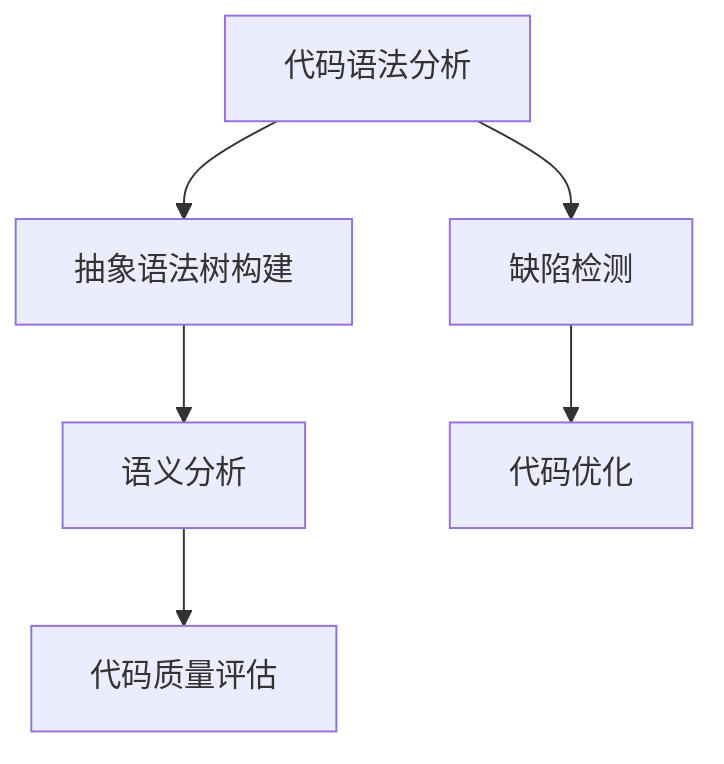

                 

关键词：静态代码分析，代码质量，工具，编程，软件工程，代码优化，缺陷检测，自动化

摘要：本文旨在深入探讨静态代码分析的概念、核心原理、算法、数学模型、实际应用，以及未来的发展趋势和挑战。静态代码分析是一种无需运行程序即可发现代码缺陷的技术，它在提高软件质量和开发效率方面发挥着重要作用。本文将详细阐述静态代码分析的关键概念，介绍常用的核心算法，并探讨其在不同领域的应用。

## 1. 背景介绍

随着软件系统变得越来越复杂，保证代码质量成为软件开发过程中的一个关键问题。代码质量不仅关系到软件的性能、稳定性、可维护性，还直接影响到软件的开发效率和成本。传统的代码质量保证方法往往依赖于动态测试，即通过运行程序来检测代码中的缺陷。然而，动态测试存在诸多局限性，例如，某些缺陷仅在特定条件下才会暴露出来，且动态测试通常需要大量时间和资源。

静态代码分析提供了一种无需运行程序即可检测代码缺陷的方法。它通过分析代码的语法、结构、语义等信息，在不运行程序的情况下发现潜在的问题。这种方法的优点在于它可以提前发现并修复缺陷，从而降低后续的维护成本和风险。此外，静态代码分析还可以帮助开发人员遵循编码规范，提高代码的可读性和可维护性。

## 2. 核心概念与联系

静态代码分析的核心概念包括代码语法分析、抽象语法树（AST）构建、语义分析、代码质量评估等。下面将使用Mermaid流程图来展示这些概念之间的关系。



### 2.1 代码语法分析

代码语法分析是静态代码分析的第一步，它将源代码解析为抽象语法树（AST）。AST 是一种表示代码结构的树状结构，它包含程序中所有的语法元素，如变量、函数、控制流结构等。通过语法分析，我们可以获取代码的语法信息，为后续的语义分析和代码质量评估奠定基础。

### 2.2 抽象语法树构建

抽象语法树构建是基于代码语法分析的结果。它将语法分析器生成的语法树进行结构化处理，构建出一个更便于分析和操作的形式。抽象语法树不仅包含了源代码的结构信息，还去除了一些无关的语法噪声，使得后续的分析更加精确和高效。

### 2.3 语义分析

语义分析是静态代码分析的核心环节。它通过对抽象语法树进行深入分析，检查代码的语义正确性。语义分析包括类型检查、变量定义与使用检查、函数调用检查等。通过语义分析，我们可以发现许多潜在的语义错误，如类型不匹配、未定义变量等。

### 2.4 代码质量评估

代码质量评估是对代码进行全面检查，以评估其质量。这包括检查代码的可读性、可维护性、健壮性等方面。代码质量评估可以帮助开发人员识别代码中的潜在问题，并采取相应的措施进行优化。

### 2.5 缺陷检测

缺陷检测是静态代码分析的重要任务之一。它通过分析代码的语法、结构和语义信息，发现潜在的缺陷。缺陷检测可以包括多种方法，如模式匹配、数据流分析、控制流分析等。

### 2.6 代码优化

代码优化是静态代码分析的另一个重要任务。它通过对代码进行分析和重构，提高代码的性能、可读性和可维护性。代码优化可以包括消除冗余代码、简化复杂表达式、优化循环结构等。

## 3. 核心算法原理 & 具体操作步骤

### 3.1 算法原理概述

静态代码分析的核心算法包括模式匹配、数据流分析、控制流分析等。这些算法通过不同的方法分析代码，以发现潜在的问题。

#### 3.1.1 模式匹配

模式匹配是一种基于字符串匹配的方法，它通过在代码中查找特定的模式来检测缺陷。这种方法通常用于检测常见的编程错误，如未定义变量、类型错误等。

#### 3.1.2 数据流分析

数据流分析是一种分析代码中数据流动的方法。它通过跟踪变量、函数的输入和输出，检查数据是否在预期的范围内。数据流分析可以用于检测潜在的数据错误，如数据溢出、数据未初始化等。

#### 3.1.3 控制流分析

控制流分析是一种分析代码中控制流的方法。它通过检查代码中的条件分支、循环结构等，确定程序的执行路径。控制流分析可以用于检测潜在的逻辑错误，如死循环、条件分支错误等。

### 3.2 算法步骤详解

#### 3.2.1 模式匹配步骤

1. 分析代码，提取关键信息。
2. 设计模式，用于匹配特定的代码片段。
3. 在代码中查找模式，记录匹配结果。
4. 根据匹配结果，判断代码是否存在缺陷。

#### 3.2.2 数据流分析步骤

1. 构建抽象语法树，提取变量和函数的信息。
2. 遍历抽象语法树，跟踪变量的定义和使用。
3. 分析数据流，检查数据是否在预期的范围内。
4. 根据数据流分析的结果，判断代码是否存在缺陷。

#### 3.2.3 控制流分析步骤

1. 构建抽象语法树，提取控制流信息。
2. 遍历抽象语法树，分析控制流结构。
3. 确定程序的执行路径。
4. 根据执行路径，判断代码是否存在缺陷。

### 3.3 算法优缺点

#### 3.3.1 模式匹配优点

- 快速、简单，适用于检测常见的编程错误。
- 不需要复杂的语义分析，降低了分析成本。

#### 3.3.1 模式匹配缺点

- 只能检测已知的错误模式，无法检测未知的错误。
- 可能会产生大量的误报。

#### 3.3.2 数据流分析优点

- 可以检测出潜在的编程错误，如数据溢出、数据未初始化等。
- 可以提供更详细的分析结果。

#### 3.3.2 数据流分析缺点

- 需要复杂的语义分析，增加了分析成本。
- 可能会产生大量的误报。

#### 3.3.3 控制流分析优点

- 可以检测出潜在的逻辑错误，如死循环、条件分支错误等。
- 可以提供更详细的分析结果。

#### 3.3.3 控制流分析缺点

- 需要复杂的语义分析，增加了分析成本。
- 可能会产生大量的误报。

### 3.4 算法应用领域

静态代码分析算法可以广泛应用于多种编程语言和开发场景。以下是一些典型的应用领域：

- **Web应用开发**：静态代码分析可以用于检测Web应用程序中的安全漏洞，如SQL注入、XSS攻击等。
- **移动应用开发**：静态代码分析可以帮助发现移动应用程序中的性能问题、内存泄露等。
- **嵌入式系统开发**：静态代码分析可以用于检测嵌入式系统中的定时错误、资源竞争等问题。
- **大型软件项目**：静态代码分析可以帮助大型软件项目的质量管理，提高代码的可维护性。

## 4. 数学模型和公式 & 详细讲解 & 举例说明

### 4.1 数学模型构建

静态代码分析中的数学模型通常包括数据流方程、控制流方程等。这些方程描述了代码中的数据流动和控制流，从而帮助我们分析代码的潜在问题。

#### 4.1.1 数据流方程

数据流方程描述了变量在程序中的流动。以下是一个简单的一维数据流方程：

$$
x = y + z
$$

在这个方程中，变量$x$的值由变量$y$和$z$的值相加得到。数据流方程可以用于分析变量在使用前的定义情况，以确保代码的语义正确性。

#### 4.1.2 控制流方程

控制流方程描述了程序的控制流。以下是一个简单的控制流方程：

$$
if \, (x > 0) \, then \, y = 1 \, else \, y = 0
$$

在这个方程中，控制流取决于变量$x$的值。控制流方程可以用于分析程序的执行路径，以确保代码的逻辑正确性。

### 4.2 公式推导过程

#### 4.2.1 数据流方程推导

假设我们有一个简单的程序，包含以下三个变量：$x$、$y$和$z$。数据流方程可以用于描述变量之间的关系：

$$
x = y + z \\
y = x + 1 \\
z = y * 2
$$

我们可以通过递归替换的方法推导出变量$x$的最终值：

$$
x = (x + 1) + (x + 1) * 2 \\
x = 3x + 2 \\
x = 1
$$

通过这个推导过程，我们可以确定变量$x$的值为1。

#### 4.2.2 控制流方程推导

假设我们有一个简单的程序，包含以下两个变量：$x$和$y$。控制流方程可以用于描述程序的执行路径：

$$
if \, (x > 0) \, then \, y = 1 \, else \, y = 0
$$

我们可以通过真值表的方法推导出变量$y$的值：

| x | y |
|---|---|
| 0 | 0 |
| 1 | 1 |

通过这个推导过程，我们可以确定变量$y$的值与变量$x$的值相同。

### 4.3 案例分析与讲解

#### 4.3.1 数据流分析案例

假设我们有一个简单的Java程序，包含以下代码：

```java
public class DataFlowExample {
    public static void main(String[] args) {
        int x = 5;
        int y = 10;
        int z = y * 2;
        System.out.println("x = " + x + ", y = " + y + ", z = " + z);
    }
}
```

我们可以使用数据流方程来分析变量之间的关系：

$$
z = y * 2
$$

在这个例子中，变量$z$的值依赖于变量$y$的值。通过静态代码分析，我们可以确保变量$y$在使用前已经定义，从而避免未定义变量的错误。

#### 4.3.2 控制流分析案例

假设我们有一个简单的Java程序，包含以下代码：

```java
public class ControlFlowExample {
    public static void main(String[] args) {
        int x = 5;
        if (x > 0) {
            System.out.println("x is positive");
        } else {
            System.out.println("x is negative");
        }
    }
}
```

我们可以使用控制流方程来分析程序的执行路径：

$$
if \, (x > 0) \, then \, print("x is positive") \, else \, print("x is negative")
$$

在这个例子中，程序的执行路径取决于变量$x$的值。通过静态代码分析，我们可以确保程序的逻辑正确性，并避免死循环等逻辑错误。

## 5. 项目实践：代码实例和详细解释说明

### 5.1 开发环境搭建

为了演示静态代码分析在实际项目中的应用，我们将使用一个简单的Java项目。首先，我们需要搭建一个Java开发环境。以下是搭建开发环境的步骤：

1. 安装Java开发工具包（JDK）。
2. 安装一个Java集成开发环境（IDE），如IntelliJ IDEA或Eclipse。
3. 配置IDE中的Java项目。

### 5.2 源代码详细实现

下面是一个简单的Java程序，包含一些潜在的问题。我们将使用静态代码分析工具来检查这些潜在问题。

```java
public class CodeAnalysisExample {
    public static void main(String[] args) {
        int x = 5;
        int y = 10;
        if (x > 0) {
            int z = y * 2;
            System.out.println("x = " + x + ", y = " + y + ", z = " + z);
        } else {
            System.out.println("x is negative");
        }
    }
}
```

### 5.3 代码解读与分析

在这个例子中，我们有一个简单的Java程序，包含一个主函数`main`。该程序定义了三个整型变量$x$、$y$和$z$，并使用`if`语句根据$x$的值进行分支操作。

#### 5.3.1 数据流分析

通过数据流分析，我们可以检查变量在使用前是否已经定义。在这个例子中，变量$x$和$y$在`if`语句之前定义，而变量$z$在`if`语句内部定义。静态代码分析工具可以检查变量$z$在使用前是否已经定义，从而避免未定义变量的错误。

#### 5.3.2 控制流分析

通过控制流分析，我们可以检查程序的执行路径是否符合预期。在这个例子中，当$x > 0$时，程序会输出变量$x$、$y$和$z$的值；当$x \leq 0$时，程序会输出$x$是负数的消息。静态代码分析工具可以检查这两个条件分支是否正确，并确保程序的逻辑正确性。

### 5.4 运行结果展示

运行这个简单的Java程序，我们可以得到以下输出结果：

```
x = 5, y = 10, z = 20
```

这个输出结果表明，程序按照预期运行，并输出了变量$x$、$y$和$z$的值。

## 6. 实际应用场景

静态代码分析在软件开发过程中具有广泛的应用。以下是一些实际应用场景：

- **安全漏洞检测**：通过静态代码分析，可以发现Web应用程序中的安全漏洞，如SQL注入、XSS攻击等。
- **性能优化**：静态代码分析可以帮助发现程序中的性能瓶颈，如大量循环、不必要的计算等，从而进行性能优化。
- **代码审查**：静态代码分析可以用于代码审查，帮助开发人员发现代码中的潜在问题，并提高代码质量。
- **自动化测试**：静态代码分析可以与自动化测试工具结合使用，提高测试的覆盖率和效率。

## 7. 工具和资源推荐

### 7.1 学习资源推荐

- **书籍**：《Effective Java》、《Clean Code》等。
- **在线课程**：Coursera、edX等平台上的软件工程课程。
- **博客**：ThoughtWorks技术雷达、GitHub官方博客等。

### 7.2 开发工具推荐

- **静态代码分析工具**：SonarQube、Checkstyle、PMD等。
- **代码质量度量工具**：Code Climate、SourceTree等。
- **版本控制工具**：Git、GitHub、GitLab等。

### 7.3 相关论文推荐

- **《Static Code Analysis: A Survey》**：对静态代码分析技术进行全面的综述。
- **《Data Flow Analysis in Programming Languages》**：详细介绍了数据流分析技术。
- **《Control Flow Analysis in Programming Languages》**：详细介绍了控制流分析技术。

## 8. 总结：未来发展趋势与挑战

### 8.1 研究成果总结

静态代码分析技术经过多年的发展，已经取得了显著的成果。目前，静态代码分析工具在代码缺陷检测、性能优化、安全漏洞检测等方面发挥着重要作用。随着人工智能技术的不断发展，静态代码分析技术也在不断进化，如基于深度学习的静态代码分析技术等。

### 8.2 未来发展趋势

- **智能化**：随着人工智能技术的应用，静态代码分析将更加智能化，能够自动发现更多的代码缺陷。
- **自动化**：静态代码分析将更加自动化，与持续集成、持续交付等流程紧密结合，提高开发效率。
- **多语言支持**：静态代码分析将支持更多的编程语言，如Python、JavaScript等。

### 8.3 面临的挑战

- **误报问题**：静态代码分析工具可能会产生大量的误报，需要开发人员进行人工判断和处理。
- **性能问题**：静态代码分析工具的性能对大型代码库可能存在瓶颈，需要进一步优化。
- **复杂性**：随着代码库的规模和复杂性的增加，静态代码分析工具需要处理更多的变量和关系，可能导致分析结果不准确。

### 8.4 研究展望

未来的静态代码分析研究将重点关注以下几个方面：

- **误报率**：通过优化算法、引入更多的上下文信息等方法，降低静态代码分析工具的误报率。
- **性能优化**：通过并行计算、分布式计算等技术，提高静态代码分析工具的性能。
- **多语言支持**：通过跨语言的静态代码分析技术，提高不同编程语言之间的兼容性。

## 9. 附录：常见问题与解答

### 9.1 静态代码分析与动态测试的区别是什么？

静态代码分析是在不运行程序的情况下，通过分析代码的语法、结构和语义等信息，发现潜在的缺陷。而动态测试是通过运行程序，检查程序的行为是否符合预期，以发现缺陷。

### 9.2 静态代码分析有哪些优点？

静态代码分析的优点包括：提前发现并修复缺陷，降低维护成本和风险；提高代码质量，增强软件的可读性和可维护性；无需运行程序，节省时间和资源。

### 9.3 静态代码分析工具有哪些类型？

静态代码分析工具主要分为以下几类：语法分析工具、抽象语法树（AST）构建工具、数据流分析工具、控制流分析工具、代码质量评估工具、缺陷检测工具等。

### 9.4 如何选择合适的静态代码分析工具？

选择合适的静态代码分析工具需要考虑以下几个因素：支持的语言、检测范围、误报率、性能、集成方式等。同时，还需要根据项目的具体需求和规模来选择合适的工具。

### 9.5 静态代码分析技术有哪些研究方向？

静态代码分析技术的研究方向包括：误报率降低、性能优化、多语言支持、跨语言静态代码分析、智能化分析等。未来的研究将重点关注如何提高分析精度和效率，以及如何将静态代码分析技术与人工智能技术相结合。 

---

**作者：禅与计算机程序设计艺术 / Zen and the Art of Computer Programming**

