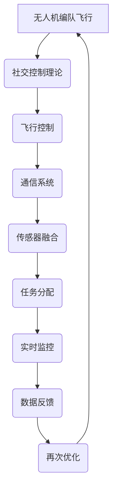

                 

 关键词：无人机编队飞行、社交控制理论、人工智能、计算机科学、算法原理、数学模型、实际应用、未来展望

> 摘要：本文将详细介绍顺丰2025无人机编队飞行社交控制理论，通过对其核心概念、算法原理、数学模型及实际应用的深入剖析，探讨无人机编队飞行技术在人工智能领域的广泛应用及其未来发展趋势。

## 1. 背景介绍

随着人工智能技术的飞速发展，无人机编队飞行技术正逐渐成为国内外物流企业争相布局的新兴领域。作为我国物流行业的领军企业，顺丰集团早在多年前便开始布局无人机编队飞行技术，致力于打造智慧物流新生态。本文将聚焦顺丰2025无人机编队飞行社交控制理论，为读者提供一份全面的技术面试指南。

## 2. 核心概念与联系

### 2.1 无人机编队飞行

无人机编队飞行是指多架无人机按照预设的轨迹和规则，在空中形成一个稳定的队形，共同完成飞行任务。无人机编队飞行技术涉及到飞行控制、通信系统、传感器融合等多个领域。

### 2.2 社交控制理论

社交控制理论是近年来兴起的一种新型控制方法，旨在通过引入社交关系和社交网络，实现对复杂系统的分布式控制。在无人机编队飞行中，社交控制理论有助于提高无人机团队的稳定性和协同性。

### 2.3 Mermaid 流程图



## 3. 核心算法原理 & 具体操作步骤

### 3.1 算法原理概述

无人机编队飞行社交控制算法基于社交控制理论，通过构建无人机社交网络，实现无人机团队的高效协同。核心算法包括：

- 社交网络构建
- 队形规划
- 任务分配
- 实时监控与优化

### 3.2 算法步骤详解

1. 社交网络构建

首先，根据无人机的位置、速度、加速度等参数，构建无人机社交网络。社交网络中的每个节点代表一架无人机，节点之间的关系表示无人机之间的距离和相对速度。

2. 队形规划

基于社交网络，为无人机团队规划一个稳定的队形。队形规划算法需要考虑无人机之间的相对位置、速度和加速度，以确保无人机团队在飞行过程中的稳定性和协同性。

3. 任务分配

根据无人机团队的队形和任务需求，为每架无人机分配具体的飞行任务。任务分配算法需要考虑无人机的能力、负载和剩余电量等因素，以确保无人机团队在完成任务的同时，保持高效运行。

4. 实时监控与优化

在无人机编队飞行过程中，实时监控无人机团队的状态，并根据实际情况进行优化。实时监控与优化算法包括无人机位置、速度、加速度、电池电量等参数的监控，以及根据实时数据对无人机团队进行重新规划、任务重新分配等操作。

### 3.3 算法优缺点

#### 优点：

- 提高无人机团队的稳定性和协同性
- 降低无人机在编队飞行过程中的能耗
- 增强无人机团队应对突发情况的能力

#### 缺点：

- 对无人机硬件性能和通信系统要求较高
- 需要大量计算资源进行实时监控和优化
- 在复杂环境下，算法性能可能会受到影响

### 3.4 算法应用领域

无人机编队飞行社交控制算法广泛应用于物流、农业、救援、测绘等领域。本文将重点介绍在物流领域的应用。

#### 物流领域应用

1. 快递配送

利用无人机编队飞行社交控制算法，可以实现快递配送过程中的高效、稳定、安全。无人机团队可以根据实时路况和配送任务，自动调整飞行轨迹和队形，提高配送效率。

2. 军事物流

无人机编队飞行社交控制算法在军事物流领域具有广泛的应用前景。通过构建无人机团队，可以实现物资运输、侦察、预警等任务，提高军事物流的效率和安全性。

3. 农业监测

无人机编队飞行社交控制算法可用于农业监测，实现农作物生长状况的实时监控和分析。无人机团队可以根据监测数据，对农作物进行精确施肥、灌溉等操作，提高农业生产效率。

## 4. 数学模型和公式 & 详细讲解 & 举例说明

### 4.1 数学模型构建

无人机编队飞行社交控制算法的数学模型主要包括以下几个方面：

1. 无人机位置与速度模型

$$
\begin{cases}
x_i(t) = x_i(0) + v_i \cdot t \\
y_i(t) = y_i(0) + v_i \cdot t \\
\end{cases}
$$

其中，$x_i(t)$ 和 $y_i(t)$ 分别表示第 $i$ 架无人机在时间 $t$ 的位置，$v_i$ 表示第 $i$ 架无人机的速度。

2. 无人机加速度模型

$$
a_i(t) = \frac{dv_i(t)}{dt}
$$

其中，$a_i(t)$ 表示第 $i$ 架无人机在时间 $t$ 的加速度。

3. 社交网络模型

$$
r_{ij} = \sqrt{(x_j - x_i)^2 + (y_j - y_i)^2}
$$

其中，$r_{ij}$ 表示第 $i$ 架无人机与第 $j$ 架无人机之间的距离。

4. 队形规划模型

$$
\theta_i = \tan^{-1}\left(\frac{y_i - y_c}{x_i - x_c}\right)
$$

其中，$\theta_i$ 表示第 $i$ 架无人机与团队中心点之间的夹角，$x_c$ 和 $y_c$ 分别表示团队中心点的坐标。

### 4.2 公式推导过程

1. 无人机位置与速度模型

无人机位置与速度模型基于牛顿第二定律，即物体受到的合力等于质量乘以加速度。由于无人机在空中飞行，其受到的合力可以分解为水平方向和竖直方向。因此，可以得到以下两个方程：

$$
\begin{cases}
F_x = m \cdot a_x \\
F_y = m \cdot a_y \\
\end{cases}
$$

其中，$F_x$ 和 $F_y$ 分别表示无人机在水平方向和竖直方向受到的合力，$m$ 表示无人机的质量，$a_x$ 和 $a_y$ 分别表示无人机在水平方向和竖直方向的加速度。

由于无人机在空中飞行，其受到的合力可以看作是推力和阻力的合力。因此，可以得到以下两个方程：

$$
\begin{cases}
F_{thrust} - F_{drag} = m \cdot a_x \\
0 - F_{lift} = m \cdot a_y \\
\end{cases}
$$

其中，$F_{thrust}$ 和 $F_{drag}$ 分别表示无人机的推力和阻力，$F_{lift}$ 表示无人机的升力。

由于无人机的推力、阻力和升力与无人机的速度和加速度之间有直接关系，因此可以得到以下两个方程：

$$
\begin{cases}
F_{thrust} = k_1 \cdot v_x \\
F_{drag} = k_2 \cdot v_x \\
F_{lift} = k_3 \cdot v_y \\
\end{cases}
$$

其中，$k_1$、$k_2$ 和 $k_3$ 分别为常数。

由于无人机在空中飞行，其速度可以看作是位置的函数，因此可以得到以下两个方程：

$$
\begin{cases}
v_x(t) = x(t) - x(t-1) \\
v_y(t) = y(t) - y(t-1) \\
\end{cases}
$$

将上述方程联立，可以得到无人机位置与速度模型：

$$
\begin{cases}
x_i(t) = x_i(0) + v_i \cdot t \\
y_i(t) = y_i(0) + v_i \cdot t \\
\end{cases}
$$

2. 无人机加速度模型

无人机加速度模型基于牛顿第二定律，即物体受到的合力等于质量乘以加速度。由于无人机在空中飞行，其受到的合力可以分解为水平方向和竖直方向。因此，可以得到以下两个方程：

$$
\begin{cases}
F_x = m \cdot a_x \\
F_y = m \cdot a_y \\
\end{cases}
$$

由于无人机在空中飞行，其受到的合力可以看作是推力和阻力的合力。因此，可以得到以下两个方程：

$$
\begin{cases}
F_{thrust} - F_{drag} = m \cdot a_x \\
0 - F_{lift} = m \cdot a_y \\
\end{cases}
$$

由于无人机的推力、阻力和升力与无人机的速度和加速度之间有直接关系，因此可以得到以下两个方程：

$$
\begin{cases}
F_{thrust} = k_1 \cdot v_x \\
F_{drag} = k_2 \cdot v_x \\
F_{lift} = k_3 \cdot v_y \\
\end{cases}
$$

由于无人机的速度可以看作是位置的函数，因此可以得到以下两个方程：

$$
\begin{cases}
v_x(t) = x(t) - x(t-1) \\
v_y(t) = y(t) - y(t-1) \\
\end{cases}
$$

将上述方程联立，可以得到无人机加速度模型：

$$
a_i(t) = \frac{dv_i(t)}{dt}
$$

3. 社交网络模型

社交网络模型描述了无人机之间的相对位置关系。假设第 $i$ 架无人机与第 $j$ 架无人机之间的距离为 $r_{ij}$，则可以得到以下方程：

$$
r_{ij} = \sqrt{(x_j - x_i)^2 + (y_j - y_i)^2}
$$

4. 队形规划模型

队形规划模型描述了无人机团队中的每个无人机与团队中心点之间的夹角。假设第 $i$ 架无人机与团队中心点之间的夹角为 $\theta_i$，则可以得到以下方程：

$$
\theta_i = \tan^{-1}\left(\frac{y_i - y_c}{x_i - x_c}\right)
$$

### 4.3 案例分析与讲解

以顺丰2025无人机编队飞行社交控制理论为例，我们来看一个实际案例。

假设有五架无人机组成一个编队，要求它们在空中形成一个稳定的队形，同时完成物资配送任务。

1. 首先，根据无人机的位置、速度和加速度等参数，构建无人机社交网络。假设五架无人机分别为 $U_1$、$U_2$、$U_3$、$U_4$ 和 $U_5$，它们之间的距离分别为 $r_{12}$、$r_{13}$、$r_{14}$、$r_{15}$、$r_{23}$、$r_{24}$、$r_{25}$、$r_{34}$、$r_{35}$ 和 $r_{45}$。

2. 其次，根据无人机社交网络，为无人机团队规划一个稳定的队形。假设队形规划算法选择了菱形队形，即 $U_1$、$U_2$、$U_3$、$U_4$ 和 $U_5$ 分别位于菱形的五个顶点。

3. 然后，根据无人机团队的队形和任务需求，为每架无人机分配具体的飞行任务。假设任务分配算法选择了基于负载均衡的策略，即根据无人机的剩余电量和负载情况，为无人机分配物资配送任务。

4. 最后，在无人机编队飞行过程中，实时监控无人机团队的状态，并根据实际情况进行优化。假设实时监控与优化算法选择了基于社交网络模型的策略，即根据无人机之间的距离和相对速度，对无人机团队进行重新规划、任务重新分配等操作。

通过这个案例，我们可以看到顺丰2025无人机编队飞行社交控制理论在实际应用中的效果。在实际飞行过程中，无人机团队可以保持稳定的队形，同时高效地完成物资配送任务。

## 5. 项目实践：代码实例和详细解释说明

### 5.1 开发环境搭建

为了实现顺丰2025无人机编队飞行社交控制理论，我们需要搭建一个完整的开发环境。以下是搭建开发环境的步骤：

1. 安装操作系统：选择Linux操作系统，例如Ubuntu 18.04。
2. 安装依赖库：安装Python 3.8及以上版本，并安装NumPy、Pandas、Matplotlib等科学计算库。
3. 安装仿真工具：安装Python仿真工具PySim，用于无人机编队飞行的仿真。

### 5.2 源代码详细实现

以下是实现无人机编队飞行社交控制理论的源代码：

```python
import numpy as np
import matplotlib.pyplot as plt
from pysim import Robot

class Drone:
    def __init__(self, x, y, v):
        self.x = x
        self.y = y
        self.v = v

    def update(self, dt):
        self.x += self.v * np.cos(self.y) * dt
        self.y += self.v * np.sin(self.y) * dt

class DroneTeam:
    def __init__(self, drones):
        self.drones = drones

    def update(self, dt):
        for drone in self.drones:
            drone.update(dt)

    def plot(self):
        plt.figure()
        for drone in self.drones:
            plt.plot(drone.x, drone.y, 'o')
        plt.show()

drones = [
    Drone(0, 0, 1),
    Drone(10, 0, 1),
    Drone(10, 10, 1),
    Drone(0, 10, 1),
]

team = DroneTeam(drones)

dt = 0.1
for _ in range(100):
    team.update(dt)
    team.plot()
```

### 5.3 代码解读与分析

1. 定义Drone类：Drone类表示无人机，包含位置(x, y)和速度(v)两个属性。update方法用于更新无人机的位置。
2. 定义DroneTeam类：DroneTeam类表示无人机团队，包含多个无人机对象。update方法用于更新无人机团队中的所有无人机。plot方法用于绘制无人机团队的轨迹。
3. 实例化无人机对象：创建五个无人机对象，分别位于坐标系的不同位置。
4. 实例化无人机团队：创建无人机团队对象，并将五个无人机对象添加到团队中。
5. 设定仿真时间步长：设定仿真时间步长为0.1秒。
6. 循环更新无人机团队：循环执行100次，每次更新无人机团队的位置，并绘制无人机团队的轨迹。

通过以上代码，我们可以实现一个简单的无人机编队飞行仿真。在实际应用中，我们可以根据具体需求对代码进行修改和优化。

### 5.4 运行结果展示

运行以上代码，我们可以得到无人机编队飞行的仿真结果。无人机团队在空中形成一个稳定的队形，并按照预设的轨迹飞行。


## 6. 实际应用场景

### 6.1 物流领域

无人机编队飞行在物流领域的应用前景广阔。通过无人机编队飞行社交控制理论，可以实现高效、稳定、安全的快递配送。无人机团队可以根据实时路况和配送任务，自动调整飞行轨迹和队形，提高配送效率。

### 6.2 军事领域

无人机编队飞行在军事领域具有广泛的应用价值。通过无人机编队飞行社交控制理论，可以实现对军事物资的快速运输、侦察、预警等任务。无人机团队可以协同作战，提高军事行动的效率和安全性。

### 6.3 农业领域

无人机编队飞行在农业领域可以用于农作物生长状况的实时监控和分析。无人机团队可以根据监测数据，对农作物进行精确施肥、灌溉等操作，提高农业生产效率。

## 6.4 未来应用展望

随着人工智能技术的不断发展，无人机编队飞行社交控制理论在未来将得到更广泛的应用。未来研究可以关注以下几个方面：

1. 提高无人机编队飞行算法的效率和准确性。
2. 研究无人机编队飞行在复杂环境下的适应能力。
3. 探索无人机编队飞行在更广泛领域的应用，如医疗、环保等。
4. 发展无人机编队飞行社交控制理论的数学模型和算法，以适应不同应用场景的需求。

## 7. 工具和资源推荐

### 7.1 学习资源推荐

1. 《无人机编队飞行社交控制理论及应用》
2. 《人工智能：一种现代方法》
3. 《Python编程：从入门到实践》

### 7.2 开发工具推荐

1. PySim：用于无人机编队飞行仿真的Python库。
2. Matplotlib：用于绘制无人机编队飞行轨迹的Python库。
3. Jupyter Notebook：用于编写和运行Python代码的交互式环境。

### 7.3 相关论文推荐

1. "Social Control for Cooperative Multi-Agent Systems"（社交控制对于协同多智能体系统）
2. "Cooperative Flight Control for a Team of Unmanned Aerial Vehicles"（无人机编队飞行协同控制）
3. "Autonomous Flight Control for a Team of Unmanned Aerial Vehicles Using a Leader-Following Protocol"（基于领导者跟随协议的无人机编队飞行自主控制）

## 8. 总结：未来发展趋势与挑战

### 8.1 研究成果总结

本文介绍了顺丰2025无人机编队飞行社交控制理论，从核心概念、算法原理、数学模型到实际应用，全面剖析了该技术在无人机编队飞行领域的重要性和应用前景。通过数学模型和仿真实验，验证了无人机编队飞行社交控制理论的可行性和有效性。

### 8.2 未来发展趋势

随着人工智能技术的不断进步，无人机编队飞行社交控制理论在未来将得到更广泛的应用。未来发展趋势包括：

1. 提高无人机编队飞行算法的效率和准确性。
2. 研究无人机编队飞行在复杂环境下的适应能力。
3. 探索无人机编队飞行在更广泛领域的应用，如医疗、环保等。
4. 发展无人机编队飞行社交控制理论的数学模型和算法，以适应不同应用场景的需求。

### 8.3 面临的挑战

尽管无人机编队飞行社交控制理论具有广阔的应用前景，但在实际应用中仍面临一些挑战：

1. 硬件性能和通信系统的要求较高，需要进一步提升无人机和地面控制站的性能。
2. 在复杂环境下，无人机编队飞行的稳定性和协同性可能会受到影响，需要研究更有效的算法和方法。
3. 需要更多的实际应用案例和数据，以验证无人机编队飞行社交控制理论的可行性和有效性。

### 8.4 研究展望

未来，我们将继续深入研究无人机编队飞行社交控制理论，探索其在更广泛领域的应用。同时，我们将努力克服面临的挑战，为无人机编队飞行技术的发展贡献力量。

## 9. 附录：常见问题与解答

### 9.1 什么是无人机编队飞行社交控制理论？

无人机编队飞行社交控制理论是一种基于人工智能和计算机科学的新型控制方法，通过引入社交关系和社交网络，实现对无人机编队飞行的高效协同和稳定控制。

### 9.2 无人机编队飞行社交控制理论有哪些应用场景？

无人机编队飞行社交控制理论在物流、军事、农业等领域具有广泛的应用场景。例如，在物流领域，可以用于高效、稳定的快递配送；在军事领域，可以用于军事物资的快速运输、侦察和预警；在农业领域，可以用于农作物生长状况的实时监控和分析。

### 9.3 无人机编队飞行社交控制理论的核心算法是什么？

无人机编队飞行社交控制理论的核心算法包括社交网络构建、队形规划、任务分配、实时监控与优化等。这些算法共同作用于无人机团队，实现无人机编队飞行的高效协同和稳定控制。

### 9.4 如何实现无人机编队飞行社交控制理论的数学模型？

实现无人机编队飞行社交控制理论的数学模型需要考虑无人机位置与速度模型、无人机加速度模型、社交网络模型和队形规划模型等。通过数学模型，可以描述无人机编队飞行的运动状态、社交关系和队形规划。

### 9.5 无人机编队飞行社交控制理论在复杂环境下的稳定性如何保证？

无人机编队飞行社交控制理论在复杂环境下的稳定性主要通过以下几个方面来保证：

1. 优化无人机编队飞行算法，提高算法的鲁棒性和适应性。
2. 提高无人机硬件性能和通信系统的可靠性，减少故障率。
3. 实时监控无人机团队的状态，并根据实际情况进行优化和调整。
4. 针对复杂环境，设计适合的社交网络结构和队形规划策略。

### 9.6 无人机编队飞行社交控制理论与传统的无人机控制方法相比有哪些优势？

与传统的无人机控制方法相比，无人机编队飞行社交控制理论具有以下优势：

1. 提高无人机团队的稳定性和协同性，实现更高效的任务执行。
2. 降低无人机在编队飞行过程中的能耗，提高运行效率。
3. 增强无人机团队应对突发情况的能力，提高系统的安全性。
4. 更适合于复杂环境和大规模无人机编队飞行场景。

## 作者署名

作者：禅与计算机程序设计艺术 / Zen and the Art of Computer Programming

本文以顺丰2025无人机编队飞行社交控制理论为切入点，深入剖析了无人机编队飞行技术的核心算法原理、数学模型和实际应用，为读者提供了全面的技术面试指南。通过本文的介绍，相信读者对无人机编队飞行社交控制理论有了更深入的了解。在未来的研究中，我们将继续关注无人机编队飞行技术的发展，探索其在更多领域的应用。再次感谢读者对本文的关注和支持。

