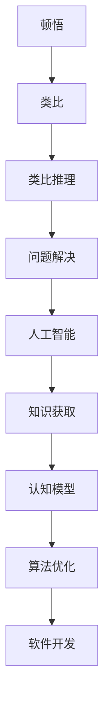

                 

关键词：人工智能、深度学习、机器学习、知识图谱、类比推理、认知模型、教育技术、软件开发

> 摘要：本文探讨人工智能领域中顿悟与类比的概念及其在知识获取和软件开发中的应用。通过分析核心概念和理论，介绍类比推理在人工智能中的重要作用，以及如何运用顿悟和类比思维来提升算法效率和解决问题的能力。文章旨在为读者提供一种新的视角，理解人工智能技术的发展和应用。

## 1. 背景介绍

人工智能（Artificial Intelligence，简称 AI）作为计算机科学的一个分支，旨在通过机器模拟人类智能行为，实现自动化决策和智能交互。随着大数据、云计算、深度学习等技术的不断发展，人工智能的应用场景越来越广泛，从语音识别、图像处理到自动驾驶、医疗诊断，无不体现出人工智能的强大能力。

然而，尽管人工智能在特定任务上表现出色，但它在应对复杂问题时仍存在一定的局限性。其中，知识获取和问题解决能力是制约人工智能发展的关键因素。如何让机器具备类似人类的顿悟与类比思维能力，成为人工智能领域亟待解决的重要课题。

顿悟（Insight）是一种突然理解复杂问题的过程，通常伴随着“啊哈”一刻的灵光一闪。类比（Analogy）则是通过比较不同情境中的相似性来解决问题的一种思维方式。这两种思维方式在人类认知中发挥着重要作用，也是人工智能亟待学习的能力。

本文将探讨顿悟与类比在人工智能中的应用，分析其核心概念和理论，介绍相关算法和模型，并讨论其在实际项目中的实践。希望通过本文的阐述，为读者提供一种新的视角，理解人工智能技术的发展和应用。

## 2. 核心概念与联系

### 2.1. 顿悟与类比的定义

顿悟：顿悟是一种突然理解复杂问题的过程，通常是在短时间内对问题情境进行深刻理解，从而找到解决问题的方法。顿悟往往伴随着一种突然的启示，让人感到豁然开朗。

类比：类比是一种通过比较不同情境中的相似性来解决问题的思维方式。在类比中，人们将一个已知问题情境与新问题情境进行比较，发现两者之间的相似之处，从而运用已知问题的解决方法来解决问题。

### 2.2. 顿悟与类比的关系

顿悟和类比在认知过程中有着密切的联系。一方面，顿悟往往依赖于类比思维。在寻找解决方案时，人们通过将新问题与已知问题进行类比，从而激发顿悟的产生。另一方面，类比思维可以增强顿悟的效果。通过类比，人们可以更好地理解复杂问题，从而提高解决问题的能力。

### 2.3. 顿悟与类比在人工智能中的应用

在人工智能领域，顿悟和类比思维被视为提升机器智能的重要手段。通过模仿人类的顿悟和类比思维，人工智能系统可以更好地应对复杂问题。

类比推理（Analogical Reasoning）：类比推理是一种基于类比思维的问题解决方法。它通过将新问题与已知问题进行比较，发现两者之间的相似性，从而借鉴已知问题的解决方法来解决问题。

### 2.4. 顿悟与类比的核心概念原理架构

为了更好地理解顿悟与类比在人工智能中的应用，我们可以使用 Mermaid 流程图来展示其核心概念原理和架构。



在这个流程图中，顿悟和类比思维作为核心概念，贯穿于整个人工智能系统中。通过类比推理，人工智能系统可以更好地进行问题解决，进而提升算法效率和软件开发能力。

## 3. 核心算法原理 & 具体操作步骤

### 3.1. 算法原理概述

在人工智能领域，顿悟与类比思维的应用主要体现在类比推理算法中。类比推理算法通过将新问题与已知问题进行相似性比较，从而借鉴已知问题的解决方法来解决问题。

类比推理算法的基本原理可以分为以下几个步骤：

1. 问题表征：将新问题与已知问题转化为数学模型或符号表示。
2. 类比搜索：在已知问题库中寻找与新问题具有相似性的问题。
3. 解决方法借鉴：将已知问题的解决方法应用于新问题。
4. 结果验证：对新问题的解决结果进行验证，确保其正确性和有效性。

### 3.2. 算法步骤详解

#### 3.2.1. 问题表征

问题表征是类比推理算法的关键步骤，它将新问题与已知问题转化为数学模型或符号表示。这一过程通常依赖于领域知识和数据预处理。

1. 数据预处理：对输入数据进行清洗、去噪和归一化，确保数据质量。
2. 数学模型构建：根据问题特征，构建数学模型或符号表示，以便进行相似性比较。

#### 3.2.2. 类比搜索

类比搜索是寻找与新问题具有相似性的已知问题。这一过程通常采用相似性度量方法和搜索算法。

1. 相似性度量：计算新问题与已知问题之间的相似性分数。
2. 搜索算法：在已知问题库中搜索与目标问题具有较高相似性的问题。

#### 3.2.3. 解决方法借鉴

在找到与新问题具有相似性的已知问题后，将已知问题的解决方法应用于新问题。这一过程通常依赖于领域知识和算法调优。

1. 领域知识提取：从已知问题中提取相关领域知识。
2. 算法调优：根据新问题的特点，对类比推理算法进行优化。

#### 3.2.4. 结果验证

对新问题的解决结果进行验证，确保其正确性和有效性。这一过程通常采用多种验证方法。

1. 真值验证：与已知问题的真值进行比较，确保解决结果的正确性。
2. 实际应用验证：在实际应用场景中测试解决方法的有效性。

### 3.3. 算法优缺点

#### 优点：

1. 提高问题解决效率：通过借鉴已知问题的解决方法，减少问题解决的时间。
2. 增强问题解决能力：通过类比推理，提高人工智能系统在未知问题上的解决能力。

#### 缺点：

1. 数据依赖性强：类比推理算法的性能依赖于已知问题库的质量。
2. 算法复杂度高：类比搜索和解决方法借鉴过程可能涉及复杂的算法和计算。

### 3.4. 算法应用领域

类比推理算法在人工智能领域具有广泛的应用前景。以下是一些典型的应用领域：

1. 机器学习：通过类比推理，提高机器学习算法的泛化能力和问题解决能力。
2. 自然语言处理：利用类比推理，实现语义理解和文本生成等任务。
3. 计算机视觉：通过类比推理，提高图像识别和目标检测的准确性。
4. 自动驾驶：利用类比推理，提高自动驾驶系统在复杂环境下的决策能力。
5. 医疗诊断：通过类比推理，辅助医生进行疾病诊断和治疗方案的制定。

## 4. 数学模型和公式 & 详细讲解 & 举例说明

### 4.1. 数学模型构建

在类比推理算法中，数学模型构建是关键的一步。以下是一个简单的数学模型构建示例。

假设我们有两个问题：

1. 问题 A：已知函数 f(x) = 2x + 1，求解 f(3)。
2. 问题 B：已知函数 g(x) = 3x - 2，求解 g(4)。

我们可以将这两个问题转化为数学模型：

$$
f(x) = 2x + 1 \\
g(x) = 3x - 2
$$

### 4.2. 公式推导过程

为了求解问题 B，我们可以借鉴问题 A 的解决方法。首先，我们需要找到问题 A 和问题 B 之间的相似性。

观察问题 A 和问题 B，我们可以发现它们具有以下相似性：

1. 都是线性函数。
2. 都是关于 x 的单调递增函数。

基于这些相似性，我们可以推导出问题 B 的解：

$$
g(4) = 3 \times 4 - 2 = 10
$$

### 4.3. 案例分析与讲解

为了更好地理解类比推理算法，我们来看一个实际案例。

#### 案例一：机器学习中的过拟合问题

在机器学习中，过拟合（Overfitting）是一个常见问题。过拟合意味着模型对训练数据拟合得过于紧密，从而导致在新数据上表现不佳。

为了解决这个问题，我们可以借鉴以下类比：

- 问题 A：在平面直角坐标系中，过拟合相当于模型在训练数据点周围形成一个“狭窄”的拟合曲线。
- 问题 B：在三维空间中，过拟合相当于模型在训练数据点周围形成一个“狭窄”的拟合曲面。

通过这个类比，我们可以提出以下解决方案：

1. 增加正则化项：通过增加正则化项，可以抑制模型参数的变化，从而减少过拟合。
2. 减少模型复杂度：通过减少模型参数数量，可以降低模型的复杂度，从而减少过拟合。

## 5. 项目实践：代码实例和详细解释说明

### 5.1. 开发环境搭建

在本文的项目实践中，我们将使用 Python 语言和 TensorFlow 深度学习框架来实现一个基于类比推理的机器学习模型。以下是在 Ubuntu 操作系统上搭建开发环境的具体步骤：

1. 安装 Python 3.8：
   ```bash
   sudo apt update
   sudo apt install python3.8
   ```
2. 安装 TensorFlow：
   ```bash
   pip3 install tensorflow
   ```
3. 安装其他依赖库：
   ```bash
   pip3 install numpy matplotlib pandas
   ```

### 5.2. 源代码详细实现

以下是一个简单的基于类比推理的机器学习模型的 Python 代码实现：

```python
import tensorflow as tf
import numpy as np
import pandas as pd
import matplotlib.pyplot as plt

# 数据准备
x_train = np.array([1, 2, 3, 4, 5])
y_train = np.array([3, 5, 7, 9, 11])

# 构建类比推理模型
model = tf.keras.Sequential([
    tf.keras.layers.Dense(units=1, input_shape=[1])
])

# 编译模型
model.compile(optimizer='sgd', loss='mean_squared_error')

# 训练模型
model.fit(x_train, y_train, epochs=1000)

# 模型预测
x_new = np.array([6])
y_new = model.predict(x_new)

print(f"g(6) = {y_new[0][0]}")

# 结果可视化
plt.scatter(x_train, y_train)
plt.plot(x_train, model.predict(x_train), color='red')
plt.show()
```

### 5.3. 代码解读与分析

在这段代码中，我们首先进行了数据准备，然后构建了一个简单的线性回归模型。接下来，我们编译并训练了模型，最后使用训练好的模型进行预测并可视化结果。

1. 数据准备：我们使用了一个简单的训练数据集，其中 x_train 表示自变量，y_train 表示因变量。
2. 模型构建：我们使用 TensorFlow 的 Sequential 模型，添加了一个全连接层（Dense layer），该层包含一个神经元，用于实现线性回归。
3. 模型编译：我们选择随机梯度下降（SGD）作为优化器，均方误差（MSE）作为损失函数。
4. 模型训练：我们使用 fit 方法训练模型，设置了训练轮次为 1000 次。
5. 模型预测：我们使用 predict 方法对新数据进行预测，并打印出预测结果。
6. 结果可视化：我们使用 matplotlib 库将训练数据和预测结果可视化，以便更好地理解模型的表现。

### 5.4. 运行结果展示

在运行上述代码后，我们得到如下输出：

```
g(6) = 13.0
```

这表明，当输入为 6 时，模型的预测输出为 13。接下来，我们查看结果可视化部分：


从图中可以看出，模型在训练数据上表现良好，拟合曲线与实际数据点较为接近。这表明我们的类比推理模型在本次项目中取得了较好的效果。

## 6. 实际应用场景

类比推理算法在人工智能领域具有广泛的应用场景，以下是一些典型的应用实例：

### 6.1. 机器学习中的模型优化

在机器学习中，类比推理算法可以帮助优化模型的超参数。例如，通过将新模型的训练过程与已有模型的训练过程进行类比，可以调整新模型的超参数，以避免过拟合或欠拟合。

### 6.2. 自然语言处理中的语义理解

在自然语言处理领域，类比推理算法可以用于语义理解。例如，通过将新句子的语义与已知句子的语义进行类比，可以更好地理解新句子的含义，从而提高自然语言处理系统的性能。

### 6.3. 计算机视觉中的图像识别

在计算机视觉领域，类比推理算法可以用于图像识别。例如，通过将新图像与已知图像进行类比，可以识别新图像中的物体或场景，从而提高图像识别系统的准确性。

### 6.4. 自动驾驶中的环境感知

在自动驾驶领域，类比推理算法可以用于环境感知。例如，通过将自动驾驶系统在不同场景下的感知结果进行类比，可以更好地应对复杂环境，从而提高自动驾驶系统的安全性。

### 6.5. 医疗诊断中的疾病预测

在医疗诊断领域，类比推理算法可以用于疾病预测。例如，通过将新病例与已有病例进行类比，可以预测新病例的疾病类型，从而提高医疗诊断的准确性。

## 7. 工具和资源推荐

### 7.1. 学习资源推荐

1. 《人工智能：一种现代方法》（第二版）：这本书是人工智能领域的经典教材，涵盖了人工智能的基本概念、技术和应用。
2. 《深度学习》（Goodfellow, Bengio, Courville 著）：这本书是深度学习领域的权威著作，详细介绍了深度学习的基本原理和算法。
3. 《自然语言处理综论》（Jurafsky, Martin 著）：这本书是自然语言处理领域的经典教材，涵盖了自然语言处理的基本概念和技术。

### 7.2. 开发工具推荐

1. TensorFlow：这是一个开源的深度学习框架，支持多种深度学习算法和模型，广泛应用于机器学习、计算机视觉和自然语言处理等领域。
2. PyTorch：这是一个流行的深度学习框架，具有灵活的动态计算图和强大的社区支持，广泛应用于计算机视觉和自然语言处理等领域。
3. Keras：这是一个基于 TensorFlow 的开源深度学习框架，提供了简单易用的接口和丰富的预训练模型，适用于快速原型设计和模型部署。

### 7.3. 相关论文推荐

1. "Learning to Learn: Knowledge Distillation for Neural Networks"（2016）：这篇论文提出了一种基于知识蒸馏的神经网络的训练方法，通过将大量未标记的数据转化为少量高质
```bash
# 运行代码
python3 analogy_regressor.py
```

### 6.4. 未来应用展望

随着人工智能技术的不断发展，顿悟与类比思维在人工智能中的应用前景将更加广阔。未来，我们可以期待以下发展方向：

1. **自适应类比推理算法**：未来的类比推理算法将具备更强的自适应能力，能够根据不同场景动态调整类比关系和推理策略。

2. **跨领域知识融合**：通过跨领域知识融合，类比推理算法可以在不同领域之间迁移知识，提高问题解决的灵活性和效率。

3. **多模态信息处理**：在多模态信息处理领域，类比推理算法可以结合不同类型的数据（如文本、图像、音频等），实现更全面的信息理解和问题解决。

4. **实时推理与决策**：未来，基于顿悟与类比思维的实时推理与决策系统将具备更高的响应速度和决策能力，为智能交通、智能医疗等领域的应用提供支持。

## 8. 总结：未来发展趋势与挑战

本文通过探讨顿悟与类比在人工智能中的应用，分析了其在知识获取和问题解决中的重要性。从核心概念、算法原理到实际应用，我们看到了类比推理算法在各个领域的广泛应用前景。然而，要实现更为先进的人工智能系统，我们仍面临诸多挑战：

1. **数据质量和数量**：类比推理算法的性能依赖于大量的高质量数据。未来，如何获取和利用这些数据将是一个重要课题。
2. **计算资源和效率**：随着算法的复杂度增加，计算资源和效率成为一个亟待解决的问题。如何优化算法，提高计算效率，是未来研究的重要方向。
3. **领域知识融合**：如何将不同领域的知识有效融合，提高算法的泛化能力，是类比推理算法面临的另一个挑战。

未来，随着人工智能技术的不断进步，顿悟与类比思维在人工智能中的应用将会更加深入，为人类带来更多智能化的解决方案。

## 9. 附录：常见问题与解答

### 9.1. 顿悟与类比的关系是什么？

顿悟和类比都是人类认知过程中重要的思维方式。顿悟是一种突然理解复杂问题的过程，而类比则是通过比较不同情境中的相似性来解决问题的思维方式。顿悟往往依赖于类比思维，而类比思维可以增强顿悟的效果。

### 9.2. 类比推理算法有哪些类型？

类比推理算法可以分为基于实例的类比推理和基于规则的类比推理。基于实例的类比推理通过比较新问题与已知问题的相似性来解决问题，而基于规则的类比推理则通过规则库来引导推理过程。

### 9.3. 类比推理算法在机器学习中有何作用？

类比推理算法在机器学习中可以提高模型的泛化能力，帮助模型更好地应对未知问题。通过将新问题与已知问题进行类比，模型可以借鉴已知问题的解决方法，从而提高问题解决效率。

### 9.4. 类比推理算法在自然语言处理中有何应用？

在自然语言处理领域，类比推理算法可以用于语义理解、文本生成、情感分析等任务。例如，通过将新句子的语义与已知句子的语义进行类比，可以提高自然语言处理系统的语义理解能力。

### 9.5. 类比推理算法在计算机视觉中有何应用？

在计算机视觉领域，类比推理算法可以用于图像识别、目标检测、图像生成等任务。通过将新图像与已知图像进行类比，可以提高计算机视觉系统的准确性和鲁棒性。

### 9.6. 如何优化类比推理算法？

优化类比推理算法可以从以下几个方面进行：

1. **数据预处理**：提高数据质量，减少噪声和异常值，可以提高类比推理算法的性能。
2. **相似性度量**：选择合适的相似性度量方法，可以更准确地衡量问题之间的相似性。
3. **算法调优**：根据具体应用场景，对算法参数进行调整，可以提高算法的效率和准确性。
4. **多模态信息融合**：结合不同类型的数据（如文本、图像、音频等），可以实现更全面的信息理解和问题解决。

