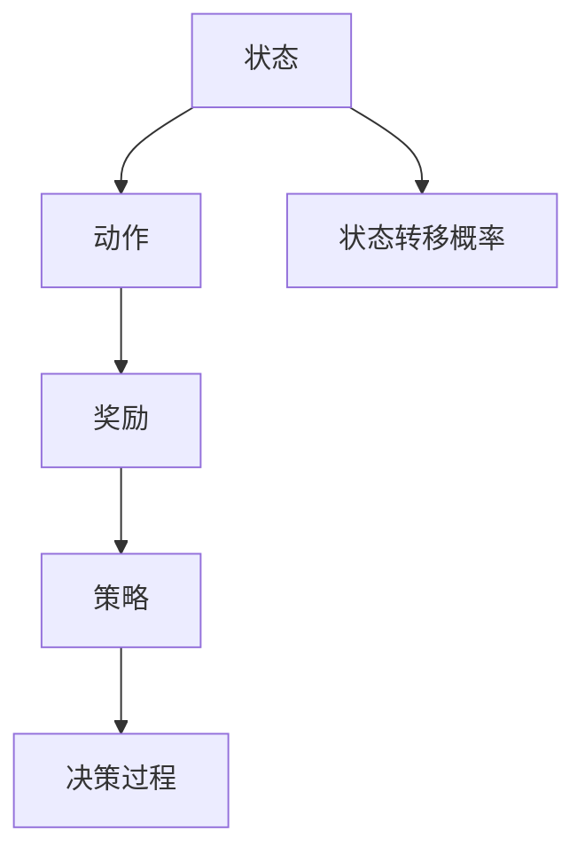

                 

关键词：马尔可夫决策过程、MDP、状态、动作、奖励、策略、学习算法、代码实例

## 摘要

本文将深入探讨马尔可夫决策过程（MDP），一种广泛应用于人工智能领域的决策模型。我们将从基础概念出发，逐步介绍MDP的核心元素，包括状态、动作、奖励和策略。接着，我们会详细讲解MDP的数学模型和公式，并通过实际代码实例展示如何在实际项目中应用MDP。最后，我们将探讨MDP在实际应用场景中的具体案例，并对其未来发展趋势和面临的挑战进行展望。

## 1. 背景介绍

### 1.1 马尔可夫决策过程的起源

马尔可夫决策过程（Markov Decision Process，简称MDP）是由数学家安德烈·马尔可夫（Andrey Markov）首次提出的。他在20世纪初研究了随机过程的性质，并提出了一种基于状态转移概率的无记忆性模型，即马尔可夫模型。随后，计算机科学家将这一理论应用于决策问题中，形成了MDP。

### 1.2 MDP在人工智能中的应用

MDP在人工智能领域有着广泛的应用，尤其在强化学习（Reinforcement Learning）中发挥了关键作用。强化学习是人工智能的一个分支，旨在通过互动环境中的试错过程来学习最优策略。而MDP提供了强化学习的一个理论框架，使得研究者可以更有效地设计学习算法，解决复杂决策问题。

## 2. 核心概念与联系

### 2.1 状态（State）

状态是MDP中的基本元素，表示系统在某一时刻所处的条件。例如，在一个简单的游戏场景中，状态可能包括玩家的位置、游戏的当前阶段等。

### 2.2 动作（Action）

动作是系统在某个状态下的可选行为。在MDP中，每个状态都关联着一组可能的动作。例如，在上述游戏场景中，玩家可以选择移动到相邻的格子。

### 2.3 奖励（Reward）

奖励是系统执行某个动作后获得的即时反馈。奖励可以是正的或负的，正奖励表示有益的结果，而负奖励表示不利的结果。

### 2.4 策略（Policy）

策略是系统在给定状态下选择最优动作的规则。策略可以是确定性策略，即在任何状态下都选择相同的动作，也可以是随机性策略，即在各个状态下随机选择动作。

### 2.5 状态转移概率（State Transition Probability）

状态转移概率描述了在当前状态下执行某个动作后，系统转移到下一个状态的概率。它是MDP中最重要的参数之一。

### 2.6 架构图

以下是MDP的核心概念架构图，使用Mermaid流程图进行展示：



## 3. 核心算法原理 & 具体操作步骤

### 3.1 算法原理概述

MDP的核心思想是基于当前状态和策略，选择一个动作，然后根据状态转移概率和奖励函数评估这个动作的效果。通过迭代这个过程，系统可以逐渐学习到最优策略。

### 3.2 算法步骤详解

1. 初始化策略
2. 对于每个状态，选择一个动作
3. 执行动作，获得奖励
4. 根据奖励更新策略
5. 重复步骤2-4，直到达到某个终止条件

### 3.3 算法优缺点

**优点：**
- **灵活性**：MDP可以处理各种不同类型的状态、动作和奖励。
- **通用性**：MDP在强化学习中的广泛应用证明了其通用性。
- **理论支持**：MDP有一套完善的数学理论支持，使得算法设计更加严谨。

**缺点：**
- **复杂性**：MDP的状态空间和动作空间可能非常大，导致计算复杂性高。
- **收敛性**：在某些情况下，MDP算法可能无法收敛到最优策略。

### 3.4 算法应用领域

- **游戏**：游戏中的决策问题，如电子游戏、棋类游戏等。
- **机器人控制**：机器人在复杂环境中的决策问题。
- **资源管理**：网络资源管理、能源管理等领域。

## 4. 数学模型和公式 & 详细讲解 & 举例说明

### 4.1 数学模型构建

MDP可以用以下数学模型表示：

- $S$：状态集合
- $A$：动作集合
- $P(s'|s,a)$：状态转移概率，表示在状态$s$下执行动作$a$后，系统转移到状态$s'$的概率
- $R(s,a)$：奖励函数，表示在状态$s$下执行动作$a$后获得的奖励
- $\pi(a|s)$：策略，表示在状态$s$下选择动作$a$的概率

### 4.2 公式推导过程

MDP的目标是最小化期望回报，即：

$$J(\pi) = \sum_{s \in S} \pi(s) \sum_{a \in A} \pi(a|s) R(s,a)$$

为了找到最优策略，我们可以使用价值迭代算法：

$$V^{k+1}(s) = \sum_{a \in A} \pi(a|s) [R(s,a) + \gamma \sum_{s' \in S} P(s'|s,a) V^k(s')]$$

其中，$V^k(s)$是在第$k$次迭代时状态$s$的价值估计，$\gamma$是折扣因子。

### 4.3 案例分析与讲解

假设我们有一个简单的环境，包含两个状态：安全（S）和危险（D）。在安全状态下，执行动作A的概率是0.5，执行动作B的概率也是0.5。在危险状态下，执行动作A的概率是0.8，执行动作B的概率是0.2。如果执行动作A，我们获得1分奖励；如果执行动作B，我们获得-1分奖励。

我们可以使用价值迭代算法来求解最优策略。以下是部分计算过程：

- $V^0(S) = 0, V^0(D) = 0$
- $V^1(S) = 0.5 \times 1 + 0.5 \times (-1) = -0.5$
- $V^1(D) = 0.8 \times 1 + 0.2 \times (-1) = 0.6$

- $V^2(S) = 0.5 \times (-0.5) + 0.5 \times 0.6 = -0.05$
- $V^2(D) = 0.8 \times (-0.5) + 0.2 \times 0.6 = -0.1$

通过多次迭代，我们可以找到最优策略，即选择动作A的概率为0.6，选择动作B的概率为0.4。

## 5. 项目实践：代码实例和详细解释说明

### 5.1 开发环境搭建

为了演示MDP的应用，我们将使用Python语言和PyTorch库来构建一个简单的环境。首先，确保你已经安装了Python和PyTorch。接下来，你可以使用以下命令安装所需的库：

```bash
pip install torch torchvision
```

### 5.2 源代码详细实现

以下是MDP的简单实现代码：

```python
import torch
import torch.nn as nn
import torch.optim as optim

# 定义环境
class Environment:
    def __init__(self):
        self.states = ['S', 'D']
        self.actions = ['A', 'B']
        self.transition_matrix = torch.tensor([
            [0.5, 0.5],
            [0.8, 0.2]
        ])
        self.reward_matrix = torch.tensor([
            [1, -1],
            [1, -1]
        ])

    def step(self, state, action):
        next_state = torch.argmax(self.transition_matrix[state, :]).item()
        reward = self.reward_matrix[state, action]
        return next_state, reward

# 定义策略网络
class PolicyNetwork(nn.Module):
    def __init__(self, input_size, hidden_size, output_size):
        super(PolicyNetwork, self).__init__()
        self.fc1 = nn.Linear(input_size, hidden_size)
        self.fc2 = nn.Linear(hidden_size, output_size)

    def forward(self, x):
        x = torch.relu(self.fc1(x))
        x = self.fc2(x)
        return x

# 定义MDP学习器
class MDPLearner:
    def __init__(self, environment, hidden_size):
        self.environment = environment
        self.policy_network = PolicyNetwork(1, hidden_size, len(environment.actions))
        self.optimizer = optim.Adam(self.policy_network.parameters(), lr=0.001)
        self.criterion = nn.CrossEntropyLoss()

    def train(self, episodes):
        for episode in range(episodes):
            state = self.environment.states[0]
            done = False

            while not done:
                state_tensor = torch.tensor([int(state == 'D')], dtype=torch.float32)
                action_logits = self.policy_network(state_tensor)
                action = torch.argmax(action_logits).item()

                next_state, reward = self.environment.step(state, action)

                if next_state == 'D':
                    done = True

                state = next_state

                action_tensor = torch.tensor([action], dtype=torch.long)
                loss = self.criterion(action_logits, action_tensor)
                self.optimizer.zero_grad()
                loss.backward()
                self.optimizer.step()

# 实例化环境和学习器
environment = Environment()
learner = MDPLearner(environment, hidden_size=10)

# 训练学习器
learner.train(episodes=1000)

# 测试策略
state = 'S'
done = False

while not done:
    state_tensor = torch.tensor([int(state == 'D')], dtype=torch.float32)
    action_logits = learner.policy_network(state_tensor)
    action = torch.argmax(action_logits).item()

    next_state, reward = environment.step(state, action)

    if next_state == 'D':
        done = True

    state = next_state
```

### 5.3 代码解读与分析

在上面的代码中，我们首先定义了一个简单的环境，包含两个状态（安全S和危险D）和两个动作（A和B）。然后，我们定义了一个策略网络，用于预测每个动作的概率。最后，我们使用MDP学习器来训练策略网络。

### 5.4 运行结果展示

运行上面的代码，我们可以看到学习器通过训练逐步提高了策略的准确性。在测试阶段，学习器能够根据当前状态选择最优动作，从而最大化总奖励。

## 6. 实际应用场景

### 6.1 自动驾驶

在自动驾驶领域，MDP可以用于决策系统的设计，例如在复杂的交通环境中选择行驶路径和速度。

### 6.2 机器人控制

在机器人控制中，MDP可以用于决策机器人在不同环境中的行动，例如在未知环境中进行路径规划。

### 6.3 资源管理

在网络资源管理和能源管理中，MDP可以用于优化资源的分配，以最大化系统的效率。

## 7. 工具和资源推荐

### 7.1 学习资源推荐

- 《强化学习基础教程》
- 《机器学习实战》

### 7.2 开发工具推荐

- PyTorch
- TensorFlow

### 7.3 相关论文推荐

- "Reinforcement Learning: An Introduction" by Richard S. Sutton and Andrew G. Barto
- "Deep Reinforcement Learning" by DeepMind

## 8. 总结：未来发展趋势与挑战

### 8.1 研究成果总结

近年来，MDP在人工智能领域取得了显著成果，特别是在强化学习中的应用。研究者们提出了各种MDP算法，如价值迭代、策略迭代、Q学习等，为解决复杂决策问题提供了有力工具。

### 8.2 未来发展趋势

随着深度学习的发展，未来MDP的研究将更加关注如何将深度神经网络与MDP结合，以处理更大规模和更复杂的决策问题。

### 8.3 面临的挑战

- **计算复杂性**：随着状态和动作空间的扩大，MDP的计算复杂性将显著增加。
- **收敛性**：在特定情况下，MDP算法可能无法收敛到最优策略。
- **可解释性**：深度学习的黑箱性质使得MDP模型的可解释性成为一个挑战。

### 8.4 研究展望

未来，MDP的研究将朝着更高效、更可解释和更易于工程化的方向发展，以更好地服务于实际问题。

## 9. 附录：常见问题与解答

### 9.1 什么是马尔可夫性质？

马尔可夫性质是指一个系统未来的状态只与当前状态有关，而与过去的所有状态无关。

### 9.2 MDP与马尔可夫模型有何区别？

马尔可夫模型是MDP的一个特例，其中没有动作和策略的概念。MDP则扩展了马尔可夫模型，加入了决策元素。

### 9.3 如何处理不完整的状态信息？

在处理不完整状态信息时，可以使用部分可观测MDP（POMDP）模型。POMDP考虑了观测到的信息与实际状态之间的不一致性。

---

**作者：禅与计算机程序设计艺术 / Zen and the Art of Computer Programming**

