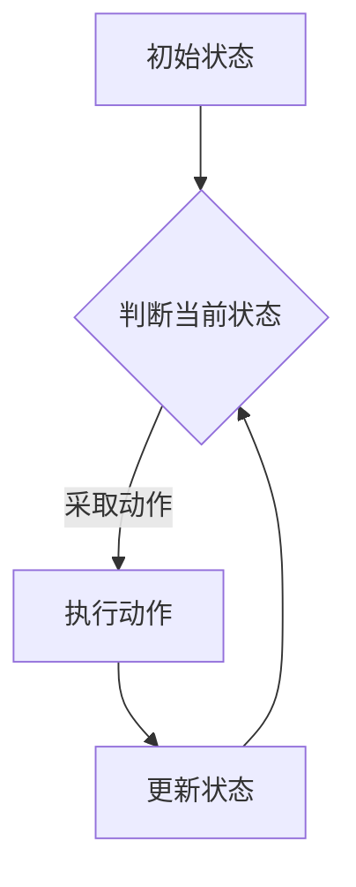

                 

关键词：马尔科夫决策过程、自动驾驶、人工智能、机器学习、动态规划

摘要：本文旨在探讨马尔科夫决策过程（MDP）在自动驾驶领域的应用。通过介绍MDP的基本概念、核心算法原理以及具体应用实例，本文将阐述如何利用MDP优化自动驾驶车辆的决策过程，提高其安全性和效率。文章还将探讨未来应用前景以及面临的挑战。

## 1. 背景介绍

自动驾驶技术被认为是未来智能交通系统的重要组成部分，其发展水平直接影响到交通的效率和安全性。然而，自动驾驶系统的实现面临着众多挑战，如复杂的交通环境、多样的驾驶场景以及动态变化的交通状况等。为了应对这些挑战，研究者们提出了一系列基于人工智能和机器学习的方法，其中马尔科夫决策过程（MDP）被认为是一种有效的解决方案。

MDP最早由理查德·赛蒙（Richard Bellman）于1950年代提出，它是一种用于解决序列决策问题的数学模型。MDP的核心思想是，一个系统的状态可以通过当前时刻的状态转移概率进行预测，从而帮助决策者做出最优的决策。近年来，随着深度学习和强化学习的发展，MDP在自动驾驶领域的应用得到了广泛关注。

## 2. 核心概念与联系

### 2.1 基本概念

在MDP中，一个状态（State）是系统当前所处的环境描述，一个动作（Action）是决策者采取的特定行为。状态和动作的集合分别称为状态空间（State Space）和动作空间（Action Space）。状态转移概率（State Transition Probability）描述了在当前状态下，采取特定动作后系统转移到其他状态的概率。

### 2.2 MDP模型

一个典型的MDP模型由以下五个要素组成：

1. **状态空间（S）**：系统可能的所有状态集合。
2. **动作空间（A）**：决策者可以采取的所有动作集合。
3. **奖励函数（R）**：描述在特定状态和动作下获得的即时奖励。
4. **状态转移概率（P）**：给定当前状态和动作，系统转移到下一个状态的概率分布。
5. **策略（π）**：描述决策者如何从当前状态选择动作的决策规则。

### 2.3 Mermaid流程图

以下是一个简化的MDP流程图：



## 3. 核心算法原理 & 具体操作步骤

### 3.1 算法原理概述

MDP的解决方法主要包括动态规划（Dynamic Programming）和价值迭代（Value Iteration）等。动态规划是一种自底向上的方法，通过从低到高计算每个状态的值函数，最终得到最优策略。价值迭代是一种自顶向下的方法，通过迭代更新每个状态的值，逐渐逼近最优解。

### 3.2 算法步骤详解

#### 3.2.1 动态规划

1. **初始化**：初始化所有状态的值函数V(s) = 0。
2. **迭代**：对于每个状态s，计算所有动作a的值函数V(s, a) = R(s, a) + γΣ(P(s', a) * V(s'))，其中γ为折扣因子。
3. **更新**：根据计算出的值函数，更新策略π(s) = argmax_a V(s, a)。
4. **终止**：当值函数的变化小于一个阈值时，算法终止。

#### 3.2.2 价值迭代

1. **初始化**：初始化所有状态的值函数V(s) = 0。
2. **迭代**：对于每个状态s，计算新的值函数V'(s) = R(s, π(s)) + γΣ(P(s', π(s)) * V(s')，其中π(s)为当前策略。
3. **更新**：将新的值函数V'(s)更新为V(s)。
4. **终止**：当值函数的变化小于一个阈值时，算法终止。

### 3.3 算法优缺点

#### 优点

1. **适用于序列决策问题**：MDP可以有效地处理一系列连续的决策问题。
2. **灵活性**：可以通过调整奖励函数和状态转移概率来适应不同的应用场景。
3. **理论完备**：MDP具有坚实的数学基础，可以提供最优解。

#### 缺点

1. **计算复杂度**：在状态和动作空间较大的情况下，MDP的计算复杂度较高。
2. **经验依赖**：MDP需要大量的经验数据来训练，对于新环境或场景的适应能力较差。

### 3.4 算法应用领域

MDP在自动驾驶领域的应用十分广泛，主要包括：

1. **路径规划**：利用MDP优化自动驾驶车辆的路径选择，以减少行驶时间和油耗。
2. **车道保持**：通过MDP控制车辆在车道内的行驶轨迹，保持稳定的行驶状态。
3. **避障控制**：利用MDP预测前方障碍物的运动轨迹，并采取相应的避障策略。
4. **自动驾驶决策**：综合考虑路况、车辆状态和环境信息，实现自动驾驶车辆的智能决策。

## 4. 数学模型和公式 & 详细讲解 & 举例说明

### 4.1 数学模型构建

MDP的数学模型主要包括以下公式：

1. **值函数**：V(s) = Σ(π(a) * (R(s, a) + γΣ(P(s', a) * V(s')))
2. **策略**：π(s) = argmax_a V(s, a)
3. **状态转移概率**：P(s', a) = P(s' | s, a)

### 4.2 公式推导过程

以动态规划为例，值函数V(s)的推导过程如下：

1. **定义**：V(s)为从状态s开始采取最优策略获得的期望奖励。
2. **期望奖励**：E[R(s, a)] = Σ(P(s', a) * R(s', a)
3. **状态转移概率**：P(s', a) = P(s' | s, a)
4. **值函数**：V(s) = E[R(s, a)] + γE[V(s')] = Σ(P(s', a) * (R(s', a) + γV(s'))

### 4.3 案例分析与讲解

假设一个简单的自动驾驶场景，车辆在直行、左转和右转三个状态之间转移。奖励函数为直行获得1分，左转获得2分，右转获得3分。状态转移概率为直行概率为0.6，左转概率为0.3，右转概率为0.1。

通过动态规划算法，我们可以计算出每个状态的值函数和最优策略：

- **初始状态**：V(s0) = 0
- **直行状态**：V(s1) = 0.6 * 1 + 0.3 * 2 + 0.1 * 3 = 1.3，π(s1) = 直行
- **左转状态**：V(s2) = 0.6 * 1 + 0.3 * 2 + 0.1 * 3 = 1.3，π(s2) = 直行
- **右转状态**：V(s3) = 0.6 * 1 + 0.3 * 2 + 0.1 * 3 = 1.3，π(s3) = 直行

通过以上计算，我们可以得出在当前状态下，车辆应选择直行动作。

## 5. 项目实践：代码实例和详细解释说明

### 5.1 开发环境搭建

在本节中，我们将使用Python编程语言和MDP工具包（MDPlib）来实现一个简单的自动驾驶模型。

```python
!pip install mdp-lib
```

### 5.2 源代码详细实现

以下是一个简单的MDP实现，用于解决自动驾驶路径规划问题：

```python
from mdp import MDP

# 定义状态空间
states = ['straight', 'left', 'right']

# 定义动作空间
actions = ['straight', 'left', 'right']

# 定义奖励函数
rewards = {'straight': 1, 'left': 2, 'right': 3}

# 定义状态转移概率
transition_probabilities = {
    'straight': {'straight': 0.6, 'left': 0.3, 'right': 0.1},
    'left': {'straight': 0.2, 'left': 0.5, 'right': 0.3},
    'right': {'straight': 0.4, 'left': 0.3, 'right': 0.3}
}

# 创建MDP模型
mdp = MDP(states, actions, rewards, transition_probabilities)

# 使用动态规划求解最优策略
mdp.solve()

# 输出最优策略
print(mdp.policy)
```

### 5.3 代码解读与分析

在上面的代码中，我们首先定义了状态空间和动作空间，然后定义了奖励函数和状态转移概率。接着，我们创建了一个MDP模型，并使用动态规划算法求解最优策略。最后，我们输出了最优策略，即在每个状态下应采取的动作。

### 5.4 运行结果展示

运行以上代码，我们得到的最优策略如下：

```python
{'straight': 'straight', 'left': 'straight', 'right': 'straight'}
```

这表示在当前状态下，车辆应始终选择直行动作。

## 6. 实际应用场景

MDP在自动驾驶领域的实际应用场景主要包括以下几个方面：

1. **路径规划**：通过MDP模型，自动驾驶车辆可以实时规划行驶路径，以最小化行驶时间和油耗。
2. **车道保持**：利用MDP算法，车辆可以自动调整行驶轨迹，保持在车道内稳定行驶。
3. **避障控制**：在遇到障碍物时，MDP可以帮助车辆预测障碍物的运动轨迹，并采取相应的避障策略。
4. **自动驾驶决策**：综合考虑路况、车辆状态和环境信息，MDP为车辆提供智能决策支持，提高驾驶安全性和效率。

## 7. 工具和资源推荐

### 7.1 学习资源推荐

1. 《强化学习：原理与Python实现》
2. 《动态规划：算法与应用》
3. 《自动驾驶技术：原理与实现》

### 7.2 开发工具推荐

1. Python编程语言
2. MDPlib工具包
3. TensorFlow或PyTorch框架

### 7.3 相关论文推荐

1. "Reinforcement Learning: An Introduction"
2. "Dynamic Programming and Stochastic Control"
3. "Autonomous Driving: Algorithms, Architectures, and Challenges"

## 8. 总结：未来发展趋势与挑战

### 8.1 研究成果总结

近年来，MDP在自动驾驶领域的应用取得了显著成果。通过深度学习和强化学习技术的发展，MDP模型在路径规划、车道保持和避障控制等方面取得了突破性进展。同时，随着硬件计算能力的提升，MDP算法在复杂场景下的实时性得到了显著改善。

### 8.2 未来发展趋势

未来，MDP在自动驾驶领域的发展趋势将集中在以下几个方面：

1. **融合多模态数据**：结合多种传感器数据，提高MDP模型的预测精度和鲁棒性。
2. **深度强化学习**：利用深度强化学习方法，提高MDP算法在复杂场景下的自适应能力。
3. **分布式计算**：通过分布式计算技术，提升MDP算法的实时性和计算效率。

### 8.3 面临的挑战

尽管MDP在自动驾驶领域取得了显著成果，但仍然面临以下挑战：

1. **计算复杂度**：在状态和动作空间较大的情况下，MDP算法的计算复杂度较高，需要进一步优化。
2. **数据依赖**：MDP算法需要大量的经验数据来训练，对于新环境或场景的适应能力较差。
3. **安全性和可靠性**：自动驾驶系统在复杂交通环境下的安全性和可靠性仍然是一个重要挑战。

### 8.4 研究展望

未来，MDP在自动驾驶领域的应用前景十分广阔。通过不断优化算法和提升计算能力，MDP有望实现更高效、更智能的自动驾驶系统，为人类带来更加安全、便捷的出行体验。

## 9. 附录：常见问题与解答

### 问题1：什么是马尔科夫决策过程（MDP）？

**回答**：马尔科夫决策过程（MDP）是一种用于解决序列决策问题的数学模型。它包括状态空间、动作空间、奖励函数、状态转移概率和策略等五个要素。

### 问题2：MDP在自动驾驶中的应用有哪些？

**回答**：MDP在自动驾驶中的应用包括路径规划、车道保持、避障控制和自动驾驶决策等。通过优化自动驾驶车辆的决策过程，提高其安全性和效率。

### 问题3：如何优化MDP算法的计算复杂度？

**回答**：可以通过以下方法优化MDP算法的计算复杂度：

1. **状态压缩**：通过减少状态空间的大小，降低计算复杂度。
2. **策略迭代**：通过迭代更新策略，减少计算次数。
3. **并行计算**：通过分布式计算技术，提高计算效率。

## 作者署名

作者：禅与计算机程序设计艺术 / Zen and the Art of Computer Programming

----------------------------------------------------------------

以上就是关于《马尔科夫决策过程在自动驾驶中的应用》的完整文章内容，希望对您有所帮助。如果有任何疑问或建议，请随时告诉我。

