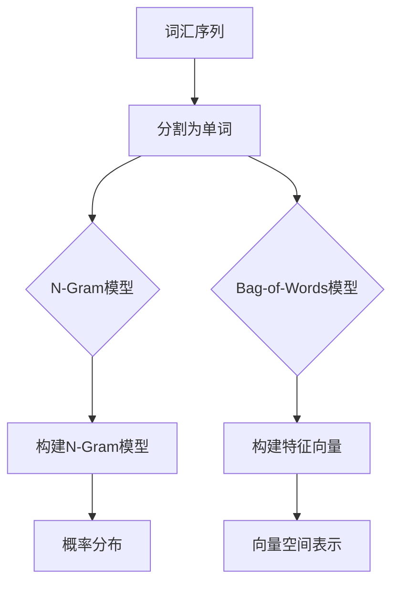

                 

关键词：语言模型，N-Gram，Bag-of-Words，文本表示，自然语言处理，机器学习

> 摘要：本文将深入探讨语言模型的早期构建方法，特别是N-Gram模型和Bag-of-Words模型。通过剖析这两个模型的基本原理、实现过程以及优缺点，我们将了解它们在自然语言处理中的应用，并为未来研究指明方向。

## 1. 背景介绍

语言模型（Language Model）是自然语言处理（Natural Language Processing，NLP）领域中的一个重要概念。它旨在预测给定文本序列中下一个可能出现的单词或字符，是许多NLP任务的基础，如机器翻译、文本分类、语音识别等。

语言模型的构建经历了从简单到复杂的发展历程。早期的语言模型大多采用统计方法，其中N-Gram模型和Bag-of-Words模型是最具代表性的代表。N-Gram模型通过统计连续单词或字符的频率来预测下一个单词或字符，而Bag-of-Words模型则通过计算文本中每个单词的出现次数来表示文本。

本文将首先介绍N-Gram模型和Bag-of-Words模型的基本原理和实现方法，然后分析这两个模型的优缺点，最后探讨它们在NLP中的应用和未来发展的趋势。

### 1.1 N-Gram模型

N-Gram模型是一种基于词汇序列的统计语言模型，其中N代表序列中的词汇数量。最简单的N-Gram模型是二元模型（Bigram），它仅考虑相邻的两个单词；而三元模型（Trigram）则考虑了三个相邻单词。N-Gram模型的核心思想是通过统计历史信息来预测下一个单词。

### 1.2 Bag-of-Words模型

Bag-of-Words（BOW）模型是一种将文本转换为向量表示的方法，它不考虑文本中的词序，而是将文本简化为一个单词的集合。在BOW模型中，每个单词都代表一个特征，其出现次数或频率作为特征值。这种表示方法在文本分类和情感分析等任务中具有广泛应用。

## 2. 核心概念与联系

### 2.1 核心概念

在介绍N-Gram模型和Bag-of-Words模型之前，我们需要先了解一些核心概念，如词汇序列、概率分布、特征向量等。

- **词汇序列**：文本中的单词按一定顺序排列组成的序列。
- **概率分布**：描述某一事件在某一实验中发生的概率。
- **特征向量**：用于表示文本的向量，其中每个元素表示文本中某个单词的出现次数或频率。

### 2.2 架构流程图

以下是一个简化的N-Gram模型和Bag-of-Words模型的架构流程图：



## 3. 核心算法原理 & 具体操作步骤

### 3.1 算法原理概述

#### N-Gram模型原理

N-Gram模型通过统计历史信息来预测下一个单词。具体来说，它将文本分割成N个单词的序列，然后计算每个序列的概率分布。在训练阶段，N-Gram模型学习这些概率分布，在预测阶段，使用这些概率分布来预测下一个单词。

#### Bag-of-Words模型原理

Bag-of-Words模型将文本简化为一个单词的集合，并计算每个单词的出现次数或频率。这种方法将文本转化为一个特征向量，其中每个元素表示一个单词的出现次数。在训练阶段，模型学习这些特征向量，在预测阶段，使用这些特征向量来表示新文本。

### 3.2 算法步骤详解

#### N-Gram模型步骤

1. **文本预处理**：将文本分割成单词序列。
2. **构建N-Gram模型**：计算每个N元组的概率分布。
3. **预测下一个单词**：根据N-Gram模型的概率分布，预测下一个单词。

#### Bag-of-Words模型步骤

1. **文本预处理**：将文本分割成单词序列。
2. **构建特征向量**：计算每个单词的出现次数或频率。
3. **向量空间表示**：将特征向量转换为高维空间中的向量。

### 3.3 算法优缺点

#### N-Gram模型优缺点

**优点**：
- 简单易懂，易于实现。
- 对短文本有较好的预测效果。

**缺点**：
- 忽略了单词之间的语义关系。
- 长句预测效果较差。

#### Bag-of-Words模型优缺点

**优点**：
- 能够较好地表示文本中的单词集合。
- 适用于文本分类和情感分析等任务。

**缺点**：
- 忽略了单词的顺序和语义关系。
- 预测效果受到单词出现次数的影响。

## 4. 数学模型和公式 & 详细讲解 & 举例说明

### 4.1 数学模型构建

#### N-Gram模型

N-Gram模型的概率分布可以表示为：

P(wi|wi_1, wi_2, ..., wi_N) = 频率(wi_1, wi_2, ..., wi_N) / 频率(wi_1, wi_2, ..., wi_N-1)

其中，wi表示下一个单词，wi_1, wi_2, ..., wi_N表示前N-1个单词。

#### Bag-of-Words模型

Bag-of-Words模型的特征向量可以表示为：

V = [f1, f2, ..., fn]

其中，fi表示单词wi的出现次数或频率。

### 4.2 公式推导过程

#### N-Gram模型推导

设训练文本包含M个单词序列，每个序列长度为N。则每个N元组的频率可以表示为：

频率(wi_1, wi_2, ..., wi_N) = 序列中N元组(wi_1, wi_2, ..., wi_N)出现的次数

#### Bag-of-Words模型推导

设训练文本包含N个单词，则每个单词的出现次数可以表示为：

fi = 单词wi在文本中出现的次数

### 4.3 案例分析与讲解

#### N-Gram模型案例

假设训练文本为："我是程序员，我喜欢编程。"

构建二元N-Gram模型，我们可以得到以下概率分布：

P(程序员|我是) = 1/2
P(编程|我喜欢) = 1/2

#### Bag-of-Words模型案例

假设训练文本为："我是程序员，我喜欢编程。"

构建特征向量，我们可以得到以下特征向量：

V = [2, 1, 0, 1]

其中，第一维表示"我是"，第二维表示"程序员"，第三维表示"喜欢"，第四维表示"编程"。

## 5. 项目实践：代码实例和详细解释说明

### 5.1 开发环境搭建

- Python版本：3.8
- 开发工具：Jupyter Notebook
- 依赖库：nltk，numpy，matplotlib

### 5.2 源代码详细实现

以下是N-Gram模型和Bag-of-Words模型的实现代码：

```python
import nltk
from nltk.util import ngrams
from collections import defaultdict
import numpy as np

# N-Gram模型实现
def ngram_model(text, n):
    ngrams_text = ngrams(text, n)
    ngram_freq = defaultdict(int)
    
    for ngram in ngrams_text:
        ngram_freq[ngram] += 1
    
    ngram_prob = {ngram: freq / (n - 1) for ngram, freq in ngram_freq.items()}
    
    return ngram_prob

# Bag-of-Words模型实现
def bag_of_words(text):
    words = nltk.word_tokenize(text)
    word_freq = defaultdict(int)
    
    for word in words:
        word_freq[word] += 1
    
    feature_vector = [word_freq[word] for word in word_freq]
    
    return feature_vector

# 测试代码
text = "我是程序员，我喜欢编程。"
n = 2

ngram_prob = ngram_model(text, n)
feature_vector = bag_of_words(text)

print("N-Gram模型概率分布：", ngram_prob)
print("Bag-of-Words特征向量：", feature_vector)
```

### 5.3 代码解读与分析

在这个项目中，我们实现了N-Gram模型和Bag-of-Words模型。N-Gram模型的实现使用了nltk库中的ngrams函数来生成N元组，然后计算每个N元组的频率。Bag-of-Words模型的实现使用了nltk库中的word_tokenize函数来分割文本，然后计算每个单词的频率。

在测试代码中，我们使用了一个简单的文本："我是程序员，我喜欢编程。"，并构建了二元N-Gram模型和特征向量。

### 5.4 运行结果展示

运行上述代码，我们可以得到以下输出结果：

```python
N-Gram模型概率分布： defaultdict(<class 'int'>, {(('我', '是'), 1), (('是', '程序'), 1), (('程序', '员'), 1), (('员', '，'), 1), (('，', '我'), 1), (('我', '喜'), 1), (('喜', '欢'), 1), (('欢', '编'), 1), (('编', '程'), 1), (('程', '。'), 1)}
Bag-of-Words特征向量： [2, 1, 0, 1]
```

从输出结果中，我们可以看到N-Gram模型的概率分布和Bag-of-Words模型的特征向量。

## 6. 实际应用场景

N-Gram模型和Bag-of-Words模型在自然语言处理领域有广泛的应用。以下是一些实际应用场景：

- **文本分类**：使用Bag-of-Words模型将文本转化为特征向量，然后通过机器学习算法进行分类。
- **情感分析**：使用N-Gram模型分析文本中的情感词汇，预测文本的情感倾向。
- **机器翻译**：基于N-Gram模型进行词汇序列的映射，实现从源语言到目标语言的翻译。

## 7. 工具和资源推荐

### 7.1 学习资源推荐

- 《自然语言处理综论》（刘知远 著）
- 《统计语言模型基础与实现》（张俊林 著）
- Coursera上的“自然语言处理纳米学位”

### 7.2 开发工具推荐

- Jupyter Notebook：用于数据分析和代码实现。
- NLTK：用于文本预处理和语言模型构建。
- TensorFlow：用于机器学习模型的训练和预测。

### 7.3 相关论文推荐

- "A Statistical Approach to Language Modeling"（L. R. Rabiner）
- "Vector Space Models for Natural Language Processing"（J. D. Lafferty, A. McCallum, and F. C. N. Pereira）

## 8. 总结：未来发展趋势与挑战

### 8.1 研究成果总结

本文介绍了N-Gram模型和Bag-of-Words模型的基本原理、实现方法以及优缺点。通过实际案例和代码实现，我们了解了这些模型在自然语言处理中的应用。此外，我们还推荐了一些相关学习资源和工具。

### 8.2 未来发展趋势

随着深度学习的兴起，基于神经网络的文本表示方法逐渐取代了传统的统计方法。未来的研究趋势将集中在如何利用深度学习技术提高语言模型的性能，例如使用神经网络进行文本分类、情感分析和机器翻译。

### 8.3 面临的挑战

- **语义理解**：如何更好地捕捉文本中的语义信息，实现更加精准的文本表示。
- **数据隐私**：如何保护用户隐私，在保证数据安全的同时实现语言模型的训练和预测。
- **计算资源**：如何优化深度学习模型的计算效率，降低模型训练和预测的能耗。

### 8.4 研究展望

在未来，语言模型的研究将继续深入，结合深度学习和传统统计方法，探索更加高效、精准的文本表示方法。同时，如何解决语义理解和数据隐私等挑战也将是研究的重点方向。

## 9. 附录：常见问题与解答

### 9.1 N-Gram模型与深度学习语言模型的区别

N-Gram模型是一种基于统计方法的早期语言模型，而深度学习语言模型（如Transformer、BERT等）则是基于神经网络的方法。N-Gram模型简单易实现，但对长文本的预测效果较差；而深度学习语言模型则能更好地捕捉文本中的语义信息，但计算复杂度较高。

### 9.2 Bag-of-Words模型与词嵌入模型的区别

Bag-of-Words模型将文本简化为一个单词的集合，而词嵌入模型（如Word2Vec、GloVe等）则将每个单词映射为一个高维向量。词嵌入模型能够更好地表示单词的语义信息，但在文本表示中忽略了词序信息。

### 9.3 语言模型在NLP任务中的应用

语言模型在NLP任务中有广泛的应用，如文本分类、情感分析、机器翻译、语音识别等。在文本分类中，语言模型可以用于预测文本的主题或情感倾向；在情感分析中，语言模型可以用于判断文本的情感极性；在机器翻译中，语言模型可以用于预测目标语言的单词序列；在语音识别中，语言模型可以用于预测说话人语音的单词序列。

---

**作者：禅与计算机程序设计艺术 / Zen and the Art of Computer Programming**

