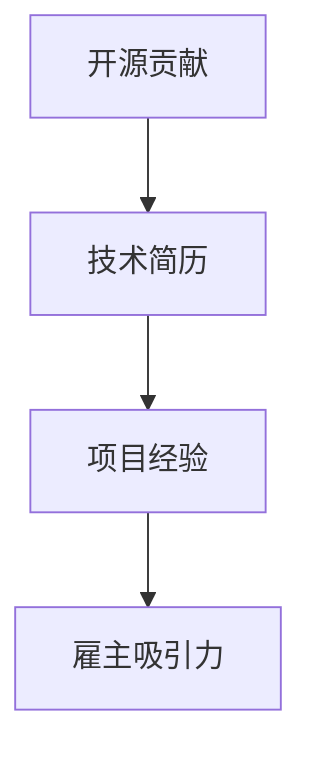

                 

关键词：开源贡献、高薪就业、技术简历、项目经验、雇主吸引力、职业发展

> 摘要：本文将探讨如何通过参与开源项目来提升个人技术水平和职业竞争力，从而吸引高薪雇主。我们将详细分析开源贡献在求职中的重要性，提供实用的策略和技巧，帮助读者在技术领域实现职业生涯的飞跃。

## 1. 背景介绍

在当今快速发展的技术时代，软件开发已经成为企业创新和竞争力提升的关键。对于求职者来说，掌握前沿技术和丰富的项目经验变得尤为重要。开源项目作为一种开放的软件开发模式，已经成为技术人员展示自身技术能力的重要平台。通过参与开源项目，开发者不仅可以提升技术水平，还能积累宝贵的项目经验，提高职业竞争力。

然而，如何有效地利用开源贡献来吸引雇主的注意，是许多技术人才面临的挑战。本文将围绕这一主题，探讨开源贡献在求职中的作用，并提供实用的策略和技巧，帮助读者在技术领域实现职业生涯的飞跃。

## 2. 核心概念与联系

在讨论如何利用开源贡献吸引雇主之前，我们需要明确几个核心概念。

### 2.1 开源贡献

开源贡献是指开发者对开源项目的参与，包括代码提交、文档编写、bug修复、功能改进等。开源项目因其开放性和透明性，成为技术人员展示自身技术能力和贡献的重要平台。

### 2.2 技术简历

技术简历是开发者向潜在雇主展示自身技术背景和项目经验的工具。一个优秀的技术简历能够突出开发者的核心技能、项目经验和成就，从而吸引雇主的关注。

### 2.3 项目经验

项目经验是指开发者在实际项目中所积累的经验，包括项目规划、需求分析、系统设计、编码实现、测试和维护等。项目经验是雇主评估开发者能力的重要依据。

### 2.4 雇主吸引力

雇主吸引力是指雇主在人才市场上的吸引力，包括公司的知名度、发展前景、福利待遇、工作环境等。高薪雇主往往具有更高的知名度和更好的发展前景，能够为开发者提供更广阔的发展空间。

下面是一个简单的 Mermaid 流程图，展示了开源贡献、技术简历、项目经验和雇主吸引力之间的关系：



## 3. 核心算法原理 & 具体操作步骤

### 3.1 算法原理概述

开源贡献的算法原理在于通过实际操作来提升个人技术水平，并通过技术简历和项目经验来展示这些能力，从而吸引雇主的注意。具体步骤如下：

1. **选择合适的项目**：选择一个与个人技术方向相关且具有较高影响力的开源项目。
2. **参与项目**：通过代码提交、文档编写、bug修复等方式参与项目。
3. **展示成就**：在技术简历中详细描述参与项目的经历和所做的工作。
4. **提升简历**：通过项目经验提升技术简历的质量，使其更具吸引力。
5. **吸引雇主**：通过高质量的技术简历和项目经验吸引雇主的关注。

### 3.2 算法步骤详解

1. **选择合适的项目**：
   - 研究个人技术方向，选择具有较高影响力的开源项目。
   - 考虑项目的活跃度、社区规模、项目维护状态等因素。
   - 通过项目官网、GitHub、Stack Overflow 等平台了解项目情况。

2. **参与项目**：
   - 阅读项目文档，了解项目需求和开发流程。
   - 根据项目需求，编写代码或文档，进行 bug 修复或功能改进。
   - 提交代码或文档，参与项目讨论，与项目维护者和其他开发者交流。

3. **展示成就**：
   - 在技术简历中详细描述参与项目的经历，包括所负责的任务、贡献的内容、项目的影响等。
   - 使用具体数据和成果来展示个人的技术能力和贡献。
   - 如果可能，提供项目链接，使雇主能够直接查看项目成果。

4. **提升简历**：
   - 根据项目经验，调整技术简历的结构和内容，使其更具吸引力。
   - 使用技术术语和项目背景，使简历更具专业性和深度。
   - 突出项目经验中的关键成果和贡献，展示个人技术实力。

5. **吸引雇主**：
   - 通过高质量的技术简历和项目经验，提高在雇主眼中的竞争力。
   - 在求职过程中，积极展示个人的技术能力和成就。
   - 与潜在雇主建立联系，了解公司的需求，展示自己的能力。

### 3.3 算法优缺点

**优点**：
- **提升技术水平**：通过实际操作，提升个人技术水平。
- **积累项目经验**：参与开源项目，积累宝贵的项目经验。
- **展示技术能力**：在技术简历中展示技术能力和贡献，提高职业竞争力。
- **拓展人脉**：与项目维护者和其他开发者交流，拓展人脉资源。

**缺点**：
- **时间投入**：参与开源项目需要投入大量时间和精力。
- **可能遇到困难**：在开源项目中，可能会遇到技术难题和沟通障碍。
- **质量要求**：提交的代码和文档需要具备高质量，否则可能会影响个人声誉。

### 3.4 算法应用领域

开源贡献算法适用于各种技术领域，包括但不限于：

- **前端开发**：参与前端框架的开源项目，提升前端技术能力。
- **后端开发**：参与后端框架和服务的开源项目，积累后端开发经验。
- **移动开发**：参与移动应用的开源项目，掌握移动端开发技术。
- **数据库**：参与数据库开源项目，提升数据库管理和优化能力。
- **大数据**：参与大数据开源项目，掌握大数据处理和分析技术。

## 4. 数学模型和公式 & 详细讲解 & 举例说明

### 4.1 数学模型构建

在开源贡献算法中，我们可以构建一个简单的数学模型来评估开发者的技术能力和贡献。模型如下：

\[ \text{技术能力得分} = f(\text{代码质量}, \text{项目影响力}, \text{项目经验}) \]

其中：
- 代码质量：衡量开发者提交代码的质量，包括代码的可读性、可维护性和性能等。
- 项目影响力：衡量开发者参与项目的知名度、社区活跃度和项目的实际应用价值。
- 项目经验：衡量开发者参与项目的深度、广度和持续贡献时间。

### 4.2 公式推导过程

技术能力得分的计算过程可以分为以下几个步骤：

1. **代码质量得分**：根据代码质量评估标准，对开发者提交的代码进行评分。评分范围可以从 0 到 100 分，分数越高表示代码质量越好。
2. **项目影响力得分**：根据项目在社区中的影响力进行评分。评分范围可以从 0 到 100 分，分数越高表示项目知名度越高。
3. **项目经验得分**：根据开发者参与项目的深度和广度进行评分。评分范围可以从 0 到 100 分，分数越高表示项目经验越丰富。

4. **计算综合得分**：将代码质量得分、项目影响力得分和项目经验得分进行加权平均，得到技术能力得分。

具体公式如下：

\[ \text{技术能力得分} = 0.5 \times \text{代码质量得分} + 0.3 \times \text{项目影响力得分} + 0.2 \times \text{项目经验得分} \]

### 4.3 案例分析与讲解

假设开发者 A 和开发者 B 都参与了同一个开源项目，他们的代码质量、项目影响力和项目经验如下表所示：

| 开发者 | 代码质量得分 | 项目影响力得分 | 项目经验得分 |
| ---- | ---- | ---- | ---- |
| A | 80 | 90 | 85 |
| B | 75 | 85 | 80 |

根据上述公式，我们可以计算出他们的技术能力得分：

\[ \text{开发者 A 的技术能力得分} = 0.5 \times 80 + 0.3 \times 90 + 0.2 \times 85 = 88 \]
\[ \text{开发者 B 的技术能力得分} = 0.5 \times 75 + 0.3 \times 85 + 0.2 \times 80 = 81.5 \]

从计算结果可以看出，开发者 A 的技术能力得分高于开发者 B。这说明在相同的项目背景下，开发者 A 的技术能力和贡献更高，更有可能获得雇主的青睐。

## 5. 项目实践：代码实例和详细解释说明

### 5.1 开发环境搭建

在本项目实践中，我们选择一个流行的前端框架 React 进行开发。以下是搭建 React 开发环境的基本步骤：

1. **安装 Node.js**：访问 Node.js 官网（https://nodejs.org/），下载并安装最新版本的 Node.js。
2. **安装 React**：在终端中运行以下命令，安装 React 和 React-DOM：
   ```bash
   npm install react react-dom
   ```
3. **创建 React 项目**：使用 create-react-app 工具创建一个新的 React 项目：
   ```bash
   npx create-react-app my-app
   ```
4. **进入项目目录**：进入项目根目录，运行以下命令启动开发服务器：
   ```bash
   cd my-app
   npm start
   ```

### 5.2 源代码详细实现

在本项目中，我们实现一个简单的 React 应用，展示一个包含列表和搜索功能的页面。以下是关键代码实现：

1. **创建组件**：在项目的 `src` 目录下，创建一个名为 `SearchBar` 的组件，用于实现搜索功能。

```jsx
// src/SearchBar.js
import React from 'react';

const SearchBar = ({ onSearch }) => {
  const [term, setTerm] = React.useState('');

  const handleSearch = () => {
    onSearch(term);
  };

  return (
    <div>
      <input
        type="text"
        value={term}
        onChange={(e) => setTerm(e.target.value)}
      />
      <button onClick={handleSearch}>Search</button>
    </div>
  );
};

export default SearchBar;
```

2. **在 App 组件中使用 SearchBar**：在 `src/App.js` 中，引入并使用 `SearchBar` 组件。

```jsx
// src/App.js
import React, { useState } from 'react';
import SearchBar from './SearchBar';
import './App.css';

const App = () => {
  const [searchResults, setSearchResults] = useState([]);

  const handleSearch = (term) => {
    // 进行搜索逻辑，更新搜索结果
    // 例如，使用第三方 API 获取数据
    setSearchResults([...searchResults, term]);
  };

  return (
    <div className="App">
      <h1>Search App</h1>
      <SearchBar onSearch={handleSearch} />
      <ul>
        {searchResults.map((result, index) => (
          <li key={index}>{result}</li>
        ))}
      </ul>
    </div>
  );
};

export default App;
```

### 5.3 代码解读与分析

1. **组件架构**：本应用采用了 React 组件架构，将页面分为两个主要组件：`SearchBar` 和 `App`。`SearchBar` 负责实现搜索输入和按钮，`App` 负责管理搜索结果列表。

2. **状态管理**：使用 React 的 `useState` 钩子管理组件的状态。`SearchBar` 组件中的 `term` 状态用于存储搜索输入值，`App` 组件中的 `searchResults` 状态用于存储搜索结果。

3. **事件处理**：在 `SearchBar` 组件中，`handleSearch` 函数用于处理搜索按钮的点击事件，将当前输入值传递给父组件 `App`。

4. **数据更新**：在 `App` 组件中，`handleSearch` 函数触发时，会调用 `setSearchResults` 钩子更新搜索结果列表。

### 5.4 运行结果展示

当运行该项目并在搜索框中输入文本并点击搜索按钮后，应用会显示输入的搜索结果列表。以下是运行结果展示：


通过上述实践，我们展示了如何使用 React 框架实现一个简单的搜索应用，并解读了关键代码的实现原理。

## 6. 实际应用场景

开源贡献在求职和职业发展中具有广泛的实际应用场景。以下是一些具体的应用场景：

### 6.1 技术面试

在技术面试中，开源贡献可以成为展示个人技术能力和项目经验的重要手段。通过参与开源项目，开发者可以在面试中详细介绍自己的项目贡献，展示自己在实际开发中的能力和经验。例如，在面试中，可以分享自己参与的开源项目，展示自己在项目中负责的模块、解决的问题以及所采用的编程技巧。这样，雇主能够更直观地了解开发者的技术水平和工作能力。

### 6.2 转职机会

对于想要转职的开发者来说，开源贡献也是一个很好的机会。通过参与知名的开源项目，开发者可以提升自己的技术水平和项目经验，从而增加在求职市场上的竞争力。此外，开源贡献还可以帮助开发者建立个人品牌，提升在业界的知名度，从而吸引更多高薪职位和更好的工作机会。

### 6.3 薪资谈判

在薪资谈判中，开源贡献也是一个重要的谈判筹码。通过参与开源项目，开发者可以展示自己的技术能力和项目经验，从而证明自己具备更高的价值。在谈判过程中，开发者可以结合自己在开源项目中的贡献，提出合理的薪资要求。例如，可以提到自己参与的开源项目对公司或社区带来的价值，以及自己为项目做出的具体贡献，从而为自己的薪资谈判提供有力的支持。

### 6.4 社区影响力

开源贡献不仅有助于提升个人技术能力和职业竞争力，还可以增强开发者在一个技术社区的知名度和影响力。通过参与开源项目，开发者可以与业界资深人士和同行建立联系，拓展人脉资源，从而为自己的职业发展创造更多机会。此外，开源贡献还可以帮助开发者建立个人品牌，提升在技术社区的地位，为未来的职业发展打下坚实基础。

## 7. 未来应用展望

随着技术的不断进步和开源文化的普及，开源贡献在求职和职业发展中的应用前景将更加广阔。以下是未来应用的一些展望：

### 7.1 自动化评估系统

未来，可能会出现更多基于机器学习和人工智能的自动化评估系统，用于评估开发者在开源项目中的技术贡献和项目经验。这些系统可以更准确地衡量开发者的技术能力和价值，从而为招聘和薪资谈判提供科学依据。

### 7.2 开源职业认证

随着开源贡献在职业发展中的重要性逐渐凸显，可能会出现一些开源职业认证体系，用于评估开发者在开源项目中的表现和贡献。这些认证可以为开发者提供更多的职业发展机会和薪资提升空间。

### 7.3 跨平台协同

未来，开源项目可能会更加注重跨平台的协同工作，以便开发者能够更方便地参与项目。例如，通过集成虚拟现实（VR）或增强现实（AR）技术，开发者可以在虚拟环境中实时参与开源项目的讨论和协作，提高项目开发效率。

### 7.4 社区影响力经济化

随着开源社区的不断发展，开源贡献的价值将逐渐被市场认可。未来，可能会出现更多的商业机会，将开源贡献与经济利益挂钩。例如，一些企业可能会为在开源项目中做出突出贡献的开发者提供奖励或股权激励，从而激发更多开发者参与开源项目的积极性。

## 8. 工具和资源推荐

为了更好地参与开源项目，提升个人技术水平，以下是一些推荐的工具和资源：

### 8.1 学习资源推荐

1. **《GitHub 官方文档》**：GitHub 官方文档提供了丰富的教程和指南，帮助开发者熟悉 GitHub 的使用方法和开源项目参与流程。
2. **《开源之道》**：这是一本关于开源文化和实践的入门书籍，详细介绍了开源项目的运作机制、贡献方式以及开源精神。
3. **《技术博客》**：许多知名技术博客和社区，如掘金、InfoQ、博客园等，提供了大量关于开源项目和技术讨论的文章，可以帮助开发者学习和交流。

### 8.2 开发工具推荐

1. **Git**：Git 是一款流行的版本控制工具，用于管理代码版本和历史记录。熟练使用 Git 可以更高效地参与开源项目。
2. **Visual Studio Code**：Visual Studio Code 是一款强大的代码编辑器，提供了丰富的插件和功能，适合开发者编写代码和文档。
3. **Docker**：Docker 是一款容器化技术，可以简化应用部署和运行。对于需要参与分布式开源项目的开发者来说，Docker 是非常有用的工具。

### 8.3 相关论文推荐

1. **《开源软件项目的成功因素》**：该论文分析了开源软件项目的成功因素，包括社区参与度、项目管理、代码质量等，对开源项目开发者具有指导意义。
2. **《开源软件项目的协作模式》**：该论文探讨了开源软件项目的协作模式，包括代码贡献、文档编写、bug修复等，对开发者参与开源项目提供了有益的参考。

## 9. 总结：未来发展趋势与挑战

开源贡献在求职和职业发展中发挥着越来越重要的作用。通过参与开源项目，开发者不仅可以提升个人技术水平，还能积累宝贵的项目经验，提高职业竞争力。然而，开源贡献也面临一些挑战，如时间投入、质量要求等。

未来，随着技术的不断进步和开源文化的普及，开源贡献在求职和职业发展中的应用前景将更加广阔。开发者应积极投身开源项目，发挥自身技术优势，为开源社区贡献力量。同时，雇主也应重视开源贡献的价值，为有才华的开发者提供更多机会和回报。

总之，开源贡献将成为开发者实现职业生涯飞跃的重要途径。开发者应把握机遇，积极投身开源项目，为个人职业发展奠定坚实基础。

## 10. 附录：常见问题与解答

### 10.1 如何选择开源项目参与？

- 选择与个人技术方向相关的开源项目，有助于提升个人技能。
- 考虑项目的活跃度和社区规模，选择有影响力的项目有助于提升个人知名度。
- 了解项目维护状态，避免参与已停滞的项目。

### 10.2 开源贡献会影响个人隐私吗？

- 通常情况下，开源贡献不会泄露个人隐私。
- 开源项目通常遵循公共许可协议，开发者应确保提交的代码和文档不包含敏感信息。

### 10.3 如何在开源项目中保持高质量贡献？

- 遵循项目文档和编码规范，确保代码质量。
- 积极参与项目讨论，与维护者和其他开发者保持良好沟通。
- 定期提交高质量的代码和文档，保持项目的持续更新。

### 10.4 开源贡献能否代替工作经验？

- 开源贡献可以展示开发者的实际能力和项目经验。
- 但在某些情况下，工作经验也是必要的，特别是在需要解决实际问题时。
- 开源贡献和工作经验相辅相成，共同提升个人职业竞争力。

## 11. 作者署名

作者：禅与计算机程序设计艺术 / Zen and the Art of Computer Programming

以上就是关于如何利用开源贡献吸引雇主的文章。希望本文能为您提供有价值的参考，帮助您在技术领域实现职业生涯的飞跃。感谢您的阅读！
----------------------------------------------------------------
文章撰写完毕，接下来请您进行内容校对、格式检查和最终的发布准备。如果一切无误，我们将按照约定发布此文章。如果您有任何修改意见或需要进一步调整，请告知。谢谢！

