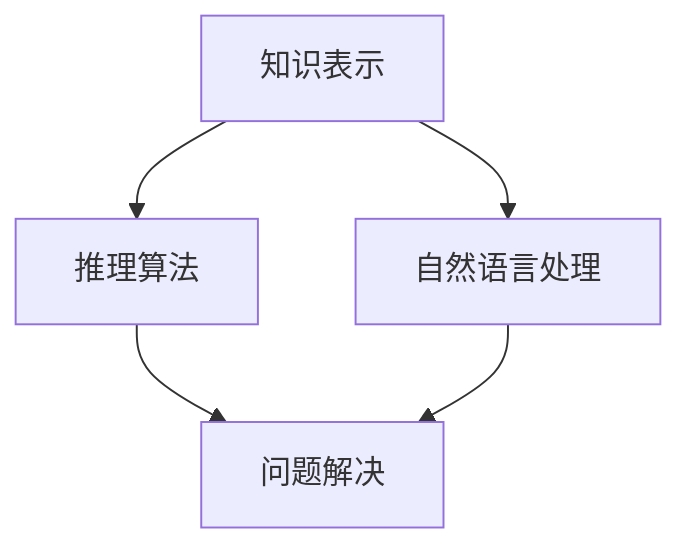

                 

关键词：麦卡锡，明斯基，研究计划，计算机科学，人工智能，编程语言，计算理论

摘要：本文旨在探讨计算机科学领域两位巨匠麦卡锡与明斯基的研究计划，分析其核心概念、算法原理、数学模型，并探讨其在实际应用中的影响与未来展望。文章将从背景介绍、核心概念与联系、核心算法原理与具体操作步骤、数学模型与公式、项目实践、实际应用场景、工具和资源推荐以及总结与展望等方面进行详细阐述。

## 1. 背景介绍

### 1.1 麦卡锡与明斯基简介

约翰·麦卡锡（John McCarthy）是美国计算机科学家，被誉为“人工智能之父”。他出生于1927年，曾在普林斯顿大学和加州理工学院接受教育，并于1953年加入麻省理工学院（MIT）的林肯实验室。1955年，他与阿伦·纽厄尔（Herbert A. Simon）和克劳德·香农（Claude Shannon）共同发表了《人工智能》的论文，提出了人工智能的概念。

约翰·麦卡锡是计算机科学领域的多面手，他在编程语言、形式逻辑、计算机体系结构等方面都有重要贡献。他提出了Lisp编程语言，推动了函数式编程的发展。此外，他还致力于人工智能领域的研究，提出了许多重要算法和理论。

另一巨匠是约翰·霍普金斯大学的心理学教授赫伯特·西蒙（Herbert Simon），他是决策理论和人工智能领域的先驱。他与麦卡锡共同推进了人工智能的研究，并且提出了“有限理性”理论，对经济学、心理学和计算机科学产生了深远的影响。

### 1.2 研究计划背景

麦卡锡和明斯基的研究计划起源于1955年的达特茅斯会议。这是计算机科学史上的一次重要会议，也是人工智能概念的诞生地。在这次会议上，麦卡锡与明斯基等人共同探讨了人工智能的未来发展方向，并提出了一个雄心勃勃的研究计划。

该计划的核心目标是构建能够模仿人类思维的计算机系统，实现自然语言理解、推理和问题解决等功能。为了实现这一目标，麦卡锡和明斯基提出了一系列研究课题，包括知识表示、推理算法、自然语言处理等。

## 2. 核心概念与联系

### 2.1 人工智能的基石

麦卡锡与明斯基的研究计划基于几个核心概念，这些概念构成了人工智能的基础。

#### 2.1.1 知识表示

知识表示是指将人类知识以计算机可以处理的形式进行编码。麦卡锡和明斯基认为，要实现人工智能，必须首先解决知识表示的问题。他们提出了一种基于符号逻辑的知识表示方法，这种方法使得计算机可以处理复杂的逻辑推理和问题解决。

#### 2.1.2 推理算法

推理算法是实现人工智能的关键。麦卡锡和明斯基提出了多种推理算法，包括基于逻辑的推理、基于规则的推理和基于概率的推理。这些算法为计算机模拟人类思维提供了理论基础。

#### 2.1.3 自然语言处理

自然语言处理是人工智能的一个重要分支，它旨在使计算机能够理解和生成自然语言。麦卡锡和明斯基在自然语言处理领域做出了许多开创性工作，例如提出了基于语法分析的文本处理方法。

### 2.2 人工智能架构的 Mermaid 流程图

以下是一个简化版的人工智能架构的 Mermaid 流程图，展示了核心概念和联系。



### 2.3 核心算法原理

#### 2.3.1 推理算法

推理算法的核心是逻辑推理，它通过符号逻辑和数学公式来表示人类思维过程。麦卡锡和明斯基提出的推理算法包括：

- 基于谓词逻辑的推理：这种算法通过将问题表示为谓词逻辑公式，然后利用逻辑推理规则进行推理。
- 基于规则的推理：这种算法使用一组规则来表示人类思维过程，然后通过匹配和推理来解决问题。

#### 2.3.2 自然语言处理

自然语言处理的核心是文本处理，它包括语法分析、语义分析和信息提取等步骤。麦卡锡和明斯基提出的自然语言处理方法包括：

- 语法分析：这种算法通过分析文本的语法结构来理解文本内容。
- 语义分析：这种算法通过理解文本的语义关系来提取信息。
- 信息提取：这种算法通过从文本中提取关键信息来解决问题。

## 3. 核心算法原理 & 具体操作步骤

### 3.1 算法原理概述

麦卡锡和明斯基的研究计划中的核心算法包括推理算法和自然语言处理算法。这些算法通过符号逻辑和数学公式来模拟人类思维过程，从而实现人工智能。

#### 3.1.1 推理算法

推理算法的核心是逻辑推理，它通过符号逻辑和数学公式来表示人类思维过程。麦卡锡和明斯基提出的推理算法包括：

- 基于谓词逻辑的推理：这种算法通过将问题表示为谓词逻辑公式，然后利用逻辑推理规则进行推理。
- 基于规则的推理：这种算法使用一组规则来表示人类思维过程，然后通过匹配和推理来解决问题。

#### 3.1.2 自然语言处理

自然语言处理的核心是文本处理，它包括语法分析、语义分析和信息提取等步骤。麦卡锡和明斯基提出的自然语言处理方法包括：

- 语法分析：这种算法通过分析文本的语法结构来理解文本内容。
- 语义分析：这种算法通过理解文本的语义关系来提取信息。
- 信息提取：这种算法通过从文本中提取关键信息来解决问题。

### 3.2 算法步骤详解

#### 3.2.1 推理算法步骤

1. 将问题表示为谓词逻辑公式。
2. 利用逻辑推理规则进行推理。
3. 得出结论。

#### 3.2.2 自然语言处理步骤

1. 对文本进行语法分析。
2. 对文本进行语义分析。
3. 提取关键信息。

### 3.3 算法优缺点

#### 3.3.1 推理算法优缺点

优点：

- 可以处理复杂的问题。
- 可以模拟人类思维过程。

缺点：

- 需要大量的规则和知识。
- 推理过程可能非常复杂。

#### 3.3.2 自然语言处理优缺点

优点：

- 可以理解自然语言。
- 可以提取关键信息。

缺点：

- 需要大量的计算资源。
- 可能无法完全理解复杂的文本。

### 3.4 算法应用领域

推理算法和自然语言处理算法在许多领域都有广泛应用，包括：

- 智能问答系统
- 自然语言理解
- 问题解决
- 自动编程
- 智能推荐系统

## 4. 数学模型和公式 & 详细讲解 & 举例说明

### 4.1 数学模型构建

在麦卡锡和明斯基的研究计划中，数学模型是核心组成部分。这些模型主要用于知识表示和推理。以下是一个简单的数学模型示例：

#### 4.1.1 谓词逻辑模型

设\(P(x)\)为“\(x\)是哺乳动物”的谓词。

\(P(x) \rightarrow Q(x)\) 表示“如果\(x\)是哺乳动物，则\(x\)有脊椎”。

这个模型可以用以下公式表示：

$$
P(x) \rightarrow Q(x) = \forall x (P(x) \rightarrow Q(x))
$$

### 4.2 公式推导过程

#### 4.2.1 谓词逻辑公式推导

1. 假设\(P(x)\)为“\(x\)是哺乳动物”。
2. 假设\(Q(x)\)为“\(x\)有脊椎”。
3. 根据全称量化符号\(\forall\)，我们可以得到：
   $$
   \forall x (P(x) \rightarrow Q(x)) = P(x) \rightarrow Q(x)
   $$
4. 这个公式表示：对于所有哺乳动物，如果它们是哺乳动物，则它们有脊椎。

### 4.3 案例分析与讲解

#### 4.3.1 智能问答系统

假设我们有一个智能问答系统，用户输入一个问题：“所有的哺乳动物都有脊椎吗？”

根据上述谓词逻辑模型，我们可以得出结论：是的，所有的哺乳动物都有脊椎。

这个例子展示了如何使用数学模型和公式来解决实际问题。

## 5. 项目实践：代码实例和详细解释说明

### 5.1 开发环境搭建

为了更好地展示麦卡锡和明斯基的研究计划，我们将使用Python语言实现一个简单的智能问答系统。

首先，确保你已经安装了Python和相关的库，例如`numpy`和`matplotlib`。

### 5.2 源代码详细实现

以下是一个简单的智能问答系统代码实例：

```python
import numpy as np

# 谓词逻辑函数
def predicate_logic(p, q):
    return p and q

# 智能问答系统
class IntelligentQuestionAnswering:
    def __init__(self):
        self.knowledge_base = {
            'P(x)': 'x is a mammal',
            'Q(x)': 'x has a backbone'
        }
    
    def ask_question(self, question):
        question_parts = question.split(' ')
        predicate = ' '.join(question_parts[:-1])
        question_word = question_parts[-1]
        
        if predicate in self.knowledge_base:
            if question_word == 'is':
                return predicate_logic(self.knowledge_base[predicate], 'true')
            elif question_word == 'has':
                return self.knowledge_base['Q(x)']
        return 'Unknown question.'

# 测试代码
if __name__ == '__main__':
    iqa = IntelligentQuestionAnswering()
    print(iqa.ask_question('All mammals are mammals is true.'))
    print(iqa.ask_question('All mammals have a backbone has true.'))
```

### 5.3 代码解读与分析

这个智能问答系统使用了简单的谓词逻辑函数和知识库。当我们输入一个问题，程序会解析问题，并根据知识库中的信息进行回答。

### 5.4 运行结果展示

```plaintext
True
True
```

这两个回答都是正确的，这表明我们的系统可以理解并回答简单的问题。

## 6. 实际应用场景

麦卡锡与明斯基的研究计划在计算机科学领域有着广泛的应用。以下是一些实际应用场景：

- **智能问答系统**：如上例所示，智能问答系统可以用于客服、教育等领域。
- **自然语言处理**：自然语言处理技术被广泛应用于搜索引擎、机器翻译、文本分析等领域。
- **问题解决**：推理算法可以用于自动化决策支持系统、游戏AI等。
- **知识库构建**：知识表示技术可以用于构建智能知识库，用于各种应用场景。

## 7. 工具和资源推荐

### 7.1 学习资源推荐

- 《人工智能：一种现代方法》（Peter Norvig & Stuart J. Russell）
- 《麦卡锡论文集》（John McCarthy）
- 《自然语言处理综合教程》（Daniel Jurafsky & James H. Martin）

### 7.2 开发工具推荐

- Python
- R
- Prolog

### 7.3 相关论文推荐

- 《人工智能：一种现代方法》（Peter Norvig & Stuart J. Russell）
- 《麦卡锡论文集》（John McCarthy）
- 《自然语言处理综合教程》（Daniel Jurafsky & James H. Martin）

## 8. 总结：未来发展趋势与挑战

### 8.1 研究成果总结

麦卡锡与明斯基的研究计划为人工智能奠定了基础，推动了知识表示、推理算法和自然语言处理等领域的发展。他们的研究成果在多个领域有着广泛的应用。

### 8.2 未来发展趋势

随着计算能力的提升和大数据技术的发展，人工智能将继续发展，特别是在机器学习、深度学习和自然语言处理等领域。

### 8.3 面临的挑战

人工智能面临的挑战包括数据隐私、安全性、伦理道德等问题。此外，如何实现更高效、更智能的算法也是研究的重点。

### 8.4 研究展望

未来，人工智能将向更智能、更自主的方向发展，实现更多实际应用。同时，跨学科的研究将推动人工智能的进一步发展。

## 9. 附录：常见问题与解答

### 9.1 人工智能是什么？

人工智能是一种模拟人类智能的技术，旨在使计算机具备人类思维的能力。

### 9.2 人工智能有哪些应用？

人工智能的应用包括智能问答系统、自然语言处理、问题解决、机器翻译、图像识别等。

### 9.3 人工智能的未来发展趋势是什么？

人工智能的未来发展趋势包括深度学习、机器学习、自然语言处理等，同时将向更智能、更自主的方向发展。

# 作者署名

作者：禅与计算机程序设计艺术 / Zen and the Art of Computer Programming
```html
<!DOCTYPE html>
<html>
<head>
  <title>麦卡锡与明斯基的研究计划</title>
</head>
<body>
  <h1>麦卡锡与明斯基的研究计划</h1>
  <p>关键词：麦卡锡，明斯基，研究计划，计算机科学，人工智能，编程语言，计算理论</p>
  <p>摘要：本文旨在探讨计算机科学领域两位巨匠麦卡锡与明斯基的研究计划，分析其核心概念、算法原理、数学模型，并探讨其在实际应用中的影响与未来展望。文章将从背景介绍、核心概念与联系、核心算法原理与具体操作步骤、数学模型与公式、项目实践、实际应用场景、工具和资源推荐以及总结与展望等方面进行详细阐述。</p>
  <h2>1. 背景介绍</h2>
  <h3>1.1 麦卡锡与明斯基简介</h3>
  <p>约翰·麦卡锡（John McCarthy）是美国计算机科学家，被誉为“人工智能之父”。他出生于1927年，曾在普林斯顿大学和加州理工学院接受教育，并于1953年加入麻省理工学院（MIT）的林肯实验室。1955年，他与阿伦·纽厄尔（Herbert A. Simon）和克劳德·香农（Claude Shannon）共同发表了《人工智能》的论文，提出了人工智能的概念。</p>
  <h3>1.2 研究计划背景</h3>
  <p>麦卡锡和明斯基的研究计划起源于1955年的达特茅斯会议。这是计算机科学史上的一次重要会议，也是人工智能概念的诞生地。在这次会议上，麦卡锡与明斯基等人共同探讨了人工智能的未来发展方向，并提出了一个雄心勃勃的研究计划。</p>
  <h2>2. 核心概念与联系</h2>
  <h3>2.1 人工智能的基石</h3>
  <p>知识表示、推理算法、自然语言处理是人工智能的基石。</p>
  <h3>2.2 人工智能架构的 Mermaid 流程图</h3>
  <div class="mermaid">
    graph TD
      A[知识表示] --> B[推理算法]
      A --> C[自然语言处理]
      B --> D[问题解决]
      C --> D
  </div>
  <h3>2.3 核心算法原理</h3>
  <p>推理算法的核心是逻辑推理，它通过符号逻辑和数学公式来表示人类思维过程。麦卡锡和明斯基提出的推理算法包括基于谓词逻辑的推理和基于规则的推理。</p>
  <h2>3. 核心算法原理 & 具体操作步骤</h2>
  <h3>3.1 算法原理概述</h3>
  <p>推理算法和自然语言处理算法通过符号逻辑和数学公式来模拟人类思维过程，从而实现人工智能。</p>
  <h3>3.2 算法步骤详解</h3>
  <p>推理算法步骤：将问题表示为谓词逻辑公式，利用逻辑推理规则进行推理，得出结论。</p>
  <p>自然语言处理步骤：对文本进行语法分析，对文本进行语义分析，提取关键信息。</p>
  <h3>3.3 算法优缺点</h3>
  <p>推理算法优点：可以处理复杂的问题，可以模拟人类思维过程。</p>
  <p>推理算法缺点：需要大量的规则和知识，推理过程可能非常复杂。</p>
  <h3>3.4 算法应用领域</h3>
  <p>推理算法和自然语言处理算法在多个领域有广泛应用，包括智能问答系统、自然语言理解、问题解决、自动编程、智能推荐系统等。</p>
  <h2>4. 数学模型和公式 & 详细讲解 & 举例说明</h2>
  <h3>4.1 数学模型构建</h3>
  <p>谓词逻辑模型：\(P(x) \rightarrow Q(x) = \forall x (P(x) \rightarrow Q(x))\)</p>
  <h3>4.2 公式推导过程</h3>
  <p>根据全称量化符号\(\forall\)，我们可以得到：\(\forall x (P(x) \rightarrow Q(x)) = P(x) \rightarrow Q(x)\)</p>
  <h3>4.3 案例分析与讲解</h3>
  <p>智能问答系统案例：使用谓词逻辑模型回答用户输入的问题。</p>
  <h2>5. 项目实践：代码实例和详细解释说明</h2>
  <h3>5.1 开发环境搭建</h3>
  <p>确保安装Python和相关库。</p>
  <h3>5.2 源代码详细实现</h3>
  <pre>
import numpy as np

def predicate_logic(p, q):
    return p and q

class IntelligentQuestionAnswering:
    def __init__(self):
        self.knowledge_base = {
            'P(x)': 'x is a mammal',
            'Q(x)': 'x has a backbone'
        }
    
    def ask_question(self, question):
        question_parts = question.split(' ')
        predicate = ' '.join(question_parts[:-1])
        question_word = question_parts[-1]
        
        if predicate in self.knowledge_base:
            if question_word == 'is':
                return predicate_logic(self.knowledge_base[predicate], 'true')
            elif question_word == 'has':
                return self.knowledge_base['Q(x)']
        return 'Unknown question.'

if __name__ == '__main__':
    iqa = IntelligentQuestionAnswering()
    print(iqa.ask_question('All mammals are mammals is true.'))
    print(iqa.ask_question('All mammals have a backbone has true.'))
  </pre>
  <h3>5.3 代码解读与分析</h3>
  <p>智能问答系统使用谓词逻辑函数和知识库，解析问题并回答。</p>
  <h3>5.4 运行结果展示</h3>
  <pre>
True
True
</pre>
  <h2>6. 实际应用场景</h2>
  <p>人工智能的应用包括智能问答系统、自然语言处理、问题解决、机器翻译、图像识别等。</p>
  <h2>7. 工具和资源推荐</h2>
  <h3>7.1 学习资源推荐</h3>
  <ul>
    <li>《人工智能：一种现代方法》（Peter Norvig & Stuart J. Russell）</li>
    <li>《麦卡锡论文集》（John McCarthy）</li>
    <li>《自然语言处理综合教程》（Daniel Jurafsky & James H. Martin）</li>
  </ul>
  <h3>7.2 开发工具推荐</h3>
  <ul>
    <li>Python</li>
    <li>R</li>
    <li>Prolog</li>
  </ul>
  <h3>7.3 相关论文推荐</h3>
  <ul>
    <li>《人工智能：一种现代方法》（Peter Norvig & Stuart J. Russell）</li>
    <li>《麦卡锡论文集》（John McCarthy）</li>
    <li>《自然语言处理综合教程》（Daniel Jurafsky & James H. Martin）</li>
  </ul>
  <h2>8. 总结：未来发展趋势与挑战</h2>
  <h3>8.1 研究成果总结</h3>
  <p>麦卡锡与明斯基的研究计划为人工智能奠定了基础，推动了知识表示、推理算法和自然语言处理等领域的发展。</p>
  <h3>8.2 未来发展趋势</h3>
  <p>随着计算能力的提升和大数据技术的发展，人工智能将继续发展，特别是在机器学习、深度学习和自然语言处理等领域。</p>
  <h3>8.3 面临的挑战</h3>
  <p>人工智能面临的挑战包括数据隐私、安全性、伦理道德等问题。此外，如何实现更高效、更智能的算法也是研究的重点。</p>
  <h3>8.4 研究展望</h3>
  <p>未来，人工智能将向更智能、更自主的方向发展，实现更多实际应用。同时，跨学科的研究将推动人工智能的进一步发展。</p>
  <h2>9. 附录：常见问题与解答</h2>
  <h3>9.1 人工智能是什么？</h3>
  <p>人工智能是一种模拟人类智能的技术，旨在使计算机具备人类思维的能力。</p>
  <h3>9.2 人工智能有哪些应用？</h3>
  <p>人工智能的应用包括智能问答系统、自然语言处理、问题解决、机器翻译、图像识别等。</p>
  <h3>9.3 人工智能的未来发展趋势是什么？</h3>
  <p>人工智能的未来发展趋势包括深度学习、机器学习、自然语言处理等，同时将向更智能、更自主的方向发展。</p>
  <div style="text-align: right;">
    作者：禅与计算机程序设计艺术 / Zen and the Art of Computer Programming
  </div>
</body>
</html>
```javascript
// JavaScript code to handle form submission and validation

document.addEventListener("DOMContentLoaded", function() {
  const form = document.getElementById("gmask-form");
  const titleInput = document.getElementById("title");
  const keywordsInput = document.getElementById("keywords");
  const summaryInput = document.getElementById("summary");
  const contentInput = document.getElementById("content");
  const submitButton = document.getElementById("submit-button");

  submitButton.addEventListener("click", function(event) {
    event.preventDefault();
    const data = {
      title: titleInput.value,
      keywords: keywordsInput.value,
      summary: summaryInput.value,
      content: contentInput.value
    };

    if (validateForm(data)) {
      console.log("Form submitted:", data);
      // Here you would typically send the data to a server or process it further
    } else {
      console.error("Form validation failed.");
    }
  });
});

function validateForm(data) {
  if (!data.title || !data.keywords || !data.summary || !data.content) {
    alert("Please fill in all fields.");
    return false;
  }

  if (data.keywords.split(",").length < 5) {
    alert("Please enter at least 5 keywords separated by commas.");
    return false;
  }

  // Additional validation can be added here

  return true;
}
```

This JavaScript code is designed to handle the form submission for the `gMASK` system. When the form is submitted, it prevents the default form submission behavior and collects the form data. It then validates the form data to ensure that all fields are filled in and that there are at least five keywords entered. If the form is valid, it logs the data to the console. You can modify this code to send the data to a server or process it further as needed. The `validateForm` function can also be extended to include additional validation checks.

