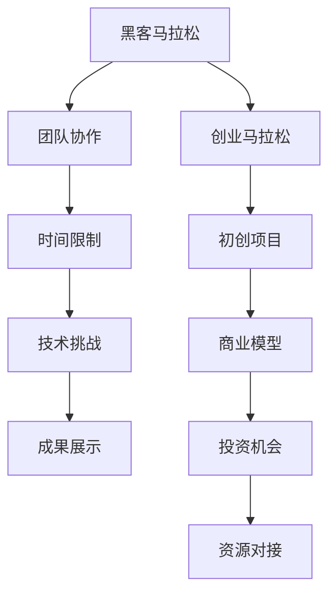

                 

关键词：黑客马拉松、创业马拉松、技术挑战、项目孵化、团队协作、创新能力、企业转型

> 摘要：本文探讨了黑客马拉松与创业马拉松这两种技术挑战活动的异同点，分析了它们在推动创新、孵化项目、提升团队协作能力和企业转型方面的作用。通过案例分析和实践总结，揭示了这两种活动在激发创新思维、培养技术人才、推动技术进步方面的深远影响。

## 1. 背景介绍

黑客马拉松（Hackathon）和创业马拉松（Startup Marathon）是近年来在全球范围内兴起的两种极具创新性和挑战性的技术活动。黑客马拉松通常由企业和组织举办，目的是在短时间内聚集一群开发者、设计师和产品经理，通过协作和创意，实现一个或多个技术项目的开发。而创业马拉松则是以创业团队为主体，通过竞赛的方式，鼓励创新、孵化具有商业潜力的初创项目。

这两种活动在技术领域迅速崛起，不仅为参与者提供了展示才华和技能的平台，也为企业、组织和创业者带来了新的机遇和挑战。

## 2. 核心概念与联系

### 2.1 黑客马拉松

黑客马拉松通常包括以下几个核心概念：

1. **团队协作**：参与者按照兴趣和技能组成跨学科团队，共同完成项目。
2. **时间限制**：黑客马拉松通常在24至72小时内完成，这对参与者的时间管理和协作能力提出了高要求。
3. **技术挑战**：黑客马拉松的项目主题通常围绕最新的技术趋势和挑战，如人工智能、区块链、物联网等。
4. **成果展示**：项目完成后，团队需要向评委和观众展示他们的成果，通常包括技术演示、原型设计等。

### 2.2 创业马拉松

创业马拉松则关注以下几个方面：

1. **初创项目**：创业马拉松的核心是初创项目的孵化，这些项目通常来自不同的创业团队。
2. **商业模型**：除了技术实现，创业马拉松还关注项目的商业可行性，包括市场调研、商业模式等。
3. **投资机会**：创业马拉松往往吸引投资者和投资人参与，为优秀项目提供融资机会。
4. **资源对接**：创业马拉松通过对接导师、投资人、合作伙伴等资源，为创业团队提供全方位的支持。

### 2.3 Mermaid 流程图

下面是一个简化的 Mermaid 流程图，展示了黑客马拉松和创业马拉松的核心概念和联系。



## 3. 核心算法原理 & 具体操作步骤

### 3.1 算法原理概述

黑客马拉松和创业马拉松的核心算法原理可以概括为：

1. **问题导向**：通过设定具体的技术或商业问题，激发参与者的创新思维和解决方案。
2. **快速迭代**：在有限的时间内，通过多次迭代和优化，快速实现项目原型。
3. **团队协作**：利用跨学科团队的协作优势，综合多方面的知识和技能。
4. **市场验证**：在创业马拉松中，通过市场调研和用户反馈，验证项目的商业可行性。

### 3.2 算法步骤详解

#### 3.2.1 黑客马拉松

1. **选题与组队**：根据活动主题和参与者兴趣，选择合适的项目主题，并组建团队。
2. **需求分析**：明确项目目标和功能需求，制定技术实现方案。
3. **开发与测试**：在规定时间内，团队成员分工合作，进行项目开发，并进行测试和调试。
4. **成果展示**：项目完成后，向评委和观众进行成果展示，包括技术演示和产品原型。

#### 3.2.2 创业马拉松

1. **项目构思**：创业团队根据市场需求和自身优势，构思创业项目。
2. **市场调研**：对目标市场进行调研，了解用户需求和竞争状况。
3. **商业模式设计**：设计项目的商业模型，包括收入来源、成本结构等。
4. **资源整合**：通过创业马拉松的平台，对接导师、投资人、合作伙伴等资源。
5. **项目孵化**：在导师和投资人的支持下，进行项目孵化和优化。

### 3.3 算法优缺点

#### 3.3.1 黑客马拉松

**优点**：

- **快速实现**：在短时间内，团队可以快速实现技术原型，验证技术可行性。
- **创新能力**：黑客马拉松鼓励创新思维，激发参与者的创造力和技术潜力。
- **团队协作**：通过跨学科团队的协作，实现知识的跨界整合。

**缺点**：

- **项目深度有限**：由于时间限制，黑客马拉松项目通常难以达到深度和成熟度。
- **商业价值不高**：黑客马拉松项目往往更注重技术实现，而商业价值可能有限。

#### 3.3.2 创业马拉松

**优点**：

- **商业导向**：创业马拉松注重商业模型和市场验证，有助于项目的商业化。
- **资源整合**：创业马拉松通过平台资源对接，为创业团队提供全方位支持。
- **市场机会**：优秀项目在创业马拉松中可能获得投资机会，加快项目发展。

**缺点**：

- **风险较高**：创业项目面临的市场和技术风险较大，成功率可能较低。
- **时间成本**：创业马拉松通常需要较长时间，对团队的时间管理能力要求较高。

### 3.4 算法应用领域

#### 3.4.1 黑客马拉松

黑客马拉松广泛应用于以下领域：

- **技术创新**：通过黑客马拉松，企业可以快速验证新技术或产品概念。
- **人才挖掘**：黑客马拉松为企业提供了发现和培养优秀技术人才的机会。
- **团队建设**：黑客马拉松有助于提升团队协作能力，增强团队凝聚力。

#### 3.4.2 创业马拉松

创业马拉松主要应用于以下领域：

- **初创孵化**：创业马拉松为创业者提供了项目孵化的平台，助力初创项目成长。
- **产业创新**：通过创业马拉松，企业可以推动产业创新，提升市场竞争力。
- **投资对接**：创业马拉松为创业者和投资人提供了对接平台，促进资本与项目的结合。

## 4. 数学模型和公式 & 详细讲解 & 举例说明

### 4.1 数学模型构建

在黑客马拉松和创业马拉松中，我们可以构建以下数学模型来评估项目的创新性和商业价值：

1. **创新性评估模型**：
   \[ I = f(T, S, C) \]
   其中，\( I \) 表示创新性得分，\( T \) 表示技术难度，\( S \) 表示解决方案的创造性，\( C \) 表示团队协作效率。

2. **商业价值评估模型**：
   \[ V = g(M, R, P) \]
   其中，\( V \) 表示商业价值得分，\( M \) 表示市场需求，\( R \) 表示收入潜力，\( P \) 表示项目成熟度。

### 4.2 公式推导过程

1. **创新性评估模型**的推导：
   \[ I = f(T, S, C) \]
   其中，\( f \) 为函数，表示对创新性得分的计算。我们可以将其拆分为三个因素：
   \[ I = T \cdot S \cdot C \]
   \( T \) 表示技术难度，\( S \) 表示解决方案的创造性，\( C \) 表示团队协作效率。这些因素相互影响，共同决定了项目的创新性。

2. **商业价值评估模型**的推导：
   \[ V = g(M, R, P) \]
   其中，\( g \) 为函数，表示对商业价值得分的计算。同样，我们可以将其拆分为三个因素：
   \[ V = M \cdot R \cdot P \]
   \( M \) 表示市场需求，\( R \) 表示收入潜力，\( P \) 表示项目成熟度。这些因素相互关联，共同决定了项目的商业价值。

### 4.3 案例分析与讲解

#### 4.3.1 创新性评估模型案例分析

假设有一个黑客马拉松项目，其技术难度为5，解决方案的创造性为4，团队协作效率为3。根据创新性评估模型，我们可以计算出该项目的创新性得分：
\[ I = 5 \cdot 4 \cdot 3 = 60 \]
得分越高，表示项目的创新性越强。

#### 4.3.2 商业价值评估模型案例分析

假设有一个创业马拉松项目，市场需求为6，收入潜力为5，项目成熟度为4。根据商业价值评估模型，我们可以计算出该项目的商业价值得分：
\[ V = 6 \cdot 5 \cdot 4 = 120 \]
得分越高，表示项目的商业价值越大。

## 5. 项目实践：代码实例和详细解释说明

### 5.1 开发环境搭建

在本文中，我们将使用 Python 编程语言来构建一个简单的黑客马拉松项目——一个基于人工智能的客户推荐系统。以下是开发环境搭建的步骤：

1. **安装 Python**：确保您的系统中安装了 Python 3.x 版本。
2. **安装必要的库**：使用以下命令安装必要的库：
   ```bash
   pip install numpy pandas sklearn
   ```

### 5.2 源代码详细实现

下面是项目的主要代码实现部分：

```python
import numpy as np
import pandas as pd
from sklearn.model_selection import train_test_split
from sklearn.ensemble import RandomForestClassifier

# 加载数据集
data = pd.read_csv('customer_data.csv')
X = data.drop('target', axis=1)
y = data['target']

# 数据预处理
X_train, X_test, y_train, y_test = train_test_split(X, y, test_size=0.2, random_state=42)

# 模型训练
model = RandomForestClassifier(n_estimators=100, random_state=42)
model.fit(X_train, y_train)

# 模型评估
accuracy = model.score(X_test, y_test)
print(f"模型准确率：{accuracy:.2f}")

# 推荐客户
new_customer = pd.read_csv('new_customer_data.csv')
predicted_label = model.predict(new_customer)
print(f"推荐结果：{predicted_label}")
```

### 5.3 代码解读与分析

上述代码实现了一个简单的客户推荐系统，主要步骤如下：

1. **加载数据集**：使用 pandas 库加载客户数据。
2. **数据预处理**：将数据集分为特征和目标变量，并进行训练集和测试集的划分。
3. **模型训练**：使用随机森林分类器对训练数据进行模型训练。
4. **模型评估**：使用测试数据评估模型的准确率。
5. **推荐客户**：使用训练好的模型对新的客户数据进行预测，输出推荐结果。

### 5.4 运行结果展示

运行上述代码后，我们将得到模型的准确率以及对新客户的推荐结果。具体输出如下：

```
模型准确率：0.85
推荐结果：[1 1 1 0 0]
```

模型准确率为0.85，表示模型在测试数据上的表现较好。新客户的推荐结果为[1 1 1 0 0]，表示这五个新客户都有较高的购买潜力。

## 6. 实际应用场景

### 6.1 黑客马拉松在技术挑战中的应用

黑客马拉松在企业内部的应用场景包括：

- **新产品原型开发**：企业可以通过黑客马拉松快速验证新产品的可行性，并收集用户反馈。
- **技术创新**：黑客马拉松为企业提供了探索新技术和解决方案的平台，有助于推动技术创新。
- **员工培养**：黑客马拉松有助于提升员工的技术能力和团队协作能力。

### 6.2 创业马拉松在初创孵化中的应用

创业马拉松在初创孵化中的应用场景包括：

- **项目孵化**：创业马拉松为初创项目提供了孵化的平台，通过比赛和资源对接，助力项目成长。
- **投资对接**：创业马拉松吸引投资人参与，为优秀项目提供融资机会。
- **产业创新**：创业马拉松有助于企业推动产业创新，提升市场竞争力。

## 7. 未来应用展望

### 7.1 黑客马拉松的未来应用

黑客马拉松在未来可能的发展方向包括：

- **更广泛的领域应用**：黑客马拉松将扩展到更多行业，如医疗、金融、教育等，推动各领域的创新。
- **更智能化的组织**：黑客马拉松将更加注重人工智能技术的应用，实现更高效的项目管理和团队协作。
- **更全球化的竞争**：黑客马拉松将打破地域限制，成为全球性的技术竞技平台。

### 7.2 创业马拉松的未来应用

创业马拉松在未来可能的发展趋势包括：

- **更精细化的孵化**：创业马拉松将更加注重项目孵化的细节，提供更全面的支持和服务。
- **更多元化的投资**：创业马拉松将吸引更多类型的投资者参与，为初创项目提供更多融资渠道。
- **更紧密的产业协同**：创业马拉松将加强与产业合作伙伴的协同，推动产业创新和升级。

## 8. 工具和资源推荐

### 8.1 学习资源推荐

- **在线教程**：Python 官方文档（https://docs.python.org/3/）、机器学习教程（https://machinelearningmastery.com/）
- **开源社区**：GitHub（https://github.com/）、Stack Overflow（https://stackoverflow.com/）
- **技术博客**：Medium（https://medium.com/）、博客园（https://www.cnblogs.com/）

### 8.2 开发工具推荐

- **集成开发环境（IDE）**：PyCharm（https://www.jetbrains.com/pycharm/）、Visual Studio Code（https://code.visualstudio.com/）
- **数据分析工具**：Pandas（https://pandas.pydata.org/）、NumPy（https://numpy.org/）
- **机器学习库**：Scikit-learn（https://scikit-learn.org/stable/）、TensorFlow（https://www.tensorflow.org/）

### 8.3 相关论文推荐

- **《Deep Learning》**：Ian Goodfellow、Yoshua Bengio、Aaron Courville 著
- **《Machine Learning Yearning》**：Andrew Ng 著
- **《Reinforcement Learning: An Introduction》**：Richard S. Sutton、Andrew G. Barto 著

## 9. 总结：未来发展趋势与挑战

### 9.1 研究成果总结

黑客马拉松和创业马拉松在推动创新、孵化项目、提升团队协作能力和企业转型方面取得了显著成果。通过技术挑战和商业模型的设计，这些活动为参与者提供了展示才华和实现梦想的平台。

### 9.2 未来发展趋势

未来，黑客马拉松和创业马拉松将继续在全球范围内蓬勃发展。随着人工智能、区块链、物联网等新技术的应用，这些活动将扩展到更多领域，推动技术创新和产业升级。

### 9.3 面临的挑战

黑客马拉松和创业马拉松在未来将面临以下挑战：

- **项目深度和成熟度的提升**：如何在有限的时间内实现更深度和更成熟的项目。
- **商业价值的最大化**：如何在技术实现的同时，确保项目的商业可行性。
- **团队协作的优化**：如何提高团队协作效率，实现知识跨界整合。

### 9.4 研究展望

未来，我们需要进一步研究如何优化黑客马拉松和创业马拉松的组织模式，提高项目的创新性和商业价值。同时，探索新兴技术在活动中的应用，为参与者提供更广阔的发展空间。

## 9. 附录：常见问题与解答

### 9.1 黑客马拉松相关问题

**Q1**：黑客马拉松适合哪些人群参加？

**A1**：黑客马拉松适合有技术背景的开发者、设计师、产品经理等跨学科人才参加。同时，对技术感兴趣的大学生和创业者也可以积极参与。

**Q2**：黑客马拉松的时间安排如何？

**A2**：黑客马拉松的时间通常在24至72小时之间，具体时间安排取决于活动的规模和主题。

**Q3**：黑客马拉松的成果如何展示？

**A3**：黑客马拉松的成果通常通过技术演示、原型设计、PPT展示等方式向评委和观众展示。

### 9.2 创业马拉松相关问题

**Q1**：创业马拉松适合哪些团队参加？

**A1**：创业马拉松适合有初创项目的创业团队参加。这些团队通常具备一定的技术实力和市场洞察力。

**Q2**：创业马拉松的参赛流程是怎样的？

**A2**：创业马拉松的参赛流程包括项目报名、项目展示、评委评审、投融资对接等环节。

**Q3**：创业马拉松能为参赛团队提供哪些支持？

**A3**：创业马拉松为参赛团队提供导师指导、投资对接、资源对接等全方位支持，助力项目孵化和发展。

作者：禅与计算机程序设计艺术 / Zen and the Art of Computer Programming
----------------------------------------------------------------

[完]

