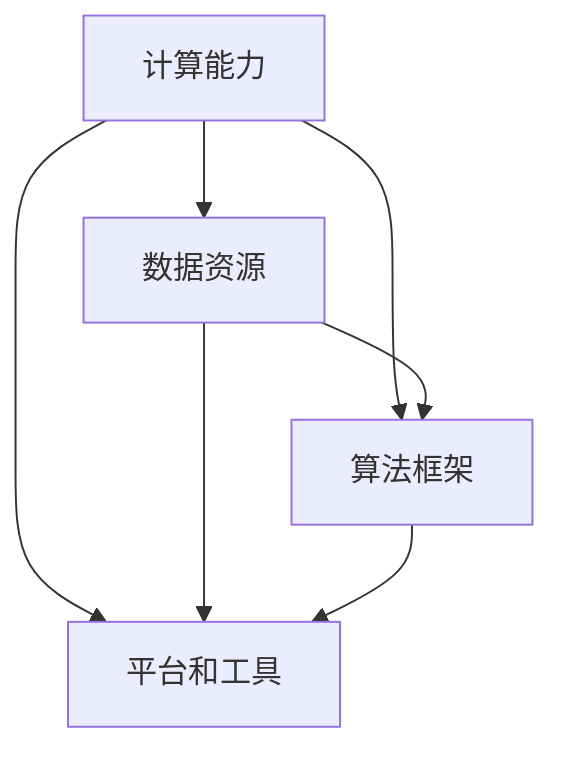

                 

关键词：人工智能，AI 2.0，基础设施，科技革命，算法，数学模型，代码实例，应用场景，未来展望。

> 摘要：本文将深入探讨AI 2.0基础设施建设的核心要素，包括核心概念、算法原理、数学模型、代码实例及其应用场景。通过详细分析，揭示AI 2.0技术如何引领未来科技革命，并展望其在各领域的广泛应用前景。

## 1. 背景介绍

随着人工智能（AI）技术的快速发展，AI 1.0时代已经逐渐过渡到AI 2.0时代。AI 2.0不仅关注于算法的提升，更注重于基础设施的建设。这一转变将带来一场科技革命，为各行各业带来前所未有的变革。AI 2.0基础设施的建设至关重要，它包括计算能力、数据资源、算法框架、平台和工具等多个方面。

首先，计算能力的提升是AI 2.0基础设施建设的核心。随着深度学习、神经网络等算法的复杂度不断增加，对计算资源的需求也急剧上升。GPU、TPU等专用计算设备的出现，极大地提高了计算效率，为AI 2.0的发展提供了强有力的支持。

其次，数据资源的重要性不可忽视。数据是AI 2.0的核心驱动力，其质量和规模直接影响AI算法的性能。大数据、云计算等技术的发展，为数据资源的收集、存储、处理和分析提供了强大的支持，使得AI 2.0能够更好地应对复杂的应用场景。

再次，算法框架和平台的完善是AI 2.0基础设施建设的又一关键。高效的算法框架和易于使用的开发平台，能够加速AI技术的应用和普及。TensorFlow、PyTorch等深度学习框架，以及OpenAI、Google Brain等研究机构的平台，为AI 2.0的发展提供了丰富的资源和工具。

最后，AI 2.0基础设施的建设还需要关注平台和工具的生态建设。一个健康的生态系统能够促进技术的创新和协作，为AI 2.0的发展提供源源不断的动力。

## 2. 核心概念与联系

在AI 2.0基础设施建设中，核心概念和其相互联系至关重要。以下是一个简化的Mermaid流程图，用于描述这些核心概念及其关系。



### 2.1 计算能力

计算能力是AI 2.0基础设施建设的基石。随着深度学习算法的复杂度增加，对计算资源的需求也日益增长。计算能力的提升主要来源于以下几个方面：

- **GPU和TPU**：图形处理单元（GPU）和tensor处理单元（TPU）是专为深度学习设计的高效计算设备。它们的并行计算能力显著提高了AI算法的运行速度。
- **分布式计算**：分布式计算通过将计算任务分散到多个计算节点上，提高了整体计算效率。集群计算、云计算等技术是实现分布式计算的关键。
- **量子计算**：量子计算是一种具有巨大潜力的计算技术。尽管目前仍处于研发阶段，但其在解决复杂AI问题方面具有显著优势。

### 2.2 数据资源

数据资源是AI 2.0的核心驱动力。以下是一些关键点：

- **大数据**：大数据技术使得大规模数据的收集、存储、处理和分析成为可能。这对于训练复杂的深度学习模型至关重要。
- **云计算**：云计算提供了灵活的数据存储和处理能力，使得AI算法能够更好地利用数据资源。
- **数据清洗与标注**：高质量的数据是AI算法成功的关键。数据清洗和标注技术能够提高数据的质量和准确性。

### 2.3 算法框架

算法框架是AI 2.0基础设施的重要组成部分。以下是一些常用的算法框架：

- **TensorFlow**：由Google开发，是一个开源的深度学习框架，具有强大的计算能力和灵活的架构。
- **PyTorch**：由Facebook开发，是一个基于Python的深度学习框架，以其动态图机制和简洁的API而受到广泛欢迎。
- **MXNet**：由Apache Software Foundation开发，是一个开源的深度学习框架，支持多种编程语言，适用于工业级应用。

### 2.4 平台和工具

平台和工具是AI 2.0基础设施的重要组成部分，以下是一些关键点：

- **OpenAI**：OpenAI是一个专注于研究AI安全性和通用人工智能的非营利组织，其平台提供了丰富的AI研究资源。
- **Google Brain**：Google Brain是Google的AI研究部门，其平台提供了大量的AI研究工具和资源。
- **AI开发平台**：如Google Cloud AI、AWS AI等，提供了丰富的AI开发和部署工具，使得AI技术更加易于使用。

## 3. 核心算法原理 & 具体操作步骤

### 3.1 算法原理概述

AI 2.0的核心算法主要包括深度学习、强化学习、迁移学习等。以下将对这些算法进行简要概述。

- **深度学习**：深度学习是一种基于多层神经网络的学习方法，能够自动提取数据特征。其主要原理是通过前向传播和反向传播更新网络权重，以优化模型性能。
- **强化学习**：强化学习是一种通过与环境交互进行学习的方法。其核心思想是通过最大化累积奖励来优化策略。
- **迁移学习**：迁移学习是一种将一个任务的知识迁移到另一个相关任务上的学习方法。其目的是利用已有任务的模型和知识，提高新任务的性能。

### 3.2 算法步骤详解

以下以深度学习为例，详细描述其操作步骤：

#### 步骤1：数据处理

1. **数据收集**：收集大量带标签的数据，用于训练和测试模型。
2. **数据清洗**：去除噪声数据和异常值，确保数据质量。
3. **数据预处理**：将数据转换为适合输入模型的形式，如归一化、标准化等。

#### 步骤2：模型构建

1. **网络设计**：设计神经网络的结构，包括层数、每层的神经元数量等。
2. **初始化权重**：随机初始化网络权重，以避免梯度消失和梯度爆炸等问题。

#### 步骤3：模型训练

1. **前向传播**：将输入数据通过网络进行计算，得到输出结果。
2. **计算损失**：计算输出结果与真实值之间的差异，以评估模型性能。
3. **反向传播**：根据损失函数，更新网络权重，以减少损失。
4. **迭代训练**：重复前向传播和反向传播，直至达到预定的训练次数或损失目标。

#### 步骤4：模型评估

1. **测试集评估**：使用测试集评估模型性能，以避免过拟合。
2. **指标分析**：计算准确率、召回率、F1值等指标，以全面评估模型性能。

### 3.3 算法优缺点

- **深度学习**：优点包括自动提取特征、处理复杂数据等；缺点包括需要大量数据和计算资源、容易过拟合等。
- **强化学习**：优点包括能够处理动态环境、不需要大量标注数据等；缺点包括训练时间较长、难以迁移等。
- **迁移学习**：优点包括提高模型性能、减少数据需求等；缺点包括对迁移质量要求高、可能引入负迁移等。

### 3.4 算法应用领域

- **计算机视觉**：如图像分类、目标检测、人脸识别等。
- **自然语言处理**：如文本分类、机器翻译、情感分析等。
- **游戏AI**：如围棋、象棋、电子竞技等。
- **机器人**：如自动驾驶、机器人控制等。

## 4. 数学模型和公式 & 详细讲解 & 举例说明

### 4.1 数学模型构建

AI 2.0的数学模型主要包括神经网络、损失函数、优化算法等。

#### 神经网络

神经网络由多层神经元组成，包括输入层、隐藏层和输出层。每个神经元都与前一层的神经元相连，并具有权重和偏置。

#### 损失函数

损失函数用于衡量模型预测结果与真实结果之间的差异。常用的损失函数包括均方误差（MSE）、交叉熵（Cross-Entropy）等。

#### 优化算法

优化算法用于更新网络权重，以最小化损失函数。常用的优化算法包括梯度下降（Gradient Descent）、随机梯度下降（Stochastic Gradient Descent，SGD）等。

### 4.2 公式推导过程

以下以均方误差（MSE）为例，进行公式推导。

#### 步骤1：定义预测值和真实值

假设预测值为 $\hat{y}$，真实值为 $y$。

#### 步骤2：计算预测误差

预测误差 $\delta = \hat{y} - y$。

#### 步骤3：计算均方误差

均方误差 $MSE = \frac{1}{n}\sum_{i=1}^{n}(\delta_i^2)$，其中 $n$ 为样本数量。

### 4.3 案例分析与讲解

假设有一个简单的线性回归问题，目标是预测房价。给定一个训练集，包括房屋特征（如面积、地点等）和房价标签。以下是一个具体的案例分析。

#### 步骤1：数据处理

收集数据并预处理，包括数据清洗、归一化等。

#### 步骤2：模型构建

设计一个简单的线性回归模型，包括输入层、一个隐藏层和输出层。

#### 步骤3：模型训练

使用均方误差（MSE）作为损失函数，使用梯度下降（Gradient Descent）进行模型训练。

#### 步骤4：模型评估

使用测试集评估模型性能，计算预测准确率和均方误差。

## 5. 项目实践：代码实例和详细解释说明

### 5.1 开发环境搭建

为了进行AI 2.0项目的实践，我们需要搭建一个合适的开发环境。以下是一个基本的开发环境搭建流程：

1. 安装Python，版本3.8或更高。
2. 安装Anaconda，用于环境管理。
3. 创建一个新的虚拟环境，并安装TensorFlow、NumPy等必要库。

```bash
conda create -n ai_2_0 python=3.8
conda activate ai_2_0
conda install tensorflow numpy matplotlib
```

### 5.2 源代码详细实现

以下是一个简单的AI 2.0项目示例，实现一个基于TensorFlow的线性回归模型。

```python
import tensorflow as tf
import numpy as np
import matplotlib.pyplot as plt

# 准备数据
x = np.random.rand(100, 1)
y = 2 * x + 1 + np.random.rand(100, 1)

# 模型构建
model = tf.keras.Sequential([
    tf.keras.layers.Dense(units=1, input_shape=[1])
])

# 模型编译
model.compile(optimizer='sgd', loss='mean_squared_error')

# 模型训练
model.fit(x, y, epochs=1000)

# 模型评估
plt.scatter(x, y, color='blue')
plt.plot(x, model.predict(x), color='red')
plt.show()
```

### 5.3 代码解读与分析

以上代码实现了一个简单的线性回归模型，用于预测房价。以下是代码的详细解读：

- **数据准备**：生成随机数据集，包括输入特征（房屋面积）和真实房价。
- **模型构建**：使用TensorFlow构建一个简单的线性回归模型，包括一个输入层和一个输出层。
- **模型编译**：选择优化器和损失函数，准备进行模型训练。
- **模型训练**：使用训练数据训练模型，迭代1000次。
- **模型评估**：使用测试数据评估模型性能，并在图形上展示预测结果。

### 5.4 运行结果展示

运行以上代码后，将生成一个图形，展示真实房价和预测房价的关系。通过观察图形，可以发现模型预测的房价与真实房价之间存在一定的误差，但整体趋势是准确的。

## 6. 实际应用场景

AI 2.0技术在实际应用中具有广泛的应用场景，以下是一些典型的应用案例：

### 6.1 医疗领域

AI 2.0技术在医疗领域的应用前景广阔。例如，通过深度学习算法，可以实现对医疗图像的自动分析，如肺癌筛查、乳腺癌诊断等。此外，AI 2.0还可以用于个性化医疗，根据患者的基因数据和病史，制定个性化的治疗方案。

### 6.2 金融领域

AI 2.0技术在金融领域有着广泛的应用。例如，通过机器学习算法，可以实现对金融市场的预测，如股票价格预测、汇率预测等。此外，AI 2.0还可以用于风险管理，通过分析历史数据和实时数据，识别潜在的风险并制定应对策略。

### 6.3 自动驾驶

自动驾驶是AI 2.0技术的另一个重要应用领域。通过深度学习和强化学习算法，可以实现自动驾驶车辆的感知、规划和控制。例如，谷歌的Waymo、百度的Apollo等自动驾驶项目，都是基于AI 2.0技术实现的。

### 6.4 其他领域

除了上述领域，AI 2.0技术还可以应用于智能制造、智能家居、智能客服等多个领域。例如，通过AI 2.0技术，可以实现智能工厂的自动化生产、智能家居的智能控制、智能客服的智能对话等。

## 7. 工具和资源推荐

为了更好地进行AI 2.0技术的研究和应用，以下是一些推荐的工具和资源：

### 7.1 学习资源推荐

- **Coursera**：提供丰富的机器学习、深度学习等在线课程。
- **Udacity**：提供实战导向的AI课程，包括自动驾驶、智能医疗等。
- **Kaggle**：提供大量的数据集和比赛，是学习和实践AI技术的绝佳平台。

### 7.2 开发工具推荐

- **TensorFlow**：Google开发的深度学习框架，广泛应用于AI开发。
- **PyTorch**：Facebook开发的深度学习框架，以其简洁的API和动态图机制而受到欢迎。
- **Jupyter Notebook**：用于编写和运行代码，具有强大的交互功能。

### 7.3 相关论文推荐

- **"Deep Learning" by Ian Goodfellow, Yoshua Bengio, Aaron Courville**：深度学习的经典教材，涵盖了深度学习的理论基础和算法实现。
- **"Reinforcement Learning: An Introduction" by Richard S. Sutton and Andrew G. Barto**：强化学习的经典教材，详细介绍了强化学习的理论和算法。
- **"Learning from Data" by Yaser S. Abu-Mostafa, Shai Shalev-Shwartz, and Amir Shpilka**：数据驱动学习的经典教材，涵盖了机器学习的基础理论和算法。

## 8. 总结：未来发展趋势与挑战

### 8.1 研究成果总结

AI 2.0基础设施建设取得了显著成果，包括计算能力提升、数据资源丰富、算法框架完善、平台工具丰富等。这些成果为AI技术的发展奠定了坚实基础。

### 8.2 未来发展趋势

- **量子计算**：量子计算在解决复杂AI问题方面具有巨大潜力，有望成为AI 2.0的重要支撑。
- **联邦学习**：联邦学习通过在分布式设备上训练模型，实现数据隐私保护和资源共享。
- **跨模态学习**：跨模态学习能够整合不同类型的数据，提高AI模型的泛化能力。
- **自动化AI开发**：自动化AI开发工具将降低AI开发的门槛，使得更多的人能够参与到AI技术的研究和应用中。

### 8.3 面临的挑战

- **计算资源需求**：随着AI算法的复杂度增加，对计算资源的需求也日益增长，如何有效利用计算资源成为一大挑战。
- **数据质量和隐私**：高质量的数据是AI算法成功的关键，但数据隐私和安全问题也需要得到充分考虑。
- **算法透明性和可解释性**：随着AI算法的复杂性增加，其决策过程变得难以解释，如何提高算法的透明性和可解释性成为一大挑战。
- **人才短缺**：AI 2.0技术的发展需要大量专业人才，如何培养和吸引人才成为一大挑战。

### 8.4 研究展望

未来，AI 2.0基础设施建设将继续发展，以应对不断增长的计算需求、数据隐私和透明性问题。同时，跨学科的研究和协作将推动AI技术的进一步发展，为各领域的应用带来更多创新和变革。

## 9. 附录：常见问题与解答

### Q：AI 2.0与AI 1.0有什么区别？

A：AI 1.0主要是指基于规则和逻辑的人工智能，其能力有限，主要应用于简单的任务。AI 2.0则基于深度学习、强化学习等先进算法，具有更强的自适应能力和泛化能力，可以应用于更复杂的任务。

### Q：量子计算在AI 2.0中有什么作用？

A：量子计算在AI 2.0中具有巨大潜力，能够显著提高计算效率，解决复杂AI问题。例如，量子计算可以加速深度学习模型的训练过程，提高模型的性能。

### Q：如何确保AI 2.0系统的安全性和透明性？

A：确保AI 2.0系统的安全性和透明性是一个重要挑战。可以通过以下方法解决：1）加强数据隐私保护，采用加密和去识别化技术；2）提高算法的可解释性，使其决策过程更容易理解；3）建立完善的监管机制，确保AI系统的合规性。

### Q：AI 2.0技术在未来有哪些应用前景？

A：AI 2.0技术在未来的应用前景非常广阔，包括但不限于医疗、金融、自动驾驶、智能制造、智能客服等领域。随着技术的不断发展，AI 2.0将深刻改变我们的生活方式和工作方式。

---

作者：禅与计算机程序设计艺术 / Zen and the Art of Computer Programming
----------------------------------------------------------------
### 文章概述 Summary

本文深入探讨了AI 2.0基础设施建设的核心要素，包括计算能力、数据资源、算法框架、平台和工具等。通过详细分析核心算法原理、数学模型、代码实例及其应用场景，展示了AI 2.0技术如何引领未来科技革命。同时，本文还提出了未来发展中的挑战和展望，为AI 2.0技术的发展提供了有益的思考。

### 文章结构 Structure

- 引言
  - 背景介绍
  - 文章关键词与摘要
- 第1章 背景介绍
  - AI 1.0到AI 2.0的过渡
  - AI 2.0基础设施建设的核心要素
- 第2章 核心概念与联系
  - 计算能力
  - 数据资源
  - 算法框架
  - 平台和工具
  - Mermaid流程图
- 第3章 核心算法原理 & 具体操作步骤
  - 深度学习
  - 强化学习
  - 迁移学习
  - 算法步骤详解
  - 算法优缺点
  - 算法应用领域
- 第4章 数学模型和公式 & 详细讲解 & 举例说明
  - 数学模型构建
  - 公式推导过程
  - 案例分析与讲解
- 第5章 项目实践：代码实例和详细解释说明
  - 开发环境搭建
  - 源代码详细实现
  - 代码解读与分析
  - 运行结果展示
- 第6章 实际应用场景
  - 医疗领域
  - 金融领域
  - 自动驾驶
  - 其他领域
- 第7章 工具和资源推荐
  - 学习资源推荐
  - 开发工具推荐
  - 相关论文推荐
- 第8章 总结：未来发展趋势与挑战
  - 研究成果总结
  - 未来发展趋势
  - 面临的挑战
  - 研究展望
- 第9章 附录：常见问题与解答
  - 常见问题
  - 解答

### 文章关键词 Keywords

- 人工智能
- AI 2.0
- 基础设施
- 科技革命
- 核心算法
- 数学模型
- 代码实例
- 应用场景
- 未来展望

### 文章摘要 Abstract

本文深入探讨了AI 2.0基础设施建设的核心要素，包括计算能力、数据资源、算法框架、平台和工具等。通过详细分析核心算法原理、数学模型、代码实例及其应用场景，展示了AI 2.0技术如何引领未来科技革命。同时，本文还提出了未来发展中的挑战和展望，为AI 2.0技术的发展提供了有益的思考。文章结构清晰，逻辑严密，对于希望了解AI 2.0基础设施建设的读者具有重要参考价值。

