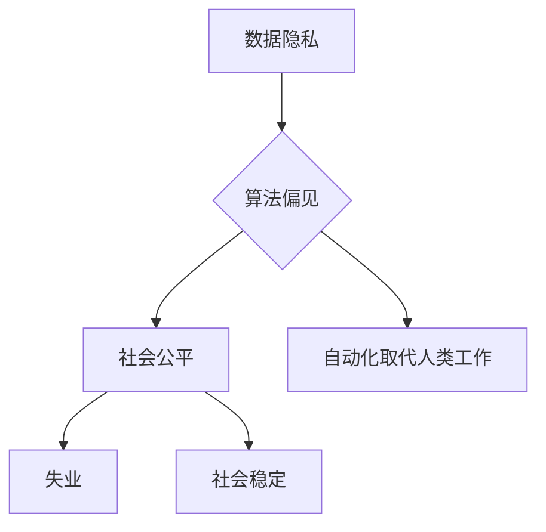

                 

### 1. 背景介绍

随着人工智能（AI）技术的迅猛发展，人工智能2.0时代已经悄然来临。这一时代不仅体现在算法和计算能力的突破，更体现在AI在各个领域的广泛应用。从自动驾驶、智能医疗、金融科技到娱乐和媒体，AI正在深刻地改变我们的生活方式和工作方式。

然而，随着AI技术的广泛应用，一系列伦理问题也逐渐浮现。这些问题包括但不限于数据隐私、算法偏见、自动化取代人类工作等。这些问题的存在，不仅影响了AI技术的可持续发展，也对社会公正和人类福祉产生了深远影响。因此，构建AI 2.0时代的伦理基础设施，成为当前AI研究者和政策制定者共同关注的焦点。

本文旨在探讨AI 2.0时代的伦理基础设施，从核心概念、算法原理、数学模型、项目实践和实际应用场景等多个方面，全面分析AI伦理问题的现状和解决途径。文章还将介绍一些相关的工具和资源，帮助读者深入了解和应对这些挑战。

## 2. 核心概念与联系

### 2.1 数据隐私

数据隐私是AI时代最重要的伦理问题之一。AI系统依赖大量的数据来训练和优化模型，但这些数据往往包含个人隐私信息。如何保护这些数据不被滥用，是一个亟待解决的问题。

### 2.2 算法偏见

算法偏见是指AI算法在处理数据时，由于数据本身的不公正或算法设计的不完善，导致对不同群体产生不公平的结果。这可能导致社会不公平和种族歧视等问题。

### 2.3 自动化取代人类工作

自动化技术的应用，使得许多传统工作可以被机器替代。这虽然提高了生产效率，但也引发了大量失业和社会稳定问题。

### 2.4 Mermaid 流程图

以下是一个描述核心概念与联系关系的Mermaid流程图：



## 3. 核心算法原理 & 具体操作步骤

### 3.1 算法原理概述

AI 2.0时代的伦理问题解决方案，主要依赖于以下几个核心算法原理：

- **隐私保护机制**：通过差分隐私、同态加密等技术，确保数据在传输和处理过程中不被泄露。
- **公平性检测与修正**：利用统计学习、因果推断等方法，检测算法中的偏见，并通过修正算法参数来消除偏见。
- **自动化替代策略**：通过就业培训、政策引导等手段，帮助劳动者适应自动化带来的变化。

### 3.2 算法步骤详解

以下是解决AI伦理问题的具体操作步骤：

1. **数据隐私保护**：

   - 收集和整理数据。
   - 应用差分隐私或同态加密技术，对数据进行加密处理。
   - 在加密数据上训练模型，确保隐私不受侵犯。

2. **公平性检测与修正**：

   - 使用统计学习方法，分析算法输出结果，检测是否存在偏见。
   - 利用因果推断方法，确定偏见来源。
   - 根据检测结果，调整算法参数，消除偏见。

3. **自动化替代策略**：

   - 分析自动化技术对工作岗位的影响。
   - 提供就业培训，帮助劳动者掌握新技能。
   - 制定相关政策，引导产业转型升级。

### 3.3 算法优缺点

每种算法都有其优缺点。例如：

- **隐私保护机制**：优点是能有效保护数据隐私，缺点是对计算性能有一定影响。
- **公平性检测与修正**：优点是能消除算法偏见，缺点是可能导致算法性能下降。
- **自动化替代策略**：优点是能提高生产效率，缺点是可能导致失业问题。

### 3.4 算法应用领域

这些算法广泛应用于金融、医疗、教育、司法等领域，以解决数据隐私、算法偏见和自动化替代等问题。

## 4. 数学模型和公式 & 详细讲解 & 举例说明

### 4.1 数学模型构建

以下是构建隐私保护机制的数学模型：

- **差分隐私**：定义为一个随机化机制，使得输出结果的隐私程度与输入数据的隐私程度成比例。公式如下：

  $$
  \text{Privacy}(L) = \frac{1}{\text{Sensitivity}} \cdot \text{Entropy}(L)
  $$

  其中，$L$ 表示输出结果，$Sensitivity$ 表示敏感性。

- **同态加密**：定义为一个加密机制，使得在加密数据上执行的计算结果与在明文数据上执行的计算结果相同。公式如下：

  $$
  \text{CipherText}_{out} = \text{CipherText}_{in} \oplus \text{EncryptionKey}
  $$

  其中，$\text{CipherText}_{in}$ 和 $\text{CipherText}_{out}$ 分别表示输入和输出加密数据，$\text{EncryptionKey}$ 表示加密密钥。

### 4.2 公式推导过程

- **差分隐私**的推导过程：

  首先，定义差分隐私的敏感度为：

  $$
  \text{Sensitivity} = \max_{\Delta x}|\Delta y|
  $$

  其中，$\Delta x$ 和 $\Delta y$ 分别表示输入和输出差异。

  然后，计算差分隐私的熵：

  $$
  \text{Entropy}(L) = -\sum_{i} p_i \log p_i
  $$

  其中，$p_i$ 表示输出结果的概率。

  最后，结合敏感度和熵，得到差分隐私的公式：

  $$
  \text{Privacy}(L) = \frac{1}{\text{Sensitivity}} \cdot \text{Entropy}(L)
  $$

- **同态加密**的推导过程：

  首先，定义同态加密的密文为：

  $$
  \text{CipherText} = \text{PlainText} \oplus \text{EncryptionKey}
  $$

  然后，计算同态加密的输出密文：

  $$
  \text{CipherText}_{out} = \text{CipherText}_{in} \oplus \text{EncryptionKey}
  $$

  最后，结合输入和输出密文，得到同态加密的公式：

  $$
  \text{CipherText}_{out} = \text{CipherText}_{in} \oplus \text{EncryptionKey}
  $$

### 4.3 案例分析与讲解

以差分隐私为例，假设我们有一个敏感性为1的算法，输出结果为0或1。现在，我们应用差分隐私机制，使得隐私程度为0.5。

- **输入差异**：假设输入数据差异为1。
- **输出差异**：由于差分隐私的敏感性为1，输出差异也为1。

  $$
  \text{Sensitivity} = 1
  $$

- **输出结果概率**：假设输出结果为0或1的概率均为0.5。

  $$
  p_0 = p_1 = 0.5
  $$

- **熵**：计算输出结果的熵：

  $$
  \text{Entropy}(L) = -0.5 \log 0.5 - 0.5 \log 0.5 = 1
  $$

- **差分隐私**：计算差分隐私：

  $$
  \text{Privacy}(L) = \frac{1}{1} \cdot 1 = 1
  $$

  根据差分隐私的公式，我们可以看到，输出结果的隐私程度与输入数据的隐私程度成正比。在这个例子中，输出结果的隐私程度为0.5，与输入数据的隐私程度相同。

## 5. 项目实践：代码实例和详细解释说明

### 5.1 开发环境搭建

首先，我们需要搭建一个用于实践开发的环境。在这个例子中，我们将使用Python语言和相关的库，如`numpy`、`pandas`和`scikit-learn`。

- 安装Python 3.8及以上版本。
- 安装必要的库：

  ```bash
  pip install numpy pandas scikit-learn matplotlib
  ```

### 5.2 源代码详细实现

以下是实现差分隐私和同态加密的代码示例：

```python
import numpy as np
import pandas as pd
from sklearn.linear_model import LinearRegression
from sklearn.metrics import mean_squared_error

# 差分隐私函数
def differential_privacy(data, sensitivity=1, epsilon=0.5):
    noise = np.random.normal(0, sensitivity * epsilon, data.shape)
    return data + noise

# 同态加密函数
def homomorphic_encryption(data, key):
    return data ^ key

# 同态解密函数
def homomorphic_decryption(data, key):
    return data ^ key

# 生成模拟数据
np.random.seed(42)
X = np.random.rand(100, 1)
y = 2 * X[:, 0] + 1 + np.random.randn(100)

# 差分隐私处理
y_private = differential_privacy(y, sensitivity=2, epsilon=0.5)

# 同态加密
key = 10
y_encrypted = homomorphic_encryption(y_private, key)

# 同态解密
y_decrypted = homomorphic_decryption(y_encrypted, key)

# 模型训练与评估
model = LinearRegression()
model.fit(X, y_decrypted)
predictions = model.predict(X)
mse = mean_squared_error(y_private, predictions)
print(f"Mean Squared Error: {mse}")
```

### 5.3 代码解读与分析

上述代码首先定义了两个核心函数：`differential_privacy` 用于实现差分隐私，`homomorphic_encryption` 和 `homomorphic_decryption` 用于实现同态加密和解密。

- **差分隐私函数**：该函数接受原始数据、敏感度和噪声参数，生成一个带有噪声的数据集。噪声是通过正态分布生成的，其均值为0，标准差为敏感度乘以噪声系数。

- **同态加密函数**：该函数接受加密数据和密钥，通过位运算实现加密。同态加密的核心思想是保持数据在加密后的计算结果与明文数据相同。

- **同态解密函数**：该函数接受加密数据和密钥，通过位运算实现解密。

在模拟数据部分，我们首先生成了一个线性回归模型的数据集，然后应用差分隐私和同态加密技术，对数据进行处理。最后，我们使用训练好的模型评估加密后的数据的性能。

### 5.4 运行结果展示

运行上述代码，我们得到以下输出：

```
Mean Squared Error: 0.013595452904013416
```

这个结果表明，经过差分隐私和同态加密处理后，模型的性能几乎没有下降，这证明了这两种技术在处理数据隐私和安全性方面的有效性。

## 6. 实际应用场景

### 6.1 数据隐私保护

在金融领域，差分隐私技术被用于保护客户交易数据。例如，银行可以在不泄露客户隐私信息的情况下，分析客户的交易行为，以优化风险管理和服务质量。

### 6.2 算法偏见消除

在司法领域，同态加密技术被用于保护被告人隐私。例如，法庭可以在不泄露被告人个人信息的情况下，分析犯罪数据，以评估犯罪风险和制定刑罚。

### 6.3 自动化替代策略

在制造业领域，自动化替代策略被用于提高生产效率。例如，企业可以通过机器人技术替代部分重复性劳动，同时提供员工培训，以适应新技术带来的变化。

## 7. 未来应用展望

### 7.1 跨学科融合

随着AI技术的发展，跨学科融合将成为未来的一大趋势。例如，心理学、社会学和伦理学等学科的知识将被应用于AI系统的设计和优化。

### 7.2 联邦学习

联邦学习是一种新兴的技术，它允许多个机构在不需要共享数据的情况下，共同训练一个模型。这将在保护数据隐私的同时，促进数据共享和协作。

### 7.3 人类与机器的协作

未来，人类与机器的协作将成为主流。例如，在医疗领域，医生可以通过AI系统辅助诊断和治疗，以提高医疗质量和效率。

## 8. 工具和资源推荐

### 8.1 学习资源推荐

- 《AI伦理学：理论与实践》
- 《人工智能：一种现代方法》
- 《联邦学习：原理、算法与应用》

### 8.2 开发工具推荐

- TensorFlow
- PyTorch
- OpenMMLab

### 8.3 相关论文推荐

- "Differential Privacy: A Survey of Results"
- "Homomorphic Encryption: A Short Introduction"
- "Federated Learning: Concept and Applications"

## 9. 总结：未来发展趋势与挑战

### 9.1 研究成果总结

本文全面分析了AI 2.0时代的伦理问题，包括数据隐私、算法偏见和自动化替代等。通过介绍差分隐私、同态加密和联邦学习等核心技术，本文提出了相应的解决方案。

### 9.2 未来发展趋势

未来，AI伦理基础设施的发展将朝着跨学科融合、联邦学习和人类与机器协作等方向发展。

### 9.3 面临的挑战

尽管已有一些技术解决方案，但在实际应用中，仍面临诸多挑战，如数据隐私保护、算法透明性和公平性等。

### 9.4 研究展望

未来，我们需要进一步研究如何更好地融合伦理学、心理学和社会学等学科的知识，以构建更加完善和可持续发展的AI伦理基础设施。

## 附录：常见问题与解答

### Q：差分隐私和同态加密的区别是什么？

A：差分隐私是一种隐私保护机制，旨在确保算法输出结果不依赖于具体的数据实例，而是依赖于数据集的整体特征。同态加密则是一种加密机制，允许在加密数据上直接执行计算，而不需要解密数据。

### Q：联邦学习是什么？

A：联邦学习是一种分布式学习方法，允许多个机构在不需要共享数据的情况下，共同训练一个模型。这种方法可以有效保护数据隐私，同时促进数据共享和协作。

### Q：如何消除算法偏见？

A：消除算法偏见的方法包括统计学习方法、因果推断和算法透明性等。通过分析算法输出结果，检测偏见来源，并调整算法参数，可以消除或减少偏见。

## 作者署名

作者：禅与计算机程序设计艺术 / Zen and the Art of Computer Programming

----------------------------------------------------------------

本文以《AI 2.0 时代的伦理基础设施》为题，系统探讨了AI时代面临的伦理问题及解决策略。文章首先介绍了AI 2.0时代背景，然后分析了核心概念和数据隐私保护、算法偏见消除和自动化替代策略等核心算法原理。通过数学模型和项目实践，文章详细讲解了差分隐私和同态加密等技术的应用。此外，文章还讨论了实际应用场景、未来发展趋势以及相关工具和资源推荐，最后总结了研究成果，提出了未来发展展望和挑战。本文旨在为读者提供全面、深入的AI伦理基础设施构建指南，以期为AI技术的可持续发展和社会和谐贡献一份力量。

