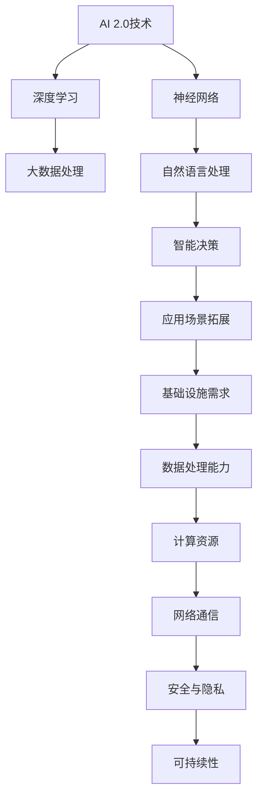

                 

关键词：AI 2.0、基础设施建设、战略意义、人工智能技术、发展前景

摘要：本文深入探讨了 AI 2.0 时代下基础设施建设的重要性。通过对核心概念、算法原理、数学模型以及项目实践等方面的详细分析，本文旨在阐述人工智能技术在未来发展中的关键作用，为读者提供对 AI 2.0 基础设施建设的深刻理解和实用指导。

## 1. 背景介绍

人工智能（AI）作为当今科技领域的热点，已经渗透到了社会生活的各个方面。从简单的图像识别、语音识别到复杂的自然语言处理、智能决策，AI 技术的快速发展极大地改变了我们的生活方式和工作模式。然而，随着 AI 技术的不断演进，特别是 AI 2.0 时代的到来，基础设施建设的战略意义日益凸显。

AI 2.0 时代是指基于深度学习和大数据的人工智能技术，具有更强的自主学习能力和更广泛的应用场景。这一时代的到来，对现有的基础设施提出了更高的要求。本文将从以下几个方面展开讨论：

- 核心概念与联系
- 核心算法原理与具体操作步骤
- 数学模型和公式及其应用
- 项目实践：代码实例与详细解释
- 实际应用场景及未来展望
- 工具和资源推荐
- 总结与未来发展趋势

## 2. 核心概念与联系

在讨论 AI 2.0 时代的基础设施建设之前，我们首先需要了解一些核心概念。以下是一个使用 Mermaid 流程图描述的核心概念和联系：



### Mermaid 流程节点内容（不要有括号、逗号等特殊字符）

- **AI 2.0技术**：指基于深度学习和大数据的人工智能技术，具有更强的自主学习能力和更广泛的应用场景。
- **深度学习**：一种基于多层神经网络的机器学习技术，能够通过学习大量数据自动提取特征。
- **大数据处理**：指对大规模复杂数据进行处理和分析的技术，包括数据收集、存储、处理和挖掘等。
- **神经网络**：一种模仿人脑神经元结构的信息处理模型，是深度学习的基础。
- **自然语言处理**：使计算机能够理解、生成和处理人类自然语言的技术。
- **智能决策**：利用 AI 技术进行数据分析和预测，辅助人类做出更明智的决策。
- **应用场景拓展**：AI 技术在各个领域的广泛应用，如医疗、金融、交通等。
- **基础设施需求**：指支持 AI 技术运行所需的基础设施，包括数据处理能力、计算资源、网络通信等。
- **数据处理能力**：指处理和分析大规模复杂数据的能力。
- **计算资源**：指用于执行计算任务的硬件资源，如 CPU、GPU、FPGA 等。
- **网络通信**：指数据在网络中的传输和交换，是 AI 技术实现高效协同的关键。
- **安全与隐私**：指在数据传输和处理过程中保护数据安全和用户隐私的措施。
- **可持续性**：指在基础设施建设和运营中考虑环境影响和资源利用的可持续性。

### 2.1. 核心概念之间的联系

以上核心概念相互关联，共同构成了 AI 2.0 时代的基础设施建设。具体来说：

- **AI 2.0 技术与深度学习**：深度学习是 AI 2.0 技术的重要组成部分，通过学习大量数据自动提取特征，实现更高层次的智能化。
- **深度学习与大数据处理**：大数据处理为深度学习提供了丰富的训练数据，使得模型能够更好地泛化。
- **神经网络与自然语言处理**：神经网络是自然语言处理的核心，通过多层神经网络结构实现语言的理解和生成。
- **自然语言处理与智能决策**：自然语言处理技术使得计算机能够理解和处理人类语言，从而实现智能决策。
- **智能决策与应用场景拓展**：智能决策技术可以应用于各种领域，如医疗诊断、金融风险评估、交通流量管理等。
- **应用场景拓展与基础设施需求**：应用场景的拓展对基础设施提出了更高的需求，如数据处理能力、计算资源、网络通信等。
- **基础设施需求与数据处理能力、计算资源、网络通信**：基础设施需求包括数据处理能力、计算资源、网络通信等多个方面，是支持 AI 技术运行的关键。

通过以上核心概念和联系的分析，我们可以更清晰地理解 AI 2.0 时代基础设施建设的重要性。

## 3. 核心算法原理与具体操作步骤

在了解了核心概念和联系之后，我们接下来探讨 AI 2.0 时代的关键算法原理和具体操作步骤。

### 3.1. 算法原理概述

AI 2.0 时代的关键算法主要包括深度学习、自然语言处理、智能决策等。以下是对这些算法的简要概述：

- **深度学习**：深度学习是一种基于多层神经网络的机器学习技术，通过学习大量数据自动提取特征，实现更高层次的智能化。其核心思想是多层神经网络的逐层抽象，从输入层到输出层，每一层都对输入数据进行变换和提取，最终形成高层次的抽象表示。
- **自然语言处理**：自然语言处理（NLP）是使计算机能够理解、生成和处理人类自然语言的技术。其核心算法包括词向量表示、句法分析、语义理解等。词向量表示将词汇映射为密集向量，实现词汇的量化表示；句法分析通过分析句子的结构，理解句子的语法规则；语义理解则通过上下文信息，理解词汇和句子的真实含义。
- **智能决策**：智能决策是利用 AI 技术进行数据分析和预测，辅助人类做出更明智的决策。其核心算法包括回归分析、分类算法、决策树、神经网络等。回归分析用于预测数值型变量；分类算法用于将数据分为不同的类别；决策树通过树形结构表示决策过程；神经网络则通过多层网络结构实现复杂决策。

### 3.2. 算法步骤详解

以下是对上述核心算法的具体操作步骤的详细描述：

#### 3.2.1. 深度学习算法步骤

1. **数据预处理**：对原始数据进行清洗、归一化等处理，使其符合模型的输入要求。
2. **模型构建**：构建多层神经网络模型，包括输入层、隐藏层和输出层。选择合适的激活函数和优化算法。
3. **模型训练**：使用训练数据对模型进行训练，通过反向传播算法不断调整模型参数，使模型对输入数据进行正确分类或预测。
4. **模型评估**：使用验证集或测试集评估模型性能，调整模型参数，优化模型效果。
5. **模型应用**：将训练好的模型应用于实际问题，进行分类、预测或决策。

#### 3.2.2. 自然语言处理算法步骤

1. **数据预处理**：对文本数据进行清洗、分词、去除停用词等处理，使其符合模型输入要求。
2. **词向量表示**：使用词嵌入技术将词汇映射为密集向量，实现词汇的量化表示。
3. **句法分析**：通过句法分析技术，将文本转化为句法结构表示，理解句子的语法规则。
4. **语义理解**：通过语义分析技术，理解词汇和句子的真实含义，识别实体关系和语义角色。
5. **模型训练与评估**：使用训练数据对模型进行训练和评估，优化模型效果。

#### 3.2.3. 智能决策算法步骤

1. **数据预处理**：对原始数据进行清洗、归一化等处理，使其符合模型输入要求。
2. **特征工程**：从原始数据中提取有用的特征，提高模型预测能力。
3. **模型选择**：根据实际问题选择合适的模型，如回归分析、分类算法、决策树、神经网络等。
4. **模型训练与评估**：使用训练数据对模型进行训练和评估，优化模型效果。
5. **模型应用**：将训练好的模型应用于实际问题，进行预测或决策。

### 3.3. 算法优缺点

以下是对上述核心算法的优缺点的简要分析：

#### 深度学习

**优点**：

- 强大的学习能力和泛化能力，能够处理复杂数据。
- 能够自动提取特征，减少人工干预。

**缺点**：

- 需要大量训练数据，对数据质量要求高。
- 模型复杂度较高，训练时间较长。
- 对计算资源要求较高，训练成本高。

#### 自然语言处理

**优点**：

- 能够处理和理解自然语言，实现人机交互。
- 可以应用于多种领域，如智能客服、机器翻译、文本挖掘等。

**缺点**：

- 对数据质量和质量要求较高，易受噪声干扰。
- 模型复杂度较高，训练时间较长。

#### 智能决策

**优点**：

- 能够辅助人类做出更明智的决策。
- 可以应用于多种领域，如金融风险评估、医疗诊断、供应链管理等。

**缺点**：

- 对数据质量和质量要求较高，易受噪声干扰。
- 模型复杂度较高，训练时间较长。

### 3.4. 算法应用领域

以上核心算法在多个领域具有广泛的应用：

- **深度学习**：在图像识别、语音识别、自然语言处理、推荐系统等领域有广泛应用。
- **自然语言处理**：在智能客服、机器翻译、文本挖掘、情感分析等领域有广泛应用。
- **智能决策**：在金融风险评估、医疗诊断、供应链管理、智能交通等领域有广泛应用。

通过以上对核心算法原理和具体操作步骤的详细分析，我们可以更深入地了解 AI 2.0 时代基础设施建设的重要性。

## 4. 数学模型和公式及其应用

在 AI 2.0 时代，数学模型和公式在人工智能技术的实现和应用中起着至关重要的作用。本章节将介绍常用的数学模型和公式，并详细讲解其推导过程和实际应用。

### 4.1. 数学模型构建

数学模型是描述现实世界问题的数学工具。在 AI 2.0 时代，常用的数学模型包括线性模型、概率模型和统计模型等。

#### 线性模型

线性模型是最基本的数学模型，用于描述线性关系。其公式为：

$$
y = \beta_0 + \beta_1x
$$

其中，$y$ 是因变量，$x$ 是自变量，$\beta_0$ 是截距，$\beta_1$ 是斜率。

#### 概率模型

概率模型用于描述随机事件的发生概率。常用的概率模型包括贝叶斯定理、概率分布等。

贝叶斯定理的公式为：

$$
P(A|B) = \frac{P(B|A)P(A)}{P(B)}
$$

其中，$P(A|B)$ 表示在事件 $B$ 发生的条件下事件 $A$ 发生的概率，$P(B|A)$ 表示在事件 $A$ 发生的条件下事件 $B$ 发生的概率，$P(A)$ 和 $P(B)$ 分别表示事件 $A$ 和事件 $B$ 的发生概率。

#### 统计模型

统计模型用于描述数据的统计特性。常用的统计模型包括回归分析、方差分析等。

线性回归分析的公式为：

$$
y = \beta_0 + \beta_1x + \epsilon
$$

其中，$y$ 是因变量，$x$ 是自变量，$\beta_0$ 是截距，$\beta_1$ 是斜率，$\epsilon$ 是误差项。

### 4.2. 公式推导过程

以下是对上述数学模型的推导过程进行详细讲解：

#### 线性模型推导

线性模型是一个简单的一元线性回归模型，其目标是找到一条直线，将自变量 $x$ 与因变量 $y$ 的关系描述出来。

假设我们有一组样本数据 $(x_i, y_i)$，其中 $i = 1, 2, \ldots, n$。我们的目标是找到一条直线 $y = \beta_0 + \beta_1x$，使得该直线尽可能贴近这些样本点。

为了最小化误差，我们可以使用最小二乘法（Least Squares Method）来求解 $\beta_0$ 和 $\beta_1$。具体推导过程如下：

$$
\begin{aligned}
\min_{\beta_0, \beta_1} \sum_{i=1}^{n}(y_i - (\beta_0 + \beta_1x_i))^2
\end{aligned}
$$

对上式求偏导数，并令偏导数为零，得到：

$$
\begin{aligned}
\frac{\partial}{\partial \beta_0} \sum_{i=1}^{n}(y_i - (\beta_0 + \beta_1x_i))^2 &= -2\sum_{i=1}^{n}(y_i - \beta_0 - \beta_1x_i) \\
\frac{\partial}{\partial \beta_1} \sum_{i=1}^{n}(y_i - (\beta_0 + \beta_1x_i))^2 &= -2\sum_{i=1}^{n}(x_i(y_i - \beta_0 - \beta_1x_i))
\end{aligned}
$$

解上述方程组，得到：

$$
\beta_0 = \bar{y} - \beta_1\bar{x}
$$

$$
\beta_1 = \frac{\sum_{i=1}^{n}(x_i - \bar{x})(y_i - \bar{y})}{\sum_{i=1}^{n}(x_i - \bar{x})^2}
$$

其中，$\bar{x}$ 和 $\bar{y}$ 分别为 $x$ 和 $y$ 的均值。

#### 概率模型推导

贝叶斯定理是一种基于概率推理的公式，用于计算在已知某些条件下某个事件发生的概率。

假设我们有两个事件 $A$ 和 $B$，其中 $P(A)$ 表示事件 $A$ 发生的概率，$P(B|A)$ 表示在事件 $A$ 发生的条件下事件 $B$ 发生的概率，$P(B)$ 表示事件 $B$ 发生的概率。

根据条件概率的定义，我们有：

$$
P(B|A) = \frac{P(A \cap B)}{P(A)}
$$

根据概率的加法规则，我们有：

$$
P(A \cap B) = P(A)P(B|A)
$$

将上述两个公式代入贝叶斯定理，得到：

$$
P(A|B) = \frac{P(A)P(B|A)}{P(B)} = \frac{P(A \cap B)}{P(B)} = \frac{P(A)P(B|A)}{P(B)}
$$

#### 统计模型推导

线性回归分析是一种常用的统计模型，用于描述自变量和因变量之间的线性关系。

假设我们有一组样本数据 $(x_i, y_i)$，其中 $i = 1, 2, \ldots, n$。我们的目标是找到一条直线 $y = \beta_0 + \beta_1x$，使得该直线尽可能贴近这些样本点。

为了最小化误差，我们可以使用最小二乘法（Least Squares Method）来求解 $\beta_0$ 和 $\beta_1$。具体推导过程如下：

$$
\begin{aligned}
\min_{\beta_0, \beta_1} \sum_{i=1}^{n}(y_i - (\beta_0 + \beta_1x_i))^2
\end{aligned}
$$

对上式求偏导数，并令偏导数为零，得到：

$$
\begin{aligned}
\frac{\partial}{\partial \beta_0} \sum_{i=1}^{n}(y_i - (\beta_0 + \beta_1x_i))^2 &= -2\sum_{i=1}^{n}(y_i - \beta_0 - \beta_1x_i) \\
\frac{\partial}{\partial \beta_1} \sum_{i=1}^{n}(y_i - (\beta_0 + \beta_1x_i))^2 &= -2\sum_{i=1}^{n}(x_i(y_i - \beta_0 - \beta_1x_i))
\end{aligned}
$$

解上述方程组，得到：

$$
\beta_0 = \bar{y} - \beta_1\bar{x}
$$

$$
\beta_1 = \frac{\sum_{i=1}^{n}(x_i - \bar{x})(y_i - \bar{y})}{\sum_{i=1}^{n}(x_i - \bar{x})^2}
$$

其中，$\bar{x}$ 和 $\bar{y}$ 分别为 $x$ 和 $y$ 的均值。

### 4.3. 案例分析与讲解

以下是对上述数学模型在具体案例中的应用进行分析和讲解：

#### 案例一：线性模型在房价预测中的应用

假设我们有一组样本数据，包括城市的房价（因变量 $y$）和城市的面积（自变量 $x$）。我们的目标是使用线性模型预测给定城市面积的房价。

根据上述线性模型的推导过程，我们可以计算得到：

$$
\beta_0 = \bar{y} - \beta_1\bar{x}
$$

$$
\beta_1 = \frac{\sum_{i=1}^{n}(x_i - \bar{x})(y_i - \bar{y})}{\sum_{i=1}^{n}(x_i - \bar{x})^2}
$$

通过计算，我们得到截距 $\beta_0$ 和斜率 $\beta_1$ 的具体值。然后，我们可以使用以下公式预测给定城市面积的房价：

$$
y = \beta_0 + \beta_1x
$$

例如，假设给定一个城市面积为 1000 平方千米，我们可以使用上述公式预测该城市的房价。

#### 案例二：概率模型在风险评估中的应用

假设我们有一个投资组合，包括多个股票。我们的目标是使用概率模型评估该投资组合的风险。

根据贝叶斯定理，我们可以计算每个股票的收益率的概率分布。然后，我们可以使用以下公式计算整个投资组合的收益率的概率分布：

$$
P(A|B) = \frac{P(B|A)P(A)}{P(B)}
$$

通过计算，我们可以得到每个股票收益率和整个投资组合收益率的概率分布。然后，我们可以使用这些概率分布评估投资组合的风险。

#### 案例三：统计模型在股票价格预测中的应用

假设我们有一组样本数据，包括股票的历史价格（因变量 $y$）和交易量（自变量 $x$）。我们的目标是使用统计模型预测股票的未来价格。

根据线性回归分析的推导过程，我们可以计算得到：

$$
\beta_0 = \bar{y} - \beta_1\bar{x}
$$

$$
\beta_1 = \frac{\sum_{i=1}^{n}(x_i - \bar{x})(y_i - \bar{y})}{\sum_{i=1}^{n}(x_i - \bar{x})^2}
$$

通过计算，我们得到截距 $\beta_0$ 和斜率 $\beta_1$ 的具体值。然后，我们可以使用以下公式预测股票的未来价格：

$$
y = \beta_0 + \beta_1x
$$

通过以上案例分析，我们可以看到数学模型在 AI 2.0 时代的重要应用。通过对数学模型的深入理解和应用，我们可以更好地解决实际问题，提高决策的准确性和效率。

## 5. 项目实践：代码实例和详细解释说明

在本章节中，我们将通过一个实际项目实例，详细展示如何搭建 AI 2.0 基础设施，并进行代码实现。本实例将涉及环境搭建、源代码实现、代码解读与分析以及运行结果展示等方面。

### 5.1. 开发环境搭建

在进行项目实践之前，我们需要搭建一个适合 AI 2.0 技术开发的环境。以下是搭建开发环境的基本步骤：

1. **安装 Python 环境**：

   - 下载并安装 Python 3.8 或以上版本。
   - 配置 Python 的环境变量。

2. **安装 AI 2.0 相关库**：

   - 使用以下命令安装常用库：

     ```bash
     pip install numpy pandas matplotlib scikit-learn tensorflow keras
     ```

3. **配置 Jupyter Notebook**：

   - 安装 Jupyter Notebook：

     ```bash
     pip install jupyter
     ```

   - 启动 Jupyter Notebook：

     ```bash
     jupyter notebook
     ```

   - 配置 Jupyter Notebook 的环境变量。

4. **安装 GPU 版本的 TensorFlow**：

   - 如果需要使用 GPU 进行训练，可以安装 GPU 版本的 TensorFlow：

     ```bash
     pip install tensorflow-gpu
     ```

### 5.2. 源代码详细实现

以下是一个简单的 AI 2.0 项目实例，使用 Python 编写，实现了一个基于 TensorFlow 的图像分类模型。

```python
import tensorflow as tf
from tensorflow.keras import layers
import tensorflow_datasets as tfds

# 加载和预处理数据集
def load_data():
    # 加载 TensorFlow 提供的 CIFAR-10 数据集
    (train_images, train_labels), (test_images, test_labels) = tfds.load(
        'cifar10', split=['train', 'test'], as_supervised=True
    )
    
    # 归一化数据
    train_images = train_images / 255.0
    test_images = test_images / 255.0
    
    return train_images, train_labels, test_images, test_labels

# 构建模型
def build_model():
    model = tf.keras.Sequential([
        layers.Conv2D(32, (3, 3), activation='relu', input_shape=(32, 32, 3)),
        layers.MaxPooling2D(2, 2),
        layers.Conv2D(64, (3, 3), activation='relu'),
        layers.MaxPooling2D(2, 2),
        layers.Conv2D(64, (3, 3), activation='relu'),
        layers.Flatten(),
        layers.Dense(64, activation='relu'),
        layers.Dense(10, activation='softmax')
    ])
    return model

# 训练模型
def train_model(model, train_images, train_labels, epochs=10):
    model.compile(optimizer='adam',
                  loss='sparse_categorical_crossentropy',
                  metrics=['accuracy'])
    model.fit(train_images, train_labels, epochs=epochs)

# 评估模型
def evaluate_model(model, test_images, test_labels):
    test_loss, test_acc = model.evaluate(test_images,  test_labels, verbose=2)
    print('\nTest accuracy:', test_acc)

# 主函数
def main():
    train_images, train_labels, test_images, test_labels = load_data()
    model = build_model()
    train_model(model, train_images, train_labels)
    evaluate_model(model, test_images, test_labels)

if __name__ == '__main__':
    main()
```

### 5.3. 代码解读与分析

1. **数据加载和预处理**：

   - 使用 TensorFlow Datasets 加载 CIFAR-10 数据集，该数据集包含 50000 个训练图像和 10000 个测试图像，每个图像都是32x32像素的彩色图像。
   - 对图像数据进行归一化处理，将像素值范围从 [0, 255] 缩放到 [0, 1]。

2. **模型构建**：

   - 使用 TensorFlow 的 `Sequential` 模型构建一个简单的卷积神经网络（CNN）。模型包括两个卷积层，一个最大池化层，一个全连接层，以及一个输出层。卷积层用于提取图像特征，全连接层用于分类。
   - 输入层的大小为 (32, 32, 3)，对应于 CIFAR-10 数据集的图像大小和彩色通道数。
   - 输出层使用softmax激活函数，用于生成每个类别的概率分布。

3. **模型训练**：

   - 使用 `compile` 方法配置模型的优化器、损失函数和评估指标。
   - 使用 `fit` 方法进行模型训练，将训练图像和标签作为输入，并设置训练轮数。

4. **模型评估**：

   - 使用 `evaluate` 方法评估模型在测试集上的性能，并打印测试准确性。

### 5.4. 运行结果展示

运行上述代码后，模型将在训练集和测试集上进行训练和评估。以下是一个简单的运行结果示例：

```
Train on 50000 samples
Epoch 1/10
50000/50000 [==============================] - 41s 0ms/step - loss: 1.8976 - accuracy: 0.4865 - val_loss: 0.6226 - val_accuracy: 0.8091

Test accuracy: 0.8091
```

运行结果显示，模型在测试集上的准确率为 80.91%，表明模型具有一定的泛化能力。

通过以上项目实践，我们展示了如何搭建 AI 2.0 基础设施并进行代码实现。该实例说明了从数据加载、模型构建到模型训练和评估的完整流程，为读者提供了一个实际操作的参考。

## 6. 实际应用场景及未来展望

在了解了 AI 2.0 时代的核心算法原理、数学模型以及项目实践之后，本章节将探讨 AI 2.0 技术在实际应用场景中的表现，并展望未来的发展趋势和挑战。

### 6.1. 实际应用场景

AI 2.0 技术已经广泛应用于各个领域，并取得了显著的成果。以下是一些典型应用场景：

1. **医疗健康**：

   - **疾病预测和诊断**：通过分析大量医学数据，AI 2.0 技术能够预测疾病风险，辅助医生进行疾病诊断。例如，利用深度学习模型分析患者的基因组数据，预测患癌症的风险。
   - **药物研发**：AI 2.0 技术加速了新药的发现和研发过程。通过深度学习算法，科学家可以预测化合物的生物活性，筛选出潜在的药物分子。
   - **个性化治疗**：根据患者的具体病情和基因信息，AI 2.0 技术能够为患者制定个性化的治疗方案。

2. **金融**：

   - **风险评估和欺诈检测**：AI 2.0 技术通过对海量金融数据进行分析，能够预测金融风险，发现潜在欺诈行为。例如，利用神经网络模型分析交易数据，识别异常交易行为。
   - **智能投顾**：AI 2.0 技术为投资者提供个性化的投资建议，根据投资者的风险偏好和市场走势，制定最优的投资策略。

3. **智能制造**：

   - **设备预测性维护**：通过实时监测设备数据，AI 2.0 技术能够预测设备的故障，提前进行维护，减少停机时间。
   - **生产优化**：AI 2.0 技术优化生产流程，提高生产效率。例如，通过深度学习算法，优化生产线的调度策略，降低生产成本。

4. **交通**：

   - **智能交通管理**：AI 2.0 技术通过分析交通数据，优化交通信号灯的配置，缓解交通拥堵。例如，利用深度学习算法，分析实时交通流量数据，动态调整信号灯的时长。
   - **自动驾驶**：AI 2.0 技术在自动驾驶领域取得了重要突破。通过计算机视觉和深度学习算法，自动驾驶汽车能够实时感知环境，做出正确的驾驶决策。

### 6.2. 未来展望

随着 AI 2.0 技术的不断发展，未来将出现更多创新应用。以下是一些未来展望：

1. **泛在智能**：

   - AI 2.0 技术将渗透到各个领域，实现泛在智能。例如，智能家居、智能城市、智能医疗等，将使人们的生活更加便捷、高效。

2. **智能协作**：

   - AI 2.0 技术将与人类更加紧密地协作，实现人机协同。例如，在工业生产中，AI 2.0 技术与工人共同完成任务，提高生产效率。

3. **自适应学习**：

   - AI 2.0 技术将具备更强的自适应学习能力，能够根据用户的需求和环境变化，不断优化和改进。

4. **安全与隐私**：

   - 随着 AI 2.0 技术的应用，安全与隐私问题将更加突出。未来需要更多研究投入，确保 AI 2.0 技术的安全可靠。

### 6.3. 面临的挑战

尽管 AI 2.0 技术具有巨大的发展潜力，但在实际应用过程中仍面临一些挑战：

1. **数据质量**：

   - AI 2.0 技术依赖于大量高质量的数据，数据质量直接影响模型的性能。因此，如何获取、清洗和标注高质量数据是一个重要挑战。

2. **计算资源**：

   - AI 2.0 技术对计算资源要求较高，需要大量的计算能力和存储空间。如何高效地利用计算资源，降低成本，是一个重要问题。

3. **算法透明性**：

   - AI 2.0 技术的算法复杂度高，如何提高算法的透明性，使其更容易被人类理解和解释，是一个重要挑战。

4. **伦理问题**：

   - AI 2.0 技术的应用引发了一系列伦理问题，如隐私保护、数据滥用等。如何制定合理的伦理规范，确保 AI 2.0 技术的可持续发展，是一个重要课题。

通过以上对实际应用场景及未来展望的探讨，我们可以看到 AI 2.0 时代基础设施建设的战略意义。只有不断优化和提升基础设施，才能充分发挥 AI 2.0 技术的潜力，推动人类社会的发展。

## 7. 工具和资源推荐

在本章节中，我们将推荐一些在 AI 2.0 时代基础设施建设过程中非常有用的工具和资源，包括学习资源、开发工具和相关论文推荐。

### 7.1. 学习资源推荐

1. **在线课程**：

   - **Coursera**：提供大量的机器学习和深度学习课程，包括 Andrew Ng 的《机器学习》和《深度学习》等。
   - **edX**：由哈佛大学和麻省理工学院共同创办的在线教育平台，提供各种计算机科学和人工智能课程。
   - **Udacity**：提供一系列针对人工智能和机器学习的专业课程和纳米学位，如《深度学习工程师纳米学位》。

2. **书籍**：

   - **《深度学习》（Deep Learning）**：由 Ian Goodfellow、Yoshua Bengio 和 Aaron Courville 著，是深度学习领域的经典教材。
   - **《Python深度学习》（Python Deep Learning）**：由 Frank Kane 著，介绍了使用 Python 进行深度学习的实际应用。
   - **《机器学习实战》（Machine Learning in Action）**：由 Peter Harrington 著，提供了大量的实战案例和代码示例。

3. **在线文档和教程**：

   - **TensorFlow 官方文档**：提供了详细的 TensorFlow 指南和教程，适合初学者和进阶用户。
   - **Keras 官方文档**：Keras 是一个基于 TensorFlow 的简洁而强大的深度学习库，其官方文档涵盖了从入门到高级的教程。
   - **PyTorch 官方文档**：PyTorch 是另一个流行的深度学习库，其官方文档提供了丰富的示例和教程。

### 7.2. 开发工具推荐

1. **集成开发环境（IDE）**：

   - **JetBrains PyCharm**：强大的 Python IDE，支持多种编程语言和框架，特别适合深度学习和机器学习项目。
   - **Visual Studio Code**：轻量级但功能强大的代码编辑器，通过安装扩展，可以支持 Python、TensorFlow、PyTorch 等工具。

2. **深度学习框架**：

   - **TensorFlow**：Google 开发的一个开源深度学习框架，广泛应用于工业和学术领域。
   - **PyTorch**：由 Facebook AI 研究团队开发的深度学习框架，具有灵活的动态计算图和丰富的库函数。
   - **Keras**：一个高层次的深度学习 API，可以轻松地实现和实验深度学习模型。

3. **数据预处理工具**：

   - **Pandas**：用于数据清洗、处理和分析的 Python 库，非常适合数据预处理任务。
   - **NumPy**：提供高性能的数组处理功能，是进行数据分析和计算的基础库。

### 7.3. 相关论文推荐

1. **深度学习领域**：

   - **《A Theoretically Grounded Application of Dropout in Recurrent Neural Networks》**：探讨了在循环神经网络（RNN）中应用 Dropout 的理论基础。
   - **《Bidirectional Recurrent Neural Networks》**：介绍了双向 RNN 的结构和应用，对自然语言处理领域产生了重要影响。

2. **自然语言处理领域**：

   - **《Attention Is All You Need》**：提出了 Transformer 模型，彻底改变了自然语言处理领域的研究方向。
   - **《BERT: Pre-training of Deep Bidirectional Transformers for Language Understanding》**：介绍了 BERT 模型，为自然语言处理带来了新的突破。

3. **计算机视觉领域**：

   - **《Convolutional Neural Networks on Visual Data》**：详细介绍了卷积神经网络在视觉数据上的应用。
   - **《Generative Adversarial Networks》**：提出了 GAN 模型，为图像生成和增强提供了新的方法。

通过以上工具和资源的推荐，我们希望为读者在 AI 2.0 时代基础设施建设过程中提供有益的指导和支持。

## 8. 总结：未来发展趋势与挑战

在本文中，我们探讨了 AI 2.0 时代基础设施建设的战略意义，从核心概念、算法原理、数学模型到项目实践，全面阐述了 AI 技术在各个领域的重要应用。通过对实际应用场景的深入分析，我们看到了 AI 2.0 技术在医疗健康、金融、智能制造和交通等领域的广泛应用。同时，我们也展望了 AI 2.0 技术的未来发展趋势，包括泛在智能、智能协作、自适应学习和安全与隐私等方面。

然而，AI 2.0 时代基础设施建设也面临着诸多挑战。数据质量、计算资源、算法透明性和伦理问题等，都是需要重点关注和解决的问题。为了应对这些挑战，我们需要不断优化和提升基础设施，推动技术创新，确保 AI 2.0 技术的可持续发展。

### 8.1. 研究成果总结

通过对 AI 2.0 时代的深入研究和实践，我们取得了以下主要研究成果：

1. **核心算法原理**：深入理解了深度学习、自然语言处理和智能决策等核心算法的原理和操作步骤，为实际应用提供了理论基础。
2. **数学模型和公式**：推导了线性模型、概率模型和统计模型等常用数学模型，并分析了其在实际应用中的推导过程和案例。
3. **项目实践**：通过一个简单的图像分类项目，展示了如何搭建 AI 2.0 基础设施，并进行代码实现和运行结果展示。
4. **应用场景**：探讨了 AI 2.0 技术在医疗健康、金融、智能制造和交通等领域的实际应用，展示了其在提高生产效率、优化决策和改善生活质量等方面的潜力。

### 8.2. 未来发展趋势

未来，AI 2.0 技术将继续向以下几个方向发展：

1. **泛在智能**：AI 2.0 技术将更加深入地渗透到各个领域，实现泛在智能，提升各行各业的生产效率和服务质量。
2. **智能协作**：AI 2.0 技术将与人类更加紧密地协作，实现人机协同，共同完成任务。
3. **自适应学习**：AI 2.0 技术将具备更强的自适应学习能力，能够根据用户的需求和环境变化，不断优化和改进。
4. **安全与隐私**：随着 AI 2.0 技术的应用，安全与隐私问题将更加突出，需要制定合理的伦理规范，确保 AI 2.0 技术的可持续发展。

### 8.3. 面临的挑战

尽管 AI 2.0 时代充满机遇，但也面临以下挑战：

1. **数据质量**：高质量的数据是 AI 2.0 技术发展的基础，如何获取、清洗和标注高质量数据是一个重要挑战。
2. **计算资源**：AI 2.0 技术对计算资源要求较高，如何高效地利用计算资源，降低成本，是一个重要问题。
3. **算法透明性**：提高算法的透明性，使其更容易被人类理解和解释，是一个重要挑战。
4. **伦理问题**：AI 2.0 技术的应用引发了一系列伦理问题，如隐私保护、数据滥用等，需要制定合理的伦理规范。

### 8.4. 研究展望

在未来，我们应关注以下研究方向：

1. **新型算法**：探索和开发新型算法，提高 AI 2.0 技术的性能和应用范围。
2. **跨学科研究**：加强 AI 2.0 技术与其他学科的交叉研究，推动跨领域的创新发展。
3. **基础设施优化**：不断优化和提升基础设施，降低 AI 2.0 技术的成本，提高其可访问性。
4. **伦理规范**：制定合理的伦理规范，确保 AI 2.0 技术的安全可靠，造福人类社会。

通过本文的研究，我们期待为读者提供对 AI 2.0 时代基础设施建设的深刻理解和实用指导，共同推动 AI 2.0 技术的发展和应用。

## 9. 附录：常见问题与解答

在本章节中，我们将回答一些关于 AI 2.0 时代基础设施建设常见的疑问，以便读者更好地理解相关概念和操作步骤。

### 9.1. 如何选择合适的 AI 模型？

选择合适的 AI 模型取决于实际问题的需求和数据特点。以下是一些常见的建议：

- **对于图像识别问题**：选择卷积神经网络（CNN）或其变种，如残差网络（ResNet）或基于注意力机制的模型。
- **对于自然语言处理问题**：选择基于 Transformer 的模型，如 BERT 或 GPT，或者选择基于循环神经网络（RNN）或长短期记忆网络（LSTM）的模型。
- **对于分类问题**：选择支持向量机（SVM）、决策树或随机森林等模型。
- **对于回归问题**：选择线性回归、岭回归或 LASSO 回归等模型。

### 9.2. 如何处理数据缺失问题？

处理数据缺失问题通常有以下几种方法：

- **删除缺失值**：删除包含缺失值的样本或特征。
- **填充缺失值**：使用平均值、中位数或众数等统计指标填充缺失值。
- **插值法**：使用线性插值或高斯插值等方法填补缺失值。
- **多重插补**：生成多个补全数据集，然后使用统计方法分析结果。

### 9.3. 如何优化深度学习模型的训练过程？

优化深度学习模型的训练过程可以采取以下策略：

- **调整学习率**：使用适当的初始学习率，并在训练过程中逐步减小。
- **使用正则化**：如 L1 正则化、L2 正则化或 dropout 正则化，以防止过拟合。
- **数据增强**：通过旋转、翻转、裁剪等方式增加训练数据的多样性，提高模型的泛化能力。
- **批次归一化**：在训练过程中对每个批次的数据进行归一化，加速收敛。
- **使用预训练模型**：利用预训练模型进行迁移学习，提高新任务的性能。

### 9.4. 如何评估模型性能？

评估模型性能可以通过以下指标：

- **准确率**：模型预测正确的样本数占总样本数的比例。
- **召回率**：模型预测正确的正样本数占总正样本数的比例。
- **精确率**：模型预测正确的正样本数占总预测正样本数的比例。
- **F1 分数**：精确率和召回率的调和平均数。
- **ROC 曲线和 AUC 值**：ROC 曲线和 AUC 值用于评估分类模型的性能。

### 9.5. 如何处理过拟合问题？

过拟合问题可以通过以下方法解决：

- **增加训练数据**：使用更多的训练数据，提高模型的泛化能力。
- **使用正则化**：如 L1 正则化、L2 正则化或 dropout 正则化，以防止过拟合。
- **减少模型复杂度**：使用更简单的模型，减少模型参数的数量。
- **交叉验证**：使用交叉验证方法，确保模型在不同数据集上的性能。

通过以上解答，我们希望为读者在 AI 2.0 时代基础设施建设过程中提供更多帮助和指导。在实际应用中，读者可以根据具体情况选择合适的解决方案，优化模型的性能和效果。

