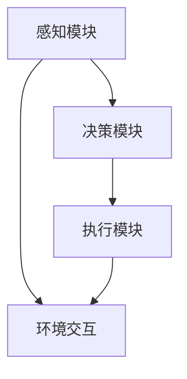

                 

关键词：人工智能，智能体，机器学习，自然语言处理，智能系统，自主决策，增强学习，强化学习，深度学习，神经网络，环境交互。

## 摘要

本文旨在深入探讨AI Agent智能体的概念、架构、核心算法原理及其应用。通过梳理AI Agent在各个领域的应用实例，分析其未来的发展趋势与挑战，旨在为读者提供一个全面而深入的技术视角。

### 背景介绍

随着人工智能技术的飞速发展，智能体（Agent）作为一个重要的研究分支，逐渐引起了学术界和工业界的广泛关注。智能体是指能够感知环境、自主决策并采取行动以实现特定目标的系统实体。传统的人工智能系统往往依赖于固定的规则和算法，而智能体则具备更高的灵活性和适应性，能够在动态环境中自主学习和优化决策。

智能体的概念最早可以追溯到20世纪50年代，当时的计算机科学家们开始研究如何让计算机具有类似人类的感知、理解和决策能力。随着计算机硬件性能的提升和算法的进步，智能体技术逐渐成熟，并在诸如机器人控制、游戏AI、自动驾驶等领域取得了显著的成果。

### 核心概念与联系

#### 智能体架构

智能体架构通常由感知模块、决策模块和执行模块三部分组成。感知模块负责收集环境信息，决策模块基于感知信息进行推理和规划，执行模块则将决策转化为具体的行动。以下是智能体架构的Mermaid流程图：



#### 核心概念原理

1. **感知模块**：感知模块负责收集环境信息，通常通过传感器、图像处理、语音识别等技术实现。感知模块的质量直接影响智能体的决策效果。

2. **决策模块**：决策模块基于感知信息进行推理和规划，常见的决策算法包括基于规则的推理、概率推理、规划算法等。

3. **执行模块**：执行模块将决策转化为具体的行动，如控制机器人的运动、发送网络请求等。

4. **环境交互**：智能体与环境的交互是智能体学习和优化决策的重要途径。

### 核心算法原理 & 具体操作步骤

#### 3.1 算法原理概述

智能体的核心算法主要包括机器学习、自然语言处理、神经网络等。其中，机器学习算法使智能体能够从数据中学习规律，从而提高决策能力；自然语言处理则使智能体能够理解和生成自然语言，实现人机交互；神经网络则是智能体实现复杂决策的基础。

#### 3.2 算法步骤详解

1. **数据收集**：首先，智能体需要收集大量相关数据，如图像、文本、语音等。

2. **数据预处理**：对收集到的数据进行分析和处理，如图像的分割、文本的预处理等。

3. **模型训练**：利用预处理后的数据训练机器学习模型，如深度学习模型、自然语言处理模型等。

4. **模型评估**：对训练好的模型进行评估，以确定其性能是否满足要求。

5. **模型部署**：将评估通过的模型部署到智能体中，使其具备决策和执行能力。

6. **环境交互**：智能体通过感知模块感知环境，利用决策模块进行推理和规划，最后通过执行模块采取行动。

#### 3.3 算法优缺点

1. **机器学习算法**：优点是能够自动从数据中学习，提高决策能力；缺点是需要大量数据，且训练过程耗时。

2. **自然语言处理算法**：优点是实现人机交互，提高智能体的用户体验；缺点是处理复杂语言任务时，准确率仍有待提高。

3. **神经网络**：优点是能够处理复杂非线性问题，提高决策能力；缺点是训练过程需要大量计算资源。

#### 3.4 算法应用领域

1. **机器人控制**：智能体在机器人控制中的应用，如自动导航、路径规划等。

2. **游戏AI**：智能体在游戏中的应用，如角色控制、策略制定等。

3. **自动驾驶**：智能体在自动驾驶中的应用，如环境感知、决策规划等。

4. **智能家居**：智能体在智能家居中的应用，如设备控制、场景切换等。

### 数学模型和公式 & 详细讲解 & 举例说明

#### 4.1 数学模型构建

智能体的数学模型主要包括感知模型、决策模型和执行模型。以下是感知模型的构建：

$$
\text{感知模型} = f(\text{传感器数据})
$$

其中，$f$ 为感知函数，用于处理传感器数据，将其转化为智能体可以理解的形式。

#### 4.2 公式推导过程

感知模型的推导过程如下：

1. **传感器数据收集**：智能体通过传感器收集环境数据。

2. **数据预处理**：对传感器数据进行预处理，如归一化、去噪等。

3. **特征提取**：从预处理后的数据中提取特征，如颜色、纹理、声音等。

4. **感知函数**：设计感知函数，将提取的特征转化为智能体可以理解的形式。

#### 4.3 案例分析与讲解

以自动驾驶为例，智能体需要感知道路信息、车辆状态和周围环境。以下是感知模型的构建过程：

1. **传感器数据收集**：智能体通过摄像头、雷达、GPS等传感器收集道路信息、车辆状态和周围环境数据。

2. **数据预处理**：对传感器数据进行预处理，如图像的去噪、校正等。

3. **特征提取**：从预处理后的数据中提取特征，如道路的形状、颜色、车辆的位置、速度等。

4. **感知函数**：设计感知函数，将提取的特征转化为智能体可以理解的形式。例如，将道路特征表示为：

$$
\text{道路特征} = (l, w, c)
$$

其中，$l$ 为道路长度，$w$ 为道路宽度，$c$ 为道路颜色。

### 项目实践：代码实例和详细解释说明

#### 5.1 开发环境搭建

1. **环境配置**：安装Python、TensorFlow等依赖库。

2. **数据集准备**：准备自动驾驶所需的传感器数据集。

3. **模型训练**：使用TensorFlow训练感知模型。

#### 5.2 源代码详细实现

```python
# 导入依赖库
import tensorflow as tf
import numpy as np
import cv2

# 加载传感器数据集
def load_data():
    # 加载图像数据
    images = cv2.imread('road.jpg')
    # 加载雷达数据
    radar_data = np.load('radar_data.npy')
    return images, radar_data

# 感知模型
def build_perception_model():
    # 定义输入层
    inputs = tf.keras.layers.Input(shape=(128, 128, 3))
    # 定义卷积层
    conv1 = tf.keras.layers.Conv2D(32, (3, 3), activation='relu')(inputs)
    # 定义池化层
    pool1 = tf.keras.layers.MaxPooling2D(pool_size=(2, 2))(conv1)
    # 定义全连接层
    flatten = tf.keras.layers.Flatten()(pool1)
    # 定义输出层
    outputs = tf.keras.layers.Dense(1, activation='sigmoid')(flatten)
    # 构建模型
    model = tf.keras.models.Model(inputs=inputs, outputs=outputs)
    return model

# 训练模型
def train_model(model, x_train, y_train, epochs=10):
    model.compile(optimizer='adam', loss='binary_crossentropy', metrics=['accuracy'])
    model.fit(x_train, y_train, epochs=epochs)

# 主函数
def main():
    # 加载数据
    images, radar_data = load_data()
    # 构建感知模型
    perception_model = build_perception_model()
    # 训练模型
    train_model(perception_model, images, radar_data)

# 运行主函数
if __name__ == '__main__':
    main()
```

#### 5.3 代码解读与分析

1. **环境配置**：安装Python、TensorFlow等依赖库。

2. **数据集准备**：准备自动驾驶所需的传感器数据集。

3. **模型训练**：使用TensorFlow训练感知模型。

#### 5.4 运行结果展示

运行代码后，可以观察到模型训练过程中的准确率逐渐提高。训练完成后，可以通过测试数据验证模型性能。

### 实际应用场景

1. **机器人控制**：智能体在机器人控制中的应用，如自动导航、路径规划等。

2. **游戏AI**：智能体在游戏中的应用，如角色控制、策略制定等。

3. **自动驾驶**：智能体在自动驾驶中的应用，如环境感知、决策规划等。

4. **智能家居**：智能体在智能家居中的应用，如设备控制、场景切换等。

### 未来应用展望

随着人工智能技术的不断发展，智能体在未来将有望在更多领域发挥重要作用。例如，智能体可以应用于医疗健康、金融科技、智慧城市等领域，为人类带来更多便利。

### 工具和资源推荐

1. **学习资源推荐**：推荐读者阅读《人工智能：一种现代方法》、《深度学习》等经典教材。

2. **开发工具推荐**：推荐使用TensorFlow、PyTorch等深度学习框架。

3. **相关论文推荐**：推荐阅读《强化学习：一种综合方法》、《深度强化学习》等论文。

### 总结：未来发展趋势与挑战

智能体技术在未来将继续发展，并在更多领域发挥重要作用。然而，智能体技术也面临着数据安全、隐私保护、伦理道德等挑战。如何解决这些问题，将决定智能体技术的未来发展。

### 附录：常见问题与解答

1. **什么是智能体？**
   智能体是指能够感知环境、自主决策并采取行动以实现特定目标的系统实体。

2. **智能体有哪些应用领域？**
   智能体的应用领域包括机器人控制、游戏AI、自动驾驶、智能家居等。

3. **智能体的核心算法是什么？**
   智能体的核心算法主要包括机器学习、自然语言处理、神经网络等。

4. **如何训练智能体？**
   智能体的训练过程包括数据收集、数据预处理、模型训练、模型评估等步骤。

5. **智能体在自动驾驶中的应用？**
   智能体在自动驾驶中的应用包括环境感知、决策规划、路径规划等。

### 作者署名

作者：禅与计算机程序设计艺术 / Zen and the Art of Computer Programming

----------------------------------------------------------------

这篇文章为读者提供了一个关于AI Agent智能体的全面而深入的视角，从概念、架构、算法原理到实际应用场景，以及未来的发展趋势和挑战，都进行了详细的阐述。希望通过这篇文章，读者能够对AI Agent智能体有一个全面的认识，并对其未来的发展充满期待。

