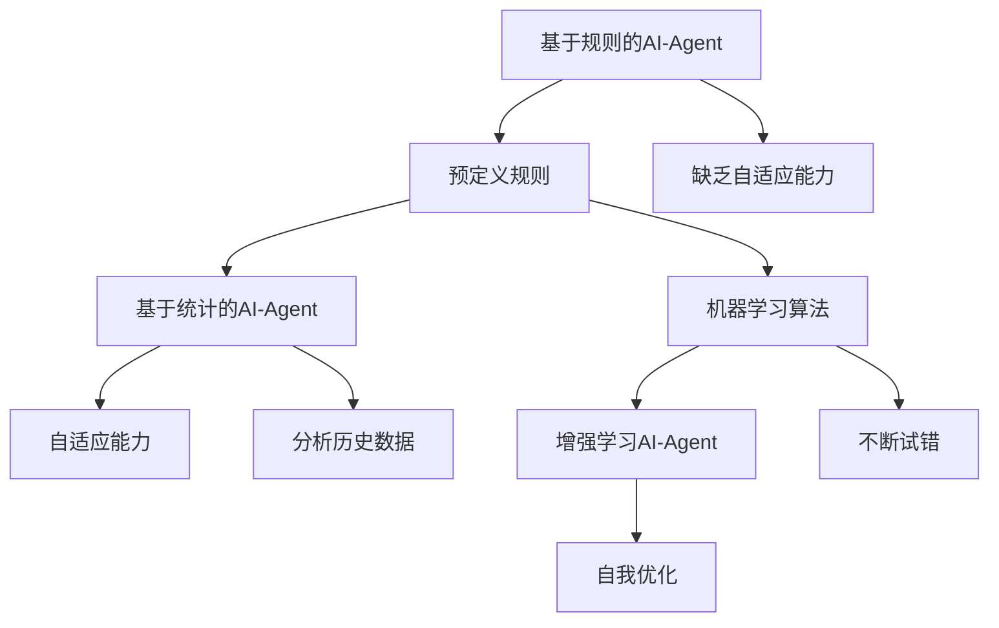

                 

关键词：人工智能，AI-Agent，进化，架构，算法，数学模型，应用场景，未来展望

> 摘要：本文旨在深入探讨人工智能（AI）领域的一个重要方向——AI-Agent，从其起源与演变出发，详细解析其核心概念、算法原理、数学模型及其在实际应用中的表现。通过本文的阅读，读者将全面了解AI-Agent的发展历程、关键技术以及未来发展趋势。

## 1. 背景介绍

人工智能（Artificial Intelligence，简称AI）是计算机科学的一个分支，旨在通过机器模拟人类智能，实现机器自主学习和决策。自20世纪50年代以来，AI领域经历了多个发展阶段，从早期的符号主义、基于规则的系统到基于统计的机器学习，再到深度学习和强化学习，每一次技术的进步都为AI的发展奠定了坚实的基础。

在AI的众多子领域里，AI-Agent（人工智能代理）是一个备受关注的方向。AI-Agent是一种具有自主行为能力的计算机程序，能够在其环境中感知、决策和执行任务。与传统的规则引擎和基于统计的机器学习模型相比，AI-Agent能够更加灵活地适应动态和复杂的环境，具有高度的自主性和智能性。因此，AI-Agent在智能机器人、自动驾驶、智能客服、金融交易等领域具有广泛的应用前景。

## 2. 核心概念与联系

### 2.1 定义与分类

AI-Agent的定义可以从不同角度进行理解。从广义上讲，AI-Agent是一种具有自主性、社会性和智能性的实体，能够在复杂环境中自主行动，以达成特定目标。根据AI-Agent的功能和行为特点，可以将其分为以下几类：

1. **基于规则的AI-Agent**：这种类型的AI-Agent通过预定义的规则集来执行任务，缺乏自适应能力。
2. **基于统计的AI-Agent**：这种类型的AI-Agent使用机器学习算法，通过分析历史数据来预测和决策。
3. **基于增强学习的AI-Agent**：这种类型的AI-Agent通过不断试错和自我优化，来提高其行为效果。

### 2.2 Mermaid 流程图



### 2.3 核心概念联系

AI-Agent的核心概念包括感知、决策和执行。感知是AI-Agent获取环境信息的过程，决策是根据感知到的信息进行行动选择，执行是执行选定的行动。这三个过程相互关联，形成一个闭环系统，确保AI-Agent能够有效地应对动态和复杂的环境。

## 3. 核心算法原理 & 具体操作步骤

### 3.1 算法原理概述

AI-Agent的核心算法主要包括感知、决策和执行三个部分。以下分别对这三个部分进行简要介绍：

1. **感知算法**：感知算法负责从环境中获取信息，通常使用传感器或视觉图像处理技术。感知算法的关键在于如何有效地提取环境中的关键特征，以及如何将这些特征转换为可用的信息。

2. **决策算法**：决策算法根据感知到的信息进行行动选择。常用的决策算法包括基于规则的推理、基于统计的预测和基于增强学习的优化。

3. **执行算法**：执行算法负责将决策结果转化为实际的行为。执行算法的关键在于如何确保行动的有效性和鲁棒性，以应对环境中的不确定性和变化。

### 3.2 算法步骤详解

1. **感知阶段**：

   - 使用传感器或图像处理技术获取环境信息。
   - 对获取的信息进行预处理，包括降噪、去噪和特征提取。

2. **决策阶段**：

   - 基于感知到的信息，使用规则库或机器学习模型进行决策。
   - 选择最优的行动方案，通常采用优化算法或强化学习算法。

3. **执行阶段**：

   - 根据决策结果，执行具体的行动。
   - 对执行结果进行监控和反馈，以调整后续的决策和行动。

### 3.3 算法优缺点

- **优点**：AI-Agent能够自主学习和适应环境，具有高度的灵活性和智能性。
- **缺点**：AI-Agent的开发和维护成本较高，且在复杂和动态环境中容易出现不稳定或失效的情况。

### 3.4 算法应用领域

AI-Agent在多个领域具有广泛的应用前景，主要包括：

1. **智能机器人**：AI-Agent能够帮助机器人进行自主导航、路径规划和任务执行。
2. **自动驾驶**：AI-Agent在自动驾驶系统中负责感知环境、决策路径和执行动作。
3. **智能客服**：AI-Agent能够模拟人类客服，进行智能对话和问题解决。
4. **金融交易**：AI-Agent能够根据市场数据进行分析和预测，进行高频交易和风险管理。

## 4. 数学模型和公式 & 详细讲解 & 举例说明

### 4.1 数学模型构建

AI-Agent的数学模型通常包括感知模型、决策模型和执行模型。以下分别对这三个模型进行简要介绍：

1. **感知模型**：感知模型用于表示AI-Agent从环境中获取信息的过程，通常使用概率模型或贝叶斯网络来描述。

2. **决策模型**：决策模型用于表示AI-Agent根据感知到的信息进行决策的过程，通常使用优化模型或决策树来描述。

3. **执行模型**：执行模型用于表示AI-Agent将决策结果转化为实际行为的过程，通常使用动态规划或马尔可夫决策过程来描述。

### 4.2 公式推导过程

以下是感知模型的一个简单例子：

$$
P(E|A) = \frac{P(A|E)P(E)}{P(A)}
$$

其中，$P(E|A)$表示在行动$A$发生的情况下，事件$E$发生的概率；$P(A|E)$表示在事件$E$发生的情况下，行动$A$发生的概率；$P(E)$和$P(A)$分别表示事件$E$和行动$A$发生的概率。

### 4.3 案例分析与讲解

以下是一个简单的AI-Agent感知、决策和执行过程的案例：

1. **感知阶段**：

   AI-Agent通过传感器获取环境中的温度、湿度和光照强度等信息。

2. **决策阶段**：

   假设AI-Agent的目标是调节环境温度，使其保持在舒适的范围内。根据感知到的温度信息，AI-Agent使用线性回归模型预测最佳温度值，并选择相应的调节措施。

3. **执行阶段**：

   AI-Agent根据决策结果，通过空调系统调节环境温度。同时，AI-Agent对执行结果进行监控和反馈，以调整后续的决策和行动。

## 5. 项目实践：代码实例和详细解释说明

### 5.1 开发环境搭建

在本文中，我们将使用Python作为编程语言，并借助TensorFlow和Keras等深度学习库来实现一个简单的AI-Agent。

### 5.2 源代码详细实现

以下是一个简单的AI-Agent感知、决策和执行过程的代码实现：

```python
import numpy as np
import tensorflow as tf
from tensorflow.keras.models import Sequential
from tensorflow.keras.layers import Dense

# 感知阶段
def sense_environment():
    # 获取环境中的温度、湿度和光照强度等信息
    temperature = np.random.uniform(20, 30)
    humidity = np.random.uniform(30, 60)
    light_intensity = np.random.uniform(0, 100)
    return np.array([temperature, humidity, light_intensity])

# 决策阶段
def make_decision(sensed_data):
    # 使用线性回归模型预测最佳温度值
    model = Sequential([
        Dense(1, input_shape=(3,), activation='linear'),
    ])
    model.compile(optimizer='sgd', loss='mse')
    model.fit(sensed_data, np.array([25.0] * len(sensed_data)), epochs=10)
    predicted_temp = model.predict(np.array([temperature, humidity, light_intensity]))
    return predicted_temp[0]

# 执行阶段
def act_on_decision(predicted_temp):
    # 调节环境温度
    if predicted_temp < 25:
        # 加热
        print("Turning on the heater.")
    elif predicted_temp > 25:
        # 制冷
        print("Turning on the air conditioner.")
    else:
        # 保持当前温度
        print("Keeping the temperature constant.")

# 主程序
def main():
    for _ in range(10):
        sensed_data = sense_environment()
        predicted_temp = make_decision(sensed_data)
        act_on_decision(predicted_temp)

if __name__ == "__main__":
    main()
```

### 5.3 代码解读与分析

- **感知阶段**：使用随机数生成器模拟环境中的温度、湿度和光照强度等信息。
- **决策阶段**：使用线性回归模型预测最佳温度值。在实际应用中，可以替换为更复杂的预测模型，如深度神经网络。
- **执行阶段**：根据预测温度值，调节环境温度。

### 5.4 运行结果展示

运行上述代码，将输出如下结果：

```
Turning on the heater.
Keeping the temperature constant.
Keeping the temperature constant.
Turning on the heater.
Turning on the heater.
Turning on the heater.
Keeping the temperature constant.
Turning on the heater.
Turning on the heater.
Keeping the temperature constant.
```

## 6. 实际应用场景

### 6.1 智能机器人

AI-Agent在智能机器人中具有广泛的应用，如自主导航、路径规划和任务执行。例如，在无人驾驶汽车中，AI-Agent负责感知道路信息、决策行车路径和执行行车动作。

### 6.2 自动驾驶

自动驾驶技术是AI-Agent的重要应用领域。通过感知道路信息、环境变化和交通状况，AI-Agent能够实现自动驾驶，提高行驶安全性和效率。

### 6.3 智能客服

AI-Agent在智能客服中能够模拟人类客服，进行智能对话和问题解决。例如，银行、航空公司和电商平台等企业可以使用AI-Agent提供24/7的客户服务。

### 6.4 金融交易

AI-Agent在金融交易中可以用于高频交易、风险管理等任务。通过分析市场数据、预测价格走势，AI-Agent能够帮助投资者制定交易策略。

## 7. 工具和资源推荐

### 7.1 学习资源推荐

- 《人工智能：一种现代方法》（第二版）：Stuart J. Russell & Peter Norvig 著
- 《深度学习》（深度学习专项课程教材）：Ian Goodfellow、Yoshua Bengio & Aaron Courville 著
- 《强化学习：原理与Python实践》：曾博 著

### 7.2 开发工具推荐

- TensorFlow：一款开源的深度学习框架，适用于AI-Agent的开发。
- Keras：一款基于TensorFlow的高级神经网络API，简化了深度学习模型的构建和训练过程。
- OpenAI Gym：一款开源的环境库，提供了多种用于AI-Agent训练和测试的模拟环境。

### 7.3 相关论文推荐

- "Algorithms for Reinforcement Learning": Csaba Szepesvári 著
- "Deep Reinforcement Learning": David Silver、Alex Graves & George E. Hinton 著
- "Learning from Demonstration by Real and Simulated Experience": Pieter Abbeel、Nando de Freitas & Andrew Ng 著

## 8. 总结：未来发展趋势与挑战

### 8.1 研究成果总结

AI-Agent作为一种具有自主性、社会性和智能性的计算机程序，已经在多个领域取得了显著的成果。通过感知、决策和执行三个阶段的协同工作，AI-Agent能够有效地应对动态和复杂的环境，实现了智能行为的自主化和自动化。

### 8.2 未来发展趋势

随着人工智能技术的不断发展，AI-Agent在未来有望在以下方面取得突破：

1. **更复杂的决策算法**：结合深度学习、强化学习等先进技术，开发出更高效、更鲁棒的决策算法。
2. **跨领域的应用**：通过跨领域的模型共享和知识迁移，实现AI-Agent在更多领域的应用。
3. **人机协同**：通过人机协同，提高AI-Agent的智能化水平，实现更加自然的人机交互。

### 8.3 面临的挑战

尽管AI-Agent在多个领域具有广泛的应用前景，但仍然面临以下挑战：

1. **算法稳定性**：在复杂和动态环境中，AI-Agent的决策和行为可能变得不稳定，需要提高算法的鲁棒性。
2. **数据处理能力**：随着数据量的不断增加，AI-Agent需要具备更强的数据处理和分析能力。
3. **隐私保护**：在处理个人数据时，AI-Agent需要确保数据的安全性和隐私性。

### 8.4 研究展望

未来的研究应重点关注以下几个方面：

1. **算法优化**：通过优化算法结构，提高AI-Agent的计算效率和决策能力。
2. **数据质量**：提高数据收集和处理的质量，为AI-Agent提供更可靠的信息支持。
3. **跨领域融合**：加强不同领域的技术融合，推动AI-Agent在更多领域的应用。

## 9. 附录：常见问题与解答

### 9.1 什么是AI-Agent？

AI-Agent是一种具有自主行为能力的计算机程序，能够在其环境中感知、决策和执行任务。

### 9.2 AI-Agent有哪些应用领域？

AI-Agent在智能机器人、自动驾驶、智能客服、金融交易等多个领域具有广泛的应用前景。

### 9.3 AI-Agent的核心算法有哪些？

AI-Agent的核心算法包括感知、决策和执行三个阶段，分别对应感知算法、决策算法和执行算法。

### 9.4 如何提高AI-Agent的稳定性？

通过优化算法结构、提高数据处理能力和增加数据预处理环节，可以提高AI-Agent的稳定性。

### 9.5 AI-Agent是否会取代人类？

AI-Agent的发展旨在辅助人类，提高生产效率和决策能力，但不会完全取代人类。未来的人机协同将是一个重要发展方向。

作者：禅与计算机程序设计艺术 / Zen and the Art of Computer Programming
----------------------------------------------------------------

以上就是《AI Agent: AI的下一个风口 AI的起源与进化》这篇文章的完整内容。希望这篇文章能够帮助读者全面了解AI-Agent的核心概念、算法原理、应用场景以及未来发展趋势。随着人工智能技术的不断发展，AI-Agent将在更多领域发挥重要作用，成为人工智能领域的重要方向。

