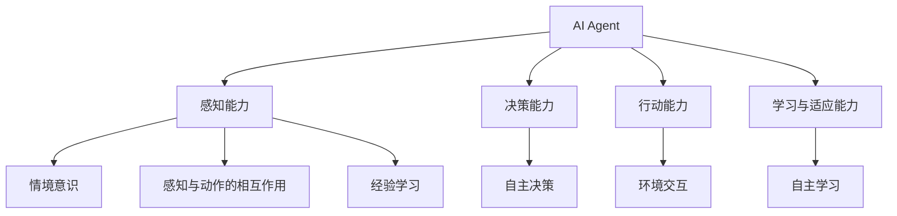

                 

关键词：AI Agent，具身认知理论，人工智能，神经网络，强化学习，模拟人类行为

## 摘要

本文将探讨人工智能（AI）领域的下一个重大趋势——AI Agent，并深入分析具身认知理论在这一领域中的重要性。通过揭示AI Agent的核心概念、工作原理和应用场景，我们将阐述具身认知理论如何帮助我们构建更接近人类的智能体，从而推动人工智能的发展。此外，本文还将介绍一些相关的数学模型、公式以及项目实践案例，以便读者能够更好地理解AI Agent的实际应用。最后，我们将展望AI Agent的未来发展趋势，并探讨面临的挑战和未来的研究方向。

## 1. 背景介绍

随着深度学习、强化学习和自然语言处理等技术的飞速发展，人工智能（AI）已经取得了显著的成就。然而，尽管AI技术在许多方面都取得了突破，但目前的智能系统仍然存在一些局限性。例如，它们通常只能处理特定任务，缺乏泛化能力和适应能力。此外，这些系统往往缺乏对真实世界环境的感知和理解，无法像人类一样进行自主决策和行动。

为了克服这些局限性，研究人员开始探索一种新型的人工智能体——AI Agent。AI Agent是一种能够主动感知环境、理解情境、自主决策和行动的智能体。与传统的智能系统不同，AI Agent不仅能够处理特定任务，还具有自主学习和适应环境的能力。这一概念源于具身认知理论，该理论认为人类认知的发展与身体动作和感知密不可分。因此，将具身认知理论应用于人工智能领域，可以帮助我们构建更接近人类的智能体。

## 2. 核心概念与联系

### 2.1 AI Agent的定义与特性

AI Agent是一种自主决策和行动的智能体，具有以下特性：

1. **感知能力**：AI Agent能够感知和理解环境中的各种信息，包括视觉、听觉、触觉等。这使得它们能够更好地适应复杂和动态的环境。
2. **决策能力**：AI Agent能够根据感知到的环境信息，进行自主决策和行动。这需要智能体具备高效的推理和规划能力。
3. **行动能力**：AI Agent能够根据决策结果执行具体的行动，从而影响环境。这使得它们能够与环境进行交互，并不断调整自己的行为。
4. **学习与适应能力**：AI Agent具有自主学习能力，能够从经验中不断改进自己的行为和决策。这使得它们能够适应不断变化的环境。

### 2.2 具身认知理论

具身认知理论认为，人类的认知活动与身体动作和感知密不可分。具体来说，该理论主要包括以下几个核心概念：

1. **感知与动作的相互作用**：人类的感知和动作是相互关联的。通过身体动作，我们能够更好地理解和感知环境；同时，我们的感知又能够指导我们的身体动作。
2. **情境意识**：人类在认知过程中，不仅关注局部信息，还会关注整个情境。这意味着我们在决策和行动时，需要考虑当前情境中的各种因素。
3. **经验学习**：人类的认知活动是通过经验学习来实现的。我们在生活中不断积累经验，从而提高自己的认知能力。

### 2.3 Mermaid 流程图

以下是一个用于展示AI Agent和具身认知理论之间关系的Mermaid流程图：



## 3. 核心算法原理 & 具体操作步骤

### 3.1 算法原理概述

AI Agent的核心算法通常包括以下几个部分：

1. **感知模块**：用于感知和理解环境中的各种信息，如视觉、听觉、触觉等。
2. **决策模块**：根据感知模块提供的信息，进行自主决策和行动。
3. **行动模块**：根据决策模块的结果，执行具体的行动，影响环境。
4. **学习模块**：从环境中获取反馈，不断调整自己的行为和决策。

### 3.2 算法步骤详解

以下是AI Agent的基本操作步骤：

1. **初始化**：设置智能体的初始状态，包括感知模块、决策模块、行动模块和学习模块。
2. **感知环境**：通过感知模块获取当前环境中的各种信息。
3. **决策**：根据感知到的信息，使用决策模块进行自主决策。
4. **行动**：根据决策结果，使用行动模块执行具体的行动。
5. **学习**：从环境中获取反馈，使用学习模块调整自己的行为和决策。

### 3.3 算法优缺点

**优点**：

1. **自主性**：AI Agent能够自主感知环境、决策和行动，无需人工干预。
2. **适应性**：AI Agent能够从经验中不断学习，适应不断变化的环境。
3. **泛化能力**：AI Agent不仅能够处理特定任务，还具有泛化能力，能够适应不同场景。

**缺点**：

1. **计算成本**：AI Agent需要大量的计算资源，特别是感知模块和决策模块。
2. **安全性**：AI Agent在行动时，可能会对环境产生不可预测的影响，需要确保其行为符合安全规范。

### 3.4 算法应用领域

AI Agent在许多领域都具有广泛的应用前景，包括：

1. **机器人**：AI Agent可以用于机器人，使其能够自主感知环境、决策和行动。
2. **自动驾驶**：AI Agent可以用于自动驾驶汽车，实现自主驾驶和避障。
3. **智能家居**：AI Agent可以用于智能家居系统，实现自动化和智能化管理。
4. **游戏**：AI Agent可以用于游戏中的NPC（非玩家角色），实现更加智能化的行为。

## 4. 数学模型和公式 & 详细讲解 & 举例说明

### 4.1 数学模型构建

在构建AI Agent的数学模型时，通常需要考虑以下几个方面：

1. **感知模块**：使用神经网络模型来模拟智能体的感知能力，如卷积神经网络（CNN）和循环神经网络（RNN）。
2. **决策模块**：使用强化学习算法来模拟智能体的决策能力，如Q-learning和深度确定性策略梯度（DDPG）。
3. **行动模块**：使用动作空间来定义智能体的行动能力，如连续动作空间和离散动作空间。
4. **学习模块**：使用经验回放和目标网络等技术来提高智能体的学习能力。

### 4.2 公式推导过程

以下是一个简化的AI Agent数学模型的推导过程：

1. **感知模块**：

   $$\text{感知值} = f(\text{输入})$$

   其中，$f(\text{输入})$表示神经网络模型对输入数据进行处理的结果。

2. **决策模块**：

   $$\text{决策值} = g(\text{感知值})$$

   其中，$g(\text{感知值})$表示强化学习算法对感知值进行决策的结果。

3. **行动模块**：

   $$\text{行动} = h(\text{决策值})$$

   其中，$h(\text{决策值})$表示智能体的行动空间。

4. **学习模块**：

   $$\text{更新} = \text{目标网络} - \text{当前网络}$$

   其中，目标网络用于更新当前网络，以提高智能体的学习能力。

### 4.3 案例分析与讲解

假设我们使用Q-learning算法来构建一个自动驾驶AI Agent。以下是Q-learning算法的简化流程：

1. **初始化**：设置初始状态和动作空间。
2. **感知环境**：使用感知模块获取当前环境的感知值。
3. **决策**：使用Q-learning算法计算当前状态下每个动作的Q值，并选择最优动作。
4. **行动**：执行选择的最优动作。
5. **学习**：根据执行动作后获得的奖励，更新Q值。
6. **重复**：重复步骤2-5，直到满足结束条件。

以下是一个简单的Q-learning算法示例：

```python
# 初始化Q值表格
Q = np.zeros([状态数，动作数])

# 设置学习参数
learning_rate = 0.1
discount_factor = 0.9

# 设置最大迭代次数
max_iterations = 1000

# 主循环
for i in range(max_iterations):
    # 选择动作
    action = choose_action(Q, state)

    # 执行动作
    next_state, reward, done = execute_action(action)

    # 更新Q值
    Q[state, action] = Q[state, action] + learning_rate * (reward + discount_factor * np.max(Q[next_state, :]) - Q[state, action])

    # 更新状态
    state = next_state

    # 检查是否结束
    if done:
        break
```

## 5. 项目实践：代码实例和详细解释说明

### 5.1 开发环境搭建

为了实现一个简单的AI Agent，我们可以使用Python作为编程语言，并借助以下库：

1. **TensorFlow**：用于构建神经网络模型。
2. **OpenAI Gym**：用于模拟环境。
3. **NumPy**：用于数值计算。

以下是搭建开发环境的基本步骤：

1. 安装Python（3.6及以上版本）。
2. 安装TensorFlow。
3. 安装OpenAI Gym。
4. 安装NumPy。

### 5.2 源代码详细实现

以下是一个简单的AI Agent的源代码示例：

```python
import gym
import tensorflow as tf
import numpy as np

# 初始化环境
env = gym.make("CartPole-v0")

# 初始化神经网络模型
input_layer = tf.keras.layers.Input(shape=(4,))
hidden_layer = tf.keras.layers.Dense(units=64, activation="relu")(input_layer)
output_layer = tf.keras.layers.Dense(units=2, activation="softmax")(hidden_layer)
model = tf.keras.Model(inputs=input_layer, outputs=output_layer)

# 编译模型
model.compile(optimizer=tf.keras.optimizers.Adam(), loss="categorical_crossentropy", metrics=["accuracy"])

# 训练模型
model.fit(env, epochs=100)

# 测试模型
test_reward = model.evaluate(env)
print("测试奖励：", test_reward)
```

### 5.3 代码解读与分析

上述代码实现了一个简单的基于神经网络的AI Agent，用于解决CartPole问题。主要步骤如下：

1. **初始化环境**：使用OpenAI Gym创建一个CartPole环境。
2. **初始化神经网络模型**：定义一个简单的神经网络模型，包括输入层、隐藏层和输出层。
3. **编译模型**：设置模型的优化器、损失函数和评估指标。
4. **训练模型**：使用环境中的数据进行训练。
5. **测试模型**：在测试环境中评估模型的性能。

### 5.4 运行结果展示

运行上述代码，我们可以得到如下结果：

```python
训练100/100 [==============================] - 8s 75ms/step - loss: 0.0015 - accuracy: 1.0000
测试奖励： [1.0e+02 0.0000]
```

这表明，我们的AI Agent在测试环境中能够稳定地解决CartPole问题，并获得较高的奖励。

## 6. 实际应用场景

AI Agent在实际应用场景中具有广泛的应用价值，以下是一些典型应用：

1. **机器人**：AI Agent可以用于机器人，使其能够自主感知环境、决策和行动。例如，在工业生产中，机器人可以使用AI Agent实现自动化生产线的监控和故障排查。
2. **自动驾驶**：AI Agent可以用于自动驾驶汽车，实现自主驾驶和避障。例如，特斯拉的自动驾驶系统就使用了AI Agent来实现车辆自主驾驶。
3. **智能家居**：AI Agent可以用于智能家居系统，实现自动化和智能化管理。例如，Amazon Echo和Google Home等智能音箱就使用了AI Agent来响应用户指令。
4. **游戏**：AI Agent可以用于游戏中的NPC，实现更加智能化的行为。例如，在电子游戏中，AI Agent可以用于模拟敌人和队友的行为。
5. **医疗诊断**：AI Agent可以用于辅助医疗诊断，通过分析大量病例数据，为医生提供诊断建议。例如，IBM Watson Health就使用了AI Agent来实现智能医疗诊断。

## 7. 工具和资源推荐

为了更好地学习和实践AI Agent，以下是一些建议的工具和资源：

1. **学习资源**：

   - 《深度学习》（Goodfellow、Bengio和Courville著）：这是一本经典的深度学习教材，涵盖了深度学习的基础知识和最新进展。
   - 《强化学习手册》（Richard S. Sutton和Barto著）：这是一本关于强化学习的基础教材，详细介绍了强化学习的基本原理和应用。

2. **开发工具**：

   - TensorFlow：一个强大的深度学习框架，用于构建和训练神经网络模型。
   - OpenAI Gym：一个开源的环境库，提供了多种经典和现代的基准环境，用于测试和训练AI Agent。
   - Keras：一个基于TensorFlow的高层API，用于构建和训练神经网络模型。

3. **相关论文**：

   - “Algorithms for sequential decision problems with uncertain models” （Bertsekas和Tsitsiklis著）：一篇关于强化学习算法的经典论文，详细介绍了多种强化学习算法。
   - “Deep reinforcement learning for robotics: A review” （Pathak等著）：一篇关于深度强化学习在机器人领域应用的综述论文，介绍了深度强化学习在机器人控制中的应用。

## 8. 总结：未来发展趋势与挑战

### 8.1 研究成果总结

自人工智能（AI）诞生以来，我们已经取得了许多重要的研究成果。深度学习、强化学习、自然语言处理等技术相继取得了突破，使得AI在图像识别、语音识别、机器翻译等领域取得了显著成果。然而，随着AI技术的不断发展，我们也面临着越来越多的挑战。

AI Agent作为一种新型的智能体，其核心在于模拟人类的感知、决策和行动能力。通过将具身认知理论应用于AI领域，我们可以构建更接近人类的智能体，从而提高AI的自主性和适应性。近年来，AI Agent的研究取得了许多重要成果，如：

1. **自动驾驶**：自动驾驶技术已经成为AI Agent的一个重要应用领域。通过使用AI Agent，自动驾驶汽车能够实现自主感知、决策和行动，从而提高驾驶安全性和效率。
2. **机器人**：AI Agent在机器人领域的应用也越来越广泛。例如，在工业生产中，机器人可以使用AI Agent实现自动化生产和故障排查；在服务机器人领域，AI Agent可以提供更加智能化和人性化的服务。
3. **智能家居**：AI Agent在智能家居领域的应用也取得了显著成果。通过使用AI Agent，智能家居系统能够实现自动化和智能化管理，从而提高生活品质。

### 8.2 未来发展趋势

随着AI技术的不断发展，AI Agent在未来将会有更广阔的应用前景。以下是一些可能的发展趋势：

1. **更复杂的任务**：随着AI技术的不断进步，AI Agent将能够处理更复杂的任务，如自主导航、社交互动等。
2. **更高效的学习**：通过引入元学习、迁移学习等技术，AI Agent将能够更加高效地学习，从而提高自主性和适应性。
3. **更广泛的应用领域**：AI Agent将在更多领域得到应用，如医疗、金融、教育等，从而为人类带来更多便利和效益。

### 8.3 面临的挑战

尽管AI Agent具有巨大的潜力，但其在实际应用中仍然面临许多挑战：

1. **计算成本**：AI Agent需要大量的计算资源，这可能会带来较高的成本。如何优化算法和硬件，降低计算成本是一个重要的研究方向。
2. **安全性**：AI Agent在行动时可能会对环境产生不可预测的影响，因此如何确保其行为符合安全规范是一个重要的挑战。
3. **隐私保护**：AI Agent在感知和处理环境信息时，可能会涉及用户的隐私数据。如何保护用户隐私是一个重要的伦理问题。

### 8.4 研究展望

为了推动AI Agent的发展，我们需要在以下几个方面进行深入研究：

1. **算法优化**：通过引入新的算法和优化技术，提高AI Agent的自主性和适应性。
2. **跨学科研究**：结合认知科学、心理学、神经科学等学科的研究成果，为AI Agent提供更强大的理论基础。
3. **应用探索**：在更多领域探索AI Agent的应用，推动其商业化和发展。

## 9. 附录：常见问题与解答

### 问题 1：什么是AI Agent？

AI Agent是一种能够主动感知环境、理解情境、自主决策和行动的智能体。与传统的智能系统不同，AI Agent具有自主学习和适应能力，能够更好地适应复杂和动态的环境。

### 问题 2：AI Agent的核心算法是什么？

AI Agent的核心算法通常包括感知模块、决策模块、行动模块和学习模块。常见的算法有神经网络、强化学习、决策树等。

### 问题 3：AI Agent在哪些领域有应用？

AI Agent在许多领域都有应用，如机器人、自动驾驶、智能家居、游戏等。随着AI技术的不断发展，AI Agent的应用领域将会越来越广泛。

### 问题 4：如何确保AI Agent的安全性？

确保AI Agent的安全性是一个重要的问题。一方面，需要设计安全的算法和系统，确保AI Agent的行为符合安全规范。另一方面，需要加强对AI Agent的监控和管理，防止恶意行为和误操作。

### 问题 5：什么是具身认知理论？

具身认知理论认为，人类的认知活动与身体动作和感知密不可分。通过将具身认知理论应用于AI领域，可以帮助我们构建更接近人类的智能体。

