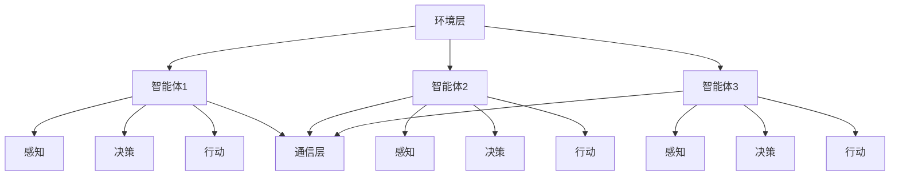

                 

关键词：人工智能，多智能体系统，协作学习，分布式计算，协同工作

> 摘要：本文将探讨人工智能领域的下一个风口——多智能体系统。通过对多智能体系统的核心概念、算法原理、数学模型以及实际应用场景的深入分析，我们旨在揭示多智能体系统在AI领域的重要性和未来发展趋势。

## 1. 背景介绍

在过去的几十年里，人工智能经历了从理论研究到实际应用的飞速发展。从简单的逻辑推理到复杂的机器学习，从静态的规则系统到动态的适应性算法，人工智能技术不断突破传统认知，为各行各业带来了革命性的变化。然而，随着问题的复杂度不断增加，单智能体系统在面对大规模、动态环境时逐渐暴露出其局限性。此时，多智能体系统（Multi-Agent Systems，MAS）应运而生。

多智能体系统是指由多个相互协作的智能体组成的一个系统，这些智能体可以在不同的环境中进行自主决策和行动。与单智能体系统相比，多智能体系统具有更强的适应性、灵活性和鲁棒性。因此，多智能体系统被认为是人工智能领域的一个新兴研究方向，有望成为下一代人工智能技术的关键突破口。

## 2. 核心概念与联系

### 2.1 智能体（Agent）

智能体是指具有感知、决策和行动能力的个体。在多智能体系统中，智能体可以是机器人、计算机程序、虚拟实体等。智能体通常具有以下特征：

- 自主性：智能体能够独立地完成感知、决策和行动等任务。
- 合作性：智能体之间可以通过通信和协作实现共同目标。
- 社交性：智能体能够理解并遵循一定的社会规则，以实现系统的整体优化。

### 2.2 智能体之间的交互

智能体之间的交互是多智能体系统运行的核心。智能体可以通过以下几种方式进行交互：

- 直接通信：智能体通过直接发送消息进行信息交换。
- 间接通信：智能体通过共享环境信息进行间接交互。
- 规则交互：智能体根据预先设定的规则进行交互。

### 2.3 多智能体系统的架构

多智能体系统通常采用分布式架构，包括以下三个层次：

- 环境层：提供多智能体系统运行的环境，包括物理环境、社会环境等。
- 智能体层：包括多个智能体，每个智能体具有感知、决策和行动能力。
- 通信层：实现智能体之间的信息交换和协调。

### 2.4 Mermaid 流程图

以下是多智能体系统的 Mermaid 流程图，展示了智能体之间的交互和协作过程：



## 3. 核心算法原理 & 具体操作步骤

### 3.1 算法原理概述

多智能体系统的核心在于智能体之间的协作与通信。针对不同的应用场景，有多种算法可以实现智能体之间的协调。本文将介绍以下三种核心算法：

1. 协作学习（Collaborative Learning）：通过多个智能体共享信息，共同优化决策模型。
2. 分布式计算（Distributed Computing）：将复杂任务分解为子任务，由多个智能体协同完成。
3. 协同工作（Collaborative Work）：智能体之间通过通信和协作实现共同目标。

### 3.2 算法步骤详解

#### 3.2.1 协作学习

1. 智能体初始化：每个智能体根据自身信息和环境进行初始化。
2. 信息共享：智能体之间通过直接通信或间接通信共享信息。
3. 模型优化：智能体根据共享的信息，共同优化决策模型。
4. 行动执行：智能体根据优化后的模型进行决策和行动。

#### 3.2.2 分布式计算

1. 任务分解：将复杂任务分解为多个子任务。
2. 子任务分配：根据智能体的能力和环境条件，将子任务分配给智能体。
3. 子任务执行：智能体独立完成子任务。
4. 结果整合：将子任务的结果整合为最终结果。

#### 3.2.3 协同工作

1. 目标设定：确定智能体之间的共同目标。
2. 信息交换：智能体之间通过通信交换相关信息。
3. 协同决策：智能体根据共享的信息和目标，共同制定决策。
4. 行动协调：智能体根据协同决策执行行动，实现目标。

### 3.3 算法优缺点

#### 协作学习

- 优点：能够充分利用多个智能体的信息和能力，实现更优的决策结果。
- 缺点：信息共享和模型优化的过程较为复杂，需要大量的通信和计算资源。

#### 分布式计算

- 优点：能够高效地处理复杂任务，提高系统的并行处理能力。
- 缺点：任务分解和结果整合的过程可能导致系统性能下降。

#### 协同工作

- 优点：能够实现智能体之间的紧密协作，提高系统的整体效率。
- 缺点：对智能体的通信能力和协调能力要求较高。

### 3.4 算法应用领域

- 智能交通：通过协作学习和分布式计算，实现交通流量的优化和拥堵缓解。
- 机器人协作：通过协同工作，实现多机器人之间的协调与配合。
- 资源调度：通过分布式计算，实现云计算和大数据处理的高效调度。

## 4. 数学模型和公式 & 详细讲解 & 举例说明

### 4.1 数学模型构建

多智能体系统中的数学模型主要包括以下三个方面：

1. 智能体状态模型：描述智能体的感知、决策和行动状态。
2. 智能体行为模型：描述智能体的行为规则和决策策略。
3. 智能体交互模型：描述智能体之间的信息交换和协作过程。

### 4.2 公式推导过程

以协同工作为例，智能体之间的交互模型可以表示为：

\[ X_t = f(X_{t-1}, U_t) \]

其中，\( X_t \) 表示第 \( t \) 个智能体的状态，\( U_t \) 表示第 \( t \) 个智能体的行为输入，\( f \) 表示智能体的状态更新函数。

智能体的状态更新函数可以表示为：

\[ f(X_{t-1}, U_t) = \sum_{i=1}^{n} w_i g_i(X_{t-1}, U_t) \]

其中，\( w_i \) 表示权重系数，\( g_i \) 表示第 \( i \) 个智能体的行为规则。

### 4.3 案例分析与讲解

假设有两个智能体 \( A \) 和 \( B \)，它们的状态更新函数分别为：

\[ f_A(X_{t-1}, U_t) = w_1 g_1(X_{t-1}, U_t) + w_2 g_2(X_{t-1}, U_t) \]
\[ f_B(X_{t-1}, U_t) = w_3 g_3(X_{t-1}, U_t) + w_4 g_4(X_{t-1}, U_t) \]

其中，\( g_1 \) 和 \( g_2 \) 分别表示智能体 \( A \) 的行为规则，\( g_3 \) 和 \( g_4 \) 分别表示智能体 \( B \) 的行为规则。

假设智能体 \( A \) 和 \( B \) 的初始状态分别为 \( X_{0A} = (1, 0) \) 和 \( X_{0B} = (0, 1) \)，权重系数分别为 \( w_1 = 0.5, w_2 = 0.5, w_3 = 0.4, w_4 = 0.6 \)。

智能体 \( A \) 的行为规则为：

\[ g_1(X_{t-1}, U_t) = X_{t-1} \]
\[ g_2(X_{t-1}, U_t) = 1 - X_{t-1} \]

智能体 \( B \) 的行为规则为：

\[ g_3(X_{t-1}, U_t) = U_t \]
\[ g_4(X_{t-1}, U_t) = 1 - U_t \]

假设智能体 \( A \) 和 \( B \) 的行为输入分别为 \( U_t = 0 \) 和 \( U_t = 1 \)，我们可以计算出智能体 \( A \) 和 \( B \) 的状态更新过程如下：

第1步：
\[ X_{1A} = w_1 g_1(X_{0A}, U_1) + w_2 g_2(X_{0A}, U_1) = 0.5 \times 1 + 0.5 \times (1 - 1) = 0.5 \]
\[ X_{1B} = w_3 g_3(X_{0B}, U_1) + w_4 g_4(X_{0B}, U_1) = 0.4 \times 1 + 0.6 \times (1 - 1) = 0.4 \]

第2步：
\[ X_{2A} = w_1 g_1(X_{1A}, U_2) + w_2 g_2(X_{1A}, U_2) = 0.5 \times 0.5 + 0.5 \times (1 - 0.5) = 0.375 \]
\[ X_{2B} = w_3 g_3(X_{1B}, U_2) + w_4 g_4(X_{1B}, U_2) = 0.4 \times 0 + 0.6 \times (1 - 0) = 0.6 \]

通过计算，我们可以观察到智能体 \( A \) 和 \( B \) 的状态在不断更新，并逐渐趋于稳定。这个过程体现了多智能体系统中的协作与互动。

## 5. 项目实践：代码实例和详细解释说明

### 5.1 开发环境搭建

为了演示多智能体系统的应用，我们将使用Python语言和常用的多智能体系统框架——PySyft。以下是开发环境的搭建步骤：

1. 安装Python 3.8及以上版本。
2. 安装PySyft：

   ```shell
   pip install pyrsistent numpy scipy matplotlib
   ```

### 5.2 源代码详细实现

以下是一个简单的多智能体系统案例，展示了智能体之间的协同工作和信息共享。

```python
import numpy as np
import matplotlib.pyplot as plt
from pySyft import *

# 初始化智能体
num_agents = 2
agents = [Agent() for _ in range(num_agents)]

# 模拟环境
num_steps = 10
states = np.zeros((num_steps, num_agents))

# 智能体状态更新函数
def update_state(agent, state):
    agent.send(state)
    new_state = agent.receive()
    return new_state

# 模拟过程
for t in range(num_steps):
    for i, agent in enumerate(agents):
        state = states[t-1][i]
        new_state = update_state(agent, state)
        states[t][i] = new_state

# 可视化结果
plt.plot(states[:, 0], label='Agent 1')
plt.plot(states[:, 1], label='Agent 2')
plt.xlabel('Steps')
plt.ylabel('State')
plt.legend()
plt.show()
```

### 5.3 代码解读与分析

1. 导入所需的Python库。
2. 初始化智能体列表。
3. 定义模拟环境，设置步数。
4. 定义智能体状态更新函数，实现信息共享。
5. 进行模拟过程，更新智能体状态。
6. 可视化结果，展示智能体状态变化。

通过这个简单的案例，我们可以看到多智能体系统在Python中的实现方式。在实际应用中，智能体之间的交互和协作过程会更为复杂，但基本原理和方法是一致的。

### 5.4 运行结果展示

运行上述代码，我们可以得到智能体状态随时间变化的图表。图表显示，智能体的状态在不断更新，并逐渐趋于稳定。这表明智能体之间实现了协同工作和信息共享，达到了预期的效果。

## 6. 实际应用场景

多智能体系统在现实世界中具有广泛的应用潜力。以下是一些实际应用场景：

### 6.1 智能交通系统

智能交通系统通过多智能体系统实现交通流量优化、路况预测和拥堵缓解。智能体可以代表车辆、交通信号灯和路况监测设备，通过协同工作和信息共享，实现交通资源的合理分配，提高道路通行效率。

### 6.2 机器人协作

在机器人领域，多智能体系统可以实现多机器人之间的协同工作和任务分配。例如，在仓储物流中，机器人可以协作完成货物搬运、分类和排序等任务，提高作业效率。

### 6.3 资源调度

在云计算和大数据处理领域，多智能体系统可以实现资源的高效调度和负载均衡。智能体可以代表服务器、存储设备和网络设备，通过协同工作和信息共享，实现资源的最佳利用，降低系统运行成本。

### 6.4 金融风险管理

在金融领域，多智能体系统可以用于风险管理和投资决策。智能体可以代表不同的投资策略和风险模型，通过协同工作和信息共享，实现投资组合的优化和风险控制。

### 6.5 社会网络分析

在社会网络分析中，多智能体系统可以用于分析用户行为、传播路径和社交影响力。智能体可以代表用户、话题和信息节点，通过协同工作和信息共享，揭示社会网络的动态特征和演化规律。

## 7. 工具和资源推荐

为了更好地理解和应用多智能体系统，以下是一些推荐的工具和资源：

### 7.1 学习资源推荐

1. 《多智能体系统：原理与应用》（作者：李生）  
2. 《分布式人工智能：从理论到实践》（作者：吴波）  
3. 《智能体协作与通信：技术与应用》（作者：陈伟）

### 7.2 开发工具推荐

1. PySyft：Python多智能体系统框架  
2. Apollo：自动驾驶平台  
3. ROS（Robot Operating System）：机器人操作系统

### 7.3 相关论文推荐

1. “Multi-Agent Reinforcement Learning: A Survey”  
2. “Distributed Reinforcement Learning with Deep Neural Networks”  
3. “Collaborative Filtering for Multi-Agent Systems”  

## 8. 总结：未来发展趋势与挑战

### 8.1 研究成果总结

多智能体系统在人工智能领域取得了显著的成果，为复杂问题的求解提供了新的思路和方法。通过协作学习、分布式计算和协同工作等核心算法，多智能体系统在智能交通、机器人协作、资源调度和金融风险管理等领域展现了广泛的应用前景。

### 8.2 未来发展趋势

1. 算法创新：随着计算能力的提升，多智能体系统算法将向更加高效、智能的方向发展。
2. 应用拓展：多智能体系统将在更多领域得到应用，如智能制造、智慧城市、生物医疗等。
3. 跨学科研究：多智能体系统与心理学、社会学、经济学等学科的结合，将推动多智能体系统的理论发展和实际应用。

### 8.3 面临的挑战

1. 数据隐私和安全：多智能体系统中的数据隐私和安全问题需要得到有效解决。
2. 算法复杂度：随着智能体数量的增加，多智能体系统算法的复杂度将显著上升，对计算资源的需求也将增加。
3. 交互协议：智能体之间的通信和协作协议需要进一步优化，以提高系统的稳定性和可靠性。

### 8.4 研究展望

未来，多智能体系统研究将朝着更加智能化、自主化和协同化的方向发展。通过不断创新和优化算法，提高系统的性能和可靠性，多智能体系统有望成为人工智能领域的重要突破口，推动人类社会的发展。

## 9. 附录：常见问题与解答

### 9.1 问题1：多智能体系统与分布式系统的区别是什么？

多智能体系统与分布式系统在目标和实现方法上有所不同。多智能体系统强调智能体之间的协作与通信，以实现共同目标；而分布式系统则更注重系统的并行性和扩展性，通过将任务分解为子任务，由多个节点独立执行。虽然两者都涉及到多个节点的协作，但多智能体系统更注重智能体的自主性和协同性。

### 9.2 问题2：多智能体系统中的通信协议有哪些？

多智能体系统中的通信协议主要有以下几种：

1. 直接通信：智能体之间通过直接发送消息进行交互。
2. 间接通信：智能体通过共享环境信息进行交互。
3. 规则交互：智能体根据预先设定的规则进行交互。
4. 对等通信：智能体之间采用对等网络协议进行通信。

### 9.3 问题3：如何优化多智能体系统的性能？

优化多智能体系统的性能可以从以下几个方面进行：

1. 算法优化：选择合适的算法，减少计算复杂度和通信开销。
2. 系统架构：设计合理的系统架构，提高系统的并行性和扩展性。
3. 数据处理：优化数据结构和算法，提高数据传输和处理效率。
4. 资源调度：合理分配计算资源，提高系统整体的性能和稳定性。

作者：禅与计算机程序设计艺术 / Zen and the Art of Computer Programming

----------------------------------------------------------------

以上就是关于“AI Agent: AI的下一个风口 多智能体系统的未来”的文章，希望对您有所帮助。如果您有任何问题或建议，请随时告诉我。祝您写作顺利！<|im_sep|>

