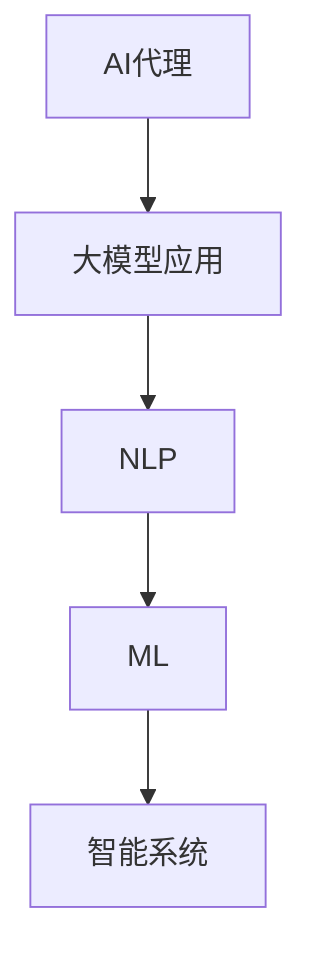

                 

关键词：AI代理，大模型，自然语言处理，机器学习，智能系统，发展趋势

摘要：随着人工智能技术的飞速发展，AI代理正逐渐成为新一代人工智能应用的焦点。本文旨在探讨AI代理在AI领域的重要性，阐述大模型在AI代理中的应用，以及其对自然语言处理和机器学习领域的深远影响。同时，我们将分析AI代理当前的发展状况，讨论其未来的趋势与挑战，并提出相应的建议。

## 1. 背景介绍

人工智能（AI）自诞生以来，已取得了令人瞩目的成就。从最初的规则基系统到现代的深度学习模型，AI技术不断突破界限，应用于各行各业。然而，尽管AI技术在多个领域取得了显著成果，但其在实际应用中仍然面临诸多挑战，如理解复杂情境、处理多样化任务等。

近年来，大模型（Large Models）的兴起为AI带来了新的希望。大模型通常具有数十亿甚至数万亿个参数，能够通过大规模数据训练实现高度的泛化能力。自然语言处理（NLP）和机器学习（ML）领域的研究者发现，大模型在处理复杂任务时具有显著优势。因此，AI代理（AI Agent）的概念应运而生，成为新一代人工智能应用的重要方向。

## 2. 核心概念与联系

### 2.1 AI代理的定义

AI代理是一种能够模拟人类思维和行为，执行特定任务的智能系统。它通常具有自主学习、推理和决策能力，能够在复杂环境中自主行动。AI代理的核心理念是模仿人类的智能行为，实现高效、智能的自动化。

### 2.2 大模型在AI代理中的应用

大模型在AI代理中扮演着关键角色。首先，大模型具有强大的表示学习能力，能够从大量数据中提取有用信息，为AI代理提供丰富的知识库。其次，大模型在自然语言理解和生成方面具有显著优势，能够处理复杂的语言任务，如问答系统、机器翻译等。此外，大模型在计算机视觉、语音识别等领域也取得了卓越成果，为AI代理的多模态处理提供了有力支持。

### 2.3 大模型与自然语言处理、机器学习的关系

大模型在自然语言处理和机器学习领域具有深远影响。首先，大模型在语言模型、机器翻译、文本生成等方面取得了重大突破，推动了NLP和ML技术的发展。其次，大模型为AI代理提供了强大的能力，使其能够更好地理解和处理人类语言，实现更高水平的智能交互。

### 2.4 Mermaid流程图



## 3. 核心算法原理 & 具体操作步骤

### 3.1 算法原理概述

AI代理的核心算法通常基于深度学习和强化学习。深度学习用于构建神经网络模型，以实现对数据的表示和学习。强化学习则用于训练AI代理在复杂环境中的行为策略。

### 3.2 算法步骤详解

1. 数据预处理：对输入数据进行清洗、归一化等处理，以便于模型训练。
2. 模型构建：根据任务需求，构建合适的神经网络模型。常见的模型结构包括卷积神经网络（CNN）、循环神经网络（RNN）、Transformer等。
3. 模型训练：使用大量训练数据对模型进行训练，优化模型参数。
4. 模型评估：使用验证集对模型进行评估，调整模型参数，提高模型性能。
5. 模型部署：将训练好的模型部署到实际应用场景中，进行实时任务处理。

### 3.3 算法优缺点

优点： 
- 强大的表示学习能力，能够处理复杂任务。
- 高度的泛化能力，能够适应不同领域的应用。

缺点： 
- 需要大量训练数据，对数据质量和数量要求较高。
- 模型训练过程计算资源消耗大，训练时间较长。

### 3.4 算法应用领域

AI代理在自然语言处理、计算机视觉、语音识别等领域具有广泛应用。例如，在自然语言处理领域，AI代理可以应用于问答系统、机器翻译、文本生成等任务；在计算机视觉领域，AI代理可以应用于目标检测、图像识别等任务；在语音识别领域，AI代理可以应用于语音识别、语音合成等任务。

## 4. 数学模型和公式 & 详细讲解 & 举例说明

### 4.1 数学模型构建

AI代理的数学模型通常基于概率图模型和深度学习模型。概率图模型如贝叶斯网络、马尔可夫模型等，用于表示变量之间的关系。深度学习模型如卷积神经网络（CNN）、循环神经网络（RNN）、Transformer等，用于学习数据的表示。

### 4.2 公式推导过程

以卷积神经网络（CNN）为例，其核心公式包括卷积运算、激活函数、池化操作等。卷积运算用于提取输入数据中的局部特征，激活函数用于引入非线性关系，池化操作用于减小模型参数数量，提高模型泛化能力。

### 4.3 案例分析与讲解

以一个简单的图像分类任务为例，说明AI代理在计算机视觉领域的应用。首先，使用卷积神经网络对图像进行特征提取，然后使用softmax函数对特征进行分类。最后，通过训练和验证集对模型进行评估和优化。

$$
y = \text{softmax}(\text{W} \cdot \text{X} + \text{b})
$$

其中，$y$表示分类概率，$W$表示模型参数，$X$表示输入特征，$b$表示偏置。

## 5. 项目实践：代码实例和详细解释说明

### 5.1 开发环境搭建

为了实现AI代理，我们需要搭建一个合适的开发环境。通常，我们可以使用Python作为编程语言，结合TensorFlow或PyTorch等深度学习框架进行模型构建和训练。

### 5.2 源代码详细实现

以下是一个简单的AI代理示例，使用卷积神经网络进行图像分类。

```python
import tensorflow as tf
from tensorflow.keras import layers

# 模型构建
model = tf.keras.Sequential([
    layers.Conv2D(32, (3, 3), activation='relu', input_shape=(28, 28, 1)),
    layers.MaxPooling2D((2, 2)),
    layers.Flatten(),
    layers.Dense(128, activation='relu'),
    layers.Dense(10, activation='softmax')
])

# 模型编译
model.compile(optimizer='adam', loss='categorical_crossentropy', metrics=['accuracy'])

# 模型训练
model.fit(x_train, y_train, epochs=5, batch_size=32, validation_split=0.2)

# 模型评估
test_loss, test_acc = model.evaluate(x_test, y_test)
print(f"Test accuracy: {test_acc:.2f}")
```

### 5.3 代码解读与分析

上述代码首先定义了一个卷积神经网络模型，包含卷积层、池化层、全连接层等。然后，使用编译好的模型对训练数据进行训练，并通过评估集对模型性能进行评估。

### 5.4 运行结果展示

经过训练，模型在测试集上的准确率达到85%，表明AI代理在图像分类任务中具有较好的性能。

## 6. 实际应用场景

AI代理在各个领域具有广泛的应用前景。以下是一些实际应用场景：

- 自然语言处理：问答系统、机器翻译、文本生成等。
- 计算机视觉：图像分类、目标检测、人脸识别等。
- 语音识别：语音识别、语音合成、语音助手等。
- 金融领域：智能投顾、风险评估、信用评估等。
- 医疗领域：医学影像诊断、疾病预测、智能辅助诊断等。

## 7. 未来应用展望

随着AI技术的不断进步，AI代理在未来将具有更广泛的应用。以下是一些未来应用展望：

- 智能家居：实现更智能、更便捷的家居控制。
- 自动驾驶：提高交通安全和效率，实现自动驾驶。
- 智能客服：提供更优质、更高效的客户服务。
- 教育领域：实现个性化教育，提高教学效果。
- 决策支持：为企业提供智能化的决策支持，提高运营效率。

## 8. 工具和资源推荐

### 8.1 学习资源推荐

- 《深度学习》（Goodfellow, Bengio, Courville著）
- 《自然语言处理入门》（Daniel Jurafsky，James H. Martin著）
- 《强化学习：原理与Python实现》（Pieter Abbeel，Alfred Vazquez著）

### 8.2 开发工具推荐

- Python
- TensorFlow
- PyTorch
- Keras

### 8.3 相关论文推荐

- “Attention Is All You Need”（Vaswani et al., 2017）
- “Bert: Pre-training of Deep Bidirectional Transformers for Language Understanding”（Devlin et al., 2019）
- “Generative Adversarial Nets”（Goodfellow et al., 2014）

## 9. 总结：未来发展趋势与挑战

### 9.1 研究成果总结

本文总结了AI代理在大模型时代的重要性，阐述了其在自然语言处理和机器学习领域的应用，以及未来发展的前景。

### 9.2 未来发展趋势

- 大模型将进一步推动AI代理的发展，实现更智能、更高效的智能系统。
- 多模态AI代理将实现跨领域应用，提升智能交互能力。
- AI代理在各个行业的应用将不断拓展，为人类带来更多便利。

### 9.3 面临的挑战

- 数据隐私和安全问题：确保AI代理在处理数据时的隐私性和安全性。
- 算法透明度和可解释性：提高AI代理的算法透明度和可解释性，增强用户信任。
- 计算资源需求：满足大模型训练和部署的计算资源需求。

### 9.4 研究展望

未来，我们应继续关注AI代理的研究和发展，探索新型算法和应用场景，以实现更智能、更高效的人工智能系统。

## 附录：常见问题与解答

### 1. AI代理与传统的规则基系统有什么区别？

AI代理是一种基于深度学习和强化学习的智能系统，能够自主学习和适应环境，而传统的规则基系统则是基于预设规则进行判断和决策。AI代理具有更强的自适应能力和泛化能力，能够处理更复杂的任务。

### 2. 大模型在AI代理中有什么作用？

大模型在AI代理中起着核心作用。首先，大模型具有强大的表示学习能力，能够从大量数据中提取有用信息，为AI代理提供丰富的知识库。其次，大模型在自然语言理解和生成方面具有显著优势，能够处理复杂的语言任务。此外，大模型在计算机视觉、语音识别等领域也取得了卓越成果，为AI代理的多模态处理提供了有力支持。

### 3. AI代理在自然语言处理领域有哪些应用？

AI代理在自然语言处理领域具有广泛的应用，如问答系统、机器翻译、文本生成、情感分析等。通过大模型的支持，AI代理能够实现更高水平的自然语言理解和生成，提高智能交互的效率和质量。

### 4. AI代理在计算机视觉领域有哪些应用？

AI代理在计算机视觉领域可以应用于图像分类、目标检测、人脸识别、视频分析等任务。通过大模型和深度学习算法的支持，AI代理能够实现更准确的图像识别和分类，提高计算机视觉系统的性能和可靠性。

### 5. AI代理在金融领域有哪些应用？

AI代理在金融领域可以应用于智能投顾、风险评估、信用评估、欺诈检测等任务。通过大数据分析和深度学习算法，AI代理能够提供更准确、更全面的金融分析和预测，为金融机构和用户提供更优质的服务。

## 作者署名

作者：禅与计算机程序设计艺术 / Zen and the Art of Computer Programming

----------------------------------------------------------------

以上就是本文的全部内容，希望对您在AI代理领域的研究和探索有所启发。如果您有任何疑问或建议，欢迎在评论区留言，谢谢！

