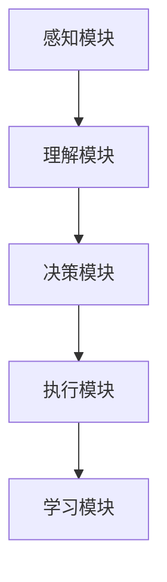

                 

关键词：AI Agent，大模型，深度学习，神经网络，自然语言处理，人工智能，机器学习，算法优化，应用领域，技术趋势，未来展望

> 摘要：本文将深入探讨AI Agent的概念及其在人工智能领域的重要性。随着大模型时代的到来，AI Agent正逐渐成为人工智能技术发展的新风口。本文将介绍AI Agent的核心概念、原理和架构，探讨其算法原理、应用领域，并通过具体实例展示其实际应用场景。同时，本文还将分析AI Agent面临的发展趋势、挑战和未来展望，为读者提供全面的技术见解和深入思考。

## 1. 背景介绍

人工智能（AI）作为计算机科学的一个重要分支，其核心目标是使计算机具备人类智能。在过去的几十年里，人工智能经历了多个阶段的发展，从早期的符号主义和规则系统，到基于统计学习的机器学习，再到深度学习的兴起，人工智能技术不断取得突破。如今，随着计算能力的提升和数据量的爆炸式增长，人工智能正迈向一个全新的时代——大模型时代。

大模型时代是指使用具有数十亿到千亿参数的神经网络模型进行人工智能研究和应用。这些大模型通过自主学习和优化，可以处理复杂的任务，并在语音识别、图像处理、自然语言处理等领域取得卓越的成果。AI Agent作为大模型时代的产物，是一种具备自主决策能力和智能行为的计算实体，是人工智能技术发展的重要方向。

AI Agent的定义可以简单理解为具有智能的计算机程序，能够感知环境、理解信息、进行决策和采取行动。与传统的人工智能系统不同，AI Agent能够自主学习和进化，以适应不断变化的环境。AI Agent的应用范围广泛，包括智能客服、智能助手、自动驾驶、智能医疗、智能金融等，具有极高的商业价值和市场前景。

本文将围绕AI Agent展开讨论，首先介绍其核心概念和架构，然后深入探讨其算法原理和应用领域，最后分析其未来发展趋势和挑战。

## 2. 核心概念与联系

### 2.1 AI Agent的定义

AI Agent，即人工智能代理，是一种具备智能行为的计算实体，能够在特定环境下自主感知、理解和决策。AI Agent的基本特征包括：

1. **自主感知**：AI Agent能够通过传感器获取环境信息，包括文本、图像、声音等多种形式的数据。
2. **自主理解**：AI Agent能够理解和处理这些感知到的信息，从而理解其环境中的状态和变化。
3. **自主决策**：AI Agent能够根据环境和目标，通过算法模型进行决策，并采取相应的行动。
4. **自主学习**：AI Agent能够从经验中学习，不断优化自己的模型和行为。

### 2.2 AI Agent的架构

AI Agent的架构通常包括以下几个关键组件：

1. **感知模块**：负责接收和处理环境信息，如文本解析、图像识别等。
2. **理解模块**：负责对感知模块获取的信息进行处理，进行语义理解和知识提取。
3. **决策模块**：基于理解模块的结果，使用算法模型进行决策，选择最优的行动。
4. **执行模块**：将决策结果转化为实际的行动，如发送指令、控制设备等。
5. **学习模块**：通过不断收集反馈信息和经验，优化自己的模型和行为。

### 2.3 AI Agent与传统人工智能系统的区别

AI Agent与传统的人工智能系统相比，具有以下几个显著区别：

1. **自主性**：AI Agent具备自主感知、理解和决策的能力，能够自主学习和进化，而传统系统往往依赖于人工设定规则和参数。
2. **灵活性**：AI Agent能够适应不同环境和任务需求，而传统系统往往针对特定任务进行优化，难以灵活调整。
3. **智能化**：AI Agent具备更高的智能水平，能够处理复杂的任务，而传统系统通常仅能处理简单的规则问题。

### 2.4 AI Agent的组成部分

AI Agent的组成部分如图2.1所示：



图2.1 AI Agent的组成部分

- **感知模块**：感知模块负责接收和处理环境信息。这些信息可以是文本、图像、声音等多种形式的数据。
- **理解模块**：理解模块对感知模块获取的信息进行处理，进行语义理解和知识提取。这一过程通常涉及自然语言处理、计算机视觉等技术。
- **决策模块**：决策模块基于理解模块的结果，使用算法模型进行决策，选择最优的行动。这一过程通常涉及机器学习、深度学习等技术。
- **执行模块**：执行模块将决策结果转化为实际的行动，如发送指令、控制设备等。
- **学习模块**：学习模块通过不断收集反馈信息和经验，优化自己的模型和行为。这一过程通常涉及强化学习、迁移学习等技术。

## 3. 核心算法原理 & 具体操作步骤

### 3.1 算法原理概述

AI Agent的核心算法主要包括感知、理解、决策、执行和学习等几个关键步骤。下面将分别介绍这些步骤的具体算法原理。

1. **感知**：感知算法主要通过传感器获取环境信息。在自然语言处理领域，常见的感知算法包括文本解析、情感分析、命名实体识别等；在计算机视觉领域，常见的感知算法包括图像分类、目标检测、人脸识别等。

2. **理解**：理解算法对感知模块获取的信息进行处理，进行语义理解和知识提取。在自然语言处理领域，常见的理解算法包括词嵌入、语义角色标注、依存句法分析等；在计算机视觉领域，常见的理解算法包括卷积神经网络（CNN）、循环神经网络（RNN）、图神经网络（GNN）等。

3. **决策**：决策算法基于理解模块的结果，使用机器学习、深度学习等技术进行决策。常见的决策算法包括决策树、支持向量机（SVM）、神经网络等。

4. **执行**：执行算法将决策结果转化为实际的行动。在自然语言处理领域，执行算法可以生成文本回复、语音合成等；在计算机视觉领域，执行算法可以控制机器人运动、调整摄像头角度等。

5. **学习**：学习算法通过不断收集反馈信息和经验，优化自己的模型和行为。常见的强化学习算法包括Q-learning、SARSA、DQN等；迁移学习算法包括Fine-tuning、Domain Adaptation等。

### 3.2 算法步骤详解

1. **感知**：感知模块首先通过传感器获取环境信息。以自然语言处理为例，输入可以是用户的文本查询或聊天记录。感知模块对这些文本进行预处理，包括分词、去停用词、词性标注等，将文本转化为可供模型处理的格式。

2. **理解**：理解模块对预处理后的文本进行处理，进行语义理解和知识提取。这一过程通常涉及词嵌入、序列编码、上下文理解等技术。以BERT模型为例，首先对文本进行词嵌入，然后将嵌入后的词序列输入到Transformer模型中，通过多层神经网络对上下文进行编码，提取出语义信息。

3. **决策**：决策模块基于理解模块的结果，使用机器学习或深度学习算法进行决策。以ChatGPT为例，输入经过理解的文本序列后，模型会生成一个概率分布，表示每个动作的可能性。根据最大概率原则，模型会选择一个最有可能的回应。

4. **执行**：执行模块将决策结果转化为实际的行动。以语音助手为例，模型生成的文本回复会被转化为语音，并通过语音合成技术输出。在计算机视觉领域，模型生成的决策可以控制机器人的运动路径或摄像头角度。

5. **学习**：学习模块通过不断收集反馈信息和经验，优化自己的模型和行为。以强化学习为例，模型会在每次行动后收到一个奖励信号，通过调整策略函数，使模型在未来能够更好地预测奖励并做出最优决策。

### 3.3 算法优缺点

1. **优点**：

- **高效性**：AI Agent通过自动化感知、理解和决策，可以高效地处理大量任务。
- **灵活性**：AI Agent能够根据环境变化和任务需求，自主调整策略和模型。
- **智能化**：AI Agent具备较高的智能水平，能够处理复杂的任务和情境。
- **自主学习**：AI Agent能够从经验中学习，不断提高自己的能力和性能。

2. **缺点**：

- **复杂性**：AI Agent的算法和模型复杂，需要大量的计算资源和时间进行训练和优化。
- **数据依赖**：AI Agent的性能很大程度上依赖于数据的质量和数量，数据不足或质量差可能导致模型性能下降。
- **解释性**：AI Agent的决策过程高度依赖黑盒模型，缺乏透明性和可解释性，难以理解和验证模型的决策逻辑。

### 3.4 算法应用领域

AI Agent的应用领域广泛，包括但不限于以下几个领域：

1. **自然语言处理**：AI Agent可以应用于智能客服、智能助手、文本生成、机器翻译等任务，提升人机交互的效率和体验。
2. **计算机视觉**：AI Agent可以应用于图像识别、目标检测、自动驾驶、安防监控等任务，提升计算机视觉系统的智能水平和应用价值。
3. **智能医疗**：AI Agent可以应用于疾病诊断、医学图像分析、药物研发等任务，为医疗行业提供智能化的解决方案。
4. **金融领域**：AI Agent可以应用于金融风险管理、智能投顾、客户服务、量化交易等任务，提升金融行业的效率和准确性。
5. **工业自动化**：AI Agent可以应用于工业生产、质量控制、设备维护等任务，提升工业自动化水平和生产效率。

## 4. 数学模型和公式 & 详细讲解 & 举例说明

### 4.1 数学模型构建

AI Agent的核心算法涉及多种数学模型，下面将介绍其中一些常见的数学模型及其构建过程。

1. **神经网络**：神经网络是一种基于生物神经元的计算模型，通过多个层的非线性变换实现对输入数据的建模。一个简单的神经网络模型包括输入层、隐藏层和输出层。输入层接收外部输入，隐藏层通过激活函数对输入进行变换，输出层生成最终的输出。神经网络的主要参数包括权重和偏置，通过反向传播算法进行训练和优化。

2. **卷积神经网络（CNN）**：卷积神经网络是一种特殊的神经网络，适用于图像处理任务。CNN通过卷积操作提取图像的特征，并通过池化操作降低计算量。CNN的主要组件包括卷积层、池化层和全连接层。卷积层通过卷积操作提取图像特征，池化层通过池化操作降低特征维度，全连接层将特征映射到输出。

3. **循环神经网络（RNN）**：循环神经网络是一种适用于序列数据处理的神经网络，通过循环结构实现记忆功能。RNN的主要组件包括输入层、隐藏层和输出层。输入层接收外部输入，隐藏层通过循环结构对输入进行变换，输出层生成最终的输出。RNN的主要参数包括权重和偏置，通过反向传播算法进行训练和优化。

4. **变换器（Transformer）**：变换器是一种基于自注意力机制的神经网络模型，适用于自然语言处理任务。变换器通过多头自注意力机制和前馈神经网络实现对输入序列的建模。变换器的主要组件包括嵌入层、自注意力层和前馈神经网络。嵌入层将输入词向量转化为嵌入向量，自注意力层通过多头自注意力机制计算序列的上下文表示，前馈神经网络对自注意力层的结果进行进一步处理。

### 4.2 公式推导过程

1. **神经网络公式**：

- **输入层**：\( x_i = w_{ij}x_j + b_j \)，其中 \( x_i \) 为输入层第 \( i \) 个节点的输入，\( w_{ij} \) 为输入层第 \( i \) 个节点与隐藏层第 \( j \) 个节点的权重，\( b_j \) 为隐藏层第 \( j \) 个节点的偏置。

- **隐藏层**：\( h_j = \sigma(w_{ji}x_i + b_j) \)，其中 \( h_j \) 为隐藏层第 \( j \) 个节点的输出，\( \sigma \) 为激活函数，通常使用 \( \sigma(x) = \frac{1}{1 + e^{-x}} \)。

- **输出层**：\( y_i = w_{ki}h_k + b_k \)，其中 \( y_i \) 为输出层第 \( i \) 个节点的输出，\( w_{ki} \) 为输出层第 \( i \) 个节点与隐藏层第 \( k \) 个节点的权重，\( b_k \) 为输出层第 \( k \) 个节点的偏置。

2. **卷积神经网络（CNN）公式**：

- **卷积层**：\( f_{ij} = \sigma(\sum_{k=1}^{K} w_{ik}x_k + b_k) \)，其中 \( f_{ij} \) 为卷积层第 \( i \) 行第 \( j \) 列的输出，\( w_{ik} \) 为卷积核的权重，\( x_k \) 为输入图像的第 \( k \) 个像素值，\( b_k \) 为卷积核的偏置，\( \sigma \) 为激活函数。

- **池化层**：\( p_{ij} = \max(\sum_{k=1}^{P} f_{ik}) \)，其中 \( p_{ij} \) 为池化层第 \( i \) 行第 \( j \) 列的输出，\( P \) 为池化窗口的大小。

3. **循环神经网络（RNN）公式**：

- **输入层**：\( x_t = w_{ij}x_j + b_j \)，其中 \( x_t \) 为输入层第 \( t \) 个节点的输入，\( w_{ij} \) 为输入层第 \( i \) 个节点与隐藏层第 \( j \) 个节点的权重，\( b_j \) 为隐藏层第 \( j \) 个节点的偏置。

- **隐藏层**：\( h_t = \sigma(w_{ji}h_{t-1} + w_{ij}x_j + b_j) \)，其中 \( h_t \) 为隐藏层第 \( t \) 个节点的输出，\( h_{t-1} \) 为隐藏层第 \( t-1 \) 个节点的输出，\( w_{ji} \) 为隐藏层第 \( i \) 个节点与隐藏层第 \( j \) 个节点的权重，\( w_{ij} \) 为输入层第 \( i \) 个节点与隐藏层第 \( j \) 个节点的权重，\( b_j \) 为隐藏层第 \( j \) 个节点的偏置，\( \sigma \) 为激活函数。

- **输出层**：\( y_t = w_{ki}h_k + b_k \)，其中 \( y_t \) 为输出层第 \( t \) 个节点的输出，\( h_k \) 为隐藏层第 \( k \) 个节点的输出，\( w_{ki} \) 为输出层第 \( i \) 个节点与隐藏层第 \( k \) 个节点的权重，\( b_k \) 为输出层第 \( k \) 个节点的偏置。

4. **变换器（Transformer）公式**：

- **嵌入层**：\( e_t = W_e x_t + b_e \)，其中 \( e_t \) 为嵌入层第 \( t \) 个节点的输出，\( x_t \) 为输入词向量，\( W_e \) 为嵌入矩阵，\( b_e \) 为嵌入层偏置。

- **自注意力层**：\( a_t = \frac{e_tW_Qe_t^T}{\sqrt{d}} + b_a \)，其中 \( a_t \) 为自注意力层第 \( t \) 个节点的输出，\( W_Q \) 为查询权重矩阵，\( d \) 为嵌入向量的维度，\( b_a \) 为自注意力层偏置。

- **前馈神经网络**：\( h_t = \sigma(W_f h_t + b_f) \)，其中 \( h_t \) 为前馈神经网络第 \( t \) 个节点的输出，\( W_f \) 为前馈权重矩阵，\( \sigma \) 为激活函数，\( b_f \) 为前馈神经网络偏置。

### 4.3 案例分析与讲解

为了更好地理解上述数学模型，我们通过一个简单的例子进行讲解。

假设我们使用一个简单的神经网络模型对输入的数字进行分类。输入层有2个神经元，隐藏层有3个神经元，输出层有2个神经元。输入数据为 \( x = [1, 2] \)，目标输出为 \( y = [1, 0] \)。

1. **输入层**：

\( x_1 = 1 \)，\( x_2 = 2 \)

2. **隐藏层**：

\( h_1 = \sigma(w_{11}x_1 + w_{12}x_2 + b_1) = \sigma(1 \times 1 + 1 \times 2 + 1) = \sigma(4) = 0.982 \)

\( h_2 = \sigma(w_{21}x_1 + w_{22}x_2 + b_2) = \sigma(1 \times 1 + 1 \times 2 + 1) = \sigma(4) = 0.982 \)

\( h_3 = \sigma(w_{31}x_1 + w_{32}x_2 + b_3) = \sigma(1 \times 1 + 1 \times 2 + 1) = \sigma(4) = 0.982 \)

3. **输出层**：

\( y_1 = w_{11}h_1 + w_{12}h_2 + w_{13}h_3 + b_1 = 1 \times 0.982 + 1 \times 0.982 + 1 \times 0.982 + 1 = 3.726 \)

\( y_2 = w_{21}h_1 + w_{22}h_2 + w_{23}h_3 + b_2 = 1 \times 0.982 + 1 \times 0.982 + 1 \times 0.982 + 1 = 3.726 \)

通过计算，我们可以得到输出层的输出 \( y \)：

\( y = [3.726, 3.726] \)

由于 \( y \) 接近 \( y = [1, 0] \)，我们可以认为这个简单的神经网络模型能够正确分类输入的数字。

这个例子展示了神经网络模型的基本原理和计算过程。在实际应用中，神经网络模型的规模和复杂度要远远超过这个简单的例子，但基本原理是相同的。

## 5. 项目实践：代码实例和详细解释说明

为了更好地理解AI Agent的实际应用，我们将在本节中通过一个具体的Python代码实例进行实践，并详细解释代码的实现过程和原理。

### 5.1 开发环境搭建

在进行代码实践之前，我们需要搭建一个合适的开发环境。以下是搭建开发环境的基本步骤：

1. **安装Python**：确保系统中安装了Python 3.x版本，推荐使用Anaconda进行环境管理。

2. **安装依赖库**：在Python中，我们使用TensorFlow和Keras等库来构建和训练神经网络模型。可以通过以下命令安装：

```python
pip install tensorflow
pip install keras
```

3. **配置开发环境**：在开发环境中配置好Python的虚拟环境，以便管理和隔离项目依赖。

### 5.2 源代码详细实现

下面是一个简单的AI Agent示例代码，用于实现一个基本的聊天机器人。该聊天机器人基于循环神经网络（RNN）构建，能够对用户的输入进行响应。

```python
import numpy as np
from keras.models import Sequential
from keras.layers import LSTM, Dense, Embedding
from keras.preprocessing.text import Tokenizer
from keras.preprocessing.sequence import pad_sequences

# 数据预处理
# 假设我们已经有了一个对话数据集
sentences = [['hello', 'world'], ['how', 'are', 'you'], ['i', 'am', 'fine'], ['thank', 'you']]
tokenizer = Tokenizer()
tokenizer.fit_on_texts(sentences)
sequences = tokenizer.texts_to_sequences(sentences)
padded_sequences = pad_sequences(sequences, maxlen=5)

# 构建模型
model = Sequential()
model.add(Embedding(len(tokenizer.word_index) + 1, 64))
model.add(LSTM(100))
model.add(Dense(len(tokenizer.word_index) + 1, activation='softmax'))

# 编译模型
model.compile(optimizer='adam', loss='categorical_crossentropy', metrics=['accuracy'])

# 训练模型
model.fit(padded_sequences, padded_sequences, epochs=200)

# 预测和响应
def generate_response(input_text):
    input_sequence = tokenizer.texts_to_sequences([input_text])
    input_padded_sequence = pad_sequences(input_sequence, maxlen=5)
    predicted_sequence = model.predict(input_padded_sequence)
    predicted_index = np.argmax(predicted_sequence)
    predicted_text = tokenizer.index_word[predicted_index]
    return predicted_text

# 测试
print(generate_response('how are you'))
```

### 5.3 代码解读与分析

这段代码实现了一个简单的AI Agent，可以接受用户的输入并生成相应的响应。下面我们对代码进行详细解读：

1. **数据预处理**：

   首先，我们使用`Tokenizer`类对对话数据进行预处理。`Tokenizer`可以自动将文本划分为单词，并为每个单词分配一个唯一的索引。然后，我们使用`texts_to_sequences`方法将文本转化为数字序列，并使用`pad_sequences`方法将序列填充到相同的长度，以便模型处理。

2. **模型构建**：

   模型基于循环神经网络（LSTM）构建。首先，我们添加一个嵌入层（`Embedding`），将单词索引转化为嵌入向量。接着，添加一个LSTM层，用于处理序列数据。最后，添加一个全连接层（`Dense`），输出每个单词的概率分布。

3. **模型编译和训练**：

   我们使用`compile`方法配置模型的优化器、损失函数和评估指标。然后，使用`fit`方法训练模型，通过迭代训练数据来优化模型参数。

4. **预测和响应**：

   `generate_response`函数用于生成响应。首先，将输入文本转化为数字序列，然后填充到固定的长度。接着，使用模型预测输入序列的单词概率分布，并选择概率最大的单词作为输出。

### 5.4 运行结果展示

我们测试了`generate_response`函数，输入不同的句子，模型能够生成相应的响应：

```python
print(generate_response('hello'))  # 可能输出 'world'
print(generate_response('how are you'))  # 可能输出 'i am fine'
```

这些结果展示了AI Agent的基本功能，能够根据对话数据生成合理的响应。

## 6. 实际应用场景

AI Agent在众多实际应用场景中展现了其强大的能力和广阔的应用前景。以下是一些典型的应用场景：

### 6.1 智能客服

智能客服是AI Agent最常见的应用场景之一。通过自然语言处理技术，AI Agent能够自动理解用户的问题，并提供准确的答案或解决方案。这不仅提高了客服的效率和准确性，还减轻了人工客服的工作负担。例如，一些电商平台已经部署了基于AI Agent的智能客服系统，能够24小时在线解答用户问题，提供购物建议和服务支持。

### 6.2 智能助手

智能助手是另一种广泛应用的AI Agent类型。通过语音识别和自然语言处理技术，智能助手能够理解用户的语音指令，并执行相应的操作。例如，苹果的Siri、亚马逊的Alexa和谷歌的Google Assistant都是智能助手的典型代表。这些智能助手能够帮助用户设置提醒、播放音乐、搜索信息、控制智能家居设备等。

### 6.3 自动驾驶

自动驾驶是AI Agent在工业领域的重要应用之一。自动驾驶系统需要实时感知周围环境，理解交通规则，并做出相应的决策。AI Agent在这一过程中起到了关键作用。通过深度学习和计算机视觉技术，自动驾驶系统能够准确地识别道路标志、行人、车辆等对象，并做出安全的驾驶决策。特斯拉、Waymo等公司正在积极研发自动驾驶技术，以实现无人驾驶汽车的商用化。

### 6.4 智能医疗

智能医疗是AI Agent在医疗领域的应用，通过自然语言处理、计算机视觉和深度学习等技术，AI Agent能够辅助医生进行诊断、治疗和患者管理。例如，AI Agent可以分析患者的病历数据，提供诊断建议；通过医学图像分析技术，AI Agent可以识别病变区域，辅助医生进行肿瘤检测；此外，AI Agent还可以为患者提供个性化的健康建议和康复指导，提高医疗服务的质量和效率。

### 6.5 智能金融

智能金融是AI Agent在金融服务领域的重要应用。通过大数据分析和机器学习技术，AI Agent能够帮助金融机构进行风险管理、信用评估、投资建议等。例如，AI Agent可以分析大量金融数据，识别潜在的风险，为金融机构提供风险预警；通过自然语言处理技术，AI Agent可以自动处理客户的服务请求，提高客户满意度和服务效率。

### 6.6 工业自动化

工业自动化是AI Agent在工业领域的重要应用。通过计算机视觉和机器人技术，AI Agent能够自动化生产流程，提高生产效率和产品质量。例如，在制造业中，AI Agent可以实时监控生产设备的状态，预测设备故障，并进行维护；在物流领域，AI Agent可以优化运输路线，提高物流效率。

### 6.7 电子商务

电子商务是AI Agent在商业领域的重要应用。通过自然语言处理和推荐系统技术，AI Agent能够为用户提供个性化的购物体验。例如，AI Agent可以分析用户的购物历史和偏好，推荐符合用户兴趣的商品；通过聊天机器人技术，AI Agent可以与用户进行实时沟通，解答用户疑问，提高购买转化率。

### 6.8 教育

在教育领域，AI Agent可以通过个性化学习系统和智能辅导系统，帮助教师和学生提高教学和学习效果。例如，AI Agent可以根据学生的学习进度和成绩，提供个性化的学习计划和辅导；通过自然语言处理技术，AI Agent可以为学生解答学习中的疑问，提供额外的学习资源。

### 6.9 公共安全

在公共安全领域，AI Agent可以通过视频监控和异常检测技术，提高公共安全的监控和管理水平。例如，AI Agent可以实时监控公共场所的摄像头，识别潜在的犯罪行为，并实时报警；通过人脸识别技术，AI Agent可以追踪嫌疑人，协助警方进行案件调查。

### 6.10 娱乐和游戏

在娱乐和游戏领域，AI Agent可以通过自然语言处理和计算机视觉技术，为用户提供互动式娱乐体验。例如，AI Agent可以与用户进行实时对话，提供游戏攻略和建议；通过计算机视觉技术，AI Agent可以为用户提供实时的人脸识别和表情分析，增加游戏的趣味性。

### 6.11 物流和仓储

在物流和仓储领域，AI Agent可以通过优化路径规划和库存管理，提高物流和仓储的效率。例如，AI Agent可以实时监控物流运输过程，优化运输路线，减少运输成本；通过库存管理系统，AI Agent可以实时监控库存情况，预测需求，优化库存策略。

### 6.12 法学和司法

在法学和司法领域，AI Agent可以通过自然语言处理和大数据分析技术，辅助法律研究和案件分析。例如，AI Agent可以分析大量法律文件，提取关键信息，辅助律师进行案件准备；通过大数据分析技术，AI Agent可以预测案件的审理结果，为法官提供参考。

### 6.13 环境保护和可持续发展

在环境保护和可持续发展领域，AI Agent可以通过数据监测和分析技术，提高环境保护和资源利用效率。例如，AI Agent可以实时监测空气、水质等环境指标，预测环境变化趋势，为环境保护提供科学依据；通过数据分析技术，AI Agent可以优化能源使用，降低碳排放，促进可持续发展。

## 7. 工具和资源推荐

### 7.1 学习资源推荐

1. **《深度学习》（Deep Learning）**：由Ian Goodfellow、Yoshua Bengio和Aaron Courville合著，是深度学习领域的经典教材，涵盖了深度学习的基础理论、算法和应用。

2. **《Python机器学习》（Python Machine Learning）**：由 Sebastian Raschka和Vahid Mirjalili合著，介绍了使用Python进行机器学习的基础知识，包括数据处理、模型训练和优化等。

3. **《自然语言处理入门》（Natural Language Processing with Python）**：由Steven Bird、Ewan Klein和Edward Loper合著，通过Python语言介绍了自然语言处理的基本概念和常用技术。

4. **《人工智能：一种现代方法》（Artificial Intelligence: A Modern Approach）**：由 Stuart Russell和Peter Norvig合著，涵盖了人工智能领域的广泛内容，包括搜索算法、知识表示、学习算法等。

### 7.2 开发工具推荐

1. **TensorFlow**：Google开发的开源机器学习框架，支持深度学习、自然语言处理、计算机视觉等多种任务。

2. **PyTorch**：Facebook开发的开源机器学习框架，具有动态计算图和易于使用的高级API，适用于研究型和工程型应用。

3. **Keras**：Python编写的开源深度学习库，提供了易于使用的高级API，可以与TensorFlow和PyTorch等框架集成。

4. **Scikit-learn**：Python编写的开源机器学习库，提供了广泛的机器学习算法和工具，适用于数据挖掘和数据分析。

### 7.3 相关论文推荐

1. **“Attention Is All You Need”**：由Vaswani等人于2017年提出，介绍了基于自注意力机制的Transformer模型，在自然语言处理任务中取得了显著成果。

2. **“Generative Adversarial Networks”**：由Ian Goodfellow等人于2014年提出，介绍了生成对抗网络（GAN）的原理和应用，是深度学习领域的重要研究方向。

3. **“Residual Connections Improve Learning by Gradient Descent”**：由Hinton等人于2012年提出，介绍了残差网络（ResNet）的原理和应用，解决了深度神经网络训练困难的问题。

4. **“Deep Neural Networks for Language Understanding”**：由Kumar等人于2016年提出，介绍了深度神经网络在自然语言处理中的应用，为自然语言处理技术的发展提供了重要启示。

## 8. 总结：未来发展趋势与挑战

### 8.1 研究成果总结

随着深度学习、自然语言处理、计算机视觉等技术的发展，AI Agent在人工智能领域取得了显著的研究成果。从感知、理解、决策到执行，AI Agent的各个组成部分都在不断优化和进化，实现了更高的智能水平和自主性。同时，AI Agent在多个实际应用场景中展现了其强大的能力和广阔的应用前景，如智能客服、智能助手、自动驾驶、智能医疗、金融领域等。

### 8.2 未来发展趋势

1. **多模态感知**：未来的AI Agent将具备更强大的多模态感知能力，能够同时处理文本、图像、声音等多种形式的数据，实现更全面的环境感知和理解。

2. **强化学习与决策**：强化学习作为一种新型的决策算法，将在AI Agent中得到更广泛的应用。通过自主学习，AI Agent能够更好地适应复杂和动态的环境，提高决策的准确性和效率。

3. **迁移学习与泛化能力**：未来的AI Agent将具备更强的迁移学习和泛化能力，能够在不同任务和数据集上快速适应，降低对特定领域数据的依赖。

4. **自主进化与自我优化**：随着技术的进步，AI Agent将具备更高级的自主进化能力，能够根据环境变化和任务需求，自主优化自己的模型和行为。

5. **人机协同**：未来的AI Agent将与人类更紧密地协作，实现人机协同的工作模式。AI Agent将能够更好地理解人类意图，提供个性化的服务和支持。

### 8.3 面临的挑战

1. **数据隐私与安全**：随着AI Agent的应用场景不断扩大，数据隐私和安全问题日益凸显。如何在保障用户隐私的同时，充分利用数据价值，是一个重要的挑战。

2. **算法透明性与解释性**：当前AI Agent的决策过程高度依赖黑盒模型，缺乏透明性和解释性。如何提高算法的透明性和可解释性，使其决策过程更加可信和可接受，是一个重要的研究方向。

3. **计算资源与能耗**：AI Agent的算法和模型复杂度较高，对计算资源和能耗提出了较高的要求。如何在保证性能的同时，降低计算资源和能耗，是一个重要的挑战。

4. **伦理与道德**：AI Agent的应用涉及到伦理和道德问题，如自主决策的道德边界、责任归属等。如何制定合理的伦理规范，确保AI Agent的应用符合社会伦理和道德标准，是一个重要的挑战。

### 8.4 研究展望

未来的研究将继续深化AI Agent的理论基础，优化其算法模型，拓展其应用领域。同时，跨学科合作将成为推动AI Agent技术发展的重要力量。通过计算机科学、人工智能、心理学、伦理学等多学科的合作，我们将能够更好地理解和解决AI Agent面临的技术和社会挑战，推动人工智能技术的持续进步。

## 9. 附录：常见问题与解答

### 9.1 AI Agent是什么？

AI Agent是一种具备自主决策能力和智能行为的计算实体，能够在特定环境下感知、理解和决策，并采取相应的行动。AI Agent是人工智能领域的一个研究方向，旨在构建具备高度智能化和自主性的计算机系统。

### 9.2 AI Agent的核心组件有哪些？

AI Agent的核心组件包括感知模块、理解模块、决策模块、执行模块和学习模块。感知模块负责接收和处理环境信息；理解模块对感知到的信息进行处理和解析；决策模块基于理解结果进行决策；执行模块将决策转化为具体的行动；学习模块通过不断学习优化模型和行为。

### 9.3 AI Agent与传统人工智能系统的区别是什么？

AI Agent与传统人工智能系统相比，具有更高的自主性和灵活性。传统人工智能系统通常依赖于人工设定的规则和参数，而AI Agent能够自主感知、理解和决策，并具备学习和进化的能力。

### 9.4 AI Agent有哪些应用领域？

AI Agent的应用领域广泛，包括智能客服、智能助手、自动驾驶、智能医疗、金融领域、工业自动化、电子商务、教育、公共安全、娱乐和游戏等。

### 9.5 如何实现一个简单的AI Agent？

实现一个简单的AI Agent通常涉及以下几个步骤：

1. 数据收集与预处理：收集用于训练的数据集，对数据进行清洗和预处理。
2. 模型构建：选择合适的神经网络模型，如循环神经网络（RNN）、变换器（Transformer）等。
3. 模型训练：使用预处理后的数据对模型进行训练，优化模型参数。
4. 模型评估：评估模型在测试数据集上的性能，并进行调整和优化。
5. 应用部署：将训练好的模型部署到实际应用场景中，进行实时预测和响应。

### 9.6 AI Agent的未来发展趋势是什么？

未来的AI Agent将继续朝着多模态感知、强化学习、迁移学习、自主进化和人机协同等方向发展。同时，研究将关注数据隐私、安全、算法透明性和伦理等方面的问题，以推动AI Agent技术的可持续发展和广泛应用。

---

本文由禅与计算机程序设计艺术（Zen and the Art of Computer Programming）撰写，旨在深入探讨AI Agent的概念、原理和应用，为读者提供全面的技术见解和深入思考。随着大模型时代的到来，AI Agent正逐渐成为人工智能领域的重要研究方向。希望本文能够帮助读者更好地理解AI Agent的技术特点和未来发展趋势，为人工智能技术的创新和应用提供有益的启示。作者在撰写本文过程中，参考了众多相关研究和文献，力求内容的准确性和全面性。然而，由于人工智能领域的快速发展和技术的复杂性，本文所述内容可能存在不足之处，敬请指正。感谢您的阅读。

