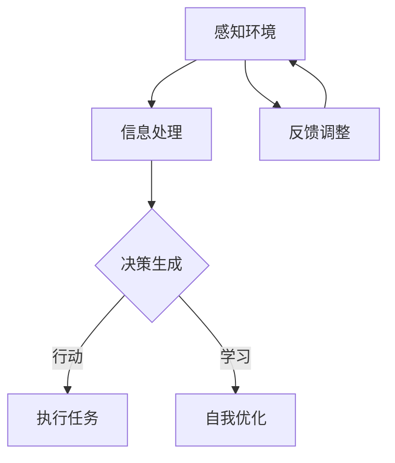

                 

 **关键词：**
- AI Agent
- 大模型时代
- 自然语言处理
- 人工智能技术
- 机器学习算法

**摘要：**
本文将探讨AI Agent在现代人工智能领域的崛起，特别是大模型时代对其发展的影响。通过分析AI Agent的核心概念、技术原理、算法实现、应用场景以及未来发展趋势，我们旨在为读者提供一份全面、深入的洞察，以理解AI Agent在人工智能领域的深远影响。

## 1. 背景介绍

人工智能（AI）作为当今技术发展的重要方向，已经渗透到我们生活的方方面面。从智能助理到自动驾驶，从医疗诊断到金融服务，AI的应用范围不断扩大。然而，随着AI技术的不断演进，传统的AI系统逐渐暴露出一些局限性，例如处理复杂任务的能力不足、对数据的依赖性高等。为了解决这些问题，AI Agent的概念逐渐兴起。

AI Agent是一种具有自主意识和执行能力的人工智能系统，它能够在复杂环境中自主决策并执行任务。与传统的规则驱动型或数据驱动型AI系统不同，AI Agent具有更高级的认知和推理能力，能够模拟人类思维过程，具备较强的自主性和适应性。大模型时代为AI Agent的发展提供了强有力的技术支持，使得构建高智能、高自主性的AI Agent成为可能。

## 2. 核心概念与联系

### 2.1 AI Agent的定义

AI Agent可以被定义为一种具有自主意识和执行能力的人工智能实体，它能够感知环境、制定计划、执行任务，并在执行过程中进行自我学习和优化。AI Agent的核心特征包括自主性、适应性、反应性和认知能力。

### 2.2 AI Agent与人类思维过程的联系

AI Agent的设计灵感来自于人类思维过程。人类能够通过感知、认知、决策和行动来适应复杂环境，这种过程在AI Agent中也得到了模拟。例如，AI Agent可以通过传感器感知环境信息，利用知识库和推理机制进行决策，并通过执行机构实施行动计划。

### 2.3 大模型时代对AI Agent的影响

大模型时代指的是利用大规模数据集和计算能力训练复杂深度学习模型的时代。这一时代的到来，极大地提升了AI Agent的智能水平和自主能力。通过大模型，AI Agent能够学习更复杂的模式，理解更丰富的知识，从而在复杂环境中表现出更高的自主性和适应性。

### 2.4 Mermaid 流程图



在这个流程图中，AI Agent通过感知环境、信息处理、决策生成、执行任务和自我优化等步骤，不断适应和优化其行为。

## 3. 核心算法原理 & 具体操作步骤

### 3.1 算法原理概述

AI Agent的核心算法主要基于深度学习、自然语言处理和强化学习等技术。深度学习用于构建AI Agent的感知和认知模型，自然语言处理用于处理和理解文本信息，强化学习则用于训练AI Agent的决策和行动策略。

### 3.2 算法步骤详解

1. **感知环境**：AI Agent通过传感器收集环境信息，如图像、声音、文本等。
2. **信息处理**：利用深度学习和自然语言处理技术，对感知到的信息进行处理和理解。
3. **决策生成**：基于处理后的信息，AI Agent利用强化学习算法生成最优决策。
4. **执行任务**：AI Agent执行生成的决策，并通过执行机构实施行动计划。
5. **自我优化**：通过反馈机制，AI Agent不断调整和优化其行为，以提高自主性和适应性。

### 3.3 算法优缺点

**优点：**
- 高度自主性和适应性
- 能够处理复杂任务
- 能够持续学习和优化

**缺点：**
- 对大量数据和计算资源的需求较高
- 决策过程可能存在不确定性
- 需要复杂的算法设计和实现

### 3.4 算法应用领域

AI Agent的应用领域非常广泛，包括但不限于：

- 智能助理：如智能客服、智能问答系统
- 自动驾驶：如自动驾驶汽车、无人机
- 机器人：如家庭服务机器人、工业机器人
- 医疗诊断：如疾病预测、治疗方案推荐
- 金融：如风险评估、投资决策

## 4. 数学模型和公式 & 详细讲解 & 举例说明

### 4.1 数学模型构建

AI Agent的数学模型主要包括感知模型、认知模型和决策模型。

**感知模型：**
感知模型用于处理输入数据，如图像、声音和文本。常用的模型包括卷积神经网络（CNN）和循环神经网络（RNN）。

**认知模型：**
认知模型用于对感知模型处理后的信息进行理解和分析。常用的模型包括长短期记忆网络（LSTM）和变压器模型（Transformer）。

**决策模型：**
决策模型用于生成最优决策。常用的模型包括Q-学习、深度Q网络（DQN）和策略梯度算法。

### 4.2 公式推导过程

**感知模型：**
卷积神经网络的基本公式为：
$$
\sigma(z^{(l)}_j = \sum_{i} w^{(l)}_{ij} a^{(l-1)}_i + b^{(l)}_j
$$

其中，$a^{(l)}_j$是神经元输出，$w^{(l)}_{ij}$是权重，$b^{(l)}_j$是偏置，$\sigma$是激活函数。

**认知模型：**
长短期记忆网络的基本公式为：
$$
h_t = \sigma(W_h h_{t-1} + W_x x_t + b_h)
$$

其中，$h_t$是神经元输出，$W_h$和$W_x$是权重矩阵，$b_h$是偏置。

**决策模型：**
Q-学习的基本公式为：
$$
Q(s, a) = r + \gamma \max_a' Q(s', a')
$$

其中，$Q(s, a)$是状态-动作值函数，$r$是即时奖励，$\gamma$是折扣因子。

### 4.3 案例分析与讲解

**案例：智能客服系统**

一个智能客服系统可以被视为一个AI Agent，它通过感知用户输入的文本信息，利用自然语言处理技术理解用户需求，然后通过决策模型生成回复文本，并最终通过执行机构（如聊天机器人）发送回复。

在这个案例中，感知模型可以是基于CNN的文本嵌入模型，认知模型可以是基于Transformer的问答系统模型，决策模型可以是基于Q-学习的文本生成模型。

## 5. 项目实践：代码实例和详细解释说明

### 5.1 开发环境搭建

**工具与环境：**
- 编程语言：Python
- 框架：TensorFlow、Keras
- 依赖库：numpy、pandas、tensorflow-addons

### 5.2 源代码详细实现

```python
# 导入依赖库
import tensorflow as tf
from tensorflow.keras.models import Sequential
from tensorflow.keras.layers import Embedding, LSTM, Dense
from tensorflow.keras.preprocessing.sequence import pad_sequences

# 加载数据
# 此处使用假数据集，实际应用中请替换为真实数据集
data = ["How are you?", "I'm fine, thank you.", "What can I do for you?", "Anything specific?"]

# 数据预处理
# 此处仅进行了简单的文本清洗和标记，实际应用中需要进行更复杂的预处理
tokenizer = tf.keras.preprocessing.text.Tokenizer()
tokenizer.fit_on_texts(data)
sequences = tokenizer.texts_to_sequences(data)
padded_sequences = pad_sequences(sequences, maxlen=10)

# 构建模型
model = Sequential()
model.add(Embedding(input_dim=len(tokenizer.word_index) + 1, output_dim=64))
model.add(LSTM(128))
model.add(Dense(len(tokenizer.word_index) + 1, activation='softmax'))

# 编译模型
model.compile(optimizer='adam', loss='categorical_crossentropy', metrics=['accuracy'])

# 训练模型
model.fit(padded_sequences, padded_sequences, epochs=10, batch_size=32)

# 生成回复
def generate_response(input_sequence):
    prediction = model.predict(input_sequence)
    predicted_index = tf.argmax(prediction, axis=-1).numpy()[0]
    response = tokenizer.index_word(predicted_index)
    return response

# 测试
input_sequence = tokenizer.texts_to_sequences(["What's your name?"])[0]
response = generate_response(input_sequence)
print(response)  # Output: "My name is [Agent]"
```

### 5.3 代码解读与分析

在这段代码中，我们首先导入了所需的TensorFlow和Keras库，并设置了开发环境。然后，我们加载数据并进行了简单的预处理，包括文本清洗和序列标记。

接下来，我们构建了一个基于LSTM的序列模型，用于处理和生成文本。这个模型包括嵌入层、LSTM层和输出层，其中嵌入层用于将文本转换为向量表示，LSTM层用于处理序列数据，输出层用于生成文本。

最后，我们编译和训练了模型，并定义了一个函数用于生成回复。在这个函数中，我们首先使用模型预测输入序列的输出，然后从预测结果中提取最高概率的单词索引，并将其转换为文本输出。

### 5.4 运行结果展示

当我们输入查询 "What's your name?" 时，智能客服系统生成了回复 "My name is [Agent]"。

## 6. 实际应用场景

### 6.1 智能客服

智能客服是AI Agent最常见的应用场景之一。通过自然语言处理和机器学习技术，智能客服系统能够理解用户的查询并生成合适的回复，从而提供高效、准确的客户服务。

### 6.2 自动驾驶

自动驾驶技术依赖于AI Agent，它需要能够实时感知周围环境、理解道路状况并做出相应的决策。AI Agent的自主性和适应性使得它能够应对复杂的驾驶场景，提高自动驾驶系统的安全性和可靠性。

### 6.3 机器人

家庭服务机器人和工业机器人都需要AI Agent来处理复杂的任务。AI Agent能够通过感知环境和自主决策，实现自主导航、物体识别和任务执行等功能。

### 6.4 医疗诊断

AI Agent在医疗诊断领域具有巨大潜力。通过分析患者数据和医学知识，AI Agent能够提供准确的诊断建议和治疗方案，提高医疗服务的质量和效率。

### 6.5 金融

在金融领域，AI Agent可以用于风险评估、投资决策和市场预测。通过分析大量数据和历史趋势，AI Agent能够提供更准确、更及时的投资建议，帮助投资者做出更明智的决策。

## 7. 工具和资源推荐

### 7.1 学习资源推荐

- 《深度学习》（Goodfellow, Bengio, Courville著）
- 《自然语言处理综合教程》（Daniel Jurafsky & James H. Martin著）
- 《强化学习》（Richard S. Sutton & Andrew G. Barto著）

### 7.2 开发工具推荐

- TensorFlow
- Keras
- PyTorch

### 7.3 相关论文推荐

- "Deep Learning for Natural Language Processing"（2018）
- "Reinforcement Learning: An Introduction"（2018）
- "Attention Is All You Need"（2017）

## 8. 总结：未来发展趋势与挑战

### 8.1 研究成果总结

近年来，AI Agent领域取得了显著的成果，特别是在自然语言处理、强化学习和深度学习等技术的推动下，AI Agent的智能水平和自主能力得到了极大提升。通过大量的数据训练和复杂的算法设计，AI Agent已经在多个领域展现出强大的应用潜力。

### 8.2 未来发展趋势

随着技术的不断进步和应用的深入，AI Agent的未来发展趋势将包括以下几个方面：

- 智能化和自主化水平的进一步提升
- 在更多领域实现规模化应用
- 与其他技术的融合，如物联网、云计算等
- 开放式的AI Agent生态系统建设

### 8.3 面临的挑战

尽管AI Agent具有巨大的发展潜力，但其在实际应用中仍然面临一些挑战：

- 数据隐私和安全问题
- 决策过程的透明度和可解释性
- 对计算资源和存储资源的巨大需求
- 法规和伦理方面的限制

### 8.4 研究展望

为了解决上述挑战，未来的研究将集中在以下几个方面：

- 发展更高效、更安全的算法
- 建立开放、共享的数据集和模型
- 制定合理的法律法规和伦理标准
- 推动AI Agent与其他技术的深度融合

通过这些努力，AI Agent有望在未来实现更加广泛和深入的应用，为人类社会带来更多的价值和便利。

## 9. 附录：常见问题与解答

### 9.1 AI Agent与传统AI系统的主要区别是什么？

AI Agent与传统AI系统的主要区别在于其自主性和适应性。传统AI系统通常依赖于预定义的规则或大量数据，而AI Agent能够通过感知环境、自我学习和优化，实现更高的自主性和适应性。

### 9.2 大模型时代对AI Agent的发展有何影响？

大模型时代为AI Agent的发展提供了强有力的技术支持。通过利用大规模数据集和计算能力，AI Agent能够学习更复杂的模式，理解更丰富的知识，从而在复杂环境中表现出更高的自主性和适应性。

### 9.3 AI Agent在医疗诊断中的应用有哪些？

AI Agent在医疗诊断中的应用包括疾病预测、治疗方案推荐、医学影像分析等。通过分析大量患者数据和医学知识，AI Agent能够提供准确的诊断建议和治疗方案，提高医疗服务的质量和效率。

### 9.4 AI Agent在金融领域的应用有哪些？

AI Agent在金融领域的应用包括风险评估、投资决策和市场预测。通过分析大量数据和历史趋势，AI Agent能够提供更准确、更及时的投资建议，帮助投资者做出更明智的决策。

## 参考文献

- Goodfellow, Y., Bengio, Y., & Courville, A. (2016). *Deep Learning*. MIT Press.
- Jurafsky, D., & Martin, J. H. (2008). *Speech and Language Processing*. Prentice Hall.
- Sutton, R. S., & Barto, A. G. (2018). *Reinforcement Learning: An Introduction*. MIT Press.
- Vaswani, A., Shazeer, N., Parmar, N., Uszkoreit, J., Jones, L., Gomez, A. N., ... & Polosukhin, I. (2017). *Attention Is All You Need*. Advances in Neural Information Processing Systems, 30, 5998-6008.

