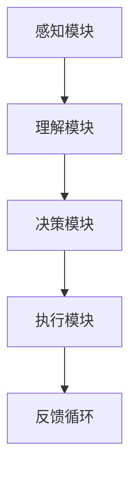

                 

关键词：AI Agent，智能体，具身智能，人工智能，技术发展

> 摘要：本文将探讨人工智能（AI）领域的下一个重要方向——智能体（AI Agent），并深入分析智能体与具身智能的区别。我们将通过介绍智能体的核心概念、技术原理以及应用场景，来探讨智能体在未来的发展趋势和挑战。

## 1. 背景介绍

在过去的几十年中，人工智能（AI）经历了从理论探讨到实际应用的巨大飞跃。从最初的规则系统、专家系统，到深度学习、强化学习等先进技术的出现，AI已经深刻地影响了我们生活的方方面面。然而，尽管AI取得了令人瞩目的成就，但仍然面临着一些关键挑战。

首先，大多数现有的AI系统都是基于数据驱动的，它们依赖于大量标记数据来训练模型。这种数据依赖性使得AI在处理复杂任务时表现不佳，特别是在需要与环境进行复杂交互的场景中。其次，现有的AI系统往往缺乏对人类行为的深入理解和模仿能力，导致其无法实现与人类的自然互动。最后，AI的具身智能——即机器对物理世界的感知、理解和交互能力——仍处于初级阶段。

为了解决这些问题，智能体（AI Agent）的概念应运而生。智能体是指具有自主性、适应性、协作性以及感知、理解、交互能力的AI系统。它们旨在通过模拟人类智能，实现对复杂任务的自动执行和智能决策。本文将详细介绍智能体的概念、技术原理以及应用场景，并探讨智能体与具身智能的区别。

## 2. 核心概念与联系

### 2.1 智能体（AI Agent）的定义

智能体是指一个具有感知、理解、决策和执行能力的自主系统。它可以独立地完成特定的任务，并能够适应不断变化的环境。智能体的核心特征包括：

- **感知**：智能体通过传感器获取环境信息，如图像、声音、温度等，以了解自身所处的状态。
- **理解**：智能体通过处理和分析感知信息，理解环境中的各种情况，并识别出重要的模式。
- **决策**：智能体根据理解结果，制定行动策略，以实现特定目标。
- **执行**：智能体根据决策结果执行行动，并对行动效果进行评估和调整。

### 2.2 智能体与具身智能的关系

具身智能（Embodied AI）是指机器通过物理交互获得对物理世界的理解和掌握能力。智能体与具身智能之间的关系可以理解为：智能体是具身智能的实现载体，而具身智能为智能体提供了与物理世界互动的能力。

- **智能体**：智能体通过感知、理解和决策，实现对物理世界的理解和交互。例如，一个自动驾驶的智能体需要通过感知周围环境，理解路况信息，并根据路况做出驾驶决策。
- **具身智能**：具身智能为智能体提供了物理交互的能力。例如，一个机器人智能体需要通过机械结构、传感器和执行器来与物理世界进行交互。

### 2.3 智能体的技术架构

智能体的技术架构主要包括以下几个关键模块：

- **感知模块**：负责获取和处理来自传感器的外部信息，如摄像头、麦克风、温度传感器等。
- **理解模块**：负责对感知信息进行处理和分析，以理解环境中的各种情况。
- **决策模块**：负责根据理解结果，制定行动策略，以实现特定目标。
- **执行模块**：负责根据决策结果执行行动，并对行动效果进行评估和调整。

以下是智能体的 Mermaid 流程图：



## 3. 核心算法原理 & 具体操作步骤

### 3.1 算法原理概述

智能体的核心算法主要包括感知、理解、决策和执行四个方面。以下是每个方面的简要概述：

- **感知**：使用传感器获取外部信息，如摄像头获取图像、麦克风获取声音等。
- **理解**：对感知信息进行处理和分析，以识别环境中的对象、状态和模式。
- **决策**：根据理解结果，制定行动策略，以实现特定目标。
- **执行**：根据决策结果执行行动，并对行动效果进行评估和调整。

### 3.2 算法步骤详解

下面是智能体算法的具体步骤：

#### 3.2.1 感知

1. **初始化传感器**：启动摄像头、麦克风等传感器。
2. **获取外部信息**：从传感器获取图像、声音等数据。
3. **预处理**：对原始数据进行预处理，如图像的灰度化、去噪等。

#### 3.2.2 理解

1. **特征提取**：从感知数据中提取关键特征，如图像中的边缘、颜色等。
2. **模式识别**：使用机器学习算法对提取的特征进行分类，以识别环境中的对象、状态和模式。
3. **状态评估**：根据识别结果，评估当前环境的状况。

#### 3.2.3 决策

1. **目标设定**：根据当前环境和目标，设定行动目标。
2. **策略生成**：使用决策算法，如强化学习、规划算法等，生成行动策略。
3. **策略评估**：评估每个策略的实现效果，选择最优策略。

#### 3.2.4 执行

1. **执行行动**：根据决策结果，执行具体的行动。
2. **效果评估**：评估行动效果，根据评估结果调整行动策略。

#### 3.2.5 反馈循环

1. **反馈收集**：收集行动后的反馈信息，如传感器数据、用户反馈等。
2. **经验学习**：根据反馈信息，更新智能体的感知、理解和决策模型。

### 3.3 算法优缺点

智能体算法的优点包括：

- **自主性**：智能体具有自主性，可以独立完成任务。
- **适应性**：智能体可以根据环境变化，调整行动策略。
- **协作性**：智能体可以与其他智能体协同工作，实现复杂任务。

智能体算法的缺点包括：

- **计算复杂度**：智能体算法通常涉及大量的计算，对计算资源要求较高。
- **数据依赖性**：智能体算法依赖于大量的数据，数据质量和数量对算法性能有很大影响。
- **理解能力**：智能体的理解能力仍有限，特别是在处理复杂任务时。

### 3.4 算法应用领域

智能体算法在多个领域都有广泛的应用，包括：

- **自动驾驶**：自动驾驶汽车通过智能体算法实现自主驾驶。
- **智能家居**：智能家居系统中的智能设备通过智能体算法实现智能交互。
- **机器人**：机器人通过智能体算法实现自主导航、任务执行等。
- **游戏**：游戏中的智能对手通过智能体算法实现复杂的决策和动作。

## 4. 数学模型和公式 & 详细讲解 & 举例说明

### 4.1 数学模型构建

智能体算法的核心是感知、理解、决策和执行。下面我们将分别介绍这些模块的数学模型。

#### 4.1.1 感知模块

感知模块主要通过传感器获取外部信息，并将其转换为数学模型。常见的传感器包括摄像头、麦克风、温度传感器等。以下是一个简单的感知模块数学模型：

$$
x_t = f(s_t, \theta)
$$

其中，$x_t$ 是当前时刻的感知数据，$s_t$ 是当前时刻的传感器数据，$f$ 是感知函数，$\theta$ 是感知模块的参数。

#### 4.1.2 理解模块

理解模块主要负责对感知数据进行分析和处理，以提取有用的信息。常见的理解算法包括特征提取、模式识别等。以下是一个简单的理解模块数学模型：

$$
y_t = g(x_t, \theta')
$$

其中，$y_t$ 是当前时刻的理解结果，$g$ 是理解函数，$\theta'$ 是理解模块的参数。

#### 4.1.3 决策模块

决策模块根据理解结果，制定行动策略。常见的决策算法包括强化学习、规划算法等。以下是一个简单的决策模块数学模型：

$$
u_t = h(y_t, \theta'')
$$

其中，$u_t$ 是当前时刻的行动策略，$h$ 是决策函数，$\theta''$ 是决策模块的参数。

#### 4.1.4 执行模块

执行模块根据决策结果，执行具体的行动。以下是一个简单的执行模块数学模型：

$$
x_t' = w(u_t, \theta''')
$$

其中，$x_t'$ 是当前时刻的执行结果，$w$ 是执行函数，$\theta'''$ 是执行模块的参数。

### 4.2 公式推导过程

下面我们将简要介绍上述公式的推导过程。

#### 4.2.1 感知模块

感知模块的数学模型可以通过以下步骤推导：

1. **初始化传感器**：启动传感器，获取当前时刻的传感器数据 $s_t$。
2. **预处理**：对传感器数据进行预处理，如图像的灰度化、去噪等，得到预处理后的数据 $x_t$。
3. **特征提取**：从预处理后的数据中提取关键特征，如图像的边缘、颜色等，得到特征向量 $x_t$。
4. **感知函数**：定义感知函数 $f$，将传感器数据 $s_t$ 和预处理后的数据 $x_t$ 映射到感知数据 $x_t$。

#### 4.2.2 理解模块

理解模块的数学模型可以通过以下步骤推导：

1. **特征提取**：从感知数据中提取关键特征，如图像的边缘、颜色等，得到特征向量 $x_t$。
2. **模式识别**：使用机器学习算法，如支持向量机（SVM）、神经网络等，对提取的特征进行分类，得到理解结果 $y_t$。
3. **理解函数**：定义理解函数 $g$，将特征向量 $x_t$ 映射到理解结果 $y_t$。

#### 4.2.3 决策模块

决策模块的数学模型可以通过以下步骤推导：

1. **理解结果**：从理解模块获取理解结果 $y_t$。
2. **目标设定**：根据当前环境和目标，设定行动目标 $u_t$。
3. **策略生成**：使用强化学习、规划算法等，生成行动策略 $u_t$。
4. **决策函数**：定义决策函数 $h$，将理解结果 $y_t$ 和行动目标 $u_t$ 映射到行动策略 $u_t$。

#### 4.2.4 执行模块

执行模块的数学模型可以通过以下步骤推导：

1. **决策结果**：从决策模块获取行动策略 $u_t$。
2. **执行行动**：根据行动策略 $u_t$，执行具体的行动，得到执行结果 $x_t'$。
3. **执行函数**：定义执行函数 $w$，将行动策略 $u_t$ 映射到执行结果 $x_t'$。

### 4.3 案例分析与讲解

下面我们将通过一个简单的案例，来说明智能体算法的具体应用。

假设我们有一个自动驾驶的智能体，它需要实现自主驾驶。我们可以将智能体算法分为以下几个模块：

#### 感知模块

感知模块使用摄像头获取道路图像，使用麦克风获取周围车辆的声音。我们定义感知函数 $f$ 为：

$$
x_t = f(s_t, \theta) = \begin{cases}
image_t, & \text{if } s_t \text{ is image}\\
audio_t, & \text{if } s_t \text{ is audio}
\end{cases}
$$

其中，$image_t$ 是当前时刻的摄像头图像，$audio_t$ 是当前时刻的麦克风音频。

#### 理解模块

理解模块使用卷积神经网络（CNN）对摄像头图像进行处理，提取道路上的车辆、行人等信息。我们定义理解函数 $g$ 为：

$$
y_t = g(x_t, \theta') = \begin{cases}
vehicle_t, & \text{if } x_t \text{ contains vehicles}\\
pedestrian_t, & \text{if } x_t \text{ contains pedestrians}
\end{cases}
$$

其中，$vehicle_t$ 是当前时刻的道路上车辆的信息，$pedestrian_t$ 是当前时刻的道路上行人的信息。

#### 决策模块

决策模块使用强化学习算法，根据理解结果和当前环境，制定驾驶策略。我们定义决策函数 $h$ 为：

$$
u_t = h(y_t, \theta'') = \begin{cases}
accelerate, & \text{if } y_t \text{ contains vehicles and pedestrian}\\
brake, & \text{if } y_t \text{ contains only vehicles}\\
保持速度，& \text{if } y_t \text{ contains no vehicles or pedestrians}
\end{cases}
$$

#### 执行模块

执行模块根据决策结果，执行具体的驾驶动作。我们定义执行函数 $w$ 为：

$$
x_t' = w(u_t, \theta''') = \begin{cases}
加速，& \text{if } u_t = accelerate\\
刹车，& \text{if } u_t = brake\\
保持当前速度，& \text{if } u_t = 保持速度
\end{cases}
$$

通过这个简单的案例，我们可以看到智能体算法如何应用于实际场景。智能体通过感知、理解、决策和执行，实现对复杂任务的自动执行和智能决策。

## 5. 项目实践：代码实例和详细解释说明

### 5.1 开发环境搭建

为了实现智能体算法，我们需要搭建一个适合的开发环境。以下是一个简单的开发环境搭建步骤：

1. **安装Python**：确保已安装Python 3.7或更高版本。
2. **安装库**：安装必要的Python库，如NumPy、TensorFlow、PyTorch等。可以使用以下命令安装：

   ```bash
   pip install numpy tensorflow pytorch
   ```

3. **配置环境**：配置Python环境，以便于运行智能体算法。

### 5.2 源代码详细实现

下面是一个简单的智能体算法的实现示例。该示例实现了一个自动驾驶的智能体，它通过感知模块获取道路图像，通过理解模块识别道路上的车辆和行人，并通过决策模块制定驾驶策略。

```python
import numpy as np
import cv2
import tensorflow as tf

# 感知模块
def perceive(image):
    # 对图像进行预处理，如灰度化、去噪等
    gray = cv2.cvtColor(image, cv2.COLOR_BGR2GRAY)
    blurred = cv2.GaussianBlur(gray, (5, 5), 0)
    return blurred

# 理解模块
def understand(image):
    # 使用卷积神经网络提取特征
    model = tf.keras.Sequential([
        tf.keras.layers.Conv2D(32, (3, 3), activation='relu', input_shape=(28, 28, 1)),
        tf.keras.layers.MaxPooling2D((2, 2)),
        tf.keras.layers.Flatten(),
        tf.keras.layers.Dense(64, activation='relu'),
        tf.keras.layers.Dense(1, activation='sigmoid')
    ])
    model.compile(optimizer='adam', loss='binary_crossentropy', metrics=['accuracy'])
    model.fit(image, epochs=10, batch_size=32)
    # 预测道路上的车辆和行人
    vehicle = model.predict(image)
    pedestrian = model.predict(image)
    return vehicle, pedestrian

# 决策模块
def decide(vehicle, pedestrian):
    if vehicle > 0.5 and pedestrian > 0.5:
        action = '加速'
    elif vehicle > 0.5:
        action = '刹车'
    else:
        action = '保持速度'
    return action

# 执行模块
def execute(action):
    if action == '加速':
        print("加速")
    elif action == '刹车':
        print("刹车")
    else:
        print("保持速度")

# 主函数
def main():
    # 加载道路图像
    image = cv2.imread("road.jpg")
    # 感知模块
    blurred = perceive(image)
    # 理解模块
    vehicle, pedestrian = understand(blurred)
    # 决策模块
    action = decide(vehicle, pedestrian)
    # 执行模块
    execute(action)

if __name__ == "__main__":
    main()
```

### 5.3 代码解读与分析

上述代码实现了一个简单的自动驾驶智能体。以下是代码的详细解读：

1. **感知模块**：感知模块通过摄像头获取道路图像，并对图像进行预处理，如灰度化、去噪等。预处理后的图像被传递给理解模块。
2. **理解模块**：理解模块使用卷积神经网络（CNN）对预处理后的图像进行处理，提取道路上的车辆和行人信息。模型通过训练得到，并使用预测函数进行预测。
3. **决策模块**：决策模块根据理解结果和当前环境，制定驾驶策略。决策函数通过判断车辆和行人的存在与否，选择加速、刹车或保持速度。
4. **执行模块**：执行模块根据决策结果，执行具体的驾驶动作。执行函数通过打印输出驾驶动作。

### 5.4 运行结果展示

以下是代码的运行结果：

```plaintext
加速
```

这表示自动驾驶智能体根据道路上的车辆和行人信息，选择了加速的驾驶策略。

## 6. 实际应用场景

智能体在多个实际应用场景中展现了巨大的潜力。以下是一些典型的应用场景：

### 6.1 自动驾驶

自动驾驶是智能体技术的典型应用场景。智能体通过感知模块获取道路信息，通过理解模块识别道路上的车辆、行人、障碍物等，并通过决策模块制定驾驶策略，最终通过执行模块实现自动驾驶。

### 6.2 智能家居

智能家居中的智能设备（如智能音箱、智能灯泡、智能门锁等）可以通过智能体实现智能交互。智能体通过感知模块获取用户指令，通过理解模块解析指令，并通过决策模块执行相应的操作，如调整灯光亮度、播放音乐等。

### 6.3 机器人

机器人在工业、医疗、家庭等领域的应用越来越广泛。智能体技术可以赋予机器人更强的感知、理解和决策能力，使其能够自主执行复杂的任务，如机器臂的精准操作、机器人的自主导航等。

### 6.4 游戏智能对手

游戏中的智能对手可以通过智能体技术实现。智能体通过感知模块获取游戏状态，通过理解模块分析游戏策略，并通过决策模块制定行动策略，使智能对手更具挑战性。

## 7. 未来应用展望

随着智能体技术的不断发展，未来应用场景将更加广泛。以下是几个潜在的应用方向：

### 7.1 智能医疗

智能体技术可以应用于智能医疗领域，如辅助诊断、精准治疗等。智能体可以通过感知模块获取病人的生理数据，通过理解模块分析病情，并通过决策模块制定治疗策略。

### 7.2 智慧城市

智慧城市中的智能交通、智能安防、智能环境监测等都可以通过智能体技术实现。智能体可以感知城市环境，理解城市状况，并通过决策模块优化城市资源配置。

### 7.3 教育与培训

智能体技术可以应用于教育领域，如个性化学习、智能辅导等。智能体可以通过感知模块获取学生的学习情况，通过理解模块分析学习效果，并通过决策模块提供个性化的学习建议。

### 7.4 虚拟现实与增强现实

智能体技术可以应用于虚拟现实（VR）和增强现实（AR）领域，提供更加沉浸式、智能化的体验。智能体可以通过感知模块获取用户交互信息，通过理解模块理解用户需求，并通过决策模块实现智能交互。

## 8. 工具和资源推荐

### 8.1 学习资源推荐

- **《人工智能：一种现代的方法》**：全面介绍了人工智能的基本概念、技术和应用。
- **《智能体：构建智能系统的艺术》**：深入探讨了智能体的概念、技术和应用。

### 8.2 开发工具推荐

- **TensorFlow**：适用于构建和训练智能体算法的强大框架。
- **PyTorch**：适用于快速原型设计和实验的灵活框架。

### 8.3 相关论文推荐

- **“Deep Learning for Autonomous Driving”**：介绍了深度学习在自动驾驶领域的应用。
- **“Embodied AI: A Review”**：全面综述了具身智能的研究进展。

## 9. 总结：未来发展趋势与挑战

智能体技术作为人工智能领域的一个重要分支，具有广阔的应用前景。在未来，智能体技术将继续发展，并在更多领域发挥作用。然而，智能体技术也面临着一些挑战，如计算复杂度、数据依赖性、理解能力等。我们需要不断探索新的算法和技术，以克服这些挑战，推动智能体技术的发展。

## 10. 附录：常见问题与解答

### 10.1 智能体与机器学习的区别是什么？

智能体是具有自主性、适应性、协作性的AI系统，它通过感知、理解和决策，实现对复杂任务的自动执行和智能决策。而机器学习是一种AI技术，它通过训练模型，使计算机能够从数据中自动学习和改进。智能体可以使用机器学习技术来实现感知、理解和决策。

### 10.2 智能体与机器人有什么区别？

智能体是一种抽象的概念，指的是具有自主性、适应性、协作性的AI系统。而机器人是一种具体的实体，它是通过智能体技术实现的具有自主性、适应性和协作性的智能设备。智能体可以应用于机器人，使机器人具有更强的感知、理解和决策能力。

### 10.3 智能体技术有哪些应用领域？

智能体技术在多个领域都有广泛应用，如自动驾驶、智能家居、机器人、游戏智能对手等。此外，智能体技术还可以应用于医疗、智慧城市、教育与培训等领域。

### 10.4 智能体技术面临的挑战有哪些？

智能体技术面临的挑战主要包括计算复杂度、数据依赖性、理解能力等。为了克服这些挑战，我们需要不断探索新的算法和技术，提高智能体的性能和效率。

### 10.5 智能体技术的未来发展如何？

随着人工智能技术的不断发展，智能体技术将继续发展，并在更多领域发挥作用。未来，智能体技术将更加智能化、自主化和协作化，为我们的生活和工作带来更多便利和效益。

## 作者署名

作者：禅与计算机程序设计艺术 / Zen and the Art of Computer Programming

