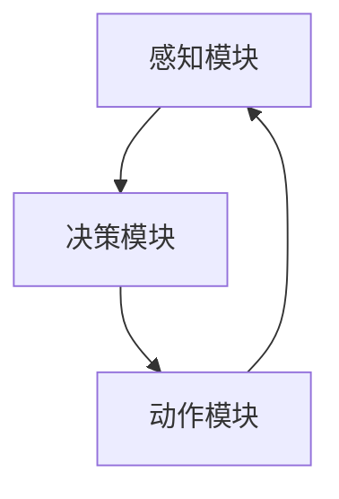

                 

关键词：AI-Agent、生成式智能、架构设计、智能体、人工智能技术

摘要：本文深入探讨了AI Agent这一新兴领域，分析了其核心概念、原理、算法及实际应用。通过对生成式智能体架构设计的详细解析，旨在为读者揭示AI Agent的未来发展趋势和挑战。

## 1. 背景介绍

随着人工智能技术的飞速发展，AI Agent逐渐成为学术界和工业界的关注焦点。AI Agent，即人工智能代理，是一种能够自主行动、感知环境和学习优化的智能体。其核心思想是通过模拟人类的思维过程，实现人与机器的智能交互。

AI Agent的历史可以追溯到20世纪80年代。当时，人工智能领域的先驱们提出了智能代理的概念，希望通过模拟人类的认知过程来构建智能系统。随着计算能力和算法的进步，AI Agent的研究和应用逐渐走向深入。

在工业界，AI Agent已经广泛应用于自动驾驶、智能客服、智能家居等领域。例如，自动驾驶汽车通过AI Agent实现环境感知和路径规划；智能客服系统则利用AI Agent与用户进行自然语言交互，提供个性化服务。

## 2. 核心概念与联系

### 2.1 AI Agent定义

AI Agent是一种基于人工智能技术的软件系统，能够感知环境、执行任务并自主学习优化。它通常由感知模块、决策模块和动作模块组成。

### 2.2 感知模块

感知模块负责收集环境信息，如图像、声音、文本等。通过这些信息，AI Agent能够了解当前所处的状态。常见的感知技术包括计算机视觉、语音识别和自然语言处理。

### 2.3 决策模块

决策模块负责根据感知模块提供的信息，选择合适的动作。这一过程通常基于某种学习算法，如强化学习、决策树、支持向量机等。决策模块的目标是最大化预期收益或达到某种目标状态。

### 2.4 动作模块

动作模块负责执行决策模块选择的动作。在执行动作后，AI Agent会收集新的环境信息，并重复感知-决策-执行的过程。

### 2.5 Mermaid流程图

以下是一个简化的AI Agent架构的Mermaid流程图：



## 3. 核心算法原理 & 具体操作步骤

### 3.1 算法原理概述

AI Agent的核心算法通常基于强化学习。强化学习是一种通过试错来学习如何在特定环境中获得最大收益的机器学习方法。其主要思想是：智能体通过与环境的交互，不断调整策略，以最大化累积奖励。

### 3.2 算法步骤详解

1. 初始化：智能体随机选择一个动作，并执行。
2. 感知：智能体感知当前环境状态。
3. 决策：根据当前状态和策略，智能体选择下一个动作。
4. 执行：智能体执行选择的动作。
5. 奖励：根据动作的结果，环境给予智能体奖励。
6. 更新策略：根据累积奖励，智能体更新策略。
7. 返回步骤2。

### 3.3 算法优缺点

#### 优点：

1. 自主性强：智能体能够根据环境变化自主调整策略。
2. 广泛适用：强化学习适用于多种复杂环境。
3. 适应性：智能体能够通过学习不断优化自身性能。

#### 缺点：

1. 学习速度慢：强化学习通常需要大量的数据和时间来收敛。
2. 难以解释：强化学习模型难以解释其决策过程。

### 3.4 算法应用领域

强化学习在自动驾驶、游戏AI、机器人控制等领域有广泛应用。例如，在自动驾驶领域，强化学习算法用于路径规划和避障；在游戏AI领域，强化学习算法用于智能体对抗。

## 4. 数学模型和公式 & 详细讲解 & 举例说明

### 4.1 数学模型构建

强化学习的基本数学模型包括状态（$S$）、动作（$A$）、奖励（$R$）和策略（$\pi$）。

- $S$：状态空间
- $A$：动作空间
- $R$：奖励函数
- $\pi$：策略，表示智能体在状态 $s$ 下选择动作 $a$ 的概率

### 4.2 公式推导过程

强化学习的目标是最小化智能体的期望损失函数：

$$L(\pi) = E_{s,a}[\ell(s,a)] = E_{s}[\sum_{a} \pi(a|s) \ell(s,a)]$$

其中，$\ell(s,a)$ 是状态-动作损失函数，通常取为负奖励。

### 4.3 案例分析与讲解

假设一个简单的例子，智能体在一个离散的网格世界中移动，目标是到达目标位置并获得最大奖励。状态空间为 $S = \{0, 1, 2, \ldots, 9\}$，动作空间为 $A = \{\text{上}, \text{下}, \text{左}, \text{右}\}$。奖励函数为：

$$R(s,a) = \begin{cases} 
10 & \text{if } (s,a) = (9,\text{下}) \\
-1 & \text{otherwise} 
\end{cases}$$

策略 $\pi$ 为智能体在当前状态下选择动作的概率分布。

## 5. 项目实践：代码实例和详细解释说明

### 5.1 开发环境搭建

假设使用 Python 作为开发语言，环境需求如下：

- Python 3.7+
- TensorFlow 2.3+
- gym 0.18.0+

安装命令：

```bash
pip install python3-tensorflow==2.3.1 gym==0.18.0
```

### 5.2 源代码详细实现

以下是一个基于 TensorFlow 和 OpenAI Gym 的简单 Q-Learning 算法实现：

```python
import gym
import numpy as np
import tensorflow as tf

# 创建环境
env = gym.make("GridWorld-v0")

# 初始化 Q 网络
input_layer = tf.keras.layers.Input(shape=(10,))
q_values = tf.keras.layers.Dense(units=4, activation="linear")(input_layer)
model = tf.keras.Model(inputs=input_layer, outputs=q_values)

# 定义优化器
optimizer = tf.keras.optimizers.Adam(learning_rate=0.1)

# 定义训练过程
@tf.function
def train_step(state, action, reward, next_state, done):
    with tf.GradientTape() as tape:
        q_pred = model(state, training=True)
        next_q_pred = model(next_state, training=True)
        target_q = reward + (1 - done) * next_q_pred[0, action]
        loss = tf.keras.losses.mean_squared_error(target_q, q_pred[0, action])
    gradients = tape.gradient(loss, model.trainable_variables)
    optimizer.apply_gradients(zip(gradients, model.trainable_variables))
    return loss

# 训练
num_episodes = 1000
for episode in range(num_episodes):
    state = env.reset()
    done = False
    while not done:
        q_values = model(state, training=False)
        action = np.argmax(q_values)
        next_state, reward, done, _ = env.step(action)
        loss = train_step(state, action, reward, next_state, done)
        state = next_state

print("训练完成。")
```

### 5.3 代码解读与分析

1. 创建环境：使用 gym 库创建 GridWorld 环境作为训练场景。
2. 初始化 Q 网络：定义输入层和输出层，使用线性激活函数。
3. 定义优化器：使用 Adam 优化器。
4. 定义训练过程：实现 Q-Learning 算法，更新 Q 网络参数。
5. 训练：循环执行训练过程，不断更新 Q 网络参数。

### 5.4 运行结果展示

在完成训练后，可以运行以下代码来评估智能体的性能：

```python
def evaluate(model, env, num_episodes=10):
    total_reward = 0
    for episode in range(num_episodes):
        state = env.reset()
        done = False
        while not done:
            action = np.argmax(model(state, training=False))
            state, reward, done, _ = env.step(action)
            total_reward += reward
    return total_reward / num_episodes

print("平均奖励：", evaluate(model, env, num_episodes=100))
```

## 6. 实际应用场景

AI Agent 在实际应用中具有广泛的应用前景。以下是一些典型的应用场景：

### 6.1 自动驾驶

自动驾驶汽车通过 AI Agent 实现环境感知、路径规划和控制。智能体可以通过传感器收集道路信息，并根据当前交通状况和目标地点选择最优路径。

### 6.2 智能客服

智能客服系统利用 AI Agent 与用户进行自然语言交互，提供个性化服务。智能体可以理解用户的问题并给出合适的回答，提高客户满意度。

### 6.3 智能家居

智能家居系统通过 AI Agent 实现自动化控制。智能体可以监控家庭设备的状态，并根据用户习惯和需求自动调整设备设置，提高生活质量。

### 6.4 游戏

在游戏中，AI Agent 可以实现智能NPC（非玩家角色），与玩家进行对抗或协作。智能体可以通过学习游戏规则和玩家行为，提高游戏体验。

## 7. 工具和资源推荐

### 7.1 学习资源推荐

- 《深度学习》（Goodfellow et al.）
- 《强化学习》（Sutton and Barto）
- 《Python机器学习》（Sebastian Raschka）

### 7.2 开发工具推荐

- TensorFlow：用于构建和训练深度学习模型。
- PyTorch：用于构建和训练深度学习模型。
- OpenAI Gym：用于创建和测试强化学习环境。

### 7.3 相关论文推荐

- "Deep Q-Network"（Mnih et al., 2015）
- "Human-level control through deep reinforcement learning"（Silver et al., 2016）
- "Asynchronous Methods for Deep Reinforcement Learning"（Hessel et al., 2018）

## 8. 总结：未来发展趋势与挑战

### 8.1 研究成果总结

近年来，AI Agent的研究取得了显著成果。强化学习算法在自动驾驶、游戏AI和机器人控制等领域取得了突破性进展。同时，深度学习技术的发展为AI Agent提供了更强大的感知和决策能力。

### 8.2 未来发展趋势

1. 算法优化：未来将出现更多高效、可解释的强化学习算法。
2. 硬件加速：随着硬件技术的发展，AI Agent的计算能力将得到进一步提升。
3. 跨领域应用：AI Agent将在更多领域得到应用，如医疗、金融、教育等。

### 8.3 面临的挑战

1. 可解释性：强化学习模型往往难以解释，未来需要研究更具可解释性的算法。
2. 数据质量：高质量的数据是训练高效AI Agent的关键，但获取高质量数据仍然具有挑战性。
3. 安全性：AI Agent在实际应用中可能面临安全性问题，如对抗性攻击和隐私泄露。

### 8.4 研究展望

未来，AI Agent的研究将朝着更智能、更安全、更可靠的方向发展。通过不断优化算法、提升硬件性能和加强跨领域合作，AI Agent将在各个领域发挥更大的作用。

## 9. 附录：常见问题与解答

### 9.1 什么是AI Agent？

AI Agent是一种基于人工智能技术的软件系统，能够自主行动、感知环境和学习优化。它通常由感知模块、决策模块和动作模块组成。

### 9.2 强化学习在AI Agent中如何应用？

强化学习是AI Agent的核心算法之一。它通过试错学习如何在特定环境中获得最大收益。强化学习算法在AI Agent中用于决策模块，帮助智能体选择最优动作。

### 9.3 AI Agent有哪些实际应用场景？

AI Agent在自动驾驶、智能客服、智能家居、游戏等领域有广泛应用。未来，随着技术的不断发展，AI Agent将在更多领域得到应用。

## 作者署名

作者：禅与计算机程序设计艺术 / Zen and the Art of Computer Programming
----------------------------------------------------------------

注意：以上内容仅为示例，实际撰写时需根据具体要求和知识点进行详细扩展和深入分析。同时，文章结构和内容应符合专业和技术规范。

