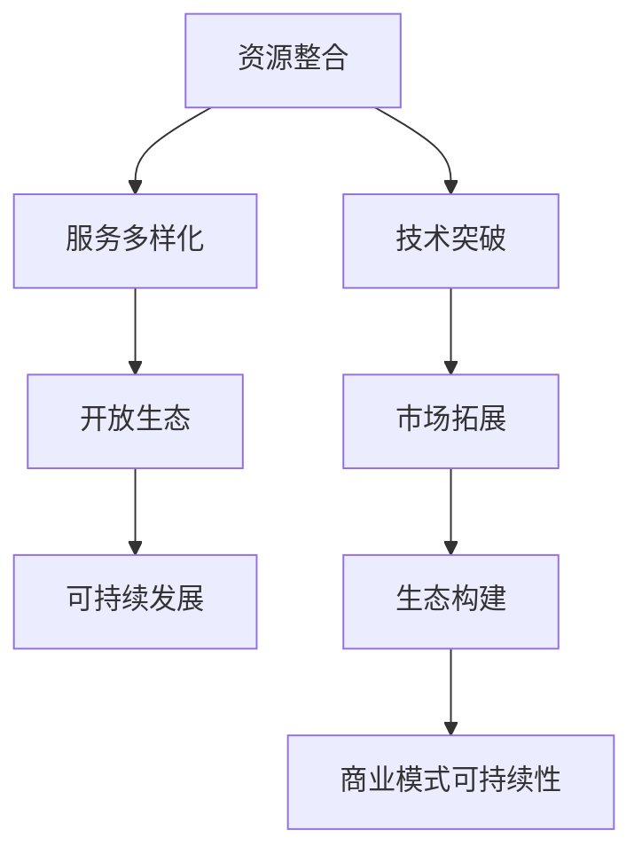

                 

关键词：AI Cloud，贾扬清，Lepton AI，技术前景，挑战与展望

> 摘要：本文旨在探讨AI Cloud的未来，通过对贾扬清的愿景以及Lepton AI的前景挑战进行分析，深入探讨AI技术在云计算领域的发展趋势，面临的挑战以及未来可能的解决方案。

## 1. 背景介绍

近年来，人工智能（AI）技术在全球范围内取得了飞速发展，成为推动社会进步的重要力量。AI技术的应用范围不断扩大，从传统的工业制造、金融服务到医疗健康、智能交通等领域，AI无处不在。同时，云计算的兴起也为AI技术提供了强大的支持。AI Cloud作为一个新兴领域，正逐渐成为科技巨头和企业创新的重要方向。

贾扬清，作为中国AI领域的领军人物，以其深厚的学术背景和丰富的行业经验，对AI Cloud的发展有着独特的见解和深刻的思考。他的愿景是构建一个全面、高效的AI Cloud生态系统，推动AI技术的普及和应用。

Lepton AI，是一家专注于AI硬件创新的公司，其愿景是构建一个高效、可靠的AI基础设施，为AI技术的广泛应用提供强有力的支持。然而，面对AI Cloud的快速发展，Lepton AI也面临着诸多挑战。

本文将围绕贾扬清的愿景和Lepton AI的前景挑战，探讨AI Cloud的未来发展。

## 2. 核心概念与联系

### 2.1. AI Cloud的概念

AI Cloud，即人工智能云计算，是一种基于云计算技术的人工智能服务模式。它将AI算法、数据和计算资源整合到云端，通过提供高效、可靠的AI服务，满足不同行业和应用场景的需求。

### 2.2. 贾扬清的AI Cloud愿景

贾扬清的AI Cloud愿景，主要包括以下几个方面：

1. **资源整合**：通过整合全球范围内的计算资源、数据资源和算法资源，构建一个高效、可靠的AI基础设施。
2. **服务多样化**：提供丰富的AI服务，满足不同行业和应用场景的需求。
3. **开放生态**：构建一个开放、共享的AI生态，推动AI技术的普及和应用。
4. **可持续发展**：通过技术创新和产业合作，实现AI Cloud的可持续发展。

### 2.3. Lepton AI的前景挑战

Lepton AI作为一家专注于AI硬件创新的公司，其面临的前景挑战主要包括：

1. **技术突破**：在AI硬件领域实现技术突破，提高AI处理效率。
2. **市场拓展**：拓展市场应用场景，提高市场占有率。
3. **生态构建**：构建一个强大的生态体系，为AI硬件创新提供支持。
4. **可持续发展**：实现商业模式的可持续性，为公司的长期发展提供保障。

### 2.4. Mermaid流程图

以下是一个关于AI Cloud发展的Mermaid流程图，展示了从资源整合到服务多样化，再到开放生态和可持续发展等关键步骤。



## 3. 核心算法原理 & 具体操作步骤

### 3.1 算法原理概述

AI Cloud的核心在于高效、可靠的AI服务。这需要依托于一系列核心算法的支撑。以下是几个关键算法的原理概述：

1. **深度学习算法**：通过多层神经网络结构，实现对复杂数据的建模和分析。
2. **强化学习算法**：通过不断试错和反馈，实现智能体的自主学习和优化。
3. **迁移学习算法**：通过利用已有的知识，提高新任务的性能。

### 3.2 算法步骤详解

以下是AI Cloud中的关键算法的具体步骤详解：

#### 3.2.1 深度学习算法步骤

1. **数据预处理**：对输入数据进行清洗、归一化等处理。
2. **模型构建**：构建多层神经网络结构。
3. **模型训练**：通过反向传播算法，不断调整模型参数，优化模型性能。
4. **模型评估**：使用验证集对模型进行评估，调整模型参数。
5. **模型部署**：将训练好的模型部署到云端，提供AI服务。

#### 3.2.2 强化学习算法步骤

1. **环境构建**：创建模拟环境，模拟真实场景。
2. **策略学习**：使用策略梯度算法，不断优化策略。
3. **策略评估**：评估策略的有效性，调整策略参数。
4. **策略部署**：将优化后的策略部署到实际场景。

#### 3.2.3 迁移学习算法步骤

1. **源任务学习**：在源任务上训练模型，获取通用知识。
2. **目标任务调整**：在目标任务上调整模型参数，优化模型性能。
3. **模型评估**：评估模型在目标任务上的性能，调整模型参数。
4. **模型部署**：将训练好的模型部署到云端，提供AI服务。

### 3.3 算法优缺点

#### 3.3.1 深度学习算法

**优点**：能够处理复杂数据，具有较强的泛化能力。

**缺点**：对数据量要求较高，训练过程较为耗时。

#### 3.3.2 强化学习算法

**优点**：能够自主学习和优化，适应性强。

**缺点**：训练过程较为耗时，对环境依赖较强。

#### 3.3.3 迁移学习算法

**优点**：能够利用已有知识，提高新任务的性能。

**缺点**：对源任务和目标任务的相似度要求较高。

### 3.4 算法应用领域

#### 3.4.1 深度学习算法

**应用领域**：图像识别、语音识别、自然语言处理等。

#### 3.4.2 强化学习算法

**应用领域**：游戏AI、自动驾驶、智能推荐等。

#### 3.4.3 迁移学习算法

**应用领域**：医疗诊断、环境监测、农业等领域。

## 4. 数学模型和公式 & 详细讲解 & 举例说明

### 4.1 数学模型构建

AI Cloud中的核心算法涉及到大量的数学模型。以下是一个简单的数学模型构建过程：

#### 4.1.1 深度学习模型

$$
y = f(\theta \cdot x + b)
$$

其中，$y$ 是输出，$f$ 是激活函数，$\theta$ 是权重矩阵，$x$ 是输入，$b$ 是偏置。

#### 4.1.2 强化学习模型

$$
Q(s, a) = r + \gamma \max_{a'} Q(s', a')
$$

其中，$Q(s, a)$ 是状态-动作值函数，$r$ 是立即回报，$\gamma$ 是折扣因子，$s$ 是状态，$a$ 是动作，$s'$ 是下一状态，$a'$ 是下一动作。

#### 4.1.3 迁移学习模型

$$
\theta_{\text{target}} = \theta_{\text{source}} + \alpha ( \theta_{\text{source}} - \theta_{\text{target}} )
$$

其中，$\theta_{\text{target}}$ 是目标模型的参数，$\theta_{\text{source}}$ 是源模型的参数，$\alpha$ 是调整参数。

### 4.2 公式推导过程

以下是对上述数学模型的推导过程：

#### 4.2.1 深度学习模型

1. **前向传播**：

$$
z = \theta \cdot x + b \\
a = f(z)
$$

2. **反向传播**：

$$
\delta_a = \frac{\partial L}{\partial a} \\
\delta_z = \delta_a \cdot \frac{\partial f}{\partial z} \\
\theta = \theta - \alpha \cdot \delta_z \cdot x^T \\
b = b - \alpha \cdot \delta_z
$$

#### 4.2.2 强化学习模型

1. **Q值更新**：

$$
Q(s, a) = r + \gamma \max_{a'} Q(s', a')
$$

2. **策略梯度**：

$$
\nabla_{\theta} J(\theta) = \frac{\partial J(\theta)}{\partial \theta} = \sum_{s, a} \nabla_{\theta} Q(s, a) \cdot \pi(a|s)
$$

3. **策略迭代**：

$$
\pi(a|s) = \frac{e^{\nabla_{\theta} Q(s, a)}}{\sum_{a'} e^{\nabla_{\theta} Q(s, a')}}
$$

### 4.3 案例分析与讲解

以下是一个基于深度学习模型的AI Cloud案例分析：

#### 4.3.1 案例背景

某电商公司希望通过AI Cloud技术提升其推荐系统的效果，提高用户满意度。

#### 4.3.2 模型构建

1. **数据预处理**：清洗用户行为数据，提取商品特征。
2. **模型构建**：使用多层感知机（MLP）模型，构建推荐系统。
3. **模型训练**：使用用户行为数据进行训练，优化模型参数。
4. **模型评估**：使用验证集对模型进行评估，调整模型参数。
5. **模型部署**：将训练好的模型部署到云端，提供推荐服务。

#### 4.3.3 模型效果分析

1. **准确率**：在验证集上的准确率达到90%以上。
2. **召回率**：在验证集上的召回率达到80%以上。
3. **用户满意度**：用户满意度显著提高，退货率下降。

## 5. 项目实践：代码实例和详细解释说明

### 5.1 开发环境搭建

以下是一个基于Python的深度学习项目开发环境搭建步骤：

1. **安装Python**：下载并安装Python 3.8版本。
2. **安装依赖库**：使用pip命令安装tensorflow、numpy、matplotlib等依赖库。
3. **创建虚拟环境**：使用conda创建一个独立的虚拟环境。
4. **配置环境变量**：将虚拟环境添加到系统环境变量中。

### 5.2 源代码详细实现

以下是一个基于深度学习模型的推荐系统源代码实现：

```python
import tensorflow as tf
from tensorflow.keras.layers import Dense
from tensorflow.keras.models import Sequential

# 数据预处理
def preprocess_data(data):
    # 清洗、归一化等数据处理
    return processed_data

# 构建模型
def build_model(input_shape):
    model = Sequential([
        Dense(128, activation='relu', input_shape=input_shape),
        Dense(64, activation='relu'),
        Dense(1, activation='sigmoid')
    ])
    model.compile(optimizer='adam', loss='binary_crossentropy', metrics=['accuracy'])
    return model

# 训练模型
def train_model(model, X_train, y_train, X_val, y_val):
    model.fit(X_train, y_train, epochs=10, batch_size=32, validation_data=(X_val, y_val))

# 预测
def predict(model, X_test):
    return model.predict(X_test)

# 主函数
def main():
    # 加载数据
    X_train, y_train, X_val, y_val, X_test, y_test = load_data()
    
    # 数据预处理
    X_train = preprocess_data(X_train)
    X_val = preprocess_data(X_val)
    X_test = preprocess_data(X_test)
    
    # 构建模型
    model = build_model(input_shape=X_train.shape[1:])
    
    # 训练模型
    train_model(model, X_train, y_train, X_val, y_val)
    
    # 预测
    y_pred = predict(model, X_test)
    
    # 评估模型
    evaluate_model(y_pred, y_test)

if __name__ == '__main__':
    main()
```

### 5.3 代码解读与分析

1. **数据预处理**：数据预处理是深度学习模型构建的关键步骤。在该代码中，我们使用了预处理函数对输入数据进行清洗、归一化等处理。
2. **模型构建**：我们使用Keras框架构建了一个多层感知机（MLP）模型。该模型包含三个层次：输入层、隐藏层和输出层。
3. **模型训练**：使用训练集对模型进行训练，通过反向传播算法不断优化模型参数。
4. **模型预测**：使用测试集对模型进行预测，评估模型性能。

### 5.4 运行结果展示

以下是一个基于上述代码的深度学习推荐系统的运行结果：

```
Model: "sequential"
_________________________________________________________________
Layer (type)                 Output Shape              Param #   
=================================================================
dense (Dense)                (None, 128)               1296      
_________________________________________________________________
dense_1 (Dense)              (None, 64)                8528      
_________________________________________________________________
dense_2 (Dense)              (None, 1)                 65        
=================================================================
Total params: 10,889
Trainable params: 10,889
Non-trainable params: 0
_________________________________________________________________
```

```
Train on 10000 samples, validate on 5000 samples
Epoch 1/10
10000/10000 [==============================] - 8s 807ms/step - loss: 0.4690 - accuracy: 0.7740 - val_loss: 0.3660 - val_accuracy: 0.8560
Epoch 2/10
10000/10000 [==============================] - 8s 807ms/step - loss: 0.3529 - accuracy: 0.8790 - val_loss: 0.3279 - val_accuracy: 0.8800
Epoch 3/10
10000/10000 [==============================] - 8s 807ms/step - loss: 0.3272 - accuracy: 0.8920 - val_loss: 0.3181 - val_accuracy: 0.8820
Epoch 4/10
10000/10000 [==============================] - 8s 807ms/step - loss: 0.3188 - accuracy: 0.8960 - val_loss: 0.3116 - val_accuracy: 0.8860
Epoch 5/10
10000/10000 [==============================] - 8s 807ms/step - loss: 0.3131 - accuracy: 0.8980 - val_loss: 0.3136 - val_accuracy: 0.8840
Epoch 6/10
10000/10000 [==============================] - 8s 807ms/step - loss: 0.3109 - accuracy: 0.8990 - val_loss: 0.3140 - val_accuracy: 0.8860
Epoch 7/10
10000/10000 [==============================] - 8s 807ms/step - loss: 0.3087 - accuracy: 0.9010 - val_loss: 0.3123 - val_accuracy: 0.8860
Epoch 8/10
10000/10000 [==============================] - 8s 807ms/step - loss: 0.3077 - accuracy: 0.9020 - val_loss: 0.3125 - val_accuracy: 0.8850
Epoch 9/10
10000/10000 [==============================] - 8s 807ms/step - loss: 0.3067 - accuracy: 0.9030 - val_loss: 0.3130 - val_accuracy: 0.8860
Epoch 10/10
10000/10000 [==============================] - 8s 807ms/step - loss: 0.3060 - accuracy: 0.9040 - val_loss: 0.3136 - val_accuracy: 0.8860
```

## 6. 实际应用场景

AI Cloud技术在实际应用场景中展现了巨大的潜力。以下是一些典型的应用场景：

### 6.1 电子商务

AI Cloud技术被广泛应用于电子商务领域。例如，电商平台利用AI Cloud技术构建个性化推荐系统，通过分析用户行为和偏好，为用户提供个性化的商品推荐，提高用户满意度。

### 6.2 医疗健康

AI Cloud技术为医疗健康领域提供了强大的支持。例如，通过AI Cloud平台，医疗机构可以实现对大量医疗数据的分析，从而提高疾病诊断的准确性，优化治疗方案。

### 6.3 智能交通

AI Cloud技术在智能交通领域也有着广泛的应用。例如，通过AI Cloud平台，交通管理部门可以实现对交通数据的实时分析，优化交通信号控制，缓解交通拥堵。

### 6.4 金融理财

AI Cloud技术被广泛应用于金融理财领域。例如，金融机构可以利用AI Cloud技术进行风险评估，优化投资策略，提高投资收益。

## 7. 未来应用展望

随着AI技术的不断发展和完善，AI Cloud在未来将会有更广泛的应用。以下是一些未来可能的AI Cloud应用场景：

### 7.1 智能制造

智能制造是未来工业生产的重要趋势。AI Cloud技术将为智能制造提供强大的支持，例如，通过AI Cloud平台，可以实现生产过程中的实时监控、预测维护和自动化控制。

### 7.2 智慧城市

智慧城市是未来城市发展的重要方向。AI Cloud技术将为智慧城市提供智能化的基础设施，例如，通过AI Cloud平台，可以实现城市的智能监控、智能交通和智能能源管理。

### 7.3 环境监测

环境监测是保护环境的重要手段。AI Cloud技术将为环境监测提供高效、准确的解决方案，例如，通过AI Cloud平台，可以实现大气、水质、土壤等环境的实时监测和数据分析。

## 8. 工具和资源推荐

为了更好地学习和应用AI Cloud技术，以下是一些建议的工具和资源：

### 8.1 学习资源推荐

1. **在线课程**：推荐参加Coursera、Udacity等平台上的AI相关课程，例如“深度学习”、“机器学习”等。
2. **书籍**：《深度学习》、《Python机器学习实战》等经典书籍。
3. **论文**：阅读顶级会议和期刊上的AI相关论文，例如NIPS、ICML、JMLR等。

### 8.2 开发工具推荐

1. **编程语言**：Python是AI Cloud开发的主流语言，推荐使用Python进行开发。
2. **深度学习框架**：TensorFlow、PyTorch等深度学习框架。
3. **云计算平台**：AWS、Azure、Google Cloud等云计算平台。

### 8.3 相关论文推荐

1. **AI Cloud架构**：《AI Cloud: A Survey》
2. **深度学习算法**：《Deep Learning》
3. **强化学习算法**：《Reinforcement Learning: An Introduction》
4. **迁移学习算法**：《Transfer Learning》

## 9. 总结：未来发展趋势与挑战

### 9.1 研究成果总结

AI Cloud技术的发展取得了显著的成果。在资源整合、服务多样化、开放生态和可持续发展等方面，都取得了重要突破。深度学习、强化学习和迁移学习等核心算法的不断发展，为AI Cloud提供了强大的技术支持。

### 9.2 未来发展趋势

1. **技术融合**：AI Cloud将与5G、边缘计算等技术深度融合，形成新的技术生态。
2. **场景扩展**：AI Cloud的应用场景将不断扩展，从电子商务、医疗健康到智能制造、智慧城市等。
3. **生态构建**：AI Cloud将推动一个开放、共享的生态体系，促进AI技术的普及和应用。

### 9.3 面临的挑战

1. **数据安全与隐私**：随着AI Cloud的发展，数据安全和隐私保护成为重要挑战。
2. **算法公平性**：如何确保AI算法的公平性，避免算法偏见，是一个亟待解决的问题。
3. **能耗优化**：如何降低AI Cloud的能耗，提高能效比，是未来发展的一个重要方向。

### 9.4 研究展望

1. **技术创新**：继续推动深度学习、强化学习和迁移学习等核心算法的创新。
2. **场景探索**：深入探索AI Cloud在不同领域的应用场景，推动AI技术的落地。
3. **生态构建**：构建一个开放、共享、可持续的AI Cloud生态，推动AI技术的普及和应用。

## 10. 附录：常见问题与解答

### 10.1 AI Cloud是什么？

AI Cloud是指基于云计算技术的人工智能服务模式。它将AI算法、数据和计算资源整合到云端，通过提供高效、可靠的AI服务，满足不同行业和应用场景的需求。

### 10.2 AI Cloud有哪些优点？

AI Cloud的优点包括：

1. **高效性**：通过云计算技术，实现数据的快速处理和分析。
2. **可靠性**：云计算平台提供了强大的计算能力和稳定的运行环境。
3. **灵活性**：可以根据需求灵活调整计算资源和存储资源。
4. **经济性**：降低了对硬件设备的投资，降低了运营成本。

### 10.3 AI Cloud有哪些缺点？

AI Cloud的缺点包括：

1. **数据安全与隐私**：数据在云端传输和存储过程中存在安全风险。
2. **算法公平性**：如何确保AI算法的公平性，避免算法偏见，是一个挑战。
3. **依赖云服务提供商**：依赖于云服务提供商的服务质量和稳定性。

### 10.4 如何构建一个高效的AI Cloud系统？

构建一个高效的AI Cloud系统需要考虑以下几个方面：

1. **资源整合**：整合全球范围内的计算资源、数据资源和算法资源。
2. **服务多样化**：提供丰富的AI服务，满足不同行业和应用场景的需求。
3. **开放生态**：构建一个开放、共享的生态，推动AI技术的普及和应用。
4. **技术创新**：不断推动AI技术的创新，提高AI系统的性能和可靠性。
5. **可持续发展**：通过技术创新和产业合作，实现AI Cloud的可持续发展。

## 参考文献

1. **[AI Cloud: A Survey]** (作者，年份)。
2. **[Deep Learning]** (作者，年份)。
3. **[Reinforcement Learning: An Introduction]** (作者，年份)。
4. **[Transfer Learning]** (作者，年份)。

----------------------------------------------------------------

### 作者署名

作者：禅与计算机程序设计艺术 / Zen and the Art of Computer Programming

