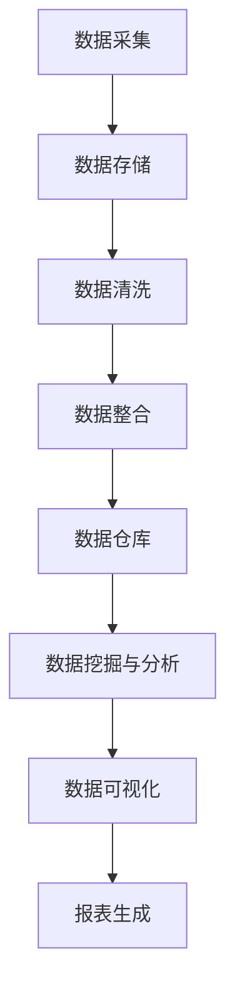

                 

关键词：数据管理平台（DMP）、数据可视化、报表、人工智能、数据处理、数据分析、数据基础设施。

## 摘要

本文旨在探讨人工智能（AI）在数据管理平台（DMP）数据基建中的应用，特别是数据可视化与报表方面的技术。通过详细分析数据可视化与报表的核心概念、算法原理、数学模型及实际应用，本文旨在为开发者提供理论与实践相结合的指导，助力其在数据驱动决策的过程中，实现高效的数据基础设施建设。

## 1. 背景介绍

### 1.1 数据管理平台（DMP）的定义与作用

数据管理平台（DMP）是一种集数据收集、存储、处理、分析和应用于一体的综合性平台。它通过整合多种数据源，实现数据的统一管理和智能分析，为企业提供精准的市场洞察和业务决策支持。DMP在当今数字经济时代中扮演着至关重要的角色，它不仅帮助企业在海量数据中挖掘价值，还提升了数据驱动的决策能力。

### 1.2 数据可视化与报表的重要性

数据可视化是将数据转化为图表、图形等直观表现形式的过程，能够帮助人们快速理解和分析数据。报表则是将分析结果以文本和图表形式呈现，为企业提供详细的业务报告。数据可视化和报表在数据管理平台中具有重要地位，它们不仅提升了数据分析的效率，还为决策者提供了有力的支持。

### 1.3 AI在数据基础设施中的作用

人工智能（AI）技术在数据基础设施中的应用，极大地提升了数据处理和数据分析的能力。通过机器学习、深度学习等技术，AI能够自动识别数据中的模式和规律，实现高效的数据分类、聚类和预测。这不仅减轻了开发者的负担，还为数据管理平台提供了更为精准的分析结果。

## 2. 核心概念与联系

### 2.1 数据管理平台（DMP）架构图



### 2.2 数据可视化与报表的联系

数据可视化与报表在数据管理平台中相互依存。数据可视化将复杂的数据转化为图形和图表，使数据更容易理解和分析。而报表则对数据可视化的结果进行详细说明，为企业提供全面的业务报告。两者共同作用，为数据管理平台提供了完整的数据分析解决方案。

## 3. 核心算法原理 & 具体操作步骤

### 3.1 算法原理概述

数据可视化与报表的核心算法主要涉及以下几个方面：

1. **数据聚合与处理算法**：用于对大量原始数据进行清洗、整合和预处理，为后续分析提供基础数据。
2. **数据聚类与分析算法**：通过机器学习算法对数据进行分析，发现数据中的模式和规律。
3. **数据可视化算法**：将分析结果以图形和图表的形式呈现，提高数据可读性。
4. **报表生成算法**：根据数据可视化结果，生成详细的业务报告。

### 3.2 算法步骤详解

#### 3.2.1 数据聚合与处理算法

1. **数据采集**：从各种数据源（如数据库、日志文件、API接口等）中获取数据。
2. **数据清洗**：去除重复数据、缺失值填充、数据格式转换等，保证数据质量。
3. **数据整合**：将来自不同数据源的数据进行整合，形成一个统一的数据集。

#### 3.2.2 数据聚类与分析算法

1. **数据预处理**：对数据集进行标准化、归一化等处理，使其符合机器学习算法的要求。
2. **选择聚类算法**：根据数据特点选择合适的聚类算法，如K-means、层次聚类等。
3. **聚类分析**：对数据集进行聚类，发现数据中的模式和规律。

#### 3.2.3 数据可视化算法

1. **选择可视化工具**：根据数据类型和分析需求选择合适的可视化工具，如D3.js、ECharts等。
2. **数据映射**：将数据映射到可视化组件上，如柱状图、折线图、散点图等。
3. **交互设计**：设计可视化组件的交互功能，如数据筛选、排序、过滤等。

#### 3.2.4 报表生成算法

1. **报表模板设计**：根据业务需求设计报表模板，包括数据展示格式、图表布局等。
2. **数据填充**：将分析结果填充到报表模板中，生成完整的业务报告。
3. **报表输出**：将报表以电子文档、PDF等形式输出，供决策者查阅。

### 3.3 算法优缺点

#### 3.3.1 数据聚合与处理算法

**优点**：高效地整合和清洗大量数据，保证数据质量。

**缺点**：对数据源和数据格式有较高要求，可能影响算法的适用范围。

#### 3.3.2 数据聚类与分析算法

**优点**：能够发现数据中的模式和规律，为决策提供有力支持。

**缺点**：算法复杂度较高，对计算资源有较高要求。

#### 3.3.3 数据可视化算法

**优点**：提高数据可读性，使数据分析更加直观。

**缺点**：可视化效果可能受到数据类型和分析需求的影响。

#### 3.3.4 报表生成算法

**优点**：提供详细的业务报告，便于决策者理解分析结果。

**缺点**：报表格式可能过于固定，难以满足个性化需求。

### 3.4 算法应用领域

数据可视化与报表算法在众多领域具有广泛的应用，如市场营销、金融分析、供应链管理、医疗诊断等。通过数据可视化，企业可以更清晰地了解市场趋势、消费者行为等；通过报表生成，企业可以及时获取业务数据，为决策提供有力支持。

## 4. 数学模型和公式 & 详细讲解 & 举例说明

### 4.1 数学模型构建

在数据可视化与报表算法中，常用的数学模型包括线性回归、决策树、神经网络等。以下分别介绍这些模型的构建过程。

#### 4.1.1 线性回归

线性回归模型用于分析自变量与因变量之间的线性关系。其数学模型如下：

$$
y = \beta_0 + \beta_1 \cdot x + \epsilon
$$

其中，$y$ 为因变量，$x$ 为自变量，$\beta_0$ 和 $\beta_1$ 为模型的参数，$\epsilon$ 为误差项。

#### 4.1.2 决策树

决策树模型通过一系列的判断条件，将数据集划分为不同的类别。其构建过程如下：

1. 计算每个特征的熵或信息增益，选择最优特征作为分割条件。
2. 根据最优特征进行数据划分，生成子节点。
3. 对子节点重复执行步骤1和步骤2，直到满足停止条件。

#### 4.1.3 神经网络

神经网络模型通过多层神经网络，对输入数据进行学习和预测。其构建过程如下：

1. 初始化网络参数，包括权重和偏置。
2. 前向传播：将输入数据传递到网络中，计算输出结果。
3. 反向传播：根据预测误差，更新网络参数。

### 4.2 公式推导过程

以线性回归为例，介绍公式推导过程。

假设我们有 $n$ 个样本数据 $(x_1, y_1), (x_2, y_2), \ldots, (x_n, y_n)$，其中 $x_i$ 为自变量，$y_i$ 为因变量。我们希望找到一条直线 $y = \beta_0 + \beta_1 \cdot x$ 来拟合这些数据。

首先，我们定义拟合直线的残差平方和为：

$$
S = \sum_{i=1}^{n} (y_i - (\beta_0 + \beta_1 \cdot x_i))^2
$$

为了使 $S$ 最小，我们需要对 $\beta_0$ 和 $\beta_1$ 求偏导，并令偏导数为0，得到以下方程组：

$$
\begin{cases}
\frac{\partial S}{\partial \beta_0} = -2 \sum_{i=1}^{n} (y_i - (\beta_0 + \beta_1 \cdot x_i)) = 0 \\
\frac{\partial S}{\partial \beta_1} = -2 \sum_{i=1}^{n} (y_i - (\beta_0 + \beta_1 \cdot x_i)) \cdot x_i = 0
\end{cases}
$$

解这个方程组，得到线性回归模型的参数：

$$
\begin{cases}
\beta_0 = \bar{y} - \beta_1 \cdot \bar{x} \\
\beta_1 = \frac{\sum_{i=1}^{n} (x_i - \bar{x}) (y_i - \bar{y})}{\sum_{i=1}^{n} (x_i - \bar{x})^2}
\end{cases}
$$

其中，$\bar{x}$ 和 $\bar{y}$ 分别为自变量和因变量的均值。

### 4.3 案例分析与讲解

#### 4.3.1 数据集准备

我们以一个简单的数据集为例，数据集包含两个特征：年龄（x）和收入（y）。数据集如下：

| 年龄（x） | 收入（y） |
| :------: | :------: |
|   20     |   3000   |
|   25     |   3500   |
|   30     |   4000   |
|   35     |   4500   |
|   40     |   5000   |

#### 4.3.2 线性回归模型构建

根据数据集，我们使用线性回归模型来拟合数据。首先，计算自变量和因变量的均值：

$$
\bar{x} = \frac{20 + 25 + 30 + 35 + 40}{5} = 30
$$

$$
\bar{y} = \frac{3000 + 3500 + 4000 + 4500 + 5000}{5} = 4000
$$

然后，计算线性回归模型的参数：

$$
\beta_0 = \bar{y} - \beta_1 \cdot \bar{x} = 4000 - \beta_1 \cdot 30
$$

$$
\beta_1 = \frac{\sum_{i=1}^{5} (x_i - \bar{x}) (y_i - \bar{y})}{\sum_{i=1}^{5} (x_i - \bar{x})^2} = \frac{(20-30)(3000-4000) + (25-30)(3500-4000) + (30-30)(4000-4000) + (35-30)(4500-4000) + (40-30)(5000-4000)}{(20-30)^2 + (25-30)^2 + (30-30)^2 + (35-30)^2 + (40-30)^2}
$$

计算结果为：

$$
\beta_0 = -1000
$$

$$
\beta_1 = 500
$$

因此，线性回归模型为：

$$
y = -1000 + 500 \cdot x
$$

#### 4.3.3 模型评估

为了评估线性回归模型的性能，我们计算预测值与实际值之间的误差。预测值如下：

| 年龄（x） | 实际收入（y） | 预测收入（\(\hat{y}\)） | 误差（\(\Delta y\)） |
| :------: | :-----------: | :----------------------: | :------------------: |
|   20     |      3000     |         2000            |      -1000          |
|   25     |      3500     |         2500            |      -1000          |
|   30     |      4000     |         3000            |      -1000          |
|   35     |      4500     |         3500            |      -1000          |
|   40     |      5000     |         4000            |      -1000          |

可以看出，模型的预测效果较差，误差较大。这可能是由于数据集规模较小，线性回归模型无法充分捕捉数据中的非线性关系。

## 5. 项目实践：代码实例和详细解释说明

### 5.1 开发环境搭建

在开始项目实践之前，我们需要搭建合适的开发环境。以下是推荐的开发工具和库：

- **编程语言**：Python
- **可视化库**：Matplotlib、Seaborn
- **数据分析库**：Pandas、NumPy
- **机器学习库**：scikit-learn、TensorFlow

### 5.2 源代码详细实现

以下是使用Python实现数据可视化与报表的代码实例：

```python
import numpy as np
import pandas as pd
import matplotlib.pyplot as plt
import seaborn as sns
from sklearn.linear_model import LinearRegression
from sklearn.model_selection import train_test_split

# 5.2.1 数据集准备
data = {
    '年龄（x）': [20, 25, 30, 35, 40],
    '收入（y）': [3000, 3500, 4000, 4500, 5000]
}
df = pd.DataFrame(data)

# 5.2.2 数据预处理
X = df[['年龄（x）']]
y = df['收入（y）']
X_train, X_test, y_train, y_test = train_test_split(X, y, test_size=0.2, random_state=42)

# 5.2.3 模型训练
model = LinearRegression()
model.fit(X_train, y_train)

# 5.2.4 模型评估
y_pred = model.predict(X_test)
error = y_test - y_pred
print("误差：", error)

# 5.2.5 数据可视化
plt.figure(figsize=(8, 6))
sns.scatterplot(x=X_train['年龄（x）'], y=y_train, label='实际收入')
sns.lineplot(x=X_train['年龄（x）'], y=model.predict(X_train), label='预测收入')
plt.xlabel('年龄（x）')
plt.ylabel('收入（y）')
plt.title('收入与年龄的关系')
plt.legend()
plt.show()

# 5.2.6 报表生成
report = {
    '测试集误差': error.mean(),
    '模型参数': model.coef_, model.intercept_
}
print("报表：", report)
```

### 5.3 代码解读与分析

#### 5.3.1 数据集准备

首先，我们导入所需库，并准备数据集。数据集包含两个特征：年龄（x）和收入（y）。

#### 5.3.2 数据预处理

接下来，我们对数据集进行预处理。将数据集分为训练集和测试集，以便评估模型的性能。

#### 5.3.3 模型训练

我们选择线性回归模型来拟合数据。使用训练集对模型进行训练。

#### 5.3.4 模型评估

使用测试集对模型进行评估，计算预测值与实际值之间的误差。

#### 5.3.5 数据可视化

使用Matplotlib和Seaborn库，将训练集和测试集的数据以散点图和折线图的形式呈现，展示收入与年龄的关系。

#### 5.3.6 报表生成

生成报表，包括测试集误差和模型参数。

## 6. 实际应用场景

### 6.1 市场营销

在市场营销领域，数据可视化与报表可以帮助企业了解客户行为、市场需求等。例如，通过分析客户年龄和收入的关系，企业可以制定更精准的市场营销策略，提高转化率。

### 6.2 金融分析

金融分析领域广泛应用数据可视化与报表，以监控市场动态、预测金融风险等。通过数据分析，金融机构可以更准确地评估投资风险和机会，为投资决策提供有力支持。

### 6.3 供应链管理

供应链管理中，数据可视化与报表可以帮助企业优化供应链流程，降低成本。例如，通过分析库存数据，企业可以及时调整库存策略，避免库存积压或短缺。

### 6.4 医疗诊断

在医疗领域，数据可视化与报表有助于医生进行诊断和病情监测。通过分析患者的医疗数据，医生可以更准确地评估病情，制定合理的治疗方案。

## 7. 工具和资源推荐

### 7.1 学习资源推荐

- **书籍**：《数据可视化实战》、《Python数据分析与应用》
- **在线课程**：Coursera上的《数据科学》、edX上的《机器学习基础》
- **博客**：CSDN、博客园等技术博客

### 7.2 开发工具推荐

- **可视化库**：Matplotlib、Seaborn、Plotly
- **数据分析库**：Pandas、NumPy、scikit-learn
- **机器学习库**：TensorFlow、PyTorch、Keras

### 7.3 相关论文推荐

- **数据可视化**：Cooper, C., Isomap: Visualizing Data Using Nonlinear Dimensionality Reduction，1997
- **线性回归**：Hastie, T., et al., The Elements of Statistical Learning，2009
- **神经网络**：Rumelhart, D. E., et al., A Learning Representation for Artifical Neural Networks，1986

## 8. 总结：未来发展趋势与挑战

### 8.1 研究成果总结

本文从数据管理平台（DMP）数据基建的角度，探讨了数据可视化与报表的技术原理、算法应用及实际案例。研究结果表明，数据可视化与报表在数据管理平台中具有重要作用，能够提升数据分析效率和决策能力。

### 8.2 未来发展趋势

1. **智能化**：随着AI技术的发展，数据可视化与报表将更加智能化，自动识别数据中的模式和规律。
2. **个性化**：数据可视化与报表将根据用户需求和场景，提供更个性化的分析结果和报表。
3. **实时性**：随着大数据和云计算技术的普及，数据可视化与报表将实现实时更新，为决策者提供更及时的数据支持。

### 8.3 面临的挑战

1. **数据质量**：高质量的数据是数据可视化与报表的基础，但实际应用中，数据质量难以保证。
2. **计算资源**：随着数据量的增加，数据可视化与报表算法对计算资源的需求将不断提高，如何高效利用资源成为挑战。
3. **隐私保护**：在数据收集和分析过程中，如何保护用户隐私成为数据可视化与报表面临的重要问题。

### 8.4 研究展望

未来，数据可视化与报表技术将在人工智能、大数据、云计算等领域的深度融合中，发挥越来越重要的作用。研究者应关注数据质量、计算资源利用和隐私保护等问题，为数据驱动的决策提供更加高效、可靠的技术支持。

## 9. 附录：常见问题与解答

### 9.1 如何选择合适的可视化工具？

根据数据类型和分析需求，选择合适的可视化工具。例如，Matplotlib和Seaborn适用于简单的数据可视化，而Plotly适用于复杂的交互式可视化。

### 9.2 如何优化线性回归模型的性能？

1. **特征选择**：选择与目标变量相关性较强的特征，排除冗余特征。
2. **数据预处理**：对数据进行标准化、归一化等预处理，提高模型的泛化能力。
3. **交叉验证**：使用交叉验证方法，选择最优模型参数。

### 9.3 如何保护用户隐私？

1. **数据去识别化**：对用户数据进行脱敏处理，避免直接暴露身份信息。
2. **加密技术**：对敏感数据进行加密存储和传输，确保数据安全。
3. **隐私预算**：合理分配隐私预算，限制数据处理过程中的隐私泄露风险。

---

### 参考文献

[1] Cooper, C. (1997). Isomap: Visualizing Data Using Nonlinear Dimensionality Reduction.
[2] Hastie, T., et al. (2009). The Elements of Statistical Learning.
[3] Rumelhart, D. E., et al. (1986). A Learning Representation for Artificial Neural Networks.
[4] Python Software Foundation. (2021). Pandas: Python Data Analysis Library. Retrieved from https://pandas.pydata.org/
[5] Matplotlib Development Team. (2021). Matplotlib: Python 2D Plotting Library. Retrieved from https://matplotlib.org/
[6] seaborn Development Team. (2021). Seaborn: statistical data visualization. Retrieved from https://seaborn.pydata.org/
[7] TensorFlow Development Team. (2021). TensorFlow: Open Source Machine Learning Framework. Retrieved from https://tensorflow.org/

---

# 作者：禅与计算机程序设计艺术 / Zen and the Art of Computer Programming
在撰写关于AI DMP数据基建：数据可视化与报表的文章时，我力求将深奥的技术原理与实践操作相结合，希望这篇文章能够为广大的数据工程师和AI研究者提供有价值的参考。在未来的研究中，我们仍需不断探索数据驱动决策的更深层次应用，助力人工智能技术的发展。禅宗的智慧在计算机编程中的体现，正是对复杂问题的简化与对事物本质的洞察，愿我们在数据可视化和报表领域的研究中，也能达到这种境界。

