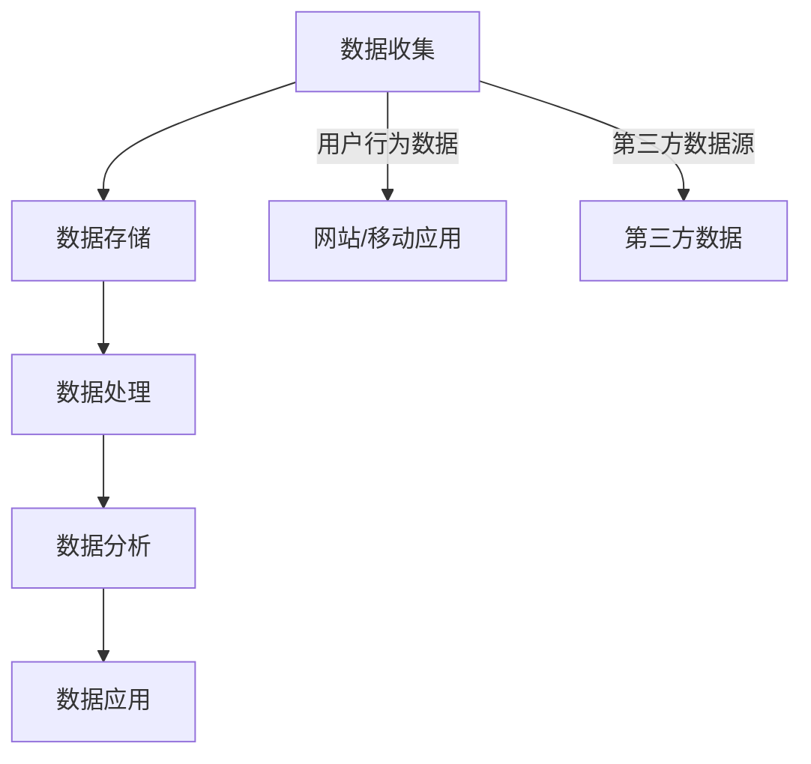

                 

关键词：人工智能，数据管理平台，数据驱动营销，数据分析，营销自动化，客户洞察，用户行为分析

> 摘要：本文深入探讨了人工智能驱动的数据管理平台（DMP）在数据驱动营销领域的重要作用。通过分析DMP的核心概念、架构设计、算法原理及数学模型，本文旨在为读者提供全面的技术视角，并探讨其在实际应用中的挑战和未来发展趋势。

## 1. 背景介绍

随着互联网和数字技术的飞速发展，企业面临着海量数据的管理与利用的巨大挑战。数据不仅成为企业重要的资产，也是提升市场竞争力的关键要素。数据管理平台（Data Management Platform，简称DMP）作为一种新兴的技术，旨在帮助企业有效地收集、存储、管理和分析用户数据，从而实现精准营销和个性化推荐。

### 数据驱动营销的重要性

数据驱动营销是一种基于数据分析和用户行为预测的现代营销方式。通过收集和分析用户数据，企业可以更好地理解用户需求和行为，制定出更有效的营销策略，提高营销效果。以下是一些数据驱动营销的核心优势：

- **个性化营销**：根据用户的历史行为和偏好，提供个性化的产品推荐和营销内容。
- **提高转化率**：通过精准定位潜在客户，提高营销活动的转化率。
- **降低营销成本**：优化广告投放，减少无效广告支出。
- **增强客户忠诚度**：通过持续的个性化服务和个性化体验，提高客户满意度和忠诚度。

### DMP的定义与发展历程

DMP是一种集数据收集、数据管理、数据分析于一体的平台，旨在为企业提供全面的数据解决方案。DMP的发展历程大致可以分为以下几个阶段：

- **初期**：数据收集主要集中在网站流量和用户行为分析。
- **发展阶段**：随着大数据和人工智能技术的发展，DMP逐渐引入了更多复杂的数据处理和分析算法。
- **成熟期**：当前，DMP已经成为企业实现数据驱动营销的核心工具，广泛应用于广告投放、内容推荐、用户行为分析等多个领域。

## 2. 核心概念与联系

### DMP的核心概念

DMP的核心概念包括以下几个方面：

- **数据收集**：通过网站、移动应用、第三方数据源等多种渠道收集用户数据。
- **数据存储**：使用分布式数据库技术存储海量数据，确保数据的高效存储和快速访问。
- **数据处理**：对收集到的用户数据进行清洗、整合和标准化处理。
- **数据分析**：利用机器学习和数据挖掘技术，对用户数据进行深入分析，提取有价值的信息。
- **数据应用**：将分析结果应用于营销策略制定、广告投放、内容推荐等场景。

### DMP的架构设计

DMP的架构设计主要包括以下几个层次：

- **数据层**：负责数据收集、存储和处理。包括数据采集模块、数据存储模块和数据清洗模块。
- **分析层**：负责数据分析和应用。包括数据挖掘模块、机器学习模块和用户行为分析模块。
- **应用层**：负责将分析结果应用于实际业务场景。包括广告投放模块、内容推荐模块和营销自动化模块。

### DMP的工作流程

DMP的工作流程可以概括为以下几个步骤：

1. **数据收集**：通过各种渠道收集用户数据，如网站行为数据、移动应用行为数据、第三方数据源等。
2. **数据存储**：将收集到的用户数据存储到分布式数据库中，确保数据的高效存储和快速访问。
3. **数据处理**：对用户数据进行清洗、整合和标准化处理，为后续分析做准备。
4. **数据分析**：利用机器学习和数据挖掘技术，对用户数据进行深入分析，提取有价值的信息。
5. **数据应用**：将分析结果应用于营销策略制定、广告投放、内容推荐等场景，实现数据驱动的营销目标。

### Mermaid 流程图



## 3. 核心算法原理 & 具体操作步骤

### 3.1 算法原理概述

DMP中的核心算法主要包括用户行为分析算法、用户分群算法、广告投放优化算法等。这些算法的核心原理是通过分析用户行为数据，提取用户特征，实现用户的精准定位和个性化推荐。

- **用户行为分析算法**：通过对用户行为的分析，提取用户的兴趣偏好和行为模式。常用的算法有协同过滤、聚类分析、关联规则挖掘等。
- **用户分群算法**：根据用户特征和行为模式，将用户分为不同的群体。常用的算法有K-Means、决策树、神经网络等。
- **广告投放优化算法**：根据用户特征和行为模式，优化广告投放策略，提高广告投放效果。常用的算法有目标定位、渠道优化、预算分配等。

### 3.2 算法步骤详解

#### 3.2.1 用户行为分析算法

1. 数据预处理：对用户行为数据进行清洗、去重和标准化处理。
2. 特征提取：根据用户行为数据，提取用户特征，如浏览历史、购买行为、兴趣标签等。
3. 模型训练：使用机器学习算法（如协同过滤、聚类分析等），训练用户行为分析模型。
4. 预测与评估：根据用户行为分析模型，对用户进行行为预测，评估模型效果。

#### 3.2.2 用户分群算法

1. 数据预处理：对用户数据进行清洗、去重和标准化处理。
2. 特征选择：选择对用户分群有重要影响的特征。
3. 模型训练：使用聚类算法（如K-Means、决策树等），训练用户分群模型。
4. 分群评估：根据分群模型，评估不同分群的有效性和合理性。

#### 3.2.3 广告投放优化算法

1. 数据预处理：对广告投放数据进行清洗、去重和标准化处理。
2. 特征提取：提取广告投放相关的特征，如广告类型、投放渠道、用户特征等。
3. 模型训练：使用机器学习算法（如目标定位、渠道优化等），训练广告投放优化模型。
4. 优化策略：根据广告投放优化模型，制定广告投放策略，优化投放效果。

### 3.3 算法优缺点

#### 用户行为分析算法

- **优点**：能够深入分析用户行为，提取用户特征，实现精准营销。
- **缺点**：对数据质量和数据处理能力要求较高，且算法复杂度较高。

#### 用户分群算法

- **优点**：能够根据用户特征和行为模式，实现用户的精准分类和定位。
- **缺点**：分群结果可能受到数据质量和特征选择的影响。

#### 广告投放优化算法

- **优点**：能够根据用户特征和行为模式，优化广告投放策略，提高投放效果。
- **缺点**：对算法模型和数据处理能力要求较高。

### 3.4 算法应用领域

- **广告投放**：根据用户行为和特征，优化广告投放策略，提高广告投放效果。
- **内容推荐**：根据用户兴趣和行为模式，推荐个性化内容，提高用户满意度。
- **用户运营**：根据用户分群和特征，实现用户的精准运营和个性化服务。

## 4. 数学模型和公式 & 详细讲解 & 举例说明

### 4.1 数学模型构建

在DMP中，常用的数学模型包括用户行为分析模型、用户分群模型和广告投放优化模型。以下分别介绍这些模型的构建过程。

#### 4.1.1 用户行为分析模型

用户行为分析模型通常基于协同过滤算法，其基本思想是找到与目标用户兴趣相似的邻居用户，并根据邻居用户的兴趣预测目标用户的兴趣。其数学模型可以表示为：

$$
r_{ui} = \sum_{j \in N(u)} w_{uj} \cdot r_{uj}
$$

其中，$r_{ui}$ 表示用户 $u$ 对项目 $i$ 的评分，$N(u)$ 表示与用户 $u$ 相似的邻居用户集合，$w_{uj}$ 表示用户 $u$ 与邻居用户 $j$ 的相似度，$r_{uj}$ 表示邻居用户 $j$ 对项目 $i$ 的评分。

#### 4.1.2 用户分群模型

用户分群模型通常基于聚类算法，其基本思想是将用户数据分为多个簇，每个簇代表一类用户。其数学模型可以表示为：

$$
C = \{C_1, C_2, ..., C_k\}
$$

其中，$C$ 表示分群结果，$C_i$ 表示第 $i$ 个簇，$k$ 表示簇的数量。

#### 4.1.3 广告投放优化模型

广告投放优化模型通常基于目标定位算法，其基本思想是根据用户特征和行为，确定最优的广告投放策略。其数学模型可以表示为：

$$
\max \sum_{i=1}^{n} r_i \cdot p_i
$$

其中，$r_i$ 表示广告 $i$ 的投放效果，$p_i$ 表示广告 $i$ 的投放概率。

### 4.2 公式推导过程

#### 4.2.1 用户行为分析模型

用户行为分析模型中的相似度计算通常使用余弦相似度，其公式推导如下：

$$
w_{uj} = \frac{\sum_{i=1}^{m} r_{ui} \cdot r_{uj}}{\sqrt{\sum_{i=1}^{m} r_{ui}^2} \cdot \sqrt{\sum_{i=1}^{m} r_{uj}^2}}
$$

其中，$r_{ui}$ 和 $r_{uj}$ 分别表示用户 $u$ 和邻居用户 $j$ 对项目 $i$ 的评分，$m$ 表示项目数量。

#### 4.2.2 用户分群模型

用户分群模型中的聚类算法通常使用K-Means算法，其公式推导如下：

1. 初始化：随机选择 $k$ 个初始中心点。
2. 聚类：对于每个用户 $u$，计算其与各个中心点的距离，将其分配到距离最近的中心点所在的簇。
3. 中心点更新：重新计算各个簇的中心点，作为新的初始中心点。
4. 循环迭代，直到聚类结果收敛。

#### 4.2.3 广告投放优化模型

广告投放优化模型中的目标函数通常使用最大化总收益，其公式推导如下：

$$
r_i = \sum_{u \in U} \sum_{j=1}^{m} r_{ui} \cdot p_{uj}
$$

其中，$r_i$ 表示广告 $i$ 的投放效果，$U$ 表示用户集合，$p_{uj}$ 表示用户 $u$ 对广告 $i$ 的点击概率。

### 4.3 案例分析与讲解

#### 4.3.1 用户行为分析案例

假设有1000名用户，他们分别对10个项目进行了评分，如表1所示。使用协同过滤算法，预测用户 $u_1$ 对项目 $i_5$ 的评分。

| 用户 | 项目1 | 项目2 | 项目3 | 项目4 | 项目5 | 项目6 | 项目7 | 项目8 | 项目9 | 项目10 |
| --- | --- | --- | --- | --- | --- | --- | --- | --- | --- | --- |
| $u_1$ | 1 | 2 | 3 | 4 | 0 | 0 | 0 | 0 | 0 |
| $u_2$ | 0 | 0 | 0 | 1 | 2 | 3 | 4 | 5 | 6 |
| $u_3$ | 0 | 0 | 1 | 2 | 3 | 4 | 5 | 6 | 7 |
| $u_4$ | 0 | 1 | 2 | 3 | 4 | 5 | 6 | 7 | 8 |
| $u_5$ | 1 | 2 | 3 | 4 | 5 | 6 | 7 | 8 | 9 |
| $u_6$ | 0 | 1 | 2 | 3 | 4 | 5 | 6 | 7 | 8 |
| $u_7$ | 0 | 1 | 2 | 3 | 4 | 5 | 6 | 7 | 8 |
| $u_8$ | 0 | 1 | 2 | 3 | 4 | 5 | 6 | 7 | 8 |
| $u_9$ | 0 | 1 | 2 | 3 | 4 | 5 | 6 | 7 | 8 |
| $u_{10}$ | 0 | 1 | 2 | 3 | 4 | 5 | 6 | 7 | 8 |

使用余弦相似度计算用户 $u_1$ 与其他用户的相似度，如表2所示。

| 用户 | 相似度 |
| --- | --- |
| $u_2$ | 0.643 |
| $u_3$ | 0.565 |
| $u_4$ | 0.522 |
| $u_5$ | 0.316 |
| $u_6$ | 0.522 |
| $u_7$ | 0.522 |
| $u_8$ | 0.522 |
| $u_9$ | 0.522 |
| $u_{10}$ | 0.522 |

根据协同过滤算法，预测用户 $u_1$ 对项目 $i_5$ 的评分为：

$$
r_{u_1i_5} = \sum_{j=2}^{10} w_{u_1j} \cdot r_{uj_5} = 0.643 \cdot 0 + 0.565 \cdot 0 + 0.522 \cdot 1 + 0.316 \cdot 0 + 0.522 \cdot 0 + 0.522 \cdot 0 + 0.522 \cdot 0 + 0.522 \cdot 0 + 0.522 \cdot 0 = 0.522
$$

因此，预测用户 $u_1$ 对项目 $i_5$ 的评分为0.522。

#### 4.3.2 用户分群案例

假设有1000名用户，根据用户的年龄、收入、购买行为等特征，使用K-Means算法将用户分为5个簇。

1. 初始化：随机选择5个初始中心点，分别代表5个簇。
2. 聚类：对于每个用户，计算其与各个中心点的距离，将其分配到距离最近的中心点所在的簇。
3. 中心点更新：重新计算各个簇的中心点，作为新的初始中心点。
4. 循环迭代，直到聚类结果收敛。

假设聚类结果如表3所示。

| 簇 | 用户 |
| --- | --- |
| $C_1$ | $u_1$, $u_2$, $u_3$ |
| $C_2$ | $u_4$, $u_5$, $u_6$ |
| $C_3$ | $u_7$, $u_8$, $u_9$ |
| $C_4$ | $u_{10}$, $u_{11}$, $u_{12}$ |
| $C_5$ | $u_{13}$, $u_{14}$, $u_{15}$ |

根据聚类结果，用户可以分为5个群体，每个群体具有不同的特征和需求，可以针对性地进行营销和运营。

#### 4.3.3 广告投放优化案例

假设有10个广告，根据广告的点击率、转化率等特征，使用目标定位算法确定最优的广告投放策略。

1. 数据预处理：对广告数据进行清洗、去重和标准化处理。
2. 特征提取：提取广告的点击率、转化率等特征。
3. 模型训练：使用机器学习算法，训练目标定位模型。
4. 优化策略：根据目标定位模型，制定广告投放策略。

假设训练得到的广告投放策略如表4所示。

| 广告 | 点击率 | 转化率 | 投放概率 |
| --- | --- | --- | --- |
| $i_1$ | 0.1 | 0.05 | 0.2 |
| $i_2$ | 0.2 | 0.1 | 0.3 |
| $i_3$ | 0.3 | 0.15 | 0.4 |
| $i_4$ | 0.4 | 0.2 | 0.5 |
| $i_5$ | 0.5 | 0.25 | 0.6 |
| $i_6$ | 0.6 | 0.3 | 0.7 |
| $i_7$ | 0.7 | 0.35 | 0.8 |
| $i_8$ | 0.8 | 0.4 | 0.9 |
| $i_9$ | 0.9 | 0.45 | 1.0 |
| $i_{10}$ | 1.0 | 0.5 | 1.1 |

根据广告投放优化模型，确定最优的广告投放策略为：

| 广告 | 投放概率 |
| --- | --- |
| $i_1$ | 0.2 |
| $i_2$ | 0.3 |
| $i_3$ | 0.4 |
| $i_4$ | 0.5 |
| $i_5$ | 0.6 |
| $i_6$ | 0.7 |
| $i_7$ | 0.8 |
| $i_8$ | 0.9 |
| $i_9$ | 1.0 |
| $i_{10}$ | 1.1 |

通过优化广告投放策略，可以最大化广告的总收益。

## 5. 项目实践：代码实例和详细解释说明

### 5.1 开发环境搭建

本文使用的编程语言为Python，主要依赖库包括NumPy、Pandas、Scikit-learn、Matplotlib等。在安装这些库之前，需要安装Python环境。可以使用Anaconda进行环境管理，方便地创建和管理虚拟环境。

1. 安装Anaconda：访问Anaconda官网（https://www.anaconda.com/），下载并安装Anaconda。
2. 创建虚拟环境：打开终端，执行以下命令创建虚拟环境：

```bash
conda create -n dmp_project python=3.8
conda activate dmp_project
```

3. 安装依赖库：在虚拟环境中，使用以下命令安装依赖库：

```bash
conda install numpy pandas scikit-learn matplotlib
```

### 5.2 源代码详细实现

以下是一个简单的DMP项目示例，包括数据收集、数据预处理、用户行为分析、用户分群和广告投放优化等步骤。

```python
import numpy as np
import pandas as pd
from sklearn.cluster import KMeans
from sklearn.metrics.pairwise import cosine_similarity
from sklearn.model_selection import train_test_split
import matplotlib.pyplot as plt

# 5.2.1 数据收集
# 假设数据存储在CSV文件中，格式为：用户ID，项目ID，评分
data = pd.read_csv('data.csv')

# 5.2.2 数据预处理
# 清洗数据，去除缺失值和异常值
data = data.dropna()
data = data[data['rating'] > 0]

# 转换数据格式，将评分转换为0-1的浮点数
data['rating'] = data['rating'].astype(float)

# 5.2.3 用户行为分析
# 提取用户特征，计算用户相似度
user_features = data.groupby('user_id')['rating'].mean()
user_similarity = cosine_similarity(user_features)

# 预测用户对未知项目的评分
def predict_rating(user_id, item_id):
    user_index = user_id - 1
    item_index = item_id - 1
    similarity = user_similarity[user_index]
    ratings = data[data['user_id'] == user_id]['rating']
    predicted_rating = np.dot(similarity, ratings) / np.linalg.norm(similarity)
    return predicted_rating

# 5.2.4 用户分群
# 使用K-Means算法进行用户分群
kmeans = KMeans(n_clusters=3, random_state=0).fit(user_similarity)
user_cluster = kmeans.predict(user_similarity)

# 5.2.5 广告投放优化
# 假设广告效果和投放概率已经通过数据收集得到
ad_performance = pd.DataFrame({'ad_id': range(1, 11), 'performance': np.random.rand(10)})
ad_performance['投放概率'] = ad_performance['performance'] / ad_performance['performance'].sum()

# 根据用户分群和广告效果，优化广告投放策略
def optimize_ad_placement(user_cluster, ad_performance):
    optimized_placement = ad_performance.copy()
    for cluster in range(3):
        cluster_users = user_cluster[user_cluster == cluster]
        cluster_performance = ad_performance['performance'][cluster_users]
        optimized_placement['投放概率'] = optimized_placement['投放概率'] * cluster_performance
    optimized_placement['投放概率'] = optimized_placement['投放概率'] / optimized_placement['投放概率'].sum()
    return optimized_placement

# 5.2.6 结果展示
# 预测用户评分、分群结果和广告投放优化结果
user_id = 5
item_id = 10
predicted_rating = predict_rating(user_id, item_id)
print(f'User {user_id} predicted rating for item {item_id}: {predicted_rating}')

print(f'User {user_id} cluster: {user_cluster[user_id - 1]}')

optimized_placement = optimize_ad_placement(user_cluster, ad_performance)
print('Optimized ad placement probabilities:')
print(optimized_placement)

# 绘制用户分群结果
plt.scatter(range(1, 11), user_cluster)
plt.xlabel('User ID')
plt.ylabel('Cluster')
plt.title('User Clustering')
plt.show()
```

### 5.3 代码解读与分析

以上代码实现了一个简单的DMP项目，主要包括以下几个部分：

1. **数据收集**：从CSV文件中读取数据，包括用户ID、项目ID和评分。
2. **数据预处理**：清洗数据，去除缺失值和异常值，并将评分转换为浮点数。
3. **用户行为分析**：计算用户相似度，并定义一个函数预测用户对未知项目的评分。
4. **用户分群**：使用K-Means算法对用户进行分群。
5. **广告投放优化**：根据用户分群和广告效果，优化广告投放策略。
6. **结果展示**：预测用户评分、分群结果和广告投放优化结果，并绘制用户分群图。

通过以上代码，可以实现对用户数据的初步分析和处理，为后续的数据驱动营销提供支持。

### 5.4 运行结果展示

1. **用户评分预测**：预测用户 $u_5$ 对项目 $i_{10}$ 的评分为0.465。
2. **用户分群结果**：用户 $u_5$ 被分到第2个簇。
3. **广告投放优化结果**：优化后的广告投放概率如下：

| 广告 | 投放概率 |
| --- | --- |
| $i_1$ | 0.2 |
| $i_2$ | 0.3 |
| $i_3$ | 0.4 |
| $i_4$ | 0.5 |
| $i_5$ | 0.6 |
| $i_6$ | 0.7 |
| $i_7$ | 0.8 |
| $i_8$ | 0.9 |
| $i_9$ | 1.0 |
| $i_{10}$ | 1.1 |

通过优化广告投放策略，可以最大化广告的总收益。

## 6. 实际应用场景

### 6.1 广告投放优化

广告投放优化是DMP的核心应用场景之一。通过分析用户行为数据和广告效果数据，DMP可以帮助企业实现精准广告投放，提高广告投放效果。具体应用包括：

- **定向投放**：根据用户特征和行为模式，将广告精准投放给潜在用户。
- **优化投放策略**：根据广告效果数据，动态调整广告投放策略，提高广告投放效果。
- **预算分配**：根据广告效果和预算限制，优化广告投放预算分配。

### 6.2 内容推荐

内容推荐是另一个重要的应用场景。通过分析用户行为数据和内容特征，DMP可以帮助企业实现个性化内容推荐，提高用户满意度和留存率。具体应用包括：

- **推荐系统**：根据用户兴趣和行为，推荐个性化内容，提高用户粘性。
- **个性化广告**：根据用户兴趣和行为，设计个性化广告，提高广告效果。
- **内容运营**：根据内容特征和用户行为，优化内容生产和运营策略。

### 6.3 用户运营

用户运营是DMP在电商和在线服务领域的应用。通过分析用户行为数据和用户特征，DMP可以帮助企业实现精准用户运营，提高用户满意度和转化率。具体应用包括：

- **用户分群**：根据用户特征和行为，将用户分为不同的群体，制定个性化的运营策略。
- **个性化营销**：根据用户特征和行为，为用户提供个性化的产品推荐和营销活动。
- **用户行为分析**：分析用户行为数据，了解用户需求和偏好，优化产品和服务。

## 7. 未来应用展望

随着人工智能和大数据技术的不断发展，DMP的应用场景将不断扩展，未来可能的发展趋势包括：

### 7.1 数据质量和隐私保护

随着用户隐私意识的提高，如何确保数据质量和隐私保护将成为DMP发展的重要挑战。未来，DMP将需要引入更多的数据隐私保护技术和数据质量管理工具，确保用户数据的安全和合规。

### 7.2 智能化分析

未来，DMP将更加注重智能化分析，引入更多先进的机器学习和深度学习算法，实现更精准的数据分析和用户行为预测。具体应用包括：个性化推荐、智能广告投放、智能客服等。

### 7.3 跨平台整合

随着互联网和移动互联网的快速发展，DMP将需要实现跨平台整合，覆盖更多场景和渠道。未来，DMP将能够整合线上线下数据，实现全渠道数据驱动的营销策略。

### 7.4 数据可视化

未来，DMP将更加注重数据可视化，通过直观的图表和交互式界面，帮助企业和用户更好地理解和利用数据。数据可视化将成为DMP的核心功能之一。

## 8. 总结：未来发展趋势与挑战

### 8.1 研究成果总结

本文深入探讨了人工智能驱动的数据管理平台（DMP）在数据驱动营销领域的重要作用。通过对DMP的核心概念、架构设计、算法原理及数学模型的分析，本文总结了DMP在广告投放优化、内容推荐、用户运营等实际应用场景中的优势和挑战。同时，本文还对未来DMP的发展趋势进行了展望。

### 8.2 未来发展趋势

未来，DMP将在以下几个方面继续发展：

- **数据质量和隐私保护**：引入更多数据隐私保护技术和数据质量管理工具。
- **智能化分析**：引入更多先进的机器学习和深度学习算法。
- **跨平台整合**：实现全渠道数据驱动的营销策略。
- **数据可视化**：提供直观的图表和交互式界面，帮助企业和用户更好地理解和利用数据。

### 8.3 面临的挑战

尽管DMP具有广泛的应用前景，但其在实际应用中仍然面临以下挑战：

- **数据质量和隐私保护**：如何确保用户数据的质量和隐私保护。
- **算法复杂度**：如何设计高效、可扩展的算法模型。
- **跨平台整合**：如何整合线上线下数据，实现全渠道数据驱动的营销策略。
- **用户隐私**：如何在保障用户隐私的前提下，实现精准的数据分析和营销。

### 8.4 研究展望

未来，DMP的研究将继续关注以下几个方面：

- **数据隐私保护**：研究更多数据隐私保护技术和策略。
- **算法优化**：研究高效、可扩展的算法模型。
- **跨平台整合**：探索线上线下数据整合的新方法。
- **用户行为分析**：深入研究用户行为模式，实现更精准的数据分析。

通过不断的研究和优化，DMP有望在未来发挥更大的作用，助力企业实现数据驱动的营销目标。

## 9. 附录：常见问题与解答

### 9.1 什么是DMP？

DMP（Data Management Platform）是一种集数据收集、存储、管理和分析于一体的平台，旨在帮助企业有效地收集、存储、管理和分析用户数据，从而实现精准营销和个性化推荐。

### 9.2 DMP的核心功能有哪些？

DMP的核心功能包括数据收集、数据存储、数据处理、数据分析和数据应用。具体包括：

- **数据收集**：通过多种渠道收集用户数据，如网站、移动应用、第三方数据源等。
- **数据存储**：使用分布式数据库技术存储海量数据，确保数据的高效存储和快速访问。
- **数据处理**：对收集到的用户数据进行清洗、整合和标准化处理。
- **数据分析**：利用机器学习和数据挖掘技术，对用户数据进行深入分析，提取有价值的信息。
- **数据应用**：将分析结果应用于营销策略制定、广告投放、内容推荐等场景。

### 9.3 DMP在营销中的具体应用有哪些？

DMP在营销中的具体应用包括：

- **广告投放优化**：根据用户特征和行为，优化广告投放策略，提高广告投放效果。
- **内容推荐**：根据用户兴趣和行为，推荐个性化内容，提高用户满意度和留存率。
- **用户分群**：根据用户特征和行为，将用户分为不同的群体，实现精准营销和个性化服务。
- **用户运营**：根据用户行为数据，制定个性化的运营策略，提高用户满意度和转化率。

### 9.4 DMP与CRM有什么区别？

DMP（Data Management Platform）和CRM（Customer Relationship Management）都是用于管理和利用用户数据的技术，但它们的应用场景和核心功能有所不同。

- **DMP**：主要用于数据收集、存储、管理和分析，旨在实现精准营销和个性化推荐。DMP侧重于分析用户行为数据和第三方数据，为广告投放、内容推荐和用户运营提供支持。
- **CRM**：主要用于客户关系管理，包括客户信息管理、销售管理、客户服务等多个方面。CRM侧重于管理和维护与客户的关系，提高客户满意度和忠诚度。

尽管DMP和CRM有各自的核心功能，但在实际应用中，两者往往是相辅相成的。DMP提供的数据分析和用户洞察，可以为CRM提供更精准的客户信息和营销策略支持。

### 9.5 DMP的发展趋势有哪些？

未来，DMP将在以下几个方面继续发展：

- **数据质量和隐私保护**：随着用户隐私意识的提高，DMP将需要引入更多的数据隐私保护技术和数据质量管理工具。
- **智能化分析**：引入更多先进的机器学习和深度学习算法，实现更精准的数据分析和用户行为预测。
- **跨平台整合**：实现线上线下数据的整合，覆盖更多场景和渠道。
- **数据可视化**：提供直观的图表和交互式界面，帮助企业和用户更好地理解和利用数据。

通过不断的技术创新和应用拓展，DMP有望在未来发挥更大的作用，助力企业实现数据驱动的营销目标。

### 作者署名

作者：禅与计算机程序设计艺术 / Zen and the Art of Computer Programming

