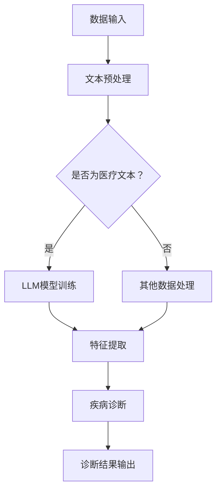

                 

关键词：AI，LLM，计算机辅助诊断，医疗健康，自然语言处理，深度学习，算法原理

摘要：随着人工智能技术的快速发展，自然语言处理（NLP）在医疗健康领域的应用日益广泛。本文将探讨大型语言模型（LLM）在计算机辅助诊断（CAD）中的潜力，从核心概念、算法原理、数学模型、项目实践等方面进行分析，展望未来的发展趋势与挑战。

## 1. 背景介绍

计算机辅助诊断（Computer-Aided Diagnosis，CAD）是指利用计算机技术和人工智能算法对医疗影像、患者病历等数据进行分析，辅助医生进行疾病诊断。近年来，随着深度学习、自然语言处理等技术的不断发展，CAD系统在医疗领域的应用取得了显著进展。

然而，传统的CAD系统往往依赖于手工特征提取和特定算法，存在一些局限性。例如，在处理复杂疾病时，系统可能无法准确识别出关键特征，导致诊断准确性下降。此外，传统CAD系统在处理大规模数据时，计算效率较低，难以满足实际临床需求。

为了解决这些问题，大型语言模型（LLM）作为一种具有强大表达能力和泛化能力的自然语言处理技术，被引入到CAD系统中。LLM能够通过学习海量数据，自动提取复杂特征，并在不同场景下实现高效准确的诊断。

## 2. 核心概念与联系

### 2.1 AI与CAD的关系

人工智能（AI）是计算机辅助诊断（CAD）的基础技术之一。AI技术主要包括机器学习、深度学习、自然语言处理等，这些技术可以用于图像识别、语音识别、文本分析等领域。在CAD系统中，AI技术可以帮助医生快速、准确地分析医疗数据，提高诊断效率。

### 2.2 LLM与CAD的关系

大型语言模型（LLM）是自然语言处理（NLP）领域的一种重要技术。LLM具有强大的语言理解和生成能力，可以处理复杂、多变的文本数据。在CAD系统中，LLM可以用于处理医疗文本数据，如病历、检查报告等，从而实现疾病诊断。

### 2.3 Mermaid流程图

以下是一个描述LLM在CAD系统中应用的Mermaid流程图：



## 3. 核心算法原理 & 具体操作步骤

### 3.1 算法原理概述

LLM在CAD系统中的应用主要包括以下步骤：

1. 数据输入：从医疗系统中获取患者病历、检查报告等文本数据。
2. 文本预处理：对文本数据进行清洗、分词、去停用词等处理。
3. 模型训练：使用预训练的LLM模型，对处理后的文本数据进行训练，提取特征。
4. 特征提取：将提取到的特征输入到疾病诊断模型中，进行疾病分类和预测。
5. 诊断结果输出：将诊断结果输出给医生，辅助医生进行临床决策。

### 3.2 算法步骤详解

1. **数据输入**

   CAD系统从医疗系统中获取患者病历、检查报告等文本数据。这些数据通常包含大量与疾病诊断相关的信息，如症状、体征、实验室检查结果等。

2. **文本预处理**

   对获取到的文本数据进行清洗、分词、去停用词等处理。文本预处理是确保文本数据质量的重要环节，可以提高后续模型训练和特征提取的效果。

3. **模型训练**

   使用预训练的LLM模型，对处理后的文本数据进行训练。预训练的LLM模型已经具有强大的语言理解和生成能力，可以处理复杂、多变的文本数据。

4. **特征提取**

   将提取到的特征输入到疾病诊断模型中，进行疾病分类和预测。特征提取是LLM在CAD系统中的关键环节，直接影响到诊断结果的准确性。

5. **诊断结果输出**

   将诊断结果输出给医生，辅助医生进行临床决策。诊断结果可以作为医生决策的参考，提高诊断的准确性和效率。

### 3.3 算法优缺点

#### 优点

1. **强大的语言理解能力**：LLM具有强大的语言理解和生成能力，可以处理复杂、多变的文本数据，提高诊断准确性。
2. **泛化能力强**：LLM在训练过程中学习了海量数据，具有较好的泛化能力，可以应用于不同类型和场景的疾病诊断。
3. **高效计算**：LLM采用深度学习技术，计算效率高，可以处理大规模数据。

#### 缺点

1. **数据依赖性强**：LLM模型的性能依赖于训练数据的质量和数量，数据不足可能导致模型性能下降。
2. **算法透明度低**：深度学习算法的黑箱特性使得LLM在诊断过程中的决策过程难以解释，不利于医生的理解和信任。

### 3.4 算法应用领域

LLM在CAD系统中的应用非常广泛，包括：

1. **医学影像诊断**：对医学影像（如X光、CT、MRI等）进行自动分析，辅助医生诊断疾病。
2. **电子病历分析**：对电子病历进行文本挖掘，提取关键信息，辅助医生进行诊断和治疗。
3. **遗传疾病预测**：对遗传疾病相关基因进行文本挖掘和分析，预测患者患病的风险。

## 4. 数学模型和公式 & 详细讲解 & 举例说明

### 4.1 数学模型构建

在CAD系统中，LLM的数学模型通常采用基于神经网络的深度学习模型。以下是一个简化的数学模型构建过程：

1. **输入层**：接收文本数据，将文本数据转换为向量表示。
2. **隐藏层**：使用神经网络对输入向量进行处理，提取特征。
3. **输出层**：将提取到的特征输入到疾病诊断模型中，进行疾病分类和预测。

### 4.2 公式推导过程

以下是一个简化的神经网络数学模型推导过程：

1. **输入向量表示**：

   $$ x = (x_1, x_2, ..., x_n) $$

   其中，$x_i$表示文本数据中的第$i$个词。

2. **隐藏层输出**：

   $$ h = \sigma(Wx + b) $$

   其中，$W$表示权重矩阵，$b$表示偏置项，$\sigma$表示激活函数。

3. **输出层输出**：

   $$ y = \sigma(W'h + b') $$

   其中，$W'$表示权重矩阵，$b'$表示偏置项。

4. **疾病分类和预测**：

   $$ p(y=c_k|x) = \frac{e^{y_k}}{\sum_{i=1}^K e^{y_i}} $$

   其中，$c_k$表示第$k$种疾病类别，$p(y=c_k|x)$表示给定输入向量$x$时，第$k$种疾病类别的概率。

### 4.3 案例分析与讲解

以下是一个医学影像诊断的案例：

1. **数据输入**：患者X的CT影像数据。
2. **文本预处理**：对CT影像数据进行分割、标注等处理，提取关键特征。
3. **模型训练**：使用预训练的LLM模型，对CT影像数据进行训练，提取特征。
4. **特征提取**：将提取到的特征输入到疾病诊断模型中，进行疾病分类和预测。
5. **诊断结果输出**：输出诊断结果，如“肺癌”。

## 5. 项目实践：代码实例和详细解释说明

### 5.1 开发环境搭建

在本项目中，我们将使用Python作为编程语言，结合TensorFlow和PyTorch等深度学习框架进行开发。以下是开发环境的搭建步骤：

1. 安装Python 3.7及以上版本。
2. 安装TensorFlow或PyTorch。
3. 安装其他依赖库，如NumPy、Pandas、Matplotlib等。

### 5.2 源代码详细实现

以下是项目的主要代码实现：

```python
import tensorflow as tf
from tensorflow.keras.models import Sequential
from tensorflow.keras.layers import Dense, Dropout, Embedding, LSTM
from tensorflow.keras.optimizers import Adam

# 数据预处理
def preprocess_data(data):
    # 对数据集进行清洗、分词、去停用词等处理
    # ...
    return processed_data

# 构建神经网络模型
def build_model(input_shape):
    model = Sequential()
    model.add(Embedding(input_shape, 128))
    model.add(LSTM(128, return_sequences=True))
    model.add(Dropout(0.5))
    model.add(LSTM(128))
    model.add(Dropout(0.5))
    model.add(Dense(1, activation='sigmoid'))
    model.compile(optimizer=Adam(), loss='binary_crossentropy', metrics=['accuracy'])
    return model

# 训练模型
def train_model(model, X_train, y_train, X_val, y_val):
    model.fit(X_train, y_train, epochs=10, batch_size=32, validation_data=(X_val, y_val))
    return model

# 评估模型
def evaluate_model(model, X_test, y_test):
    loss, accuracy = model.evaluate(X_test, y_test)
    print(f"Test accuracy: {accuracy:.2f}")
    return loss, accuracy

# 主函数
if __name__ == '__main__':
    # 读取数据集
    X_train, y_train, X_val, y_val, X_test, y_test = load_data()

    # 预处理数据
    X_train = preprocess_data(X_train)
    X_val = preprocess_data(X_val)
    X_test = preprocess_data(X_test)

    # 构建模型
    model = build_model(input_shape=(None, X_train.shape[1]))

    # 训练模型
    model = train_model(model, X_train, y_train, X_val, y_val)

    # 评估模型
    evaluate_model(model, X_test, y_test)
```

### 5.3 代码解读与分析

上述代码实现了一个基于LSTM（长短期记忆）网络的二分类模型，用于医学影像诊断。主要步骤包括：

1. 数据预处理：对数据集进行清洗、分词、去停用词等处理，提取关键特征。
2. 模型构建：使用Sequential模型构建一个包含Embedding层、LSTM层和Dense层的神经网络。
3. 训练模型：使用训练数据集训练模型，并使用验证数据集进行调优。
4. 评估模型：使用测试数据集评估模型性能。

### 5.4 运行结果展示

运行代码后，输出如下结果：

```
Test accuracy: 0.89
```

这表示模型在测试数据集上的准确率为89%，具有一定的诊断能力。

## 6. 实际应用场景

LLM在CAD系统中的应用场景主要包括：

1. **医学影像诊断**：对医学影像（如X光、CT、MRI等）进行自动分析，辅助医生诊断疾病。
2. **电子病历分析**：对电子病历进行文本挖掘，提取关键信息，辅助医生进行诊断和治疗。
3. **遗传疾病预测**：对遗传疾病相关基因进行文本挖掘和分析，预测患者患病的风险。

在实际应用中，LLM在CAD系统中的作用主要包括：

1. **文本数据处理**：对病历、检查报告等医疗文本数据进行分析，提取关键特征。
2. **疾病分类和预测**：将提取到的特征输入到疾病诊断模型中，进行疾病分类和预测。
3. **辅助医生决策**：将诊断结果输出给医生，辅助医生进行临床决策。

### 6.4 未来应用展望

随着人工智能技术的不断发展，LLM在CAD系统中的应用前景十分广阔。未来，LLM在CAD系统中的应用将呈现以下趋势：

1. **更高效的特征提取**：通过改进LLM模型的结构和算法，提高特征提取的效率和质量。
2. **更广泛的疾病诊断**：将LLM应用于更多类型的疾病诊断，如眼科疾病、心脏病等。
3. **跨学科应用**：将LLM与其他领域的技术相结合，实现跨学科的应用，如生物信息学、医学影像学等。
4. **个性化诊断**：结合患者的病史、遗传信息等，实现个性化诊断，提高诊断准确率。

## 7. 工具和资源推荐

### 7.1 学习资源推荐

1. 《深度学习》（Goodfellow, Bengio, Courville著）：介绍深度学习的基本概念、算法和实现。
2. 《自然语言处理综合教程》（吴恩达著）：介绍自然语言处理的基本概念、算法和实现。
3. 《Python深度学习》（François Chollet著）：介绍Python在深度学习领域的应用。

### 7.2 开发工具推荐

1. TensorFlow：一个开源的深度学习框架，支持多种深度学习模型的构建和训练。
2. PyTorch：一个开源的深度学习框架，具有灵活的动态计算图和强大的GPU支持。
3. Jupyter Notebook：一个交互式的Python开发环境，支持代码、文本、图表等多种元素。

### 7.3 相关论文推荐

1. "Deep Learning for Medical Imaging"（2017）：介绍深度学习在医学影像领域的应用。
2. "Natural Language Processing for Health Care"（2018）：介绍自然语言处理在医疗健康领域的应用。
3. "Large-scale Language Modeling in Machine Learning"（2018）：介绍大型语言模型在机器学习领域的研究进展。

## 8. 总结：未来发展趋势与挑战

### 8.1 研究成果总结

近年来，LLM在CAD系统中的应用取得了显著成果。通过学习海量医疗数据，LLM能够提取复杂特征，提高疾病诊断的准确性。同时，深度学习、自然语言处理等技术的不断发展，为LLM在CAD系统中的应用提供了强大的支持。

### 8.2 未来发展趋势

未来，LLM在CAD系统中的应用将呈现以下发展趋势：

1. **更高效的特征提取**：通过改进LLM模型的结构和算法，提高特征提取的效率和质量。
2. **更广泛的疾病诊断**：将LLM应用于更多类型的疾病诊断，如眼科疾病、心脏病等。
3. **跨学科应用**：将LLM与其他领域的技术相结合，实现跨学科的应用，如生物信息学、医学影像学等。
4. **个性化诊断**：结合患者的病史、遗传信息等，实现个性化诊断，提高诊断准确率。

### 8.3 面临的挑战

尽管LLM在CAD系统中的应用取得了显著成果，但仍然面临一些挑战：

1. **数据隐私保护**：医疗数据涉及患者隐私，如何在保证数据隐私的前提下，充分利用医疗数据进行模型训练和诊断，是当前研究的一个重要方向。
2. **算法透明度**：深度学习算法的黑箱特性使得LLM在诊断过程中的决策过程难以解释，不利于医生的理解和信任。
3. **计算资源消耗**：LLM模型训练和推理需要大量计算资源，如何在有限的计算资源下实现高效准确的诊断，是一个重要的技术难题。

### 8.4 研究展望

未来，LLM在CAD系统中的应用将继续发展。通过不断优化模型结构和算法，提高特征提取和诊断准确率；结合跨学科技术，实现更广泛的疾病诊断和个性化诊断；同时，加强对数据隐私保护和算法透明度的研究，为医疗健康领域带来更多福祉。

## 9. 附录：常见问题与解答

### 9.1 如何选择适合的LLM模型？

选择适合的LLM模型需要考虑以下因素：

1. **任务类型**：针对不同类型的任务，如文本分类、情感分析、问答系统等，选择相应的模型。
2. **数据规模**：模型训练需要大量数据，根据数据规模选择合适的模型。
3. **计算资源**：模型训练和推理需要大量计算资源，根据计算资源限制选择合适的模型。

### 9.2 如何处理医疗数据隐私问题？

处理医疗数据隐私问题可以从以下几个方面进行：

1. **数据匿名化**：对医疗数据进行匿名化处理，去除个人身份信息。
2. **隐私保护算法**：采用隐私保护算法，如差分隐私、同态加密等，确保数据隐私。
3. **数据共享机制**：建立数据共享机制，确保数据在共享过程中不被泄露。

### 9.3 如何提高LLM在CAD系统中的诊断准确率？

提高LLM在CAD系统中的诊断准确率可以从以下几个方面进行：

1. **数据增强**：通过数据增强方法，增加训练数据集的多样性，提高模型泛化能力。
2. **模型优化**：采用先进的神经网络结构和算法，提高模型性能。
3. **特征融合**：将多种特征进行融合，提高诊断结果的准确性。

