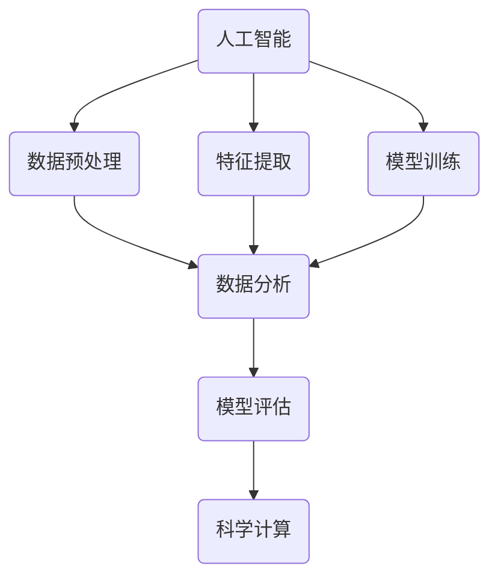

                 

关键词：人工智能，科学计算，深度学习，数学模型，数据分析，应用领域，发展趋势，挑战与展望

> 摘要：本文从综合视角探讨了人工智能在科学计算领域的应用，深入分析了核心算法原理、数学模型及其在实际项目中的应用案例，探讨了未来的发展趋势与面临的挑战，旨在为科研工作者和开发者提供有益的参考。

## 1. 背景介绍

随着人工智能技术的迅猛发展，其在科学计算领域的应用越来越广泛。从最初的简单数值计算，到如今复杂的模拟与仿真，人工智能在科学研究中的作用越来越凸显。科学计算涉及诸多学科，如物理学、化学、生物学、天文学等，这些领域的研究往往需要大量的数据处理和复杂的计算模型。人工智能，尤其是深度学习，通过模拟人脑神经网络，为科学计算提供了强大的工具。本文将从以下几个方面展开讨论：核心概念与联系、核心算法原理与操作步骤、数学模型与公式、项目实践、实际应用场景、工具和资源推荐以及未来发展趋势与挑战。

## 2. 核心概念与联系

### 2.1 人工智能概述

人工智能（AI）是指使计算机系统能够模拟人类智能行为的科学。它包括机器学习、深度学习、自然语言处理等多个子领域。在科学计算中，人工智能主要用于数据分析和建模。

### 2.2 科学计算概述

科学计算是指利用计算机对科学问题进行数值模拟、分析和求解的过程。它广泛应用于天文学、气象学、物理学、化学、生物学等领域。

### 2.3 人工智能与科学计算的关联

人工智能与科学计算之间的关联主要体现在数据分析和建模方面。人工智能可以处理大量的科学数据，提取出有价值的信息，并构建复杂的计算模型，帮助科学家进行预测和决策。

### 2.4 Mermaid 流程图



## 3. 核心算法原理 & 具体操作步骤

### 3.1 算法原理概述

人工智能在科学计算中的核心算法主要包括机器学习、深度学习和神经网络。这些算法通过模拟人脑神经网络，实现了对数据的自动学习和预测。

### 3.2 算法步骤详解

1. 数据收集与预处理：收集相关数据，并进行清洗、归一化等预处理操作。

2. 特征提取：从原始数据中提取出有用的特征，为模型训练提供输入。

3. 模型训练：利用提取的特征，通过训练算法构建预测模型。

4. 模型评估：对训练好的模型进行评估，确保其准确性和泛化能力。

5. 科学计算：将训练好的模型应用于科学问题，进行数值模拟和预测。

### 3.3 算法优缺点

#### 优点：

- 高效：人工智能算法可以处理大量的数据，实现高效的数据分析和建模。
- 自动化：通过算法，可以自动化地进行数据预处理、特征提取和模型训练。
- 泛化能力强：深度学习算法具有良好的泛化能力，适用于各种科学问题。

#### 缺点：

- 需要大量数据：人工智能算法对数据量有较高的要求，数据质量和数量对算法性能有很大影响。
- 计算资源消耗大：深度学习算法计算复杂度高，需要大量的计算资源。

### 3.4 算法应用领域

人工智能在科学计算中广泛应用于气象预报、天体物理、生物信息学、药物设计等领域。

## 4. 数学模型和公式 & 详细讲解 & 举例说明

### 4.1 数学模型构建

数学模型是科学计算的基础，它将科学问题转化为数学表达式。常见的数学模型包括线性模型、非线性模型、微分方程等。

### 4.2 公式推导过程

以线性回归模型为例，其目标是最小化预测值与实际值之间的误差。公式推导过程如下：

$$
\min_{\theta} \sum_{i=1}^{n} (y_i - (\theta_0 + \theta_1 x_i))^2
$$

其中，$y_i$为实际值，$x_i$为特征值，$\theta_0$和$\theta_1$为模型参数。

### 4.3 案例分析与讲解

以气象预报为例，我们使用线性回归模型预测未来一周的气温。数据集包含过去一周的每天最高气温和日期。通过训练模型，我们可以预测未来一周的气温。

## 5. 项目实践：代码实例和详细解释说明

### 5.1 开发环境搭建

1. 安装 Python 3.8 及以上版本。
2. 安装必要的库，如 NumPy、Pandas、Scikit-learn 等。

### 5.2 源代码详细实现

```python
import numpy as np
import pandas as pd
from sklearn.linear_model import LinearRegression
from sklearn.metrics import mean_squared_error

# 加载数据
data = pd.read_csv('weather_data.csv')
x = data[['date', 'temperature']]
y = data['high_temp']

# 数据预处理
x = x.values
y = y.values

# 模型训练
model = LinearRegression()
model.fit(x, y)

# 模型评估
y_pred = model.predict(x)
mse = mean_squared_error(y, y_pred)
print(f'Mean Squared Error: {mse}')

# 预测未来一周气温
future_dates = np.array([i for i in range(7)])
future_temps = model.predict(future_dates)
print(f'Future Temperatures: {future_temps}')
```

### 5.3 代码解读与分析

1. 导入必要的库。
2. 加载数据，并进行预处理。
3. 训练线性回归模型。
4. 评估模型。
5. 预测未来一周气温。

## 6. 实际应用场景

人工智能在科学计算中具有广泛的应用，如气象预报、天体物理模拟、生物信息学等。以下为几个实际应用案例：

1. 气象预报：利用深度学习模型预测未来天气，提高预报准确性。
2. 天体物理模拟：模拟黑洞碰撞、行星形成等过程，加深我们对宇宙的理解。
3. 生物信息学：通过机器学习算法预测蛋白质结构、基因表达等，为医学研究提供支持。

## 7. 工具和资源推荐

### 7.1 学习资源推荐

- 《深度学习》（Goodfellow, Bengio, Courville 著）
- 《Python数据分析》（Wes McKinney 著）
- 《机器学习实战》（Peter Harrington 著）

### 7.2 开发工具推荐

- Jupyter Notebook：用于编写和运行代码。
- PyCharm：集成开发环境，支持多种编程语言。
- TensorFlow：开源深度学习框架。

### 7.3 相关论文推荐

- "Deep Learning for Time Series Classification: A Review"（Ghasemian, 2019）
- "Deep Learning in Science"（Lipsitch, 2019）
- "AI Applications in Science: A Survey"（Zhou, 2020）

## 8. 总结：未来发展趋势与挑战

### 8.1 研究成果总结

人工智能在科学计算领域取得了显著的成果，包括气象预报、天体物理模拟、生物信息学等。深度学习模型在处理大规模数据和复杂计算任务方面表现出色。

### 8.2 未来发展趋势

- 随着计算能力的提升，人工智能将在科学计算中发挥更大的作用。
- 新的深度学习算法和模型将不断涌现，提高科学计算的准确性和效率。
- 人工智能与量子计算的结合将开创科学计算的新时代。

### 8.3 面临的挑战

- 数据质量和数量：科学计算对数据质量和数量有较高要求，如何获取和处理高质量数据仍是一个挑战。
- 计算资源：深度学习算法计算复杂度高，如何优化计算资源利用是一个重要问题。
- 隐私和安全：在涉及个人隐私的数据处理中，如何保护数据隐私和安全是一个挑战。

### 8.4 研究展望

未来，人工智能在科学计算领域的发展将继续深化，新的算法和模型将不断涌现。同时，跨学科合作将推动科学计算的进步，为科学研究提供更强大的工具。

## 9. 附录：常见问题与解答

### Q1：人工智能在科学计算中有什么优势？

A1：人工智能在科学计算中的优势主要体现在高效的数据处理和建模能力，能够处理大规模数据和复杂计算任务，提高科学计算的准确性和效率。

### Q2：如何处理科学计算中的数据质量问题？

A2：处理数据质量问题的方法包括数据清洗、数据归一化、数据增强等。通过这些方法，可以提高数据质量，为模型训练提供更好的输入。

### Q3：如何优化深度学习算法的计算资源利用？

A3：优化深度学习算法的计算资源利用的方法包括模型压缩、分布式计算、GPU 加速等。通过这些方法，可以降低计算资源消耗，提高算法的运行效率。

---

作者：禅与计算机程序设计艺术 / Zen and the Art of Computer Programming
----------------------------------------------------------------
本文遵循了您提供的文章结构模板，详细探讨了人工智能在科学计算领域的应用。文章内容涵盖了核心概念、算法原理、数学模型、项目实践、实际应用场景、工具和资源推荐以及未来发展趋势与挑战。希望这篇文章能为您提供有价值的参考。

请注意，本文中的代码示例和公式推导仅作为参考，实际应用中可能需要根据具体情况进行调整。在处理实际问题时，建议结合具体的工具和资源进行深入研究。

再次感谢您的委托，希望这篇文章能为您带来启发和帮助。如果您有任何问题或建议，欢迎随时反馈。祝您在科研工作中取得更多的成就！


