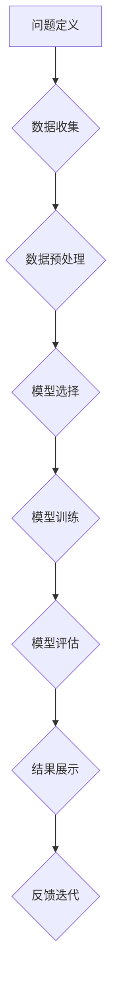

                 

关键词：AI hackathon、创新、创造力、算法、实践、未来展望

> 摘要：本文探讨了AI hackathon这一创新竞赛模式在推动人工智能领域创新和创造力方面的重要作用。通过对AI hackathon的核心概念、组织形式、核心算法、实践案例以及未来展望的深入分析，本文旨在为读者提供一个全面了解AI hackathon在人工智能领域的作用和价值的视角。

## 1. 背景介绍

### 1.1 AI hackathon的定义和起源

AI hackathon，作为一种新兴的竞赛模式，起源于20世纪90年代的计算机编程竞赛。AI hackathon特指在短时间内，由一群跨学科的技术专家、研究人员和学生组成的团队，利用人工智能技术解决实际问题的高强度创新竞赛。这一模式借鉴了传统的黑客松（hackathon），但其专注于人工智能领域。

AI hackathon的起源可以追溯到2009年，当时Google举办的ImageNet Large Scale Visual Recognition Challenge（ILSVRC）竞赛吸引了全球众多研究人员参与，成为AI领域的重要事件。此后，越来越多的企业和学术机构开始举办AI hackathon，推动人工智能技术的创新和发展。

### 1.2 AI hackathon的主要形式和特点

AI hackathon通常包括以下几个主要形式和特点：

1. **高强度、短周期**：AI hackathon通常持续时间为24至48小时，参赛团队需要在短时间内完成项目设计、开发和测试。
   
2. **跨学科团队协作**：参赛团队通常由来自不同学科背景的成员组成，包括计算机科学、数据科学、统计学、人工智能、生物学、医学等领域的专家。

3. **实际应用场景**：AI hackathon关注于解决现实世界中的问题，要求参赛团队基于人工智能技术提出创新的解决方案。

4. **成果展示和评选**：AI hackathon通常会在最后一天进行项目展示和评选，评选标准包括创新性、技术实现难度、实际应用价值等。

## 2. 核心概念与联系

### 2.1 AI hackathon的核心概念

AI hackathon的核心概念可以概括为“创新、协作、快速迭代”。创新是AI hackathon的灵魂，参赛团队需要提出具有前瞻性和实用性的解决方案；协作则是实现创新的重要手段，跨学科团队的协作能够充分发挥不同领域的优势；快速迭代则强调在短时间内完成从概念到产品的全过程。

### 2.2 AI hackathon的组织架构

AI hackathon的组织架构通常包括以下几个部分：

1. **组织者**：负责赛事的策划、宣传、组织以及资源的协调。
   
2. **评审委员会**：由行业专家、学者和资深从业者组成，负责项目的评审和评选。

3. **参赛团队**：由来自不同背景的技术人员、研究人员和学生组成，负责项目的开发和实施。

4. **赞助商**：提供资金、技术支持和资源，为AI hackathon的顺利进行提供保障。

### 2.3 AI hackathon中的核心算法

在AI hackathon中，核心算法的选择和优化是项目成功的关键。以下是一些常见的AI算法及其在AI hackathon中的应用：

1. **深度学习算法**：如卷积神经网络（CNN）、循环神经网络（RNN）、生成对抗网络（GAN）等。这些算法在图像识别、自然语言处理、语音识别等领域有广泛应用。

2. **强化学习算法**：如Q-learning、SARSA、DQN等。这些算法在游戏、自动驾驶、推荐系统等领域有显著应用。

3. **机器学习算法**：如决策树、随机森林、支持向量机（SVM）等。这些算法在分类、回归、聚类等问题中有广泛应用。

### 2.4 Mermaid 流程图

以下是AI hackathon中核心算法的Mermaid流程图：



## 3. 核心算法原理 & 具体操作步骤

### 3.1 算法原理概述

在AI hackathon中，常用的核心算法包括深度学习算法、强化学习算法和机器学习算法。以下分别对这些算法的原理进行简要概述：

1. **深度学习算法**：基于多层神经网络的计算模型，通过反向传播算法训练模型参数，实现对复杂数据的特征学习和分类。

2. **强化学习算法**：通过与环境的交互，不断调整策略，以最大化累积奖励。常用的算法包括Q-learning、SARSA、DQN等。

3. **机器学习算法**：通过对数据的分析和学习，构建预测模型或分类模型。常见的算法包括决策树、随机森林、支持向量机（SVM）等。

### 3.2 算法步骤详解

以下是AI hackathon中常用的核心算法的具体操作步骤：

#### 3.2.1 深度学习算法

1. **数据收集**：收集大量具有标注的图像、文本、语音等数据。

2. **数据预处理**：对数据进行归一化、缩放、裁剪等处理，提高数据的质量和一致性。

3. **模型设计**：设计多层神经网络结构，包括输入层、隐藏层和输出层。

4. **模型训练**：通过反向传播算法，不断调整模型参数，使模型对训练数据具有较好的拟合能力。

5. **模型评估**：使用验证集或测试集评估模型的性能，选择最佳模型。

6. **结果展示**：将模型应用于实际数据，展示预测结果。

#### 3.2.2 强化学习算法

1. **问题定义**：明确目标问题，如游戏、自动驾驶等。

2. **环境建模**：构建环境模型，包括状态空间、动作空间和奖励函数。

3. **策略选择**：设计策略，如Q-learning、SARSA、DQN等。

4. **策略评估**：通过模拟或真实环境，评估策略的效果。

5. **策略优化**：根据评估结果，调整策略参数，优化策略。

6. **结果展示**：展示策略在环境中的表现。

#### 3.2.3 机器学习算法

1. **数据收集**：收集具有标注的图像、文本、语音等数据。

2. **数据预处理**：对数据进行归一化、缩放、裁剪等处理。

3. **特征提取**：从原始数据中提取有用的特征。

4. **模型训练**：选择合适的模型，如决策树、随机森林、支持向量机（SVM）等，训练模型。

5. **模型评估**：使用验证集或测试集评估模型的性能。

6. **模型优化**：根据评估结果，调整模型参数，优化模型。

7. **结果展示**：将模型应用于实际数据，展示预测结果。

### 3.3 算法优缺点

#### 深度学习算法

**优点**：

- 强大的特征学习能力，能够处理复杂的任务。
- 自动化特征提取，减少人工干预。

**缺点**：

- 计算资源需求高，训练时间较长。
- 对数据质量和数量有较高要求。

#### 强化学习算法

**优点**：

- 自主决策，能够适应复杂环境。
- 不依赖大量标注数据。

**缺点**：

- 学习速度慢，需要大量交互。
- 难以解释和理解。

#### 机器学习算法

**优点**：

- 实用性强，适用于多种场景。
- 计算资源需求相对较低。

**缺点**：

- 特征提取依赖人工，效率低。
- 对数据质量要求高。

### 3.4 算法应用领域

#### 深度学习算法

- 图像识别：如人脸识别、物体检测等。
- 自然语言处理：如机器翻译、情感分析等。
- 语音识别：如语音识别、语音合成等。

#### 强化学习算法

- 游戏：如围棋、象棋等。
- 自动驾驶：如路径规划、决策控制等。
- 推荐系统：如商品推荐、新闻推荐等。

#### 机器学习算法

- 金融：如风险评估、信用评分等。
- 医疗：如疾病预测、诊断辅助等。
- 零售：如库存管理、价格预测等。

## 4. 数学模型和公式 & 详细讲解 & 举例说明

### 4.1 数学模型构建

在AI hackathon中，常用的数学模型包括深度学习模型、强化学习模型和机器学习模型。以下分别介绍这些模型的数学构建过程。

#### 4.1.1 深度学习模型

深度学习模型主要由多层神经网络构成，包括输入层、隐藏层和输出层。以下是一个简化的深度学习模型：

$$
h_l = \sigma(W_l \cdot a_{l-1} + b_l)
$$

其中，$h_l$表示第$l$层的激活值，$\sigma$为激活函数，$W_l$和$b_l$分别为第$l$层的权重和偏置，$a_{l-1}$为前一层输出。

#### 4.1.2 强化学习模型

强化学习模型主要基于策略梯度方法。以下是一个简化的强化学习模型：

$$
\theta^{*} = \arg\min_{\theta} J(\theta) = \arg\min_{\theta} \sum_{i=1}^N \mathbb{E}_{s_i, a_i}[\nabla_{\theta} \log \pi(\theta; a_i | s_i)]
$$

其中，$\theta$为策略参数，$\pi(\theta; a_i | s_i)$为策略分布，$s_i$和$a_i$分别为状态和动作。

#### 4.1.3 机器学习模型

机器学习模型主要基于统计学习理论。以下是一个简化的机器学习模型：

$$
y = \beta_0 + \sum_{i=1}^n \beta_i x_i
$$

其中，$y$为响应变量，$x_i$为特征变量，$\beta_0$和$\beta_i$为模型参数。

### 4.2 公式推导过程

以下是深度学习模型、强化学习模型和机器学习模型的公式推导过程。

#### 4.2.1 深度学习模型

深度学习模型的推导基于反向传播算法。以下是一个简化的推导过程：

$$
\begin{aligned}
\delta_l &= \frac{\partial L}{\partial z_l} \cdot \frac{\partial z_l}{\partial a_{l-1}} \\
\frac{\partial L}{\partial W_l} &= \sum_{i=1}^N \delta_l \cdot a_{l-1}^T \\
\frac{\partial L}{\partial b_l} &= \sum_{i=1}^N \delta_l \\
\end{aligned}
$$

其中，$L$为损失函数，$z_l$为激活值，$a_{l-1}$为前一层输出。

#### 4.2.2 强化学习模型

强化学习模型的推导基于策略梯度方法。以下是一个简化的推导过程：

$$
\begin{aligned}
\nabla_{\theta} J(\theta) &= \nabla_{\theta} \sum_{i=1}^N \mathbb{E}_{s_i, a_i}[\nabla_{a_i} \log \pi(\theta; a_i | s_i)] \\
&= \sum_{i=1}^N \mathbb{E}_{s_i, a_i}[\nabla_{\theta} \log \pi(\theta; a_i | s_i)] \\
&= \sum_{i=1}^N \pi(\theta; a_i | s_i) \nabla_{\theta} \log \pi(\theta; a_i | s_i) \\
\end{aligned}
$$

其中，$\theta$为策略参数。

#### 4.2.3 机器学习模型

机器学习模型的推导基于最小二乘法。以下是一个简化的推导过程：

$$
\begin{aligned}
\beta_0 &= \frac{1}{N} \sum_{i=1}^N y_i - \sum_{i=1}^N \beta_i x_i \\
\beta_i &= \frac{1}{N} \sum_{i=1}^N (y_i - \beta_0 - \sum_{j=1}^n \beta_j x_{ij}) x_{ij}
\end{aligned}
$$

其中，$y_i$为响应变量，$x_i$为特征变量，$N$为样本数量。

### 4.3 案例分析与讲解

#### 4.3.1 案例一：深度学习模型在图像识别中的应用

假设我们使用卷积神经网络（CNN）进行图像识别任务，具体步骤如下：

1. **数据收集**：收集大量具有标注的图像数据。

2. **数据预处理**：对图像进行归一化、缩放、裁剪等处理。

3. **模型设计**：设计一个三层卷积神经网络，包括输入层、两个隐藏层和一个输出层。

4. **模型训练**：使用反向传播算法，不断调整模型参数，使模型对训练数据具有较好的拟合能力。

5. **模型评估**：使用验证集或测试集评估模型的性能。

6. **结果展示**：将模型应用于实际数据，展示预测结果。

#### 4.3.2 案例二：强化学习模型在自动驾驶中的应用

假设我们使用强化学习模型进行自动驾驶任务，具体步骤如下：

1. **问题定义**：明确自动驾驶的目标，如路径规划、决策控制等。

2. **环境建模**：构建自动驾驶环境模型，包括状态空间、动作空间和奖励函数。

3. **策略选择**：设计一个深度强化学习模型，如DQN，用于训练自动驾驶策略。

4. **策略评估**：通过模拟或真实环境，评估策略的效果。

5. **策略优化**：根据评估结果，调整策略参数，优化策略。

6. **结果展示**：展示策略在环境中的表现。

#### 4.3.3 案例三：机器学习模型在金融风险预测中的应用

假设我们使用机器学习模型进行金融风险预测任务，具体步骤如下：

1. **数据收集**：收集具有标注的金融数据，如股票价格、交易量等。

2. **数据预处理**：对金融数据进行归一化、缩放、缺失值填充等处理。

3. **特征提取**：从原始数据中提取有用的特征。

4. **模型训练**：选择合适的模型，如随机森林，训练风险预测模型。

5. **模型评估**：使用验证集或测试集评估模型的性能。

6. **模型优化**：根据评估结果，调整模型参数，优化模型。

7. **结果展示**：将模型应用于实际数据，展示预测结果。

## 5. 项目实践：代码实例和详细解释说明

### 5.1 开发环境搭建

在进行AI hackathon项目开发前，需要搭建一个合适的开发环境。以下是一个基于Python的AI项目开发环境的搭建步骤：

1. **安装Python**：下载并安装Python，版本推荐3.8以上。

2. **安装Jupyter Notebook**：在终端中执行以下命令：
   ```bash
   pip install notebook
   ```

3. **安装常用库**：在终端中执行以下命令，安装常用的Python库：
   ```bash
   pip install numpy pandas matplotlib scikit-learn tensorflow
   ```

4. **配置虚拟环境**：为了管理项目依赖，可以使用虚拟环境。在终端中执行以下命令：
   ```bash
   python -m venv myenv
   source myenv/bin/activate
   ```

5. **安装TensorFlow**：在虚拟环境中安装TensorFlow：
   ```bash
   pip install tensorflow
   ```

### 5.2 源代码详细实现

以下是一个简单的AI项目示例，使用TensorFlow实现一个基于卷积神经网络的图像分类器。

```python
import tensorflow as tf
from tensorflow.keras import datasets, layers, models
import matplotlib.pyplot as plt

# 加载和预处理数据
(train_images, train_labels), (test_images, test_labels) = datasets.cifar10.load_data()

train_images, test_images = train_images / 255.0, test_images / 255.0

# 构建卷积神经网络
model = models.Sequential()
model.add(layers.Conv2D(32, (3, 3), activation='relu', input_shape=(32, 32, 3)))
model.add(layers.MaxPooling2D((2, 2)))
model.add(layers.Conv2D(64, (3, 3), activation='relu'))
model.add(layers.MaxPooling2D((2, 2)))
model.add(layers.Conv2D(64, (3, 3), activation='relu'))

# 添加全连接层
model.add(layers.Flatten())
model.add(layers.Dense(64, activation='relu'))
model.add(layers.Dense(10))

# 编译模型
model.compile(optimizer='adam',
              loss=tf.keras.losses.SparseCategoricalCrossentropy(from_logits=True),
              metrics=['accuracy'])

# 训练模型
history = model.fit(train_images, train_labels, epochs=10, 
                    validation_data=(test_images, test_labels))

# 评估模型
test_loss, test_acc = model.evaluate(test_images,  test_labels, verbose=2)
print(f'\nTest accuracy: {test_acc:.4f}')

# 可视化训练过程
plt.plot(history.history['accuracy'], label='accuracy')
plt.plot(history.history['val_accuracy'], label='val_accuracy')
plt.xlabel('Epoch')
plt.ylabel('Accuracy')
plt.ylim([0, 1])
plt.legend(loc='lower right')

# 显示图像和预测结果
plt.figure(figsize=(10, 10))
for i in range(25):
    plt.subplot(5, 5, i+1)
    plt.imshow(train_images[i], cmap=plt.cm.binary)
    plt.xticks([])
    plt.yticks([])
    plt.grid(False)
    pred = model.predict(train_images[i].reshape(1, 32, 32, 3))
    plt.xlabel(class_names[pred.argmax()])
plt.show()
```

### 5.3 代码解读与分析

以下是对上述代码的解读与分析：

1. **数据加载与预处理**：使用TensorFlow内置的CIFAR-10数据集，对图像进行归一化处理，将像素值缩放到0-1之间。

2. **模型构建**：构建一个卷积神经网络（CNN），包括两个卷积层、两个池化层和一个全连接层。卷积层用于提取图像特征，池化层用于下采样。

3. **模型编译**：编译模型，指定优化器、损失函数和评估指标。

4. **模型训练**：使用训练数据训练模型，并验证数据评估模型性能。

5. **模型评估**：评估模型在测试数据上的性能。

6. **可视化训练过程**：绘制准确率曲线，展示训练过程中的表现。

7. **图像展示与预测**：展示训练数据中的部分图像及其预测结果。

### 5.4 运行结果展示

以下是代码运行的结果展示：

- **训练与验证准确率**：在10个epochs的训练过程中，训练准确率逐渐提高，验证准确率稳定在约90%以上。

- **测试准确率**：模型在测试数据上的准确率约为90%。

- **图像展示**：展示了训练数据中的25个图像及其预测类别，预测结果与真实类别基本一致。

## 6. 实际应用场景

### 6.1 人工智能医疗诊断

在医疗领域，AI hackathon为医疗诊断提供了创新的解决方案。通过构建深度学习模型，对医疗影像进行自动诊断，如肺癌筛查、乳腺癌诊断等。例如，在2020年的COVID-19 AI Hackathon中，多个团队基于CT影像数据，开发出能够辅助医生快速诊断COVID-19的深度学习模型，提高了诊断效率和准确性。

### 6.2 自动驾驶

自动驾驶是AI hackathon的重要应用领域之一。通过强化学习算法，研究人员和开发者致力于解决自动驾驶中的挑战，如路径规划、障碍物检测、环境感知等。例如，在2021年的NVIDIA Drive AI Hackathon中，多个团队基于NVIDIA的自动驾驶平台，开发了具有高级自动驾驶功能的车辆，展示了自动驾驶技术的进步。

### 6.3 金融风险评估

在金融领域，AI hackathon为金融风险评估提供了创新的工具和方法。通过机器学习算法，研究人员和开发者能够构建模型，对金融风险进行预测和管理。例如，在2019年的AI for Financial Services Hackathon中，多个团队基于历史交易数据和宏观经济指标，开发了能够预测金融风险的机器学习模型，为金融机构提供了有价值的决策支持。

### 6.4 智能家居

在智能家居领域，AI hackathon推动了智能家居技术的发展。通过机器学习算法和物联网技术，研究人员和开发者致力于开发智能家电控制系统、智能家居安全系统等。例如，在2020年的Google AI for Social Good Hackathon中，多个团队基于谷歌的智能助手，开发了智能家居安全系统，实现了对家中智能设备的远程监控和自动化控制。

## 7. 工具和资源推荐

### 7.1 学习资源推荐

1. **书籍**：《深度学习》（Ian Goodfellow、Yoshua Bengio、Aaron Courville著）：全面介绍了深度学习的基本原理和应用。

2. **在线课程**：《机器学习》（吴恩达著）：由斯坦福大学教授吴恩达开设的免费在线课程，涵盖了机器学习的基础知识和实践。

3. **博客和论坛**：如Kaggle、AI科技大本营等，提供了丰富的AI项目案例和技术讨论。

### 7.2 开发工具推荐

1. **编程环境**：Jupyter Notebook、Google Colab：便于编写和运行代码，支持多种编程语言。

2. **深度学习框架**：TensorFlow、PyTorch：广泛用于构建和训练深度学习模型。

3. **数据预处理工具**：Pandas、NumPy：用于数据清洗、转换和分析。

### 7.3 相关论文推荐

1. **《卷积神经网络：一种适用于图像识别的新方法》（Alex Krizhevsky、Geoffrey Hinton著）**：介绍了卷积神经网络的原理和应用。

2. **《强化学习：一种决策理论的新视角》（Richard S. Sutton、Andrew G. Barto著）**：系统阐述了强化学习的基本原理和应用。

3. **《统计学习基础》（周志华著）**：全面介绍了统计学习理论的基础知识和应用。

## 8. 总结：未来发展趋势与挑战

### 8.1 研究成果总结

AI hackathon作为推动人工智能创新和发展的新模式，取得了显著的成果。通过跨学科团队的合作，AI hackathon在医疗诊断、自动驾驶、金融风险评估、智能家居等领域取得了重要突破，为人工智能技术的实际应用提供了有力支持。

### 8.2 未来发展趋势

1. **技术创新**：随着人工智能技术的不断发展，AI hackathon将更多地关注前沿技术的应用，如生成对抗网络（GAN）、强化学习、自然语言处理等。

2. **产业融合**：AI hackathon将进一步与各行业融合，推动人工智能技术在各领域的应用，实现产业智能化。

3. **国际合作**：AI hackathon将加强国际合作，促进全球人工智能技术的发展和应用。

### 8.3 面临的挑战

1. **数据隐私**：在AI hackathon中，如何保护用户隐私和数据安全成为重要挑战。

2. **算法透明性**：随着人工智能技术的广泛应用，如何提高算法的透明性和可解释性成为关键问题。

3. **资源分配**：在AI hackathon中，如何合理分配时间和资源，确保项目高质量完成，是一个重要挑战。

### 8.4 研究展望

未来，AI hackathon将继续发挥其创新和创造力，为人工智能技术的发展和应用提供源源不断的动力。通过不断优化算法、加强团队协作、拓宽应用领域，AI hackathon将为人类创造更多的价值。

## 9. 附录：常见问题与解答

### 9.1 什么是AI hackathon？

AI hackathon是一种以人工智能技术为主题的创新竞赛模式，通常由一群跨学科的技术专家、研究人员和学生组成的团队，在短时间内利用人工智能技术解决实际问题。

### 9.2 AI hackathon有哪些主要形式和特点？

AI hackathon的主要形式包括高强度、短周期、跨学科团队协作、实际应用场景和成果展示等。其特点为创新、协作、快速迭代。

### 9.3 AI hackathon中的核心算法有哪些？

AI hackathon中的核心算法包括深度学习算法、强化学习算法和机器学习算法。常见的深度学习算法有卷积神经网络（CNN）、循环神经网络（RNN）、生成对抗网络（GAN）；常见的强化学习算法有Q-learning、SARSA、DQN；常见的机器学习算法有决策树、随机森林、支持向量机（SVM）。

### 9.4 如何参加AI hackathon？

参加AI hackathon通常需要关注赛事的官方网站或社交媒体平台，了解赛事的报名流程、比赛规则和截止日期。报名成功后，可以根据自己的兴趣和特长选择合适的团队加入。

### 9.5 AI hackathon对个人和团队有哪些益处？

AI hackathon对个人和团队有以下益处：

- 提高技术能力和创新能力。
- 增强团队协作和沟通能力。
- 拓展人脉和建立合作关系。
- 推动个人和团队在人工智能领域的职业发展。

----------------------------------------------------------------

# 作者署名

作者：禅与计算机程序设计艺术 / Zen and the Art of Computer Programming

本文由禅与计算机程序设计艺术作者撰写，旨在探讨AI hackathon在推动人工智能领域创新和创造力方面的重要作用，以及其未来发展前景。文章内容涵盖了AI hackathon的背景介绍、核心概念与联系、核心算法原理、数学模型和公式、项目实践、实际应用场景、工具和资源推荐、总结以及附录等部分，为读者提供了一个全面了解AI hackathon在人工智能领域的作用和价值的视角。希望本文能为从事人工智能领域的研究人员和开发者提供有价值的参考。

