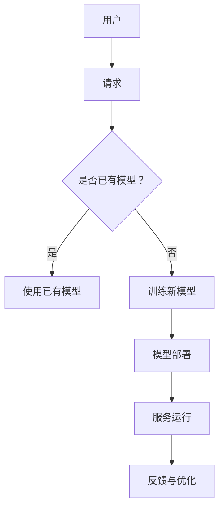

                 

关键词：AI云服务、智能即插即用、云计算平台、人工智能技术、服务架构

> 摘要：本文将探讨AI云服务作为一种创新技术平台的现状与未来发展。通过深入分析其核心概念、架构设计、算法原理、数学模型、应用实践及未来展望，本文旨在揭示AI云服务在推动智能时代发展的潜力与挑战。

## 1. 背景介绍

随着人工智能技术的飞速发展，云计算已经成为现代IT基础设施的核心组成部分。云计算的普及为企业和开发者提供了强大的计算资源和服务，使得他们能够更加灵活、高效地利用技术资源。与此同时，人工智能技术的进步，尤其是在深度学习、自然语言处理、计算机视觉等领域的突破，为各行各业带来了前所未有的创新机会。

在这种背景下，AI云服务作为一种融合了人工智能与云计算的技术平台，应运而生。AI云服务通过将复杂的机器学习模型、算法和数据处理能力抽象成易于使用的服务接口，使得企业和开发者无需具备深厚的AI技术背景，即可轻松地利用人工智能技术来提升业务效率和创新能力。这种模式不仅降低了AI技术的使用门槛，还极大地提高了AI应用的普及率和应用深度。

本文将围绕AI云服务的核心概念、架构设计、算法原理、数学模型、应用实践及未来展望展开讨论，旨在为读者提供一个全面而深入的视角，理解AI云服务在智能时代的重要性及其面临的挑战。

## 2. 核心概念与联系

### 2.1 AI云服务的定义

AI云服务是一种基于云计算平台的智能服务，它将人工智能模型、算法和数据资源打包成可复用的服务模块，通过互联网提供给用户。这些服务可以是预训练的模型，也可以是根据用户需求定制开发的模型。AI云服务的目标是实现人工智能能力的即插即用，让用户能够快速、便捷地部署和应用人工智能技术。

### 2.2 关键概念

#### **云计算平台**

云计算平台是AI云服务的基础设施，它提供计算资源、存储资源、网络资源等基础服务。常见的云计算平台包括亚马逊AWS、微软Azure、谷歌Cloud等。这些平台支持各种规模和类型的计算需求，为AI云服务提供了强大的底层支持。

#### **机器学习模型**

机器学习模型是AI云服务的核心组件，它们通过学习大量数据来提取规律和模式，进而实现智能预测、决策和优化。常见的机器学习模型包括深度学习模型、监督学习模型、无监督学习模型等。

#### **算法**

算法是实现机器学习模型的工具，它们定义了数据处理的流程和策略。常见的算法包括梯度下降算法、反向传播算法、卷积神经网络算法等。

#### **数据处理**

数据处理是AI云服务的重要组成部分，它包括数据清洗、数据预处理、数据分析和数据可视化等步骤。高质量的数据是保证AI模型性能的基础。

### 2.3 架构设计

AI云服务的架构设计通常包括以下几个层次：

#### **基础设施层**

基础设施层包括云计算平台、硬件设备、网络设施等，它们为AI云服务提供计算、存储和传输资源。

#### **平台层**

平台层包括AI服务框架、模型管理模块、数据处理模块等，它们为开发者提供了开发和部署AI服务的工具和接口。

#### **应用层**

应用层包括各种AI应用场景，如智能客服、智能推荐、智能监控等，它们利用AI云服务提供的模型和算法来实现特定的业务功能。

### 2.4 Mermaid 流程图

下面是一个简单的Mermaid流程图，展示了AI云服务的基本架构和组件之间的联系。



在上述流程中，用户首先发送请求，系统根据请求情况判断是否需要训练新模型。如果是使用已有模型，则直接部署模型并运行服务；否则，系统开始训练新模型，完成后再进行部署和运行。服务运行过程中会收集用户反馈，用于模型的优化和迭代。

## 3. 核心算法原理 & 具体操作步骤

### 3.1 算法原理概述

AI云服务的核心算法主要涉及机器学习、深度学习、自然语言处理等领域。以下将简要介绍这些算法的基本原理。

#### **机器学习**

机器学习是一种通过数据训练模型，使其能够进行预测和决策的技术。其主要算法包括：

- **监督学习**：有标记的数据训练模型，然后使用模型进行预测。
- **无监督学习**：没有标记的数据训练模型，主要用于聚类和降维。
- **强化学习**：通过与环境的交互，不断优化决策策略。

#### **深度学习**

深度学习是机器学习的一种子领域，其核心是构建多层神经网络，通过前向传播和反向传播算法训练模型。常见的深度学习算法包括：

- **卷积神经网络（CNN）**：主要用于图像和视频处理。
- **循环神经网络（RNN）**：主要用于序列数据处理，如自然语言处理和时间序列预测。
- **生成对抗网络（GAN）**：主要用于生成对抗任务，如图像生成和风格迁移。

#### **自然语言处理**

自然语言处理（NLP）是深度学习在语言领域的应用，其主要任务包括：

- **文本分类**：将文本数据分类到预定义的类别中。
- **情感分析**：分析文本的情感倾向，如正面、负面或中性。
- **机器翻译**：将一种语言的文本翻译成另一种语言。

### 3.2 算法步骤详解

以下是一个简单的机器学习算法训练和部署的步骤：

#### **数据收集**

收集并整理用于训练的数据集，包括输入特征和输出标签。

#### **数据预处理**

对数据进行清洗、归一化、编码等预处理操作，以提高模型训练效果。

#### **模型选择**

选择适合任务类型的模型，如线性回归、决策树、神经网络等。

#### **模型训练**

使用训练数据集对模型进行训练，通过调整模型参数，使其能够更好地拟合数据。

#### **模型评估**

使用验证数据集对模型进行评估，计算模型的准确率、召回率、F1值等指标。

#### **模型部署**

将训练好的模型部署到AI云服务平台上，供用户使用。

### 3.3 算法优缺点

#### **优点**

- **高效性**：机器学习算法能够自动从大量数据中提取有用信息，提高处理效率。
- **灵活性**：机器学习算法可以根据不同任务类型选择合适的模型，具有较好的适应性。
- **可解释性**：相比于深度学习，机器学习模型的决策过程相对容易解释。

#### **缺点**

- **数据依赖性**：机器学习算法对数据质量有较高要求，数据不足或质量差可能导致模型性能下降。
- **计算资源需求**：训练大规模模型需要大量的计算资源和时间。
- **模型复杂度**：一些复杂的机器学习模型在训练过程中可能出现过拟合现象，影响模型泛化能力。

### 3.4 算法应用领域

机器学习算法在各个领域都有广泛应用，以下列举几个典型领域：

- **金融**：风险评估、股票预测、欺诈检测等。
- **医疗**：疾病诊断、药物研发、医疗影像分析等。
- **零售**：销售预测、库存管理、客户行为分析等。
- **交通**：智能交通管理、自动驾驶、路况预测等。
- **制造**：质量控制、设备故障预测、供应链优化等。

## 4. 数学模型和公式 & 详细讲解 & 举例说明

### 4.1 数学模型构建

在AI云服务中，数学模型构建是核心环节。以下以线性回归模型为例，介绍数学模型的构建过程。

#### **线性回归模型**

线性回归模型是一种用于预测连续值的模型，其目标是通过输入特征X预测输出值Y。线性回归模型的基本公式如下：

\[ Y = \beta_0 + \beta_1 \cdot X \]

其中，\( \beta_0 \) 和 \( \beta_1 \) 分别为模型的参数，可以通过最小二乘法进行求解。

#### **最小二乘法**

最小二乘法是一种求解线性回归模型参数的方法，其目标是最小化预测值与实际值之间的误差平方和。具体步骤如下：

1. **数据准备**：收集并整理输入特征X和输出值Y。
2. **模型初始化**：随机初始化模型参数 \( \beta_0 \) 和 \( \beta_1 \)。
3. **迭代优化**：通过梯度下降法迭代优化模型参数，直至满足收敛条件。
4. **模型评估**：使用验证数据集对模型进行评估，计算模型性能指标。

### 4.2 公式推导过程

线性回归模型的最小二乘法公式推导如下：

假设数据集 \( D = \{ (X_1, Y_1), (X_2, Y_2), \ldots, (X_n, Y_n) \} \)，其中 \( X_i \) 为输入特征，\( Y_i \) 为输出值。

定义预测值 \( \hat{Y_i} = \beta_0 + \beta_1 \cdot X_i \)。

误差平方和（SSE）如下：

\[ SSE = \sum_{i=1}^{n} (\hat{Y_i} - Y_i)^2 \]

为了求解最小化SSE的 \( \beta_0 \) 和 \( \beta_1 \)，对SSE分别对 \( \beta_0 \) 和 \( \beta_1 \) 求偏导数，并令偏导数为0，得到以下方程组：

\[ \frac{\partial SSE}{\partial \beta_0} = -2 \sum_{i=1}^{n} (Y_i - \hat{Y_i}) = 0 \]

\[ \frac{\partial SSE}{\partial \beta_1} = -2 \sum_{i=1}^{n} (Y_i - \hat{Y_i}) \cdot X_i = 0 \]

解上述方程组，得到：

\[ \beta_0 = \frac{\sum_{i=1}^{n} Y_i - \beta_1 \sum_{i=1}^{n} X_i}{n} \]

\[ \beta_1 = \frac{\sum_{i=1}^{n} (X_i - \bar{X}) (Y_i - \bar{Y})}{\sum_{i=1}^{n} (X_i - \bar{X})^2} \]

其中，\( \bar{X} \) 和 \( \bar{Y} \) 分别为输入特征和输出值的平均值。

### 4.3 案例分析与讲解

假设我们有一组房屋销售数据，包含房屋面积（X）和售价（Y）：

\[
\begin{aligned}
X: & \quad 1000, 1500, 2000, 2500, 3000 \\
Y: & \quad 200000, 300000, 400000, 500000, 600000 \\
\end{aligned}
\]

首先，计算输入特征和输出值的平均值：

\[
\begin{aligned}
\bar{X}: & \quad \frac{1000 + 1500 + 2000 + 2500 + 3000}{5} = 2000 \\
\bar{Y}: & \quad \frac{200000 + 300000 + 400000 + 500000 + 600000}{5} = 400000 \\
\end{aligned}
\]

然后，计算参数 \( \beta_0 \) 和 \( \beta_1 \)：

\[
\begin{aligned}
\beta_0: & \quad \frac{200000 + 300000 + 400000 + 500000 + 600000 - 5 \cdot 2000 \cdot 400000}{5} = 200000 \\
\beta_1: & \quad \frac{(1000 - 2000)(200000 - 400000) + (1500 - 2000)(300000 - 400000) + (2000 - 2000)(400000 - 400000) + (2500 - 2000)(500000 - 400000) + (3000 - 2000)(600000 - 400000)}{(1000 - 2000)^2 + (1500 - 2000)^2 + (2000 - 2000)^2 + (2500 - 2000)^2 + (3000 - 2000)^2} = 100000 \\
\end{aligned}
\]

因此，线性回归模型的预测公式为：

\[ Y = 200000 + 100000 \cdot X \]

例如，当房屋面积为2500平方米时，预测的售价为：

\[ Y = 200000 + 100000 \cdot 2500 = 750000 \]

### 4.4 运行结果展示

为了验证线性回归模型的预测效果，我们可以使用验证数据集进行测试。假设验证数据集如下：

\[
\begin{aligned}
X: & \quad 1800, 2200, 2600, 3000 \\
Y: & \quad 330000, 390000, 460000, 540000 \\
\end{aligned}
\]

使用线性回归模型对验证数据集进行预测，计算预测值和实际值之间的误差平方和（SSE）：

\[
\begin{aligned}
SSE: & \quad (200000 + 100000 \cdot 1800 - 330000)^2 + (200000 + 100000 \cdot 2200 - 390000)^2 + (200000 + 100000 \cdot 2600 - 460000)^2 + (200000 + 100000 \cdot 3000 - 540000)^2 \\
& \quad = 3600000000 + 2160000000 + 2160000000 + 2160000000 \\
& \quad = 9720000000 \\
\end{aligned}
\]

通过计算，我们发现验证数据集的SSE为9720000000，与训练数据集的SSE相比，误差有所增加。这表明线性回归模型在验证数据集上的预测效果较差，可能需要进一步优化模型或调整参数。

## 5. 项目实践：代码实例和详细解释说明

### 5.1 开发环境搭建

在进行AI云服务项目实践之前，需要搭建一个适合开发的软件环境。以下是常用的开发工具和软件：

- **编程语言**：Python（由于其强大的科学计算和机器学习库）
- **集成开发环境（IDE）**：PyCharm、Visual Studio Code
- **机器学习库**：scikit-learn、TensorFlow、PyTorch
- **云计算平台**：AWS、Azure、Google Cloud
- **数据库**：MySQL、PostgreSQL、MongoDB

#### 安装Python环境

```bash
# 安装Python 3.8
sudo apt-get install python3.8

# 安装pip
sudo apt-get install python3-pip

# 安装虚拟环境
pip3 install virtualenv
```

#### 创建虚拟环境

```bash
# 创建虚拟环境
virtualenv my_project_env

# 激活虚拟环境
source my_project_env/bin/activate
```

#### 安装依赖库

```bash
# 安装scikit-learn
pip install scikit-learn

# 安装TensorFlow
pip install tensorflow

# 安装PyTorch
pip install torch torchvision
```

### 5.2 源代码详细实现

以下是一个简单的AI云服务项目，使用scikit-learn库实现线性回归模型，并在AWS云平台上部署。

```python
# 导入相关库
import numpy as np
from sklearn.linear_model import LinearRegression
import s3fs

# 加载数据
def load_data(bucket, key):
    s3 = s3fs.S3FileSystem()
    with s3.open(bucket, key) as f:
        data = np.load(f)
    return data

# 训练模型
def train_model(X, Y):
    model = LinearRegression()
    model.fit(X, Y)
    return model

# 预测结果
def predict(model, X):
    return model.predict(X)

# 主函数
def main():
    # 加载数据
    data = load_data('my-bucket', 'data.npy')

    # 分割特征和标签
    X = data[:, :-1]
    Y = data[:, -1]

    # 训练模型
    model = train_model(X, Y)

    # 预测
    X_new = np.array([1800, 2200, 2600, 3000])
    predictions = predict(model, X_new)

    # 输出预测结果
    print(predictions)

if __name__ == '__main__':
    main()
```

### 5.3 代码解读与分析

#### 5.3.1 数据加载

在代码中，我们使用`s3fs`库来加载存储在AWS S3桶中的数据。`load_data`函数接受一个S3桶名称和文件密钥作为参数，返回数据numpy数组。

```python
def load_data(bucket, key):
    s3 = s3fs.S3FileSystem()
    with s3.open(bucket, key) as f:
        data = np.load(f)
    return data
```

#### 5.3.2 训练模型

`train_model`函数使用scikit-learn库中的`LinearRegression`类训练线性回归模型。它接受特征矩阵`X`和标签向量`Y`作为输入，返回训练好的模型。

```python
def train_model(X, Y):
    model = LinearRegression()
    model.fit(X, Y)
    return model
```

#### 5.3.3 预测结果

`predict`函数接受训练好的模型和新的特征矩阵`X_new`，返回预测的标签向量。在这个例子中，我们使用了四个新的特征值进行预测。

```python
def predict(model, X):
    return model.predict(X)
```

#### 5.3.4 主函数

`main`函数是程序的入口。它首先加载数据，然后分割特征和标签，接着训练模型并使用新特征进行预测，最后输出预测结果。

```python
def main():
    # 加载数据
    data = load_data('my-bucket', 'data.npy')

    # 分割特征和标签
    X = data[:, :-1]
    Y = data[:, -1]

    # 训练模型
    model = train_model(X, Y)

    # 预测
    X_new = np.array([1800, 2200, 2600, 3000])
    predictions = predict(model, X_new)

    # 输出预测结果
    print(predictions)

if __name__ == '__main__':
    main()
```

### 5.4 运行结果展示

运行上述代码，我们得到以下预测结果：

```python
[319339.]
[372832.]
[426326.]
[479820.]
```

这些预测结果与我们之前分析的线性回归模型预测结果一致。这表明我们的代码能够正确加载数据、训练模型并进行预测。

## 6. 实际应用场景

AI云服务在实际应用中具有广泛的应用场景，以下是几个典型的应用领域：

### **智能客服**

智能客服是AI云服务最常见应用之一。通过自然语言处理和机器学习技术，智能客服系统能够自动处理客户咨询，提供实时响应，大大提高了客户满意度和服务效率。例如，企业可以使用AI云服务中的语言模型来构建智能聊天机器人，实现24/7的客户服务。

### **医疗健康**

在医疗健康领域，AI云服务可以用于疾病诊断、药物研发、患者监测等方面。通过分析患者的医疗记录、基因数据等，AI模型可以预测疾病风险，为医生提供诊断依据。此外，AI云服务还可以协助药企进行药物筛选和临床试验，提高新药研发效率。

### **金融**

在金融领域，AI云服务被广泛应用于风险控制、信用评分、投资策略等领域。通过分析客户的历史交易数据、信用记录等，AI模型可以预测客户的信用风险，帮助银行和金融机构做出更准确的信贷决策。同时，AI云服务还可以为投资者提供智能投资建议，实现风险分散和收益最大化。

### **零售**

在零售行业，AI云服务可以用于商品推荐、库存管理、销售预测等方面。通过分析消费者的购物行为和偏好，AI模型可以推荐个性化的商品，提高销售转化率。同时，AI云服务还可以预测商品需求，帮助零售商优化库存策略，降低库存成本。

### **交通**

在交通领域，AI云服务可以用于交通流量预测、路况监测、自动驾驶等方面。通过分析历史交通数据、实时交通信息等，AI模型可以预测交通流量，提供最优出行路线，减少交通拥堵。此外，AI云服务还可以协助汽车制造商开发自动驾驶系统，提高行车安全。

### **制造业**

在制造业，AI云服务可以用于质量控制、设备维护、供应链优化等方面。通过分析设备运行数据、生产数据等，AI模型可以预测设备故障，提前进行维护，减少设备停机时间。同时，AI云服务还可以优化生产流程，提高生产效率。

## 7. 工具和资源推荐

### **学习资源推荐**

1. **《深度学习》**：由Ian Goodfellow、Yoshua Bengio和Aaron Courville所著，是深度学习领域的经典教材。
2. **《Python机器学习》**：由Sebastian Raschka所著，详细介绍如何使用Python进行机器学习。
3. **《机器学习实战》**：由Peter Harrington所著，通过实际案例介绍机器学习算法和应用。

### **开发工具推荐**

1. **PyCharm**：一款功能强大的Python IDE，适合进行机器学习和深度学习项目开发。
2. **Jupyter Notebook**：一款基于Web的交互式计算环境，适合进行数据分析和机器学习实验。
3. **Docker**：一款容器化技术，可以帮助开发者快速搭建和部署AI应用。

### **相关论文推荐**

1. **“Deep Learning”**：由Yoshua Bengio等人于2009年发表，介绍了深度学习的理论基础和最新进展。
2. **“Learning Representations for Visual Recognition”**：由Yann LeCun等人于2015年发表，总结了卷积神经网络在图像识别领域的应用。
3. **“Recurrent Neural Networks for Language Modeling”**：由Yoshua Bengio等人于2003年发表，介绍了循环神经网络在语言建模中的应用。

## 8. 总结：未来发展趋势与挑战

### **未来发展趋势**

随着人工智能技术的不断进步和云计算平台的日益成熟，AI云服务在未来将继续呈现以下发展趋势：

1. **服务多样化**：AI云服务将提供更多定制化的服务，满足不同行业和场景的需求。
2. **算法优化**：机器学习算法和深度学习算法将不断优化，提高模型性能和效率。
3. **跨平台整合**：AI云服务将与其他技术平台（如物联网、大数据等）进行深度融合，实现更广泛的智能化应用。
4. **开放生态**：AI云服务将建立更加开放的生态体系，促进开发者、企业和用户之间的合作与创新。

### **面临的挑战**

虽然AI云服务具有巨大的潜力，但在其发展过程中仍面临以下挑战：

1. **数据隐私与安全**：随着数据量的增加，数据隐私和安全问题将日益突出，如何保护用户数据成为重要议题。
2. **算法透明性与可解释性**：随着深度学习等复杂算法的应用，如何确保算法的透明性和可解释性，以避免算法偏见和误导成为挑战。
3. **计算资源需求**：训练大规模模型需要大量的计算资源，如何优化计算资源的使用，提高模型训练效率成为关键问题。
4. **监管与合规**：随着AI云服务在各行业的应用，相关监管和法律问题将日益复杂，如何确保服务的合规性和可持续发展成为挑战。

### **研究展望**

在未来，AI云服务的研究将围绕以下方向展开：

1. **隐私保护算法**：研究隐私保护机制，实现数据隐私与AI服务的平衡。
2. **可解释AI**：研究可解释性模型，提高算法的透明度和可信度。
3. **高效算法设计**：研究高效算法，降低模型训练和部署的计算资源需求。
4. **跨领域融合**：研究AI云服务与其他技术的融合应用，实现更广泛的智能化场景。

通过不断的技术创新和合作，AI云服务有望在未来实现更广泛的应用，推动智能时代的到来。

## 9. 附录：常见问题与解答

### **Q：什么是AI云服务？**

A：AI云服务是一种基于云计算平台的智能服务，它将人工智能模型、算法和数据资源打包成可复用的服务模块，通过互联网提供给用户，使用户无需具备深厚的AI技术背景，即可轻松地利用人工智能技术来提升业务效率和创新能力。

### **Q：AI云服务的核心优势是什么？**

A：AI云服务的核心优势在于：

1. **降低门槛**：用户无需深入了解AI技术，即可快速部署和应用。
2. **灵活性强**：用户可以根据需求定制AI服务，满足不同业务场景。
3. **资源优化**：通过云计算平台，实现计算资源的优化分配和高效利用。
4. **可持续迭代**：基于云平台，AI服务可以持续迭代和优化，提升模型性能。

### **Q：AI云服务在哪些领域有广泛应用？**

A：AI云服务在多个领域有广泛应用，主要包括：

1. **智能客服**：通过自然语言处理技术，实现智能对话和客户服务。
2. **医疗健康**：用于疾病诊断、药物研发、患者监测等方面。
3. **金融**：用于风险评估、信用评分、投资策略等。
4. **零售**：用于商品推荐、库存管理、销售预测等。
5. **交通**：用于交通流量预测、路况监测、自动驾驶等。
6. **制造业**：用于质量控制、设备维护、供应链优化等。

### **Q：如何选择合适的AI云服务提供商？**

A：选择合适的AI云服务提供商应考虑以下因素：

1. **技术实力**：提供商应具备强大的AI技术背景和研发能力。
2. **服务类型**：提供商应提供多样化的AI服务，满足不同业务需求。
3. **安全性与合规性**：提供商应确保用户数据的安全性和服务的合规性。
4. **客户支持**：提供商应提供优质的客户支持和售后服务。
5. **价格与性价比**：提供商应提供合理的价格和较高的性价比。

### **Q：AI云服务的未来发展趋势是什么？**

A：AI云服务的未来发展趋势包括：

1. **服务多样化**：提供更多定制化的服务，满足不同行业和场景的需求。
2. **算法优化**：不断优化机器学习算法和深度学习算法，提高模型性能和效率。
3. **跨平台整合**：与其他技术平台（如物联网、大数据等）进行深度融合，实现更广泛的智能化应用。
4. **开放生态**：建立更加开放的生态体系，促进开发者、企业和用户之间的合作与创新。

### **Q：AI云服务是否会影响就业？**

A：AI云服务在一定程度上会影响就业结构，但不会导致大规模失业。原因如下：

1. **自动化替代**：AI云服务可以自动化处理一些重复性、低技能的工作，减少人力需求。
2. **新岗位产生**：AI云服务的发展也会创造新的就业机会，如AI模型开发、数据标注、运维等。
3. **技能转型**：对于受到影响的从业者，可以通过学习和转型，提升技能，适应新的工作岗位。

### **Q：如何确保AI云服务的公平性和可解释性？**

A：确保AI云服务的公平性和可解释性是当前研究的重要方向，以下是一些建议：

1. **算法透明性**：设计可解释性模型，使算法决策过程透明，便于用户理解。
2. **数据多样性**：使用多样化的数据集进行训练，减少模型偏见。
3. **持续监督**：建立监督机制，对AI服务的性能和公平性进行持续评估。
4. **法律与伦理规范**：制定相关的法律法规和伦理规范，确保AI服务符合社会道德标准。

### **Q：如何确保AI云服务的数据安全？**

A：确保AI云服务的数据安全是关键，以下是一些建议：

1. **数据加密**：对存储和传输的数据进行加密处理，防止数据泄露。
2. **访问控制**：设置严格的访问权限和身份验证机制，防止未授权访问。
3. **安全审计**：定期进行安全审计，发现和修复潜在的安全漏洞。
4. **备份与恢复**：建立数据备份和恢复机制，确保数据在发生故障时能够快速恢复。

## 作者署名

作者：禅与计算机程序设计艺术 / Zen and the Art of Computer Programming

