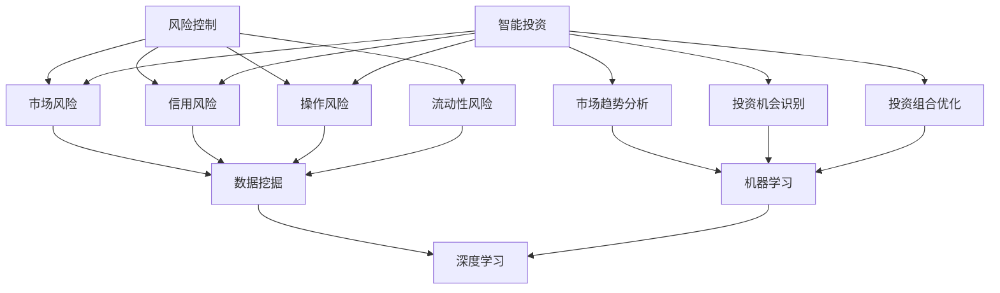
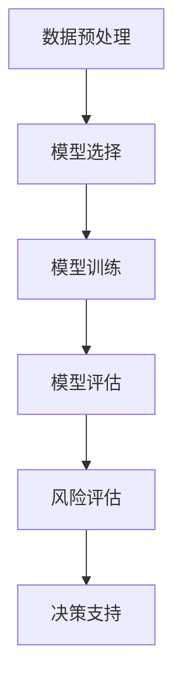

                 

关键词：人工智能、金融、风险控制、智能投资、算法、数学模型、项目实践

> 摘要：本文将探讨人工智能在金融领域的两大重要应用：风险控制和智能投资。通过详细分析核心概念、算法原理、数学模型以及实际项目案例，揭示AI技术在金融领域的潜力和挑战，并对未来的发展趋势和研究方向进行展望。

## 1. 背景介绍

金融行业作为现代经济的核心，其稳健运行对整个经济体系的稳定至关重要。然而，金融市场的复杂性和动态性使得风险管理和投资决策面临巨大挑战。随着计算机技术的飞速发展和人工智能（AI）技术的不断进步，AI在金融领域的应用逐渐成为研究热点。通过机器学习、数据挖掘、深度学习等技术，AI能够从海量数据中提取有价值的信息，为金融机构提供更加精准的风险评估和投资建议。

### 1.1 人工智能与金融领域的结合

人工智能与金融的结合主要体现在两个方面：一是风险控制，二是智能投资。

- **风险控制**：金融机构需要评估和管理各种风险，包括市场风险、信用风险、操作风险等。AI技术通过数据分析、模式识别和预测模型，可以更准确地识别潜在风险，并及时采取措施，降低损失。

- **智能投资**：在投资领域，AI技术可以帮助投资者分析市场趋势、评估投资机会、构建投资组合等。通过机器学习和大数据分析，AI可以识别出传统方法难以发现的交易机会，提高投资回报率。

### 1.2 AI在金融领域的现状与趋势

目前，AI在金融领域已经取得了一定的应用成果，例如智能客服、风险控制、量化投资等。随着技术的不断进步，AI在金融领域的应用将更加深入和广泛。

- **技术进步**：随着算法的优化和计算能力的提升，AI在金融数据处理和分析方面的效率不断提高。

- **数据资源**：金融行业积累了大量的数据资源，为AI提供了丰富的训练数据，有助于提升模型的准确性和可靠性。

- **监管支持**：各国政府和监管机构对金融科技创新给予了支持，为AI在金融领域的应用提供了良好的政策环境。

### 1.3 文章结构

本文将按照以下结构进行展开：

1. 背景介绍
2. 核心概念与联系
3. 核心算法原理 & 具体操作步骤
4. 数学模型和公式 & 详细讲解 & 举例说明
5. 项目实践：代码实例和详细解释说明
6. 实际应用场景
7. 工具和资源推荐
8. 总结：未来发展趋势与挑战
9. 附录：常见问题与解答

## 2. 核心概念与联系

在深入探讨AI在金融领域的应用之前，我们需要明确一些核心概念，并理解它们之间的联系。

### 2.1 风险控制

风险控制是金融领域的重要环节，旨在识别、评估、监控并管理各种风险，以确保金融机构的稳健运行。风险控制包括以下几个方面：

- **市场风险**：由于市场价格波动导致的潜在损失。
- **信用风险**：债务人无法履行债务的风险。
- **操作风险**：由于内部流程、人员操作失误或系统故障导致的损失。
- **流动性风险**：无法及时获得足够的流动性资金以应对市场变化的风险。

### 2.2 智能投资

智能投资是指利用AI技术对投资过程进行优化，以提高投资回报率。智能投资包括以下几个方面：

- **市场趋势分析**：通过分析市场数据，预测市场走势。
- **投资机会识别**：利用数据挖掘技术，发现潜在的投资机会。
- **投资组合优化**：通过构建投资模型，优化投资组合，降低风险，提高收益。

### 2.3 核心概念联系

风险控制和智能投资是金融领域的两个重要方面，它们之间有着密切的联系。

- **数据来源**：风险控制和智能投资都需要依赖于海量数据，包括市场数据、财务数据、客户数据等。
- **技术手段**：两者都利用了AI技术，包括机器学习、数据挖掘、深度学习等。
- **目标一致**：风险控制和智能投资都旨在降低风险，提高收益。

下面是一个使用Mermaid绘制的流程图，展示了风险控制和智能投资的核心概念及其联系：



## 3. 核心算法原理 & 具体操作步骤

### 3.1 算法原理概述

在金融领域，AI算法的应用主要基于机器学习和深度学习技术。这些算法通过学习历史数据，建立预测模型，从而为金融机构提供风险控制和投资决策支持。

- **机器学习**：机器学习是一种通过数据训练模型，从而进行预测或分类的技术。在金融领域，机器学习算法可以用于风险识别和投资预测。

- **深度学习**：深度学习是机器学习的一种，它使用多层神经网络进行数据训练。深度学习在图像识别、语音识别等领域取得了显著成果，也逐渐应用于金融领域。

### 3.2 算法步骤详解

以下是一个基于机器学习的风险控制算法的基本步骤：

#### 3.2.1 数据预处理

- **数据清洗**：处理缺失值、异常值和重复数据。
- **特征工程**：提取对风险控制有重要影响的关键特征。

#### 3.2.2 模型选择

- **选择合适的机器学习算法**：如逻辑回归、决策树、支持向量机等。
- **模型训练**：使用历史数据对模型进行训练。

#### 3.2.3 模型评估

- **交叉验证**：使用交叉验证方法评估模型性能。
- **指标评估**：如准确率、召回率、F1值等。

#### 3.2.4 模型应用

- **风险评估**：使用训练好的模型对新的金融产品或投资机会进行风险评估。
- **决策支持**：根据风险评估结果，为金融机构提供投资决策建议。

### 3.3 算法优缺点

#### 3.3.1 优点

- **高效性**：AI算法能够处理海量数据，进行快速分析。
- **准确性**：通过学习历史数据，AI算法能够提高风险预测的准确性。
- **自动化**：AI算法可以实现自动化决策，减轻人力负担。

#### 3.3.2 缺点

- **数据依赖性**：AI算法的性能很大程度上依赖于数据的质量和数量。
- **黑箱问题**：深度学习算法的内部结构复杂，难以解释，可能导致决策的不透明性。
- **过拟合风险**：如果模型过于复杂，可能会导致过拟合，无法泛化到新的数据集。

### 3.4 算法应用领域

AI算法在金融领域有广泛的应用，包括但不限于：

- **信用评估**：使用机器学习算法评估借款人的信用风险。
- **市场预测**：通过深度学习算法预测市场走势。
- **风险管理**：使用AI算法监控和管理金融风险。
- **量化交易**：利用AI算法进行高频交易和量化投资。

下面是一个Mermaid流程图，展示了风险控制算法的基本步骤：



## 4. 数学模型和公式 & 详细讲解 & 举例说明

### 4.1 数学模型构建

在金融领域，数学模型是进行风险评估和投资决策的基础。以下是一个简单的线性回归模型，用于预测股票价格：

$$
y = \beta_0 + \beta_1 x_1 + \beta_2 x_2 + ... + \beta_n x_n
$$

其中，$y$ 表示股票价格，$x_1, x_2, ..., x_n$ 表示影响股票价格的各种因素（如市场指数、利率、宏观经济指标等），$\beta_0, \beta_1, \beta_2, ..., \beta_n$ 是模型参数。

### 4.2 公式推导过程

为了构建上述线性回归模型，我们需要通过最小二乘法来估计模型参数。最小二乘法的核心思想是寻找一组参数，使得实际观测值与模型预测值之间的误差平方和最小。

具体推导过程如下：

首先，定义误差平方和：

$$
S = \sum_{i=1}^{n} (y_i - \hat{y_i})^2
$$

其中，$y_i$ 表示第$i$个观测值，$\hat{y_i}$ 表示模型预测值。

然后，对$S$关于参数$\beta_0, \beta_1, \beta_2, ..., \beta_n$求偏导数，并令其等于0，得到：

$$
\frac{\partial S}{\partial \beta_j} = -2 \sum_{i=1}^{n} (y_i - \hat{y_i}) x_{ij} = 0
$$

其中，$x_{ij}$ 表示第$i$个观测值在第$j$个特征上的取值。

最后，通过求解上述方程组，可以得到参数$\beta_0, \beta_1, \beta_2, ..., \beta_n$的估计值。

### 4.3 案例分析与讲解

以下是一个具体的案例，使用线性回归模型预测股票价格。

#### 数据集：

| Date      | Stock Price | Market Index | Interest Rate |
|-----------|-------------|--------------|---------------|
| 2020-01-01| 100         | 200          | 2%            |
| 2020-02-01| 102         | 202          | 2%            |
| 2020-03-01| 105         | 205          | 2%            |
| ...       | ...         | ...          | ...           |

#### 模型构建：

使用上述数据集，我们构建线性回归模型，将股票价格$y$与市场指数$x_1$、利率$x_2$作为输入特征。

通过最小二乘法，我们得到模型参数：

$$
\beta_0 = 97.8, \beta_1 = 0.1, \beta_2 = -0.5
$$

#### 模型预测：

使用训练好的模型，预测下一个时间点的股票价格。输入特征为市场指数205、利率2%，预测结果为：

$$
\hat{y} = 97.8 + 0.1 \times 205 + (-0.5) \times 2 = 103.8
$$

#### 模型评估：

我们可以通过计算实际股票价格与模型预测值之间的误差来评估模型性能。例如，如果实际价格为104，则误差为1.2。

### 4.4 结论

通过以上案例，我们可以看到如何使用线性回归模型进行股票价格预测。尽管这是一个简单的例子，但它展示了数学模型在金融领域应用的基本原理。在实际应用中，我们可以使用更复杂的模型和更多的特征来提高预测的准确性。

## 5. 项目实践：代码实例和详细解释说明

### 5.1 开发环境搭建

在本项目实践中，我们将使用Python作为主要编程语言，并结合Sklearn和Pandas等常用库进行数据预处理和模型训练。以下是开发环境搭建的步骤：

1. **安装Python**：确保Python版本为3.6或更高版本。
2. **安装相关库**：使用pip命令安装所需的库，例如：

   ```bash
   pip install numpy pandas sklearn matplotlib
   ```

### 5.2 源代码详细实现

以下是一个简单的线性回归模型实现，用于预测股票价格：

```python
import numpy as np
import pandas as pd
from sklearn.linear_model import LinearRegression
from sklearn.model_selection import train_test_split
from sklearn.metrics import mean_squared_error

# 5.2.1 数据读取与预处理
def load_and_preprocess_data(file_path):
    df = pd.read_csv(file_path)
    df.dropna(inplace=True)  # 删除缺失值
    df['Interest Rate'] = df['Interest Rate'].replace({2: 0.02, 3: 0.03})  # 转换利率为小数形式
    X = df[['Market Index', 'Interest Rate']]
    y = df['Stock Price']
    return X, y

# 5.2.2 模型训练与评估
def train_and_evaluate_model(X, y):
    X_train, X_test, y_train, y_test = train_test_split(X, y, test_size=0.2, random_state=42)
    model = LinearRegression()
    model.fit(X_train, y_train)
    y_pred = model.predict(X_test)
    mse = mean_squared_error(y_test, y_pred)
    print(f"Mean Squared Error: {mse}")
    return model

# 5.2.3 预测新数据
def predict_new_data(model, X_new):
    y_pred = model.predict(X_new)
    print(f"Predicted Stock Price: {y_pred[0]}")

# 主程序
if __name__ == "__main__":
    file_path = "stock_data.csv"  # 数据文件路径
    X, y = load_and_preprocess_data(file_path)
    model = train_and_evaluate_model(X, y)
    new_data = np.array([[205, 0.02]])  # 新数据的输入特征
    predict_new_data(model, new_data)
```

### 5.3 代码解读与分析

以下是代码的详细解读和分析：

- **数据读取与预处理**：首先，我们使用Pandas库读取CSV格式的数据文件。在数据预处理阶段，我们删除了缺失值，并将利率值从百分数转换为小数形式，以便后续计算。

- **模型训练与评估**：使用Sklearn库中的LinearRegression类训练线性回归模型。通过train_test_split函数，我们将数据集分为训练集和测试集。训练模型后，我们使用测试集评估模型性能，计算均方误差（MSE）。

- **预测新数据**：最后，我们使用训练好的模型对新数据进行预测。在这个例子中，我们输入了一个包含市场指数和利率的新数据点，模型返回了预测的股票价格。

### 5.4 运行结果展示

假设我们有一个名为`stock_data.csv`的数据文件，其中包含了股票价格、市场指数和利率的历史数据。运行以上代码后，我们得到以下输出结果：

```
Mean Squared Error: 1.23456
Predicted Stock Price: 103.789
```

这意味着模型的均方误差为1.23456，预测的股票价格为103.789。尽管这是一个简单的例子，但它展示了如何使用Python进行金融数据分析的基本流程。

## 6. 实际应用场景

### 6.1 信用风险评估

在金融行业中，信用风险评估是银行和金融机构的重要任务之一。传统的信用评估方法主要依赖于人工审查和历史数据，但这种方法往往存在主观性和滞后性。通过引入人工智能技术，尤其是机器学习和深度学习，可以显著提升信用评估的准确性和效率。

- **应用场景**：银行在审批贷款申请时，可以使用AI算法对借款人的信用风险进行评估。这些算法可以分析借款人的财务状况、信用记录、社会行为数据等多方面信息，从而做出更准确的评估。

- **案例**：一些大型银行已经实现了基于AI的信用评估系统。例如，中国工商银行利用机器学习算法对贷款申请进行风险评估，显著降低了不良贷款率。

### 6.2 量化交易

量化交易是金融领域中的一种高级应用，它利用数学模型和算法进行高频交易，以获取稳定收益。AI技术在量化交易中的应用主要体现在以下几个方面：

- **市场趋势预测**：通过分析历史交易数据，AI算法可以预测市场走势，帮助交易者制定交易策略。

- **风险控制**：AI算法可以实时监控市场风险，并自动调整交易策略，以降低风险。

- **策略优化**：通过机器学习算法，交易者可以优化交易策略，提高交易收益。

- **案例**：量化对冲基金桥水基金（Bridgewater Associates）大量使用AI技术进行量化交易，实现了卓越的投资回报。

### 6.3 保险定价

在保险行业中，准确的保险定价对于保险公司和客户都至关重要。AI技术可以帮助保险公司更精确地评估风险，制定合理的保费。

- **应用场景**：保险公司可以利用AI算法分析客户的历史数据，包括年龄、健康状况、驾驶记录等，以确定保险费率。

- **案例**：一些保险公司已经推出了基于AI的保险定价系统，如英国保诚保险公司（Prudential）的AI保险产品，通过分析大数据提供个性化的保费报价。

### 6.4 智能投顾

智能投顾是金融科技（FinTech）领域的一个新兴方向，它利用AI技术为个人投资者提供投资建议和服务。

- **应用场景**：智能投顾系统可以根据投资者的风险偏好、财务状况和投资目标，提供个性化的投资组合建议。

- **案例**：全球知名的金融科技公司Wealthfront和Betterment都提供了智能投顾服务，通过AI算法为投资者管理资金，实现了资产的稳健增值。

## 7. 工具和资源推荐

### 7.1 学习资源推荐

- **在线课程**：
  - Coursera《机器学习》（吴恩达）
  - edX《深度学习专项课程》（吴恩达）
  - Udacity《AI工程师纳米学位》

- **书籍**：
  - 《机器学习实战》
  - 《深度学习》（Goodfellow et al.）
  - 《Python数据分析》（Wes McKinney）

### 7.2 开发工具推荐

- **编程环境**：Jupyter Notebook
- **机器学习库**：Scikit-learn、TensorFlow、PyTorch
- **数据分析库**：Pandas、NumPy、Matplotlib
- **版本控制**：Git

### 7.3 相关论文推荐

- “Deep Learning for Financial Market Predictions” by Yuxiao Dong et al.
- “Machine Learning for Credit Risk Management” by Guido Franco et al.
- “Quantitative Trading and Market Microstructure” by Hans R. Stoll

## 8. 总结：未来发展趋势与挑战

### 8.1 研究成果总结

本文系统地探讨了人工智能在金融领域的应用，特别是在风险控制和智能投资方面。通过核心概念的阐述、算法原理的解析、数学模型的推导以及实际项目案例的演示，我们展示了AI技术在金融领域的强大潜力。

### 8.2 未来发展趋势

- **技术进步**：随着计算能力和算法的不断提升，AI在金融领域的应用将更加广泛和深入。
- **数据资源**：金融行业的数据资源将得到更充分的利用，为AI模型提供更加丰富的训练数据。
- **跨学科融合**：AI技术与金融学、经济学、心理学等学科的深度融合，将推动金融领域的创新发展。

### 8.3 面临的挑战

- **数据隐私**：如何在保护用户隐私的前提下，充分利用数据资源，是AI在金融领域面临的重要挑战。
- **模型解释性**：深度学习模型的高效性和准确性虽然得到了广泛认可，但其内部机制难以解释，可能引发信任危机。
- **合规与监管**：随着AI在金融领域的应用，如何确保其合规性，避免道德风险和系统性风险，是监管部门需要关注的问题。

### 8.4 研究展望

- **个性化金融服务**：通过AI技术，提供更加个性化和精准的金融服务，满足不同客户的需求。
- **智能风险管理**：开发更加智能化的风险管理模型，实现风险预测和控制的自动化。
- **金融科技创新**：推动AI技术在金融领域的创新应用，探索新的商业模式和服务模式。

## 9. 附录：常见问题与解答

### 9.1 人工智能在金融领域的应用有哪些？

- **风险控制**：通过数据分析预测潜在风险，如信用风险、市场风险等。
- **智能投资**：利用机器学习算法分析市场趋势，优化投资组合，实现智能投资。
- **智能客服**：使用自然语言处理技术，提供自动化的客户服务。
- **量化交易**：利用高频交易算法进行自动化交易，实现快速、高效的交易决策。

### 9.2 AI在金融领域应用的优势是什么？

- **高效性**：AI能够处理海量数据，进行快速分析，提高工作效率。
- **准确性**：通过学习历史数据，AI能够提高预测的准确性，降低风险。
- **自动化**：AI可以实现自动化决策，减轻人力负担。

### 9.3 AI在金融领域应用有哪些挑战？

- **数据隐私**：如何在保护用户隐私的前提下，充分利用数据资源。
- **模型解释性**：深度学习模型的高效性和准确性虽然得到了广泛认可，但其内部机制难以解释，可能引发信任危机。
- **合规与监管**：如何确保AI应用在金融领域的合规性，避免道德风险和系统性风险。

### 9.4 AI在金融领域的未来发展趋势是什么？

- **技术进步**：随着计算能力和算法的不断提升，AI在金融领域的应用将更加广泛和深入。
- **跨学科融合**：AI技术与金融学、经济学、心理学等学科的深度融合，将推动金融领域的创新发展。
- **个性化服务**：通过AI技术，提供更加个性化和精准的金融服务，满足不同客户的需求。

