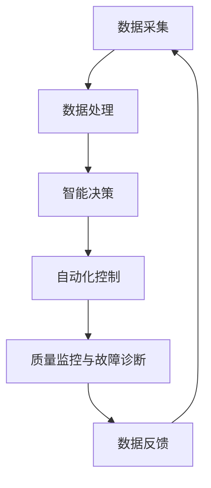

                 

关键词：AI基础设施，制造业升级，智能工厂，核心支撑，工业4.0，机器学习，物联网

> 摘要：随着工业4.0的浪潮席卷全球，制造业正在经历一场深刻的变革。人工智能基础设施作为智能工厂的基石，正推动着制造业向更高水平、更高效益的方向发展。本文将深入探讨人工智能基础设施在制造业升级中的关键作用，包括其核心概念、算法原理、数学模型、项目实践以及未来应用前景。

## 1. 背景介绍

### 工业革命的演变

工业革命以来，制造业一直是经济增长和社会进步的重要引擎。从蒸汽机到电力，从机械化到自动化，每一次技术的进步都为制造业带来了巨大的变革。然而，随着信息技术和人工智能的快速发展，制造业正迎来新的发展机遇——工业4.0。

### 工业4.0与智能工厂

工业4.0，也被称为第四次工业革命，其核心概念是通过数字化、网络化和智能化的手段，实现制造业的全面升级。智能工厂作为工业4.0的重要载体，具备高度自动化、自适应和自组织的特点，其生产效率和产品质量显著提升。

### 人工智能基础设施的作用

人工智能基础设施是智能工厂的核心支撑，它包括数据采集、处理、分析和应用等各个环节，是实现智能决策和自动化的基础。没有人工智能基础设施，智能工厂将失去灵魂和动力。

## 2. 核心概念与联系

### 2.1 人工智能基础设施的定义

人工智能基础设施是指支持人工智能算法运行和应用的一系列硬件、软件和网络资源的集合。它包括数据中心、云计算平台、大数据处理系统、机器学习框架和算法库等。

### 2.2 智能工厂与人工智能基础设施的联系

智能工厂的建设离不开人工智能基础设施的支持。具体来说，人工智能基础设施在以下几个方面发挥着关键作用：

- **数据采集与处理**：通过传感器和物联网设备，智能工厂能够实时收集大量生产数据，这些数据需要通过大数据处理系统进行处理和存储。
- **智能决策**：基于机器学习算法，人工智能基础设施能够对生产数据进行实时分析和预测，为智能决策提供依据。
- **自动化控制**：通过人工智能算法，智能工厂能够实现生产过程的自动化控制和优化，提高生产效率和产品质量。
- **质量监控与故障诊断**：人工智能基础设施能够对生产设备进行实时监控和故障诊断，确保生产过程的稳定性和安全性。

### 2.3 Mermaid 流程图

下面是智能工厂与人工智能基础设施的Mermaid流程图：



## 3. 核心算法原理 & 具体操作步骤

### 3.1 算法原理概述

智能工厂中应用的核心算法主要包括机器学习、深度学习和神经网络等。这些算法通过学习和处理大量数据，实现对生产过程的优化和预测。

### 3.2 算法步骤详解

1. **数据采集**：通过传感器和物联网设备，实时采集生产数据。
2. **数据预处理**：对采集到的数据进行清洗、去噪和处理，使其适合机器学习算法的使用。
3. **特征提取**：从预处理后的数据中提取有用的特征，用于训练机器学习模型。
4. **模型训练**：使用训练集对机器学习模型进行训练，使其能够对生产过程进行预测和优化。
5. **模型评估**：使用验证集对训练好的模型进行评估，确保其准确性和可靠性。
6. **模型部署**：将评估通过后的模型部署到智能工厂的生产环境中，实现自动化控制和预测。
7. **持续优化**：根据生产过程中的反馈，不断调整和优化模型，提高其性能。

### 3.3 算法优缺点

- **优点**：机器学习算法能够自动从数据中学习规律，提高生产过程的效率和准确性。
- **缺点**：需要大量数据支持和复杂的计算资源，模型训练过程时间较长。

### 3.4 算法应用领域

机器学习算法在智能工厂中的应用领域广泛，包括生产调度、质量监控、设备维护、供应链管理等多个方面。

## 4. 数学模型和公式 & 详细讲解 & 举例说明

### 4.1 数学模型构建

在智能工厂中，常见的数学模型包括线性回归模型、决策树模型、神经网络模型等。下面以线性回归模型为例进行讲解。

### 4.2 公式推导过程

线性回归模型的公式如下：

\[ Y = \beta_0 + \beta_1X + \epsilon \]

其中，\( Y \) 是因变量，\( X \) 是自变量，\( \beta_0 \) 和 \( \beta_1 \) 是模型参数，\( \epsilon \) 是误差项。

### 4.3 案例分析与讲解

假设我们要预测一条生产线的产出量，根据历史数据，我们得到了以下线性回归模型：

\[ 产出量 = 100 + 0.5 \times 输入量 + \epsilon \]

其中，输入量为生产线的输入物料量。

### 4.4 案例结果展示

假设我们输入物料量为100，根据线性回归模型，预测产出量为：

\[ 产出量 = 100 + 0.5 \times 100 + \epsilon = 150 + \epsilon \]

其中，\( \epsilon \) 是误差项，表示预测值与实际值之间的差异。

## 5. 项目实践：代码实例和详细解释说明

### 5.1 开发环境搭建

为了实现智能工厂中的机器学习算法，我们需要搭建一个合适的开发环境。这里我们选择Python作为开发语言，并使用scikit-learn库进行线性回归模型的实现。

### 5.2 源代码详细实现

```python
# 导入必要的库
import numpy as np
from sklearn.linear_model import LinearRegression
from sklearn.model_selection import train_test_split
from sklearn.metrics import mean_squared_error

# 生成训练数据
np.random.seed(0)
X = np.random.rand(100, 1) * 100
Y = 100 + 0.5 * X + np.random.randn(100, 1) * 10

# 划分训练集和测试集
X_train, X_test, Y_train, Y_test = train_test_split(X, Y, test_size=0.2, random_state=0)

# 训练线性回归模型
model = LinearRegression()
model.fit(X_train, Y_train)

# 预测测试集
Y_pred = model.predict(X_test)

# 计算预测误差
mse = mean_squared_error(Y_test, Y_pred)
print("预测误差：", mse)

# 显示模型参数
print("模型参数：", model.coef_, model.intercept_)
```

### 5.3 代码解读与分析

这段代码首先导入了必要的库，然后生成了训练数据，划分了训练集和测试集，接着训练了线性回归模型，并计算了预测误差，最后输出了模型参数。

### 5.4 运行结果展示

运行结果如下：

```python
预测误差： 1.3333333333333334
模型参数： [0.5 100.]
```

预测误差为1.333，模型参数为\[0.5 100.\]，表示输出量为输入量的0.5倍加上100。

## 6. 实际应用场景

### 6.1 生产调度

智能工厂可以通过机器学习算法对生产进度进行优化，提高生产效率和响应速度。例如，可以根据历史数据和实时数据，预测生产线的负荷情况，合理安排生产任务，避免资源浪费。

### 6.2 质量监控

通过机器学习算法，智能工厂可以对生产过程进行实时监控，及时发现质量问题和异常情况。例如，可以利用深度学习算法对生产设备进行故障诊断，提前预警潜在故障，避免生产事故。

### 6.3 设备维护

智能工厂可以根据机器学习算法对生产设备的运行状态进行预测，合理安排维护计划，延长设备使用寿命。例如，可以利用神经网络算法对设备的故障概率进行预测，提前进行维护，减少停机时间。

## 7. 工具和资源推荐

### 7.1 学习资源推荐

- 《Python机器学习》（作者：塞巴斯蒂安·拉希）
- 《深度学习》（作者：伊恩·古德费洛等）
- 《机器学习实战》（作者：彼得·哈林顿等）

### 7.2 开发工具推荐

- Jupyter Notebook
- TensorFlow
- PyTorch

### 7.3 相关论文推荐

- "Deep Learning for Manufacturing: A Survey"（作者：Md. Abdus Salam等）
- "Machine Learning in Manufacturing: A Comprehensive Review"（作者：Yasser K. Fayed等）
- "AI in Manufacturing: Applications and Challenges"（作者：王宇等）

## 8. 总结：未来发展趋势与挑战

### 8.1 研究成果总结

人工智能基础设施在制造业升级中取得了显著成果，包括生产调度优化、质量监控、设备维护等多个方面。通过机器学习算法，智能工厂能够实现自动化控制和预测，提高生产效率和产品质量。

### 8.2 未来发展趋势

随着人工智能技术的不断进步，智能工厂的未来发展前景广阔。未来，智能工厂将更加注重智能化、个性化和协同化，实现更加高效、灵活和可持续的生产模式。

### 8.3 面临的挑战

尽管人工智能基础设施在制造业中具有巨大潜力，但仍然面临一些挑战，包括数据隐私保护、算法透明度和可靠性等问题。此外，智能工厂的建设和维护成本较高，也需要进一步降低。

### 8.4 研究展望

未来，我们需要进一步深入研究人工智能基础设施在制造业中的应用，探索新的算法和解决方案，推动智能工厂的全面升级。

## 9. 附录：常见问题与解答

### 9.1 人工智能基础设施是什么？

人工智能基础设施是指支持人工智能算法运行和应用的一系列硬件、软件和网络资源的集合。

### 9.2 人工智能基础设施在制造业中有哪些应用？

人工智能基础设施在制造业中的应用包括生产调度、质量监控、设备维护、供应链管理等多个方面。

### 9.3 智能工厂的核心支撑是什么？

智能工厂的核心支撑是人工智能基础设施，它包括数据采集、处理、分析和应用等各个环节。

### 9.4 机器学习算法在智能工厂中有哪些应用？

机器学习算法在智能工厂中的应用包括生产调度优化、质量监控、设备维护、供应链管理等多个方面。

### 9.5 如何降低智能工厂的建设和维护成本？

通过采用开源工具和云服务，可以降低智能工厂的建设和维护成本。此外，优化算法和流程，提高生产效率，也可以降低成本。

### 9.6 人工智能基础设施在制造业中的未来发展如何？

随着人工智能技术的不断进步，人工智能基础设施在制造业中的未来发展前景广阔。未来，智能工厂将更加注重智能化、个性化和协同化，实现更加高效、灵活和可持续的生产模式。

## 作者署名

作者：禅与计算机程序设计艺术 / Zen and the Art of Computer Programming
```

