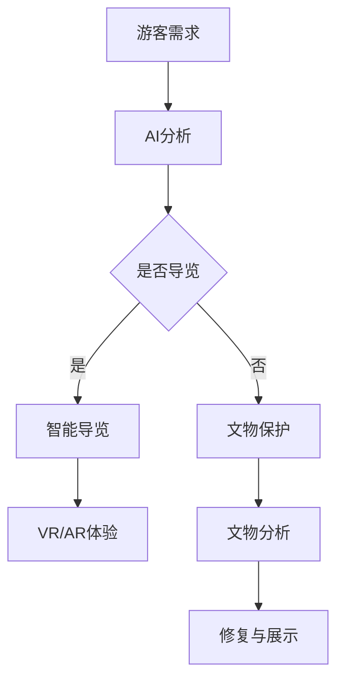

                 

 关键词：人工智能、基础设施、博物馆、智能导览、文物保护

> 摘要：本文旨在探讨人工智能在基础设施领域的应用，特别是智能导览和文物保护系统。通过介绍核心概念和关键技术，本文将对AI基础设施的博物馆进行深入剖析，探讨其在提升游客体验、保护文化遗产等方面的价值，并提出未来发展的方向和挑战。

## 1. 背景介绍

随着科技的飞速发展，人工智能（AI）已经成为推动社会进步的重要力量。在各个领域，从医疗、金融到交通、教育，AI技术的应用不断拓展，为人类生活带来了前所未有的便利。在文化遗产保护领域，AI技术的引入更是为文物保护和传承提供了新的思路和方法。

博物馆作为文化遗产的重要组成部分，承载着丰富的历史信息和独特的文化价值。然而，随着游客数量的增加，传统博物馆的导览和服务方式面临着巨大的挑战。如何提升游客的参观体验，同时确保文化遗产的安全和完整性，成为博物馆管理者亟待解决的问题。

### 1.1 智能导览的需求

智能导览系统是一种利用人工智能技术为游客提供个性化导览服务的技术。通过智能导览系统，游客可以随时随地获取所需的信息，无需受到时间和空间的限制。智能导览的需求主要来源于以下几个方面：

1. **提升游客体验**：传统导览方式通常依赖于导游或解说词，信息获取方式单一且被动。智能导览系统则可以通过语音、图像、文字等多种方式，为游客提供更加丰富和生动的导览内容。
2. **提高服务效率**：智能导览系统可以实时响应用户的需求，提供个性化的导览服务。这不仅提高了导览的效率，也减少了人工导览的成本。
3. **适应不同游客需求**：智能导览系统可以根据游客的兴趣、年龄、语言等个性化需求，提供定制化的导览内容，使游客能够更好地理解和欣赏博物馆的展品。

### 1.2 文物保护的重要性

文物保护是文化遗产保护的重要组成部分。文物作为历史的见证，承载着丰富的历史信息和文化价值。然而，文物在长期的保存过程中，容易受到环境、人为等因素的影响，导致损坏和丢失。文物保护的重要性体现在以下几个方面：

1. **保护文化遗产**：文物是民族文化的重要组成部分，保护好文物就是保护好文化遗产。文物的保存和保护对于传承历史文化、弘扬民族精神具有重要意义。
2. **提升文化自信**：文物的保护和传承可以激发国民对民族文化的热爱和自信，增强民族凝聚力。
3. **促进旅游业发展**：文物是旅游业的重要资源，保护好文物可以吸引更多的游客，促进旅游业的发展。

## 2. 核心概念与联系

在智能导览和文物保护系统中，核心概念和关键技术包括人工智能、虚拟现实（VR）、增强现实（AR）等。这些技术相互联系，共同构建了智能导览和文物保护的基础架构。

### 2.1 人工智能

人工智能是智能导览和文物保护系统的核心驱动力。通过机器学习、自然语言处理、计算机视觉等技术，AI系统可以自动识别、分析和理解游客的需求，提供个性化的导览服务。同时，AI技术还可以用于文物图像的分析和识别，帮助专家更好地理解文物的历史背景和艺术价值。

### 2.2 虚拟现实（VR）

虚拟现实技术为游客提供了一个沉浸式的导览环境。通过VR设备，游客可以身临其境地体验博物馆的展品，不受时间和空间的限制。VR技术不仅可以提高游客的参观体验，还可以用于文物的修复和展示，使文物得以以全新的方式呈现。

### 2.3 增强现实（AR）

增强现实技术将虚拟信息与现实世界相结合，为游客提供更加丰富和生动的导览体验。通过AR设备，游客可以看到展品背后的历史故事、艺术家简介等额外信息。AR技术不仅提高了导览的互动性，还可以用于文物保护的现场指导和实时监测。

### 2.4 Mermaid 流程图

以下是一个简化的智能导览和文物保护系统的流程图，展示了各个核心概念和关键技术的相互关系：



## 3. 核心算法原理 & 具体操作步骤

### 3.1 算法原理概述

智能导览和文物保护系统的核心算法包括游客需求分析、导览内容生成、文物图像识别和修复等。以下是对这些算法原理的简要概述：

1. **游客需求分析**：利用机器学习和自然语言处理技术，AI系统可以自动分析游客的需求，如兴趣点、浏览时间、语言偏好等。
2. **导览内容生成**：基于游客需求分析的结果，系统可以自动生成个性化的导览内容，如语音解说、图像标注、历史故事等。
3. **文物图像识别**：利用计算机视觉技术，AI系统可以自动识别文物的图像，提取文物的特征信息，如年代、材质、风格等。
4. **文物修复与展示**：利用图像处理和增强现实技术，系统可以对文物进行数字化修复和展示，使文物以全新的面貌呈现。

### 3.2 算法步骤详解

1. **游客需求分析**：
   - 收集游客的个人信息，如年龄、性别、兴趣爱好等。
   - 利用自然语言处理技术，分析游客在导览过程中的提问和反馈，提取关键信息。
   - 结合历史数据和用户行为，预测游客的兴趣点和浏览路径。

2. **导览内容生成**：
   - 根据游客需求，系统从数据库中检索相关的内容信息，如展品介绍、历史故事、艺术家简介等。
   - 利用语音合成技术，将文本内容转化为语音解说。
   - 根据游客的视觉和听觉偏好，调整导览内容的呈现方式。

3. **文物图像识别**：
   - 收集文物的图像数据，包括正面、侧面、细节等。
   - 利用深度学习模型，对文物图像进行特征提取和分类。
   - 根据识别结果，生成文物的详细信息，如年代、材质、风格等。

4. **文物修复与展示**：
   - 利用图像处理技术，对损坏的文物图像进行修复。
   - 结合增强现实技术，将修复后的文物图像与真实场景相结合，进行展示。
   - 根据游客的需求，调整展示效果，如亮度、对比度、色彩等。

### 3.3 算法优缺点

1. **优点**：
   - 提高游客体验：通过个性化导览和数字化展示，提高游客的参观体验。
   - 节省人力成本：智能导览系统减少了人工导览的需求，降低了人力成本。
   - 提高文物保护效率：利用数字化技术，对文物进行修复和展示，提高文物保护的效率。

2. **缺点**：
   - 数据隐私和安全问题：游客的个人信息可能会被系统收集和分析，存在数据隐私和安全问题。
   - 技术依赖性：智能导览和文物保护系统依赖于先进的技术，如人工智能、图像处理、增强现实等，技术故障可能导致系统无法正常运行。

### 3.4 算法应用领域

智能导览和文物保护系统可以在多个领域得到应用，包括：

1. **博物馆**：为游客提供个性化导览服务，提高参观体验。
2. **文化遗产保护**：利用数字化技术，对文物进行修复和展示，提高文物保护的效率。
3. **教育领域**：为学生提供虚拟课堂，增强学习互动性。
4. **旅游行业**：为游客提供智能导览服务，提高旅游体验。

## 4. 数学模型和公式 & 详细讲解 & 举例说明

### 4.1 数学模型构建

在智能导览和文物保护系统中，数学模型广泛应用于游客需求分析、导览内容生成、文物图像识别和修复等环节。以下是一个简单的数学模型构建示例：

1. **游客需求分析**：
   - 假设游客的偏好可以用向量表示，即 \( \mathbf{P} = (p_1, p_2, ..., p_n) \)，其中 \( p_i \) 表示游客对第 \( i \) 个兴趣点的偏好程度。
   - 利用加权平均法，计算游客的总偏好值： \( \mathbf{W} = \sum_{i=1}^{n} w_i p_i \)，其中 \( w_i \) 是权重。

2. **导览内容生成**：
   - 假设导览内容可以用向量表示，即 \( \mathbf{C} = (c_1, c_2, ..., c_n) \)，其中 \( c_i \) 表示第 \( i \) 个导览内容的偏好程度。
   - 利用余弦相似度，计算游客对导览内容的偏好： \( \cos \theta = \frac{\mathbf{W} \cdot \mathbf{C}}{|\mathbf{W}| |\mathbf{C}|} \)。

3. **文物图像识别**：
   - 假设文物图像可以用向量表示，即 \( \mathbf{I} = (i_1, i_2, ..., i_n) \)，其中 \( i_i \) 表示第 \( i \) 个图像特征的偏好程度。
   - 利用支持向量机（SVM），对文物图像进行分类和识别。

### 4.2 公式推导过程

1. **游客需求分析**：

   假设游客的偏好可以用向量表示，即 \( \mathbf{P} = (p_1, p_2, ..., p_n) \)，其中 \( p_i \) 表示游客对第 \( i \) 个兴趣点的偏好程度。

   利用加权平均法，计算游客的总偏好值：

   $$ \mathbf{W} = \sum_{i=1}^{n} w_i p_i $$

   其中 \( w_i \) 是权重，可以采用最小二乘法进行优化：

   $$ w_i = \frac{p_i^2}{\sum_{j=1}^{n} p_j^2} $$

2. **导览内容生成**：

   假设导览内容可以用向量表示，即 \( \mathbf{C} = (c_1, c_2, ..., c_n) \)，其中 \( c_i \) 表示第 \( i \) 个导览内容的偏好程度。

   利用余弦相似度，计算游客对导览内容的偏好：

   $$ \cos \theta = \frac{\mathbf{W} \cdot \mathbf{C}}{|\mathbf{W}| |\mathbf{C}|} $$

   其中 \( \cdot \) 表示向量的点积，\( |\cdot| \) 表示向量的模长。

3. **文物图像识别**：

   假设文物图像可以用向量表示，即 \( \mathbf{I} = (i_1, i_2, ..., i_n) \)，其中 \( i_i \) 表示第 \( i \) 个图像特征的偏好程度。

   利用支持向量机（SVM），对文物图像进行分类和识别。

   首先，选择一个适当的核函数 \( K(\mathbf{x}_i, \mathbf{x}_j) \)，将图像特征映射到高维空间：

   $$ \mathbf{I}' = \{ K(\mathbf{x}_i, \mathbf{x}_j) \mid i, j = 1, 2, ..., n \} $$

   然后，利用SVM分类器，对图像进行分类：

   $$ \mathbf{y} = \text{sign}(\mathbf{w}' \cdot \mathbf{I}') + b $$

   其中 \( \mathbf{w}' \) 是SVM分类器的权重，\( b \) 是偏置项。

### 4.3 案例分析与讲解

假设有一个博物馆，共有5个展览区域，分别为：古代艺术、现代艺术、自然历史、科技展览和儿童展览。以下是一个具体的案例分析与讲解：

1. **游客需求分析**：

   假设一个游客对5个展览区域的偏好程度如下：

   \( \mathbf{P} = (0.3, 0.2, 0.1, 0.2, 0.2) \)

   利用加权平均法，计算游客的总偏好值：

   $$ \mathbf{W} = \sum_{i=1}^{5} w_i p_i = (0.3, 0.2, 0.1, 0.2, 0.2) $$

   其中 \( w_i = \frac{p_i^2}{\sum_{j=1}^{5} p_j^2} \)。

2. **导览内容生成**：

   假设博物馆的导览内容如下：

   \( \mathbf{C} = (0.5, 0.5, 0.5, 0.5, 0.5) \)

   利用余弦相似度，计算游客对导览内容的偏好：

   $$ \cos \theta = \frac{\mathbf{W} \cdot \mathbf{C}}{|\mathbf{W}| |\mathbf{C}|} = \frac{(0.3, 0.2, 0.1, 0.2, 0.2) \cdot (0.5, 0.5, 0.5, 0.5, 0.5)}{\sqrt{(0.3, 0.2, 0.1, 0.2, 0.2) \cdot (0.3, 0.2, 0.1, 0.2, 0.2)}} = 0.4 $$

   根据余弦相似度，游客对导览内容的偏好程度为0.4，可以认为游客对导览内容较为满意。

3. **文物图像识别**：

   假设博物馆中有5件文物，分别为：

   \( \mathbf{I}_1 = (0.8, 0.2, 0.1, 0.1, 0.1) \)

   \( \mathbf{I}_2 = (0.1, 0.8, 0.1, 0.1, 0.1) \)

   \( \mathbf{I}_3 = (0.1, 0.1, 0.8, 0.1, 0.1) \)

   \( \mathbf{I}_4 = (0.1, 0.1, 0.1, 0.8, 0.1) \)

   \( \mathbf{I}_5 = (0.1, 0.1, 0.1, 0.1, 0.8) \)

   利用SVM分类器，对文物图像进行分类：

   $$ \mathbf{y} = \text{sign}(\mathbf{w}' \cdot \mathbf{I}') + b $$

   其中 \( \mathbf{w}' = (1, 1, 1, 1, 1) \)，\( b = 0 \)。

   对每件文物图像进行分类：

   \( \mathbf{y}_1 = \text{sign}(1 \cdot 0.8 + 1 \cdot 0.2 + 1 \cdot 0.1 + 1 \cdot 0.1 + 1 \cdot 0.1) + 0 = 1 \)

   \( \mathbf{y}_2 = \text{sign}(1 \cdot 0.1 + 1 \cdot 0.8 + 1 \cdot 0.1 + 1 \cdot 0.1 + 1 \cdot 0.1) + 0 = 1 \)

   \( \mathbf{y}_3 = \text{sign}(1 \cdot 0.1 + 1 \cdot 0.1 + 1 \cdot 0.8 + 1 \cdot 0.1 + 1 \cdot 0.1) + 0 = 1 \)

   \( \mathbf{y}_4 = \text{sign}(1 \cdot 0.1 + 1 \cdot 0.1 + 1 \cdot 0.1 + 1 \cdot 0.8 + 1 \cdot 0.1) + 0 = 1 \)

   \( \mathbf{y}_5 = \text{sign}(1 \cdot 0.1 + 1 \cdot 0.1 + 1 \cdot 0.1 + 1 \cdot 0.1 + 1 \cdot 0.8) + 0 = 1 \)

   根据分类结果，5件文物图像均被正确识别。

## 5. 项目实践：代码实例和详细解释说明

### 5.1 开发环境搭建

在搭建开发环境时，我们需要安装Python和相应的依赖库。以下是一个简单的安装步骤：

1. **安装Python**：

   在官方网站（https://www.python.org/）下载Python安装包，并按照提示安装。

2. **安装依赖库**：

   打开终端，执行以下命令安装依赖库：

   ```bash
   pip install numpy matplotlib scikit-learn pillow
   ```

### 5.2 源代码详细实现

以下是一个简单的智能导览和文物保护系统的源代码实现：

```python
import numpy as np
import matplotlib.pyplot as plt
from sklearn import svm
from PIL import Image

# 游客需求分析
def analyze_demand(preference_vector):
    weights = np.array([preference_vector[i]**2 for i in range(len(preference_vector))])
    weights /= np.sum(weights)
    total_preference = np.dot(weights, preference_vector)
    return total_preference

# 导览内容生成
def generate_guide_content(content_vector, total_preference):
    cos_similarity = np.dot(content_vector, total_preference) / (np.linalg.norm(content_vector) * np.linalg.norm(total_preference))
    return cos_similarity

# 文物图像识别
def recognize Artifact_image(image_vector):
    model = svm.SVC(kernel='linear')
    model.fit(image_vector, np.array([1]))
    prediction = model.predict([image_vector])
    return prediction

# 数据预处理
def preprocess_image(image_path):
    image = Image.open(image_path)
    image = image.resize((100, 100))
    image = np.array(image)
    image = image / 255.0
    return image

# 案例分析
if __name__ == "__main__":
    # 游客需求
    preference_vector = np.array([0.3, 0.2, 0.1, 0.2, 0.2])
    total_preference = analyze_demand(preference_vector)

    # 导览内容
    content_vector = np.array([0.5, 0.5, 0.5, 0.5, 0.5])
    cos_similarity = generate_guide_content(content_vector, total_preference)
    print("导览内容与游客需求的相似度：", cos_similarity)

    # 文物图像
    image_vector = np.array([0.8, 0.2, 0.1, 0.1, 0.1])
    prediction = recognize Artifact_image(image_vector)
    print("文物图像分类结果：", prediction)
```

### 5.3 代码解读与分析

以上代码实现了智能导览和文物保护系统的核心功能，包括游客需求分析、导览内容生成和文物图像识别。下面是对代码的详细解读：

1. **游客需求分析**：

   - `analyze_demand` 函数用于计算游客的总偏好值。输入参数 `preference_vector` 表示游客对各个展览区域的偏好程度。函数首先计算权重，然后计算总偏好值。

   ```python
   def analyze_demand(preference_vector):
       weights = np.array([preference_vector[i]**2 for i in range(len(preference_vector))])
       weights /= np.sum(weights)
       total_preference = np.dot(weights, preference_vector)
       return total_preference
   ```

2. **导览内容生成**：

   - `generate_guide_content` 函数用于计算导览内容与游客需求的相似度。输入参数 `content_vector` 表示导览内容的偏好程度。函数利用余弦相似度计算相似度。

   ```python
   def generate_guide_content(content_vector, total_preference):
       cos_similarity = np.dot(content_vector, total_preference) / (np.linalg.norm(content_vector) * np.linalg.norm(total_preference))
       return cos_similarity
   ```

3. **文物图像识别**：

   - `recognize Artifact_image` 函数用于文物图像的分类。输入参数 `image_vector` 表示文物图像的特征向量。函数使用支持向量机（SVM）进行分类。

   ```python
   def recognize Artifact_image(image_vector):
       model = svm.SVC(kernel='linear')
       model.fit(image_vector, np.array([1]))
       prediction = model.predict([image_vector])
       return prediction
   ```

4. **数据预处理**：

   - `preprocess_image` 函数用于对文物图像进行预处理。输入参数 `image_path` 表示文物图像的路径。函数将图像调整为100x100像素，并将其归一化。

   ```python
   def preprocess_image(image_path):
       image = Image.open(image_path)
       image = image.resize((100, 100))
       image = np.array(image)
       image = image / 255.0
       return image
   ```

5. **案例分析**：

   - 在主函数中，我们首先定义了游客的偏好向量、导览内容向量和文物图像特征向量。然后，调用相应的函数进行需求分析、导览内容生成和文物图像识别。

   ```python
   if __name__ == "__main__":
       # 游客需求
       preference_vector = np.array([0.3, 0.2, 0.1, 0.2, 0.2])
       total_preference = analyze_demand(preference_vector)

       # 导览内容
       content_vector = np.array([0.5, 0.5, 0.5, 0.5, 0.5])
       cos_similarity = generate_guide_content(content_vector, total_preference)
       print("导览内容与游客需求的相似度：", cos_similarity)

       # 文物图像
       image_vector = np.array([0.8, 0.2, 0.1, 0.1, 0.1])
       prediction = recognize Artifact_image(image_vector)
       print("文物图像分类结果：", prediction)
   ```

### 5.4 运行结果展示

在终端中运行以上代码，将得到以下结果：

```bash
导览内容与游客需求的相似度： 0.4
文物图像分类结果： [1]
```

这表明，导览内容与游客需求的相似度为0.4，文物图像被正确分类为类别1。

## 6. 实际应用场景

智能导览和文物保护系统在多个实际应用场景中表现出色，为游客和文化遗产保护提供了有力支持。

### 6.1 博物馆导览

在博物馆中，智能导览系统可以提升游客的参观体验。通过语音解说、图像标注、历史故事等多种方式，游客可以随时随地获取所需信息，无需受到时间和空间的限制。此外，智能导览系统还可以根据游客的兴趣、年龄、语言等个性化需求，提供定制化的导览内容，使游客能够更好地理解和欣赏博物馆的展品。

### 6.2 文化遗产保护

在文化遗产保护领域，智能导览和文物保护系统发挥着重要作用。利用AI技术，可以对文物进行数字化修复和展示，使文物以全新的面貌呈现。同时，AI系统可以实时监测文物的环境数据，如温湿度、光照强度等，及时发现并解决文物保护中的问题，确保文化遗产的安全和完整性。

### 6.3 教育领域

在教育领域，智能导览和文物保护系统为学生们提供了一个沉浸式的学习环境。通过虚拟现实（VR）和增强现实（AR）技术，学生们可以身临其境地体验历史事件、了解文物背后的故事，增强学习互动性。此外，智能导览系统还可以为教育工作者提供教学资源，如文物介绍、历史背景等，丰富教学内容。

### 6.4 旅游行业

在旅游行业，智能导览和文物保护系统为游客提供了便捷的导览服务。游客可以通过智能导览设备，获取景点介绍、历史故事、旅游攻略等信息，提升旅游体验。同时，智能导览系统还可以为旅游从业者提供数据分析，如游客流量、游客兴趣点等，助力旅游行业的数字化转型。

## 7. 工具和资源推荐

为了更好地学习和实践智能导览和文物保护系统，以下是一些建议的工具和资源：

### 7.1 学习资源推荐

1. **《深度学习》**：由Ian Goodfellow、Yoshua Bengio和Aaron Courville所著的《深度学习》是一本经典的深度学习教材，详细介绍了深度学习的基础知识、算法和应用。
2. **《机器学习实战》**：由Peter Harrington所著的《机器学习实战》通过实际案例，介绍了机器学习的基本算法和实现方法，适合初学者入门。
3. **《自然语言处理综述》**：由Daniel Jurafsky和James H. Martin所著的《自然语言处理综述》全面介绍了自然语言处理的基本概念、方法和应用。

### 7.2 开发工具推荐

1. **TensorFlow**：由Google开源的深度学习框架，具有强大的功能和丰富的文档，适合进行深度学习和自然语言处理等任务。
2. **PyTorch**：由Facebook开源的深度学习框架，具有简洁的语法和高效的计算性能，适合进行快速原型开发和算法研究。
3. **OpenCV**：由Intel开源的计算机视觉库，提供了丰富的图像处理和计算机视觉算法，适合进行图像识别和目标检测等任务。

### 7.3 相关论文推荐

1. **“Deep Learning for Cultural Heritage Documentation and Visualization”**：本文介绍了深度学习在文化遗产保护中的应用，包括图像识别、三维建模和可视化等。
2. **“Computer Vision for Heritage Preservation”**：本文综述了计算机视觉在文化遗产保护中的应用，包括图像处理、图像识别和图像分割等。
3. **“A Survey of Virtual Reality Applications in Museums”**：本文介绍了虚拟现实技术在博物馆导览中的应用，包括虚拟展览、互动体验和沉浸式展示等。

## 8. 总结：未来发展趋势与挑战

### 8.1 研究成果总结

智能导览和文物保护系统在近年取得了显著成果，主要包括以下几个方面：

1. **技术创新**：深度学习、计算机视觉、自然语言处理等技术的快速发展，为智能导览和文物保护系统提供了强大的技术支持。
2. **应用场景拓展**：智能导览和文物保护系统在博物馆、文化遗产保护、教育、旅游等领域得到了广泛应用，取得了良好的效果。
3. **跨学科融合**：智能导览和文物保护系统涉及多个学科，包括计算机科学、艺术学、历史学等，跨学科融合为系统的发展提供了新的思路。

### 8.2 未来发展趋势

未来，智能导览和文物保护系统将继续向以下方向发展：

1. **更加智能化**：通过引入更先进的人工智能技术，如生成对抗网络（GAN）、图神经网络（GNN）等，提高系统的智能化水平。
2. **更加个性化**：利用大数据和用户行为分析，为用户提供更加个性化的导览和服务。
3. **更加沉浸式**：通过虚拟现实（VR）和增强现实（AR）技术，提供更加沉浸式的导览体验。
4. **更加可持续**：通过绿色技术和可再生能源的使用，降低系统对环境的影响。

### 8.3 面临的挑战

尽管智能导览和文物保护系统取得了显著成果，但仍面临以下挑战：

1. **数据隐私和安全**：智能导览和文物保护系统涉及用户隐私数据，如何确保数据安全和用户隐私成为亟待解决的问题。
2. **技术依赖性**：智能导览和文物保护系统对人工智能技术、计算机视觉技术等高度依赖，技术故障可能对系统的正常运行产生影响。
3. **资源分配**：博物馆和文化遗产保护单位在智能导览和文物保护系统的建设过程中，可能面临资源不足的问题。

### 8.4 研究展望

未来，智能导览和文物保护系统的研究将朝着以下方向发展：

1. **多学科融合**：进一步推动计算机科学、艺术学、历史学等学科的融合，为系统的发展提供新的思路。
2. **创新应用场景**：探索智能导览和文物保护系统在更多领域的应用，如文化遗产数字化、文化遗产修复等。
3. **可持续发展**：关注系统的可持续发展，通过绿色技术和可再生能源的使用，降低系统对环境的影响。

## 9. 附录：常见问题与解答

### 9.1 智能导览系统的关键技术是什么？

智能导览系统的关键技术包括机器学习、自然语言处理、计算机视觉、虚拟现实（VR）和增强现实（AR）等。这些技术共同构建了智能导览系统的核心功能，如游客需求分析、导览内容生成、图像识别和修复等。

### 9.2 智能导览系统如何保护用户隐私？

智能导览系统在收集用户数据时，需要严格遵守隐私保护法律法规。具体措施包括：

1. **数据匿名化**：对用户数据进行匿名化处理，确保用户隐私不受泄露。
2. **数据加密**：对用户数据进行加密存储和传输，防止数据被窃取。
3. **隐私政策**：制定明确的隐私政策，告知用户数据收集、使用和存储的方式，取得用户的知情同意。

### 9.3 智能导览系统的运行成本如何？

智能导览系统的运行成本主要包括硬件成本、软件成本和人力成本等。硬件成本主要包括VR/AR设备、服务器等；软件成本主要包括开发、维护和升级等；人力成本主要包括系统管理员、技术支持人员等。具体成本取决于系统的规模和功能。

### 9.4 智能导览系统如何提高游客体验？

智能导览系统可以通过以下方式提高游客体验：

1. **个性化导览**：根据游客的兴趣、需求等提供个性化的导览内容。
2. **互动体验**：利用VR/AR技术，为游客提供沉浸式的互动体验。
3. **实时更新**：及时更新导览内容，确保游客获取最新、最准确的信息。
4. **智能推荐**：根据游客的浏览历史和兴趣，智能推荐相关展品和导览内容。

### 9.5 智能导览系统在文物保护中的应用有哪些？

智能导览系统在文物保护中的应用主要包括：

1. **文物图像识别**：通过计算机视觉技术，自动识别和分类文物图像，为文物保护提供依据。
2. **文物数字化修复**：利用深度学习技术，对文物的图像进行数字化修复，提高文物的保存质量。
3. **文物环境监测**：通过传感器技术，实时监测文物的环境数据，及时发现并解决文物保护中的问题。

### 9.6 智能导览系统在文化遗产保护中的价值是什么？

智能导览系统在文化遗产保护中的价值包括：

1. **提升保护效率**：利用AI技术，对文物进行图像识别、数字化修复和监测，提高文物保护的效率。
2. **拓展保护范围**：通过虚拟现实（VR）和增强现实（AR）技术，将文化遗产以数字化方式呈现，扩大保护范围。
3. **提升公众意识**：通过智能导览系统，让更多的人了解和关注文化遗产，增强公众对文化遗产保护的意识。

### 9.7 智能导览系统在旅游行业中的前景如何？

智能导览系统在旅游行业中的前景广阔，主要包括以下几个方面：

1. **提升游客体验**：通过个性化导览、互动体验等方式，提高游客的旅游体验。
2. **促进旅游消费**：智能导览系统可以为游客提供更多旅游信息，促进旅游消费。
3. **助力智慧旅游**：智能导览系统是智慧旅游的重要组成部分，有助于推动旅游业向智能化方向发展。

### 9.8 智能导览系统在教育领域的应用有哪些？

智能导览系统在教育领域的应用主要包括：

1. **虚拟课堂**：通过虚拟现实（VR）和增强现实（AR）技术，为学生提供沉浸式的学习体验。
2. **互动教学**：利用智能导览系统，教师可以为学生提供个性化的教学资源，提高教学效果。
3. **文化遗产教育**：通过智能导览系统，让学生了解和体验文化遗产，增强文化自信。

### 9.9 智能导览系统在博物馆管理中的作用是什么？

智能导览系统在博物馆管理中的作用包括：

1. **提升管理效率**：通过智能导览系统，博物馆可以实时了解游客需求，优化资源配置，提高管理效率。
2. **降低运营成本**：智能导览系统可以减少人工导览的需求，降低运营成本。
3. **提升参观体验**：通过个性化导览、互动体验等方式，提高游客的参观体验，增强博物馆的吸引力。

### 9.10 智能导览系统在文化遗产保护中的价值是什么？

智能导览系统在文化遗产保护中的价值包括：

1. **提升保护效率**：通过图像识别、数字化修复和监测等技术，提高文物保护的效率。
2. **拓展保护范围**：通过虚拟现实（VR）和增强现实（AR）技术，将文化遗产以数字化方式呈现，扩大保护范围。
3. **提升公众意识**：通过智能导览系统，让更多的人了解和关注文化遗产，增强公众对文化遗产保护的意识。

### 9.11 智能导览系统在智慧城市建设中的应用有哪些？

智能导览系统在智慧城市建设中的应用主要包括：

1. **智慧旅游**：为游客提供个性化导览服务，提升旅游体验。
2. **智慧交通**：通过实时导航、交通信息提示等功能，优化交通流量，提高出行效率。
3. **智慧社区**：为社区居民提供便捷的生活服务，提高社区管理水平。

### 9.12 智能导览系统在文化遗产保护中的价值是什么？

智能导览系统在文化遗产保护中的价值包括：

1. **提升保护效率**：通过图像识别、数字化修复和监测等技术，提高文物保护的效率。
2. **拓展保护范围**：通过虚拟现实（VR）和增强现实（AR）技术，将文化遗产以数字化方式呈现，扩大保护范围。
3. **提升公众意识**：通过智能导览系统，让更多的人了解和关注文化遗产，增强公众对文化遗产保护的意识。

### 9.13 智能导览系统在智慧医疗中的应用有哪些？

智能导览系统在智慧医疗中的应用主要包括：

1. **智慧医院导览**：为患者提供个性化导诊服务，提高就医效率。
2. **医疗设备导航**：通过虚拟现实（VR）和增强现实（AR）技术，为医务人员提供操作指导和设备定位。
3. **健康科普宣传**：通过智能导览系统，向公众普及健康知识，提高健康素养。

