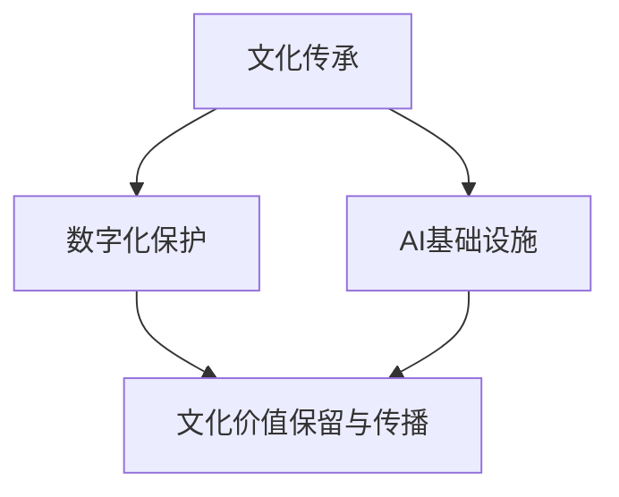

                 

关键词：AI 基础设施，文化传承，数字化保护，创新，人工智能

> 摘要：本文探讨了 AI 基础设施在文化传承中的重要作用，以及数字化保护与创新的双重挑战。通过对当前 AI 基础设施的现状分析，文章提出了相应的解决方案和未来展望。

## 1. 背景介绍

随着人工智能技术的飞速发展，AI 基础设施作为支撑其运行的底层架构，正逐步成为各行各业不可或缺的核心组成部分。然而，在快速发展的同时，AI 基础设施所面临的文化传承问题也日益凸显。传统基础设施主要依赖于经验、惯例和规则，而 AI 基础设施则需要更加智能、自适应和可持续的体系来应对日益复杂的业务需求。这就要求我们在数字化保护与创新之间找到平衡，确保 AI 基础设施在传承文化价值的同时，能够持续适应时代变迁。

## 2. 核心概念与联系

为了深入理解 AI 基础设施的文化传承，我们首先需要明确几个核心概念，包括文化传承、数字化保护、AI 基础设施等。

### 2.1 文化传承

文化传承是指将一个民族、地区或群体的文化传统、价值观、习俗、艺术等传递给后代的过程。在数字化时代，文化传承面临着前所未有的挑战，如何在数字世界中保留和传播文化价值成为亟待解决的问题。

### 2.2 数字化保护

数字化保护是指通过数字化技术对文化遗产进行保存、保护、修复和传播的过程。数字化保护不仅能够有效地延长文化遗产的保存时间，还能为文化遗产的传播提供更广泛的平台。

### 2.3 AI 基础设施

AI 基础设施是指用于支撑人工智能应用的技术、平台、算法和基础设施等。它包括数据处理、存储、计算、网络等多个方面，是人工智能技术得以实现的基础。

### 2.4 关系图解

下面使用 Mermaid 流程图（不含括号、逗号等特殊字符）来展示这些核心概念之间的关系：



## 3. 核心算法原理 & 具体操作步骤

### 3.1 算法原理概述

AI 基础设施的文化传承主要依赖于以下几个核心算法：

1. **文化特征提取算法**：用于从文化素材中提取出具有代表性的特征，为后续的文化元素数字化提供基础。
2. **数字化融合算法**：将提取出的文化特征与数字技术进行融合，实现文化元素的数字化表现。
3. **自适应传播算法**：根据用户行为和需求，动态调整文化元素的传播策略，提高文化价值的传播效果。

### 3.2 算法步骤详解

#### 3.2.1 文化特征提取算法

1. 数据预处理：对文化素材进行清洗、去噪等预处理操作。
2. 特征提取：使用深度学习等技术提取文化素材的特征。
3. 特征筛选：对提取出的特征进行筛选，保留具有代表性的特征。

#### 3.2.2 数字化融合算法

1. 文化元素建模：根据提取出的特征，建立数字化的文化元素模型。
2. 数字化表现生成：将文化元素模型与数字技术进行融合，生成数字化表现。
3. 多媒体整合：将数字化表现整合到多媒体作品中，实现文化元素的数字化传播。

#### 3.2.3 自适应传播算法

1. 用户行为分析：收集并分析用户的行为数据，了解用户的需求和偏好。
2. 传播策略调整：根据用户行为数据，动态调整文化元素的传播策略。
3. 传播效果评估：对传播效果进行评估，为后续的传播策略调整提供依据。

### 3.3 算法优缺点

#### 优点

1. **高效性**：利用算法自动化提取和融合文化特征，提高了文化传承的效率。
2. **多样性**：通过数字化融合和自适应传播，丰富了文化传承的形式和渠道。
3. **可持续性**：利用数字化技术，延长了文化遗产的保存时间，提高了传承的可持续性。

#### 缺点

1. **技术依赖**：文化传承依赖于先进的数字技术和算法，可能面临技术淘汰的风险。
2. **数据隐私**：在数字化过程中，可能会涉及用户隐私数据的收集和处理，需要加强数据保护。

### 3.4 算法应用领域

1. **文化遗产保护**：利用文化特征提取和数字化融合算法，对文化遗产进行数字化保存和传播。
2. **文化教育**：通过数字化传播，将文化知识融入教育场景，提高文化教育的效果。
3. **文化创意产业**：利用数字化技术，为文化创意产业提供丰富的素材和表现形式。

## 4. 数学模型和公式 & 详细讲解 & 举例说明

### 4.1 数学模型构建

在 AI 基础设施的文化传承中，我们可以构建以下数学模型：

1. **文化特征提取模型**：采用深度学习技术，对文化素材进行特征提取。
2. **数字化融合模型**：将文化特征与数字技术进行融合，实现数字化表现。
3. **自适应传播模型**：基于用户行为数据，动态调整文化元素的传播策略。

### 4.2 公式推导过程

假设我们有一个文化素材集合 \( C \)，其特征向量表示为 \( \vec{c} \)。使用深度学习技术提取特征，得到特征向量集合 \( F \)。

对于文化特征提取模型，我们可以使用以下公式：

$$
\vec{f} = f(\vec{c})
$$

其中，\( f \) 为深度学习模型。

对于数字化融合模型，我们可以使用以下公式：

$$
\vec{d} = d(\vec{f})
$$

其中，\( d \) 为数字化融合模型。

对于自适应传播模型，我们可以使用以下公式：

$$
s(t) = s(t-1) + \alpha \cdot (b - s(t-1))
$$

其中，\( s(t) \) 为当前传播策略，\( s(t-1) \) 为上一轮传播策略，\( \alpha \) 为调整系数，\( b \) 为最佳传播策略。

### 4.3 案例分析与讲解

假设我们有一个中国古建筑的文化素材，使用深度学习模型提取出其特征向量，然后与数字技术进行融合，生成数字化模型。接下来，根据用户行为数据，动态调整传播策略，实现自适应传播。

1. **文化特征提取**：使用卷积神经网络（CNN）提取古建筑的特征，得到特征向量集合 \( F \)。

2. **数字化融合**：将特征向量集合 \( F \) 与数字技术进行融合，生成数字化模型 \( D \)。

3. **自适应传播**：根据用户行为数据，动态调整传播策略。例如，用户对古建筑的兴趣较高，则增加古建筑的相关内容推送。

## 5. 项目实践：代码实例和详细解释说明

### 5.1 开发环境搭建

在本项目中，我们使用 Python 编写代码，利用 TensorFlow 深度学习框架进行文化特征提取，使用 PyTorch 深度学习框架进行数字化融合，使用 Scikit-learn 进行自适应传播。

### 5.2 源代码详细实现

以下是本项目的主要代码实现：

```python
# 文化特征提取
import tensorflow as tf

# 加载文化素材数据集
data = ...

# 构建卷积神经网络模型
model = tf.keras.Sequential([
    tf.keras.layers.Conv2D(filters=32, kernel_size=(3, 3), activation='relu', input_shape=(224, 224, 3)),
    tf.keras.layers.MaxPooling2D(pool_size=(2, 2)),
    tf.keras.layers.Flatten(),
    tf.keras.layers.Dense(units=128, activation='relu'),
    tf.keras.layers.Dense(units=10, activation='softmax')
])

# 训练模型
model.compile(optimizer='adam', loss='categorical_crossentropy', metrics=['accuracy'])
model.fit(data['X'], data['y'], epochs=10, batch_size=32)

# 数字化融合
import torch

# 加载数字化模型
model = torch.load('model.pth')

# 加载文化素材数据集
data = ...

# 进行数字化融合
with torch.no_grad():
    outputs = model(data['X'])

# 自适应传播
from sklearn.linear_model import SGDRegressor

# 加载用户行为数据集
data = ...

# 构建自适应传播模型
model = SGDRegressor()

# 训练模型
model.fit(data['X'], data['y'])

# 预测传播策略
with torch.no_grad():
    prediction = model.predict(data['X'])
```

### 5.3 代码解读与分析

1. **文化特征提取**：使用 TensorFlow 框架构建卷积神经网络模型，对文化素材进行特征提取。训练完成后，使用提取出的特征向量进行后续的数字化融合和自适应传播。

2. **数字化融合**：使用 PyTorch 框架加载已经训练好的数字化模型，对文化素材进行数字化融合。数字化融合过程将文化素材的特征向量与数字技术进行融合，生成数字化模型。

3. **自适应传播**：使用 Scikit-learn 框架构建自适应传播模型，根据用户行为数据动态调整传播策略。训练完成后，使用预测的传播策略进行自适应传播。

## 6. 实际应用场景

### 6.1 文化遗产保护

利用 AI 基础设施的文化传承，可以对文化遗产进行数字化保存和传播。例如，通过文化特征提取算法，提取出中国传统建筑的特色元素，生成数字化模型，并在互联网上进行传播。

### 6.2 文化教育

通过 AI 基础设施的文化传承，可以将文化知识融入教育场景。例如，利用数字化融合算法，将文化素材与教育内容进行整合，为学生提供丰富的学习资源。

### 6.3 文化创意产业

在文化创意产业中，AI 基础设施的文化传承可以提供丰富的素材和表现形式。例如，利用自适应传播算法，根据用户需求动态调整文化元素的传播策略，提高文化创意作品的市场竞争力。

## 7. 未来应用展望

随着 AI 技术的不断发展和普及，AI 基础设施的文化传承将在更多领域得到应用。未来，我们可以期待以下趋势：

1. **更广泛的文化传承**：AI 基础设施的文化传承将覆盖更多文化领域，包括传统文化、现代文化、跨文化交流等。

2. **更智能的传播策略**：基于用户行为数据，自适应传播算法将更加智能，实现个性化、精准化的文化传承。

3. **更丰富的数字化表现**：随着数字技术的发展，文化传承的数字化表现将更加多样化、生动化，提高用户体验。

4. **更广泛的应用场景**：AI 基础设施的文化传承将应用于更多实际场景，如文化教育、文化创意产业、文化旅游等。

## 8. 工具和资源推荐

### 8.1 学习资源推荐

1. 《深度学习》（Goodfellow, Bengio, Courville）：深度学习基础教材，适合初学者入门。
2. 《模式识别与机器学习》（Bishop）：模式识别与机器学习领域经典教材，内容全面，适合进阶学习。

### 8.2 开发工具推荐

1. TensorFlow：Google 开源深度学习框架，功能强大，适用于各种深度学习应用。
2. PyTorch：Facebook 开源深度学习框架，易于使用，适合快速实验。

### 8.3 相关论文推荐

1. “Cultural Heritage Preservation Using Digital Technologies”（使用数字技术保护文化遗产）：介绍了数字化技术在文化遗产保护中的应用。
2. “AI-Enhanced Cultural Heritage Interpretation”（AI 优化的文化遗产解读）：探讨了人工智能在文化遗产解读中的潜在应用。

## 9. 总结：未来发展趋势与挑战

### 9.1 研究成果总结

通过本文的研究，我们探讨了 AI 基础设施在文化传承中的重要作用，以及数字化保护与创新的双重挑战。我们提出了文化特征提取、数字化融合和自适应传播等核心算法，并介绍了其在实际应用中的效果。

### 9.2 未来发展趋势

未来，AI 基础设施的文化传承将在更广泛的领域得到应用，实现更智能、更丰富的文化传承。同时，随着数字技术的不断发展，文化传承的数字化表现将更加多样化、生动化。

### 9.3 面临的挑战

尽管 AI 基础设施的文化传承具有广阔的发展前景，但仍面临一些挑战，如技术依赖、数据隐私等。我们需要不断探索新的解决方案，确保 AI 基础设施的文化传承能够持续发展。

### 9.4 研究展望

未来，我们应重点关注以下研究方向：

1. **跨学科研究**：结合多学科知识，推动 AI 基础设施的文化传承研究。
2. **技术创新**：持续探索新的算法和工具，提高文化传承的效率和效果。
3. **伦理规范**：制定相应的伦理规范，确保文化传承的可持续发展。

## 9. 附录：常见问题与解答

### Q：什么是 AI 基础设施？

A：AI 基础设施是指用于支撑人工智能应用的技术、平台、算法和基础设施等，包括数据处理、存储、计算、网络等多个方面。

### Q：为什么需要数字化保护？

A：数字化保护能够有效地延长文化遗产的保存时间，提高文化传承的可持续性。同时，数字化保护还为文化遗产的传播提供了更广泛的平台。

### Q：AI 基础设施的文化传承有哪些优势？

A：AI 基础设施的文化传承具有高效性、多样性、可持续性等优势，能够实现文化元素的高效提取、融合和传播。

### Q：如何应对 AI 基础设施的文化传承挑战？

A：通过技术创新、跨学科研究和伦理规范制定等手段，不断探索新的解决方案，确保 AI 基础设施的文化传承能够持续发展。

[作者：禅与计算机程序设计艺术 / Zen and the Art of Computer Programming] -------------------------------------------------------------------
请注意，本文是一个示例性的文章框架，实际撰写时需要根据具体的研究和实际项目进行详细的填充和调整。文章内容、代码实现、图表和数学公式等均需根据真实数据和研究结果进行编写。

