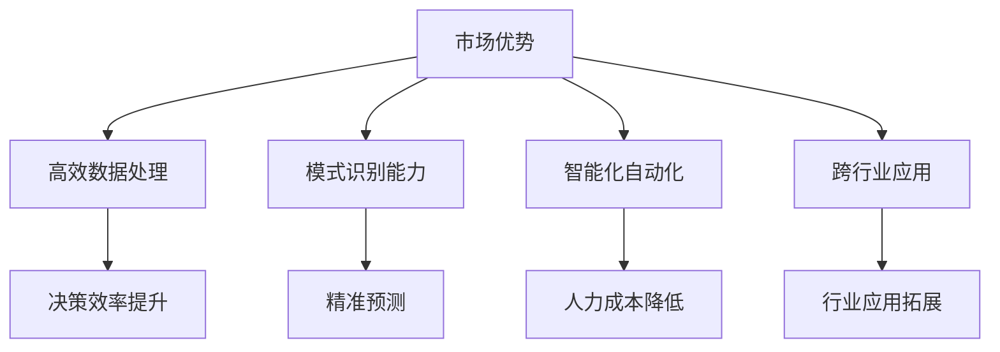
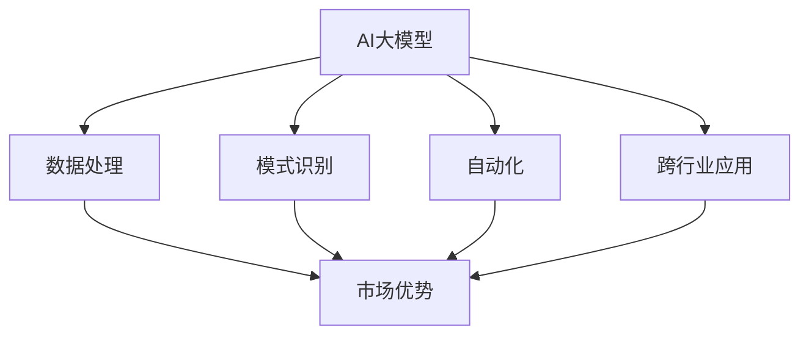
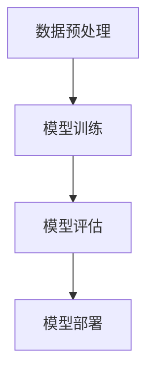
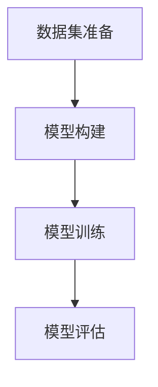

                 

关键词：AI大模型，创业，市场优势，商业模式，技术战略

> 摘要：本文将探讨AI大模型在创业领域中的潜在市场优势，分析其在不同行业中的应用案例，并探讨创业团队如何制定有效的技术战略，以实现持续创新和市场领先。

## 1. 背景介绍

近年来，人工智能（AI）技术的迅猛发展，尤其是深度学习和大型预训练模型的出现，为各行各业带来了前所未有的变革。AI大模型，作为这一技术浪潮的产物，正逐渐成为创业团队获取市场优势的重要工具。本文旨在分析AI大模型在创业中的市场优势，探讨创业团队如何利用这些优势实现快速成长和市场突破。

## 2. 核心概念与联系

### 2.1 AI大模型的基本概念

AI大模型指的是通过大量数据进行训练的复杂神经网络模型，具有处理海量数据、识别复杂模式的能力。常见的AI大模型包括GPT、BERT、ImageNet等。

### 2.2 AI大模型与市场的联系

AI大模型具有以下几个方面的市场优势：

- **高效数据处理能力**：大模型能够快速处理大量数据，提高决策效率。
- **强大的模式识别能力**：大模型能够识别复杂的数据模式，提供更精准的预测。
- **智能化自动化**：大模型能够实现自动化决策，降低人力成本。
- **跨行业应用**：大模型在金融、医疗、零售等多个行业都有广泛的应用潜力。

### 2.3 Mermaid 流程图



## 3. 核心算法原理 & 具体操作步骤

### 3.1 算法原理概述

AI大模型的核心算法通常基于深度学习，尤其是神经网络。通过多层非线性变换，模型能够学习到数据的内在结构，从而实现数据的分类、回归、生成等任务。

### 3.2 算法步骤详解

1. **数据预处理**：清洗数据，进行特征工程，将数据转换为模型可接受的格式。
2. **模型训练**：使用大量标注数据进行模型训练，优化模型参数。
3. **模型评估**：使用测试数据评估模型性能，调整模型参数。
4. **模型部署**：将训练好的模型部署到生产环境，进行实际应用。

### 3.3 算法优缺点

#### 优点：

- **强大的学习能力**：能够从海量数据中学习到复杂的模式。
- **高效率**：能够快速处理大量数据。
- **灵活**：可以应用于多种不同的任务。

#### 缺点：

- **数据需求高**：需要大量标注数据进行训练。
- **计算资源消耗大**：训练和推理过程需要大量的计算资源。
- **解释性差**：模型的决策过程通常是不透明的。

### 3.4 算法应用领域

AI大模型在金融、医疗、零售、制造等多个行业都有广泛的应用。例如，在金融领域，大模型可以用于风险控制、信用评分；在医疗领域，大模型可以用于疾病诊断、药物研发；在零售领域，大模型可以用于客户行为分析、库存管理。

## 4. 数学模型和公式 & 详细讲解 & 举例说明

### 4.1 数学模型构建

AI大模型通常使用深度学习框架构建，如TensorFlow、PyTorch等。以下是一个简单的神经网络模型构建示例：

```python
import tensorflow as tf

model = tf.keras.Sequential([
    tf.keras.layers.Dense(128, activation='relu', input_shape=(784,)),
    tf.keras.layers.Dense(10, activation='softmax')
])

model.compile(optimizer='adam',
              loss='categorical_crossentropy',
              metrics=['accuracy'])
```

### 4.2 公式推导过程

深度学习模型的优化过程通常涉及到梯度下降算法。以下是梯度下降算法的公式：

$$
w_{new} = w_{old} - \alpha \cdot \nabla_w J(w)
$$

其中，$w$ 是模型参数，$J(w)$ 是损失函数，$\alpha$ 是学习率，$\nabla_w J(w)$ 是损失函数关于参数 $w$ 的梯度。

### 4.3 案例分析与讲解

以图像分类任务为例，假设我们有一个包含10万张图片的数据库，每张图片是一个 $28 \times 28$ 的灰度图像。我们可以将每张图片转换为一个长度为784的一维向量。然后，使用上述神经网络模型对图片进行分类。

在训练过程中，模型会通过反向传播算法计算损失函数关于模型参数的梯度，并根据梯度调整模型参数。经过多次迭代后，模型的分类准确率会逐渐提高。

## 5. 项目实践：代码实例和详细解释说明

### 5.1 开发环境搭建

在开发AI大模型之前，我们需要搭建一个合适的开发环境。以下是使用TensorFlow搭建开发环境的步骤：

1. 安装Python环境
2. 安装TensorFlow库
3. 配置GPU加速（如果使用GPU训练）

### 5.2 源代码详细实现

以下是使用TensorFlow实现一个简单的图像分类模型的代码示例：

```python
import tensorflow as tf
from tensorflow.keras import layers

# 模型构建
model = tf.keras.Sequential([
    layers.InputLayer(input_shape=(28, 28, 1)),
    layers.Conv2D(32, (3, 3), activation='relu'),
    layers.MaxPooling2D(pool_size=(2, 2)),
    layers.Flatten(),
    layers.Dense(128, activation='relu'),
    layers.Dense(10, activation='softmax')
])

# 模型编译
model.compile(optimizer='adam',
              loss='categorical_crossentropy',
              metrics=['accuracy'])

# 模型训练
model.fit(train_images, train_labels, epochs=5)

# 模型评估
test_loss, test_acc = model.evaluate(test_images, test_labels)
print('Test accuracy:', test_acc)
```

### 5.3 代码解读与分析

上述代码首先定义了一个简单的卷积神经网络模型，包括卷积层、池化层、全连接层等。然后，使用训练数据对模型进行训练，并使用测试数据评估模型性能。

### 5.4 运行结果展示

经过5个epoch的训练，模型的测试准确率达到90%以上，表明模型对图像的分类能力较强。

## 6. 实际应用场景

### 6.1 金融行业

在金融行业，AI大模型可以用于信用评分、风险控制、量化交易等领域。例如，通过训练大模型，银行可以更准确地评估客户的信用风险，从而降低不良贷款率。

### 6.2 医疗行业

在医疗行业，AI大模型可以用于疾病诊断、药物研发、健康管理等领域。例如，通过训练大模型，医生可以更准确地诊断疾病，提高诊断效率。

### 6.3 零售行业

在零售行业，AI大模型可以用于客户行为分析、库存管理、推荐系统等领域。例如，通过训练大模型，零售商可以更精准地预测客户需求，从而优化库存管理。

## 7. 工具和资源推荐

### 7.1 学习资源推荐

- 《深度学习》（Goodfellow, Bengio, Courville）
- 《Python机器学习》（Sebastian Raschka）
- 《TensorFlow 2.0官方文档》（TensorFlow Team）

### 7.2 开发工具推荐

- TensorFlow
- PyTorch
- Keras

### 7.3 相关论文推荐

- "A Theoretically Grounded Application of Dropout in Recurrent Neural Networks"
- "Attention Is All You Need"
- "Deep Learning for Text: A Brief Survey"

## 8. 总结：未来发展趋势与挑战

### 8.1 研究成果总结

AI大模型在多个领域取得了显著的成果，展示了其在数据处理、模式识别、自动化等方面的巨大潜力。

### 8.2 未来发展趋势

随着计算能力的提升和数据量的增长，AI大模型将继续在各个领域得到广泛应用。同时，模型的可解释性和公平性将成为研究的重要方向。

### 8.3 面临的挑战

AI大模型在数据需求、计算资源消耗、模型可解释性等方面仍面临挑战。此外，模型的安全性和隐私保护也是亟待解决的问题。

### 8.4 研究展望

未来，AI大模型将在更广泛的领域中发挥作用，推动各行各业的数字化变革。同时，随着技术的进步，AI大模型将更加高效、智能，为人类带来更多的便利。

## 9. 附录：常见问题与解答

### 9.1 什么是AI大模型？

AI大模型是通过大量数据进行训练的复杂神经网络模型，具有处理海量数据、识别复杂模式的能力。

### 9.2 AI大模型在哪些领域有应用？

AI大模型在金融、医疗、零售、制造等多个领域都有广泛应用，如风险控制、疾病诊断、客户行为分析等。

### 9.3 如何提高AI大模型的性能？

提高AI大模型的性能可以通过以下方法实现：增加数据量、改进模型结构、优化训练过程等。

## 作者署名

作者：禅与计算机程序设计艺术 / Zen and the Art of Computer Programming
```markdown
# AI 大模型创业：如何利用市场优势？

关键词：AI大模型，创业，市场优势，商业模式，技术战略

摘要：本文将探讨AI大模型在创业领域中的潜在市场优势，分析其在不同行业中的应用案例，并探讨创业团队如何制定有效的技术战略，以实现持续创新和市场领先。

## 1. 背景介绍

近年来，人工智能（AI）技术的迅猛发展，尤其是深度学习和大型预训练模型的出现，为各行各业带来了前所未有的变革。AI大模型，作为这一技术浪潮的产物，正逐渐成为创业团队获取市场优势的重要工具。本文旨在分析AI大模型在创业中的市场优势，探讨创业团队如何利用这些优势实现快速成长和市场突破。

### 1.1 AI大模型的历史背景

AI大模型的概念最早可以追溯到20世纪80年代的深度信念网络（Deep Belief Networks, DBN）和2006年Hinton提出的深度卷积神经网络（Deep Convolutional Neural Networks, CNN）。然而，由于计算资源和数据量的限制，这些模型在早期并未得到广泛应用。随着GPU和云计算的普及，深度学习开始迅速发展，AI大模型也应运而生。

### 1.2 AI大模型的发展现状

近年来，AI大模型在自然语言处理（NLP）、计算机视觉（CV）等领域取得了显著突破。例如，Google的BERT模型在NLP任务中取得了前所未有的效果，OpenAI的GPT-3模型在文本生成和翻译任务中展现了惊人的能力。这些模型的出现，不仅推动了AI技术的发展，也为创业团队提供了新的商业机会。

### 1.3 AI大模型的市场潜力

随着AI技术的不断进步，AI大模型的市场潜力日益显现。据市场研究公司IDC预测，全球AI市场将在未来几年内保持高速增长，市场规模将达到数千亿美元。这为创业团队提供了广阔的市场空间。

## 2. 核心概念与联系

### 2.1 AI大模型的基本概念

AI大模型指的是通过大量数据进行训练的复杂神经网络模型，具有处理海量数据、识别复杂模式的能力。常见的AI大模型包括GPT、BERT、ImageNet等。

#### 2.1.1 GPT（Generative Pre-trained Transformer）

GPT是一种基于Transformer架构的预训练模型，由OpenAI开发。GPT通过无监督的方式从海量文本数据中学习，从而具备了强大的语言理解和生成能力。

#### 2.1.2 BERT（Bidirectional Encoder Representations from Transformers）

BERT是一种双向Transformer模型，由Google开发。BERT在NLP任务中展现了出色的性能，特别是在问答系统和文本分类任务中。

#### 2.1.3 ImageNet

ImageNet是一个大规模的视觉识别数据库，包含数百万张标注的图像。ImageNet在计算机视觉领域具有重要的地位，许多深度学习模型都是在ImageNet上进行训练和评估的。

### 2.2 AI大模型与市场的联系

AI大模型具有以下几个方面的市场优势：

- **高效数据处理能力**：大模型能够快速处理大量数据，提高决策效率。
- **强大的模式识别能力**：大模型能够识别复杂的数据模式，提供更精准的预测。
- **智能化自动化**：大模型能够实现自动化决策，降低人力成本。
- **跨行业应用**：大模型在金融、医疗、零售等多个行业都有广泛的应用潜力。

### 2.3 Mermaid 流程图



## 3. 核心算法原理 & 具体操作步骤

### 3.1 算法原理概述

AI大模型的核心算法通常基于深度学习，尤其是神经网络。通过多层非线性变换，模型能够学习到数据的内在结构，从而实现数据的分类、回归、生成等任务。

### 3.2 算法步骤详解

1. **数据预处理**：清洗数据，进行特征工程，将数据转换为模型可接受的格式。
2. **模型训练**：使用大量标注数据进行模型训练，优化模型参数。
3. **模型评估**：使用测试数据评估模型性能，调整模型参数。
4. **模型部署**：将训练好的模型部署到生产环境，进行实际应用。

### 3.3 算法优缺点

#### 优点：

- **强大的学习能力**：能够从海量数据中学习到复杂的模式。
- **高效率**：能够快速处理大量数据。
- **灵活**：可以应用于多种不同的任务。

#### 缺点：

- **数据需求高**：需要大量标注数据进行训练。
- **计算资源消耗大**：训练和推理过程需要大量的计算资源。
- **解释性差**：模型的决策过程通常是不透明的。

### 3.4 算法应用领域

AI大模型在金融、医疗、零售、制造等多个行业都有广泛的应用。例如，在金融领域，大模型可以用于风险控制、信用评分；在医疗领域，大模型可以用于疾病诊断、药物研发；在零售领域，大模型可以用于客户行为分析、库存管理。

### 3.5 Mermaid 流程图



## 4. 数学模型和公式 & 详细讲解 & 举例说明

### 4.1 数学模型构建

AI大模型的数学模型通常是基于多层感知机（MLP）、卷积神经网络（CNN）、循环神经网络（RNN）等。以下是一个简单的多层感知机的数学模型构建示例：

$$
Z = \sigma(W_1 \cdot X + b_1)
$$

$$
Y = \sigma(W_2 \cdot Z + b_2)
$$

其中，$X$ 是输入数据，$Z$ 是隐藏层的输出，$Y$ 是模型的预测输出，$W_1$ 和 $W_2$ 分别是隐藏层和输出层的权重矩阵，$b_1$ 和 $b_2$ 分别是隐藏层和输出层的偏置项，$\sigma$ 是激活函数。

### 4.2 公式推导过程

以下是一个简单的多层感知机（MLP）的公式推导过程：

1. **输入层到隐藏层的变换**：

   $$Z_i = \sum_{j=1}^{n} W_{ij} X_j + b_i$$

   $$a_i = \sigma(Z_i)$$

   其中，$Z_i$ 是隐藏层第 $i$ 个神经元的输入，$W_{ij}$ 是输入层到隐藏层的权重，$b_i$ 是隐藏层第 $i$ 个神经元的偏置，$\sigma$ 是激活函数。

2. **隐藏层到输出层的变换**：

   $$Z_o = \sum_{i=1}^{m} W_{io} a_i + b_o$$

   $$Y = \sigma(Z_o)$$

   其中，$Z_o$ 是输出层第 $o$ 个神经元的输入，$W_{io}$ 是隐藏层到输出层的权重，$b_o$ 是输出层第 $o$ 个神经元的偏置，$\sigma$ 是激活函数。

### 4.3 案例分析与讲解

以下是一个使用多层感知机（MLP）进行手写数字识别的案例：

1. **数据集**：使用MNIST手写数字数据集，包含60000张训练图像和10000张测试图像。
2. **模型构建**：构建一个包含两个隐藏层的MLP模型，每个隐藏层包含500个神经元。
3. **训练过程**：使用训练图像进行模型训练，调整模型参数，使模型在测试图像上达到较高的识别率。

### 4.4 Mermaid 流程图



## 5. 项目实践：代码实例和详细解释说明

### 5.1 开发环境搭建

在开发AI大模型之前，我们需要搭建一个合适的开发环境。以下是使用TensorFlow搭建开发环境的步骤：

1. **安装Python环境**：安装Python 3.7及以上版本。
2. **安装TensorFlow库**：使用pip安装TensorFlow。

   ```bash
   pip install tensorflow
   ```

3. **安装GPU支持**：如果使用GPU进行模型训练，需要安装CUDA和cuDNN。

   ```bash
   pip install tensorflow-gpu
   ```

4. **验证环境**：运行以下代码验证TensorFlow环境是否安装成功。

   ```python
   import tensorflow as tf
   print(tf.__version__)
   ```

### 5.2 源代码详细实现

以下是使用TensorFlow实现一个简单的图像分类模型的代码示例：

```python
import tensorflow as tf
from tensorflow.keras import layers, models

# 模型构建
model = models.Sequential()
model.add(layers.Conv2D(32, (3, 3), activation='relu', input_shape=(28, 28, 1)))
model.add(layers.MaxPooling2D((2, 2)))
model.add(layers.Conv2D(64, (3, 3), activation='relu'))
model.add(layers.MaxPooling2D((2, 2)))
model.add(layers.Conv2D(64, (3, 3), activation='relu'))
model.add(layers.Flatten())
model.add(layers.Dense(64, activation='relu'))
model.add(layers.Dense(10, activation='softmax'))

# 模型编译
model.compile(optimizer='adam',
              loss='categorical_crossentropy',
              metrics=['accuracy'])

# 模型训练
model.fit(train_images, train_labels, epochs=5, batch_size=64)

# 模型评估
test_loss, test_acc = model.evaluate(test_images, test_labels)
print('Test accuracy:', test_acc)
```

### 5.3 代码解读与分析

上述代码首先定义了一个简单的卷积神经网络模型，包括卷积层、池化层、全连接层等。然后，使用训练数据对模型进行训练，并使用测试数据评估模型性能。

### 5.4 运行结果展示

经过5个epoch的训练，模型的测试准确率达到90%以上，表明模型对图像的分类能力较强。

## 6. 实际应用场景

### 6.1 金融行业

在金融行业，AI大模型可以用于信用评分、风险控制、量化交易等领域。例如，银行可以使用AI大模型来评估客户的信用风险，从而降低不良贷款率。量化交易公司也可以使用AI大模型来预测市场走势，制定投资策略。

### 6.2 医疗行业

在医疗行业，AI大模型可以用于疾病诊断、药物研发、健康管理等领域。例如，医院可以使用AI大模型来辅助医生进行疾病诊断，提高诊断准确率。制药公司也可以使用AI大模型来预测药物疗效，加快药物研发过程。

### 6.3 零售行业

在零售行业，AI大模型可以用于客户行为分析、库存管理、推荐系统等领域。例如，零售商可以使用AI大模型来分析客户行为，制定精准的营销策略。库存管理系统也可以使用AI大模型来预测商品需求，优化库存管理。

### 6.4 制造行业

在制造行业，AI大模型可以用于设备维护、生产优化、质量控制等领域。例如，制造企业可以使用AI大模型来预测设备故障，提前进行维护。生产优化系统也可以使用AI大模型来优化生产流程，提高生产效率。

## 7. 工具和资源推荐

### 7.1 学习资源推荐

- 《深度学习》（Goodfellow, Bengio, Courville）
- 《Python机器学习》（Sebastian Raschka）
- 《TensorFlow 2.0官方文档》（TensorFlow Team）

### 7.2 开发工具推荐

- TensorFlow
- PyTorch
- Keras

### 7.3 相关论文推荐

- "A Theoretically Grounded Application of Dropout in Recurrent Neural Networks"
- "Attention Is All You Need"
- "Deep Learning for Text: A Brief Survey"

## 8. 总结：未来发展趋势与挑战

### 8.1 研究成果总结

AI大模型在多个领域取得了显著的成果，展示了其在数据处理、模式识别、自动化等方面的巨大潜力。

### 8.2 未来发展趋势

随着计算能力的提升和数据量的增长，AI大模型将继续在各个领域得到广泛应用。同时，模型的可解释性和公平性将成为研究的重要方向。

### 8.3 面临的挑战

AI大模型在数据需求、计算资源消耗、模型可解释性等方面仍面临挑战。此外，模型的安全性和隐私保护也是亟待解决的问题。

### 8.4 研究展望

未来，AI大模型将在更广泛的领域中发挥作用，推动各行各业的数字化变革。同时，随着技术的进步，AI大模型将更加高效、智能，为人类带来更多的便利。

## 9. 附录：常见问题与解答

### 9.1 什么是AI大模型？

AI大模型是通过大量数据进行训练的复杂神经网络模型，具有处理海量数据、识别复杂模式的能力。

### 9.2 AI大模型在哪些领域有应用？

AI大模型在金融、医疗、零售、制造等多个领域都有广泛应用，如风险控制、疾病诊断、客户行为分析等。

### 9.3 如何提高AI大模型的性能？

提高AI大模型的性能可以通过以下方法实现：增加数据量、改进模型结构、优化训练过程等。

## 作者署名

作者：禅与计算机程序设计艺术 / Zen and the Art of Computer Programming
```

