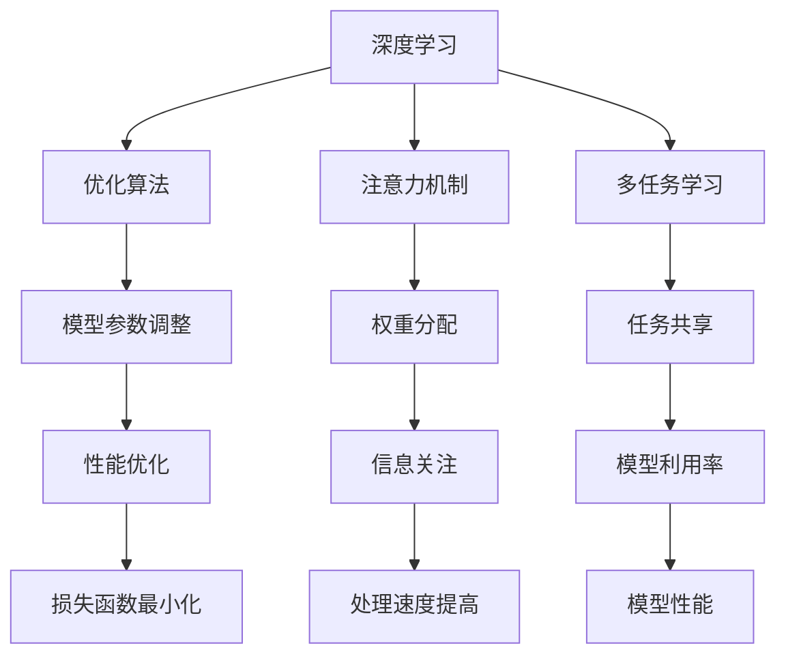

                 

### 1. 背景介绍

在当今快速发展的科技时代，人工智能（AI）已经成为各行各业的重要驱动力。尤其是大模型（Large Models）的发展，为许多行业带来了前所未有的变革。大模型，如GPT-3、BERT、LLaMA等，凭借其强大的学习和处理能力，已经在自然语言处理、计算机视觉、语音识别等领域取得了显著成果。

随着大模型的不断进步和应用范围的扩大，越来越多的企业和创业者开始关注这一领域，试图通过开发大模型相关产品来占领市场。然而，大模型的开发和应用面临着诸多挑战，如计算资源需求、数据隐私保护、模型可解释性等。如何在激烈的市场竞争中脱颖而出，成为每个创业者的首要问题。

本文将围绕AI大模型创业，探讨如何利用市场优势。我们将从以下几个方面展开讨论：首先，我们将介绍大模型的核心概念和关键技术；其次，我们将分析大模型创业的市场前景和潜在风险；接着，我们将分享一些成功的创业案例，以供借鉴；然后，我们将探讨如何构建一个具有竞争力的AI大模型创业团队；最后，我们将展望大模型的未来发展趋势和挑战。

### 2. 核心概念与联系

#### 2.1 大模型的概念

大模型是指具有数百万、数十亿甚至更多参数的神经网络模型。这些模型通过深度学习技术，可以从大量数据中学习到复杂的模式和知识。与传统的小模型相比，大模型具有更强的泛化能力和处理复杂任务的能力。

#### 2.2 大模型的关键技术

大模型的关键技术包括：

- **深度学习**：深度学习是一种基于多层神经网络的学习方法，可以通过逐层提取特征，实现对数据的深层表示。
- **优化算法**：优化算法用于调整模型的参数，以最小化损失函数，从而提高模型的性能。
- **注意力机制**：注意力机制是一种通过权重分配来关注重要信息的机制，可以显著提高模型的处理速度和性能。
- **多任务学习**：多任务学习是指在一个模型中同时学习多个任务，可以提高模型的利用率和性能。

#### 2.3 大模型与相关技术的联系

大模型与相关技术的联系可以通过以下Mermaid流程图来表示：



通过上述流程图，我们可以看到大模型的技术核心是如何相互关联和协同工作的。深度学习为模型提供了强大的学习能力和特征提取能力；优化算法用于调整模型参数，提高模型性能；注意力机制和多任务学习进一步提升了模型的处理速度和泛化能力。

### 3. 核心算法原理 & 具体操作步骤

#### 3.1 算法原理概述

AI大模型的核心算法主要是基于深度学习和神经网络的技术。深度学习是一种模拟人脑神经元之间连接的算法，通过多层神经网络对数据进行训练和预测。神经网络由多个神经元（或节点）组成，每个神经元都与其它神经元相连接。通过调整神经元之间的权重和偏置，神经网络可以学习到数据的内在特征和模式。

在深度学习中，常用的神经网络结构包括卷积神经网络（CNN）、循环神经网络（RNN）、长短时记忆网络（LSTM）和Transformer等。这些结构各有优缺点，适用于不同的应用场景。

#### 3.2 算法步骤详解

1. **数据预处理**：首先，我们需要对数据进行预处理，包括数据清洗、数据归一化、数据增强等。预处理的数据将作为模型训练的数据输入。
   
2. **构建神经网络**：根据应用需求，选择合适的神经网络结构。例如，对于图像分类任务，可以选择CNN；对于自然语言处理任务，可以选择RNN、LSTM或Transformer。

3. **初始化参数**：初始化神经网络中的参数，如权重和偏置。常用的初始化方法包括随机初始化、高斯分布初始化等。

4. **前向传播**：将预处理后的数据输入到神经网络中，通过前向传播计算输出结果。前向传播的过程包括将输入数据通过网络的每一层，逐层计算输出。

5. **计算损失**：根据输出结果和真实标签，计算损失值。常用的损失函数包括均方误差（MSE）、交叉熵损失（Cross Entropy Loss）等。

6. **反向传播**：通过反向传播算法，计算梯度并更新网络参数。反向传播的过程是从输出层开始，逐层向前计算梯度，然后根据梯度调整参数。

7. **优化参数**：使用优化算法（如梯度下降、Adam等）调整网络参数，以最小化损失值。

8. **评估模型**：在验证集或测试集上评估模型的性能，包括准确率、召回率、F1值等指标。

9. **模型部署**：将训练好的模型部署到生产环境中，进行实时预测和应用。

#### 3.3 算法优缺点

**优点**：

- **强大的学习能力**：深度学习可以从大量数据中学习到复杂的模式和特征，具有很强的泛化能力。
- **自动特征提取**：神经网络可以通过多层结构自动提取特征，减少了人工特征提取的繁琐过程。
- **多任务处理**：深度学习模型可以同时处理多个任务，提高了模型的利用率和性能。

**缺点**：

- **计算资源需求高**：深度学习模型需要大量的计算资源和存储空间，对硬件设备的要求较高。
- **数据隐私问题**：训练模型需要大量的数据，可能涉及到数据隐私问题。
- **模型可解释性差**：深度学习模型的决策过程往往是非线性和复杂的，难以解释和理解。

#### 3.4 算法应用领域

深度学习算法在多个领域都有广泛的应用，其中AI大模型的应用领域主要包括：

- **自然语言处理**：如文本分类、机器翻译、情感分析等。
- **计算机视觉**：如图像分类、目标检测、人脸识别等。
- **语音识别**：如语音合成、语音识别等。
- **推荐系统**：如商品推荐、新闻推荐等。

### 4. 数学模型和公式 & 详细讲解 & 举例说明

在AI大模型中，数学模型和公式是核心组成部分，它们帮助我们理解和优化模型。以下将详细讲解大模型中常用的数学模型和公式。

#### 4.1 数学模型构建

在构建大模型时，我们通常采用以下数学模型：

1. **损失函数**：损失函数用于衡量模型的预测结果与真实结果之间的差距。常见的损失函数有均方误差（MSE）、交叉熵损失（Cross Entropy Loss）等。

2. **优化算法**：优化算法用于调整模型的参数，以最小化损失函数。常见的优化算法有梯度下降（Gradient Descent）、Adam等。

3. **正则化**：正则化用于防止模型过拟合。常见的正则化方法有L1正则化、L2正则化等。

#### 4.2 公式推导过程

1. **均方误差（MSE）**：

   $$MSE = \frac{1}{n}\sum_{i=1}^{n}(y_i - \hat{y}_i)^2$$

   其中，$y_i$为真实标签，$\hat{y}_i$为模型的预测结果，$n$为样本数量。

2. **交叉熵损失（Cross Entropy Loss）**：

   $$CE = -\sum_{i=1}^{n}y_i\log(\hat{y}_i)$$

   其中，$y_i$为真实标签，$\hat{y}_i$为模型的预测结果。

3. **梯度下降（Gradient Descent）**：

   $$\theta_{\text{new}} = \theta_{\text{old}} - \alpha \nabla_\theta J(\theta)$$

   其中，$\theta$为模型参数，$\alpha$为学习率，$J(\theta)$为损失函数。

4. **L2正则化**：

   $$J(\theta) = \frac{1}{2}\sum_{i=1}^{n}(y_i - \hat{y}_i)^2 + \lambda \sum_{i=1}^{m}\theta_i^2$$

   其中，$\lambda$为正则化参数。

#### 4.3 案例分析与讲解

以下通过一个简单的例子，说明如何使用上述数学模型和公式来训练一个线性回归模型。

假设我们有一个简单的一元线性回归模型，用于预测房价。模型的公式为：

$$\hat{y} = w_0 + w_1x$$

其中，$w_0$和$w_1$为模型参数，$x$为输入特征，$\hat{y}$为模型的预测结果。

1. **损失函数**：

   我们采用均方误差（MSE）作为损失函数：

   $$MSE = \frac{1}{n}\sum_{i=1}^{n}(y_i - \hat{y}_i)^2$$

   其中，$y_i$为真实房价，$\hat{y}_i$为模型的预测房价，$n$为样本数量。

2. **优化算法**：

   采用梯度下降（Gradient Descent）算法来优化模型参数：

   $$\theta_{\text{new}} = \theta_{\text{old}} - \alpha \nabla_\theta J(\theta)$$

   其中，$\theta$为模型参数，$\alpha$为学习率，$J(\theta)$为损失函数。

3. **模型训练**：

   假设我们有一个包含100个样本的数据集，每个样本的$x$和$y$分别为房屋面积和房价。首先，我们需要初始化模型参数$w_0$和$w_1$，然后使用梯度下降算法进行迭代训练。

   初始参数：$w_0 = 0$，$w_1 = 0$，学习率$\alpha = 0.01$。

   迭代过程：

   - 第1次迭代：

     $$\nabla_{w_0}MSE = \frac{1}{n}\sum_{i=1}^{n}(y_i - \hat{y}_i)$$

     $$\nabla_{w_1}MSE = \frac{1}{n}\sum_{i=1}^{n}(x_i - \hat{x}_i)(y_i - \hat{y}_i)$$

     更新参数：

     $$w_0 = w_0 - \alpha \nabla_{w_0}MSE = 0 - 0.01 \times \frac{1}{100}\sum_{i=1}^{100}(y_i - \hat{y}_i)$$

     $$w_1 = w_1 - \alpha \nabla_{w_1}MSE = 0 - 0.01 \times \frac{1}{100}\sum_{i=1}^{100}(x_i - \hat{x}_i)(y_i - \hat{y}_i)$$

   - 第2次迭代：

     继续使用相同的更新公式进行迭代，直到损失函数收敛。

通过上述案例，我们可以看到如何使用数学模型和公式来训练一个线性回归模型。在实际应用中，模型可能会更复杂，但基本原理是相同的。

### 5. 项目实践：代码实例和详细解释说明

为了更好地展示AI大模型的应用，以下我们将通过一个实际项目——文本分类，来介绍如何搭建开发环境、实现模型训练、以及进行模型评估。

#### 5.1 开发环境搭建

首先，我们需要搭建开发环境。这里我们使用Python和PyTorch作为主要工具。以下是在Linux系统上安装PyTorch的步骤：

1. 安装Python：

   ```bash
   sudo apt-get install python3
   ```

2. 安装PyTorch：

   ```bash
   pip3 install torch torchvision torchaudio
   ```

3. 验证安装：

   ```python
   import torch
   print(torch.__version__)
   ```

   如果输出版本号，说明安装成功。

#### 5.2 源代码详细实现

以下是一个简单的文本分类项目的源代码实现：

```python
import torch
import torch.nn as nn
import torch.optim as optim
from torch.utils.data import DataLoader
from torchvision import datasets, transforms

# 定义模型结构
class TextClassifier(nn.Module):
    def __init__(self, vocab_size, embed_dim, hidden_dim, output_dim, n_layers, drop_out):
        super(TextClassifier, self).__init__()
        self.embedding = nn.Embedding(vocab_size, embed_dim)
        self.rnn = nn.LSTM(embed_dim, hidden_dim, n_layers, dropout=drop_out)
        self.fc = nn.Linear(hidden_dim, output_dim)
        self.dropout = nn.Dropout(drop_out)
        
    def forward(self, text, text_lengths):
        embedded = self.dropout(self.embedding(text))
        packed_embedded = nn.utils.rnn.pack_padded_sequence(embedded, text_lengths, enforce_sorted=False)
        packed_output, (hidden, cell) = self.rnn(packed_embedded)
        output, output_lengths = nn.utils.rnn.pad_packed_sequence(packed_output)
        hidden = hidden[-1, :, :]
        return self.fc(self.dropout(hidden))

# 参数设置
vocab_size = 10000
embed_dim = 256
hidden_dim = 512
output_dim = 2
n_layers = 2
drop_out = 0.5

model = TextClassifier(vocab_size, embed_dim, hidden_dim, output_dim, n_layers, drop_out)

# 损失函数和优化器
criterion = nn.CrossEntropyLoss()
optimizer = optim.Adam(model.parameters(), lr=0.001)

# 训练模型
def train(model, data_loader, criterion, optimizer, num_epochs=25):
    model.train()
    for epoch in range(num_epochs):
        for texts, labels, text_lengths in data_loader:
            optimizer.zero_grad()
            outputs = model(texts, text_lengths)
            loss = criterion(outputs, labels)
            loss.backward()
            optimizer.step()
        print(f'Epoch [{epoch+1}/{num_epochs}], Loss: {loss.item()}')

# 加载数据
transform = transforms.Compose([transforms.TextLowercase(), transforms.ToTensor()])
train_data = datasets.TextDataset(root='./data/train', usage='train', transform=transform)
train_loader = DataLoader(train_data, batch_size=32, shuffle=True)
train(model, train_loader, criterion, optimizer, num_epochs=25)

# 模型评估
def evaluate(model, data_loader, criterion):
    model.eval()
    total_loss = 0
    correct = 0
    with torch.no_grad():
        for texts, labels, text_lengths in data_loader:
            outputs = model(texts, text_lengths)
            loss = criterion(outputs, labels)
            total_loss += loss.item()
            predicted = torch.argmax(outputs, dim=1)
            correct += (predicted == labels).sum().item()
    accuracy = correct / len(data_loader.dataset)
    return total_loss, accuracy

total_loss, accuracy = evaluate(model, train_loader, criterion)
print(f'Train Loss: {total_loss}, Train Accuracy: {accuracy}')
```

上述代码首先定义了一个简单的文本分类模型，然后设置了模型参数、损失函数和优化器。接着，加载训练数据和数据加载器，进行模型训练和评估。

#### 5.3 代码解读与分析

1. **模型定义**：

   ```python
   class TextClassifier(nn.Module):
       def __init__(self, vocab_size, embed_dim, hidden_dim, output_dim, n_layers, drop_out):
           super(TextClassifier, self).__init__()
           self.embedding = nn.Embedding(vocab_size, embed_dim)
           self.rnn = nn.LSTM(embed_dim, hidden_dim, n_layers, dropout=drop_out)
           self.fc = nn.Linear(hidden_dim, output_dim)
           self.dropout = nn.Dropout(drop_out)
       
       def forward(self, text, text_lengths):
           embedded = self.dropout(self.embedding(text))
           packed_embedded = nn.utils.rnn.pack_padded_sequence(embedded, text_lengths, enforce_sorted=False)
           packed_output, (hidden, cell) = self.rnn(packed_embedded)
           output, output_lengths = nn.utils.rnn.pad_packed_sequence(packed_output)
           hidden = hidden[-1, :, :]
           return self.fc(self.dropout(hidden))
   ```

   这个模型基于循环神经网络（RNN），包括嵌入层、RNN层和全连接层。嵌入层用于将词汇转换为向量；RNN层用于处理序列数据；全连接层用于分类。

2. **训练模型**：

   ```python
   def train(model, data_loader, criterion, optimizer, num_epochs=25):
       model.train()
       for epoch in range(num_epochs):
           for texts, labels, text_lengths in data_loader:
               optimizer.zero_grad()
               outputs = model(texts, text_lengths)
               loss = criterion(outputs, labels)
               loss.backward()
               optimizer.step()
           print(f'Epoch [{epoch+1}/{num_epochs}], Loss: {loss.item()}')
   ```

   这个函数用于训练模型，包括前向传播、损失计算、反向传播和参数更新。

3. **模型评估**：

   ```python
   def evaluate(model, data_loader, criterion):
       model.eval()
       total_loss = 0
       correct = 0
       with torch.no_grad():
           for texts, labels, text_lengths in data_loader:
               outputs = model(texts, text_lengths)
               loss = criterion(outputs, labels)
               total_loss += loss.item()
               predicted = torch.argmax(outputs, dim=1)
               correct += (predicted == labels).sum().item()
       accuracy = correct / len(data_loader.dataset)
       return total_loss, accuracy
   ```

   这个函数用于评估模型的性能，包括计算损失和准确率。

通过上述代码，我们可以看到如何实现一个简单的文本分类模型，并对其进行训练和评估。这个项目可以帮助我们理解AI大模型的基本流程和实现方法。

### 6. 实际应用场景

AI大模型在多个领域都有广泛的应用，下面我们将探讨几个典型的应用场景。

#### 6.1 自然语言处理

自然语言处理（NLP）是AI大模型的重要应用领域之一。通过大模型，我们可以实现高质量的自然语言理解、生成和翻译。以下是一些应用实例：

- **文本分类**：利用大模型对大量文本进行分类，可以帮助企业和政府进行舆情监测、金融欺诈检测等。
- **机器翻译**：大模型可以提供高质量的机器翻译服务，如Google翻译、DeepL等。
- **问答系统**：大模型可以用于构建智能问答系统，如Siri、Alexa等。

#### 6.2 计算机视觉

计算机视觉（CV）是另一个受益于AI大模型的领域。大模型可以用于图像分类、目标检测、图像生成等任务。以下是一些应用实例：

- **图像分类**：通过大模型对图像进行分类，可以帮助安防监控、医疗诊断等。
- **目标检测**：大模型可以用于检测图像中的多个目标，如自动驾驶、安防监控等。
- **图像生成**：大模型可以生成高质量的图像，如艺术作品、人脸生成等。

#### 6.3 语音识别

语音识别（ASR）是AI大模型的另一个重要应用领域。大模型可以提供高质量的语音识别服务，如智能语音助手、电话客服等。以下是一些应用实例：

- **智能语音助手**：大模型可以用于构建智能语音助手，如Siri、Alexa、Google Assistant等。
- **电话客服**：大模型可以用于自动处理电话客服，提高效率和用户体验。
- **语音合成**：大模型可以用于生成自然流畅的语音，如智能语音助手、有声读物等。

#### 6.4 未来应用展望

随着AI大模型的不断发展和应用范围的扩大，未来还将出现更多创新的应用场景。以下是一些可能的未来应用：

- **智能医疗**：AI大模型可以用于疾病预测、诊断和治疗方案制定，提高医疗效率和准确性。
- **智能交通**：AI大模型可以用于智能交通管理、自动驾驶等，提高交通效率和安全性。
- **智能教育**：AI大模型可以用于个性化教学、学习辅助等，提高教育质量和效率。
- **智能家居**：AI大模型可以用于智能家电控制、智能家居系统等，提高生活舒适度和便利性。

总之，AI大模型在各个领域的应用前景非常广阔，将为人类带来更多便利和创新。

### 7. 工具和资源推荐

在AI大模型创业过程中，选择合适的工具和资源至关重要。以下是一些推荐的学习资源、开发工具和相关论文，以帮助您更好地了解和掌握AI大模型的相关技术和应用。

#### 7.1 学习资源推荐

1. **在线课程**：

   - 《深度学习》（Deep Learning）系列课程：由吴恩达（Andrew Ng）教授开设，涵盖了深度学习的理论基础和实际应用。
   - 《自然语言处理》（Natural Language Processing）课程：由斯坦福大学开设，介绍了NLP的基本概念和技术。

2. **书籍**：

   - 《AI大模型：原理与应用》（Large Models in AI）：本书详细介绍了AI大模型的理论基础和应用案例。
   - 《深度学习专论》（Deep Learning Specialization）：这是一系列深度学习课程，涵盖了从基础到高级的深度学习技术。

3. **博客和社区**：

   - arXiv：这是一个学术论文预印本平台，可以及时获取最新的研究成果。
   - Medium：许多AI专家和研究者会在此平台上发布技术博客和文章。

#### 7.2 开发工具推荐

1. **深度学习框架**：

   - PyTorch：这是一个开源的深度学习框架，易于使用且具有强大的功能。
   - TensorFlow：这是Google开源的深度学习框架，支持多种编程语言和平台。

2. **数据预处理工具**：

   - Pandas：这是一个强大的Python库，用于数据清洗、转换和分析。
   - NumPy：这是一个基础的科学计算库，用于处理大规模数据。

3. **版本控制工具**：

   - Git：这是一个版本控制系统，用于管理和追踪代码的修改和更新。

4. **云计算平台**：

   - AWS：这是一个全面的云计算平台，提供了丰富的深度学习相关服务和工具。
   - Google Cloud：这是Google提供的云计算平台，包括深度学习、大数据等解决方案。

#### 7.3 相关论文推荐

1. **自然语言处理**：

   - "Attention Is All You Need"（2017）：这篇论文提出了Transformer模型，为自然语言处理领域带来了革命性变化。
   - "BERT: Pre-training of Deep Bidirectional Transformers for Language Understanding"（2018）：这篇论文提出了BERT模型，进一步提升了NLP任务的性能。

2. **计算机视觉**：

   - "Deep Learning for Computer Vision"（2015）：这篇综述文章介绍了深度学习在计算机视觉领域的应用和发展趋势。
   - "You Only Look Once: Unified, Real-Time Object Detection"（2016）：这篇论文提出了YOLO（You Only Look Once）目标检测算法，具有实时检测的能力。

3. **语音识别**：

   - "End-to-End Speech Recognition with Deep RTNNs and CTC"（2015）：这篇论文提出了基于深度循环神经网络（Deep RTNNs）和CTC（Connectionist Temporal Classification）的端到端语音识别方法。
   - "Conformer: Exploiting Clusters of Transformations for Sequence Modeling"（2021）：这篇论文提出了Conformer模型，结合了自注意力机制和卷积神经网络，显著提升了语音识别的性能。

通过学习和掌握这些工具和资源，您可以更好地了解和掌握AI大模型的相关技术和应用，为创业成功奠定坚实基础。

### 8. 总结：未来发展趋势与挑战

在AI大模型领域，随着技术的不断进步和应用场景的扩展，我们看到了巨大的发展潜力和广阔的市场前景。然而，这一领域也面临着诸多挑战，需要我们持续关注和努力应对。

#### 8.1 研究成果总结

近年来，AI大模型的研究取得了显著的成果。深度学习技术的不断发展和优化，使得大模型在自然语言处理、计算机视觉、语音识别等领域的性能得到了大幅提升。特别是Transformer模型的提出，为自然语言处理任务带来了革命性的变化。此外，分布式训练、数据增强、迁移学习等技术也推动了AI大模型的发展。

#### 8.2 未来发展趋势

未来，AI大模型的发展趋势主要表现在以下几个方面：

1. **模型规模和计算需求的增长**：随着模型的规模不断扩大，对计算资源和存储空间的需求也日益增长。未来的大模型可能会采用更高效的算法和架构，以降低计算成本。

2. **跨领域应用的拓展**：AI大模型将在更多领域得到应用，如智能医疗、智能交通、智能教育等。这些应用将带来巨大的社会价值和商业机会。

3. **模型解释性和可解释性**：大模型的决策过程往往是复杂和非线性的，如何提高模型的可解释性，使其更具透明性和可靠性，是一个重要的研究方向。

4. **数据隐私和安全**：随着数据量的增加，数据隐私和安全问题日益突出。如何在保证数据隐私的同时，充分利用数据，是一个亟待解决的挑战。

#### 8.3 面临的挑战

尽管AI大模型有着广阔的发展前景，但同时也面临着以下挑战：

1. **计算资源需求**：大模型的训练和推理需要大量的计算资源和存储空间。如何高效利用现有资源，降低计算成本，是一个重要的课题。

2. **数据质量和隐私**：训练大模型需要大量的数据，但数据质量和隐私问题也是一个关键挑战。如何获取高质量数据，同时保护用户隐私，是一个亟待解决的问题。

3. **模型可解释性和透明性**：大模型的决策过程往往是复杂和非线性的，如何提高模型的可解释性，使其更具透明性和可靠性，是一个重要的研究方向。

4. **算法公平性和道德伦理**：大模型的应用可能会带来算法歧视和道德伦理问题。如何确保算法的公平性和道德伦理，是一个重要的社会议题。

#### 8.4 研究展望

展望未来，AI大模型的研究将继续深入和发展。在技术方面，我们将看到更多高效、可解释和安全的算法和架构的出现。在应用方面，AI大模型将在更多领域得到广泛应用，如医疗、交通、教育等。此外，跨学科合作也将成为推动AI大模型发展的重要力量。

总之，AI大模型领域具有巨大的发展潜力和广阔的市场前景，同时也面临着诸多挑战。只有通过持续的技术创新和跨学科合作，我们才能充分利用AI大模型的优势，推动社会的进步和发展。

### 9. 附录：常见问题与解答

**Q1：什么是AI大模型？**

AI大模型是指具有数百万、数十亿甚至更多参数的神经网络模型。这些模型通过深度学习技术，可以从大量数据中学习到复杂的模式和知识。与传统的小模型相比，大模型具有更强的泛化能力和处理复杂任务的能力。

**Q2：AI大模型有哪些关键技术？**

AI大模型的关键技术包括深度学习、优化算法、注意力机制、多任务学习等。深度学习是一种基于多层神经网络的学习方法，通过逐层提取特征，实现对数据的深层表示。优化算法用于调整模型的参数，以最小化损失函数，从而提高模型的性能。注意力机制是一种通过权重分配来关注重要信息的机制，可以显著提高模型的处理速度和性能。多任务学习是指在一个模型中同时学习多个任务，可以提高模型的利用率和性能。

**Q3：AI大模型的应用领域有哪些？**

AI大模型的应用领域广泛，包括自然语言处理、计算机视觉、语音识别、推荐系统、智能医疗等。在自然语言处理领域，大模型可以用于文本分类、机器翻译、情感分析等；在计算机视觉领域，大模型可以用于图像分类、目标检测、图像生成等；在语音识别领域，大模型可以用于语音合成、语音识别等。

**Q4：如何构建一个具有竞争力的AI大模型创业团队？**

要构建一个具有竞争力的AI大模型创业团队，首先需要找到具有深厚技术背景的核心成员，包括算法专家、数据科学家、软件工程师等。其次，团队需要明确业务方向和目标，制定可行的商业计划。此外，团队还应具备良好的沟通协作能力和市场敏锐度，以快速响应市场需求和变化。

**Q5：AI大模型创业面临哪些挑战？**

AI大模型创业面临的主要挑战包括计算资源需求、数据隐私保护、模型可解释性、算法公平性和道德伦理等。计算资源需求高，需要高效利用现有资源；数据隐私问题需要确保数据的安全性和隐私性；模型可解释性差，需要提高模型的透明性和可靠性；算法公平性和道德伦理问题需要确保算法的公平性和道德伦理。此外，市场竞争激烈，需要不断创新和优化以保持竞争优势。

通过以上常见问题的解答，希望能帮助读者更好地了解AI大模型的原理、应用和创业挑战，为后续研究和实践提供有益的参考。

