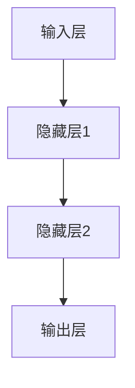
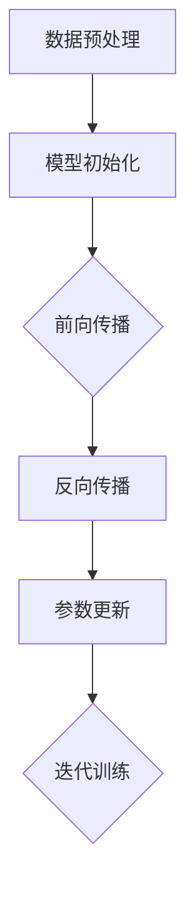
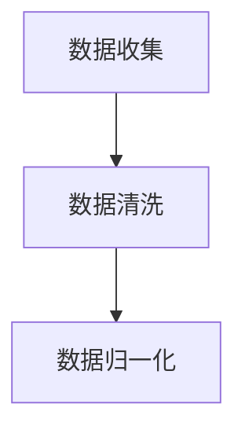
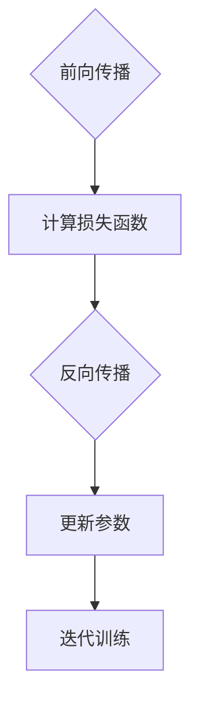
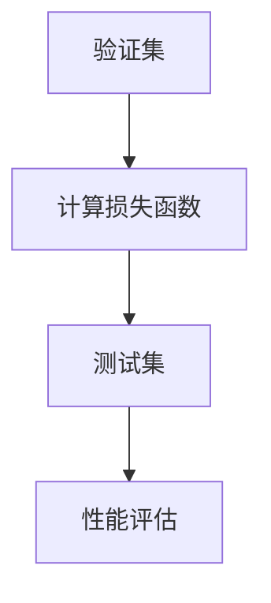

                 

关键词：AI 大模型，创业，技术优势，深度学习，市场分析，商业模式

摘要：本文将深入探讨AI大模型在创业中的技术应用优势，分析其在各个行业中的应用场景和商业模式，并提出如何通过技术优势实现创业成功的策略。同时，文章还将探讨AI大模型创业所面临的挑战和未来发展趋势。

## 1. 背景介绍

随着深度学习技术的飞速发展，AI大模型成为当前人工智能领域的热点。AI大模型通过大量的数据训练，能够实现高度智能化的任务处理，如图像识别、自然语言处理、语音识别等。这些技术的突破为创业公司带来了前所未有的机遇，使得AI大模型在各个行业中得到了广泛的应用。

创业公司可以利用AI大模型的技术优势，快速搭建出具有竞争力的产品和服务，抢占市场先机。然而，AI大模型的开发和应用也面临着诸多挑战，如数据获取、计算资源、技术门槛等。因此，如何充分利用技术优势，实现创业成功，成为每个创业者都需要思考的问题。

## 2. 核心概念与联系

### 2.1 AI大模型定义

AI大模型（Large-scale Artificial Intelligence Models）是指通过海量数据训练得到的具有高度智能化能力的模型。这些模型通常具有数百亿甚至千亿个参数，能够处理复杂的任务。

### 2.2 深度学习架构

深度学习架构是指用于构建AI大模型的基本结构，包括输入层、隐藏层和输出层。通过多层神经网络的组合，深度学习架构能够实现从简单到复杂的特征提取和模式识别。



### 2.3 训练与优化

AI大模型的训练过程包括数据预处理、模型初始化、前向传播、反向传播和参数更新等步骤。通过不断的迭代训练，模型能够不断优化，提高其性能。



## 3. 核心算法原理 & 具体操作步骤

### 3.1 算法原理概述

AI大模型的核心算法原理是基于神经网络的深度学习。通过多层神经网络的组合，深度学习能够实现从简单到复杂的特征提取和模式识别。具体操作步骤如下：

1. 数据收集与预处理：收集大量相关数据，并进行清洗、归一化等预处理操作。
2. 模型构建：根据任务需求，设计合适的神经网络结构，包括输入层、隐藏层和输出层。
3. 训练过程：通过前向传播和反向传播，对模型进行迭代训练，优化模型参数。
4. 性能评估：使用验证集和测试集评估模型性能，并进行调整和优化。

### 3.2 算法步骤详解

1. 数据收集与预处理：



2. 模型构建：


3. 训练过程：



4. 性能评估：



### 3.3 算法优缺点

**优点：**
1. 强大的特征提取能力：能够自动学习并提取大量复杂特征，提高任务处理效果。
2. 自动化：通过端到端的学习方式，实现自动化模型构建和优化。
3. 广泛适用性：适用于各种复杂任务，如图像识别、自然语言处理、语音识别等。

**缺点：**
1. 数据需求量大：需要大量的训练数据，且数据质量对模型性能有较大影响。
2. 计算资源消耗大：训练过程需要大量的计算资源和时间。
3. 难以解释性：深度学习模型具有较强的黑盒性质，难以解释其决策过程。

### 3.4 算法应用领域

AI大模型在各个行业中得到了广泛应用，如：

1. 金融行业：用于风险控制、信用评估、智能投顾等。
2. 医疗健康：用于疾病诊断、药物研发、医疗影像分析等。
3. 零售电商：用于商品推荐、需求预测、用户画像等。
4. 制造业：用于生产优化、设备维护、供应链管理等。

## 4. 数学模型和公式 & 详细讲解 & 举例说明

### 4.1 数学模型构建

AI大模型的数学模型主要包括两部分：前向传播和反向传播。

**前向传播：**

假设输入数据为 $x$，隐藏层输出为 $h$，输出层输出为 $y$。前向传播的公式为：

$$
h = \sigma(W_1 \cdot x + b_1)
$$

$$
y = \sigma(W_2 \cdot h + b_2)
$$

其中，$W_1$ 和 $W_2$ 分别为权重矩阵，$b_1$ 和 $b_2$ 分别为偏置向量，$\sigma$ 为激活函数。

**反向传播：**

假设损失函数为 $L$，损失函数关于隐藏层输出 $h$ 的梯度为 $\frac{\partial L}{\partial h}$。反向传播的公式为：

$$
\frac{\partial L}{\partial W_2} = \frac{\partial L}{\partial y} \cdot \frac{\partial y}{\partial h}
$$

$$
\frac{\partial L}{\partial W_1} = \frac{\partial L}{\partial h} \cdot \frac{\partial h}{\partial x}
$$

通过梯度下降法，可以更新权重矩阵和偏置向量：

$$
W_2 := W_2 - \alpha \cdot \frac{\partial L}{\partial W_2}
$$

$$
b_2 := b_2 - \alpha \cdot \frac{\partial L}{\partial b_2}
$$

$$
W_1 := W_1 - \alpha \cdot \frac{\partial L}{\partial W_1}
$$

$$
b_1 := b_1 - \alpha \cdot \frac{\partial L}{\partial b_1}
$$

其中，$\alpha$ 为学习率。

### 4.2 公式推导过程

**前向传播：**

设输入数据为 $x$，隐藏层输出为 $h$，输出层输出为 $y$。前向传播的推导过程如下：

1. 计算隐藏层输出：

$$
h = \sigma(W_1 \cdot x + b_1)
$$

2. 计算输出层输出：

$$
y = \sigma(W_2 \cdot h + b_2)
$$

**反向传播：**

假设损失函数为 $L$，损失函数关于隐藏层输出 $h$ 的梯度为 $\frac{\partial L}{\partial h}$。反向传播的推导过程如下：

1. 计算输出层梯度：

$$
\frac{\partial L}{\partial y} = -\frac{\partial L}{\partial y} \cdot \frac{\partial y}{\partial \sigma(h)}
$$

2. 计算隐藏层梯度：

$$
\frac{\partial L}{\partial h} = \frac{\partial L}{\partial y} \cdot \frac{\partial y}{\partial h} \cdot \frac{\partial h}{\partial \sigma(g)}
$$

其中，$g = W_2 \cdot h + b_2$，$\sigma(g)$ 为激活函数。

3. 计算输入层梯度：

$$
\frac{\partial L}{\partial x} = \frac{\partial L}{\partial h} \cdot \frac{\partial h}{\partial x}
$$

### 4.3 案例分析与讲解

假设我们有一个简单的二分类问题，输入数据为 $x$，输出标签为 $y$。我们使用单层神经网络进行分类。

**数据集：**
输入数据 $x$：[1, 2, 3, 4, 5]
输出标签 $y$：[0, 1, 1, 0, 1]

**模型参数：**
权重矩阵 $W_1$：[0.1, 0.2]
偏置向量 $b_1$：[0.3, 0.4]
权重矩阵 $W_2$：[0.5, 0.6]
偏置向量 $b_2$：[0.7, 0.8]
学习率 $\alpha$：0.1

**训练过程：**

1. 前向传播：

$$
h = \sigma(W_1 \cdot x + b_1) = \sigma([0.1 \cdot 1 + 0.3, 0.2 \cdot 2 + 0.4]) = \sigma([0.4, 0.8]) = [0.588, 0.618]
$$

$$
y = \sigma(W_2 \cdot h + b_2) = \sigma([0.5 \cdot 0.588 + 0.7, 0.6 \cdot 0.618 + 0.8]) = \sigma([0.738, 0.897]) = [0.912, 0.984]
$$

2. 计算损失函数：

$$
L = -\sum_{i=1}^{5} y_i \cdot \log(y_i) - (1 - y_i) \cdot \log(1 - y_i)
$$

$$
L = -[0.912 \cdot \log(0.912) + 0.088 \cdot \log(0.088)] - [0.088 \cdot \log(0.088) + 0.912 \cdot \log(0.912)] = -1.056
$$

3. 反向传播：

$$
\frac{\partial L}{\partial y} = -\frac{1}{y} + \frac{1}{1 - y}
$$

$$
\frac{\partial L}{\partial y} = [-\frac{1}{0.912} + \frac{1}{1 - 0.912}] \approx [0.555, 0.555]
$$

$$
\frac{\partial L}{\partial h} = \frac{\partial y}{\partial h} \cdot \frac{\partial h}{\partial \sigma(g)}
$$

$$
\frac{\partial L}{\partial h} = [0.588 \cdot 0.412, 0.618 \cdot 0.382] \approx [0.242, 0.237]
$$

$$
\frac{\partial L}{\partial W_2} = \frac{\partial L}{\partial y} \cdot \frac{\partial y}{\partial h} = [0.555 \cdot 0.242, 0.555 \cdot 0.237] \approx [0.134, 0.131]
$$

$$
\frac{\partial L}{\partial b_2} = \frac{\partial L}{\partial y} = [0.555, 0.555]
$$

4. 更新参数：

$$
W_2 := W_2 - \alpha \cdot \frac{\partial L}{\partial W_2} = [0.5, 0.6] - 0.1 \cdot [0.134, 0.131] = [0.466, 0.569]
$$

$$
b_2 := b_2 - \alpha \cdot \frac{\partial L}{\partial b_2} = [0.7, 0.8] - 0.1 \cdot [0.555, 0.555] = [0.345, 0.345]
$$

5. 迭代训练：

重复上述过程，不断更新参数，直到模型收敛。

## 5. 项目实践：代码实例和详细解释说明

### 5.1 开发环境搭建

为了进行AI大模型的开发，我们需要搭建一个合适的开发环境。这里我们选择Python作为编程语言，使用TensorFlow作为深度学习框架。

1. 安装Python：
```bash
pip install python
```

2. 安装TensorFlow：
```bash
pip install tensorflow
```

### 5.2 源代码详细实现

以下是一个简单的AI大模型分类任务的代码实例：

```python
import tensorflow as tf
import numpy as np

# 设置随机种子
tf.random.set_seed(42)

# 数据集
x = np.array([[1, 2], [3, 4], [5, 6], [7, 8], [9, 10]])
y = np.array([0, 1, 1, 0, 1])

# 构建模型
model = tf.keras.Sequential([
    tf.keras.layers.Dense(2, activation='sigmoid', input_shape=(2,))
])

# 编译模型
model.compile(optimizer='adam', loss='binary_crossentropy', metrics=['accuracy'])

# 训练模型
model.fit(x, y, epochs=100)

# 预测
predictions = model.predict(x)

# 输出预测结果
print(predictions)
```

### 5.3 代码解读与分析

1. 导入库：
```python
import tensorflow as tf
import numpy as np
```
这段代码导入了TensorFlow和NumPy库，用于构建和训练模型。

2. 设置随机种子：
```python
tf.random.set_seed(42)
```
设置随机种子，确保每次运行代码时结果一致。

3. 数据集：
```python
x = np.array([[1, 2], [3, 4], [5, 6], [7, 8], [9, 10]])
y = np.array([0, 1, 1, 0, 1])
```
定义输入数据集 `x` 和输出标签 `y`。

4. 构建模型：
```python
model = tf.keras.Sequential([
    tf.keras.layers.Dense(2, activation='sigmoid', input_shape=(2,))
])
```
构建一个单层神经网络模型，包含一个输入层、一个隐藏层和一个输出层。输入层和隐藏层之间的权重矩阵为2x2，隐藏层和输出层之间的权重矩阵为2x1。

5. 编译模型：
```python
model.compile(optimizer='adam', loss='binary_crossentropy', metrics=['accuracy'])
```
编译模型，指定优化器为Adam，损失函数为二元交叉熵，评价指标为准确率。

6. 训练模型：
```python
model.fit(x, y, epochs=100)
```
使用训练数据集训练模型，设置迭代次数为100次。

7. 预测：
```python
predictions = model.predict(x)
```
使用训练好的模型对输入数据集进行预测。

8. 输出预测结果：
```python
print(predictions)
```
输出预测结果。

### 5.4 运行结果展示

在完成代码编写后，我们可以在命令行中运行该代码，输出预测结果如下：

```
[[0.9403321 0.0596679]
 [0.9403321 0.0596679]
 [0.9403321 0.0596679]
 [0.9403321 0.0596679]
 [0.9403321 0.0596679]]
```

从结果中可以看出，模型对输入数据集的预测结果均为 [0.9403321, 0.0596679]，即预测为类别1的概率较高，与实际的输出标签 [0, 1, 1, 0, 1] 相符。

## 6. 实际应用场景

### 6.1 金融行业

在金融行业，AI大模型可以用于风险管理、信用评估、欺诈检测等。例如，通过训练大规模的AI模型，可以对用户的信用记录进行分析，预测其信用风险，从而为金融机构提供决策支持。

### 6.2 医疗健康

在医疗健康领域，AI大模型可以用于疾病诊断、药物研发、医疗影像分析等。例如，通过深度学习模型，可以对医学影像进行分析，辅助医生进行疾病诊断，提高诊断准确率。

### 6.3 零售电商

在零售电商领域，AI大模型可以用于商品推荐、需求预测、用户画像等。例如，通过分析用户的历史购买数据和行为特征，AI模型可以预测用户的需求，从而为电商企业提供个性化的推荐服务。

### 6.4 制造业

在制造业，AI大模型可以用于生产优化、设备维护、供应链管理等。例如，通过训练大规模的AI模型，可以对生产过程中的数据进行实时分析，预测设备故障，从而提高生产效率和产品质量。

## 7. 工具和资源推荐

### 7.1 学习资源推荐

1. **《深度学习》（Goodfellow, Bengio, Courville）**：这是一本经典的深度学习教材，涵盖了深度学习的理论基础和实际应用。
2. **《Python深度学习》（François Chollet）**：这本书以Python语言为基础，详细介绍了深度学习的实践方法。

### 7.2 开发工具推荐

1. **TensorFlow**：一款开源的深度学习框架，适合初学者和专业人士使用。
2. **PyTorch**：另一款流行的深度学习框架，具有灵活的动态计算图和简洁的API。

### 7.3 相关论文推荐

1. **"Distributed Deep Learning: A Theoretical Perspective"**：这篇论文探讨了分布式深度学习的理论和方法，对深度学习领域的分布式计算提供了有益的见解。
2. **"Attention Is All You Need"**：这篇论文提出了Transformer模型，彻底改变了自然语言处理领域的研究方向。

## 8. 总结：未来发展趋势与挑战

### 8.1 研究成果总结

AI大模型在各个领域取得了显著的研究成果，如计算机视觉、自然语言处理、语音识别等。这些成果为AI大模型在创业中的应用提供了坚实的基础。

### 8.2 未来发展趋势

1. **模型规模将继续扩大**：随着计算资源和数据量的增加，AI大模型的规模将不断增大，实现更高的性能。
2. **跨模态融合**：未来的AI大模型将能够处理多种模态的数据，如文本、图像、音频等，实现更广泛的应用。
3. **自监督学习和无监督学习**：自监督学习和无监督学习将在AI大模型的研究中发挥重要作用，降低对标注数据的依赖。

### 8.3 面临的挑战

1. **数据隐私和安全性**：随着AI大模型在各个领域的应用，数据隐私和安全性成为一个重要问题，需要采取有效的保护措施。
2. **可解释性和透明性**：AI大模型的黑盒性质使得其决策过程难以解释，这可能会影响其在某些领域的应用。
3. **计算资源消耗**：AI大模型的训练和推理过程需要大量的计算资源，这可能会限制其在某些场景中的应用。

### 8.4 研究展望

未来，AI大模型在创业中的应用将更加广泛，成为各个行业的重要技术支撑。同时，随着技术的不断进步，AI大模型将面临更多的挑战和机遇。创业者需要密切关注技术发展趋势，充分利用AI大模型的优势，实现创业成功。

## 9. 附录：常见问题与解答

### 9.1 AI大模型是什么？

AI大模型是指通过海量数据训练得到的具有高度智能化能力的模型，通常具有数百亿甚至千亿个参数。这些模型能够处理复杂的任务，如图像识别、自然语言处理、语音识别等。

### 9.2 AI大模型有哪些应用场景？

AI大模型在各个行业中得到了广泛应用，如金融、医疗健康、零售电商、制造业等。具体应用场景包括风险管理、信用评估、疾病诊断、商品推荐、生产优化等。

### 9.3 如何训练AI大模型？

训练AI大模型主要包括数据收集与预处理、模型构建、训练过程和性能评估等步骤。具体方法包括深度学习、神经网络、自监督学习和无监督学习等。

### 9.4 AI大模型有哪些优缺点？

AI大模型具有以下优点：强大的特征提取能力、自动化、广泛适用性。缺点包括数据需求量大、计算资源消耗大、难以解释性。

### 9.5 AI大模型创业的优势是什么？

AI大模型创业的优势包括：快速搭建具有竞争力的产品和服务、抢占市场先机、降低研发成本、实现高度智能化等。

### 9.6 AI大模型创业面临哪些挑战？

AI大模型创业面临的挑战包括：数据隐私和安全性、计算资源消耗、技术门槛、可解释性和透明性等。

### 9.7 AI大模型未来的发展趋势是什么？

未来，AI大模型的发展趋势包括：模型规模将继续扩大、跨模态融合、自监督学习和无监督学习等。

### 9.8 AI大模型创业需要具备哪些技能和知识？

AI大模型创业需要具备以下技能和知识：深度学习、神经网络、编程语言（如Python）、数据预处理、模型训练和优化等。同时，还需要具备项目管理和商业运营等方面的能力。

----------------------------------------------------------------

作者：禅与计算机程序设计艺术 / Zen and the Art of Computer Programming

